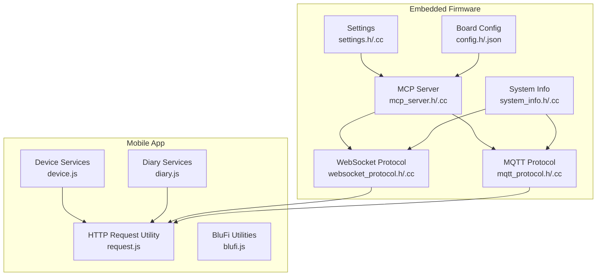
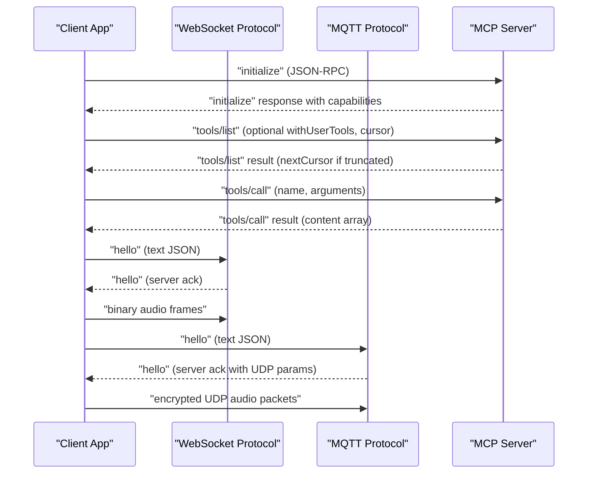
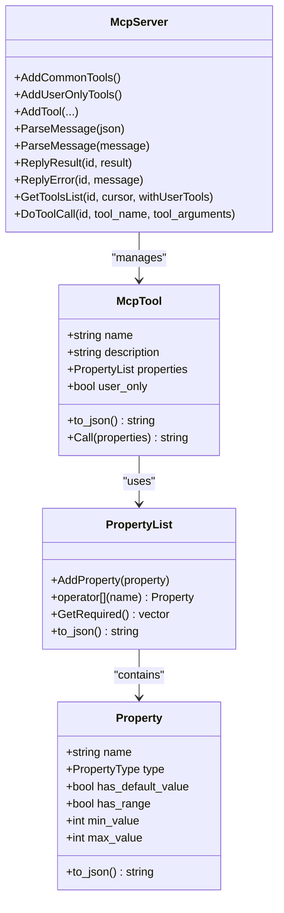
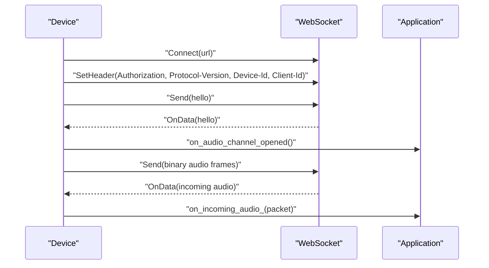
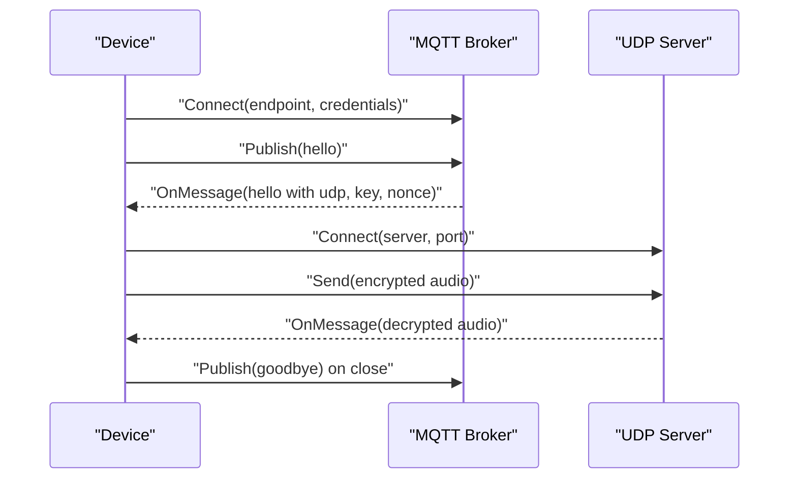
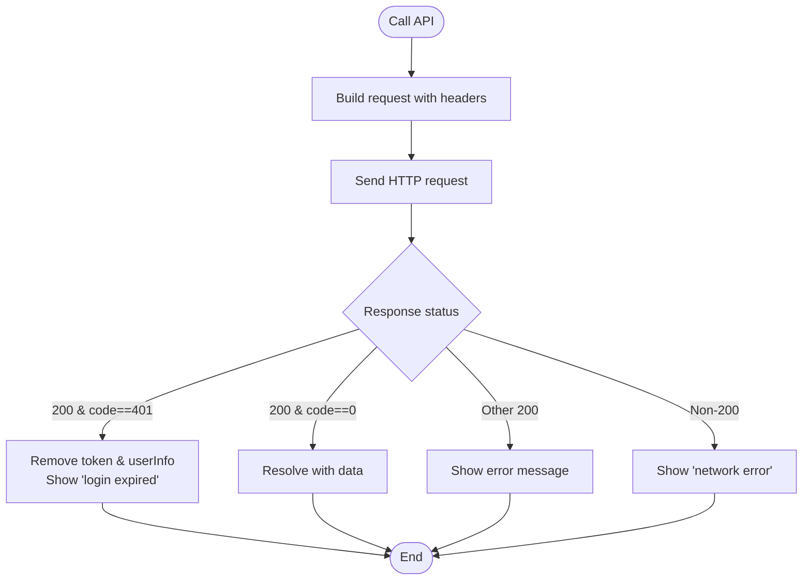
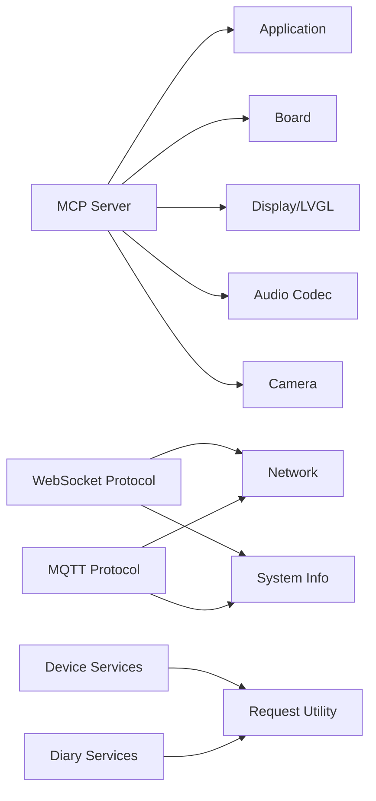

# API Reference

<cite>
**Referenced Files in This Document**
- [mcp_server.h](file://main/mcp_server.h)
- [mcp_server.cc](file://main/mcp_server.cc)
- [websocket_protocol.h](file://main/protocols/websocket_protocol.h)
- [websocket_protocol.cc](file://main/protocols/websocket_protocol.cc)
- [mqtt_protocol.h](file://main/protocols/mqtt_protocol.h)
- [mqtt_protocol.cc](file://main/protocols/mqtt_protocol.cc)
- [device.js](file://docs/xiaolu-mini/services/device.js)
- [diary.js](file://docs/xiaolu-mini/services/diary.js)
- [request.js](file://docs/xiaolu-mini/utils/request.js)
- [blufi.js](file://docs/xiaolu-mini/utils/blufi.js)
- [settings.h](file://main/settings.h)
- [settings.cc](file://main/settings.cc)
- [system_info.h](file://main/system_info.h)
- [system_info.cc](file://main/system_info.cc)
- [config.h](file://main/boards/lulu-esp32s3/config.h)
- [config.json](file://main/boards/lulu-esp32s3/config.json)
</cite>

## Table of Contents
1. [Introduction](#introduction)
2. [Project Structure](#project-structure)
3. [Core Components](#core-components)
4. [Architecture Overview](#architecture-overview)
5. [Detailed Component Analysis](#detailed-component-analysis)
6. [Dependency Analysis](#dependency-analysis)
7. [Performance Considerations](#performance-considerations)
8. [Troubleshooting Guide](#troubleshooting-guide)
9. [Conclusion](#conclusion)
10. [Appendices](#appendices)

## Introduction
This document provides comprehensive API documentation for:
- Embedded firmware interfaces implementing the Model Context Protocol (MCP) for tool invocation and capability negotiation
- Mobile app APIs for device management and diary services
- MCP protocol specification and message formats
- Hardware interface definitions and configuration parameters
- Transport protocols used by the device (WebSocket and MQTT) for audio streaming and control messages
- Security headers, rate limiting considerations, and performance optimization recommendations

It targets firmware engineers, mobile app developers, and integrators who need to implement clients, servers, or middleware that communicate with the embedded device.

## Project Structure
The repository organizes APIs and protocols across three primary areas:
- Embedded firmware APIs: MCP server, transport protocols, settings, and system info
- Mobile app APIs: HTTP endpoints and request utilities
- Hardware configuration: board-specific constants and JSON metadata

**Diagram sources**
- [mcp_server.h:314-342](file://main/mcp_server.h#L314-L342)
- [websocket_protocol.h:13-32](file://main/protocols/websocket_protocol.h#L13-L32)
- [mqtt_protocol.h:26-62](file://main/protocols/mqtt_protocol.h#L26-L62)
- [settings.h:7-26](file://main/settings.h#L7-L26)
- [system_info.h:9-22](file://main/system_info.h#L9-L22)
- [config.h:1-91](file://main/boards/lulu-esp32s3/config.h#L1-L91)
- [config.json:1-8](file://main/boards/lulu-esp32s3/config.json#L1-L8)
- [device.js:1-79](file://docs/xiaolu-mini/services/device.js#L1-L79)
- [diary.js:1-36](file://docs/xiaolu-mini/services/diary.js#L1-L36)
- [request.js:1-51](file://docs/xiaolu-mini/utils/request.js#L1-L51)
- [blufi.js:1-138](file://docs/xiaolu-mini/utils/blufi.js#L1-L138)

**Section sources**
- [mcp_server.h:1-345](file://main/mcp_server.h#L1-L345)
- [mcp_server.cc:1-581](file://main/mcp_server.cc#L1-L581)
- [websocket_protocol.h:1-35](file://main/protocols/websocket_protocol.h#L1-L35)
- [websocket_protocol.cc:1-255](file://main/protocols/websocket_protocol.cc#L1-L255)
- [mqtt_protocol.h:1-66](file://main/protocols/mqtt_protocol.h#L1-L66)
- [mqtt_protocol.cc:1-390](file://main/protocols/mqtt_protocol.cc#L1-L390)
- [device.js:1-79](file://docs/xiaolu-mini/services/device.js#L1-L79)
- [diary.js:1-36](file://docs/xiaolu-mini/services/diary.js#L1-L36)
- [request.js:1-51](file://docs/xiaolu-mini/utils/request.js#L1-L51)
- [blufi.js:1-138](file://docs/xiaolu-mini/utils/blufi.js#L1-L138)
- [settings.h:1-29](file://main/settings.h#L1-L29)
- [settings.cc:1-109](file://main/settings.cc#L1-L109)
- [system_info.h:1-25](file://main/system_info.h#L1-L25)
- [system_info.cc:1-183](file://main/system_info.cc#L1-L183)
- [config.h:1-91](file://main/boards/lulu-esp32s3/config.h#L1-L91)
- [config.json:1-8](file://main/boards/lulu-esp32s3/config.json#L1-L8)

## Core Components
This section documents the primary APIs and protocols used by the embedded firmware and mobile app.

- MCP Server
  - Purpose: Implements the Model Context Protocol for tool discovery and invocation
  - Capabilities: Tool listing, tool execution, capability negotiation, JSON-RPC 2.0 transport
  - Key methods: initialize, tools/list, tools/call
  - Payload size limits and pagination via nextCursor for tool lists
  - Audience annotations for user-only tools

- Transport Protocols
  - WebSocket Protocol
    - Audio transport: binary frames with optional versioning
    - Text frames: JSON hello handshake, feature flags, audio parameters
    - Headers: Authorization (Bearer), Protocol-Version, Device-Id, Client-Id
  - MQTT Protocol
    - Audio transport: UDP with AES-CTR encryption negotiated via MQTT hello
    - Text frames: JSON hello/goodbye, feature flags, audio parameters
    - Reconnection and keepalive intervals

- Mobile App HTTP APIs
  - Device services: bind, unbind, list, status
  - Diary services: list by date or date range
  - Request utility: unified HTTP client with token propagation and error handling

- Configuration and Hardware Interfaces
  - Settings: key-value storage backed by NVS
  - System Info: device identifiers, memory, OTA app info
  - Board Config: audio sampling rates, I2S pins, camera pins, display pins, XGO UART, IMU I2C, task intervals

**Section sources**
- [mcp_server.h:314-342](file://main/mcp_server.h#L314-L342)
- [mcp_server.cc:404-453](file://main/mcp_server.cc#L404-L453)
- [websocket_protocol.h:13-32](file://main/protocols/websocket_protocol.h#L13-L32)
- [websocket_protocol.cc:23-201](file://main/protocols/websocket_protocol.cc#L23-L201)
- [mqtt_protocol.h:26-62](file://main/protocols/mqtt_protocol.h#L26-L62)
- [mqtt_protocol.cc:55-152](file://main/protocols/mqtt_protocol.cc#L55-L152)
- [device.js:1-79](file://docs/xiaolu-mini/services/device.js#L1-L79)
- [diary.js:1-36](file://docs/xiaolu-mini/services/diary.js#L1-L36)
- [request.js:1-51](file://docs/xiaolu-mini/utils/request.js#L1-L51)
- [settings.h:7-26](file://main/settings.h#L7-L26)
- [settings.cc:8-109](file://main/settings.cc#L8-L109)
- [system_info.h:9-22](file://main/system_info.h#L9-L22)
- [system_info.cc:39-59](file://main/system_info.cc#L39-L59)
- [config.h:6-91](file://main/boards/lulu-esp32s3/config.h#L6-L91)
- [config.json:1-8](file://main/boards/lulu-esp32s3/config.json#L1-L8)

## Architecture Overview
The embedded firmware exposes an MCP server that discovers and executes device tools. Clients can connect via WebSocket or MQTT for audio streaming and control messages. The mobile app communicates with backend HTTP endpoints and uses a shared request utility for authentication and error handling.

**Diagram sources**
- [mcp_server.cc:404-453](file://main/mcp_server.cc#L404-L453)
- [websocket_protocol.cc:183-201](file://main/protocols/websocket_protocol.cc#L183-L201)
- [mqtt_protocol.cc:227-240](file://main/protocols/mqtt_protocol.cc#L227-L240)

## Detailed Component Analysis

### MCP Server API
The MCP server implements JSON-RPC 2.0 over text frames and supports:
- initialize: returns protocol version, server info, and capabilities
- tools/list: paginated tool listing with nextCursor
- tools/call: invokes a named tool with validated arguments

**Diagram sources**
- [mcp_server.h:58-156](file://main/mcp_server.h#L58-L156)
- [mcp_server.h:208-270](file://main/mcp_server.h#L208-L270)
- [mcp_server.h:314-342](file://main/mcp_server.h#L314-L342)

Key behaviors:
- Tools are validated against Property definitions, including type checks and integer range enforcement
- Tool results are returned as JSON with a content array containing either text or image blocks
- User-only tools are annotated to restrict visibility to human users

Example usage patterns:
- Discovery: call tools/list to enumerate tools and paginate with nextCursor
- Invocation: call tools/call with required arguments; handle errors and content responses

**Section sources**
- [mcp_server.h:52-156](file://main/mcp_server.h#L52-L156)
- [mcp_server.h:208-312](file://main/mcp_server.h#L208-L312)
- [mcp_server.cc:416-453](file://main/mcp_server.cc#L416-L453)
- [mcp_server.cc:472-526](file://main/mcp_server.cc#L472-L526)
- [mcp_server.cc:528-580](file://main/mcp_server.cc#L528-L580)

### Transport Protocols

#### WebSocket Protocol
- Audio channel opening:
  - Connects to configured URL with headers including Authorization, Protocol-Version, Device-Id, Client-Id
  - Sends a hello message describing features, transport, and audio parameters
  - Waits for server hello acknowledgment
- Audio streaming:
  - Supports binary protocol versions with fixed headers and encrypted payloads
  - Emits incoming audio packets to registered handlers
- Channel lifecycle:
  - OpenAudioChannel, SendAudio, CloseAudioChannel, IsAudioChannelOpened

**Diagram sources**
- [websocket_protocol.cc:175-201](file://main/protocols/websocket_protocol.cc#L175-L201)
- [websocket_protocol.cc:112-166](file://main/protocols/websocket_protocol.cc#L112-L166)

Headers and features:
- Authorization: Bearer token support
- Protocol-Version: numeric version selection
- Device-Id: MAC address
- Client-Id: device UUID
- Features: aec, mcp
- Audio params: opus, sample_rate, channels, frame_duration

**Section sources**
- [websocket_protocol.h:13-32](file://main/protocols/websocket_protocol.h#L13-L32)
- [websocket_protocol.cc:83-201](file://main/protocols/websocket_protocol.cc#L83-L201)

#### MQTT Protocol
- Audio channel opening:
  - Establishes MQTT connection with credentials and keepalive
  - Sends hello message requesting UDP audio channel
  - Parses server hello for UDP server/port, AES key/nonce, session_id
- Audio streaming:
  - Encrypts OPUS frames using AES-CTR with per-packet nonce
  - Receives decrypted audio via UDP with sequence validation
- Channel lifecycle:
  - StartMqttClient, OpenAudioChannel, SendAudio, CloseAudioChannel

**Diagram sources**
- [mqtt_protocol.cc:134-152](file://main/protocols/mqtt_protocol.cc#L134-L152)
- [mqtt_protocol.cc:227-240](file://main/protocols/mqtt_protocol.cc#L227-L240)
- [mqtt_protocol.cc:243-294](file://main/protocols/mqtt_protocol.cc#L243-L294)

Security and reliability:
- AES-CTR encryption with per-packet nonce
- Sequence number validation to detect gaps
- Reconnect timer and keepalive intervals

**Section sources**
- [mqtt_protocol.h:26-62](file://main/protocols/mqtt_protocol.h#L26-L62)
- [mqtt_protocol.cc:55-152](file://main/protocols/mqtt_protocol.cc#L55-L152)
- [mqtt_protocol.cc:215-295](file://main/protocols/mqtt_protocol.cc#L215-L295)

### Mobile App HTTP APIs
The mobile app uses a unified request utility to communicate with backend services. It attaches tokens via both token and Authorization headers and handles standardized response codes.

Endpoints:
- Device services
  - POST /device/bind: binds device using activationCode and deviceType
  - POST /device/unbind: unbinds device by deviceId
  - GET /device/list: lists user devices
  - POST /device/status: queries device online status via MQTT gateway
- Diary services
  - GET /diary/user/list: lists user diaries, optionally filtered by date or date range

Request utility:
- Adds Content-Type: application/json
- Propagates token and Authorization headers
- Handles 401 by clearing stored tokens and prompting re-login
- Toasts user-friendly messages for failures

**Diagram sources**
- [request.js:6-51](file://docs/xiaolu-mini/utils/request.js#L6-L51)

**Section sources**
- [device.js:1-79](file://docs/xiaolu-mini/services/device.js#L1-L79)
- [diary.js:1-36](file://docs/xiaolu-mini/services/diary.js#L1-L36)
- [request.js:1-51](file://docs/xiaolu-mini/utils/request.js#L1-L51)

### Configuration Parameters and Hardware Interfaces
- Settings
  - Namespace-based NVS storage with typed getters/setters
  - Keys include websocket/mqtt configurations, asset download URLs
- System Info
  - Flash size, heap statistics, MAC address, chip model, user agent, task CPU usage
- Board Config (LuLu ESP32S3)
  - Audio sampling rates, I2S pin assignments, camera pin assignments, display pin assignments
  - XGO UART pins, laser control pin, IMU I2C pins, task intervals

**Section sources**
- [settings.h:7-26](file://main/settings.h#L7-L26)
- [settings.cc:8-109](file://main/settings.cc#L8-L109)
- [system_info.h:9-22](file://main/system_info.h#L9-L22)
- [system_info.cc:22-59](file://main/system_info.cc#L22-L59)
- [config.h:6-91](file://main/boards/lulu-esp32s3/config.h#L6-L91)
- [config.json:1-8](file://main/boards/lulu-esp32s3/config.json#L1-L8)

## Dependency Analysis
The MCP server depends on board hardware abstractions and application scheduling for tool execution. Transport protocols depend on network interfaces and settings. The mobile app depends on the request utility and service modules.

**Diagram sources**
- [mcp_server.cc:13-20](file://main/mcp_server.cc#L13-L20)
- [websocket_protocol.cc:83-111](file://main/protocols/websocket_protocol.cc#L83-L111)
- [mqtt_protocol.cc:65-83](file://main/protocols/mqtt_protocol.cc#L65-L83)
- [device.js:1-79](file://docs/xiaolu-mini/services/device.js#L1-L79)
- [diary.js:1-36](file://docs/xiaolu-mini/services/diary.js#L1-L36)
- [request.js:1-51](file://docs/xiaolu-mini/utils/request.js#L1-L51)

**Section sources**
- [mcp_server.cc:13-20](file://main/mcp_server.cc#L13-L20)
- [websocket_protocol.cc:83-111](file://main/protocols/websocket_protocol.cc#L83-L111)
- [mqtt_protocol.cc:65-83](file://main/protocols/mqtt_protocol.cc#L65-L83)

## Performance Considerations
- MCP tool listing is paginated with nextCursor to respect payload size limits; clients should iterate using cursors
- WebSocket binary protocol versions optimize framing; choose appropriate version based on server support
- MQTT audio encryption adds overhead; ensure adequate bandwidth and consider frame duration tuning
- Settings writes are committed lazily; batch updates to minimize NVS writes
- Heap and task profiling utilities help identify bottlenecks during development

[No sources needed since this section provides general guidance]

## Troubleshooting Guide
- Authentication failures
  - Mobile app receives 401: clears token and prompts re-login
  - WebSocket/MQTT: check Authorization header format and token validity
- Connection timeouts
  - WebSocket hello timeout indicates missing server hello; verify URL and headers
  - MQTT disconnect triggers reconnect timer; ensure endpoint and credentials
- Audio channel issues
  - WebSocket: verify binary protocol version and payload sizes
  - MQTT: confirm UDP connectivity, AES key/nonce correctness, and sequence validation
- Tool invocation errors
  - Missing or invalid arguments cause tool call errors; validate Property types and ranges
  - User-only tools are hidden from AI audiences; ensure correct audience flagging

**Section sources**
- [request.js:27-36](file://docs/xiaolu-mini/utils/request.js#L27-L36)
- [websocket_protocol.cc:189-194](file://main/protocols/websocket_protocol.cc#L189-L194)
- [mqtt_protocol.cc:89-91](file://main/protocols/mqtt_protocol.cc#L89-L91)
- [mcp_server.cc:534-568](file://main/mcp_server.cc#L534-L568)

## Conclusion
This API reference consolidates the embedded firmware’s MCP server, transport protocols, and the mobile app’s HTTP services. By adhering to the documented schemas, headers, and operational patterns, integrators can implement robust clients that discover tools, invoke actions, and stream audio reliably over WebSocket or MQTT.

[No sources needed since this section summarizes without analyzing specific files]

## Appendices

### MCP Protocol Specification
- JSON-RPC 2.0 over text frames
- Methods
  - initialize: returns protocolVersion, capabilities, serverInfo
  - tools/list: returns tools array and optional nextCursor
  - tools/call: returns content array with text or image blocks
- Error handling
  - ReplyError with message for malformed requests or unsupported methods
  - Validation errors for missing or invalid arguments

**Section sources**
- [mcp_server.cc:404-453](file://main/mcp_server.cc#L404-L453)
- [mcp_server.cc:472-526](file://main/mcp_server.cc#L472-L526)
- [mcp_server.cc:528-580](file://main/mcp_server.cc#L528-L580)

### Transport Message Formats

#### WebSocket Hello and Audio Frames
- Hello fields: type, version, features, transport, audio_params
- Audio frames: binary with version-dependent headers

**Section sources**
- [websocket_protocol.cc:203-226](file://main/protocols/websocket_protocol.cc#L203-L226)
- [websocket_protocol.cc:112-166](file://main/protocols/websocket_protocol.cc#L112-L166)

#### MQTT Hello and Audio Packets
- Hello fields: type, version, transport, features, audio_params, udp (server, port, key, nonce)
- Audio packets: encrypted with AES-CTR, per-packet nonce, sequence validation

**Section sources**
- [mqtt_protocol.cc:297-320](file://main/protocols/mqtt_protocol.cc#L297-L320)
- [mqtt_protocol.cc:322-366](file://main/protocols/mqtt_protocol.cc#L322-L366)
- [mqtt_protocol.cc:243-294](file://main/protocols/mqtt_protocol.cc#L243-L294)

### Mobile App API Definitions
- Device endpoints
  - POST /device/bind: activationCode, deviceType
  - POST /device/unbind: deviceId
  - GET /device/list
  - POST /device/status
- Diary endpoints
  - GET /diary/user/list?date=yyyy-MM-dd
  - GET /diary/user/list?startDate=yyyy-MM-dd&endDate=yyyy-MM-dd
- Request behavior
  - Token propagation via token and Authorization headers
  - Standardized error handling and user feedback

**Section sources**
- [device.js:14-78](file://docs/xiaolu-mini/services/device.js#L14-L78)
- [diary.js:13-35](file://docs/xiaolu-mini/services/diary.js#L13-L35)
- [request.js:6-51](file://docs/xiaolu-mini/utils/request.js#L6-L51)

### Configuration and Hardware Constants
- Settings namespace keys
  - websocket: url, token, version
  - mqtt: endpoint, client_id, username, password, keepalive, publish_topic
  - assets: download_url
- System Info
  - Device identifiers, memory stats, OTA app info
- Board Config (LuLu ESP32S3)
  - Audio sampling rates, I2S pins, camera pins, display pins, XGO UART, IMU I2C, task intervals

**Section sources**
- [settings.cc:21-89](file://main/settings.cc#L21-L89)
- [system_info.cc:39-59](file://main/system_info.cc#L39-L59)
- [config.h:6-91](file://main/boards/lulu-esp32s3/config.h#L6-L91)
- [config.json:1-8](file://main/boards/lulu-esp32s3/config.json#L1-L8)

### BluFi Provisioning Protocol (BLE)
- Service and characteristic UUIDs
- Frame types and subtypes
- Encoding/decoding utilities for UTF-8 and WiFi lists
- Frame construction helpers

**Section sources**
- [blufi.js:10-138](file://docs/xiaolu-mini/utils/blufi.js#L10-L138)