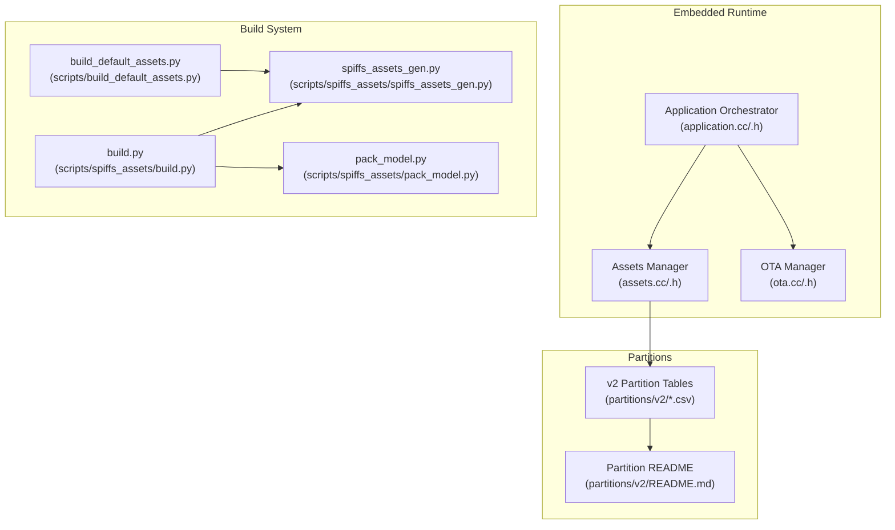
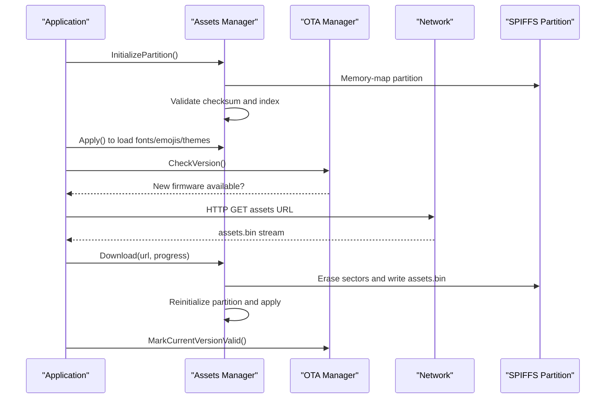
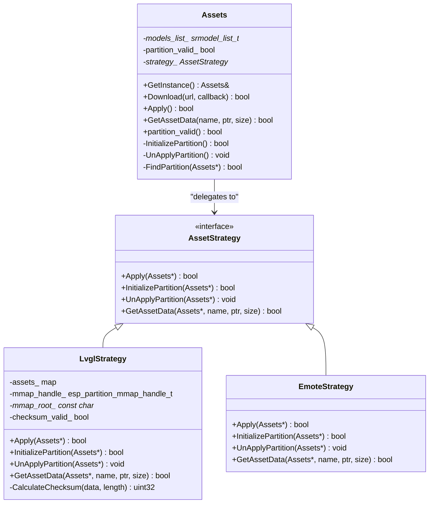
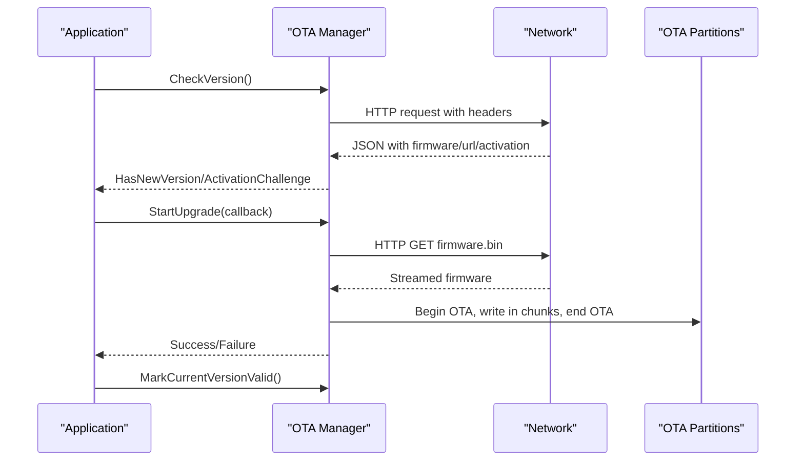
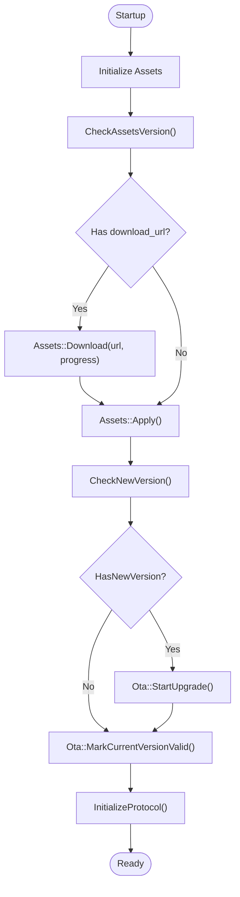
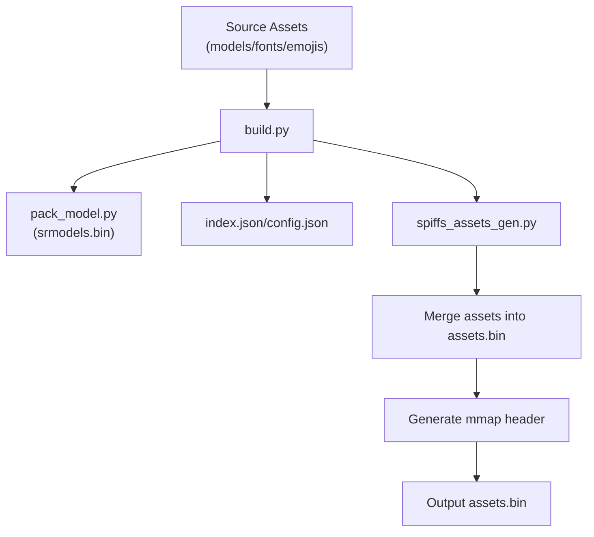
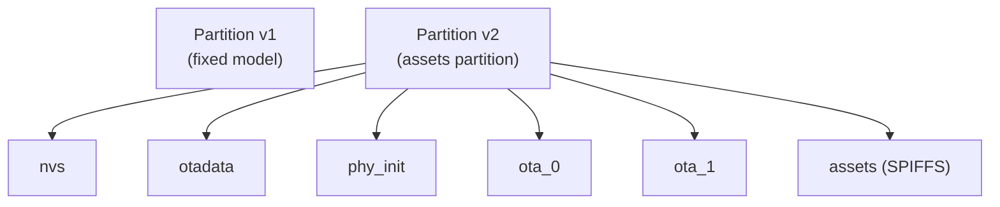
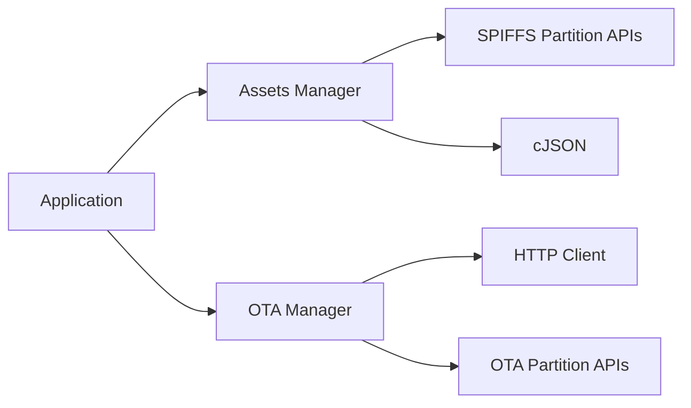

# Asset Management System

<cite>
**Referenced Files in This Document**
- [assets.cc](file://main/assets.cc)
- [assets.h](file://main/assets.h)
- [ota.cc](file://main/ota.cc)
- [ota.h](file://main/ota.h)
- [application.cc](file://main/application.cc)
- [application.h](file://main/application.h)
- [build.py](file://scripts/spiffs_assets/build.py)
- [spiffs_assets_gen.py](file://scripts/spiffs_assets/spiffs_assets_gen.py)
- [pack_model.py](file://scripts/spiffs_assets/pack_model.py)
- [build_default_assets.py](file://scripts/build_default_assets.py)
- [README.md (v2 partitions)](file://partitions/v2/README.md)
- [16m.csv](file://partitions/v2/16m.csv)
- [README.md (SPIFFS assets builder)](file://scripts/spiffs_assets/README.md)
</cite>

## Table of Contents
1. [Introduction](#introduction)
2. [Project Structure](#project-structure)
3. [Core Components](#core-components)
4. [Architecture Overview](#architecture-overview)
5. [Detailed Component Analysis](#detailed-component-analysis)
6. [Dependency Analysis](#dependency-analysis)
7. [Performance Considerations](#performance-considerations)
8. [Troubleshooting Guide](#troubleshooting-guide)
9. [Conclusion](#conclusion)
10. [Appendices](#appendices)

## Introduction
This document describes the asset management system for an embedded device running ESP-IDF. The system centers around SPIFFS-based resource handling and over-the-air (OTA) updates for both firmware and assets. It covers:
- SPIFFS partitioning strategy for flexible memory layouts and asset categories
- Model and resource packaging workflows for audio models, animations, and configuration data
- OTA mechanisms for remote firmware and asset distribution with rollback capabilities
- Asset loading and caching strategies, including memory-mapped access and integrity validation
- Build system integration for generating and deploying assets
- Relationship between embedded assets and mobile interface resources
- Practical examples for adding/updating assets and troubleshooting loading issues

## Project Structure
The asset management system spans several modules:
- Embedded runtime: asset loading, memory mapping, and OTA update orchestration
- Build scripts: packaging of assets into SPIFFS-compatible binaries
- Partition tables: versioned layouts defining asset storage and OTA partitions

**Diagram sources**
- [assets.cc:1-561](file://main/assets.cc#L1-L561)
- [assets.h:1-90](file://main/assets.h#L1-L90)
- [ota.cc:1-493](file://main/ota.cc#L1-L493)
- [ota.h:1-59](file://main/ota.h#L1-L59)
- [application.cc:1-1133](file://main/application.cc#L1-L1133)
- [application.h:1-195](file://main/application.h#L1-L195)
- [build.py:1-385](file://scripts/spiffs_assets/build.py#L1-L385)
- [spiffs_assets_gen.py:1-648](file://scripts/spiffs_assets/spiffs_assets_gen.py#L1-L648)
- [pack_model.py:1-124](file://scripts/spiffs_assets/pack_model.py#L1-L124)
- [build_default_assets.py:1-935](file://scripts/build_default_assets.py#L1-L935)
- [README.md (v2 partitions):1-107](file://partitions/v2/README.md#L1-L107)
- [16m.csv:1-9](file://partitions/v2/16m.csv#L1-L9)

**Section sources**
- [assets.cc:1-561](file://main/assets.cc#L1-L561)
- [assets.h:1-90](file://main/assets.h#L1-L90)
- [ota.cc:1-493](file://main/ota.cc#L1-L493)
- [ota.h:1-59](file://main/ota.h#L1-L59)
- [application.cc:1-1133](file://main/application.cc#L1-L1133)
- [application.h:1-195](file://main/application.h#L1-L195)
- [build.py:1-385](file://scripts/spiffs_assets/build.py#L1-L385)
- [spiffs_assets_gen.py:1-648](file://scripts/spiffs_assets/spiffs_assets_gen.py#L1-L648)
- [pack_model.py:1-124](file://scripts/spiffs_assets/pack_model.py#L1-L124)
- [build_default_assets.py:1-935](file://scripts/build_default_assets.py#L1-L935)
- [README.md (v2 partitions):1-107](file://partitions/v2/README.md#L1-L107)
- [16m.csv:1-9](file://partitions/v2/16m.csv#L1-L9)

## Core Components
- Assets Manager: Initializes and validates the SPIFFS assets partition, loads resources (fonts, emojis, backgrounds), and supports OTA asset downloads with integrity checks.
- OTA Manager: Checks for firmware updates, performs OTA upgrades, and marks versions as valid to enable rollback.
- Application Orchestrator: Coordinates asset loading at startup, triggers asset OTA downloads, and manages protocol initialization after activation.
- Build Scripts: Package wake word models, fonts, emoji collections, and configuration into a SPIFFS-compatible assets.bin and generate memory-mapped headers.

Key responsibilities:
- SPIFFS partition discovery and memory mapping
- Asset indexing and metadata parsing
- Integrity validation via checksums
- Progressive asset downloads with progress reporting
- Firmware OTA with validation and rollback marking

**Section sources**
- [assets.cc:30-65](file://main/assets.cc#L30-L65)
- [assets.h:23-87](file://main/assets.h#L23-L87)
- [ota.cc:77-245](file://main/ota.cc#L77-L245)
- [ota.h:10-59](file://main/ota.h#L10-L59)
- [application.cc:62-178](file://main/application.cc#L62-L178)
- [application.cc:358-414](file://main/application.cc#L358-L414)

## Architecture Overview
The system integrates embedded runtime asset loading with a build pipeline that produces SPIFFS-ready assets. OTA updates can refresh firmware and assets independently.

**Diagram sources**
- [assets.cc:57-65](file://main/assets.cc#L57-L65)
- [assets.cc:130-185](file://main/assets.cc#L130-L185)
- [assets.cc:214-356](file://main/assets.cc#L214-L356)
- [assets.cc:426-560](file://main/assets.cc#L426-L560)
- [ota.cc:77-245](file://main/ota.cc#L77-L245)
- [ota.cc:247-265](file://main/ota.cc#L247-L265)
- [application.cc:358-414](file://main/application.cc#L358-L414)

## Detailed Component Analysis

### Assets Manager
The Assets Manager encapsulates:
- Partition lifecycle: discovery, memory mapping, and unmap
- Asset indexing: parses index.json and constructs an in-memory map
- Asset retrieval: returns pointers and sizes for requested assets with magic validation
- Theme application: loads fonts, emoji collections, skins, and background images
- OTA asset download: progressive download with sector erasing and integrity verification

**Diagram sources**
- [assets.h:23-87](file://main/assets.h#L23-L87)
- [assets.cc:30-65](file://main/assets.cc#L30-L65)
- [assets.cc:130-196](file://main/assets.cc#L130-L196)
- [assets.cc:359-424](file://main/assets.cc#L359-L424)

Key behaviors:
- Memory-mapped SPIFFS access with checksum validation
- Asset retrieval with magic header verification
- Theme application from index.json fields (fonts, emoji, skins)
- OTA asset download with sector-wise erase and write

**Section sources**
- [assets.cc:57-65](file://main/assets.cc#L57-L65)
- [assets.cc:130-196](file://main/assets.cc#L130-L196)
- [assets.cc:214-356](file://main/assets.cc#L214-L356)
- [assets.cc:426-560](file://main/assets.cc#L426-L560)
- [assets.h:23-87](file://main/assets.h#L23-L87)

### OTA Manager
The OTA Manager:
- Queries a remote endpoint for firmware updates and activation challenges
- Applies MQTT/WebSocket configuration received from the server
- Performs firmware OTA with buffered writes and validation
- Marks current firmware as valid to enable rollback

**Diagram sources**
- [ota.cc:77-245](file://main/ota.cc#L77-L245)
- [ota.cc:267-387](file://main/ota.cc#L267-L387)
- [ota.cc:247-265](file://main/ota.cc#L247-L265)
- [ota.h:15-32](file://main/ota.h#L15-L32)

**Section sources**
- [ota.cc:77-245](file://main/ota.cc#L77-L245)
- [ota.cc:267-387](file://main/ota.cc#L267-L387)
- [ota.cc:247-265](file://main/ota.cc#L247-L265)
- [ota.h:15-32](file://main/ota.h#L15-L32)

### Application Orchestration
The Application coordinates:
- Startup asset loading
- Activation and OTA version checks
- Asset OTA download with progress UI updates
- Protocol initialization after activation completes

**Diagram sources**
- [application.cc:62-178](file://main/application.cc#L62-L178)
- [application.cc:358-414](file://main/application.cc#L358-L414)
- [application.cc:416-495](file://main/application.cc#L416-L495)

**Section sources**
- [application.cc:62-178](file://main/application.cc#L62-L178)
- [application.cc:358-414](file://main/application.cc#L358-L414)
- [application.cc:416-495](file://main/application.cc#L416-L495)

### Build System and Packaging
The build system transforms source assets into a SPIFFS-compatible binary:
- Collects wake word models, fonts, and emoji collections
- Generates index.json and config.json
- Converts images to optimized formats and merges assets
- Produces assets.bin and memory-mapped header files

**Diagram sources**
- [build.py:325-385](file://scripts/spiffs_assets/build.py#L325-L385)
- [pack_model.py:41-124](file://scripts/spiffs_assets/pack_model.py#L41-L124)
- [spiffs_assets_gen.py:391-491](file://scripts/spiffs_assets/spiffs_assets_gen.py#L391-L491)
- [spiffs_assets_gen.py:534-589](file://scripts/spiffs_assets/spiffs_assets_gen.py#L534-L589)
- [README.md (SPIFFS assets builder):1-111](file://scripts/spiffs_assets/README.md#L1-L111)

**Section sources**
- [build.py:1-385](file://scripts/spiffs_assets/build.py#L1-L385)
- [pack_model.py:1-124](file://scripts/spiffs_assets/pack_model.py#L1-L124)
- [spiffs_assets_gen.py:391-491](file://scripts/spiffs_assets/spiffs_assets_gen.py#L391-L491)
- [spiffs_assets_gen.py:534-589](file://scripts/spiffs_assets/spiffs_assets_gen.py#L534-L589)
- [README.md (SPIFFS assets builder):1-111](file://scripts/spiffs_assets/README.md#L1-L111)

### Partitioning Strategy
Version 2 partitions introduce an assets partition for network-loadable content:
- Replaces the fixed model partition with a configurable assets partition
- Optimizes app partitions to accommodate dynamic content
- Supports ESP32-C3 and 32MB devices with adjusted sizes

**Diagram sources**
- [README.md (v2 partitions):1-107](file://partitions/v2/README.md#L1-L107)
- [16m.csv:1-9](file://partitions/v2/16m.csv#L1-L9)

**Section sources**
- [README.md (v2 partitions):1-107](file://partitions/v2/README.md#L1-L107)
- [16m.csv:1-9](file://partitions/v2/16m.csv#L1-L9)

## Dependency Analysis
- Assets Manager depends on:
  - SPIFFS partition APIs for discovery and mapping
  - LVGL/CBIN integrations for fonts and images
  - JSON parsing for index metadata
- OTA Manager depends on:
  - HTTP client for downloading firmware and activation
  - OTA partition APIs for writing and validating firmware
- Application orchestrates both and coordinates UI updates and protocol initialization.

**Diagram sources**
- [assets.cc:1-561](file://main/assets.cc#L1-L561)
- [ota.cc:1-493](file://main/ota.cc#L1-L493)
- [application.cc:1-1133](file://main/application.cc#L1-L1133)

**Section sources**
- [assets.cc:1-561](file://main/assets.cc#L1-L561)
- [ota.cc:1-493](file://main/ota.cc#L1-L493)
- [application.cc:1-1133](file://main/application.cc#L1-L1133)

## Performance Considerations
- Memory-mapped assets reduce CPU overhead and improve access latency.
- Sector-wise erase during OTA asset downloads minimizes wear and aligns with flash geometry.
- Buffered firmware writes and chunked asset downloads prevent timeouts and reduce memory pressure.
- Checksum validation ensures data integrity without recalculating entire partitions on every boot.
- Image conversion to optimized formats reduces storage footprint and speeds rendering.

[No sources needed since this section provides general guidance]

## Troubleshooting Guide
Common issues and resolutions:
- Assets partition not found or invalid:
  - Verify partition label and size in the partition table.
  - Confirm assets.bin was built with matching partition size.
- Asset loading failures:
  - Check index.json validity and presence of referenced assets.
  - Ensure asset magic header matches expected format.
- OTA asset download errors:
  - Validate network connectivity and URL accessibility.
  - Confirm partition size is sufficient for assets.bin.
  - Monitor progress and speed callbacks for partial transfers.
- Firmware OTA validation failures:
  - Inspect HTTP status codes and streamed content length.
  - Ensure OTA partition availability and correct offsets.
- Rollback not triggered:
  - Call the version validation marker after successful OTA.

**Section sources**
- [assets.cc:426-560](file://main/assets.cc#L426-L560)
- [ota.cc:267-387](file://main/ota.cc#L267-L387)
- [ota.cc:247-265](file://main/ota.cc#L247-L265)
- [application.cc:358-414](file://main/application.cc#L358-L414)

## Conclusion
The asset management system provides a robust, SPIFFS-backed solution for storing and updating UI resources, models, and configuration data. It integrates seamlessly with OTA workflows to enable remote firmware and asset updates with integrity checks and rollback support. The build pipeline simplifies packaging and deployment across different hardware configurations.

[No sources needed since this section summarizes without analyzing specific files]

## Appendices

### Adding New Assets
- Place source assets under the build assets directory.
- Update index.json to reference new assets or use the build scripts to generate it.
- Rebuild assets.bin and flash the assets partition.

**Section sources**
- [build.py:264-291](file://scripts/spiffs_assets/build.py#L264-L291)
- [spiffs_assets_gen.py:391-491](file://scripts/spiffs_assets/spiffs_assets_gen.py#L391-L491)

### Updating Existing Resources
- Modify source files and rerun the build pipeline.
- For OTA asset updates, set the download URL and trigger the asset download flow.

**Section sources**
- [application.cc:358-414](file://main/application.cc#L358-L414)
- [assets.cc:426-560](file://main/assets.cc#L426-L560)

### Asset Loading Strategies
- Lazy loading: defer loading until resources are needed.
- Caching: keep frequently used assets in memory-mapped regions.
- Validation: rely on checksums and magic headers to ensure integrity.

**Section sources**
- [assets.cc:122-196](file://main/assets.cc#L122-L196)
- [assets.cc:198-212](file://main/assets.cc#L198-L212)

### Version Management and Rollback
- Firmware OTA validation occurs during write; successful completion sets the boot partition.
- Mark current firmware as valid to enable rollback; otherwise, pending verification remains.

**Section sources**
- [ota.cc:267-387](file://main/ota.cc#L267-L387)
- [ota.cc:247-265](file://main/ota.cc#L247-L265)