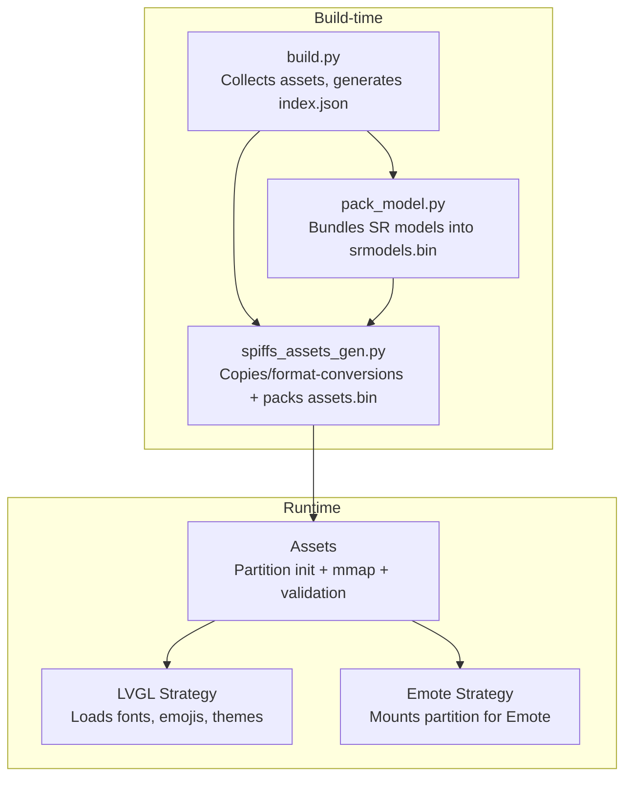
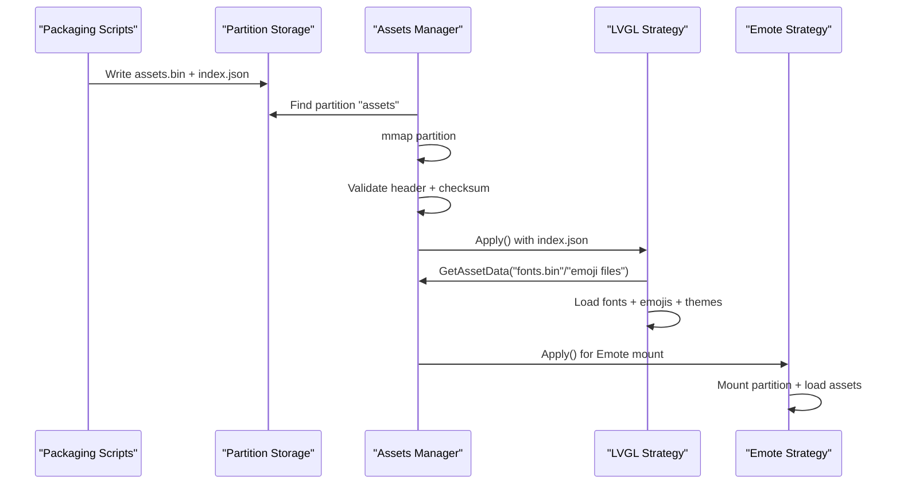
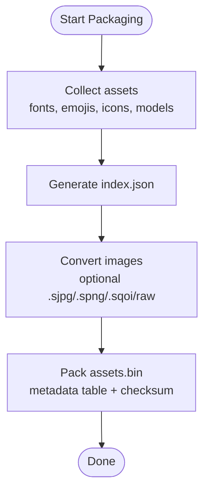
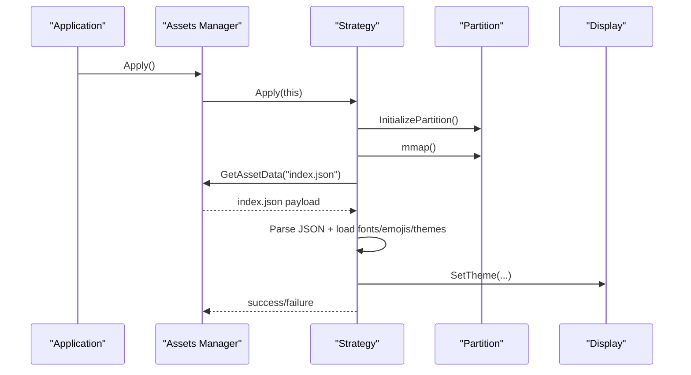
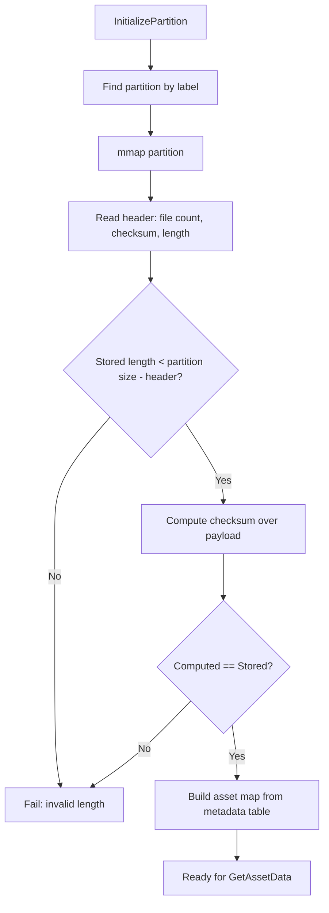
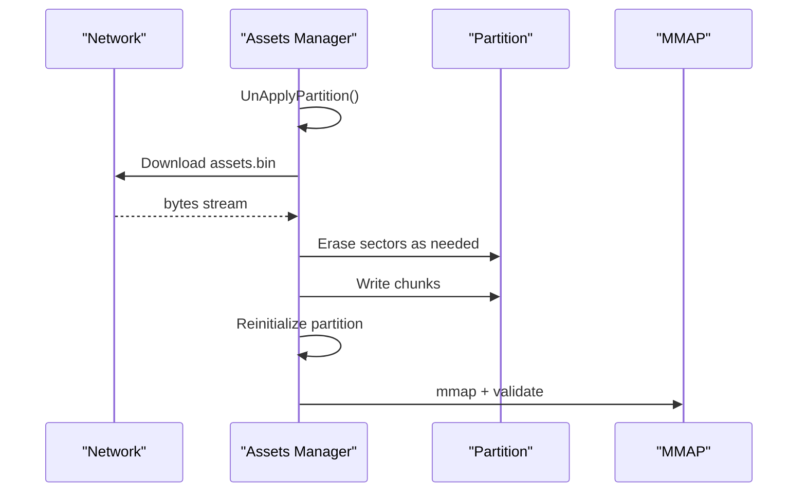
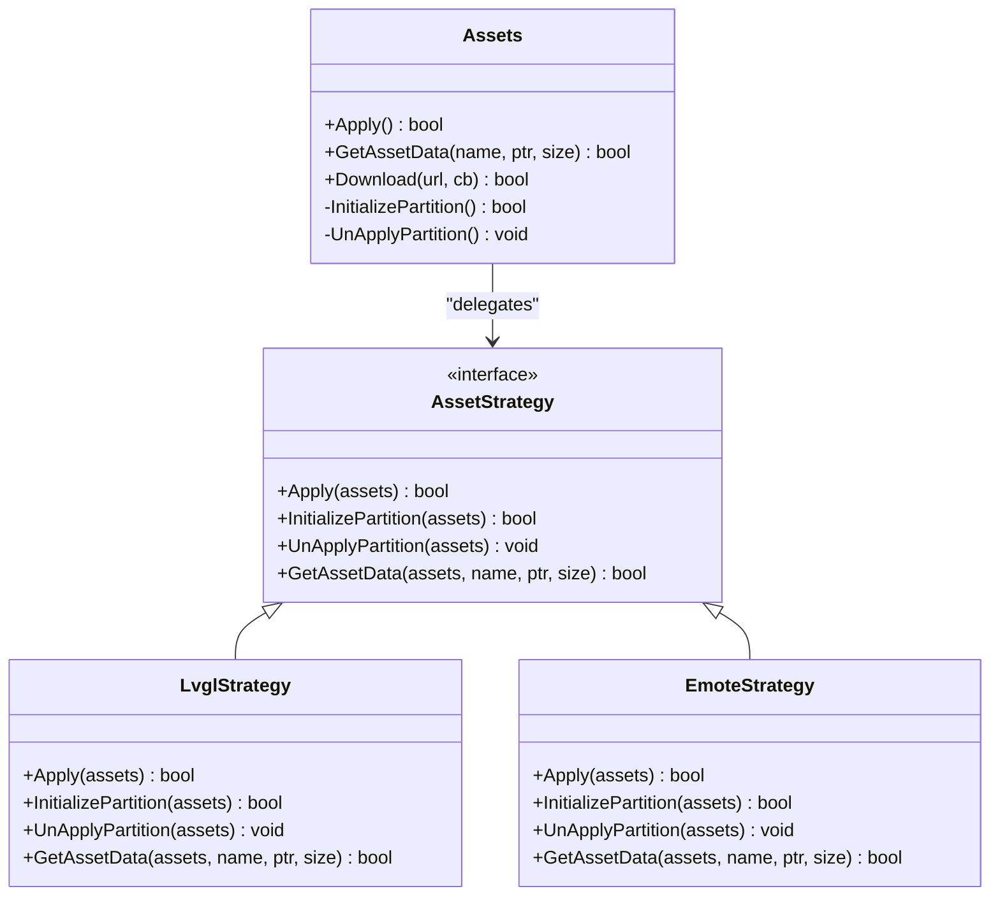

# Asset Packaging and Loading

<cite>
**Referenced Files in This Document**
- [assets.cc](file://main/assets.cc)
- [assets.h](file://main/assets.h)
- [build.py](file://scripts/spiffs_assets/build.py)
- [pack_model.py](file://scripts/spiffs_assets/pack_model.py)
- [spiffs_assets_gen.py](file://scripts/spiffs_assets/spiffs_assets_gen.py)
- [lvgl_display.h](file://main/display/lvgl_display/lvgl_display.h)
- [emote_display.h](file://main/display/emote_display.h)
- [index.json](file://main/boards/lulu-esp32s3/assets/index.json)
- [emote.json](file://main/boards/lulu-esp32s3/emote.json)
- [layout.json](file://main/boards/lulu-esp32s3/240_240/layout.json)
</cite>

## Table of Contents
1. [Introduction](#introduction)
2. [Project Structure](#project-structure)
3. [Core Components](#core-components)
4. [Architecture Overview](#architecture-overview)
5. [Detailed Component Analysis](#detailed-component-analysis)
6. [Dependency Analysis](#dependency-analysis)
7. [Performance Considerations](#performance-considerations)
8. [Troubleshooting Guide](#troubleshooting-guide)
9. [Conclusion](#conclusion)
10. [Appendices](#appendices)

## Introduction
This document explains the asset packaging and loading mechanisms used to prepare and serve resources at runtime. It covers:
- The asset indexing system using index.json with version tracking, model references, font definitions, and emoji collections
- The packaging workflow including audio model bundling, image compression, and animation file preparation
- Runtime loading strategies for LVGL and Emote displays with memory-mapped access patterns
- Validation processes including magic number verification, size checking, and integrity validation
- Lazy loading techniques and memory optimization strategies for embedded systems
- Asset caching via partition storage and runtime access patterns
- Practical examples for adding new assets, updating existing resources, and troubleshooting loading issues

## Project Structure
The asset pipeline spans build-time scripts and runtime code:
- Build-time packaging scripts assemble assets into a single binary with metadata and optional image conversions
- Runtime loader initializes a partition, validates integrity, and exposes assets to LVGL or Emote displays

**Diagram sources**
- [build.py:325-385](file://scripts/spiffs_assets/build.py#L325-L385)
- [pack_model.py:41-124](file://scripts/spiffs_assets/pack_model.py#L41-L124)
- [spiffs_assets_gen.py:534-589](file://scripts/spiffs_assets/spiffs_assets_gen.py#L534-L589)
- [assets.cc:30-65](file://main/assets.cc#L30-L65)

**Section sources**
- [build.py:1-385](file://scripts/spiffs_assets/build.py#L1-L385)
- [pack_model.py:1-124](file://scripts/spiffs_assets/pack_model.py#L1-L124)
- [spiffs_assets_gen.py:1-648](file://scripts/spiffs_assets/spiffs_assets_gen.py#L1-L648)
- [assets.cc:1-561](file://main/assets.cc#L1-L561)

## Core Components
- Assets manager: Initializes partition, validates integrity, and exposes GetAssetData for runtime access
- Strategies:
  - LVGL strategy: Uses memory-mapped partition access, validates checksum, parses index.json, loads fonts and emojis, applies themes
  - Emote strategy: Mounts partition for Emote display and retrieves assets by name
- Packaging scripts:
  - build.py: Copies and prepares assets, generates index.json, and invokes packaging
  - pack_model.py: Packs wake word models into a single binary
  - spiffs_assets_gen.py: Copies/format-converts images and packs them into assets.bin with a metadata table and checksum

Key runtime behaviors:
- Partition discovery and mmap for LVGL
- Integrity checks (header counts, checksum, stored length)
- Asset retrieval with magic-number validation for asset blobs
- Theme and emoji loading from index.json
- Emote-specific mounting and asset enumeration

**Section sources**
- [assets.h:23-90](file://main/assets.h#L23-L90)
- [assets.cc:30-65](file://main/assets.cc#L30-L65)
- [assets.cc:130-185](file://main/assets.cc#L130-L185)
- [assets.cc:198-212](file://main/assets.cc#L198-L212)
- [assets.cc:359-424](file://main/assets.cc#L359-L424)
- [assets.cc:426-560](file://main/assets.cc#L426-L560)

## Architecture Overview
The asset system follows a layered approach:
- Packaging layer builds assets.bin and index.json
- Runtime layer mounts the partition and validates metadata
- Display layer consumes assets (fonts, emojis, animations)

**Diagram sources**
- [spiffs_assets_gen.py:534-589](file://scripts/spiffs_assets/spiffs_assets_gen.py#L534-L589)
- [assets.cc:57-65](file://main/assets.cc#L57-L65)
- [assets.cc:130-185](file://main/assets.cc#L130-L185)
- [assets.cc:214-356](file://main/assets.cc#L214-L356)
- [assets.cc:359-424](file://main/assets.cc#L359-L424)

## Detailed Component Analysis

### Asset Indexing System (index.json)
The index.json defines:
- version: Version of the index schema
- srmodels: Reference to the bundled model file
- text_font: Reference to the font binary
- emoji_collection: Array of emoji entries with name and file
- icon_collection: Optional icon set
- layout: Optional layout definitions for Emote

Examples of index.json and related configs:
- Board-level index.json lists GIF-based emojis
- Emote config lists EAF animations with properties (loop, fps)
- Layout JSON defines UI elements for Emote rendering

**Section sources**
- [index.json:1-26](file://main/boards/lulu-esp32s3/assets/index.json#L1-L26)
- [emote.json:1-30](file://main/boards/lulu-esp32s3/emote.json#L1-L30)
- [layout.json:1-85](file://main/boards/lulu-esp32s3/240_240/layout.json#L1-L85)

### Packaging Workflow
The packaging workflow performs:
- Model bundling: pack_model.py merges wake word models into srmodels.bin
- Asset collection: build.py copies fonts, emojis, icons, and layout data; generates index.json
- Image processing: spiffs_assets_gen.py optionally converts images to compressed formats (.sjpg/.spng/.sqoi) or raw LVGL format
- Packing: spiffs_assets_gen.py writes assets.bin with a metadata table and checksum

**Diagram sources**
- [build.py:352-363](file://scripts/spiffs_assets/build.py#L352-L363)
- [pack_model.py:41-113](file://scripts/spiffs_assets/pack_model.py#L41-L113)
- [spiffs_assets_gen.py:534-589](file://scripts/spiffs_assets/spiffs_assets_gen.py#L534-L589)

**Section sources**
- [build.py:48-114](file://scripts/spiffs_assets/build.py#L48-L114)
- [build.py:264-291](file://scripts/spiffs_assets/build.py#L264-L291)
- [pack_model.py:41-113](file://scripts/spiffs_assets/pack_model.py#L41-L113)
- [spiffs_assets_gen.py:391-462](file://scripts/spiffs_assets/spiffs_assets_gen.py#L391-L462)

### Asset Loading Strategies (LVGL and Emote)
- LVGL Strategy:
  - Initializes partition and memory-maps it
  - Validates header counts, stored length, and checksum
  - Parses index.json to load fonts, emojis, and theme assets
  - Applies theme to the current display
- Emote Strategy:
  - Mounts the partition for Emote with mmap enabled
  - Loads Emote assets via Emote APIs

**Diagram sources**
- [assets.cc:30-65](file://main/assets.cc#L30-L65)
- [assets.cc:130-185](file://main/assets.cc#L130-L185)
- [assets.cc:214-356](file://main/assets.cc#L214-L356)
- [assets.cc:359-424](file://main/assets.cc#L359-L424)

**Section sources**
- [assets.cc:130-185](file://main/assets.cc#L130-L185)
- [assets.cc:214-356](file://main/assets.cc#L214-L356)
- [assets.cc:359-424](file://main/assets.cc#L359-L424)

### Asset Validation and Integrity
Validation steps performed at runtime:
- Partition discovery by label
- Memory-mapped access initialization
- Header validation: stored file count, stored checksum, stored length
- Integrity check: computed checksum vs stored checksum
- Asset-level validation: magic number check for asset blobs

**Diagram sources**
- [assets.cc:130-185](file://main/assets.cc#L130-L185)

**Section sources**
- [assets.cc:130-185](file://main/assets.cc#L130-L185)
- [assets.cc:198-212](file://main/assets.cc#L198-L212)

### Memory Optimization and Lazy Loading
- Memory-mapped access minimizes RAM usage by streaming assets directly from flash
- Asset retrieval validates magic numbers to prevent misinterpretation of data
- Display-specific loading (fonts, emojis, themes) is deferred until Apply() is invoked
- Emote mounting enables lazy asset enumeration and on-demand playback

**Section sources**
- [assets.cc:130-185](file://main/assets.cc#L130-L185)
- [assets.cc:198-212](file://main/assets.cc#L198-L212)
- [assets.cc:359-424](file://main/assets.cc#L359-L424)

### Partition Storage and Runtime Access Patterns
- Partition label is used to locate the assets partition
- LVGL uses mmap for zero-copy reads
- Emote uses partition mounting with mmap enabled
- Download flow erases sectors incrementally and writes new assets, then reinitializes partition

**Diagram sources**
- [assets.cc:426-560](file://main/assets.cc#L426-L560)

**Section sources**
- [assets.cc:426-560](file://main/assets.cc#L426-L560)

## Dependency Analysis
- Assets depends on:
  - LVGL display subsystem for theme application
  - Emote display subsystem for Emote mounting
  - cJSON for parsing index.json
  - SPI flash mmap APIs for LVGL strategy
  - Emote APIs for Emote strategy

**Diagram sources**
- [assets.h:23-90](file://main/assets.h#L23-L90)

**Section sources**
- [assets.h:23-90](file://main/assets.h#L23-L90)

## Performance Considerations
- Prefer memory-mapped access to avoid double buffering of assets
- Keep assets.bin under partition size to avoid truncation
- Use compressed image formats (.sjpg/.spng/.sqoi) to reduce storage footprint
- Batch asset retrieval and avoid frequent remapping/unmapping
- Validate index.json early to fail fast on unsupported versions

## Troubleshooting Guide
Common issues and resolutions:
- Assets partition not found:
  - Verify partition label matches the configured label
  - Ensure assets.bin was written to the correct partition
- Invalid index.json:
  - Confirm version compatibility and correct structure
  - Re-run packaging scripts to regenerate index.json
- Asset not found by name:
  - Check asset name casing and presence in metadata table
  - Confirm asset file was included in packaging
- Magic number mismatch:
  - Indicates corrupted or incompatible asset blob
  - Rebuild assets.bin and reflash partition
- Download failures:
  - Check network connectivity and URL correctness
  - Ensure partition size is sufficient for new assets.bin
  - Review erase/write logs for sector errors

**Section sources**
- [assets.cc:426-560](file://main/assets.cc#L426-L560)
- [assets.cc:198-212](file://main/assets.cc#L198-L212)

## Conclusion
The asset system combines robust packaging with validated, memory-efficient runtime loading. By leveraging index.json for metadata, building a compact assets.bin with integrity checks, and using memory-mapped access, the system supports both LVGL and Emote displays with minimal RAM overhead. Proper validation and partition management ensure reliability across updates and embedded constraints.

## Appendices

### Adding New Assets
- Fonts:
  - Place the font binary into the assets directory
  - Update index.json to reference the font file
- Emojis:
  - Add PNG/GIF emoji files to the assets directory
  - Update index.json emoji_collection with name and file
- Emote Animations:
  - Place EAF animation files into the assets directory
  - Update emote.json with animation entries (name, src, loop, fps)
- Icons:
  - Place icon binaries into the assets directory
  - Optionally update index.json icon_collection

Re-run packaging scripts to rebuild assets.bin and reflash the partition.

**Section sources**
- [build.py:76-87](file://scripts/spiffs_assets/build.py#L76-L87)
- [build.py:89-114](file://scripts/spiffs_assets/build.py#L89-L114)
- [build.py:138-191](file://scripts/spiffs_assets/build.py#L138-L191)
- [build.py:264-291](file://scripts/spiffs_assets/build.py#L264-L291)

### Updating Existing Resources
- Replace the corresponding asset file in the assets directory
- Re-run packaging scripts to regenerate assets.bin
- Flash the updated partition and restart the device

**Section sources**
- [spiffs_assets_gen.py:534-589](file://scripts/spiffs_assets/spiffs_assets_gen.py#L534-L589)

### Example References
- LVGL display interface: [lvgl_display.h:15-54](file://main/display/lvgl_display/lvgl_display.h#L15-L54)
- Emote display interface: [emote_display.h:14-51](file://main/display/emote_display.h#L14-L51)