# OTA Update Mechanism

<cite>
**Referenced Files in This Document**
- [ota.h](file://main/ota.h)
- [ota.cc](file://main/ota.cc)
- [assets.h](file://main/assets.h)
- [assets.cc](file://main/assets.cc)
- [application.cc](file://main/application.cc)
- [README.md](file://partitions/v2/README.md)
- [16m.csv](file://partitions/v2/16m.csv)
- [32m.csv](file://partitions/v2/32m.csv)
</cite>

## Table of Contents
1. [Introduction](#introduction)
2. [Project Structure](#project-structure)
3. [Core Components](#core-components)
4. [Architecture Overview](#architecture-overview)
5. [Detailed Component Analysis](#detailed-component-analysis)
6. [Dependency Analysis](#dependency-analysis)
7. [Performance Considerations](#performance-considerations)
8. [Troubleshooting Guide](#troubleshooting-guide)
9. [Conclusion](#conclusion)
10. [Appendices](#appendices)

## Introduction
This document explains the Over-The-Air (OTA) update mechanism for firmware and remote assets. It covers the HTTP-based download process, progressive sector erasing and writing strategies, validation procedures, rollback and error recovery, progress reporting, security considerations, and the relationship with partition management and asset loading systems. It also provides guidance for implementing custom update handlers and handling partial failures while maintaining system stability.

## Project Structure
The OTA system spans several modules:
- Firmware OTA: version checking, HTTP transport, sequential writes, validation, and boot partition selection.
- Assets OTA: progressive sector erasing and writing, size and integrity checks, and reinitialization.
- Partition tables: define firmware and assets partitions for different flash sizes.
- Coordination: application orchestrates version checks, upgrades, and protocol initialization.

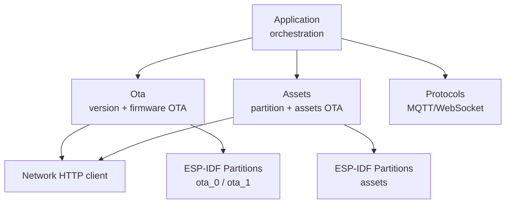

**Diagram sources**
- [application.cc:341-356](file://main/application.cc#L341-L356)
- [ota.cc:77-245](file://main/ota.cc#L77-L245)
- [assets.cc:429-560](file://main/assets.cc#L429-L560)
- [16m.csv:1-9](file://partitions/v2/16m.csv#L1-L9)
- [32m.csv:1-10](file://partitions/v2/32m.csv#L1-L10)

**Section sources**
- [ota.h:10-56](file://main/ota.h#L10-L56)
- [ota.cc:77-245](file://main/ota.cc#L77-L245)
- [assets.h:23-90](file://main/assets.h#L23-L90)
- [assets.cc:429-560](file://main/assets.cc#L429-L560)
- [README.md:1-107](file://partitions/v2/README.md#L1-L107)
- [16m.csv:1-9](file://partitions/v2/16m.csv#L1-L9)
- [32m.csv:1-10](file://partitions/v2/32m.csv#L1-L10)

## Core Components
- Ota: Handles version checking, HTTP headers, activation handshake, firmware download with sequential writes, validation, and boot partition selection.
- Assets: Manages assets partition lifecycle, progressive sector erasing/writing, checksum validation, and memory-mapped access.
- Application: Coordinates OTA checks, triggers upgrades, and initializes communication protocols.

Key responsibilities:
- Version comparison and activation payload generation.
- Progressive writes with page-sized buffers and periodic speed calculation.
- Sector-aware erasing for assets OTA to ensure atomicity and integrity.
- Validation via OTA image validation and partition checksum verification.
- Rollback control and marking current version as valid.

**Section sources**
- [ota.h:10-56](file://main/ota.h#L10-L56)
- [ota.cc:267-387](file://main/ota.cc#L267-L387)
- [assets.h:23-90](file://main/assets.h#L23-L90)
- [assets.cc:429-560](file://main/assets.cc#L429-L560)
- [application.cc:341-356](file://main/application.cc#L341-L356)

## Architecture Overview
The OTA architecture integrates HTTP-based retrieval, ESP-IDF partition APIs, and partition-specific strategies.

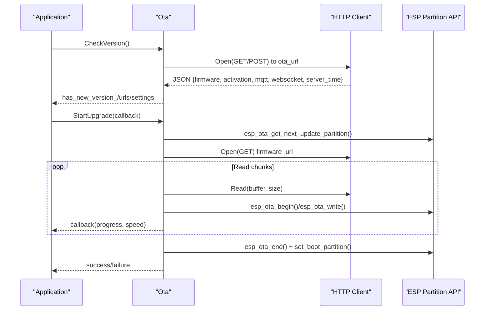

**Diagram sources**
- [ota.cc:77-245](file://main/ota.cc#L77-L245)
- [ota.cc:267-387](file://main/ota.cc#L267-L387)

## Detailed Component Analysis

### Firmware OTA: Version Checking and Activation
- Version checking retrieves firmware metadata from a configured URL, parses JSON, and compares semantic versions. A force flag can override availability checks.
- Activation supports HMAC-based challenge-response when a serial number is present, sending an activation payload and handling timeouts.

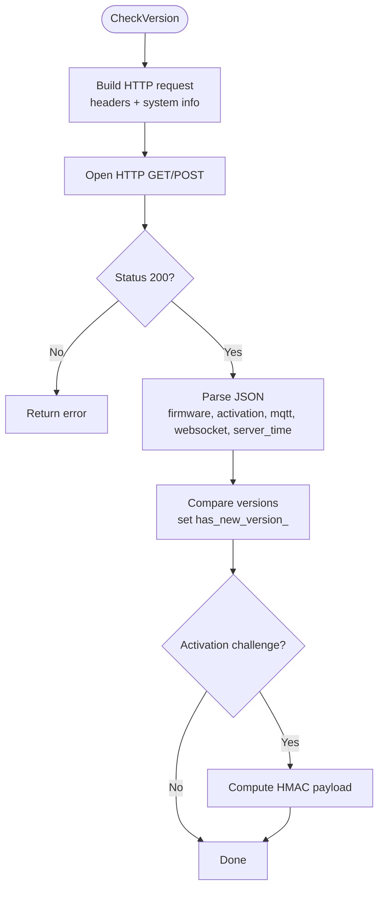

**Diagram sources**
- [ota.cc:77-245](file://main/ota.cc#L77-L245)
- [ota.cc:458-492](file://main/ota.cc#L458-L492)

**Section sources**
- [ota.cc:77-245](file://main/ota.cc#L77-L245)
- [ota.cc:458-492](file://main/ota.cc#L458-L492)

### Firmware OTA: Download, Writing, Validation, and Boot Selection
- Uses sequential writes with a 4KB page buffer and writes when the buffer is full or at the last chunk.
- Validates the image header before beginning OTA to ensure a valid app image.
- Ends OTA, validates the image, sets the boot partition, and logs success.

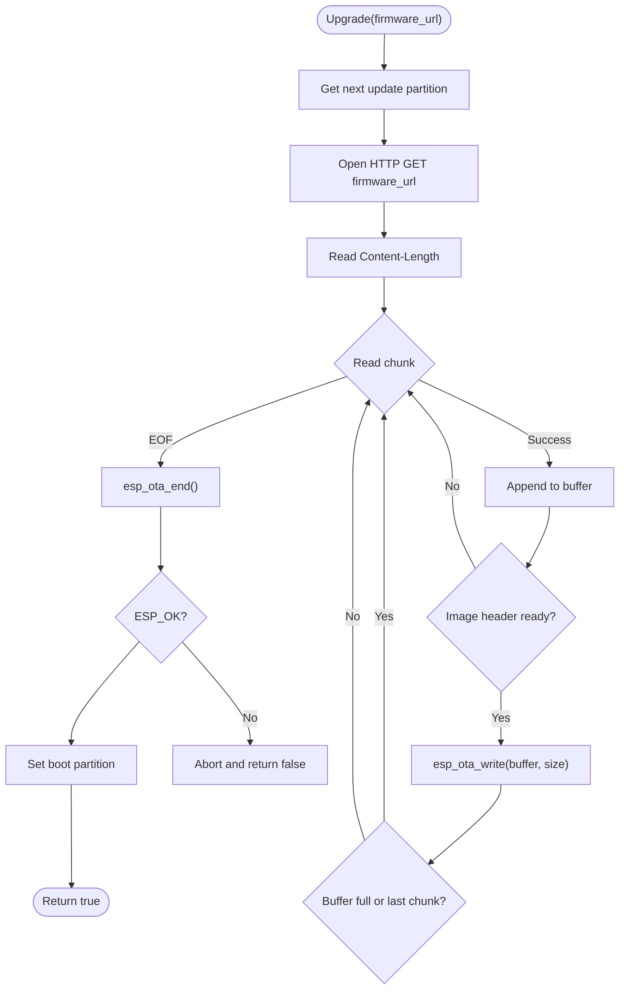

**Diagram sources**
- [ota.cc:267-387](file://main/ota.cc#L267-L387)

**Section sources**
- [ota.cc:267-387](file://main/ota.cc#L267-L387)

### Assets OTA: Progressive Sector Erasing and Writing
- Downloads assets to the assets partition with progressive sector erasing and writing.
- Calculates sectors to erase based on content length and erases one sector at a time as needed.
- Writes in sector-sized chunks, tracks progress and speed, and reinitializes the partition after completion.

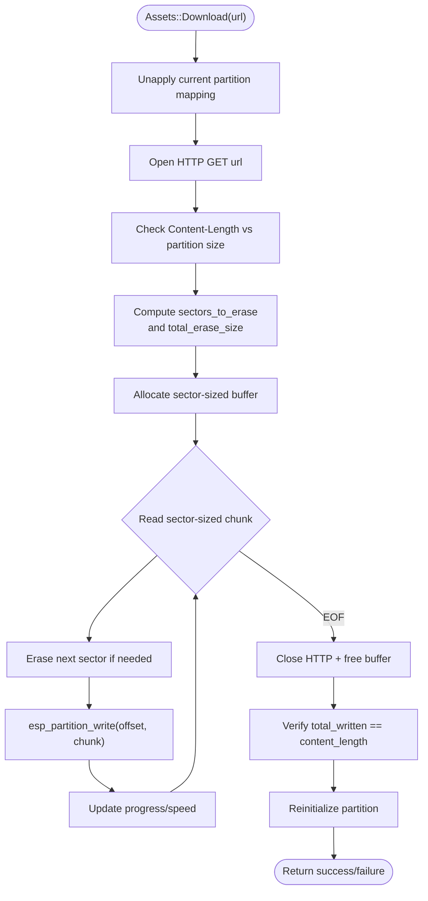

**Diagram sources**
- [assets.cc:429-560](file://main/assets.cc#L429-L560)

**Section sources**
- [assets.cc:429-560](file://main/assets.cc#L429-L560)

### Partition Management and Layout
- Firmware partitions: ota_0 and ota_1 alternate slots for safe updates.
- Assets partition: dedicated SPIFFS partition for network-loadable content, sized per device flash capacity.
- The v2 layout optimizes app partition sizes and replaces the model partition with a larger assets partition.

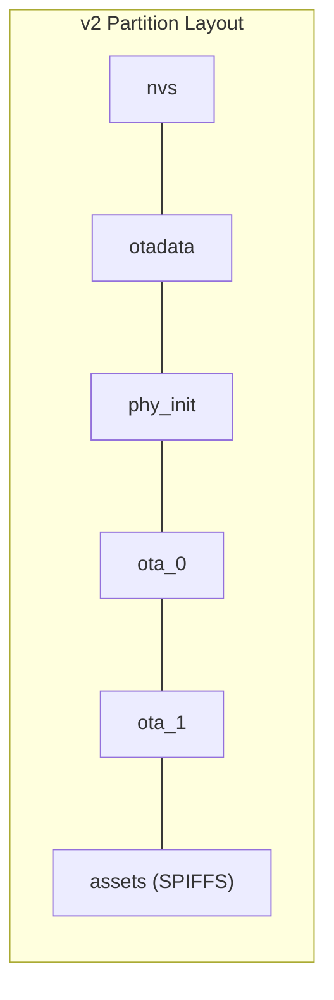

**Diagram sources**
- [16m.csv:1-9](file://partitions/v2/16m.csv#L1-L9)
- [32m.csv:1-10](file://partitions/v2/32m.csv#L1-L10)
- [README.md:24-84](file://partitions/v2/README.md#L24-L84)

**Section sources**
- [README.md:1-107](file://partitions/v2/README.md#L1-L107)
- [16m.csv:1-9](file://partitions/v2/16m.csv#L1-L9)
- [32m.csv:1-10](file://partitions/v2/32m.csv#L1-L10)

### Validation Procedures
- Firmware validation:
  - Image header inspection before OTA begins.
  - OTA end validation and error classification (e.g., validation failure).
- Assets validation:
  - Partition checksum verification against stored checksum.
  - Integrity check of the asset catalog and data.

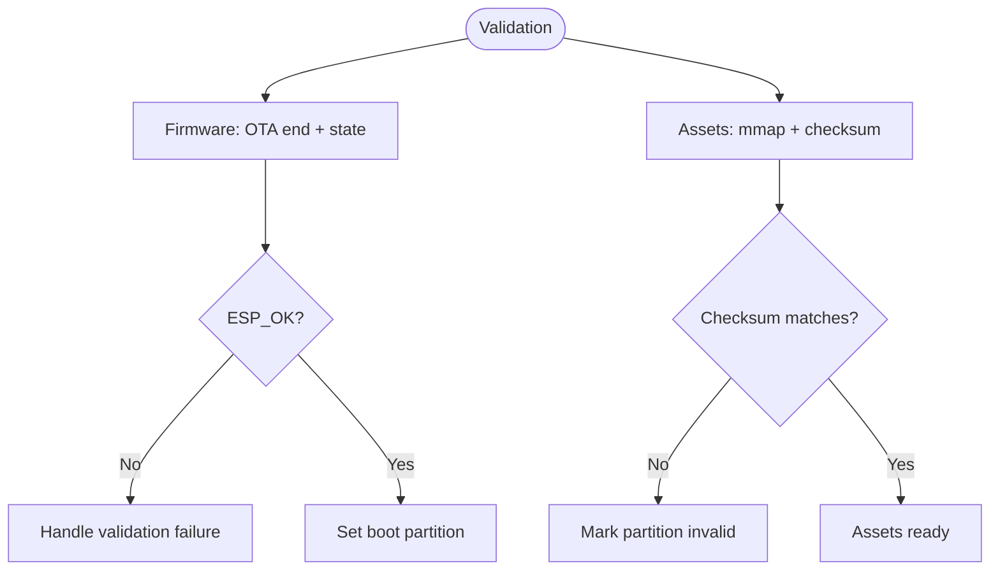

**Diagram sources**
- [ota.cc:369-387](file://main/ota.cc#L369-L387)
- [assets.cc:130-185](file://main/assets.cc#L130-L185)

**Section sources**
- [ota.cc:369-387](file://main/ota.cc#L369-L387)
- [assets.cc:130-185](file://main/assets.cc#L130-L185)

### Rollback Mechanisms and Error Recovery
- Firmware rollback:
  - Pending verification state can be marked as valid to cancel rollback.
  - Boot selection switches to the new partition only after successful validation.
- Assets rollback:
  - On failure, the partition remains in a previous valid state; reinitialization is retried after corrective action.
- Error recovery:
  - Aborts OTA on write errors, frees buffers, and returns failure.
  - HTTP errors and invalid content length are handled early to prevent partial writes.

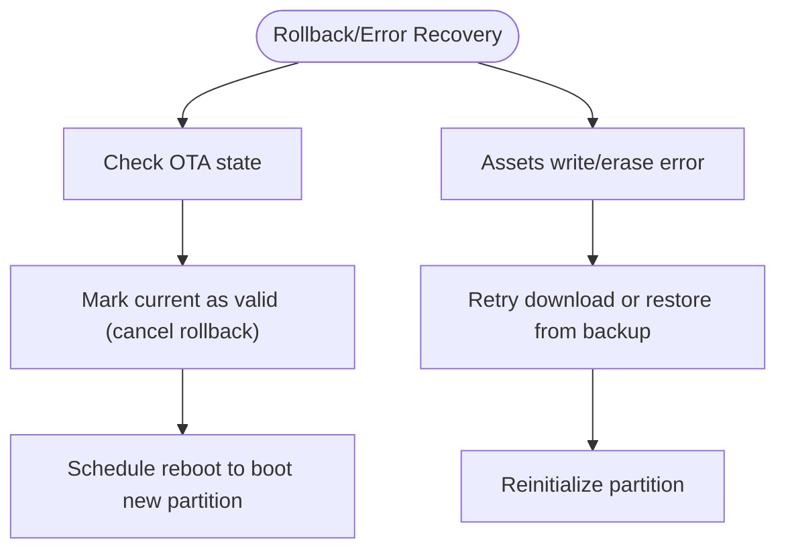

**Diagram sources**
- [ota.cc:247-265](file://main/ota.cc#L247-L265)
- [assets.cc:429-560](file://main/assets.cc#L429-L560)

**Section sources**
- [ota.cc:247-265](file://main/ota.cc#L247-L265)
- [assets.cc:429-560](file://main/assets.cc#L429-L560)

### Progress Reporting and Speed Calculation
- Both firmware and assets OTA compute progress as a percentage and instantaneous speed (bytes per second).
- Firmware OTA calculates speed every second and invokes the provided callback.
- Assets OTA computes speed per second and reports sectors erased alongside progress.

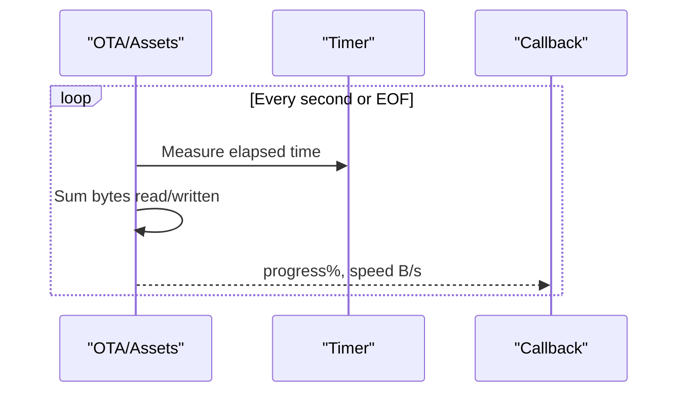

**Diagram sources**
- [ota.cc:316-328](file://main/ota.cc#L316-L328)
- [assets.cc:528-540](file://main/assets.cc#L528-L540)

**Section sources**
- [ota.cc:316-328](file://main/ota.cc#L316-L328)
- [assets.cc:528-540](file://main/assets.cc#L528-L540)

### Security Considerations
- Activation challenge-response:
  - HMAC-SHA256 computed using a hardware key when supported.
  - Payload includes serial number, challenge, and signature.
- Partition protection:
  - Assets partition uses SPIFFS subtype and memory-mapped access.
  - Firmware OTA uses sequential writes and validates images before boot.
- Authorization:
  - HTTP headers include device identifiers and user-agent for server-side authorization decisions.

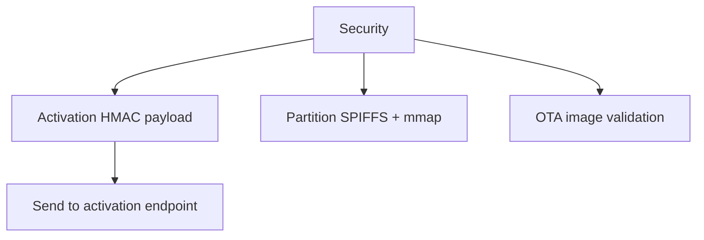

**Diagram sources**
- [ota.cc:421-456](file://main/ota.cc#L421-L456)
- [assets.cc:130-185](file://main/assets.cc#L130-L185)
- [ota.cc:336-345](file://main/ota.cc#L336-L345)

**Section sources**
- [ota.cc:421-456](file://main/ota.cc#L421-L456)
- [assets.cc:130-185](file://main/assets.cc#L130-L185)
- [ota.cc:336-345](file://main/ota.cc#L336-L345)

### Coordination with Asset Loading Systems
- Application orchestrates:
  - Asset version checks and downloads.
  - Firmware version checks and upgrades.
  - Protocol initialization based on OTA-provided configuration.
- Assets strategy:
  - Memory-maps the assets partition and validates checksums.
  - Provides asset lookup for runtime usage.

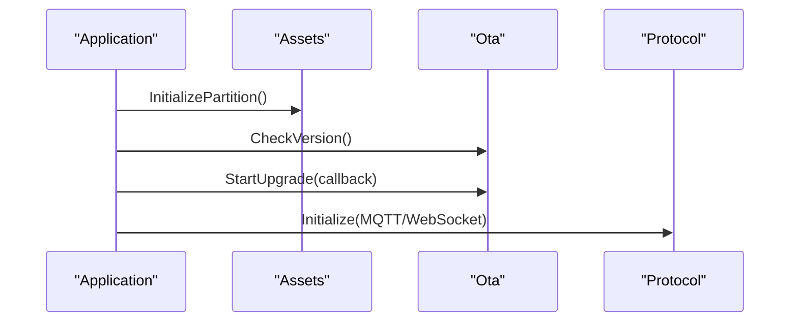

**Diagram sources**
- [application.cc:341-356](file://main/application.cc#L341-L356)
- [assets.cc:130-185](file://main/assets.cc#L130-L185)
- [ota.cc:77-245](file://main/ota.cc#L77-L245)

**Section sources**
- [application.cc:341-356](file://main/application.cc#L341-L356)
- [assets.cc:130-185](file://main/assets.cc#L130-L185)
- [ota.cc:77-245](file://main/ota.cc#L77-L245)

## Dependency Analysis
- Ota depends on:
  - Network HTTP client abstraction for connectivity.
  - ESP-IDF OTA and partition APIs for flashing and boot selection.
  - Settings and system info for headers and configuration.
- Assets depends on:
  - ESP-IDF partition APIs for sector erasing and writing.
  - Memory-mapped access for fast asset retrieval.
- Application coordinates both modules and selects protocols.

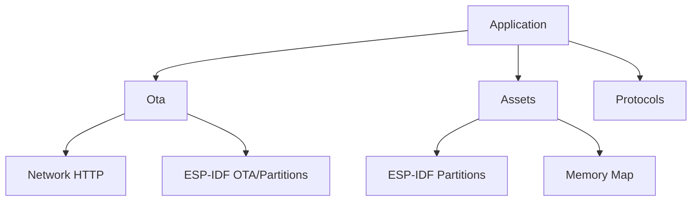

**Diagram sources**
- [ota.cc:55-72](file://main/ota.cc#L55-L72)
- [assets.cc:429-560](file://main/assets.cc#L429-L560)
- [application.cc:341-356](file://main/application.cc#L341-L356)

**Section sources**
- [ota.cc:55-72](file://main/ota.cc#L55-L72)
- [assets.cc:429-560](file://main/assets.cc#L429-L560)
- [application.cc:341-356](file://main/application.cc#L341-L356)

## Performance Considerations
- Sequential writes minimize fragmentation and improve reliability.
- Page-sized buffers balance throughput and memory usage.
- Periodic speed calculation avoids frequent logging overhead.
- Sector-aware erasing for assets reduces unnecessary erase operations and improves write endurance.

[No sources needed since this section provides general guidance]

## Troubleshooting Guide
Common issues and remedies:
- HTTP connection failures:
  - Verify network connectivity and URL correctness; inspect last error codes.
- Invalid content length or mismatch:
  - Ensure server returns accurate Content-Length; abort on mismatch.
- OTA write failures:
  - Check partition availability and free space; abort and retry.
- OTA validation failure:
  - Investigate corruption; avoid setting boot partition; revert to previous partition.
- Assets checksum mismatch:
  - Re-download assets; verify partition size and sector alignment.
- Activation errors:
  - Confirm challenge-response payload and HMAC computation; handle timeout responses.

**Section sources**
- [ota.cc:282-296](file://main/ota.cc#L282-L296)
- [ota.cc:351-357](file://main/ota.cc#L351-L357)
- [ota.cc:370-377](file://main/ota.cc#L370-L377)
- [assets.cc:507-513](file://main/assets.cc#L507-L513)
- [assets.cc:169-172](file://main/assets.cc#L169-L172)
- [ota.cc:476-488](file://main/ota.cc#L476-L488)

## Conclusion
The OTA system combines robust HTTP-based retrieval, partition-aware flashing, and integrity checks to deliver reliable firmware and asset updates. It supports progressive downloads, real-time progress reporting, and secure activation. Proper rollback controls and error handling ensure system stability, while partition management and memory mapping enable efficient asset loading.

[No sources needed since this section summarizes without analyzing specific files]

## Appendices

### Implementing Custom Update Handlers
- Extend the OTA workflow by adding custom handlers for specialized update scenarios (e.g., delta updates, staged rollouts).
- Integrate custom callbacks for granular progress reporting and telemetry.

[No sources needed since this section provides general guidance]

### Handling Partial Failures and Maintaining Stability
- Use aborts on write/validation failures; keep the previous partition bootable.
- Reinitialize partitions after partial writes to recover from transient errors.
- Employ retries with backoff and circuit-breaker logic for network flakiness.

[No sources needed since this section provides general guidance]