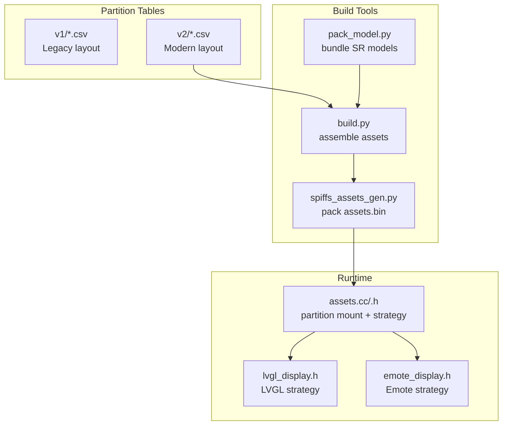
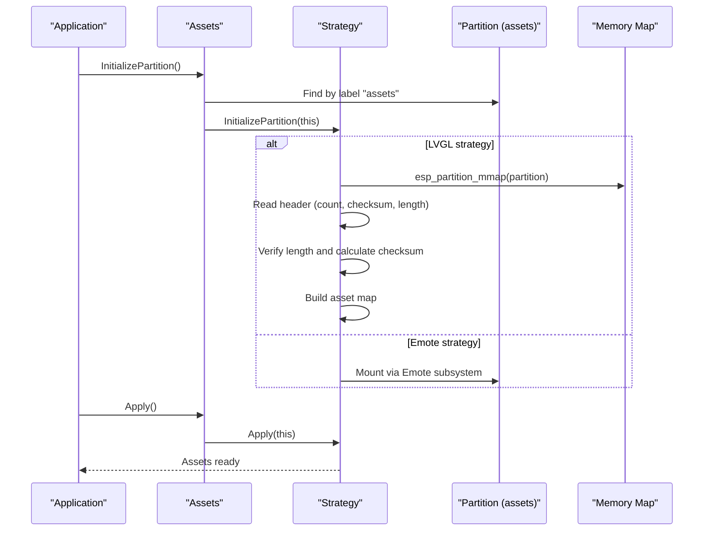
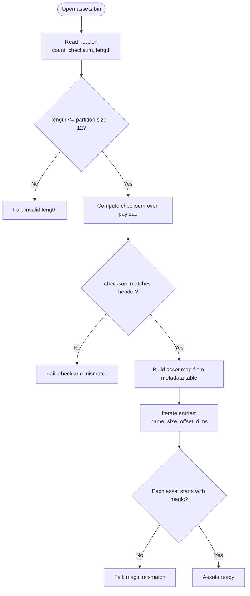
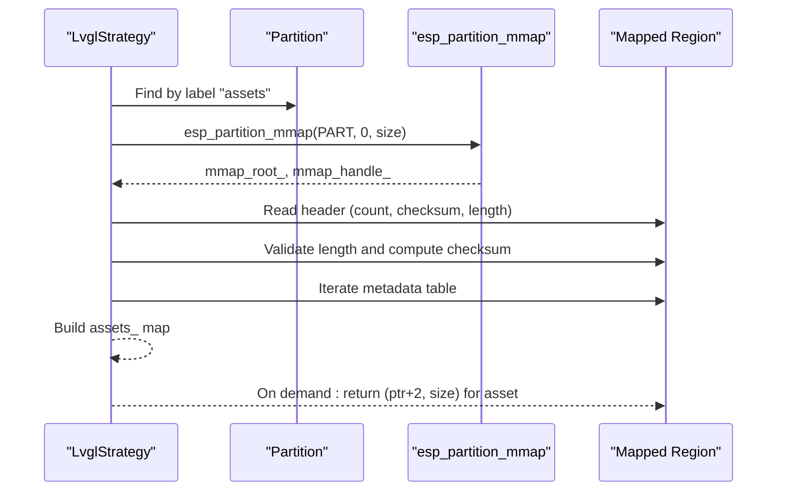
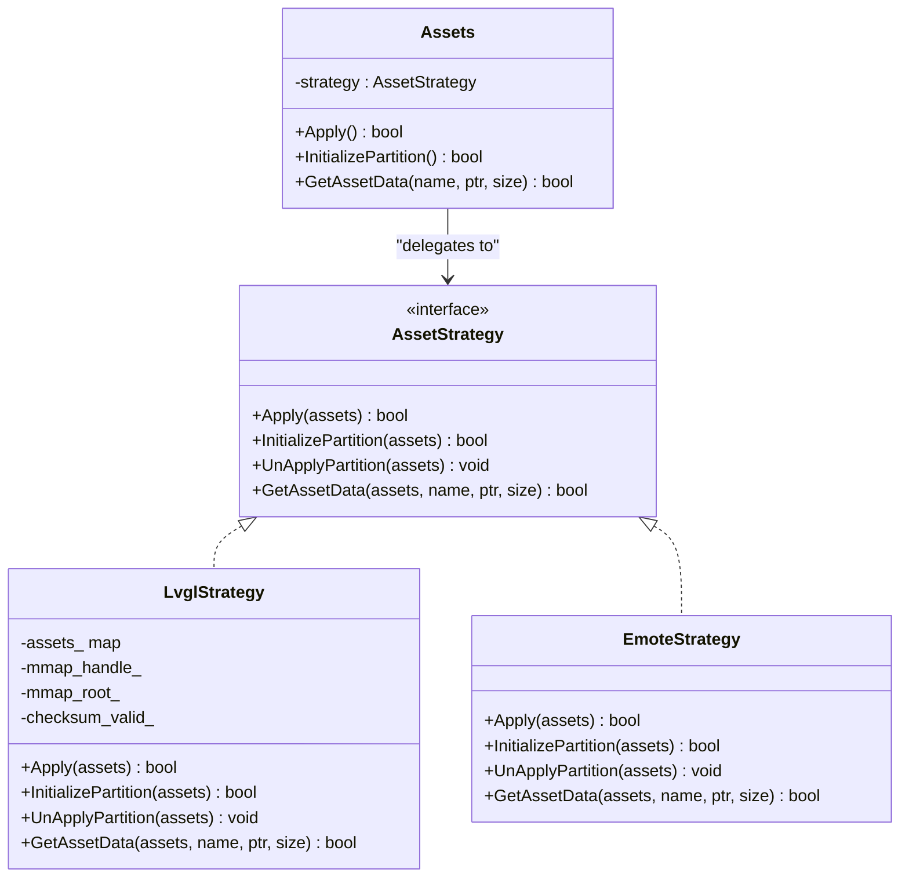
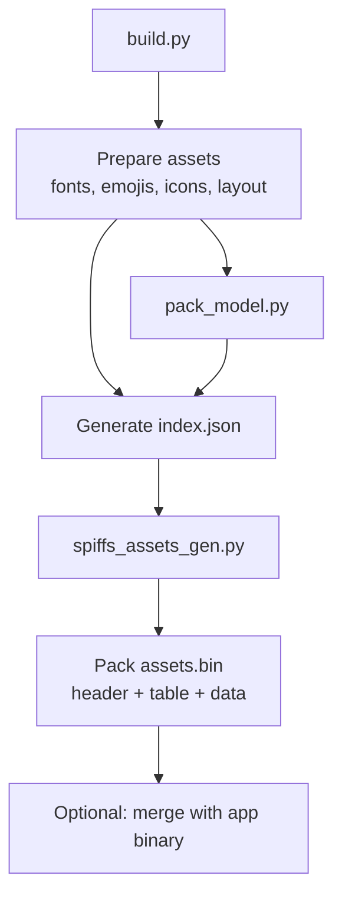
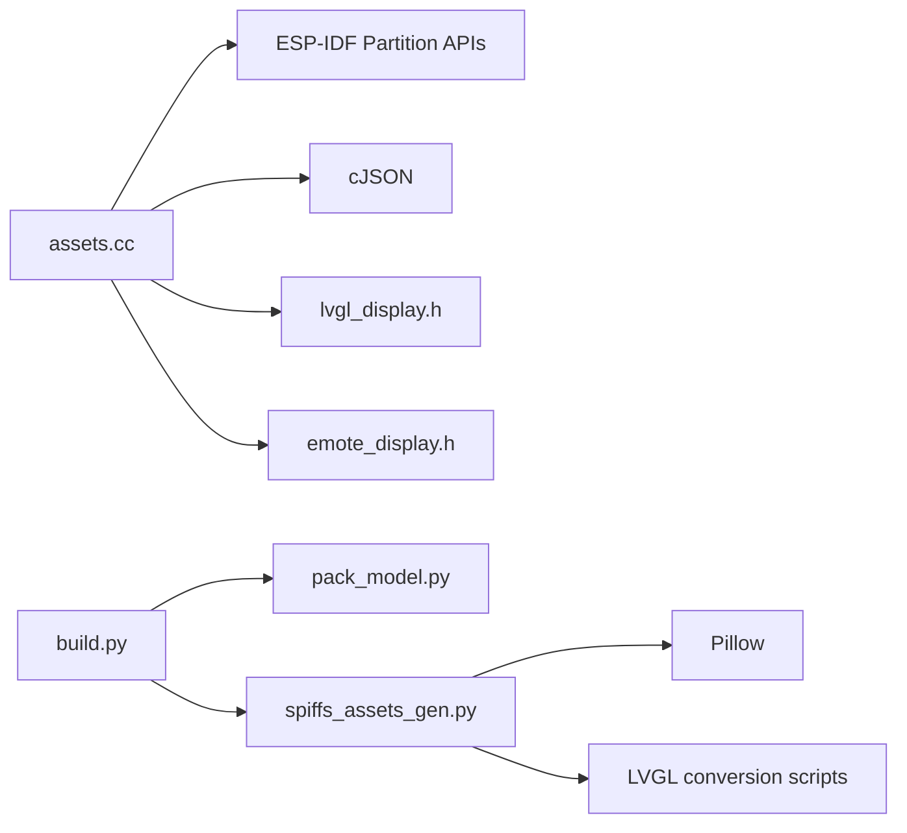

# SPIFFS Partitioning Strategy

<cite>
**Referenced Files in This Document**
- [partitions/v1/4m.csv](file://partitions/v1/4m.csv)
- [partitions/v1/8m.csv](file://partitions/v1/8m.csv)
- [partitions/v1/16m.csv](file://partitions/v1/16m.csv)
- [partitions/v1/32m.csv](file://partitions/v1/32m.csv)
- [partitions/v2/4m.csv](file://partitions/v2/4m.csv)
- [partitions/v2/8m.csv](file://partitions/v2/8m.csv)
- [partitions/v2/16m.csv](file://partitions/v2/16m.csv)
- [partitions/v2/32m.csv](file://partitions/v2/32m.csv)
- [assets.cc](file://main/assets.cc)
- [assets.h](file://main/assets.h)
- [spiffs_assets_gen.py](file://scripts/spiffs_assets/spiffs_assets_gen.py)
- [build.py](file://scripts/spiffs_assets/build.py)
- [pack_model.py](file://scripts/spiffs_assets/pack_model.py)
- [display.h](file://main/display/display.h)
- [lvgl_display.h](file://main/display/lvgl_display/lvgl_display.h)
- [emote_display.h](file://main/display/emote_display.h)
</cite>

## Table of Contents
1. [Introduction](#introduction)
2. [Project Structure](#project-structure)
3. [Core Components](#core-components)
4. [Architecture Overview](#architecture-overview)
5. [Detailed Component Analysis](#detailed-component-analysis)
6. [Dependency Analysis](#dependency-analysis)
7. [Performance Considerations](#performance-considerations)
8. [Troubleshooting Guide](#troubleshooting-guide)
9. [Conclusion](#conclusion)
10. [Appendices](#appendices)

## Introduction
This document describes the SPIFFS partitioning strategy used to manage embedded assets for display systems. It explains how partition tables are configured for different flash sizes, how assets are organized and validated, and how the system supports two display strategies (LVGL and Emote) via a strategy pattern. It also documents the asset storage format, memory-mapped access, checksum validation, and operational procedures for development and production.

## Project Structure
The SPIFFS assets strategy spans three areas:
- Partition tables define where assets live in flash for different board/memory configurations.
- Build-time tools assemble assets into a single binary with metadata and checksum.
- Runtime code mounts the partition, validates integrity, and exposes assets to the selected display strategy.

**Diagram sources**
- [partitions/v2/4m.csv:1-7](file://partitions/v2/4m.csv#L1-L7)
- [build.py:325-385](file://scripts/spiffs_assets/build.py#L325-L385)
- [spiffs_assets_gen.py:534-648](file://scripts/spiffs_assets/spiffs_assets_gen.py#L534-L648)
- [pack_model.py:41-124](file://scripts/spiffs_assets/pack_model.py#L41-L124)
- [assets.cc:30-65](file://main/assets.cc#L30-L65)
- [lvgl_display.h:15-54](file://main/display/lvgl_display/lvgl_display.h#L15-L54)
- [emote_display.h:14-51](file://main/display/emote_display.h#L14-L51)

**Section sources**
- [partitions/v1/4m.csv:1-8](file://partitions/v1/4m.csv#L1-L8)
- [partitions/v2/4m.csv:1-7](file://partitions/v2/4m.csv#L1-L7)
- [build.py:325-385](file://scripts/spiffs_assets/build.py#L325-L385)
- [spiffs_assets_gen.py:534-648](file://scripts/spiffs_assets/spiffs_assets_gen.py#L534-L648)

## Core Components
- Partition labeling and discovery: The runtime locates the assets partition by label and validates availability before mounting.
- Strategy pattern: Two strategies expose assets to different display stacks—LVGL and Emote—each with distinct initialization and asset retrieval semantics.
- Asset storage format: A header containing file count, checksum, and total payload length, followed by a metadata table and concatenated asset data.
- Memory-mapped access: LVGL strategy uses esp_partition_mmap to validate and access assets directly from flash.
- Validation pipeline: Integrity checks include partition size vs. free memory, header parsing, checksum verification, and per-file magic checks.

**Section sources**
- [assets.cc:44-65](file://main/assets.cc#L44-L65)
- [assets.h:48-87](file://main/assets.h#L48-L87)
- [assets.cc:122-185](file://main/assets.cc#L122-L185)
- [spiffs_assets_gen.py:455-458](file://scripts/spiffs_assets/spiffs_assets_gen.py#L455-L458)

## Architecture Overview
The runtime initializes the appropriate strategy depending on compile-time configuration. The LVGL strategy validates the partition via memory mapping and checksum, while the Emote strategy mounts the partition through the Emote subsystem. Both strategies rely on a shared assets index to locate resources.

**Diagram sources**
- [assets.cc:57-65](file://main/assets.cc#L57-L65)
- [assets.cc:130-185](file://main/assets.cc#L130-L185)
- [assets.cc:359-385](file://main/assets.cc#L359-L385)

## Detailed Component Analysis

### Partition Table Configurations
- v1 layout: Uses a dedicated data partition labeled "model" for assets, with OTA app partitions sized to fit within the flash budget.
- v2 layout: Uses a data partition labeled "assets" for assets, with OTA app partitions sized to fit within the flash budget. This is the modern approach used by the project.

Key characteristics by flash size:
- 4 MB: Small footprint suitable for minimal feature sets; assets partition is relatively small.
- 8 MB: Balanced for basic UI and a modest asset set.
- 16 MB: Larger assets partition enabling richer UI and animations.
- 32 MB: Large assets partition supporting extensive assets and high-resolution media.

Use cases:
- Development boards with limited flash often use 4 MB or 8 MB configurations.
- Production devices with rich UIs and animations commonly use 16 MB or 32 MB configurations.

**Section sources**
- [partitions/v1/4m.csv:1-8](file://partitions/v1/4m.csv#L1-L8)
- [partitions/v1/8m.csv:1-9](file://partitions/v1/8m.csv#L1-L9)
- [partitions/v1/16m.csv:1-9](file://partitions/v1/16m.csv#L1-L9)
- [partitions/v1/32m.csv:1-11](file://partitions/v1/32m.csv#L1-L11)
- [partitions/v2/4m.csv:1-7](file://partitions/v2/4m.csv#L1-L7)
- [partitions/v2/8m.csv:1-9](file://partitions/v2/8m.csv#L1-L9)
- [partitions/v2/16m.csv:1-9](file://partitions/v2/16m.csv#L1-L9)
- [partitions/v2/32m.csv:1-10](file://partitions/v2/32m.csv#L1-L10)

### Asset Storage Format
The assets binary begins with a header:
- 4-byte file count
- 4-byte checksum
- 4-byte total payload length

Immediately after the header comes:
- A metadata table of fixed-size entries, one per asset, containing:
  - Asset name (fixed-length)
  - Asset size
  - Asset offset
  - Width and height (for images)
- Concatenated asset data, prefixed with a 2-byte magic marker per asset

LVGL strategy reads this layout, validates the header, computes a checksum over the payload, and constructs an in-memory map keyed by asset name.

**Diagram sources**
- [assets.cc:155-184](file://main/assets.cc#L155-L184)
- [spiffs_assets_gen.py:455-458](file://scripts/spiffs_assets/spiffs_assets_gen.py#L455-L458)

**Section sources**
- [assets.cc:155-184](file://main/assets.cc#L155-L184)
- [spiffs_assets_gen.py:443-458](file://scripts/spiffs_assets/spiffs_assets_gen.py#L443-L458)

### Memory-Mapped Access Pattern (LVGL Strategy)
- The LVGL strategy uses esp_partition_mmap to map the entire assets partition into addressable memory.
- It verifies that sufficient free mapped pages exist to accommodate the partition size.
- It parses the header, validates length and checksum, and builds an in-memory asset map.
- Asset retrieval returns a pointer to the mapped region plus the asset’s declared size.

**Diagram sources**
- [assets.cc:130-185](file://main/assets.cc#L130-L185)

**Section sources**
- [assets.cc:130-185](file://main/assets.cc#L130-L185)

### Strategy Pattern Implementation (LVGL vs Emote)
- Compile-time selection determines which strategy is active.
- LVGL strategy:
  - Validates partition via mmap and checksum.
  - Loads fonts, emoji, and theme assets from index.json.
  - Applies theme to the active display.
- Emote strategy:
  - Uses the Emote subsystem to mount the partition.
  - Retrieves assets by name via Emote APIs.

**Diagram sources**
- [assets.h:48-87](file://main/assets.h#L48-L87)
- [assets.cc:30-65](file://main/assets.cc#L30-L65)
- [assets.cc:359-424](file://main/assets.cc#L359-L424)

**Section sources**
- [assets.h:48-87](file://main/assets.h#L48-L87)
- [assets.cc:30-65](file://main/assets.cc#L30-L65)
- [assets.cc:359-424](file://main/assets.cc#L359-L424)
- [display.h:6-9](file://main/display/display.h#L6-L9)

### Build Pipeline and Asset Packaging
- build.py orchestrates copying and preparing assets (fonts, emojis, icons, layout JSON) and generates index.json.
- spiffs_assets_gen.py merges assets into a single binary with a metadata table and checksum, and writes a generated header for convenience.
- pack_model.py bundles wake word models into a single binary consumed by the asset system.

**Diagram sources**
- [build.py:325-385](file://scripts/spiffs_assets/build.py#L325-L385)
- [spiffs_assets_gen.py:534-648](file://scripts/spiffs_assets/spiffs_assets_gen.py#L534-L648)
- [pack_model.py:41-124](file://scripts/spiffs_assets/pack_model.py#L41-L124)

**Section sources**
- [build.py:325-385](file://scripts/spiffs_assets/build.py#L325-L385)
- [spiffs_assets_gen.py:534-648](file://scripts/spiffs_assets/spiffs_assets_gen.py#L534-L648)
- [pack_model.py:41-124](file://scripts/spiffs_assets/pack_model.py#L41-L124)

### Partition Validation Procedures and Error Handling
- Partition discovery: Locate partition by label "assets".
- Free memory validation: Ensure mapped page budget allows mapping the entire partition.
- Header validation: Confirm payload length fits within partition minus header size.
- Checksum verification: Compute checksum over the payload and compare with header value.
- Per-asset validation: Each asset must start with a magic marker.
- Emote strategy: Mount via Emote subsystem and validate handle readiness.

Common failure modes and remedies:
- Partition not found: Verify label and partition table alignment.
- Insufficient mapped pages: Reduce assets size or increase free page budget.
- Length mismatch: Recreate assets.bin ensuring correct size.
- Checksum mismatch: Rebuild assets.bin with correct packing.
- Magic mismatch: Recreate assets.bin or fix asset content.

**Section sources**
- [assets.cc:130-185](file://main/assets.cc#L130-L185)
- [assets.cc:359-424](file://main/assets.cc#L359-L424)

### Relationship Between Partition Size and Available Storage
- v2 partition tables explicitly define the assets partition size for each flash capacity.
- The build pipeline compares the generated assets.bin size against the configured partition size and warns if the binary exceeds the partition capacity.
- Recommended partition sizing is derived from the binary size to avoid overflow.

Practical guidance:
- Start with the partition size closest to your needs and adjust upward if assets exceed capacity.
- Keep assets.bin under the partition limit to prevent runtime failures.

**Section sources**
- [partitions/v2/4m.csv:6-7](file://partitions/v2/4m.csv#L6-L7)
- [partitions/v2/8m.csv:8-8](file://partitions/v2/8m.csv#L8-L8)
- [partitions/v2/16m.csv:8-8](file://partitions/v2/16m.csv#L8-L8)
- [partitions/v2/32m.csv:9-9](file://partitions/v2/32m.csv#L9-L9)
- [spiffs_assets_gen.py:591-601](file://scripts/spiffs_assets/spiffs_assets_gen.py#L591-L601)

### Examples: Configuring Partitions for Development and Production
- Development (4 MB or 8 MB):
  - Use v2/4m.csv or v2/8m.csv.
  - Keep assets minimal; ensure assets.bin remains comfortably under partition size.
- Production (16 MB or 32 MB):
  - Use v2/16m.csv or v2/32m.csv.
  - Enable richer assets (high-res images, animations, extended fonts).
  - Validate post-build that assets.bin is smaller than partition size.

Operational steps:
- Select the appropriate CSV for the target board.
- Build assets with build.py and spiffs_assets_gen.py.
- Flash the firmware and assets partition; initialize assets at startup.

**Section sources**
- [partitions/v2/4m.csv:1-7](file://partitions/v2/4m.csv#L1-L7)
- [partitions/v2/8m.csv:1-9](file://partitions/v2/8m.csv#L1-L9)
- [partitions/v2/16m.csv:1-9](file://partitions/v2/16m.csv#L1-L9)
- [partitions/v2/32m.csv:1-10](file://partitions/v2/32m.csv#L1-L10)
- [build.py:325-385](file://scripts/spiffs_assets/build.py#L325-L385)
- [spiffs_assets_gen.py:534-648](file://scripts/spiffs_assets/spiffs_assets_gen.py#L534-L648)

## Dependency Analysis
- Runtime depends on:
  - ESP-IDF partition APIs for discovery and mapping.
  - LVGL or Emote subsystems for rendering.
  - cJSON for parsing index.json.
- Build tools depend on:
  - PIL/Pillow for image processing.
  - LVGL conversion scripts for raw image generation.
  - Python packaging for version-aware script downloads.

**Diagram sources**
- [assets.cc:1-17](file://main/assets.cc#L1-L17)
- [assets.h:8-16](file://main/assets.h#L8-L16)
- [build.py:16-23](file://scripts/spiffs_assets/build.py#L16-L23)
- [spiffs_assets_gen.py:16-23](file://scripts/spiffs_assets/spiffs_assets_gen.py#L16-L23)

**Section sources**
- [assets.cc:1-17](file://main/assets.cc#L1-L17)
- [assets.h:8-16](file://main/assets.h#L8-L16)
- [build.py:16-23](file://scripts/spiffs_assets/build.py#L16-L23)
- [spiffs_assets_gen.py:16-23](file://scripts/spiffs_assets/spiffs_assets_gen.py#L16-L23)

## Performance Considerations
- Memory-mapped access avoids copying assets into RAM, reducing RAM usage and speeding up asset retrieval.
- Checksum computation occurs once during initialization; subsequent asset access is O(1) via the in-memory map.
- Image splitting and compression options in the build pipeline can reduce assets.bin size at the cost of increased build time and potential decompression overhead at runtime.

## Troubleshooting Guide
- Assets not found:
  - Verify partition label "assets" exists and is correctly named in the CSV.
  - Ensure assets.bin was flashed to the assets partition.
- Initialization fails:
  - Check mapped page availability and partition size.
  - Confirm assets.bin length and checksum match header values.
- LVGL display issues:
  - Validate index.json correctness and presence of required assets (fonts, emoji, background).
- Emote display issues:
  - Ensure Emote handle is initialized and mounted successfully.

**Section sources**
- [assets.cc:130-185](file://main/assets.cc#L130-L185)
- [assets.cc:359-424](file://main/assets.cc#L359-L424)

## Conclusion
The SPIFFS partitioning strategy cleanly separates asset packaging from runtime consumption. By using a labeled assets partition, a standardized binary format, and a strategy pattern, the system supports both LVGL and Emote display stacks while maintaining robust validation and efficient memory access. Proper partition sizing, build-time checks, and clear labeling are essential for reliable operation across development and production environments.

## Appendices

### Asset Binary Header Fields
- File count: 4 bytes
- Combined checksum: 4 bytes
- Total payload length: 4 bytes
- Metadata table: N entries of fixed size
- Asset data: Concatenated, each prefixed with a 2-byte magic

**Section sources**
- [spiffs_assets_gen.py:455-458](file://scripts/spiffs_assets/spiffs_assets_gen.py#L455-L458)
- [assets.cc:155-184](file://main/assets.cc#L155-L184)