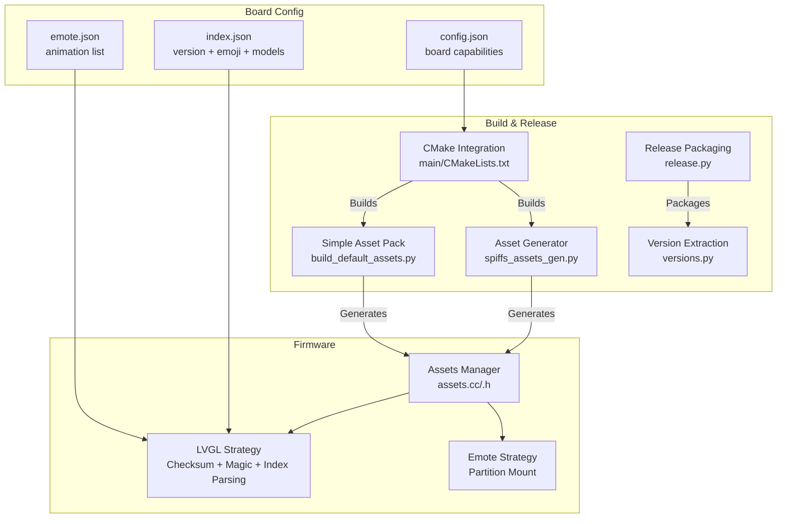
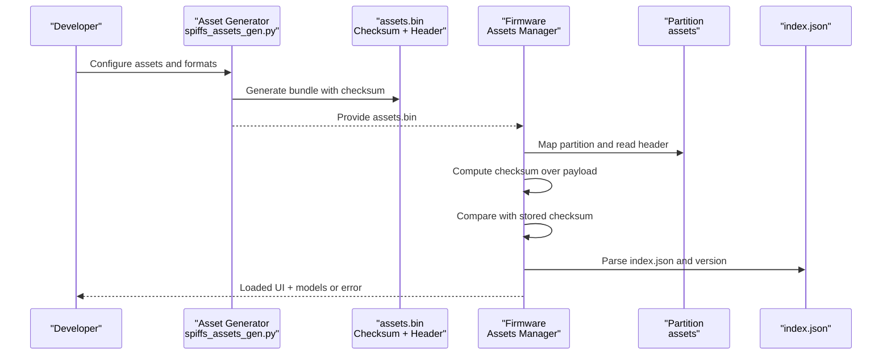
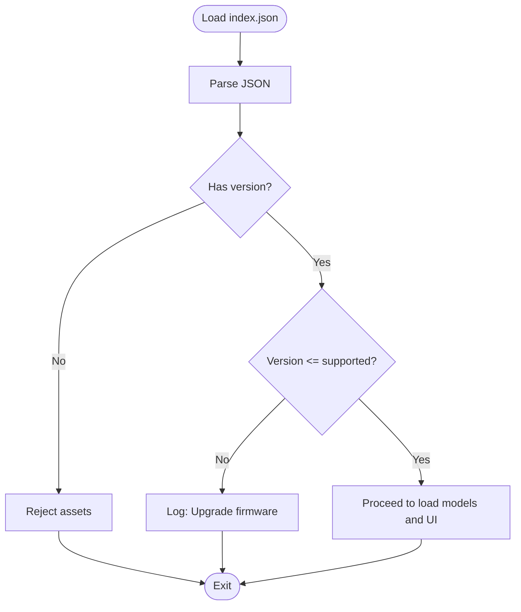
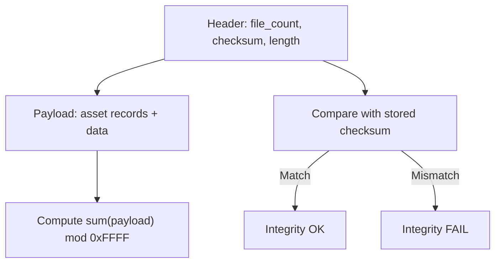
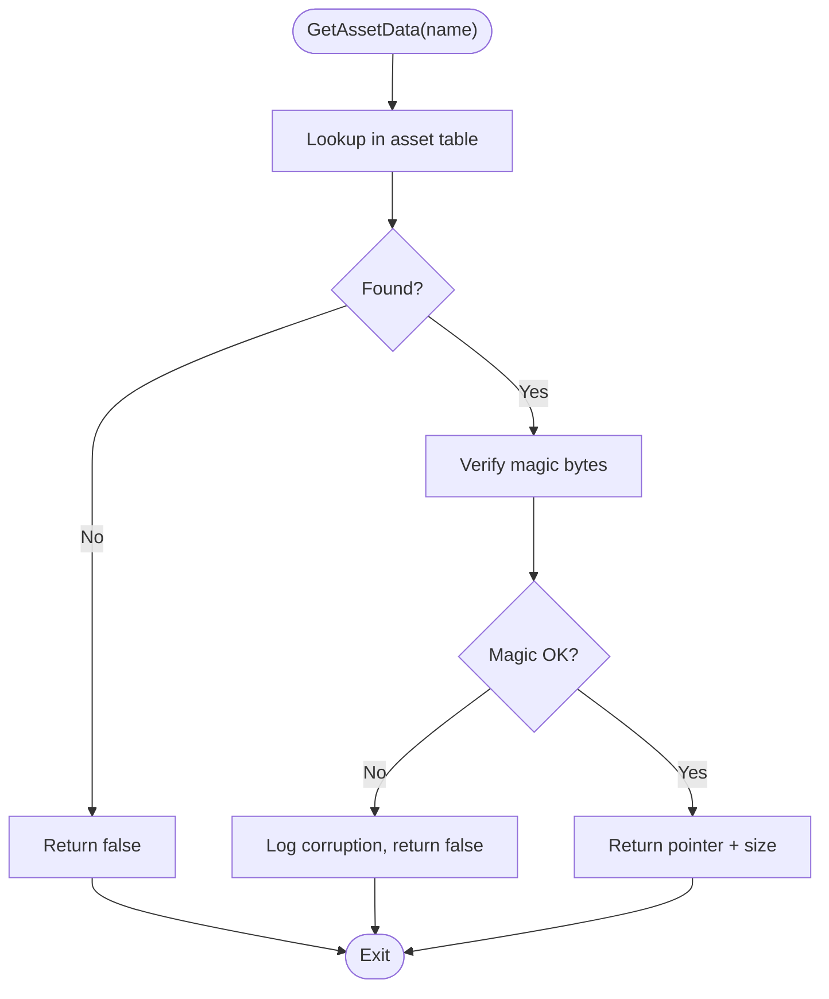
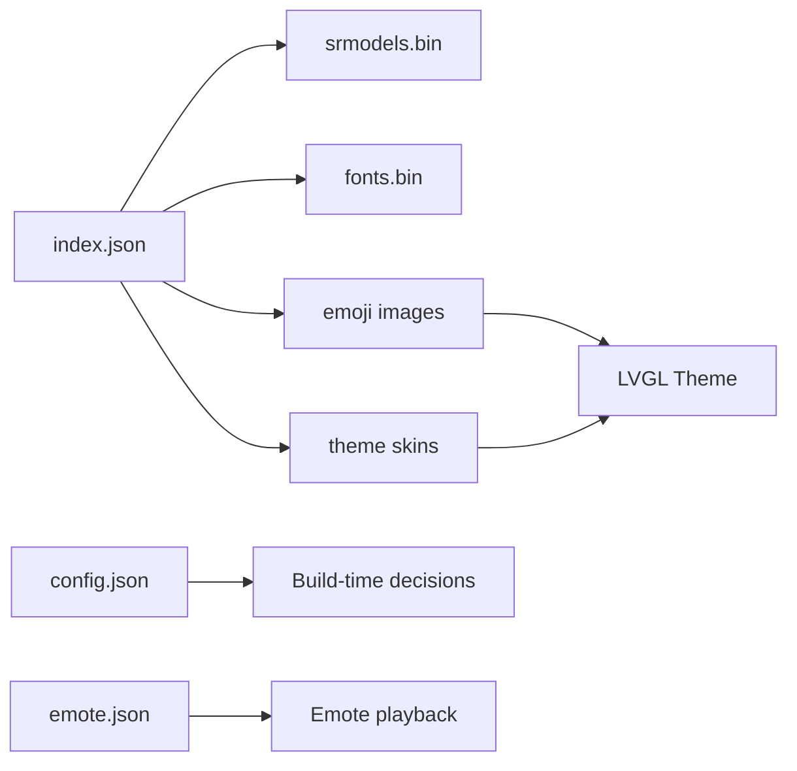
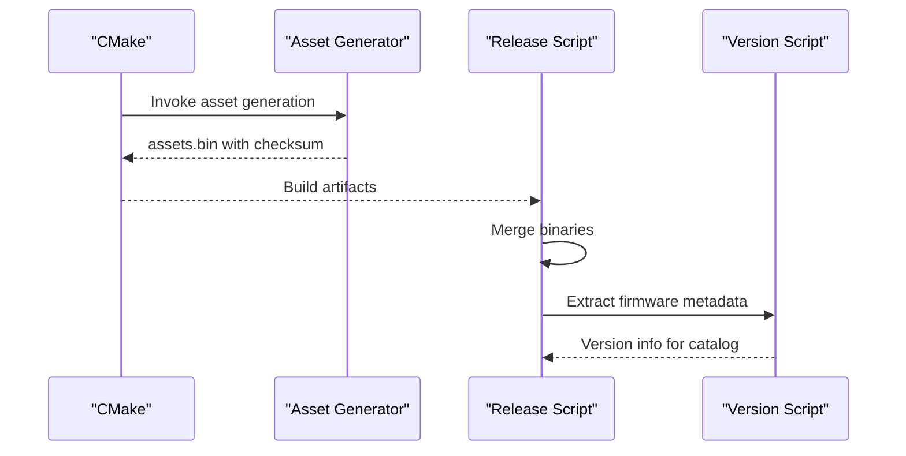
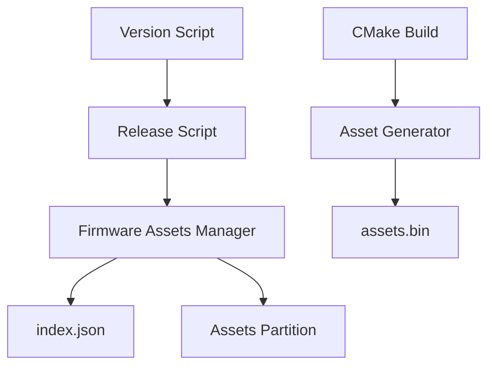

# Version Management and Integrity

<cite>
**Referenced Files in This Document**
- [index.json](file://main/boards/lulu-esp32s3/assets/index.json)
- [assets.h](file://main/assets.h)
- [assets.cc](file://main/assets.cc)
- [spiffs_assets_gen.py](file://scripts/spiffs_assets/spiffs_assets_gen.py)
- [build_default_assets.py](file://scripts/build_default_assets.py)
- [CMakeLists.txt](file://main/CMakeLists.txt)
- [CMakeLists.txt](file://CMakeLists.txt)
- [release.py](file://scripts/release.py)
- [versions.py](file://scripts/versions.py)
- [config.json](file://main/boards/lulu-esp32s3/config.json)
- [emote.json](file://main/boards/lulu-esp32s3/emote.json)
</cite>

## Table of Contents
1. [Introduction](#introduction)
2. [Project Structure](#project-structure)
3. [Core Components](#core-components)
4. [Architecture Overview](#architecture-overview)
5. [Detailed Component Analysis](#detailed-component-analysis)
6. [Dependency Analysis](#dependency-analysis)
7. [Performance Considerations](#performance-considerations)
8. [Troubleshooting Guide](#troubleshooting-guide)
9. [Conclusion](#conclusion)
10. [Appendices](#appendices)

## Introduction
This document explains the version management and integrity-checking mechanisms for assets across the device lifecycle. It covers:
- The version tracking system in index.json and backward compatibility checks during runtime
- Checksum calculation and verification for asset binaries
- Integrity validation including magic number checks, size verification, and corruption detection
- Dependencies among assets, models, and configuration files
- Versioning strategies for different deployment scenarios and rollback procedures
- Build system integration for version stamping, automated integrity checks, and release validation
- Practical guidance for handling version mismatches, graceful degradation, and maintaining consistency across deployments

## Project Structure
The asset system spans firmware, scripts, and board-specific configurations:
- Firmware loads and validates assets from a dedicated partition and parses index.json to configure UI and models
- Scripts generate asset bundles, compute checksums, and produce build artifacts
- Build and release scripts orchestrate versioning and packaging

**Diagram sources**
- [assets.cc](file://main/assets.cc)
- [assets.h](file://main/assets.h)
- [spiffs_assets_gen.py](file://scripts/spiffs_assets/spiffs_assets_gen.py)
- [build_default_assets.py](file://scripts/build_default_assets.py)
- [CMakeLists.txt](file://main/CMakeLists.txt)
- [release.py](file://scripts/release.py)
- [versions.py](file://scripts/versions.py)
- [index.json](file://main/boards/lulu-esp32s3/assets/index.json)
- [config.json](file://main/boards/lulu-esp32s3/config.json)
- [emote.json](file://main/boards/lulu-esp32s3/emote.json)

**Section sources**
- [assets.cc](file://main/assets.cc)
- [assets.h](file://main/assets.h)
- [spiffs_assets_gen.py](file://scripts/spiffs_assets/spiffs_assets_gen.py)
- [build_default_assets.py](file://scripts/build_default_assets.py)
- [CMakeLists.txt](file://main/CMakeLists.txt)
- [release.py](file://scripts/release.py)
- [versions.py](file://scripts/versions.py)
- [index.json](file://main/boards/lulu-esp32s3/assets/index.json)
- [config.json](file://main/boards/lulu-esp32s3/config.json)
- [emote.json](file://main/boards/lulu-esp32s3/emote.json)

## Core Components
- Assets Manager: Provides unified interface to load assets, apply strategies, and manage partition lifecycle
- LVGL Strategy: Validates asset binary integrity, parses index.json, and configures UI resources
- Emote Strategy: Mounts assets via partition for non-LVGL targets
- Asset Generators: Produce asset bundles with checksums and metadata
- Build and Release Scripts: Integrate versioning, packaging, and release validation

Key responsibilities:
- Version tracking and compatibility checks in index.json
- 16-bit checksum computation and verification
- Magic number validation and size checks
- Dependency resolution between assets, models, and configuration files
- Rollback and graceful degradation on integrity failures

**Section sources**
- [assets.h](file://main/assets.h)
- [assets.cc](file://main/assets.cc)
- [spiffs_assets_gen.py](file://scripts/spiffs_assets/spiffs_assets_gen.py)
- [build_default_assets.py](file://scripts/build_default_assets.py)

## Architecture Overview
The asset pipeline integrates build-time generation with runtime validation:

**Diagram sources**
- [spiffs_assets_gen.py](file://scripts/spiffs_assets/spiffs_assets_gen.py)
- [assets.cc](file://main/assets.cc)
- [index.json](file://main/boards/lulu-esp32s3/assets/index.json)

## Detailed Component Analysis

### Version Tracking in index.json and Backward Compatibility
- index.json contains a version field used at runtime to gate compatibility
- The firmware reads index.json and compares the version against supported ranges
- If unsupported, the firmware logs an error and refuses to apply assets, requiring firmware upgrade

**Diagram sources**
- [assets.cc](file://main/assets.cc)
- [index.json](file://main/boards/lulu-esp32s3/assets/index.json)

**Section sources**
- [assets.cc](file://main/assets.cc)
- [index.json](file://main/boards/lulu-esp32s3/assets/index.json)

### Checksum Calculation and Verification
- Build-time checksum: Sum of bytes modulo 0xFFFF produced by asset generators
- Runtime checksum: Sum of bytes modulo 0xFFFF computed over mapped payload
- Stored in the asset binary header alongside total file count and combined length
- Used to detect corruption and tampering

**Diagram sources**
- [spiffs_assets_gen.py](file://scripts/spiffs_assets/spiffs_assets_gen.py)
- [build_default_assets.py](file://scripts/build_default_assets.py)
- [assets.cc](file://main/assets.cc)

**Section sources**
- [spiffs_assets_gen.py](file://scripts/spiffs_assets/spiffs_assets_gen.py)
- [build_default_assets.py](file://scripts/build_default_assets.py)
- [assets.cc](file://main/assets.cc)

### Asset Integrity Checking Mechanisms
- Magic number validation: Each asset record begins with a two-byte marker; runtime loader verifies it before serving data
- Size verification: Loader ensures offsets and sizes fall within mapped region boundaries
- Corruption detection: Combined checksum and per-record magic guard against partial writes and bit flips

**Diagram sources**
- [assets.cc](file://main/assets.cc)

**Section sources**
- [assets.cc](file://main/assets.cc)

### Dependency Management Between Assets, Models, and Configuration
- index.json declares:
  - version for compatibility gating
  - srmodels reference for voice model loading
  - text_font for UI fonts
  - emoji_collection for animated emojis
  - skin configuration for theme colors and backgrounds
- emote.json lists animation sequences for emote playback
- config.json describes board capabilities influencing asset availability and partition sizing

**Diagram sources**
- [index.json](file://main/boards/lulu-esp32s3/assets/index.json)
- [emote.json](file://main/boards/lulu-esp32s3/emote.json)
- [config.json](file://main/boards/lulu-esp32s3/config.json)

**Section sources**
- [index.json](file://main/boards/lulu-esp32s3/assets/index.json)
- [emote.json](file://main/boards/lulu-esp32s3/emote.json)
- [config.json](file://main/boards/lulu-esp32s3/config.json)

### Versioning Strategies and Rollback Procedures
- Version stamping: Project version is defined in the root CMake file and used by release packaging
- Release packaging: Generates zipped firmware artifacts with versioned filenames
- Rollback: On integrity failure or version mismatch, firmware refuses to apply assets and can trigger safe fallback behavior

Recommended rollback steps:
- Keep previous assets.bin and firmware versions
- Re-flash firmware if index.json version is unsupported
- Re-flash assets.bin if checksum mismatch occurs
- Validate partition size and free pages before applying updates

**Section sources**
- [CMakeLists.txt](file://CMakeLists.txt)
- [release.py](file://scripts/release.py)
- [assets.cc](file://main/assets.cc)

### Build System Integration for Version Stamping and Release Validation
- Asset generation targets are integrated into CMake to produce assets.bin with checksums and metadata
- Release script compiles variants, merges binaries, and packages them with versioned filenames
- Version extraction script parses merged binaries to extract metadata for release catalogs

**Diagram sources**
- [CMakeLists.txt](file://main/CMakeLists.txt)
- [spiffs_assets_gen.py](file://scripts/spiffs_assets/spiffs_assets_gen.py)
- [release.py](file://scripts/release.py)
- [versions.py](file://scripts/versions.py)

**Section sources**
- [CMakeLists.txt](file://main/CMakeLists.txt)
- [spiffs_assets_gen.py](file://scripts/spiffs_assets/spiffs_assets_gen.py)
- [release.py](file://scripts/release.py)
- [versions.py](file://scripts/versions.py)

## Dependency Analysis
- Firmware depends on:
  - Assets partition mapped via LVGL strategy
  - index.json for configuration and compatibility
  - srmodels.bin and fonts.bin for UI/audio functionality
- Build system depends on:
  - Asset generator scripts to produce assets.bin
  - CMake to orchestrate generation and linking
  - Release and version scripts for packaging and metadata extraction

Potential coupling and risks:
- Tight coupling between index.json version and firmware compatibility
- Risk of mismatch if assets.bin is built for a different firmware version
- Partition size must accommodate combined asset size plus overhead

**Diagram sources**
- [assets.cc](file://main/assets.cc)
- [spiffs_assets_gen.py](file://scripts/spiffs_assets/spiffs_assets_gen.py)
- [CMakeLists.txt](file://main/CMakeLists.txt)
- [release.py](file://scripts/release.py)
- [versions.py](file://scripts/versions.py)

**Section sources**
- [assets.cc](file://main/assets.cc)
- [spiffs_assets_gen.py](file://scripts/spiffs_assets/spiffs_assets_gen.py)
- [CMakeLists.txt](file://main/CMakeLists.txt)
- [release.py](file://scripts/release.py)
- [versions.py](file://scripts/versions.py)

## Performance Considerations
- Checksum computation time is logged; ensure payload sizes remain reasonable to avoid long initialization delays
- Magic number checks are O(1) and lightweight
- Partition mapping requires sufficient free pages; monitor storage size before applying updates
- Streaming downloads and sector-wise erases minimize risk during OTA updates

[No sources needed since this section provides general guidance]

## Troubleshooting Guide
Common issues and resolutions:
- Version mismatch: index.json version exceeds supported range; update firmware or align assets
- Checksum mismatch: assets.bin corrupted or mismatched; re-generate and re-flash
- Magic number invalid: asset record corrupted; re-pack assets
- Partition size exceeded: asset binary too large; adjust partition or reduce assets
- OTA download failure: insufficient free pages or network issues; retry with proper partition sizing

Operational tips:
- Log messages indicate exact failure points (checksum, magic, size)
- Graceful degradation: on failure, firmware keeps previous state and avoids applying broken assets
- Use release and version scripts to validate packaged artifacts

**Section sources**
- [assets.cc](file://main/assets.cc)
- [spiffs_assets_gen.py](file://scripts/spiffs_assets/spiffs_assets_gen.py)
- [build_default_assets.py](file://scripts/build_default_assets.py)
- [release.py](file://scripts/release.py)
- [versions.py](file://scripts/versions.py)

## Conclusion
The asset system enforces integrity through checksums and magic markers, validates compatibility via index.json versioning, and integrates tightly with the build and release pipeline. By following the recommended versioning and rollback procedures, teams can maintain consistency across deployments and handle mismatches gracefully.

[No sources needed since this section summarizes without analyzing specific files]

## Appendices

### Example Scenarios and Best Practices
- Handling version mismatches:
  - Detect unsupported version in index.json
  - Prompt user or system to upgrade firmware
  - Re-flash compatible assets after firmware update
- Implementing graceful degradation:
  - Fall back to default UI and minimal assets on integrity failure
  - Preserve previous partition mapping until validated
- Maintaining consistency:
  - Always rebuild assets.bin when changing index.json or adding/removing assets
  - Verify partition size and free pages before OTA updates
  - Use release scripts to package and version artifacts consistently

[No sources needed since this section provides general guidance]