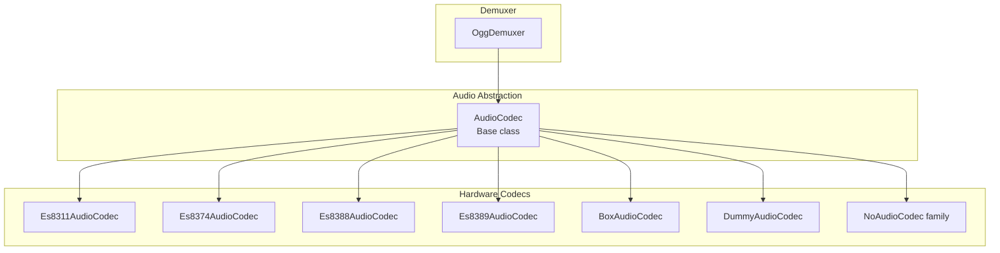
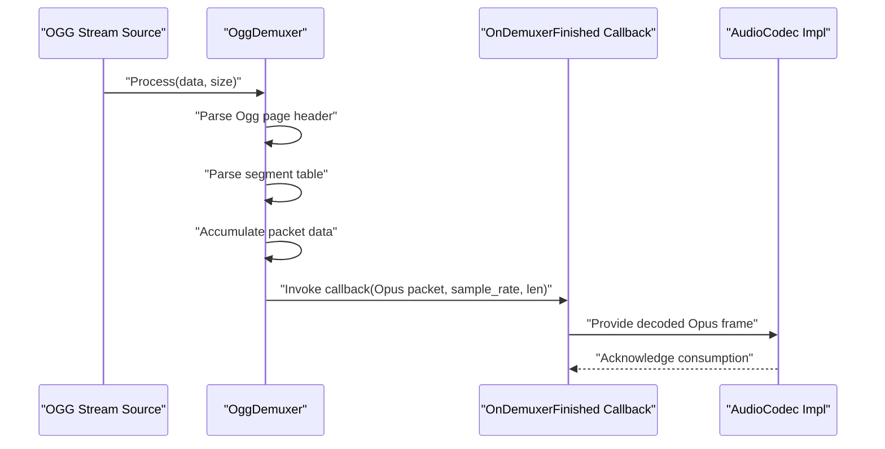
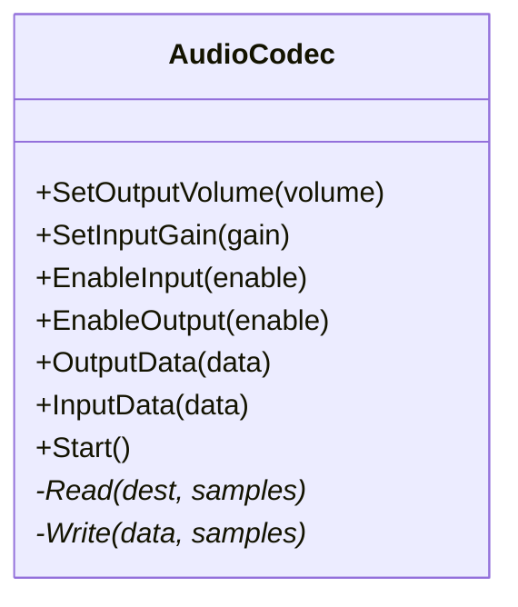
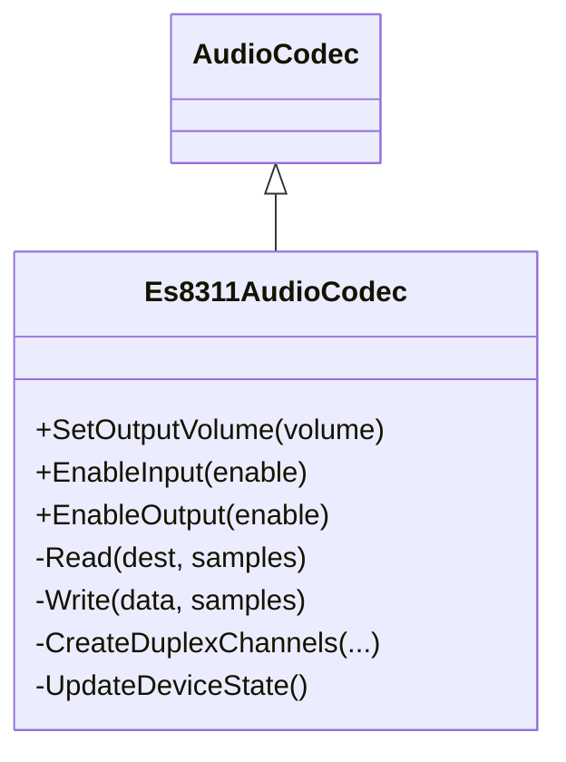
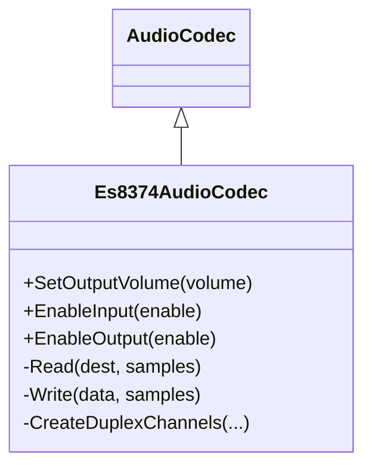
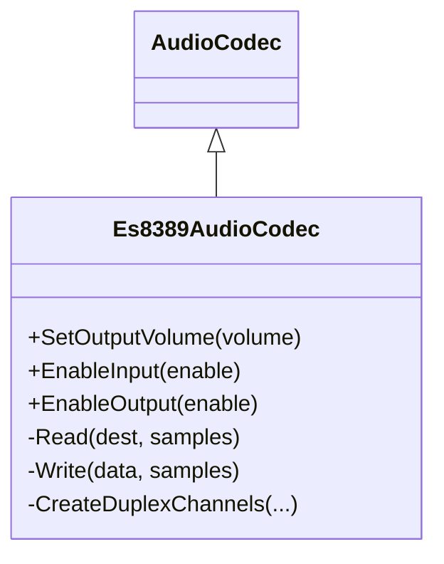
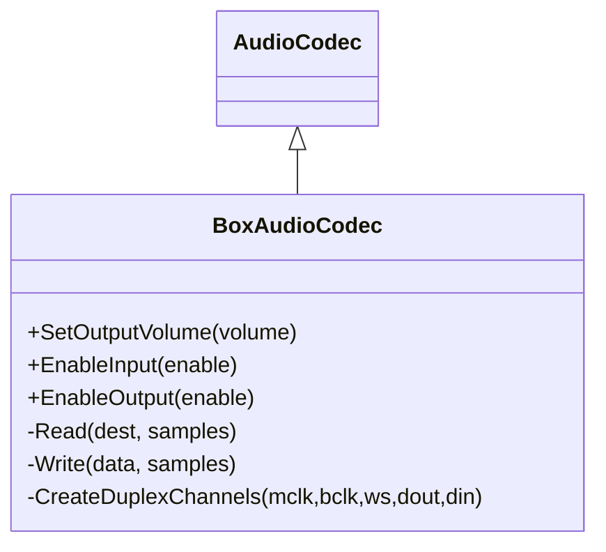
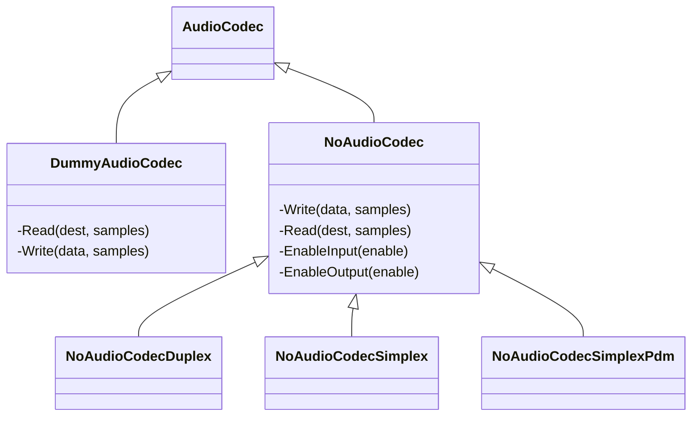
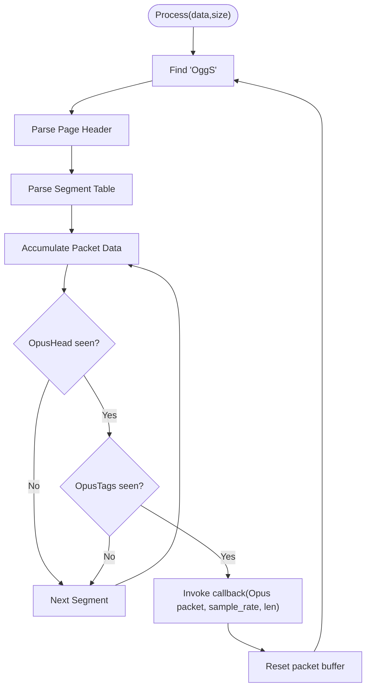
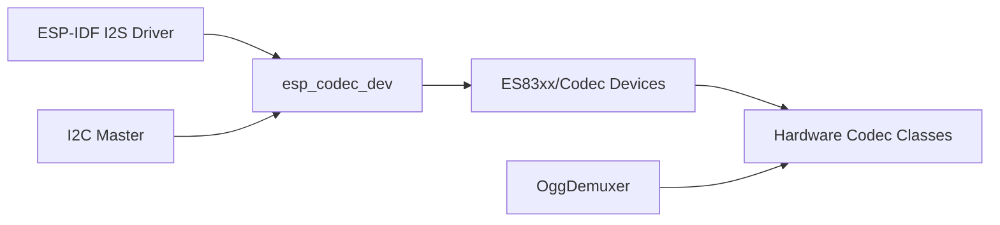

# Audio Codecs and Formats

<cite>
**Referenced Files in This Document**
- [audio_codec.h](file://main/audio/audio_codec.h)
- [audio_codec.cc](file://main/audio/audio_codec.cc)
- [ogg_demuxer.h](file://main/audio/demuxer/ogg_demuxer.h)
- [ogg_demuxer.cc](file://main/audio/demuxer/ogg_demuxer.cc)
- [es8311_audio_codec.h](file://main/audio/codecs/es8311_audio_codec.h)
- [es8311_audio_codec.cc](file://main/audio/codecs/es8311_audio_codec.cc)
- [es8374_audio_codec.h](file://main/audio/codecs/es8374_audio_codec.h)
- [es8374_audio_codec.cc](file://main/audio/codecs/es8374_audio_codec.cc)
- [es8388_audio_codec.h](file://main/audio/codecs/es8388_audio_codec.h)
- [es8388_audio_codec.cc](file://main/audio/codecs/es8388_audio_codec.cc)
- [es8389_audio_codec.h](file://main/audio/codecs/es8389_audio_codec.h)
- [es8389_audio_codec.cc](file://main/audio/codecs/es8389_audio_codec.cc)
- [box_audio_codec.h](file://main/audio/codecs/box_audio_codec.h)
- [box_audio_codec.cc](file://main/audio/codecs/box_audio_codec.cc)
- [dummy_audio_codec.h](file://main/audio/codecs/dummy_audio_codec.h)
- [dummy_audio_codec.cc](file://main/audio/codecs/dummy_audio_codec.cc)
- [no_audio_codec.h](file://main/audio/codecs/no_audio_codec.h)
- [no_audio_codec.cc](file://main/audio/codecs/no_audio_codec.cc)
</cite>

## Table of Contents
1. [Introduction](#introduction)
2. [Project Structure](#project-structure)
3. [Core Components](#core-components)
4. [Architecture Overview](#architecture-overview)
5. [Detailed Component Analysis](#detailed-component-analysis)
6. [Dependency Analysis](#dependency-analysis)
7. [Performance Considerations](#performance-considerations)
8. [Troubleshooting Guide](#troubleshooting-guide)
9. [Conclusion](#conclusion)
10. [Appendices](#appendices)

## Introduction
This document explains the audio codec implementations and format support in the project. It focuses on:
- Codec abstraction layer and hardware-specific implementations for ES8311, ES8374, ES8388, ES8389, and a specialized Box codec.
- The OGG demuxer for streaming audio, including Opus container parsing and metadata extraction.
- Initialization sequences, parameter validation, error handling, and format conversion processes.
- Practical configuration guidance for different audio quality scenarios and troubleshooting tips.

## Project Structure
The audio subsystem is organized around a base codec interface and multiple hardware-specific implementations. An OGG demuxer extracts Opus frames and sample rate metadata from OGG containers.

**Diagram sources**
- [audio_codec.h:17-59](file://main/audio/audio_codec.h#L17-L59)
- [es8311_audio_codec.h:13-40](file://main/audio/codecs/es8311_audio_codec.h#L13-L40)
- [es8374_audio_codec.h:13-40](file://main/audio/codecs/es8374_audio_codec.h#L13-L40)
- [es8388_audio_codec.h:12-39](file://main/audio/codecs/es8388_audio_codec.h#L12-L39)
- [es8389_audio_codec.h:12-38](file://main/audio/codecs/es8389_audio_codec.h#L12-L38)
- [box_audio_codec.h:11-38](file://main/audio/codecs/box_audio_codec.h#L11-L38)
- [dummy_audio_codec.h:6-15](file://main/audio/codecs/dummy_audio_codec.h#L6-L15)
- [no_audio_codec.h:10-41](file://main/audio/codecs/no_audio_codec.h#L10-L41)
- [ogg_demuxer.h:9-61](file://main/audio/demuxer/ogg_demuxer.h#L9-L61)

**Section sources**
- [audio_codec.h:17-59](file://main/audio/audio_codec.h#L17-L59)
- [ogg_demuxer.h:9-61](file://main/audio/demuxer/ogg_demuxer.h#L9-L61)

## Core Components
- AudioCodec: Base interface defining I/O, enabling/disabling, and common state (sample rates, channels, gains, volumes). It delegates actual I2S/I2C operations to derived classes.
- Hardware codecs: Implementers for ES83xx series and a specialized Box codec, each initializing I2S channels and codec devices via esp_codec_dev APIs.
- OggDemuxer: Streaming demuxer for OGG/Opus that parses page headers, segment tables, and extracts OpusHead/OpusTags to deliver Opus packets with detected sample rate.

Key responsibilities:
- Volume/gain control and persistence.
- Duplex vs simplex operation and channel configuration.
- Device open/close lifecycle and mutex-protected access to codec devices.
- OGG page parsing and Opus metadata extraction.

**Section sources**
- [audio_codec.cc:17-67](file://main/audio/audio_codec.cc#L17-L67)
- [es8311_audio_codec.cc:100-156](file://main/audio/codecs/es8311_audio_codec.cc#L100-L156)
- [es8374_audio_codec.cc:76-132](file://main/audio/codecs/es8374_audio_codec.cc#L76-L132)
- [es8388_audio_codec.cc:85-137](file://main/audio/codecs/es8388_audio_codec.cc#L85-L137)
- [es8389_audio_codec.cc:84-137](file://main/audio/codecs/es8389_audio_codec.cc#L84-L137)
- [box_audio_codec.cc:94-182](file://main/audio/codecs/box_audio_codec.cc#L94-L182)
- [ogg_demuxer.cc:36-310](file://main/audio/demuxer/ogg_demuxer.cc#L36-L310)

## Architecture Overview
The system composes a codec abstraction with hardware-specific implementations and an OGG demuxer. The demuxer feeds Opus packets and sample rate metadata to the upper layers, which typically route them to encoding or playback pipelines.

**Diagram sources**
- [ogg_demuxer.cc:36-310](file://main/audio/demuxer/ogg_demuxer.cc#L36-L310)
- [ogg_demuxer.h:50-54](file://main/audio/demuxer/ogg_demuxer.h#L50-L54)

## Detailed Component Analysis

### AudioCodec Abstraction Layer
- Purpose: Unified interface for input/output, enabling/disabling, and state management.
- Notable behaviors:
  - Output volume persistence via Settings.
  - Input gain and output volume setters with logging.
  - Start routine reads persisted output volume and validates it.
  - Read/Write delegation to derived classes.

**Diagram sources**
- [audio_codec.h:17-59](file://main/audio/audio_codec.h#L17-L59)

**Section sources**
- [audio_codec.cc:17-67](file://main/audio/audio_codec.cc#L17-L67)

### ES8311 Audio Codec
- Capabilities: Full-duplex I2S with ES8311 DAC/ADC via esp_codec_dev.
- Initialization:
  - Creates I2S channels in STD mode for both TX/RX.
  - Initializes codec control via I2C and GPIO interfaces.
  - Opens codec device with 16-bit, mono, configured sample rate.
- Features:
  - Output volume control via codec device.
  - Input gain control.
  - Optional PA pin control with inversion support.

**Diagram sources**
- [es8311_audio_codec.h:13-40](file://main/audio/codecs/es8311_audio_codec.h#L13-L40)
- [es8311_audio_codec.cc:70-98](file://main/audio/codecs/es8311_audio_codec.cc#L70-L98)

**Section sources**
- [es8311_audio_codec.cc:7-59](file://main/audio/codecs/es8311_audio_codec.cc#L7-L59)

### ES8374 Audio Codec
- Capabilities: Separate input/output codec devices with ES8374.
- Initialization:
  - Creates I2S channels in STD mode.
  - Builds separate esp_codec_dev handles for input and output.
- Features:
  - Per-direction open/close with sample info.
  - Output volume control and optional PA pin activation.

**Diagram sources**
- [es8374_audio_codec.h:13-40](file://main/audio/codecs/es8374_audio_codec.h#L13-L40)
- [es8374_audio_codec.cc:76-132](file://main/audio/codecs/es8374_audio_codec.cc#L76-L132)

**Section sources**
- [es8374_audio_codec.cc:7-62](file://main/audio/codecs/es8374_audio_codec.cc#L7-L62)

### ES8388 Audio Codec
- Capabilities: Full-duplex with optional echo-cancel reference input.
- Initialization:
  - Creates I2S channels in STD mode.
  - Uses ES8388 codec device with master mode and PA control.
- Features:
  - Reference input support toggles channel count/mask.
  - Sets analog headphone/spkr volumes to 0 dB by default.
  - Input gain or reference PGA programming depending on mode.

**Diagram sources**
- [es8388_audio_codec.h:12-39](file://main/audio/codecs/es8388_audio_codec.h#L12-L39)
- [es8388_audio_codec.cc:85-137](file://main/audio/codecs/es8388_audio_codec.cc#L85-L137)

**Section sources**
- [es8388_audio_codec.cc:7-71](file://main/audio/codecs/es8388_audio_codec.cc#L7-L71)

### ES8389 Audio Codec
- Capabilities: Full-duplex with ES8389.
- Initialization:
  - Creates I2S channels in STD mode.
  - Builds separate input/output codec devices.
- Features:
  - Output volume control and optional PA pin activation.
  - Input gain control during enable.

**Diagram sources**
- [es8389_audio_codec.h:12-38](file://main/audio/codecs/es8389_audio_codec.h#L12-L38)
- [es8389_audio_codec.cc:84-137](file://main/audio/codecs/es8389_audio_codec.cc#L84-L137)

**Section sources**
- [es8389_audio_codec.cc:7-70](file://main/audio/codecs/es8389_audio_codec.cc#L7-L70)

### Box Audio Codec (Specialized)
- Capabilities: Dual-codec setup with ES8311 for DAC and ES7210 for ADC via shared I2S/TDM.
- Initialization:
  - Creates TX channel in STD mode and RX channel in TDM mode.
  - Initializes separate codec devices for output/input.
- Features:
  - Output volume control via codec device.
  - Input gain per channel and optional reference channel mask.
  - Mutex-protected enable/disable to coordinate codec device access.

**Diagram sources**
- [box_audio_codec.h:11-38](file://main/audio/codecs/box_audio_codec.h#L11-L38)
- [box_audio_codec.cc:94-182](file://main/audio/codecs/box_audio_codec.cc#L94-L182)

**Section sources**
- [box_audio_codec.cc:9-78](file://main/audio/codecs/box_audio_codec.cc#L9-L78)

### Dummy and No-Audio Codecs
- DummyAudioCodec: Minimal implementation returning zero samples for read/write; useful for testing or stubbing.
- NoAudioCodec family: Pure I2S implementations without external codecs:
  - NoAudioCodecDuplex: Full-duplex with 32-bit slots and mono mapping.
  - NoAudioCodecSimplex: Separate TX/RX channels for speaker and mic.
  - NoAudioCodecSimplexPdm: Speaker in STD mode, mic in PDM mode (platform-dependent).

**Diagram sources**
- [dummy_audio_codec.h:6-15](file://main/audio/codecs/dummy_audio_codec.h#L6-L15)
- [dummy_audio_codec.cc:3-21](file://main/audio/codecs/dummy_audio_codec.cc#L3-L21)
- [no_audio_codec.h:10-41](file://main/audio/codecs/no_audio_codec.h#L10-L41)
- [no_audio_codec.cc:18-75](file://main/audio/codecs/no_audio_codec.cc#L18-L75)

**Section sources**
- [dummy_audio_codec.cc:3-21](file://main/audio/codecs/dummy_audio_codec.cc#L3-L21)
- [no_audio_codec.cc:18-75](file://main/audio/codecs/no_audio_codec.cc#L18-L75)

### OggDemuxer: OGG/Opus Streaming Parser
- Purpose: Incrementally parse OGG pages, reconstruct Opus packets, and extract OpusHead sample rate.
- States:
  - FIND_PAGE: Locate "OggS" page signature.
  - PARSE_HEADER: Validate version and read segment count.
  - PARSE_SEGMENTS: Load segment table.
  - PARSE_DATA: Accumulate packet data across segments, detect "OpusHead"/"OpusTags".
- Outputs:
  - Emits finished packets via callback with detected sample rate.
  - Tracks continuation across pages and segments.

**Diagram sources**
- [ogg_demuxer.cc:36-310](file://main/audio/demuxer/ogg_demuxer.cc#L36-L310)

**Section sources**
- [ogg_demuxer.h:9-61](file://main/audio/demuxer/ogg_demuxer.h#L9-L61)
- [ogg_demuxer.cc:6-310](file://main/audio/demuxer/ogg_demuxer.cc#L6-L310)

## Dependency Analysis
- Codec implementations depend on:
  - ESP-IDF I2S driver for DMA channels and clock/slot configurations.
  - esp_codec_dev for codec control and device open/read/write.
  - I2C master for codec register programming.
- OggDemuxer depends on:
  - Fixed-size buffers to avoid dynamic allocation.
  - Callback mechanism to deliver parsed packets upstream.

**Diagram sources**
- [es8311_audio_codec.cc:22-58](file://main/audio/codecs/es8311_audio_codec.cc#L22-L58)
- [es8374_audio_codec.cc:20-58](file://main/audio/codecs/es8374_audio_codec.cc#L20-L58)
- [es8388_audio_codec.cc:20-67](file://main/audio/codecs/es8388_audio_codec.cc#L20-L67)
- [es8389_audio_codec.cc:19-66](file://main/audio/codecs/es8389_audio_codec.cc#L19-L66)
- [box_audio_codec.cc:21-75](file://main/audio/codecs/box_audio_codec.cc#L21-L75)
- [ogg_demuxer.cc:36-310](file://main/audio/demuxer/ogg_demuxer.cc#L36-L310)

**Section sources**
- [es8311_audio_codec.cc:22-58](file://main/audio/codecs/es8311_audio_codec.cc#L22-L58)
- [es8374_audio_codec.cc:20-58](file://main/audio/codecs/es8374_audio_codec.cc#L20-L58)
- [es8388_audio_codec.cc:20-67](file://main/audio/codecs/es8388_audio_codec.cc#L20-L67)
- [es8389_audio_codec.cc:19-66](file://main/audio/codecs/es8389_audio_codec.cc#L19-L66)
- [box_audio_codec.cc:21-75](file://main/audio/codecs/box_audio_codec.cc#L21-L75)
- [ogg_demuxer.cc:36-310](file://main/audio/demuxer/ogg_demuxer.cc#L36-L310)

## Performance Considerations
- I2S DMA descriptors and frame sizes are tuned for low-latency capture/playback.
- Codec device open/close operations are guarded by mutex to prevent concurrent access.
- OggDemuxer uses fixed-size buffers to minimize heap usage and GC pressure during streaming.
- Volume scaling in NoAudioCodec uses integer arithmetic with saturation to avoid overflow.

[No sources needed since this section provides general guidance]

## Troubleshooting Guide
Common issues and strategies:
- Codec initialization failures:
  - Verify I2C address and bus handle passed to codec constructors.
  - Ensure MCLK/BCLK/WS/DIN/DOUT wiring matches I2S configuration.
  - Confirm sample rates match between I2S and codec device open calls.
- No sound or distorted audio:
  - Check output volume and input gain settings; ensure EnableOutput/EnableInput invoked.
  - For ES8388 with reference input, confirm channel mask includes reference channel.
- OGG/Opus playback problems:
  - Ensure the stream contains "OpusHead" and "OpusTags"; demuxer ignores pages without them.
  - Validate that the callback receives non-zero-length packets and correct sample rate.
- PDM microphone support:
  - PDM RX requires platform support; absence logs an error and disables PDM path.

**Section sources**
- [es8311_audio_codec.cc:54-58](file://main/audio/codecs/es8311_audio_codec.cc#L54-L58)
- [es8388_audio_codec.cc:160-167](file://main/audio/codecs/es8388_audio_codec.cc#L160-L167)
- [ogg_demuxer.cc:240-276](file://main/audio/demuxer/ogg_demuxer.cc#L240-L276)
- [no_audio_codec.cc:361-363](file://main/audio/codecs/no_audio_codec.cc#L361-L363)

## Conclusion
The audio subsystem provides a robust abstraction over multiple hardware codecs and a lightweight OGG demuxer for Opus streams. The implementations emphasize deterministic I2S configuration, safe codec device lifecycle management, and efficient streaming demuxing. By following the initialization and configuration patterns documented here, developers can integrate reliable audio capture and playback across diverse hardware platforms.

[No sources needed since this section summarizes without analyzing specific files]

## Appendices

### Codec Initialization Sequences (Overview)
- ES83xx families:
  - Create I2S channels in STD mode.
  - Initialize codec control via I2C and GPIO.
  - Open codec device with appropriate sample info and set volume/gain.
- ES8388 with reference input:
  - Configure channel mask to include reference channel when enabled.
- Box codec:
  - Initialize TX in STD mode and RX in TDM mode; create separate input/output codec devices.

**Section sources**
- [es8311_audio_codec.cc:100-156](file://main/audio/codecs/es8311_audio_codec.cc#L100-L156)
- [es8374_audio_codec.cc:76-132](file://main/audio/codecs/es8374_audio_codec.cc#L76-L132)
- [es8388_audio_codec.cc:85-137](file://main/audio/codecs/es8388_audio_codec.cc#L85-L137)
- [box_audio_codec.cc:94-182](file://main/audio/codecs/box_audio_codec.cc#L94-L182)

### Parameter Validation and Error Handling
- AudioCodec:
  - Validates and persists output volume; logs warnings for extreme values.
- OggDemuxer:
  - Robust page header validation; resets state on errors.
  - Logs warnings for incomplete data bodies and packet buffer overflow conditions.

**Section sources**
- [audio_codec.cc:29-37](file://main/audio/audio_codec.cc#L29-L37)
- [ogg_demuxer.cc:134-158](file://main/audio/demuxer/ogg_demuxer.cc#L134-L158)
- [ogg_demuxer.cc:209-218](file://main/audio/demuxer/ogg_demuxer.cc#L209-L218)

### Format Conversion and Bitstream Handling
- NoAudioCodec family:
  - Converts 16-bit PCM to 32-bit for I2S write with volume scaling.
  - Reads 32-bit I2S data and shifts to 16-bit PCM with clamping.
- OggDemuxer:
  - Extracts Opus packets from OGG pages; delivers raw Opus frames with detected sample rate.

**Section sources**
- [no_audio_codec.cc:217-255](file://main/audio/codecs/no_audio_codec.cc#L217-L255)
- [ogg_demuxer.cc:240-276](file://main/audio/demuxer/ogg_demuxer.cc#L240-L276)

### Cloud Services Compatibility Notes
- Opus packets delivered by OggDemuxer are suitable for streaming to cloud speech services expecting Opus frames.
- Ensure the selected sample rate matches the service requirements; the demuxer reports the sample rate parsed from OpusHead.

**Section sources**
- [ogg_demuxer.cc:244-249](file://main/audio/demuxer/ogg_demuxer.cc#L244-L249)