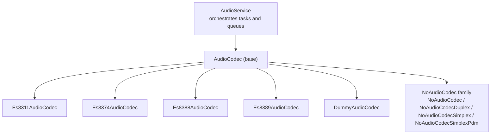
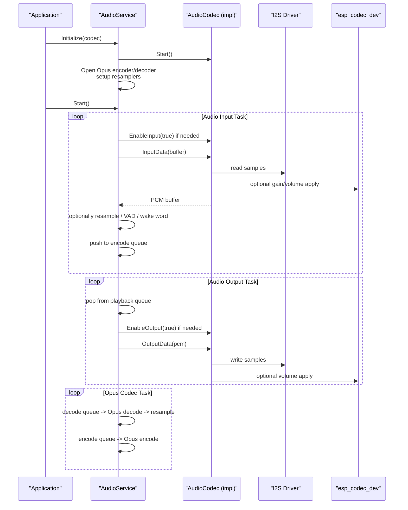
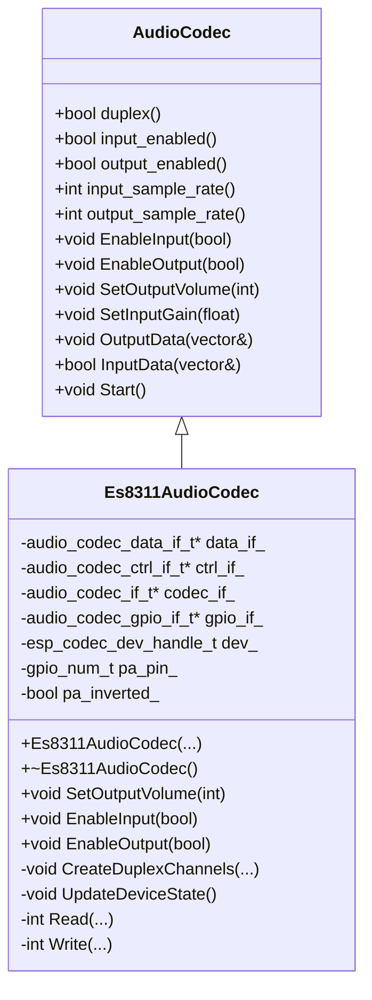
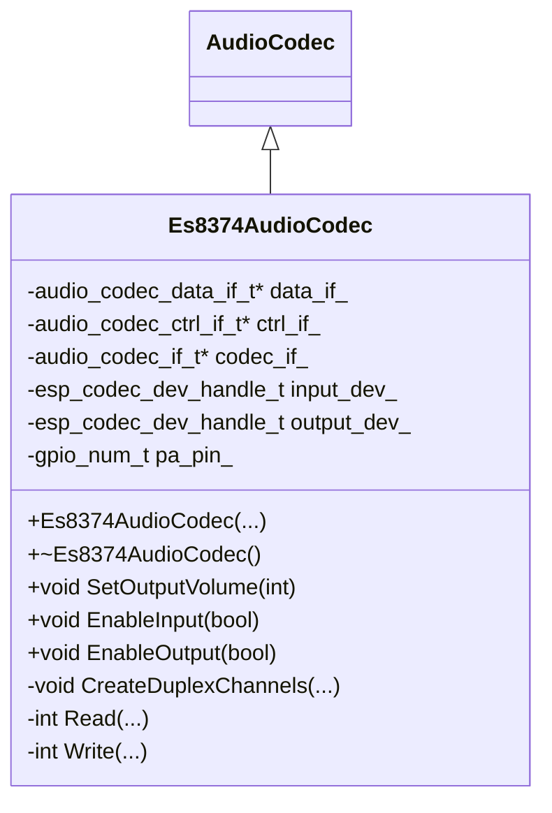
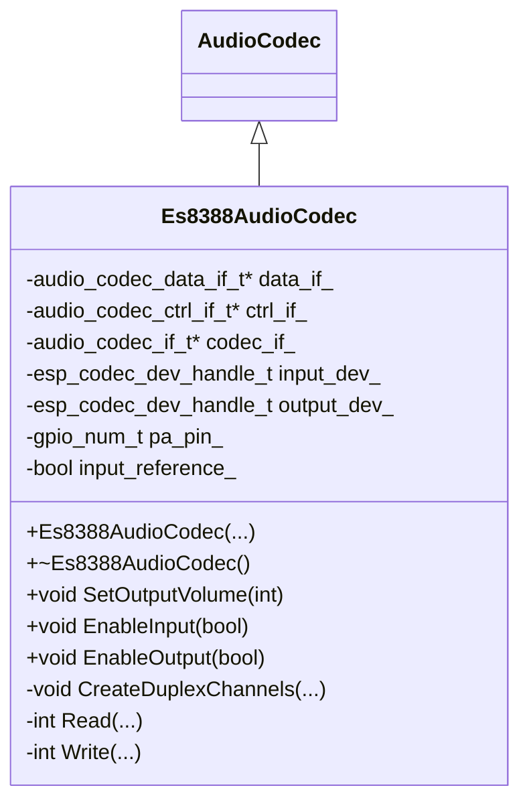
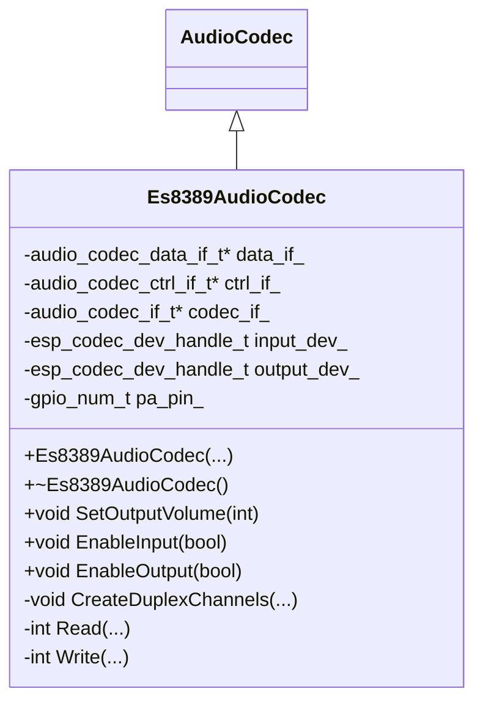
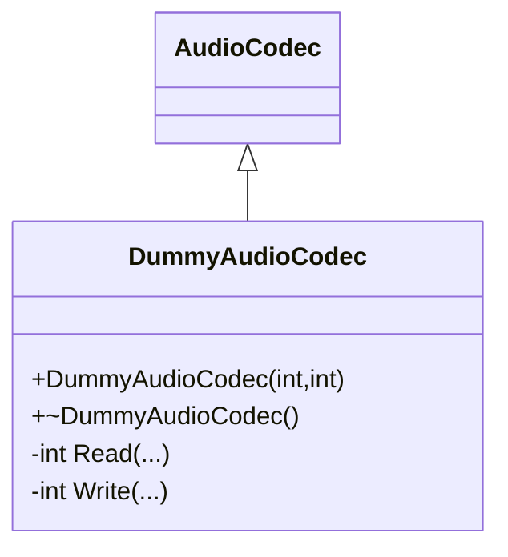
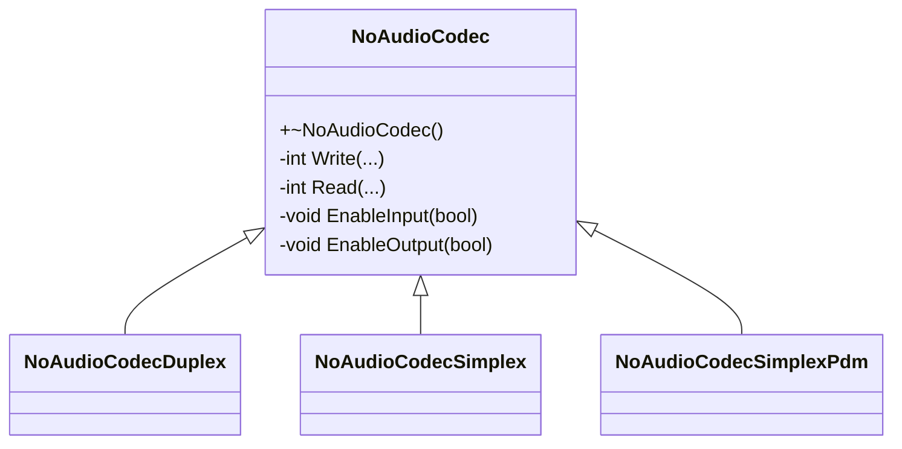
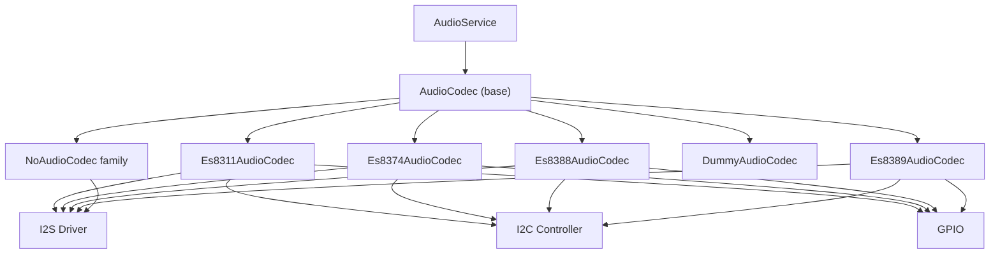

# Hardware Codec Drivers

<cite>
**Referenced Files in This Document**
- [audio_codec.h](file://main/audio/audio_codec.h)
- [audio_codec.cc](file://main/audio/audio_codec.cc)
- [audio_service.h](file://main/audio/audio_service.h)
- [audio_service.cc](file://main/audio/audio_service.cc)
- [es8311_audio_codec.h](file://main/audio/codecs/es8311_audio_codec.h)
- [es8311_audio_codec.cc](file://main/audio/codecs/es8311_audio_codec.cc)
- [es8374_audio_codec.h](file://main/audio/codecs/es8374_audio_codec.h)
- [es8374_audio_codec.cc](file://main/audio/codecs/es8374_audio_codec.cc)
- [es8388_audio_codec.h](file://main/audio/codecs/es8388_audio_codec.h)
- [es8388_audio_codec.cc](file://main/audio/codecs/es8388_audio_codec.cc)
- [es8389_audio_codec.h](file://main/audio/codecs/es8389_audio_codec.h)
- [es8389_audio_codec.cc](file://main/audio/codecs/es8389_audio_codec.cc)
- [dummy_audio_codec.h](file://main/audio/codecs/dummy_audio_codec.h)
- [dummy_audio_codec.cc](file://main/audio/codecs/dummy_audio_codec.cc)
- [no_audio_codec.h](file://main/audio/codecs/no_audio_codec.h)
- [no_audio_codec.cc](file://main/audio/codecs/no_audio_codec.cc)
</cite>

## Table of Contents
1. [Introduction](#introduction)
2. [Project Structure](#project-structure)
3. [Core Components](#core-components)
4. [Architecture Overview](#architecture-overview)
5. [Detailed Component Analysis](#detailed-component-analysis)
6. [Dependency Analysis](#dependency-analysis)
7. [Performance Considerations](#performance-considerations)
8. [Troubleshooting Guide](#troubleshooting-guide)
9. [Conclusion](#conclusion)

## Introduction
This document describes the hardware codec drivers used in the project, focusing on ES8311, ES8374, ES8388, ES8389, and the dummy/no-op implementations. It explains initialization procedures, I2S integration, register configuration patterns, pin mapping, power management, and differences among variants. It also provides troubleshooting guidance for signal integrity and compatibility across board variants.

## Project Structure
The audio subsystem centers around a common AudioCodec base class and several codec-specific implementations. AudioService orchestrates capture, encoding, decoding, and playback, delegating audio I/O to the selected codec driver.

**Diagram sources**
- [audio_service.h:106-204](file://main/audio/audio_service.h#L106-L204)
- [audio_service.cc:62-123](file://main/audio/audio_service.cc#L62-L123)
- [audio_codec.h:17-62](file://main/audio/audio_codec.h#L17-L62)
- [es8311_audio_codec.h:13-42](file://main/audio/codecs/es8311_audio_codec.h#L13-L42)
- [es8374_audio_codec.h:13-41](file://main/audio/codecs/es8374_audio_codec.h#L13-L41)
- [es8388_audio_codec.h:12-41](file://main/audio/codecs/es8388_audio_codec.h#L12-L41)
- [es8389_audio_codec.h:12-41](file://main/audio/codecs/es8389_audio_codec.h#L12-L41)
- [dummy_audio_codec.h:6-16](file://main/audio/codecs/dummy_audio_codec.h#L6-L16)
- [no_audio_codec.h:10-42](file://main/audio/codecs/no_audio_codec.h#L10-L42)

**Section sources**
- [audio_service.h:106-204](file://main/audio/audio_service.h#L106-L204)
- [audio_service.cc:62-123](file://main/audio/audio_service.cc#L62-L123)
- [audio_codec.h:17-62](file://main/audio/audio_codec.h#L17-L62)

## Core Components
- AudioCodec base class defines the common interface for enabling/disabling I/O, controlling volume/gain, and managing I2S channels. It stores shared state such as sampling rates, channels, and enable flags.
- Codec-specific classes implement initialization via esp_codec_dev and I2C/I2S interfaces, configure hardware-specific parameters, and manage power pins.

Key capabilities:
- Duplex operation with shared I2S channels for input and output.
- Per-codec control of output volume and input gain.
- Optional PA (amplifier) pin control for hardware amplification.
- Hardware-specific register writes for volume and mode tuning.

**Section sources**
- [audio_codec.h:17-62](file://main/audio/audio_codec.h#L17-L62)
- [audio_codec.cc:11-67](file://main/audio/audio_codec.cc#L11-L67)
- [es8311_audio_codec.cc:7-59](file://main/audio/codecs/es8311_audio_codec.cc#L7-L59)
- [es8374_audio_codec.cc:7-62](file://main/audio/codecs/es8374_audio_codec.cc#L7-L62)
- [es8388_audio_codec.cc:7-71](file://main/audio/codecs/es8388_audio_codec.cc#L7-L71)
- [es8389_audio_codec.cc:7-70](file://main/audio/codecs/es8389_audio_codec.cc#L7-L70)

## Architecture Overview
AudioService initializes the chosen codec, sets up resamplers and Opus encoder/decoder, and runs three tasks: audio input, audio output, and Opus codec. The codec drivers handle low-level I2S and codec control.

**Diagram sources**
- [audio_service.h:106-204](file://main/audio/audio_service.h#L106-L204)
- [audio_service.cc:62-200](file://main/audio/audio_service.cc#L62-L200)
- [audio_codec.h:17-62](file://main/audio/audio_codec.h#L17-L62)

## Detailed Component Analysis

### ES8311 Codec Driver
- Purpose: Full-duplex codec with integrated DAC/ADC and optional external amplifier control.
- Initialization highlights:
  - Creates shared TX/RX I2S channels in master role.
  - Uses esp_codec_dev with I2C control and GPIO interfaces.
  - Configures codec mode for both input and output, sets MCLK usage, and hardware voltage gains.
  - Controls PA pin for amplifier enable/disable.
- Pin mapping:
  - MCLK, BCLK, WS, SDOUT (DAC), SDIN (ADC) are mapped to I2S GPIOs.
  - Optional PA pin for amplifier control.
- Power management:
  - Enabling output toggles PA pin; disabling closes codec device.
- Volume and gain:
  - Output volume controlled via codec device; input gain configurable.

**Diagram sources**
- [audio_codec.h:17-62](file://main/audio/audio_codec.h#L17-L62)
- [es8311_audio_codec.h:13-42](file://main/audio/codecs/es8311_audio_codec.h#L13-L42)

**Section sources**
- [es8311_audio_codec.h:13-42](file://main/audio/codecs/es8311_audio_codec.h#L13-L42)
- [es8311_audio_codec.cc:7-98](file://main/audio/codecs/es8311_audio_codec.cc#L7-L98)

### ES8374 Codec Driver
- Purpose: Separate input and output codec devices managed independently.
- Initialization highlights:
  - Creates separate esp_codec_dev instances for IN and OUT.
  - Uses I2C control and GPIO interfaces; codec mode supports both directions.
  - Manages PA pin for output amplifier.
- Differences from ES8311:
  - Independent input/output devices; explicit open/close per direction.
  - Different internal configuration structure for codec creation.
- Pin mapping and power:
  - Same I2S pin roles; PA pin control for output.

**Diagram sources**
- [audio_codec.h:17-62](file://main/audio/audio_codec.h#L17-L62)
- [es8374_audio_codec.h:13-41](file://main/audio/codecs/es8374_audio_codec.h#L13-L41)

**Section sources**
- [es8374_audio_codec.h:13-41](file://main/audio/codecs/es8374_audio_codec.h#L13-L41)
- [es8374_audio_codec.cc:7-74](file://main/audio/codecs/es8374_audio_codec.cc#L7-L74)

### ES8388 Codec Driver
- Purpose: Full-duplex codec with optional input reference for echo cancellation.
- Initialization highlights:
  - Creates shared TX/RX I2S channels.
  - Configures codec in master mode with hardware gain settings.
  - Supports input reference channel selection to enable echo cancellation.
  - Sets analog headphone/spkr volumes to 0 dB via register writes.
- Pin mapping and power:
  - I2S pins and optional PA pin for amplifier.
- Special behavior:
  - When input reference is enabled, channels become stereo and registers are written to adjust gains.

**Diagram sources**
- [audio_codec.h:17-62](file://main/audio/audio_codec.h#L17-L62)
- [es8388_audio_codec.h:12-41](file://main/audio/codecs/es8388_audio_codec.h#L12-L41)

**Section sources**
- [es8388_audio_codec.h:12-41](file://main/audio/codecs/es8388_audio_codec.h#L12-L41)
- [es8388_audio_codec.cc:7-83](file://main/audio/codecs/es8388_audio_codec.cc#L7-L83)

### ES8389 Codec Driver
- Purpose: Full-duplex codec with optional MCLK usage and integrated amplifier control.
- Initialization highlights:
  - Creates separate IN/OUT codec devices.
  - Configures codec mode for both directions and sets MCLK usage.
  - Manages PA pin for amplifier control.
- Pin mapping and power:
  - Standard I2S pin roles; PA pin control.

**Diagram sources**
- [audio_codec.h:17-62](file://main/audio/audio_codec.h#L17-L62)
- [es8389_audio_codec.h:12-41](file://main/audio/codecs/es8389_audio_codec.h#L12-L41)

**Section sources**
- [es8389_audio_codec.h:12-41](file://main/audio/codecs/es8389_audio_codec.h#L12-L41)
- [es8389_audio_codec.cc:7-82](file://main/audio/codecs/es8389_audio_codec.cc#L7-L82)

### Dummy Codec Driver
- Purpose: No-op codec for environments where audio I/O is not required.
- Behavior:
  - Read returns zero samples; Write discards data.
  - Useful for testing or headless builds.

**Diagram sources**
- [audio_codec.h:17-62](file://main/audio/audio_codec.h#L17-L62)
- [dummy_audio_codec.h:6-16](file://main/audio/codecs/dummy_audio_codec.h#L6-L16)

**Section sources**
- [dummy_audio_codec.h:6-16](file://main/audio/codecs/dummy_audio_codec.h#L6-L16)
- [dummy_audio_codec.cc:3-21](file://main/audio/codecs/dummy_audio_codec.cc#L3-L21)

### No-Audio Codec Family
- Purpose: Software-only audio path without external codec hardware.
- Variants:
  - NoAudioCodec: Base class with shared I2S channel enable/disable.
  - NoAudioCodecDuplex: Full-duplex with 32-bit slot width and mono mapping.
  - NoAudioCodecSimplex: Separate TX/RX channels for speaker and microphone.
  - NoAudioCodecSimplexPdm: Speaker TX in STD mode and microphone RX in PDM mode (when supported).
- Implementation details:
  - Volume scaling performed in software for output.
  - Input path reads 32-bit samples and scales to 16-bit.
  - PDM path uses dedicated PDM RX configuration when supported by hardware.

**Diagram sources**
- [no_audio_codec.h:10-42](file://main/audio/codecs/no_audio_codec.h#L10-L42)
- [no_audio_codec.cc:9-386](file://main/audio/codecs/no_audio_codec.cc#L9-L386)

**Section sources**
- [no_audio_codec.h:10-42](file://main/audio/codecs/no_audio_codec.h#L10-L42)
- [no_audio_codec.cc:18-386](file://main/audio/codecs/no_audio_codec.cc#L18-L386)

## Dependency Analysis
- AudioService depends on the selected AudioCodec implementation to provide I/O.
- Codec implementations depend on:
  - I2S driver for channel creation and data transfer.
  - esp_codec_dev for codec control and configuration.
  - I2C controller for codec register programming.
  - GPIO interface for PA pin control.
- Coupling:
  - Codec implementations encapsulate hardware specifics; AudioService remains agnostic of codec type.
  - NoAudioCodec variants avoid external codec dependencies entirely.

**Diagram sources**
- [audio_service.h:106-204](file://main/audio/audio_service.h#L106-L204)
- [audio_service.cc:62-123](file://main/audio/audio_service.cc#L62-L123)
- [es8311_audio_codec.cc:20-59](file://main/audio/codecs/es8311_audio_codec.cc#L20-L59)
- [es8374_audio_codec.cc:20-62](file://main/audio/codecs/es8374_audio_codec.cc#L20-L62)
- [es8388_audio_codec.cc:20-71](file://main/audio/codecs/es8388_audio_codec.cc#L20-L71)
- [es8389_audio_codec.cc:19-70](file://main/audio/codecs/es8389_audio_codec.cc#L19-L70)
- [no_audio_codec.cc:34-75](file://main/audio/codecs/no_audio_codec.cc#L34-L75)

**Section sources**
- [audio_service.h:106-204](file://main/audio/audio_service.h#L106-L204)
- [audio_service.cc:62-123](file://main/audio/audio_service.cc#L62-L123)
- [es8311_audio_codec.cc:20-59](file://main/audio/codecs/es8311_audio_codec.cc#L20-L59)
- [es8374_audio_codec.cc:20-62](file://main/audio/codecs/es8374_audio_codec.cc#L20-L62)
- [es8388_audio_codec.cc:20-71](file://main/audio/codecs/es8388_audio_codec.cc#L20-L71)
- [es8389_audio_codec.cc:19-70](file://main/audio/codecs/es8389_audio_codec.cc#L19-L70)
- [no_audio_codec.cc:34-75](file://main/audio/codecs/no_audio_codec.cc#L34-L75)

## Performance Considerations
- DMA buffers and frame sizes:
  - Codec drivers define DMA descriptor and frame counts suitable for real-time audio.
- Resampling:
  - AudioService conditionally resamples input/output to align with Opus encoder/decoder sample rates.
- Power gating:
  - AudioService disables codec I/O after inactivity timeouts to save power.
- Volume scaling:
  - NoAudioCodec applies software volume scaling; other codecs rely on hardware volume controls.

[No sources needed since this section provides general guidance]

## Troubleshooting Guide
Common issues and resolutions:
- No audio output:
  - Verify codec is enabled and PA pin is asserted for amplifiers.
  - Confirm I2S pins are correctly mapped and channels are enabled.
- Weak or distorted input:
  - Adjust input gain and check ADC configuration.
  - For ES8388 with input reference, ensure reference channel is enabled and registers are written.
- Codec initialization failures:
  - Ensure I2C address and bus handle are correct.
  - Check esp_codec_dev creation and open calls succeed.
- Signal integrity:
  - Keep I2S clock and data traces short and matched.
  - Use proper termination and routing for BCLK, WS, and DOUT/DIN.
- Compatibility across board variants:
  - Some codecs require MCLK; disable MCLK usage if not present.
  - PA pin polarity may differ; use inverted flag when needed.

**Section sources**
- [es8311_audio_codec.cc:94-98](file://main/audio/codecs/es8311_audio_codec.cc#L94-L98)
- [es8374_audio_codec.cc:176-184](file://main/audio/codecs/es8374_audio_codec.cc#L176-L184)
- [es8388_audio_codec.cc:196-204](file://main/audio/codecs/es8388_audio_codec.cc#L196-L204)
- [es8389_audio_codec.cc:182-190](file://main/audio/codecs/es8389_audio_codec.cc#L182-L190)
- [no_audio_codec.cc:257-281](file://main/audio/codecs/no_audio_codec.cc#L257-L281)

## Conclusion
The codec drivers provide a clean abstraction over hardware-specific peripherals, enabling flexible integration with I2S and esp_codec_dev. ES8311/ES8389 offer straightforward full-duplex paths, ES8374 separates input/output for independent control, and ES8388 adds advanced features like input reference for echo cancellation. The dummy and no-audio codecs support testing and headless deployments. AudioService coordinates audio pipelines and power management, ensuring efficient operation across diverse hardware configurations.