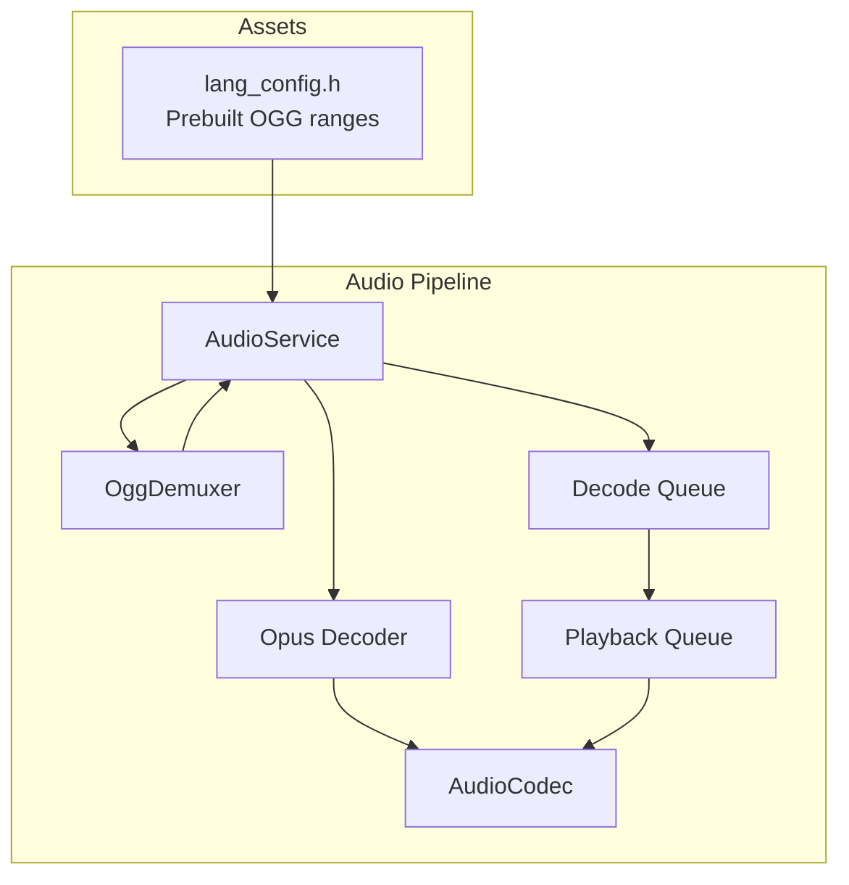
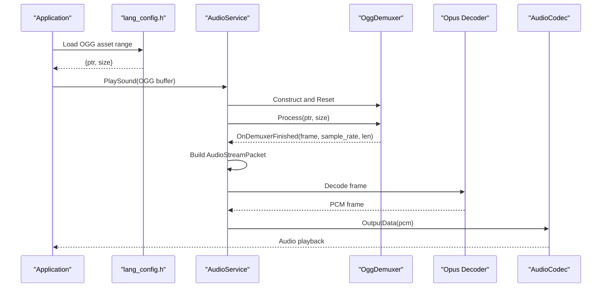
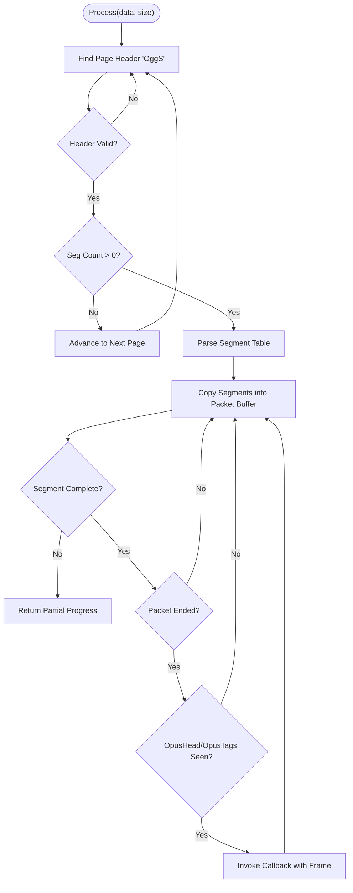
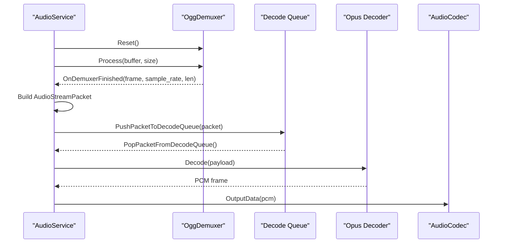
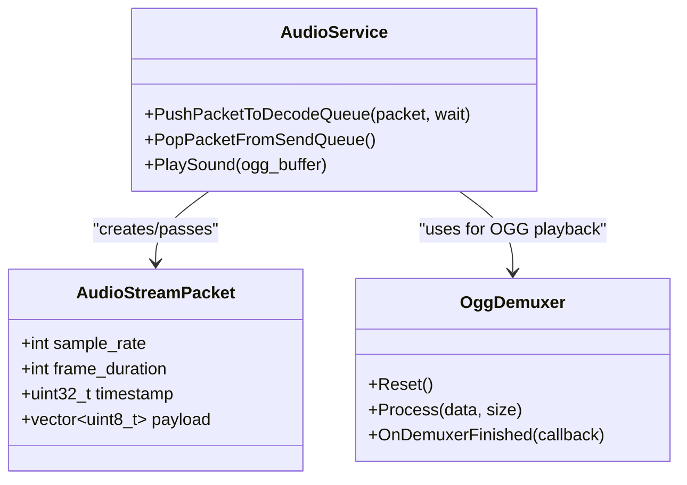
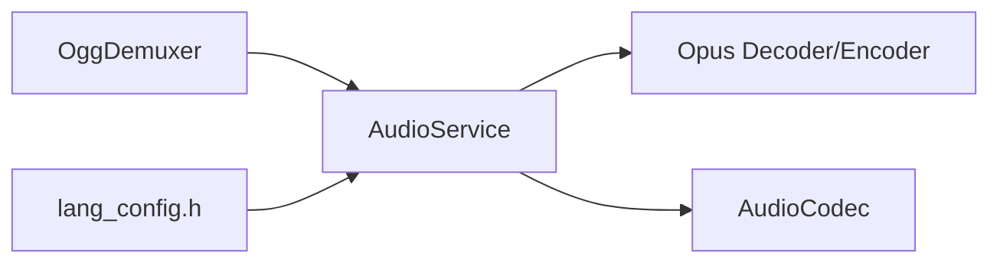

# OGG Demuxer and Format Support

<cite>
**Referenced Files in This Document**
- [ogg_demuxer.h](file://main/audio/demuxer/ogg_demuxer.h)
- [ogg_demuxer.cc](file://main/audio/demuxer/ogg_demuxer.cc)
- [audio_service.h](file://main/audio/audio_service.h)
- [audio_service.cc](file://main/audio/audio_service.cc)
- [audio_codec.h](file://main/audio/audio_codec.h)
- [audio_codec.cc](file://main/audio/audio_codec.cc)
- [protocol.h](file://main/protocols/protocol.h)
- [lang_config.h](file://main/assets/lang_config.h)
</cite>

## Table of Contents
1. [Introduction](#introduction)
2. [Project Structure](#project-structure)
3. [Core Components](#core-components)
4. [Architecture Overview](#architecture-overview)
5. [Detailed Component Analysis](#detailed-component-analysis)
6. [Dependency Analysis](#dependency-analysis)
7. [Performance Considerations](#performance-considerations)
8. [Troubleshooting Guide](#troubleshooting-guide)
9. [Conclusion](#conclusion)
10. [Appendices](#appendices)

## Introduction
This document explains the OGG demuxer system used for streaming audio format support in the project. It focuses on how the demuxer parses the OGG container, extracts Opus metadata (OpusHead and OpusTags), segments streams into Opus frames, and integrates with the audio pipeline for playback. It also covers format compatibility, error recovery, and performance considerations for resource-constrained embedded environments.

## Project Structure
The OGG demuxer resides under the audio demuxer module and integrates with the broader audio service and codec subsystems. Assets include prebuilt OGG audio clips exposed via generated symbol ranges for playback.

**Diagram sources**
- [audio_service.cc:666-687](file://main/audio/audio_service.cc#L666-L687)
- [ogg_demuxer.h:9-61](file://main/audio/demuxer/ogg_demuxer.h#L9-L61)
- [audio_codec.h:17-61](file://main/audio/audio_codec.h#L17-L61)
- [lang_config.h:102-291](file://main/assets/lang_config.h#L102-L291)

**Section sources**
- [audio_service.h:29-38](file://main/audio/audio_service.h#L29-L38)
- [audio_service.cc:666-687](file://main/audio/audio_service.cc#L666-L687)
- [ogg_demuxer.h:9-61](file://main/audio/demuxer/ogg_demuxer.h#L9-L61)
- [lang_config.h:102-291](file://main/assets/lang_config.h#L102-L291)

## Core Components
- OggDemuxer: Parses OGG pages, validates headers, reads segment tables, reconstructs Opus packets, and emits Opus frames with sample rate metadata.
- AudioService: Orchestrates the audio pipeline, manages queues, resampling, and integrates demuxed Opus frames into the playback path.
- AudioCodec: Provides I/O abstraction for audio input/output and power management.
- AudioStreamPacket: Standardized packet structure for Opus frames with sample rate, frame duration, and payload.
- Prebuilt OGG assets: Exposed via symbol ranges for immediate playback.

Key responsibilities:
- OGG parsing and page synchronization
- Segment table traversal and packet reconstruction
- OpusHead/OpusTags discovery and sample rate extraction
- Integration with Opus decoder and playback queue
- Resource-constrained memory management and error recovery

**Section sources**
- [ogg_demuxer.h:9-61](file://main/audio/demuxer/ogg_demuxer.h#L9-L61)
- [ogg_demuxer.cc:6-30](file://main/audio/demuxer/ogg_demuxer.cc#L6-L30)
- [audio_service.h:106-204](file://main/audio/audio_service.h#L106-L204)
- [audio_service.cc:360-479](file://main/audio/audio_service.cc#L360-L479)
- [protocol.h:10-15](file://main/protocols/protocol.h#L10-L15)
- [audio_codec.h:17-61](file://main/audio/audio_codec.h#L17-L61)

## Architecture Overview
The demuxer sits between incoming OGG data and the audio pipeline. It emits Opus frames with associated sample rate to AudioService, which routes them to the Opus decoder and then to the audio codec for playback.

**Diagram sources**
- [audio_service.cc:666-687](file://main/audio/audio_service.cc#L666-L687)
- [ogg_demuxer.cc:270-275](file://main/audio/demuxer/ogg_demuxer.cc#L270-L275)
- [audio_service.cc:384-425](file://main/audio/audio_service.cc#L384-L425)
- [audio_codec.cc:17-27](file://main/audio/audio_codec.cc#L17-L27)
- [lang_config.h:102-291](file://main/assets/lang_config.h#L102-L291)

## Detailed Component Analysis

### OggDemuxer: OGG Container Parsing and Stream Segmentation
The demuxer implements a state machine to parse OGG pages and extract Opus frames:
- FIND_PAGE: Scans for the OGG page signature and aligns to page boundaries.
- PARSE_HEADER: Reads and validates the 27-byte OGG page header, checks version and segment count.
- PARSE_SEGMENTS: Reads the segment table indicating per-segment lengths.
- PARSE_DATA: Copies segment data into a fixed-size packet buffer, reconstructing complete Opus packets, and emitting frames when OpusHead and OpusTags have been seen.

**Diagram sources**
- [ogg_demuxer.cc:40-310](file://main/audio/demuxer/ogg_demuxer.cc#L40-L310)

Implementation highlights:
- Fixed-size buffers avoid heap allocations and reduce fragmentation on constrained devices.
- Segment continuation handling supports packets spanning multiple segments.
- OpusHead parsing extracts sample rate for downstream resampling decisions.
- Robust error logging and state resets on invalid headers or buffer overflows.

**Section sources**
- [ogg_demuxer.h:11-39](file://main/audio/demuxer/ogg_demuxer.h#L11-L39)
- [ogg_demuxer.cc:6-30](file://main/audio/demuxer/ogg_demuxer.cc#L6-L30)
- [ogg_demuxer.cc:112-159](file://main/audio/demuxer/ogg_demuxer.cc#L112-L159)
- [ogg_demuxer.cc:163-196](file://main/audio/demuxer/ogg_demuxer.cc#L163-L196)
- [ogg_demuxer.cc:198-305](file://main/audio/demuxer/ogg_demuxer.cc#L198-L305)

### AudioService: Integration with the Audio Pipeline
AudioService coordinates the audio pipeline:
- Decodes Opus frames from the decode queue and resamples to the codec’s output sample rate.
- Encodes live audio into Opus frames for sending.
- Manages queues, timestamps, and power-aware codec enablement.
- Integrates OGG playback by constructing an OggDemuxer, wiring its callback to push decoded frames into the decode queue.

**Diagram sources**
- [audio_service.cc:666-687](file://main/audio/audio_service.cc#L666-L687)
- [audio_service.cc:360-479](file://main/audio/audio_service.cc#L360-L479)
- [audio_service.cc:539-551](file://main/audio/audio_service.cc#L539-L551)

**Section sources**
- [audio_service.h:106-204](file://main/audio/audio_service.h#L106-L204)
- [audio_service.cc:360-479](file://main/audio/audio_service.cc#L360-L479)
- [audio_service.cc:539-551](file://main/audio/audio_service.cc#L539-L551)
- [audio_service.cc:666-687](file://main/audio/audio_service.cc#L666-L687)

### AudioStreamPacket and Asset Integration
- AudioStreamPacket encapsulates Opus frames with sample rate, frame duration, and payload for uniform handling across the pipeline.
- Prebuilt OGG assets are exposed via symbol ranges in lang_config.h, enabling zero-copy playback from flash-backed buffers.

**Diagram sources**
- [protocol.h:10-15](file://main/protocols/protocol.h#L10-L15)
- [audio_service.cc:666-687](file://main/audio/audio_service.cc#L666-L687)
- [ogg_demuxer.h:50-54](file://main/audio/demuxer/ogg_demuxer.h#L50-L54)

**Section sources**
- [protocol.h:10-15](file://main/protocols/protocol.h#L10-L15)
- [lang_config.h:102-291](file://main/assets/lang_config.h#L102-L291)
- [audio_service.cc:666-687](file://main/audio/audio_service.cc#L666-L687)

## Dependency Analysis
- OggDemuxer depends on minimal standard library types and uses fixed buffers to avoid dynamic allocation.
- AudioService depends on OggDemuxer for OGG playback, Opus decoder/encoder APIs, and AudioCodec for hardware I/O.
- AudioCodec abstracts I2S hardware and provides power-aware enable/disable semantics.

**Diagram sources**
- [audio_service.h:27-27](file://main/audio/audio_service.h#L27-L27)
- [audio_service.cc:62-84](file://main/audio/audio_service.cc#L62-L84)
- [audio_codec.h:17-61](file://main/audio/audio_codec.h#L17-L61)
- [lang_config.h:102-291](file://main/assets/lang_config.h#L102-L291)

**Section sources**
- [audio_service.h:27-27](file://main/audio/audio_service.h#L27-L27)
- [audio_service.cc:62-84](file://main/audio/audio_service.cc#L62-L84)
- [audio_codec.h:17-61](file://main/audio/audio_codec.h#L17-L61)

## Performance Considerations
- Fixed-size buffers: The demuxer uses fixed-size buffers for headers, segment tables, and packet assembly to minimize heap usage and fragmentation on constrained devices.
- Minimal allocations: No dynamic allocations during normal operation reduce GC pressure and improve determinism.
- Streaming-first design: The demuxer processes data incrementally, returning partial progress when insufficient data is available, enabling efficient streaming.
- Queue sizing: AudioService limits queue depths and frame durations to balance latency and memory footprint.
- Resampling: Dynamic resampling is performed only when sample rates change, minimizing overhead.
- Power-aware codec control: AudioService enables/disables codec I/O based on activity to save power.

[No sources needed since this section provides general guidance]

## Troubleshooting Guide
Common issues and remedies:
- Invalid OGG version or malformed headers: The demuxer logs errors and resets state to resume page search.
- Segment count validation failures: On invalid segment counts, the demuxer discards the page and continues searching.
- Packet buffer overflow: If a reconstructed packet exceeds the fixed buffer size, the demuxer resets state and continues.
- Missing OpusHead/OpusTags: Frames are discarded until both are detected; ensure the OGG contains proper Opus setup packets.
- Playback queue backpressure: AudioService throttles decode/encode tasks and waits on queue capacity; monitor queue sizes to prevent stalls.

Operational tips:
- Verify OGG integrity using external tools before integrating into production builds.
- Monitor log messages from the demuxer and audio service for early detection of misrouted or corrupted data.
- For embedded targets, ensure sufficient stack space for PSRAM-backed task stacks and avoid deep call chains.

**Section sources**
- [ogg_demuxer.cc:134-141](file://main/audio/demuxer/ogg_demuxer.cc#L134-L141)
- [ogg_demuxer.cc:153-158](file://main/audio/demuxer/ogg_demuxer.cc#L153-L158)
- [ogg_demuxer.cc:210-218](file://main/audio/demuxer/ogg_demuxer.cc#L210-L218)
- [audio_service.cc:360-479](file://main/audio/audio_service.cc#L360-L479)

## Conclusion
The OGG demuxer provides a robust, memory-efficient mechanism to parse OGG pages, reconstruct Opus frames, and integrate with the audio pipeline. Combined with AudioService’s queueing, resampling, and power-aware codec control, it delivers reliable playback of OGG audio assets on embedded platforms. The design emphasizes incremental processing, fixed buffers, and clear error recovery to operate effectively in resource-constrained environments.

[No sources needed since this section summarizes without analyzing specific files]

## Appendices

### Example Workflows

- Playing a prebuilt OGG asset:
  - Load the OGG buffer range from lang_config.h.
  - Call AudioService::PlaySound with the buffer.
  - The service constructs an OggDemuxer, processes the buffer, and pushes decoded frames into the decode queue for playback.

**Section sources**
- [lang_config.h:102-291](file://main/assets/lang_config.h#L102-L291)
- [audio_service.cc:666-687](file://main/audio/audio_service.cc#L666-L687)

### Format Compatibility Notes
- Container: OGG with OggS capture pattern.
- Codec: Opus (OpusHead and OpusTags required for metadata extraction).
- Frame duration: Variable bitrate is supported; frame duration is configurable in the pipeline.
- Sample rate: Extracted from OpusHead; AudioService dynamically resamples to codec output rate when needed.

**Section sources**
- [ogg_demuxer.cc:241-250](file://main/audio/demuxer/ogg_demuxer.cc#L241-L250)
- [audio_service.cc:481-515](file://main/audio/audio_service.cc#L481-L515)