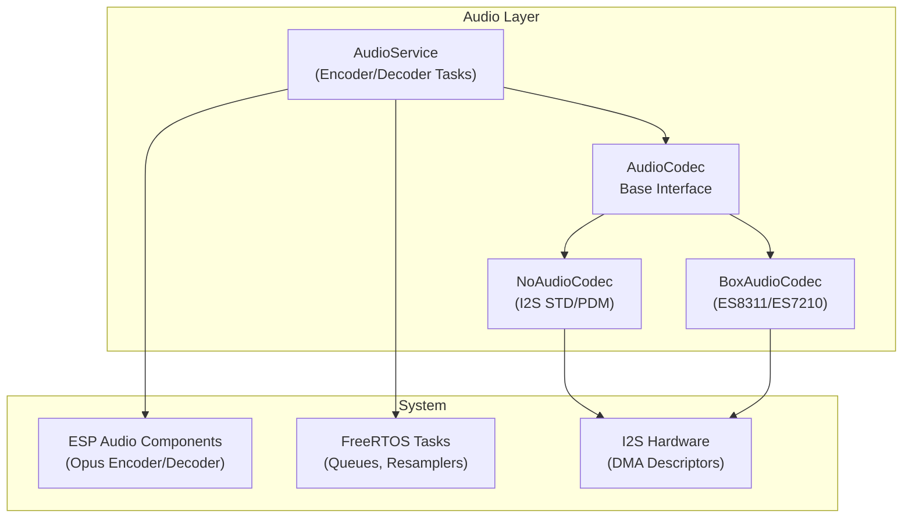
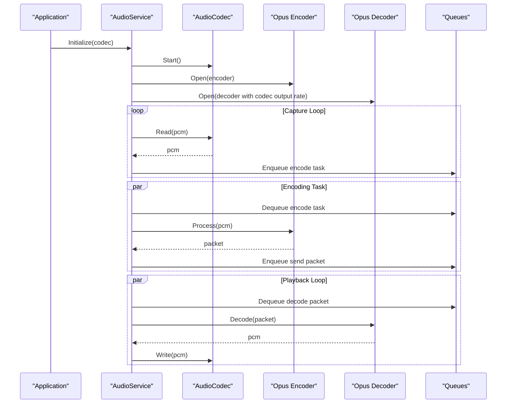
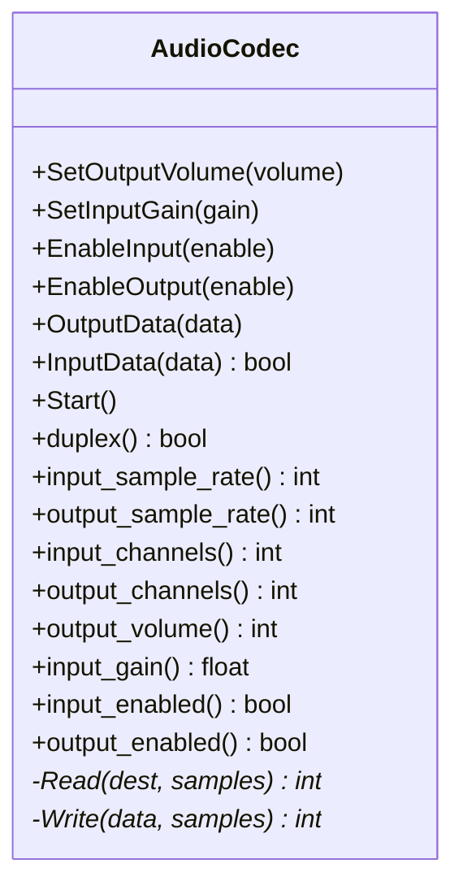
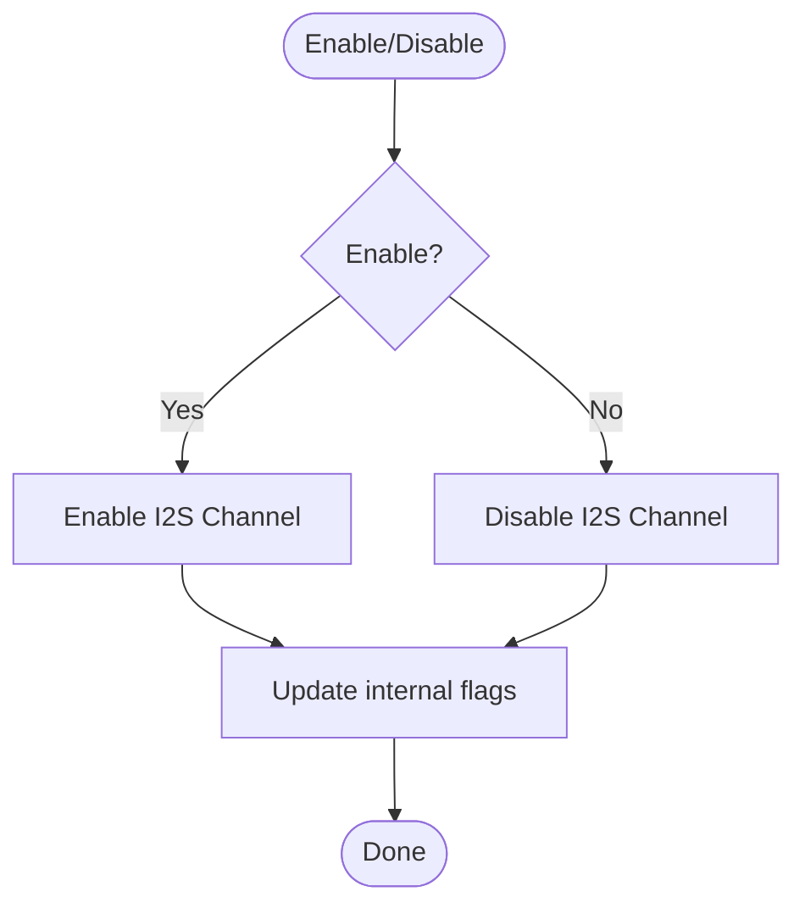
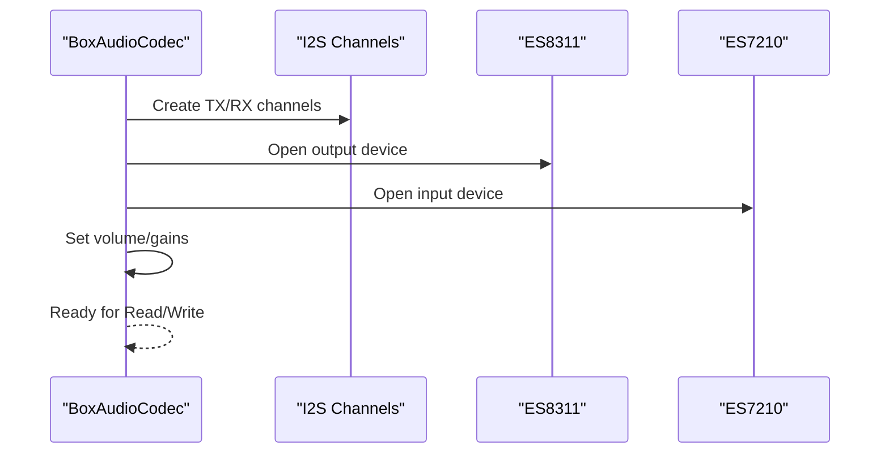
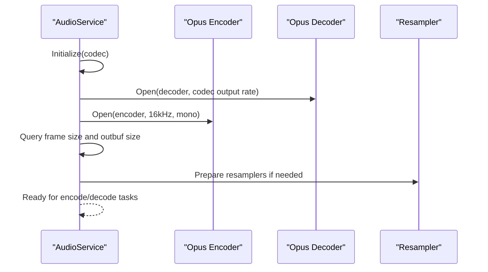
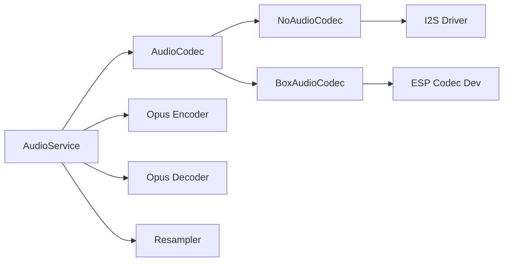

# Opus Codec Implementation

<cite>
**Referenced Files in This Document**
- [audio_codec.h](file://main/audio/audio_codec.h)
- [audio_codec.cc](file://main/audio/audio_codec.cc)
- [audio_service.h](file://main/audio/audio_service.h)
- [audio_service.cc](file://main/audio/audio_service.cc)
- [no_audio_codec.h](file://main/audio/codecs/no_audio_codec.h)
- [no_audio_codec.cc](file://main/audio/codecs/no_audio_codec.cc)
- [box_audio_codec.h](file://main/audio/codecs/box_audio_codec.h)
- [box_audio_codec.cc](file://main/audio/codecs/box_audio_codec.cc)
- [lulu-esp32s3.cc](file://main/boards/lulu-esp32s3/lulu-esp32s3.cc)
- [ogg_demuxer.cc](file://main/audio/demuxer/ogg_demuxer.cc)
</cite>

## Table of Contents
1. [Introduction](#introduction)
2. [Project Structure](#project-structure)
3. [Core Components](#core-components)
4. [Architecture Overview](#architecture-overview)
5. [Detailed Component Analysis](#detailed-component-analysis)
6. [Dependency Analysis](#dependency-analysis)
7. [Performance Considerations](#performance-considerations)
8. [Troubleshooting Guide](#troubleshooting-guide)
9. [Conclusion](#conclusion)

## Introduction
This document describes the Opus codec integration within the audio processing system. It explains the AudioCodec base class interface for volume control, gain adjustment, and I2S channel management, and documents the initialization sequence, DMA descriptor configuration, and buffer management for real-time audio processing. It also covers the abstract methods for reading/writing audio data, sample rate configuration, channel setup, threading considerations, buffer overflow handling, and performance optimization techniques tailored for embedded environments.

## Project Structure
The audio subsystem is organized around a codec abstraction layer and an audio service orchestrator. Codecs implement the AudioCodec interface and manage I2S hardware via ESP-IDF drivers. The AudioService coordinates encoding/decoding tasks and manages queues for streaming audio.

**Diagram sources**
- [audio_codec.h:17-59](file://main/audio/audio_codec.h#L17-L59)
- [no_audio_codec.h:10-41](file://main/audio/codecs/no_audio_codec.h#L10-L41)
- [box_audio_codec.h:11-40](file://main/audio/codecs/box_audio_codec.h#L11-L40)
- [audio_service.h:106-202](file://main/audio/audio_service.h#L106-L202)

**Section sources**
- [audio_codec.h:17-59](file://main/audio/audio_codec.h#L17-L59)
- [audio_service.h:29-38](file://main/audio/audio_service.h#L29-L38)

## Core Components
- AudioCodec: Base interface defining volume/gain controls, enable/disable flags, and abstract read/write methods. It exposes getters for duplex mode, sample rates, channels, and current settings.
- NoAudioCodec: Implements I2S standard and PDM modes with configurable DMA descriptors and frame sizes. Provides volume scaling and gain amplification.
- BoxAudioCodec: Integrates external codecs (ES8311/ES7210) via ESP Codec Dev APIs, supporting stereo TDM input and DAC output.
- AudioService: Manages Opus encoder/decoder lifecycle, resampling, queue-based streaming, and FreeRTOS tasks for encode/decode and audio I/O.

Key capabilities:
- Volume control and persistence via settings storage
- Gain adjustment for input
- I2S channel creation with DMA descriptors and frame buffers
- Real-time PCM buffering and queue management
- Dynamic decoder sample rate configuration

**Section sources**
- [audio_codec.h:17-59](file://main/audio/audio_codec.h#L17-L59)
- [audio_codec.cc:11-67](file://main/audio/audio_codec.cc#L11-L67)
- [no_audio_codec.cc:217-281](file://main/audio/codecs/no_audio_codec.cc#L217-L281)
- [box_audio_codec.cc:184-233](file://main/audio/codecs/box_audio_codec.cc#L184-L233)
- [audio_service.h:106-202](file://main/audio/audio_service.h#L106-L202)

## Architecture Overview
The audio pipeline integrates capture/playback through a codec, encoding/decoding via ESP Audio’s Opus components, and queue-based scheduling for real-time delivery.

**Diagram sources**
- [audio_service.cc:62-84](file://main/audio/audio_service.cc#L62-L84)
- [audio_service.cc:383-400](file://main/audio/audio_service.cc#L383-L400)
- [audio_service.cc:439-452](file://main/audio/audio_service.cc#L439-L452)

## Detailed Component Analysis

### AudioCodec Base Interface
The base class defines:
- Public controls: SetOutputVolume, SetInputGain, EnableInput, EnableOutput, OutputData, InputData, Start
- Accessors: duplex, input/output sample rates/channels/volume/gain, and enable flags
- Protected members: I2S channel handles, flags, and sample rate/channel configuration
- Pure virtual methods: Read and Write for PCM I/O

Implementation highlights:
- OutputData/InputData delegate to Write/Read for convenience
- Start loads persisted output volume and logs initialization
- Volume is clamped to a safe range and persisted to settings

**Diagram sources**
- [audio_codec.h:17-59](file://main/audio/audio_codec.h#L17-L59)

**Section sources**
- [audio_codec.h:17-59](file://main/audio/audio_codec.h#L17-L59)
- [audio_codec.cc:11-67](file://main/audio/audio_codec.cc#L11-L67)

### NoAudioCodec: I2S Standard and PDM Implementation
Capabilities:
- Duplex and simplex configurations with separate TX/RX channels
- DMA descriptor and frame buffer sizing constants
- Volume scaling using squared factor mapping for linear attenuation perception
- Optional PDM microphone support with gain amplification
- Mutex-protected enable/disable to safely toggle I2S channels

Initialization sequence:
- Channel creation with configured DMA descriptors and frames
- I2S standard mode for speaker output
- Microphone input either in standard mode or PDM mode depending on board configuration
- Channel enable/disable during runtime

**Diagram sources**
- [no_audio_codec.cc:257-281](file://main/audio/codecs/no_audio_codec.cc#L257-L281)

**Section sources**
- [no_audio_codec.h:10-41](file://main/audio/codecs/no_audio_codec.h#L10-L41)
- [no_audio_codec.cc:217-281](file://main/audio/codecs/no_audio_codec.cc#L217-L281)
- [no_audio_codec.cc:289-365](file://main/audio/codecs/no_audio_codec.cc#L289-L365)

### BoxAudioCodec: External Codec Integration
Capabilities:
- Uses ESP Codec Dev APIs to control ES8311 (DAC) and ES7210 (ADC) via I2C
- Supports stereo TDM input and mono DAC output
- Configurable input reference for echo cancellation scenarios
- Runtime control of output volume and per-channel input gain

Initialization sequence:
- Create duplex I2S channels (STD for DAC, TDM for ADC)
- Build codec control/data interfaces and open devices
- Configure sample info and channel masks for input/output

**Diagram sources**
- [box_audio_codec.cc](file://main/audio/codecs/box_audio_codec.cc#L9-T182)

**Section sources**
- [box_audio_codec.h:11-40](file://main/audio/codecs/box_audio_codec.h#L11-L40)
- [box_audio_codec.cc:94-182](file://main/audio/codecs/box_audio_codec.cc#L94-L182)
- [box_audio_codec.cc:184-233](file://main/audio/codecs/box_audio_codec.cc#L184-L233)

### AudioService: Opus Encoder/Decoder Orchestration
Responsibilities:
- Initialize codec, open Opus encoder/decoder, configure resamplers
- Manage queues for encode/send and decode/playback
- Run dedicated tasks for audio input/output and Opus codec processing
- Dynamically adjust decoder sample rate and frame size based on incoming packets

Initialization and configuration:
- Encoder configured to 16 kHz, mono, variable bitrate, DTX enabled, VBR enabled
- Decoder opened with codec output sample rate and frame duration
- Frame size and output buffer size queried from encoder for efficient processing

**Diagram sources**
- [audio_service.cc:62-84](file://main/audio/audio_service.cc#L62-L84)
- [audio_service.h:66-77](file://main/audio/audio_service.h#L66-L77)

**Section sources**
- [audio_service.h:106-202](file://main/audio/audio_service.h#L106-L202)
- [audio_service.cc:62-84](file://main/audio/audio_service.cc#L62-L84)
- [audio_service.cc:383-400](file://main/audio/audio_service.cc#L383-L400)
- [audio_service.cc:439-452](file://main/audio/audio_service.cc#L439-L452)

### Board Integration Example: Lulu ESP32-S3
The board selects a codec implementation and passes it to AudioService. The NoAudioCodec variant is used for I2S simplex or duplex configurations depending on compile-time flags.

Integration points:
- Board constructs a codec instance with platform-specific GPIO pins and sample rates
- AudioService receives the codec pointer and initializes encoder/decoder accordingly

**Section sources**
- [lulu-esp32s3.cc:656-666](file://main/boards/lulu-esp32s3/lulu-esp32s3.cc#L656-L666)

## Dependency Analysis
- AudioCodec is the central abstraction consumed by AudioService
- NoAudioCodec and BoxAudioCodec implement I2S and codec device interfaces respectively
- AudioService depends on ESP Audio Opus encoder/decoder and resampler components
- Queues and FreeRTOS tasks coordinate data flow between capture, encode, decode, and playback stages

**Diagram sources**
- [audio_codec.h:17-59](file://main/audio/audio_codec.h#L17-L59)
- [no_audio_codec.h:10-41](file://main/audio/codecs/no_audio_codec.h#L10-L41)
- [box_audio_codec.h:11-40](file://main/audio/codecs/box_audio_codec.h#L11-L40)
- [audio_service.h:16-27](file://main/audio/audio_service.h#L16-L27)

**Section sources**
- [audio_codec.h:17-59](file://main/audio/audio_codec.h#L17-L59)
- [audio_service.h:16-27](file://main/audio/audio_service.h#L16-L27)

## Performance Considerations
- DMA descriptor and frame sizing: The codec constants define descriptor count and frame length to balance latency and throughput. Tuning these affects jitter and CPU load.
- Volume scaling: Squared mapping provides perceptual linearity; ensure integer overflow checks are maintained during scaling.
- Queue depth limits: The service defines maximum items per queue to prevent unbounded memory growth under bursty traffic.
- Resampling: When decoder sample rate differs from codec output rate, a resampler is used; minimize resampling frequency to reduce CPU overhead.
- Threading model: Dedicated tasks isolate capture/encode and decode/playback loops, reducing contention and improving predictability.

[No sources needed since this section provides general guidance]

## Troubleshooting Guide
Common issues and remedies:
- Output volume too low or clipped: Verify volume range and persisted settings; ensure squared scaling does not exceed 16-bit bounds.
- No audio input: Confirm I2S channel enable state and pin configuration; check PDM vs. STD mode selection.
- Decoder errors: Recreate decoder when sample rate/frame duration change; ensure frame size matches encoded payload.
- Queue backpressure: Monitor queue sizes and timestamps; consider dropping older frames when queues exceed thresholds.
- Buffer overflow: Adjust DMA descriptor count and frame size; ensure tasks do not starve due to blocking operations.

**Section sources**
- [audio_codec.cc:30-37](file://main/audio/audio_codec.cc#L30-L37)
- [no_audio_codec.cc:217-281](file://main/audio/codecs/no_audio_codec.cc#L217-L281)
- [audio_service.cc:481-499](file://main/audio/audio_service.cc#L481-L499)

## Conclusion
The Opus codec implementation leverages a clean AudioCodec abstraction to integrate with I2S hardware and external codec devices. AudioService orchestrates encoding/decoding and real-time queues, enabling robust streaming workflows. Proper configuration of DMA descriptors, resampling, and queue management ensures predictable performance in embedded environments. The provided interfaces and patterns facilitate codec instantiation, parameter tuning, and seamless integration with the broader audio service.