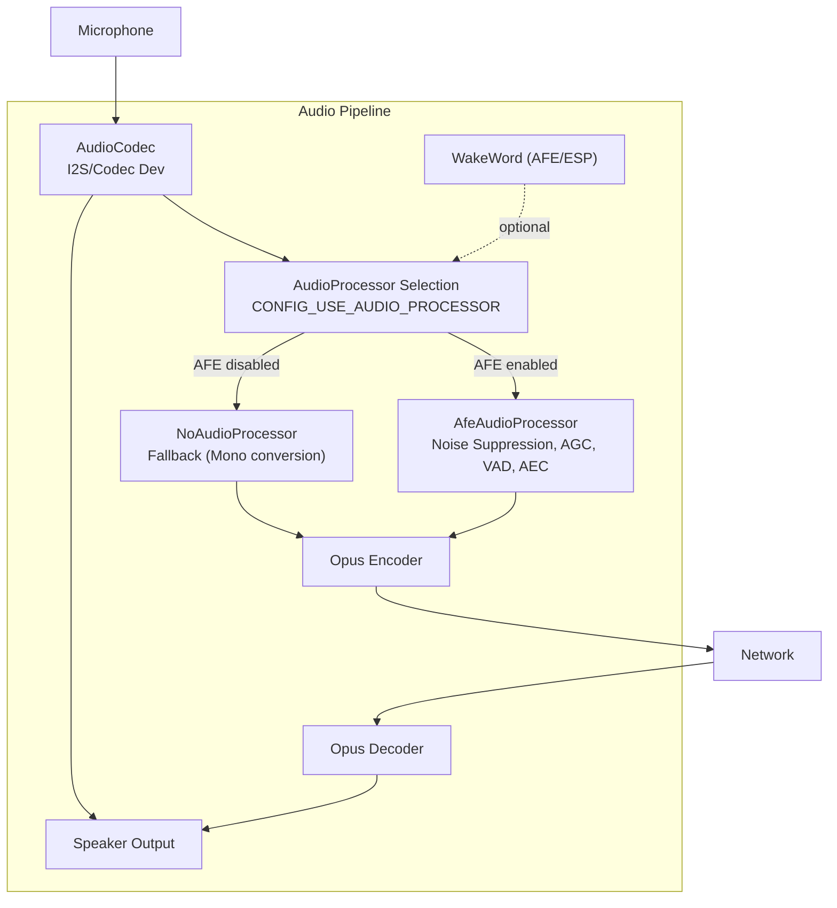
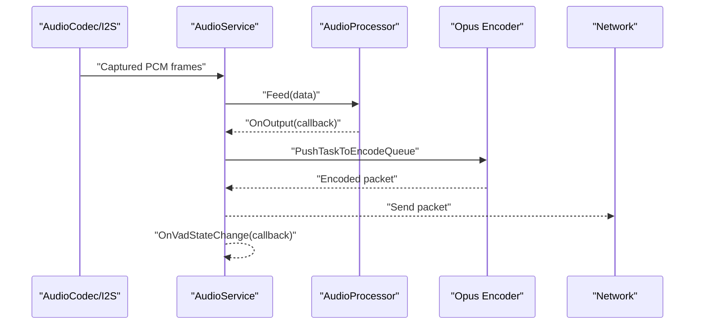
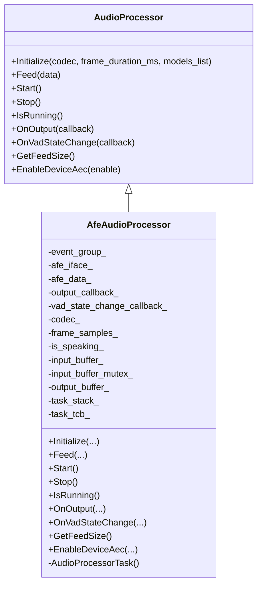
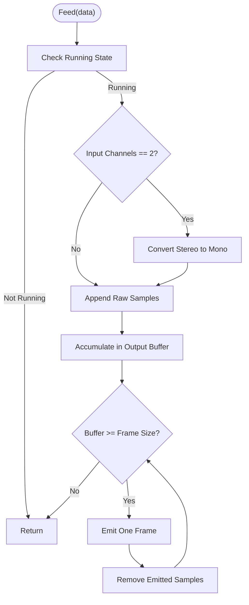
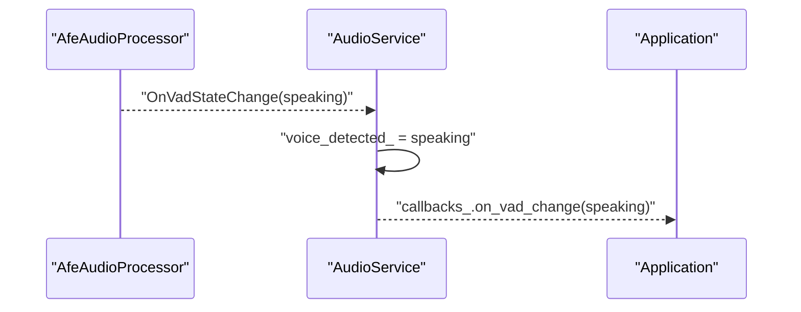
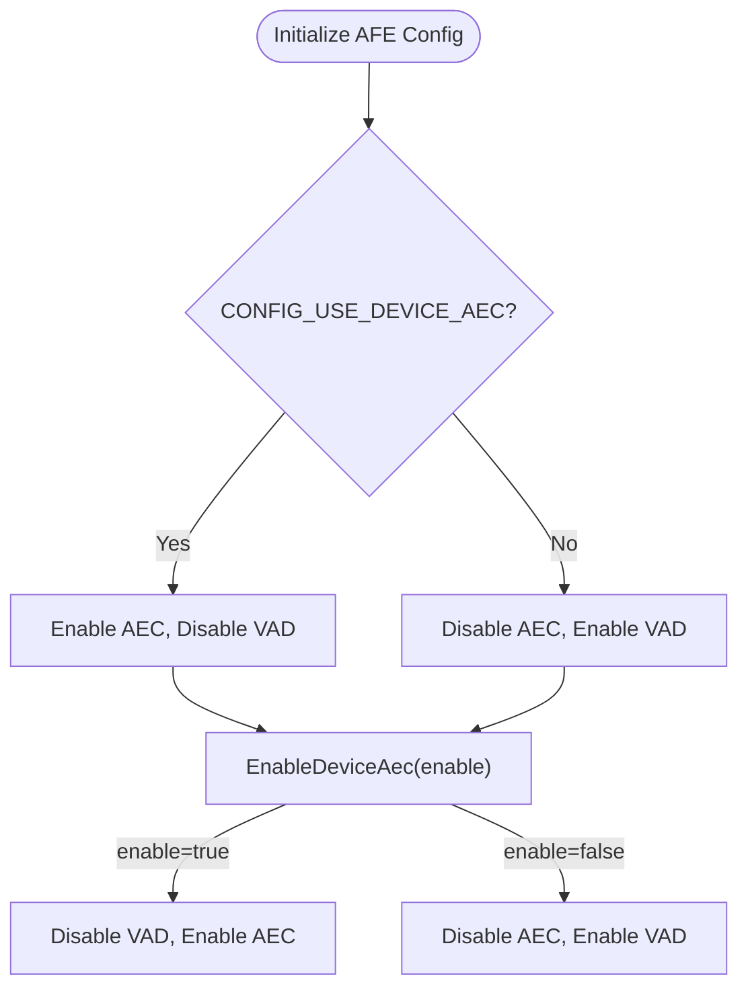
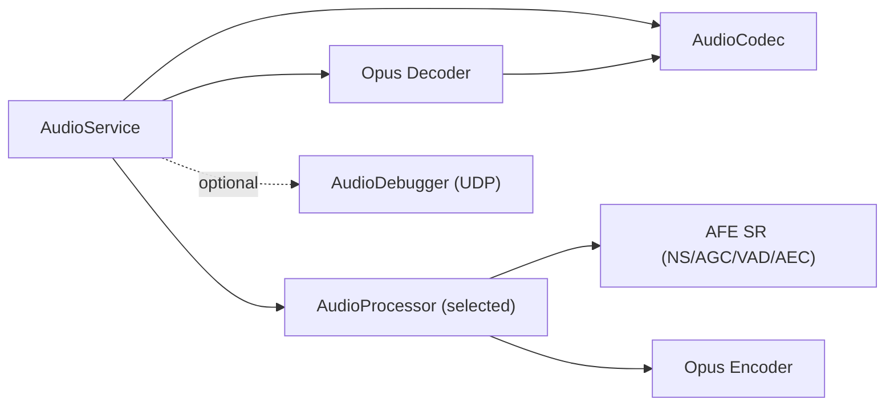

# Audio Processing Front-End

<cite>
**Referenced Files in This Document**
- [afe_audio_processor.h](file://main/audio/processors/afe_audio_processor.h)
- [afe_audio_processor.cc](file://main/audio/processors/afe_audio_processor.cc)
- [no_audio_processor.h](file://main/audio/processors/no_audio_processor.h)
- [no_audio_processor.cc](file://main/audio/processors/no_audio_processor.cc)
- [audio_processor.h](file://main/audio/audio_processor.h)
- [audio_service.h](file://main/audio/audio_service.h)
- [audio_service.cc](file://main/audio/audio_service.cc)
- [audio_codec.h](file://main/audio/audio_codec.h)
- [es8311_audio_codec.h](file://main/audio/codecs/es8311_audio_codec.h)
- [es8311_audio_codec.cc](file://main/audio/codecs/es8311_audio_codec.cc)
- [audio_debugger.h](file://main/audio/processors/audio_debugger.h)
- [audio_debugger.cc](file://main/audio/processors/audio_debugger.cc)
</cite>

## Table of Contents
1. [Introduction](#introduction)
2. [Project Structure](#project-structure)
3. [Core Components](#core-components)
4. [Architecture Overview](#architecture-overview)
5. [Detailed Component Analysis](#detailed-component-analysis)
6. [Dependency Analysis](#dependency-analysis)
7. [Performance Considerations](#performance-considerations)
8. [Troubleshooting Guide](#troubleshooting-guide)
9. [Conclusion](#conclusion)
10. [Appendices](#appendices)

## Introduction
This document explains the audio processing front-end for the project, focusing on the AFE audio processor implementation for ESP32-S3 targets and the no-audio fallback. It covers noise suppression, echo cancellation, automatic gain control, voice activity detection (VAD), and environmental noise adaptation. It also documents the integration of VAD with the main audio pipeline, device AEC configuration, and server-side AEC coordination. Guidance is provided for initialization, parameter tuning, performance optimization, configuration examples across acoustic environments, and troubleshooting audio quality issues.

## Project Structure
The audio subsystem is organized around a service-driven pipeline:
- AudioService orchestrates capture, processing, encoding, decoding, and playback tasks.
- AudioProcessor is an abstract interface implemented by AfeAudioProcessor (AFE-based) and NoAudioProcessor (fallback).
- AudioCodec abstracts hardware I/O and exposes capabilities such as input/output sample rates, channels, and gain/volume controls.
- Wake word detection integrates with the same pipeline under certain configurations.
- Optional audio debugging can stream raw PCM via UDP for diagnostics.

**Diagram sources**
- [audio_service.cc:62-123](file://main/audio/audio_service.cc#L62-L123)
- [audio_service.cc:95-99](file://main/audio/audio_service.cc#L95-L99)
- [afe_audio_processor.cc:13-82](file://main/audio/processors/afe_audio_processor.cc#L13-L82)
- [no_audio_processor.cc:6-10](file://main/audio/processors/no_audio_processor.cc#L6-L10)

**Section sources**
- [audio_service.h:29-38](file://main/audio/audio_service.h#L29-L38)
- [audio_service.cc:62-123](file://main/audio/audio_service.cc#L62-L123)
- [audio_processor.h:11-24](file://main/audio/audio_processor.h#L11-L24)

## Core Components
- AudioProcessor interface defines the contract for audio front-end processors.
- AfeAudioProcessor implements AFE-based noise suppression, AGC, VAD, and AEC on ESP32-S3.
- NoAudioProcessor provides a minimal pass-through path for environments without AFE support.
- AudioService coordinates tasks, queues, and integrates the processor into the end-to-end pipeline.
- AudioCodec abstracts hardware I/O and exposes input/output characteristics.
- Es8311AudioCodec demonstrates a concrete codec implementation for I2S-based devices.

Key responsibilities:
- Initialization and lifecycle management of processors and codecs.
- Frame-based buffering and output framing aligned to Opus durations.
- VAD state propagation to the rest of the system.
- Device AEC enable/disable and server-side AEC timestamp coordination.

**Section sources**
- [audio_processor.h:11-24](file://main/audio/audio_processor.h#L11-L24)
- [afe_audio_processor.h:18-51](file://main/audio/processors/afe_audio_processor.h#L18-L51)
- [afe_audio_processor.cc:13-82](file://main/audio/processors/afe_audio_processor.cc#L13-L82)
- [no_audio_processor.h:11-33](file://main/audio/processors/no_audio_processor.h#L11-L33)
- [no_audio_processor.cc:6-10](file://main/audio/processors/no_audio_processor.cc#L6-L10)
- [audio_service.cc:62-123](file://main/audio/audio_service.cc#L62-L123)
- [audio_codec.h:17-59](file://main/audio/audio_codec.h#L17-L59)
- [es8311_audio_codec.h:13-41](file://main/audio/codecs/es8311_audio_codec.h#L13-L41)

## Architecture Overview
The audio pipeline operates with separate tasks for input capture, encoding/decoding, and output playback. The AudioService initializes the codec, creates resamplers if needed, selects the appropriate AudioProcessor, and wires callbacks for output and VAD state changes. The selected processor feeds encoded packets to the send queue and propagates VAD events upward.

**Diagram sources**
- [audio_service.cc:302-314](file://main/audio/audio_service.cc#L302-L314)
- [audio_service.cc:101-110](file://main/audio/audio_service.cc#L101-L110)
- [audio_service.cc:517-537](file://main/audio/audio_service.cc#L517-L537)

**Section sources**
- [audio_service.cc:125-200](file://main/audio/audio_service.cc#L125-L200)
- [audio_service.cc:302-314](file://main/audio/audio_service.cc#L302-L314)
- [audio_service.cc:517-537](file://main/audio/audio_service.cc#L517-L537)

## Detailed Component Analysis

### AFE Audio Processor (ESP32-S3)
The AfeAudioProcessor leverages ESP AFE SR APIs to apply noise suppression, AGC, and VAD. It supports device-side AEC depending on configuration and can dynamically switch between device AEC and VAD modes.

Key behaviors:
- Initializes AFE configuration with model discovery for NS/VAD, sets performance modes, and allocates PSRAM-backed task stacks.
- Buffers incoming frames and feeds AFE in chunks determined by the AFE interface.
- Emits VAD state transitions and outputs processed PCM frames aligned to the configured frame duration.
- Supports runtime toggling of device AEC vs. VAD via EnableDeviceAec.

**Diagram sources**
- [audio_processor.h:11-24](file://main/audio/audio_processor.h#L11-L24)
- [afe_audio_processor.h:18-51](file://main/audio/processors/afe_audio_processor.h#L18-L51)

**Section sources**
- [afe_audio_processor.cc:13-82](file://main/audio/processors/afe_audio_processor.cc#L13-L82)
- [afe_audio_processor.cc:101-117](file://main/audio/processors/afe_audio_processor.cc#L101-L117)
- [afe_audio_processor.cc:145-199](file://main/audio/processors/afe_audio_processor.cc#L145-L199)
- [afe_audio_processor.cc:201-213](file://main/audio/processors/afe_audio_processor.cc#L201-L213)

### No-Audio Processor Fallback
The NoAudioProcessor provides a lightweight path that converts stereo input to mono when needed and emits fixed-duration frames. It lacks AFE features and is intended for environments without AFE support or for testing.

Key behaviors:
- Resamples stereo to mono if input channels are 2.
- Buffers and emits frames aligned to the configured frame duration.
- Does not expose VAD or AEC; EnableDeviceAec logs unsupported.

**Diagram sources**
- [no_audio_processor.cc:12-37](file://main/audio/processors/no_audio_processor.cc#L12-L37)

**Section sources**
- [no_audio_processor.cc:6-10](file://main/audio/processors/no_audio_processor.cc#L6-L10)
- [no_audio_processor.cc:12-37](file://main/audio/processors/no_audio_processor.cc#L12-L37)
- [no_audio_processor.cc:67-71](file://main/audio/processors/no_audio_processor.cc#L67-L71)

### Voice Activity Detection (VAD) Integration
VAD state changes are surfaced from the AFE processor to the AudioService, which updates internal state and invokes registered callbacks. The NoAudioProcessor does not emit VAD events.

**Diagram sources**
- [afe_audio_processor.cc:165-176](file://main/audio/processors/afe_audio_processor.cc#L165-L176)
- [audio_service.cc:105-110](file://main/audio/audio_service.cc#L105-L110)

**Section sources**
- [afe_audio_processor.cc:165-176](file://main/audio/processors/afe_audio_processor.cc#L165-L176)
- [audio_service.cc:105-110](file://main/audio/audio_service.cc#L105-L110)

### Automatic Gain Control (AGC)
AGC is enabled in the AFE configuration to improve microphone sensitivity and robustness across varying input levels. The codec’s input gain can be adjusted independently via the AudioCodec interface.

- AFE configuration enables AGC during initialization.
- Codec-level input gain is adjustable through the codec abstraction.

**Section sources**
- [afe_audio_processor.cc:56](file://main/audio/processors/afe_audio_processor.cc#L56)
- [audio_codec.h:22-23](file://main/audio/audio_codec.h#L22-L23)
- [es8311_audio_codec.cc:158-161](file://main/audio/codecs/es8311_audio_codec.cc#L158-L161)

### Noise Suppression (NS)
Noise suppression is enabled when a compatible NS model is present. The processor discovers NS models and configures the AFE accordingly.

- Model discovery filters for NS models.
- AFE NS mode is set to network-based when available.

**Section sources**
- [afe_audio_processor.cc:37-54](file://main/audio/processors/afe_audio_processor.cc#L37-L54)

### Beamforming and Environmental Noise Adaptation
Beamforming and advanced noise adaptation are part of the AFE framework and are configured via the AFE configuration structure. The current implementation focuses on NS, AGC, and VAD; beamforming parameters are not explicitly exposed in the referenced code. For environments requiring beamforming, consult the AFE configuration options and model availability.

[No sources needed since this section provides general guidance]

### Device AEC (Acoustic Echo Cancellation)
Device AEC can be enabled or disabled at runtime. The selection between device AEC and VAD is controlled by compile-time configuration.

- EnableDeviceAec toggles between AEC and VAD modes.
- Device AEC requires platform support indicated by configuration macros.

**Diagram sources**
- [afe_audio_processor.cc:59-65](file://main/audio/processors/afe_audio_processor.cc#L59-L65)
- [afe_audio_processor.cc:201-213](file://main/audio/processors/afe_audio_processor.cc#L201-L213)

**Section sources**
- [afe_audio_processor.cc:59-65](file://main/audio/processors/afe_audio_processor.cc#L59-L65)
- [afe_audio_processor.cc:201-213](file://main/audio/processors/afe_audio_processor.cc#L201-L213)

### Server-Side AEC Coordination
Server-side AEC uses timestamps to align render/playback timing. AudioService maintains a small timestamp queue and attaches timestamps to outgoing packets for server-side processing.

- Timestamps are recorded during playback and attached to encode tasks.
- The server uses these timestamps to drive echo cancellation.

**Section sources**
- [audio_service.cc:348-354](file://main/audio/audio_service.cc#L348-L354)
- [audio_service.cc:525-532](file://main/audio/audio_service.cc#L525-L532)

## Dependency Analysis
The AudioService composes the audio pipeline and depends on the selected AudioProcessor implementation. The processor depends on the codec for I/O and on AFE models for signal processing. Optional debugging can stream raw PCM to a remote server.

**Diagram sources**
- [audio_service.cc:62-123](file://main/audio/audio_service.cc#L62-L123)
- [audio_service.cc:95-99](file://main/audio/audio_service.cc#L95-L99)
- [audio_debugger.cc:16-66](file://main/audio/processors/audio_debugger.cc#L16-L66)

**Section sources**
- [audio_service.cc:62-123](file://main/audio/audio_service.cc#L62-L123)
- [audio_service.cc:95-99](file://main/audio/audio_service.cc#L95-L99)
- [audio_debugger.cc:16-66](file://main/audio/processors/audio_debugger.cc#L16-L66)

## Performance Considerations
- PSRAM-backed task stacks: Both AudioService and AfeAudioProcessor allocate FreeRTOS task stacks in PSRAM to reduce DRAM pressure and improve real-time performance.
- Static task creation: Uses xTaskCreateStatic variants to ensure deterministic memory allocation.
- Frame alignment: Output frames are aligned to Opus durations to minimize latency and buffer churn.
- Resampling: Input/output resamplers are created when sample rates differ from 16 kHz to maintain consistent processing rates.
- Power gating: Audio input/output are powered down automatically after inactivity to save power.

Recommendations:
- Prefer PSRAM-capable boards for audio-heavy workloads.
- Tune frame durations and queue sizes to balance latency and throughput.
- Monitor VAD state and adjust AGC thresholds if available in the AFE configuration.
- Validate AEC enablement on target hardware; ensure device AEC is supported before enabling.

**Section sources**
- [audio_service.cc:132-185](file://main/audio/audio_service.cc#L132-L185)
- [afe_audio_processor.cc:70-81](file://main/audio/processors/afe_audio_processor.cc#L70-L81)
- [audio_service.cc:86-93](file://main/audio/audio_service.cc#L86-L93)
- [audio_service.cc:715-728](file://main/audio/audio_service.cc#L715-L728)

## Troubleshooting Guide
Common issues and resolutions:
- No audio output or intermittent playback:
  - Verify codec power gating timers and ensure output is enabled when needed.
  - Confirm output resampler is configured when decoder sample rate differs from codec output rate.
- Low input sensitivity or weak voice:
  - Increase codec input gain via the codec interface.
  - Ensure AGC is enabled in the AFE configuration.
- Excess background noise or wind noise:
  - Ensure NS model is present and AFE NS is enabled.
  - Consider increasing AGC gain cautiously to improve SNR.
- Echo or feedback:
  - Enable device AEC when supported; otherwise rely on server-side AEC with timestamp alignment.
  - Verify that AEC and VAD are not both enabled simultaneously; the processor switches modes at runtime.
- VAD not triggering:
  - Check VAD mode and minimum noise detection time in AFE configuration.
  - Confirm VAD callback wiring in AudioService.
- Debugging raw audio:
  - Enable audio debugger to stream PCM over UDP for offline inspection.

**Section sources**
- [audio_service.cc:336-354](file://main/audio/audio_service.cc#L336-L354)
- [audio_service.cc:403-414](file://main/audio/audio_service.cc#L403-L414)
- [es8311_audio_codec.cc:158-161](file://main/audio/codecs/es8311_audio_codec.cc#L158-L161)
- [afe_audio_processor.cc:42-46](file://main/audio/processors/afe_audio_processor.cc#L42-L46)
- [audio_service.cc:105-110](file://main/audio/audio_service.cc#L105-L110)
- [audio_debugger.cc:16-66](file://main/audio/processors/audio_debugger.cc#L16-L66)

## Conclusion
The audio processing front-end provides a robust, configurable pipeline tailored for ESP32-S3 platforms. AFE-based processing delivers noise suppression, AGC, VAD, and device AEC when available, while the fallback processor ensures basic functionality in constrained environments. Integration with the main audio pipeline is seamless, with VAD state propagation and server-side AEC coordination. Proper initialization, parameter tuning, and performance optimizations yield reliable audio quality across diverse acoustic conditions.

## Appendices

### Configuration Examples by Acoustic Environment
- Quiet indoor environments:
  - Keep AGC moderate; enable NS if ambient noise is low.
  - Use VAD with conservative thresholds to avoid missed speech.
- Noisy indoor environments:
  - Increase AGC gain slightly; enable NS aggressively.
  - Consider device AEC if available; otherwise rely on server-side AEC.
- Reverberant or echo-prone rooms:
  - Enable device AEC when supported; align timestamps for server-side AEC.
  - Reduce input gain to prevent saturation; ensure speaker volume is reasonable.
- Outdoor or windy conditions:
  - Increase AGC cautiously; enable NS; consider higher VAD thresholds.
  - Use mono input if stereo introduces phase issues; validate with audio debugger.

[No sources needed since this section provides general guidance]