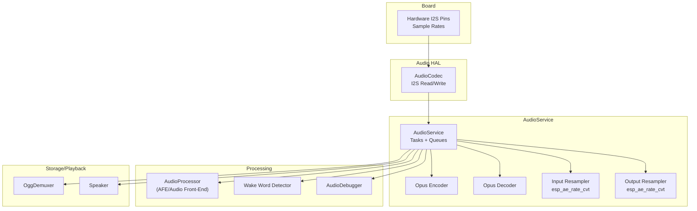
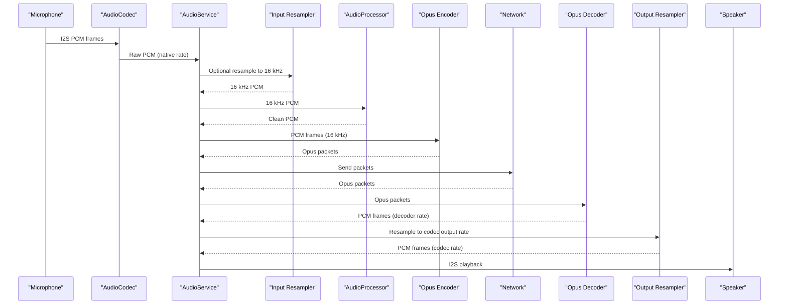
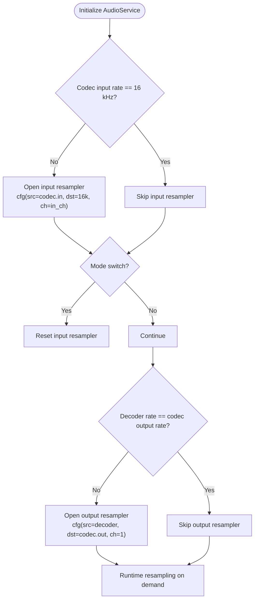
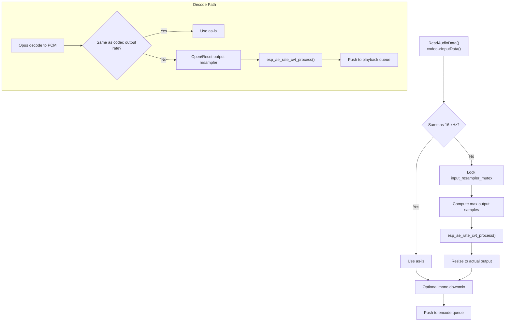
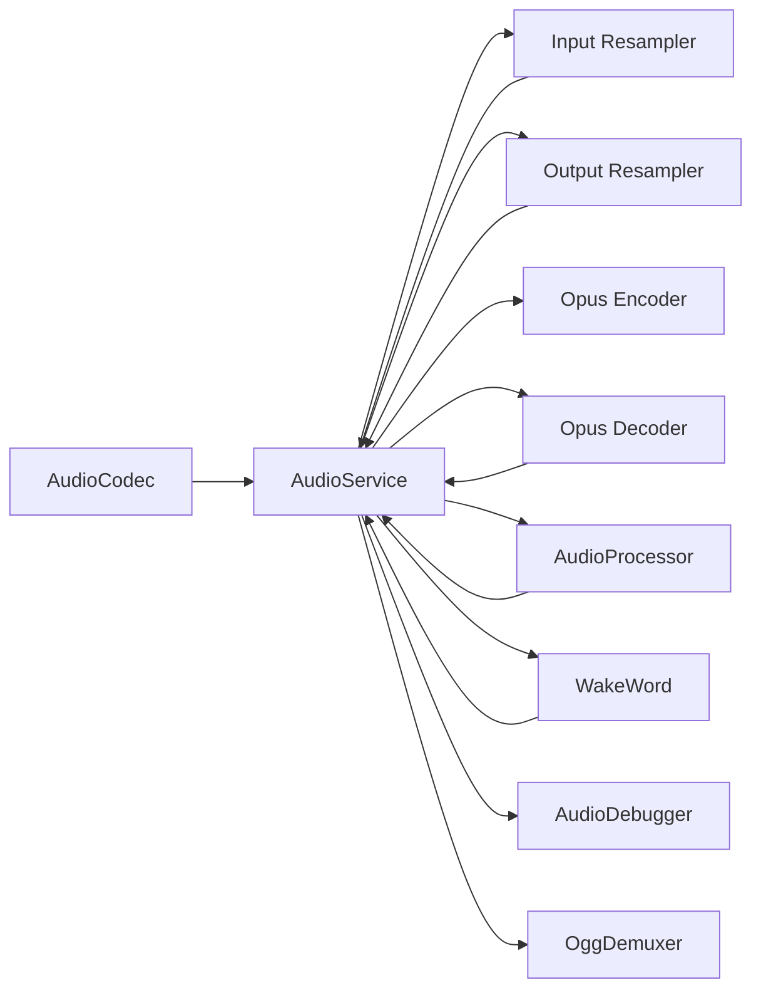

# Audio Resampling and Conversion

<cite>
**Referenced Files in This Document**
- [audio_service.h](file://main/audio/audio_service.h)
- [audio_service.cc](file://main/audio/audio_service.cc)
- [audio_codec.h](file://main/audio/audio_codec.h)
- [audio_codec.cc](file://main/audio/audio_codec.cc)
- [audio_processor.h](file://main/audio/audio_processor.h)
- [afe_audio_processor.h](file://main/audio/processors/afe_audio_processor.h)
- [ogg_demuxer.h](file://main/audio/demuxer/ogg_demuxer.h)
- [esp_wake_word.h](file://main/audio/wake_words/esp_wake_word.h)
- [audio_debugger.h](file://main/audio/processors/audio_debugger.h)
- [config.h](file://main/boards/lulu-esp32s3/config.h)
- [README.md](file://main/audio/README.md)
- [settings.h](file://main/settings.h)
</cite>

## Table of Contents
1. [Introduction](#introduction)
2. [Project Structure](#project-structure)
3. [Core Components](#core-components)
4. [Architecture Overview](#architecture-overview)
5. [Detailed Component Analysis](#detailed-component-analysis)
6. [Dependency Analysis](#dependency-analysis)
7. [Performance Considerations](#performance-considerations)
8. [Troubleshooting Guide](#troubleshooting-guide)
9. [Conclusion](#conclusion)
10. [Appendices](#appendices)

## Introduction
This document explains the audio resampling and conversion systems used in the project, focusing on:
- Input resampler for sample rate conversion from the codec’s native rate to the processing rate (typically 16 kHz)
- Output resampler for adapting decoded audio to the codec’s output sample rate
- ESP Audio resampling engine configuration, quality/performance trade-offs, and buffer management
- The rate conversion pipeline for handling different input/output sample rates, channel conversions, and bit-depth adjustments
- Initialization, parameter optimization, and memory management strategies
- Integration with audio processing tasks and timing considerations for real-time performance
- Configuration examples for different codec requirements, performance tuning guidelines, and troubleshooting resampling artifacts or latency issues

## Project Structure
The audio subsystem centers around the AudioService orchestrator, which coordinates the codec HAL, audio processors, wake word detection, Opus encoder/decoder, and resamplers. The board configuration defines hardware sample rates and I2S wiring.

**Diagram sources**
- [audio_service.h:106-204](file://main/audio/audio_service.h#L106-L204)
- [audio_service.cc:62-124](file://main/audio/audio_service.cc#L62-L124)
- [audio_codec.h:17-62](file://main/audio/audio_codec.h#L17-L62)
- [afe_audio_processor.h:18-53](file://main/audio/processors/afe_audio_processor.h#L18-L53)
- [ogg_demuxer.h:9-63](file://main/audio/demuxer/ogg_demuxer.h#L9-L63)
- [config.h:6-8](file://main/boards/lulu-esp32s3/config.h#L6-L8)

**Section sources**
- [README.md:1-88](file://main/audio/README.md#L1-L88)
- [audio_service.h:106-204](file://main/audio/audio_service.h#L106-L204)
- [audio_service.cc:62-124](file://main/audio/audio_service.cc#L62-L124)
- [audio_codec.h:17-62](file://main/audio/audio_codec.h#L17-L62)
- [config.h:6-8](file://main/boards/lulu-esp32s3/config.h#L6-L8)

## Core Components
- AudioCodec: Hardware abstraction for I2S input/output, exposing current sample rates/channels and enabling/disabling paths.
- AudioService: Central coordinator managing tasks, queues, resamplers, encoder/decoder, and power management timers.
- AudioProcessor: Real-time audio front-end (e.g., AFE) for AEC/VAD/cleaning; feeds processed PCM to the encoder.
- WakeWord: Keyword detection that runs independently until triggered.
- OggDemuxer: Demultiplexes Ogg/Opus content for playback.
- ESP Audio Resampling Engine: esp_ae_rate_cvt for input and output resampling.

Key responsibilities:
- Input resampling: Convert codec-native input rate to 16 kHz for processing
- Output resampling: Adapt decoded Opus rate to codec output rate for playback
- Buffer sizing and queue limits to maintain real-time behavior
- Thread-safe resampler resets during mode transitions

**Section sources**
- [audio_codec.h:17-62](file://main/audio/audio_codec.h#L17-L62)
- [audio_service.h:106-204](file://main/audio/audio_service.h#L106-L204)
- [audio_service.cc:86-93](file://main/audio/audio_service.cc#L86-L93)
- [audio_processor.h:11-27](file://main/audio/audio_processor.h#L11-L27)
- [afe_audio_processor.h:18-53](file://main/audio/processors/afe_audio_processor.h#L18-L53)
- [ogg_demuxer.h:9-63](file://main/audio/demuxer/ogg_demuxer.h#L9-L63)

## Architecture Overview
The AudioService implements a multi-task architecture:
- AudioInputTask: Reads PCM from AudioCodec, optionally resamples, and feeds WakeWord or AudioProcessor
- OpusCodecTask: Encodes PCM to Opus and decodes Opus to PCM, managing resampling between decoder and codec
- AudioOutputTask: Plays PCM via AudioCodec
- Power management timer disables ADC/DAC after inactivity

**Diagram sources**
- [audio_service.cc:263-321](file://main/audio/audio_service.cc#L263-L321)
- [audio_service.cc:360-479](file://main/audio/audio_service.cc#L360-L479)
- [audio_service.cc:481-515](file://main/audio/audio_service.cc#L481-L515)

**Section sources**
- [README.md:14-88](file://main/audio/README.md#L14-L88)
- [audio_service.cc:263-321](file://main/audio/audio_service.cc#L263-L321)
- [audio_service.cc:360-479](file://main/audio/audio_service.cc#L360-L479)
- [audio_service.cc:481-515](file://main/audio/audio_service.cc#L481-L515)

## Detailed Component Analysis

### ESP Audio Resampling Engine Configuration
The system uses the ESP Audio resampling engine (esp_ae_rate_cvt) for both input and output resampling. Configuration parameters include:
- Source and destination sample rates
- Channel count
- Bits per sample
- Complexity level
- Performance type (speed-oriented)

Initialization and usage:
- Input resampler is opened when the codec input rate differs from the processing rate (16 kHz)
- Output resampler is opened when the decoder output rate differs from the codec output rate
- Resamplers are reset when switching between modes (WakeWord vs AudioProcessor) to avoid buffer overflow

**Diagram sources**
- [audio_service.cc:5-14](file://main/audio/audio_service.cc#L5-L14)
- [audio_service.cc:86-93](file://main/audio/audio_service.cc#L86-L93)
- [audio_service.cc:481-515](file://main/audio/audio_service.cc#L481-L515)
- [audio_service.cc:596-603](file://main/audio/audio_service.cc#L596-L603)

**Section sources**
- [audio_service.cc:5-14](file://main/audio/audio_service.cc#L5-L14)
- [audio_service.cc:86-93](file://main/audio/audio_service.cc#L86-L93)
- [audio_service.cc:481-515](file://main/audio/audio_service.cc#L481-L515)
- [audio_service.cc:596-603](file://main/audio/audio_service.cc#L596-L603)

### Rate Conversion Pipeline
The pipeline handles:
- Input sample rate conversion: From codec-native to 16 kHz for processing
- Channel conversion: Downmix to mono for processing and decoding
- Bit depth: Fixed 16-bit PCM throughout
- Output sample rate conversion: From decoder rate to codec output rate

**Diagram sources**
- [audio_service.cc:217-261](file://main/audio/audio_service.cc#L217-L261)
- [audio_service.cc:403-412](file://main/audio/audio_service.cc#L403-L412)
- [audio_service.cc:481-515](file://main/audio/audio_service.cc#L481-L515)

**Section sources**
- [audio_service.cc:217-261](file://main/audio/audio_service.cc#L217-L261)
- [audio_service.cc:403-412](file://main/audio/audio_service.cc#L403-L412)
- [audio_service.cc:481-515](file://main/audio/audio_service.cc#L481-L515)

### Resampler Initialization and Parameter Optimization
- Input resampler: Opened only when codec input rate differs from 16 kHz; configured with codec input channels and 16 kHz output
- Output resampler: Opened when decoder output rate differs from codec output rate; configured to mono output
- Complexity and perf_type tuned for speed to minimize CPU overhead
- Mutex-protected resampling to ensure thread safety across tasks
- Resampler reset on mode transitions to prevent residual buffered data from causing artifacts

**Section sources**
- [audio_service.cc:86-93](file://main/audio/audio_service.cc#L86-L93)
- [audio_service.cc:481-515](file://main/audio/audio_service.cc#L481-L515)
- [audio_service.cc:596-603](file://main/audio/audio_service.cc#L596-L603)

### Memory Management Strategies
- Dedicated PSRAM stacks for audio tasks to reduce DRAM pressure and improve real-time behavior
- Static task control blocks and preallocated stacks
- Queue size limits to bound memory footprint and prevent unbounded growth
- Decoder reset and queue clearing to reclaim memory during mode changes

**Section sources**
- [audio_service.cc:132-191](file://main/audio/audio_service.cc#L132-L191)
- [audio_service.cc:501-514](file://main/audio/audio_service.cc#L501-L514)
- [audio_service.cc:701-713](file://main/audio/audio_service.cc#L701-L713)

### Integration with Audio Processing Tasks and Timing
- AudioInputTask reads fixed-size frames and conditionally resamples
- OpusCodecTask encodes/decodes in lockstep with queue availability checks
- AudioOutputTask drains playback queue and enables output path on demand
- Power management timer disables ADC/DAC after timeout to save power
- Timestamp handling for server-assisted AEC and synchronization

**Section sources**
- [audio_service.cc:263-321](file://main/audio/audio_service.cc#L263-L321)
- [audio_service.cc:360-479](file://main/audio/audio_service.cc#L360-L479)
- [audio_service.cc:715-728](file://main/audio/audio_service.cc#L715-L728)
- [audio_service.cc:524-532](file://main/audio/audio_service.cc#L524-L532)

### Configuration Examples and Tuning Guidelines
- Encoder configuration targets 16 kHz, mono, VBR with DTX enabled, and configurable frame duration
- Decoder configuration adapts to incoming Opus sample rate and frame duration
- Resampler configuration uses 16-bit PCM, speed-optimized performance, and moderate complexity
- For different codecs:
  - Adjust codec input/output sample rates in board config
  - Ensure resamplers are opened when rates differ
  - Tune queue sizes and task stack sizes for target latency and throughput

**Section sources**
- [audio_service.h:66-77](file://main/audio/audio_service.h#L66-L77)
- [audio_service.cc:16-23](file://main/audio/audio_service.cc#L16-L23)
- [audio_service.cc:66-84](file://main/audio/audio_service.cc#L66-L84)
- [config.h:6-8](file://main/boards/lulu-esp32s3/config.h#L6-L8)

## Dependency Analysis

**Diagram sources**
- [audio_service.h:139-149](file://main/audio/audio_service.h#L139-L149)
- [audio_service.cc:62-124](file://main/audio/audio_service.cc#L62-L124)

**Section sources**
- [audio_service.h:139-149](file://main/audio/audio_service.h#L139-L149)
- [audio_service.cc:62-124](file://main/audio/audio_service.cc#L62-L124)

## Performance Considerations
- Prefer speed-optimized resampling to reduce CPU load
- Keep queue sizes conservative to limit latency and memory usage
- Use PSRAM stacks for audio tasks to avoid DRAM contention
- Minimize mode transitions to reduce resampler resets and warm-up delays
- Monitor power timer behavior to balance responsiveness and power saving

## Troubleshooting Guide
Common issues and remedies:
- Resampling artifacts on mode switch:
  - Ensure resampler reset is called when switching between WakeWord and AudioProcessor
  - Verify mutex protection around resampling calls
- Latency spikes:
  - Confirm queue sizes and task priorities meet target frame durations
  - Check that decoder sample rate matches incoming packet rate to avoid unnecessary resampling
- No audio out:
  - Verify output resampler is open when decoder rate differs from codec output rate
  - Confirm AudioOutputTask is running and codec output is enabled
- Power gating disabling input unexpectedly:
  - Reduce power timeout or ensure periodic activity to keep ADC enabled

**Section sources**
- [audio_service.cc:596-603](file://main/audio/audio_service.cc#L596-L603)
- [audio_service.cc:481-515](file://main/audio/audio_service.cc#L481-L515)
- [audio_service.cc:715-728](file://main/audio/audio_service.cc#L715-L728)

## Conclusion
The audio resampling and conversion system leverages the ESP Audio resampling engine to adapt between codec-native and processing/output sample rates. Through careful initialization, queue management, and mode-aware resampler resets, the system achieves real-time performance with minimal artifacts. Proper configuration of encoder/decoder and resampler parameters ensures robust operation across diverse hardware and codec setups.

## Appendices

### Appendix A: Key Definitions and Constants
- Frame duration defaults and queue sizing constants
- Opus encoder configuration macro
- Resampler configuration macro

**Section sources**
- [audio_service.h:40-77](file://main/audio/audio_service.h#L40-L77)
- [audio_service.cc:5-14](file://main/audio/audio_service.cc#L5-L14)

### Appendix B: Hardware Sample Rates
- Board-configured input and output sample rates

**Section sources**
- [config.h:6-8](file://main/boards/lulu-esp32s3/config.h#L6-L8)