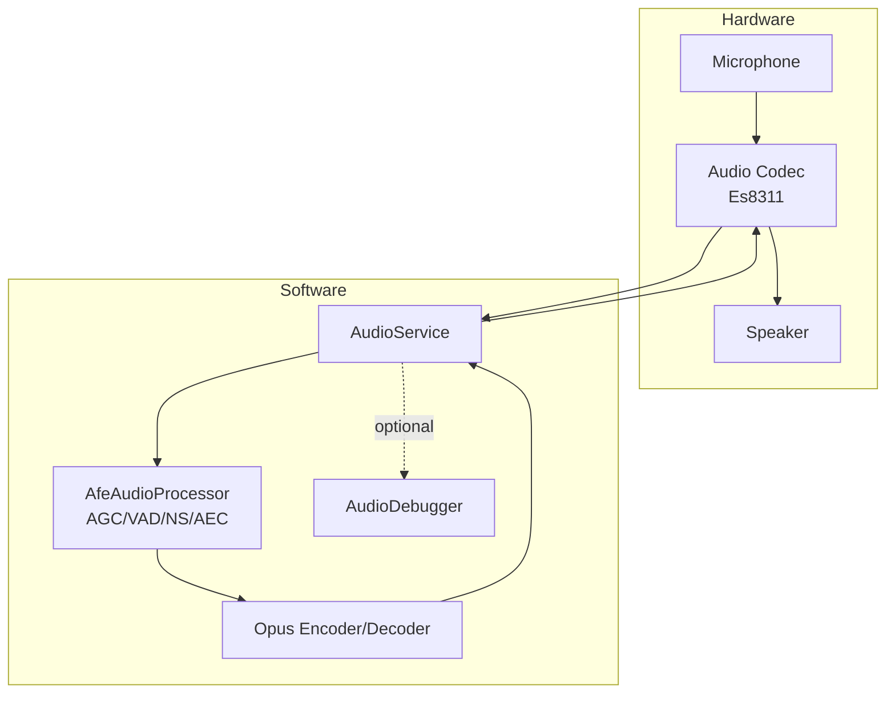
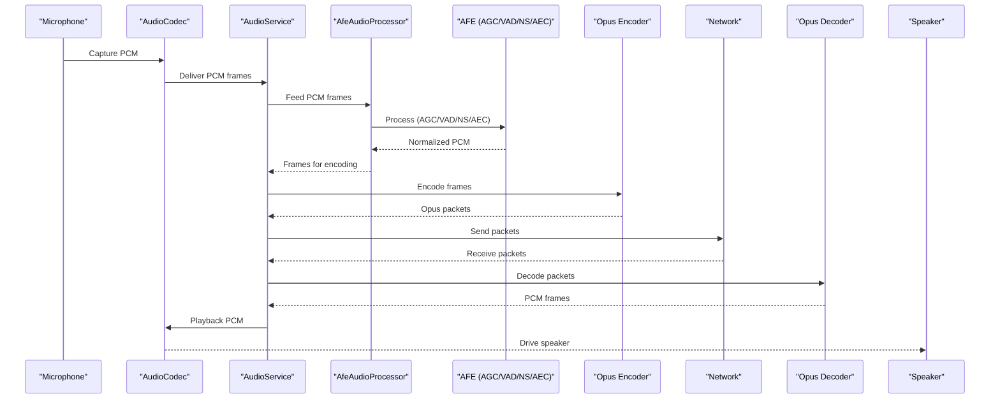
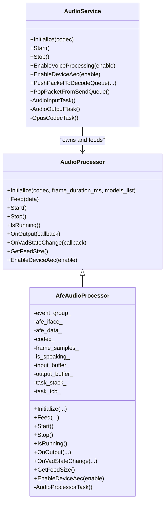
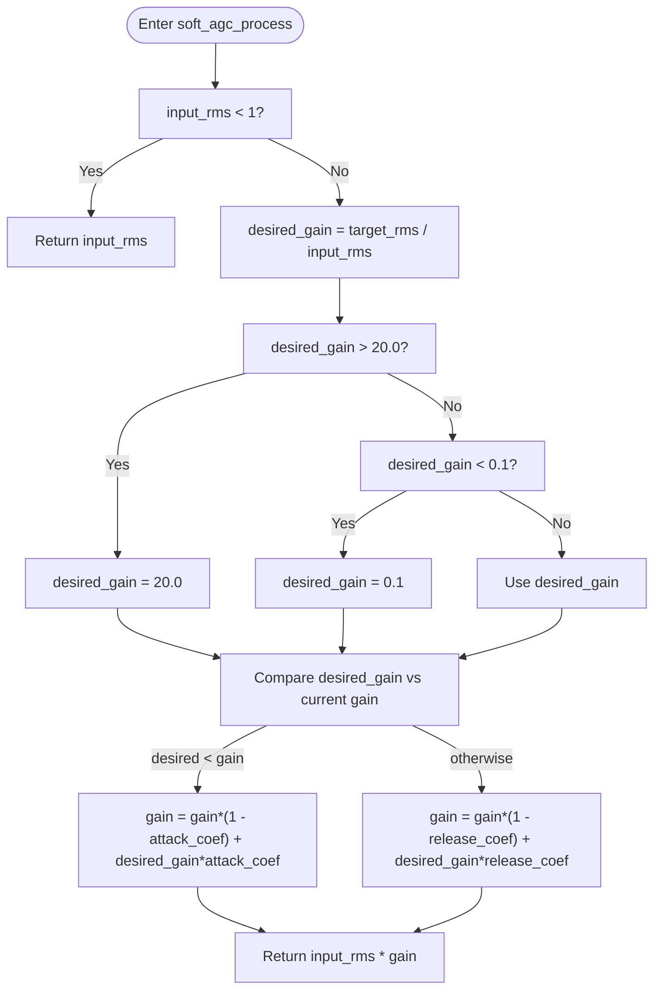
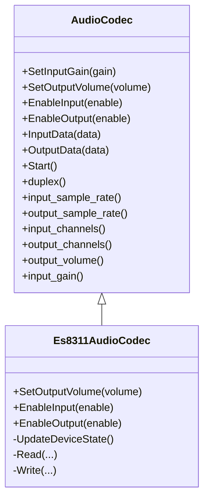
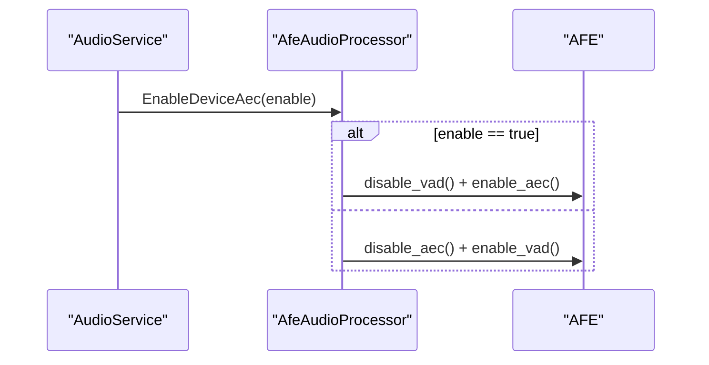
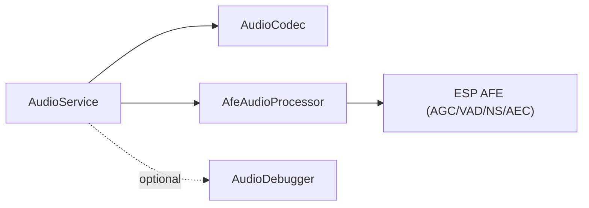

# Automatic Gain Control (AGC)

<cite>
**Referenced Files in This Document**
- [test_hw.c](file://test_firmware/main/test_hw.c)
- [audio_service.h](file://main/audio/audio_service.h)
- [audio_service.cc](file://main/audio/audio_service.cc)
- [audio_processor.h](file://main/audio/audio_processor.h)
- [afe_audio_processor.h](file://main/audio/processors/afe_audio_processor.h)
- [afe_audio_processor.cc](file://main/audio/processors/afe_audio_processor.cc)
- [audio_codec.h](file://main/audio/audio_codec.h)
- [es8311_audio_codec.h](file://main/audio/codecs/es8311_audio_codec.h)
- [es8311_audio_codec.cc](file://main/audio/codecs/es8311_audio_codec.cc)
- [audio_debugger.h](file://main/audio/processors/audio_debugger.h)
- [audio_debugger.cc](file://main/audio/processors/audio_debugger.cc)
</cite>

## Table of Contents
1. [Introduction](#introduction)
2. [Project Structure](#project-structure)
3. [Core Components](#core-components)
4. [Architecture Overview](#architecture-overview)
5. [Detailed Component Analysis](#detailed-component-analysis)
6. [Dependency Analysis](#dependency-analysis)
7. [Performance Considerations](#performance-considerations)
8. [Troubleshooting Guide](#troubleshooting-guide)
9. [Conclusion](#conclusion)
10. [Appendices](#appendices)

## Introduction
This document explains the Automatic Gain Control (AGC) system in the project, focusing on digital gain stages, AGC loop dynamics, and level normalization algorithms. It covers how AGC is integrated with microphone preamplification, ADC clipping prevention, and speaker volume optimization. It also documents AGC parameter tuning for different input sources, room environments, and user preferences, and describes the relationship between AGC and other audio processing stages such as noise suppression and echo cancellation. Finally, it provides configuration examples, troubleshooting guidance, and performance monitoring techniques.

## Project Structure
The AGC implementation spans several layers:
- Audio capture and playback via the codec layer
- Voice processing pipeline that includes AGC, VAD, noise suppression, and optional AEC
- Encoding/decoding and transport queues
- Optional hardware AGC via device AEC and software AGC simulation in tests

**Diagram sources**
- [audio_service.h:29-38](file://main/audio/audio_service.h#L29-L38)
- [audio_service.cc:62-123](file://main/audio/audio_service.cc#L62-L123)
- [afe_audio_processor.cc:13-82](file://main/audio/processors/afe_audio_processor.cc#L13-L82)
- [es8311_audio_codec.cc:70-98](file://main/audio/codecs/es8311_audio_codec.cc#L70-L98)

**Section sources**
- [audio_service.h:29-38](file://main/audio/audio_service.h#L29-L38)
- [audio_service.cc:62-123](file://main/audio/audio_service.cc#L62-L123)

## Core Components
- AudioService orchestrates capture, processing, encoding, decoding, and playback. It initializes the codec, sets up encoders/decoders, and manages queues and tasks.
- AfeAudioProcessor integrates the ESP AFE (Audio Front End) which includes AGC, VAD, NS, and AEC. AGC is enabled in the AFE configuration.
- AudioCodec abstracts the hardware codec (e.g., Es8311) and exposes input gain and output volume controls.
- AudioDebugger optionally streams raw PCM for external analysis.

Key AGC-related highlights:
- AGC is enabled in the AFE configuration within AfeAudioProcessor initialization.
- The codec exposes input gain and output volume APIs for preamp and speaker volume control.
- A software AGC simulation exists in the test firmware to demonstrate AGC behavior.

**Section sources**
- [afe_audio_processor.cc:56](file://main/audio/processors/afe_audio_processor.cc#L56)
- [audio_codec.h:22-41](file://main/audio/audio_codec.h#L22-L41)
- [es8311_audio_codec.cc:88-98](file://main/audio/codecs/es8311_audio_codec.cc#L88-L98)
- [test_hw.c:319-342](file://test_firmware/main/test_hw.c#L319-L342)

## Architecture Overview
The AGC system operates within the voice processing pipeline. The flow below shows how audio moves from capture through processing and playback, highlighting where AGC is applied.

**Diagram sources**
- [audio_service.cc:263-321](file://main/audio/audio_service.cc#L263-L321)
- [audio_service.cc:360-479](file://main/audio/audio_service.cc#L360-L479)
- [afe_audio_processor.cc:145-199](file://main/audio/processors/afe_audio_processor.cc#L145-L199)

## Detailed Component Analysis

### AFE AGC and Voice Processing Pipeline
The AFE configuration enables AGC and sets VAD sensitivity and modes. The processor task fetches processed frames and emits normalized PCM to downstream components. VAD state changes are propagated to the service.

**Diagram sources**
- [audio_processor.h:11-24](file://main/audio/audio_processor.h#L11-L24)
- [afe_audio_processor.h:18-51](file://main/audio/processors/afe_audio_processor.h#L18-L51)
- [afe_audio_processor.cc:13-82](file://main/audio/processors/afe_audio_processor.cc#L13-L82)
- [audio_service.cc:62-123](file://main/audio/audio_service.cc#L62-L123)

**Section sources**
- [afe_audio_processor.cc:13-82](file://main/audio/processors/afe_audio_processor.cc#L13-L82)
- [afe_audio_processor.cc:145-199](file://main/audio/processors/afe_audio_processor.cc#L145-L199)
- [audio_service.cc:612-637](file://main/audio/audio_service.cc#L612-L637)

### Software AGC Simulation (Test Firmware)
A lightweight software AGC demonstrates the AGC loop dynamics:
- Target RMS drives desired gain
- Attack/release coefficients control rise/fall speed
- Clamp desired gain within bounds
- Apply gain to input RMS to produce output RMS

**Diagram sources**
- [test_hw.c:319-342](file://test_firmware/main/test_hw.c#L319-L342)

**Section sources**
- [test_hw.c:319-342](file://test_firmware/main/test_hw.c#L319-L342)

### Codec Input Gain and Output Volume
The codec layer exposes:
- Input gain adjustment for microphone preamplification
- Output volume control for speaker playback
These APIs are used to prevent ADC clipping and optimize speaker volume.

**Diagram sources**
- [audio_codec.h:17-61](file://main/audio/audio_codec.h#L17-L61)
- [es8311_audio_codec.h:13-42](file://main/audio/codecs/es8311_audio_codec.h#L13-L42)
- [es8311_audio_codec.cc:88-98](file://main/audio/codecs/es8311_audio_codec.cc#L88-L98)

**Section sources**
- [audio_codec.h:22-41](file://main/audio/audio_codec.h#L22-L41)
- [es8311_audio_codec.cc:88-98](file://main/audio/codecs/es8311_audio_codec.cc#L88-L98)

### Device AEC Toggle and AGC Interaction
AudioService allows enabling/disabling device AEC, which toggles between VAD and AEC modes in the AFE. While AGC remains enabled, AEC affects echo cancellation and can influence perceived loudness and stability.

**Diagram sources**
- [audio_service.cc:652-660](file://main/audio/audio_service.cc#L652-L660)
- [afe_audio_processor.cc:201-213](file://main/audio/processors/afe_audio_processor.cc#L201-L213)

**Section sources**
- [audio_service.cc:652-660](file://main/audio/audio_service.cc#L652-L660)
- [afe_audio_processor.cc:201-213](file://main/audio/processors/afe_audio_processor.cc#L201-L213)

## Dependency Analysis
- AudioService depends on AudioCodec for I/O and on AfeAudioProcessor for voice processing.
- AfeAudioProcessor depends on the ESP AFE library and exposes AGC/VAD/NS/AEC capabilities.
- AudioDebugger is optional and streams raw PCM for external analysis.

**Diagram sources**
- [audio_service.cc:62-123](file://main/audio/audio_service.cc#L62-L123)
- [afe_audio_processor.cc:13-82](file://main/audio/processors/afe_audio_processor.cc#L13-L82)
- [audio_debugger.h:10-22](file://main/audio/processors/audio_debugger.h#L10-L22)

**Section sources**
- [audio_service.cc:62-123](file://main/audio/audio_service.cc#L62-L123)
- [afe_audio_processor.cc:13-82](file://main/audio/processors/afe_audio_processor.cc#L13-L82)

## Performance Considerations
- AGC responsiveness: Attack and decay coefficients determine how quickly the system adapts to level changes. Lower attack/decay values increase responsiveness but may cause audible pumping if too aggressive.
- Frame duration: Longer frames smooth RMS estimation but increase latency; shorter frames reduce latency but may be noisier.
- Buffering and queues: Ensure adequate queue depths to avoid stalls during encoding/decoding and playback.
- Hardware AGC vs software AGC: Hardware AGC reduces CPU load and provides consistent behavior across platforms; software AGC is useful for experimentation and tuning.
- Power management: The codec automatically powers down inputs/outputs after inactivity to save power.

[No sources needed since this section provides general guidance]

## Troubleshooting Guide
Common AGC-related issues and remedies:
- Microphone too quiet
  - Increase codec input gain to boost microphone preamplification.
  - Verify AGC is enabled in the AFE configuration.
- Distorted or clipped audio
  - Reduce input gain to prevent ADC saturation.
  - Monitor peak levels and adjust accordingly.
- Speaker too loud or quiet
  - Adjust codec output volume for speaker playback.
- Echo or instability
  - Enable device AEC via AudioService to improve echo cancellation.
  - Ensure proper VAD thresholds and NS settings.
- Noisy background
  - Confirm noise suppression is enabled in the AFE configuration.
  - Tune VAD sensitivity to avoid false positives.
- Monitoring
  - Use AudioDebugger to stream raw PCM for external analysis.
  - Observe VAD state transitions and adjust thresholds.

**Section sources**
- [audio_codec.h:22-41](file://main/audio/audio_codec.h#L22-L41)
- [es8311_audio_codec.cc:88-98](file://main/audio/codecs/es8311_audio_codec.cc#L88-L98)
- [afe_audio_processor.cc:56](file://main/audio/processors/afe_audio_processor.cc#L56)
- [audio_service.cc:652-660](file://main/audio/audio_service.cc#L652-L660)
- [audio_debugger.cc:54-66](file://main/audio/processors/audio_debugger.cc#L54-L66)

## Conclusion
The AGC system integrates hardware-based AGC via the ESP AFE with configurable microphone preamplification and speaker volume control. The pipeline supports VAD, noise suppression, and AEC, enabling robust voice processing across diverse environments. Proper tuning of AGC parameters, combined with input/output gain control and AEC, yields optimal audio quality and user experience.

[No sources needed since this section summarizes without analyzing specific files]

## Appendices

### AGC Parameter Tuning Guidelines
- Target level (RMS): Choose a target RMS that keeps speech intelligible without clipping. Start with moderate values and adjust based on measured pause RMS.
- Attack coefficient: Lower values adapt faster but risk audible pumping; higher values are smoother but slower.
- Decay coefficient: Balance responsiveness to speech onset and stability during pauses.
- Input gain: Increase for weak microphones; decrease to avoid clipping near loud sounds.
- Output volume: Set to comfortable listening levels; avoid excessive volume that causes distortion.

[No sources needed since this section provides general guidance]

### Configuration Examples
- Enable voice processing with AGC/VAD/NS/AEC:
  - Call AudioService::EnableVoiceProcessing(true) to initialize and start AfeAudioProcessor.
- Enable device AEC:
  - Call AudioService::EnableDeviceAec(true) to switch AFE to AEC mode.
- Adjust input gain:
  - Use AudioCodec::SetInputGain(value) to increase microphone preamplification.
- Adjust output volume:
  - Use AudioCodec::SetOutputVolume(value) to control speaker volume.

**Section sources**
- [audio_service.cc:612-637](file://main/audio/audio_service.cc#L612-L637)
- [audio_service.cc:652-660](file://main/audio/audio_service.cc#L652-L660)
- [audio_codec.h:22-41](file://main/audio/audio_codec.h#L22-L41)