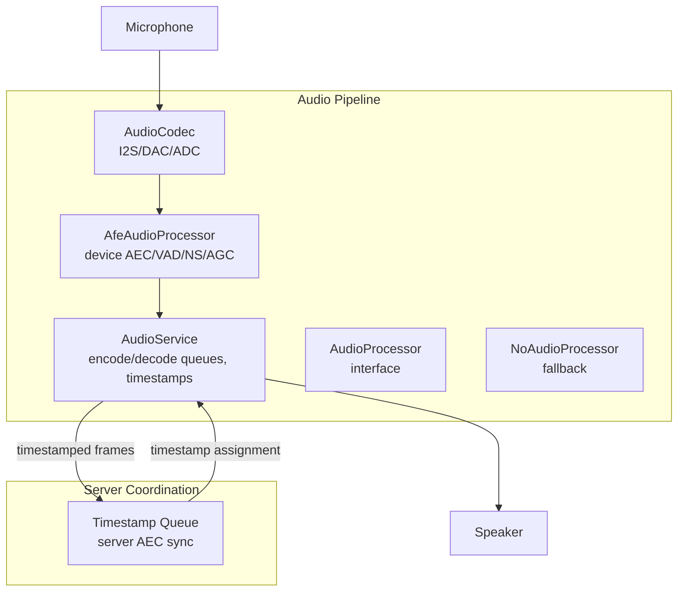
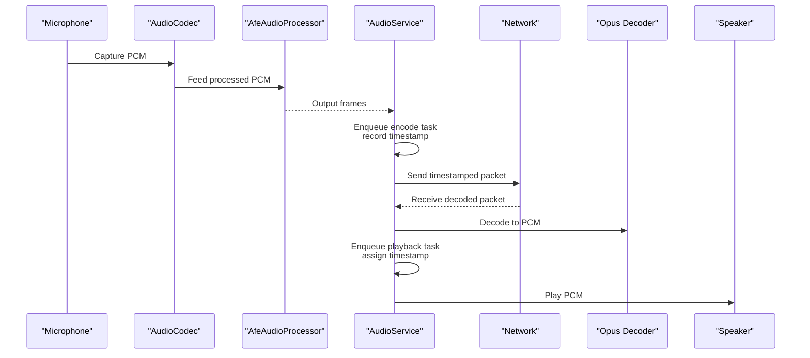
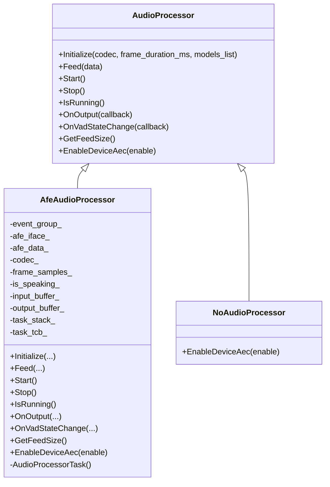
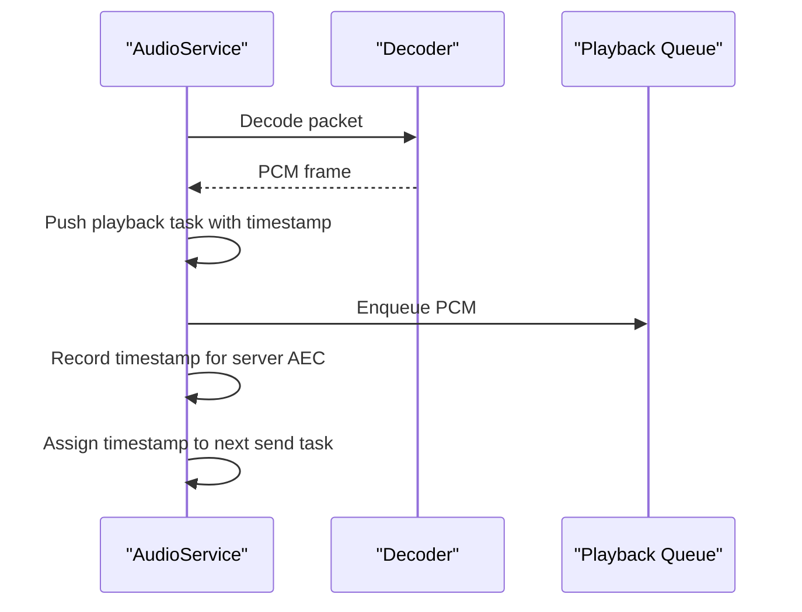
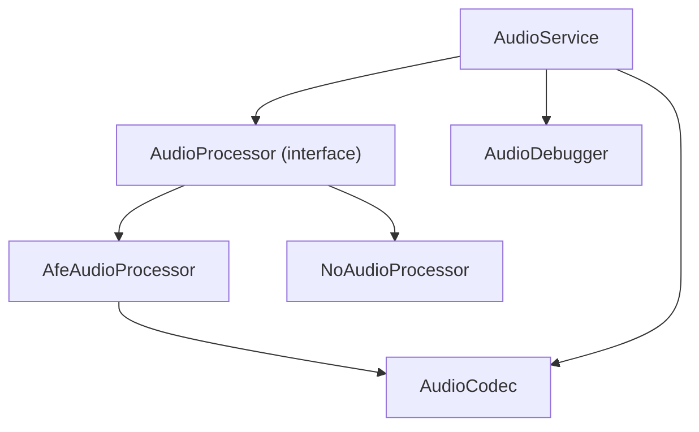

# Echo Cancellation System

<cite>
**Referenced Files in This Document**
- [audio_processor.h](file://main/audio/audio_processor.h)
- [audio_service.h](file://main/audio/audio_service.h)
- [audio_service.cc](file://main/audio/audio_service.cc)
- [afe_audio_processor.h](file://main/audio/processors/afe_audio_processor.h)
- [afe_audio_processor.cc](file://main/audio/processors/afe_audio_processor.cc)
- [no_audio_processor.h](file://main/audio/processors/no_audio_processor.h)
- [no_audio_processor.cc](file://main/audio/processors/no_audio_processor.cc)
- [audio_codec.h](file://main/audio/audio_codec.h)
- [box_audio_codec.cc](file://main/audio/codecs/box_audio_codec.cc)
- [audio_debugger.h](file://main/audio/processors/audio_debugger.h)
- [audio_debugger.cc](file://main/audio/processors/audio_debugger.cc)
- [application.cc](file://main/application.cc)
- [test_hw.c](file://test_firmware/main/test_hw.c)
</cite>

## Table of Contents
1. [Introduction](#introduction)
2. [Project Structure](#project-structure)
3. [Core Components](#core-components)
4. [Architecture Overview](#architecture-overview)
5. [Detailed Component Analysis](#detailed-component-analysis)
6. [Dependency Analysis](#dependency-analysis)
7. [Performance Considerations](#performance-considerations)
8. [Troubleshooting Guide](#troubleshooting-guide)
9. [Conclusion](#conclusion)
10. [Appendices](#appendices)

## Introduction
This document describes the echo cancellation system in the project, focusing on device-side Acoustic Echo Cancellation (AEC) via the AFE (Audio Front End) and server-side coordination for echo path tracking and timestamp management. It explains how the system integrates with device AEC enable/disable functionality and how server-side timestamps are managed for coordination. While the repository does not implement adaptive filters such as LMS/NLMS internally, it provides hooks and infrastructure to support device AEC and server-side timestamp alignment. Guidance is included for parameter tuning, convergence optimization, and performance monitoring, along with troubleshooting steps for echo leakage, instability, and latency compensation.

## Project Structure
The echo cancellation system spans several modules:
- Audio pipeline orchestration and server coordination
- Device-side audio processing with AFE
- Codec abstraction for input/output channels
- Optional audio debugging and testing utilities

**Diagram sources**
- [audio_service.h:106-204](file://main/audio/audio_service.h#L106-L204)
- [audio_service.cc:342-551](file://main/audio/audio_service.cc#L342-L551)
- [afe_audio_processor.h:18-53](file://main/audio/processors/afe_audio_processor.h#L18-L53)
- [afe_audio_processor.cc:13-214](file://main/audio/processors/afe_audio_processor.cc#L13-L214)
- [audio_processor.h:11-26](file://main/audio/audio_processor.h#L11-L26)
- [audio_codec.h:17-61](file://main/audio/audio_codec.h#L17-L61)

**Section sources**
- [audio_service.h:106-204](file://main/audio/audio_service.h#L106-L204)
- [audio_service.cc:342-551](file://main/audio/audio_service.cc#L342-L551)
- [afe_audio_processor.h:18-53](file://main/audio/processors/afe_audio_processor.h#L18-L53)
- [afe_audio_processor.cc:13-214](file://main/audio/processors/afe_audio_processor.cc#L13-L214)
- [audio_processor.h:11-26](file://main/audio/audio_processor.h#L11-L26)
- [audio_codec.h:17-61](file://main/audio/audio_codec.h#L17-L61)

## Core Components
- AudioService: Manages encode/decode tasks, queues, and server-side timestamp handling for AEC coordination.
- AudioProcessor interface: Defines the contract for audio processing implementations.
- AfeAudioProcessor: Implements device-side AEC using the AFE, with VAD, noise suppression, and AGC.
- NoAudioProcessor: Fallback implementation that logs unsupported device AEC.
- AudioCodec: Abstracts I2S input/output channels and exposes gain/volume controls.
- AudioDebugger: Optional UDP-based audio data sink for diagnostics.

Key responsibilities:
- Device AEC enable/disable toggles are exposed via AudioProcessor::EnableDeviceAec and implemented in AfeAudioProcessor.
- Server-side AEC timestamp management is handled by AudioService’s timestamp queue and assignment logic.
- AudioCodec provides input reference and channel configuration for echo path tracking scenarios.

**Section sources**
- [audio_processor.h:11-26](file://main/audio/audio_processor.h#L11-L26)
- [afe_audio_processor.cc:201-213](file://main/audio/processors/afe_audio_processor.cc#L201-L213)
- [audio_service.h:183-184](file://main/audio/audio_service.h#L183-L184)
- [audio_service.cc:342-551](file://main/audio/audio_service.cc#L342-L551)
- [audio_codec.h:17-61](file://main/audio/audio_codec.h#L17-L61)
- [audio_debugger.cc:16-68](file://main/audio/processors/audio_debugger.cc#L16-L68)

## Architecture Overview
The system routes microphone audio through the codec to the AFE for device-side processing (AEC/VAD/NS/AGC), then encodes and sends timestamped packets to the server. On playback, the server decodes audio and pushes timestamped frames to the output queue. AudioService records timestamps for server AEC and assigns them to outgoing packets to maintain synchronization.

**Diagram sources**
- [audio_service.cc:342-551](file://main/audio/audio_service.cc#L342-L551)
- [afe_audio_processor.cc:145-199](file://main/audio/processors/afe_audio_processor.cc#L145-L199)
- [audio_codec.h:17-61](file://main/audio/audio_codec.h#L17-L61)

## Detailed Component Analysis

### Device-Side AEC via AFE
The AFE-based processor configures AEC, VAD, noise suppression, and AGC. It exposes an interface to enable/disable device AEC and toggles VAD accordingly.

**Diagram sources**
- [audio_processor.h:11-26](file://main/audio/audio_processor.h#L11-L26)
- [afe_audio_processor.h:18-53](file://main/audio/processors/afe_audio_processor.h#L18-L53)
- [no_audio_processor.h:11-35](file://main/audio/processors/no_audio_processor.h#L11-L35)

Key behaviors:
- AFE configuration enables AEC in VOIP high-performance mode and sets VAD sensitivity.
- Device AEC can be enabled/disabled at runtime; enabling AEC disables VAD in the processor.
- VAD state transitions trigger callbacks for higher-level logic.

**Section sources**
- [afe_audio_processor.cc:13-82](file://main/audio/processors/afe_audio_processor.cc#L13-L82)
- [afe_audio_processor.cc:201-213](file://main/audio/processors/afe_audio_processor.cc#L201-L213)
- [afe_audio_processor.cc:145-199](file://main/audio/processors/afe_audio_processor.cc#L145-L199)

### Server-Side AEC Timestamp Management
AudioService maintains a timestamp queue for server-side AEC coordination. When decoding, it assigns timestamps to playback tasks and records timestamps for outgoing packets. This ensures synchronized echo path tracking between device and server.

**Diagram sources**
- [audio_service.cc:342-551](file://main/audio/audio_service.cc#L342-L551)
- [audio_service.h:183-184](file://main/audio/audio_service.h#L183-L184)

**Section sources**
- [audio_service.cc:342-551](file://main/audio/audio_service.cc#L342-L551)
- [audio_service.h:183-184](file://main/audio/audio_service.h#L183-L184)

### Double-Talk Detection and Comfort Noise
- Double-talk detection is not explicitly implemented in the repository. The AFE configuration enables VAD with increased sensitivity, which can help mitigate double-talk effects by reducing unnecessary processing during simultaneous near/far-end speech.
- Comfort noise generation is not present in the codebase. If required, it can be integrated upstream of the encoder or as part of the AFE NS/AGC chain.

**Section sources**
- [afe_audio_processor.cc:40-65](file://main/audio/processors/afe_audio_processor.cc#L40-L65)

### Adaptive Filter Implementation Notes
- The repository does not implement LMS/NLMS adaptive filters internally. Device AEC is handled by the AFE library. If custom adaptive filtering is desired, it would require extending the processing pipeline with a custom filter module and integrating it into the audio processing task.

**Section sources**
- [afe_audio_processor.cc:13-82](file://main/audio/processors/afe_audio_processor.cc#L13-L82)

### Integration with Device AEC Enable/Disable
- The AudioProcessor interface defines EnableDeviceAec(enable). AfeAudioProcessor implements this by toggling AEC and VAD states. NoAudioProcessor logs that device AEC is not supported.

**Section sources**
- [audio_processor.h:23-23](file://main/audio/audio_processor.h#L23-L23)
- [afe_audio_processor.cc:201-213](file://main/audio/processors/afe_audio_processor.cc#L201-L213)
- [no_audio_processor.cc:67-71](file://main/audio/processors/no_audio_processor.cc#L67-L71)

### Codec and Channel Configuration
- AudioCodec abstracts I2S input/output channels and supports input reference for echo path tracking. BoxAudioCodec demonstrates configuring input channels and reference signals.

**Section sources**
- [audio_codec.h:17-61](file://main/audio/audio_codec.h#L17-L61)
- [box_audio_codec.cc:184-211](file://main/audio/codecs/box_audio_codec.cc#L184-L211)

### Audio Debugger and Testing Utilities
- AudioDebugger optionally streams PCM data over UDP for offline analysis.
- Test firmware includes AGC simulation and SNR evaluation routines useful for validating audio quality under various conditions.

**Section sources**
- [audio_debugger.cc:16-68](file://main/audio/processors/audio_debugger.cc#L16-L68)
- [test_hw.c:294-342](file://test_firmware/main/test_hw.c#L294-L342)
- [test_hw.c:526-580](file://test_firmware/main/test_hw.c#L526-L580)

## Dependency Analysis
The following diagram shows core dependencies among components involved in echo cancellation and server coordination.

**Diagram sources**
- [audio_processor.h:11-26](file://main/audio/audio_processor.h#L11-L26)
- [afe_audio_processor.h:18-53](file://main/audio/processors/afe_audio_processor.h#L18-L53)
- [no_audio_processor.h:11-35](file://main/audio/processors/no_audio_processor.h#L11-L35)
- [audio_service.h:106-204](file://main/audio/audio_service.h#L106-L204)
- [audio_codec.h:17-61](file://main/audio/audio_codec.h#L17-L61)
- [audio_debugger.h:10-22](file://main/audio/processors/audio_debugger.h#L10-L22)

**Section sources**
- [audio_processor.h:11-26](file://main/audio/audio_processor.h#L11-L26)
- [afe_audio_processor.h:18-53](file://main/audio/processors/afe_audio_processor.h#L18-L53)
- [no_audio_processor.h:11-35](file://main/audio/processors/no_audio_processor.h#L11-L35)
- [audio_service.h:106-204](file://main/audio/audio_service.h#L106-L204)
- [audio_codec.h:17-61](file://main/audio/audio_codec.h#L17-L61)
- [audio_debugger.h:10-22](file://main/audio/processors/audio_debugger.h#L10-L22)

## Performance Considerations
- Frame duration and queue sizes: AudioService defines queue limits and frame durations that influence latency and throughput. Tuning OPUS frame duration and queue capacities can improve responsiveness.
- Device AEC configuration: AEC mode and VAD sensitivity are set in the AFE configuration. Adjusting these can improve echo suppression stability and reduce false positives.
- Memory allocation: AFE memory allocation mode and PSRAM usage impact processing performance. Ensure adequate PSRAM allocation for real-time processing.
- Power management: Automatic disabling of ADC/DAC after inactivity conserves power but may introduce startup latency; balance power savings against responsiveness.

[No sources needed since this section provides general guidance]

## Troubleshooting Guide
Common issues and remedies:
- Echo leakage
  - Verify device AEC is enabled when appropriate and VAD is disabled during AEC operation.
  - Confirm codec input reference is configured correctly for echo path tracking.
  - Reduce input gain to minimize feedback and ensure speaker volume is controlled.

- Instability or oscillation
  - Lower input gain and ensure speaker volume is reasonable.
  - Increase VAD silence thresholds slightly to avoid misclassification during low-level signals.
  - Validate that AEC is enabled only when echo is expected (e.g., during playback).

- Latency compensation
  - Align server timestamps to compensate for network and decoder delays.
  - Monitor queue depths and adjust OPUS frame duration to maintain smooth streaming.

- Parameter tuning
  - Tune AFE AEC mode and VAD sensitivity based on hardware and environment.
  - Evaluate AGC behavior using test routines and adjust target RMS and attack/release coefficients.

- Performance monitoring
  - Use AudioDebugger to stream PCM for offline inspection.
  - Track queue sizes and drop rates to detect bottlenecks.

**Section sources**
- [afe_audio_processor.cc:40-65](file://main/audio/processors/afe_audio_processor.cc#L40-L65)
- [audio_service.cc:342-551](file://main/audio/audio_service.cc#L342-L551)
- [audio_debugger.cc:16-68](file://main/audio/processors/audio_debugger.cc#L16-L68)
- [test_hw.c:294-342](file://test_firmware/main/test_hw.c#L294-L342)

## Conclusion
The system leverages device AEC via the AFE for robust echo suppression and coordinates with server-side timestamp management to align echo path tracking. While internal adaptive filtering (LMS/NLMS) is not implemented, the architecture provides clear extension points for custom adaptive filters and advanced double-talk handling. Proper configuration of AFE modes, VAD sensitivity, and queue parameters, combined with monitoring and testing utilities, enables effective echo cancellation across diverse speaker-microphone configurations and room acoustics.

[No sources needed since this section summarizes without analyzing specific files]

## Appendices

### Configuration Examples
- Device AEC enable/disable
  - Use AudioProcessor::EnableDeviceAec(true/false) to toggle device AEC. When enabled, VAD is disabled in the processor.
  - Reference: [EnableDeviceAec:201-213](file://main/audio/processors/afe_audio_processor.cc#L201-L213)

- Server AEC timestamp management
  - AudioService records timestamps for outgoing packets and assigns them to incoming playback tasks.
  - Reference: [Timestamp queue and assignment:342-551](file://main/audio/audio_service.cc#L342-L551)

- Codec input reference and channels
  - Configure input reference and channel masks for echo path tracking.
  - Reference: [BoxAudioCodec channel setup:184-211](file://main/audio/codecs/box_audio_codec.cc#L184-L211)

- VAD and AGC tuning
  - Adjust AFE VAD mode and minimum noise duration; enable AGC for improved microphone sensitivity.
  - Reference: [AFE configuration:40-65](file://main/audio/processors/afe_audio_processor.cc#L40-L65)

- Audio debugger
  - Stream PCM over UDP for diagnostics.
  - Reference: [AudioDebugger:16-68](file://main/audio/processors/audio_debugger.cc#L16-L68)