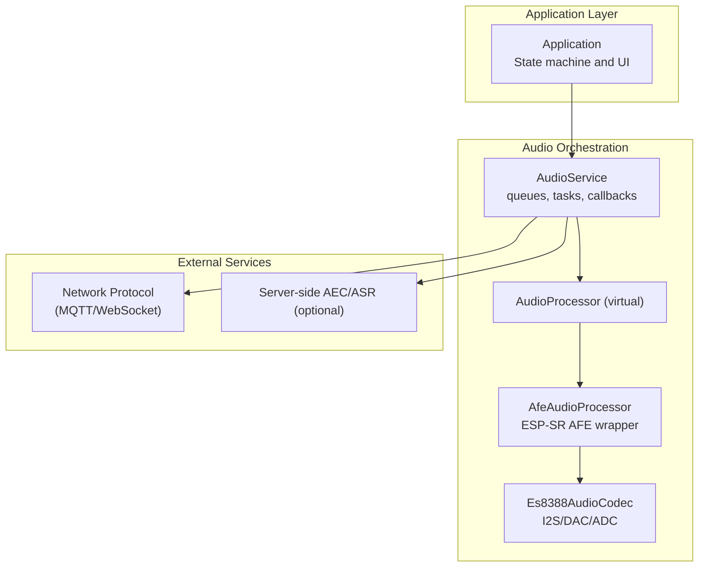
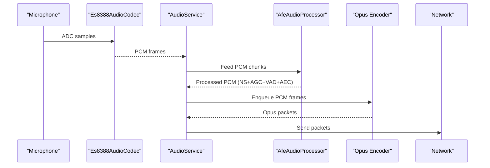
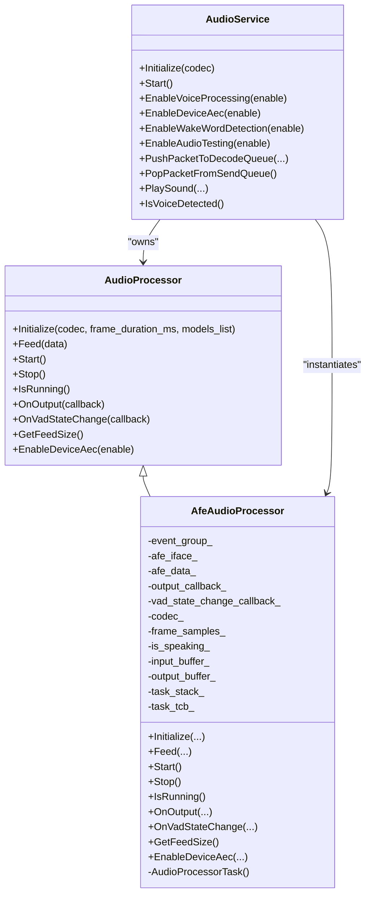
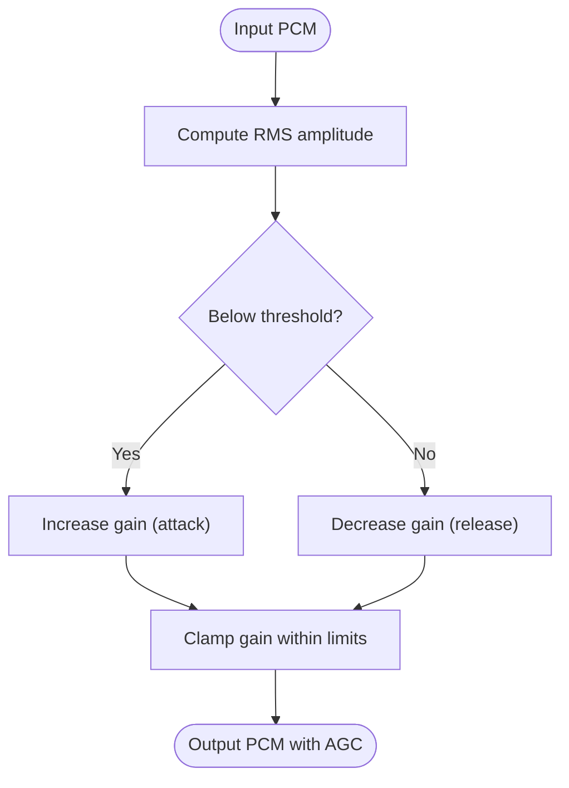
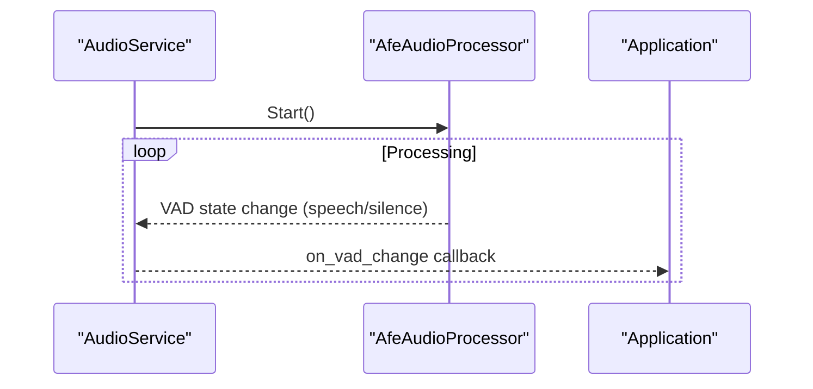
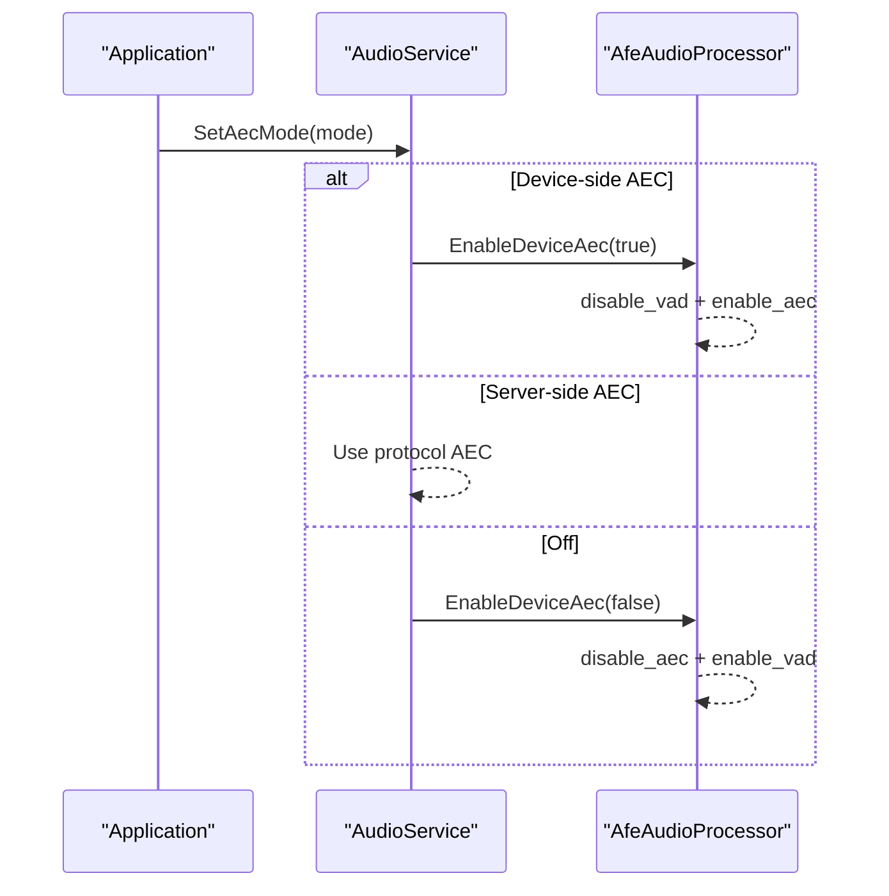
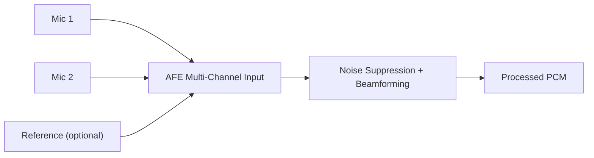
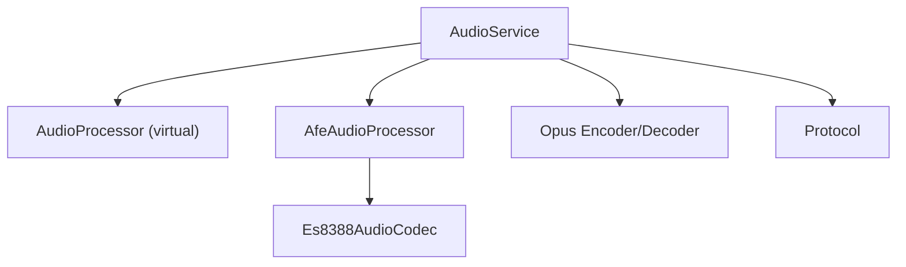

# Noise Suppression Algorithms

<cite>
**Referenced Files in This Document**
- [afe_audio_processor.h](file://main/audio/processors/afe_audio_processor.h)
- [afe_audio_processor.cc](file://main/audio/processors/afe_audio_processor.cc)
- [audio_processor.h](file://main/audio/audio_processor.h)
- [audio_service.h](file://main/audio/audio_service.h)
- [audio_service.cc](file://main/audio/audio_service.cc)
- [application.h](file://main/application.h)
- [application.cc](file://main/application.cc)
- [es8388_audio_codec.h](file://main/audio/codecs/es8388_audio_codec.h)
- [es8388_audio_codec.cc](file://main/audio/codecs/es8388_audio_codec.cc)
- [test_hw.c](file://test_firmware/main/test_hw.c)
</cite>

## Table of Contents
1. [Introduction](#introduction)
2. [Project Structure](#project-structure)
3. [Core Components](#core-components)
4. [Architecture Overview](#architecture-overview)
5. [Detailed Component Analysis](#detailed-component-analysis)
6. [Dependency Analysis](#dependency-analysis)
7. [Performance Considerations](#performance-considerations)
8. [Troubleshooting Guide](#troubleshooting-guide)
9. [Conclusion](#conclusion)
10. [Appendices](#appendices)

## Introduction
This document explains the audio front-end noise suppression algorithms and related processing in the system. The focus is on:
- Noise suppression techniques via the Audio Front-End (AFE) including spectral subtraction and Wiener filtering, and adaptive noise cancellation (ANC).
- Automatic gain control (AGC) implementation with dynamic range compression and level normalization.
- Beamforming and microphone array processing capabilities.
- Environmental noise adaptation and real-time parameter adjustment.
- Configuration parameters for different acoustic environments, performance benchmarks, and troubleshooting noisy audio issues.
- Practical integration examples showing processor initialization, parameter tuning, and pipeline integration.

Where applicable, the document maps the implementation to concrete source files and provides diagrams that reflect actual code relationships.

## Project Structure
The audio front-end is implemented around the AudioService orchestration layer, which coordinates the AudioCodec, AFE audio processor, wake word detection, and encoding/decoding. The AFE integrates with ESP-SR AFE to provide noise suppression, VAD, and AEC.

**Diagram sources**
- [audio_service.cc:62-123](file://main/audio/audio_service.cc#L62-L123)
- [afe_audio_processor.cc:13-82](file://main/audio/processors/afe_audio_processor.cc#L13-L82)
- [es8388_audio_codec.cc:7-71](file://main/audio/codecs/es8388_audio_codec.cc#L7-L71)

**Section sources**
- [audio_service.h:29-38](file://main/audio/audio_service.h#L29-L38)
- [audio_service.cc:62-123](file://main/audio/audio_service.cc#L62-L123)
- [afe_audio_processor.h:18-51](file://main/audio/processors/afe_audio_processor.h#L18-L51)
- [es8388_audio_codec.h:12-40](file://main/audio/codecs/es8388_audio_codec.h#L12-L40)

## Core Components
- AudioService: Central orchestrator managing input/output tasks, queues, Opus encoder/decoder, wake word detection, and AFE integration.
- AfeAudioProcessor: Wraps ESP-SR AFE for voice communication, enabling noise suppression, VAD, and AEC.
- Es8388AudioCodec: I2S-based codec providing ADC/DAC and optional reference input for echo cancellation.
- Application: Top-level state machine that controls AEC modes and audio pipeline lifecycle.

Key responsibilities:
- Noise suppression: Enabled via AFE configuration and model selection.
- AGC: Enabled in AFE configuration for automatic gain control.
- VAD: Integrated into AFE for speech activity detection.
- AEC: Device-side AEC via AFE or server-side AEC via protocol.

**Section sources**
- [audio_service.cc:95-99](file://main/audio/audio_service.cc#L95-L99)
- [afe_audio_processor.cc:40-65](file://main/audio/processors/afe_audio_processor.cc#L40-L65)
- [es8388_audio_codec.cc:10-18](file://main/audio/codecs/es8388_audio_codec.cc#L10-L18)

## Architecture Overview
The audio pipeline captures PCM frames, feeds them to the AFE for processing (noise suppression, AGC, VAD, AEC), encodes to Opus, and sends over the network. On the receive side, Opus is decoded and played through the codec.

**Diagram sources**
- [audio_service.cc:301-321](file://main/audio/audio_service.cc#L301-L321)
- [afe_audio_processor.cc:101-117](file://main/audio/processors/afe_audio_processor.cc#L101-L117)
- [audio_service.cc:428-476](file://main/audio/audio_service.cc#L428-L476)

## Detailed Component Analysis

### AFE Noise Suppression and AGC Implementation
- Noise suppression: The AFE configuration selects a noise suppression model and enables the NS engine. The AFE type for voice communication includes nonlinear noise suppression.
- AGC: Automatic gain control is enabled in the AFE configuration to normalize microphone sensitivity and dynamic range.
- VAD: Voice activity detection is tuned with higher sensitivity and faster silence/speech transitions.
- AEC: Device-side AEC can be toggled; when enabled, VAD is disabled to avoid interference.

**Diagram sources**
- [audio_processor.h:11-24](file://main/audio/audio_processor.h#L11-L24)
- [afe_audio_processor.h:18-51](file://main/audio/processors/afe_audio_processor.h#L18-L51)
- [audio_service.h:106-204](file://main/audio/audio_service.h#L106-L204)

**Section sources**
- [afe_audio_processor.cc:13-82](file://main/audio/processors/afe_audio_processor.cc#L13-L82)
- [afe_audio_processor.cc:145-199](file://main/audio/processors/afe_audio_processor.cc#L145-L199)
- [audio_service.cc:612-637](file://main/audio/audio_service.cc#L612-L637)

### Automatic Gain Control (AGC) and Dynamic Range Compression
- AGC is enabled in the AFE configuration for voice communication mode, improving microphone sensitivity and suppressing background noise by normalizing input levels.
- The test firmware includes a software AGC simulation demonstrating dynamic range compression and RMS-based gain control, useful for understanding AGC behavior and tuning.

**Diagram sources**
- [test_hw.c:319-342](file://test_firmware/main/test_hw.c#L319-L342)

**Section sources**
- [afe_audio_processor.cc:56-57](file://main/audio/processors/afe_audio_processor.cc#L56-L57)
- [test_hw.c:311-342](file://test_firmware/main/test_hw.c#L311-L342)

### Voice Activity Detection (VAD) and Speech Events
- The AFE configuration sets a higher VAD sensitivity and faster silence-to-speech detection thresholds.
- AudioService receives VAD state changes and forwards them to the application layer.

**Diagram sources**
- [afe_audio_processor.cc:165-176](file://main/audio/processors/afe_audio_processor.cc#L165-L176)
- [audio_service.cc:105-110](file://main/audio/audio_service.cc#L105-L110)

**Section sources**
- [afe_audio_processor.cc:42-46](file://main/audio/processors/afe_audio_processor.cc#L42-L46)
- [audio_service.cc:105-110](file://main/audio/audio_service.cc#L105-L110)

### Adaptive Noise Cancellation (ANC) and Echo Cancellation (AEC)
- Device-side AEC: Controlled via AfeAudioProcessor::EnableDeviceAec. When enabled, VAD is disabled to prevent conflicts; when disabled, VAD is re-enabled.
- Server-side AEC: Supported by the protocol layer; Application manages AEC mode selection.

**Diagram sources**
- [application.cc:27-35](file://main/application.cc#L27-L35)
- [audio_service.cc:652-660](file://main/audio/audio_service.cc#L652-L660)
- [afe_audio_processor.cc:201-213](file://main/audio/processors/afe_audio_processor.cc#L201-L213)

**Section sources**
- [application.h:36-40](file://main/application.h#L36-L40)
- [application.cc:27-35](file://main/application.cc#L27-L35)
- [audio_service.cc:652-660](file://main/audio/audio_service.cc#L652-L660)
- [afe_audio_processor.cc:201-213](file://main/audio/processors/afe_audio_processor.cc#L201-L213)

### Beamforming and Microphone Array Processing
- The AFE configuration supports multi-channel input formats (e.g., "MM...R" where M is microphone channels and R is reference).
- The codec supports dual-channel input and optional reference input for echo cancellation, which can be leveraged for beamforming setups.
- The AFE type for voice communication includes nonlinear noise suppression suitable for array processing scenarios.

**Diagram sources**
- [afe_audio_processor.cc:22-28](file://main/audio/processors/afe_audio_processor.cc#L22-L28)
- [es8388_audio_codec.cc:10-18](file://main/audio/codecs/es8388_audio_codec.cc#L10-L18)

**Section sources**
- [afe_audio_processor.cc:20-28](file://main/audio/processors/afe_audio_processor.cc#L20-L28)
- [es8388_audio_codec.cc:10-18](file://main/audio/codecs/es8388_audio_codec.cc#L10-L18)

### Environmental Noise Adaptation and Real-Time Parameter Adjustment
- The AFE configuration allows selecting noise suppression models and VAD models dynamically at runtime.
- VAD sensitivity and min-noise detection thresholds are tuned to improve responsiveness in varying environments.
- Device-side AEC can be toggled at runtime to adapt to acoustic conditions.

Practical steps:
- Select appropriate NS/VAD models via model lists passed to AFE initialization.
- Adjust VAD thresholds in AFE configuration for environment-specific performance.
- Toggle AEC on/off depending on whether the environment benefits from device-side ANC.

**Section sources**
- [afe_audio_processor.cc:30-54](file://main/audio/processors/afe_audio_processor.cc#L30-L54)
- [afe_audio_processor.cc:42-46](file://main/audio/processors/afe_audio_processor.cc#L42-L46)
- [afe_audio_processor.cc:201-213](file://main/audio/processors/afe_audio_processor.cc#L201-L213)

### Configuration Parameters for Different Acoustic Environments
Recommended adjustments based on observed AFE configuration:
- AFE type: Voice communication (includes nonlinear noise suppression).
- AFE mode: High performance.
- AEC mode: VoIP high performance for voice communication.
- VAD mode: Higher sensitivity mode.
- VAD min noise milliseconds: Reduced for faster speech detection.
- AGC: Enabled for dynamic range compression and level normalization.
- Memory allocation: Prefer PSRAM allocation for performance.

Environment-specific guidance:
- Quiet indoor: Lower VAD thresholds, enable AEC if reference input is available.
- Noisy indoor: Enable NS, moderate VAD sensitivity, enable AGC.
- Outdoor: Consider disabling AEC to avoid feedback, rely on NS and AGC.

**Section sources**
- [afe_audio_processor.cc:40-65](file://main/audio/processors/afe_audio_processor.cc#L40-L65)
- [afe_audio_processor.cc:56-57](file://main/audio/processors/afe_audio_processor.cc#L56-L57)

### Performance Benchmarks and Testing
- The test firmware demonstrates AGC effectiveness by measuring SNR improvements between raw and AGC-processed signals in speech vs. pause conditions.
- Use these metrics to validate noise suppression and AGC tuning in your environment.

Typical measurements:
- SNR improvement with AGC enabled compared to raw signal RMS.
- Pause RMS reduction indicating noise suppression.

**Section sources**
- [test_hw.c:416-541](file://test_firmware/main/test_hw.c#L416-L541)

### Integration Examples and Code Paths
- Processor initialization and enabling voice processing:
  - [audio_service.cc:612-637](file://main/audio/audio_service.cc#L612-L637)
- Enabling device-side AEC:
  - [audio_service.cc:652-660](file://main/audio/audio_service.cc#L652-L660)
  - [afe_audio_processor.cc:201-213](file://main/audio/processors/afe_audio_processor.cc#L201-L213)
- Pipeline integration (encoding and sending):
  - [audio_service.cc:428-476](file://main/audio/audio_service.cc#L428-L476)
- Codec setup and reference input:
  - [es8388_audio_codec.cc:10-18](file://main/audio/codecs/es8388_audio_codec.cc#L10-L18)

**Section sources**
- [audio_service.cc:612-660](file://main/audio/audio_service.cc#L612-L660)
- [afe_audio_processor.cc:201-213](file://main/audio/processors/afe_audio_processor.cc#L201-L213)
- [audio_service.cc:428-476](file://main/audio/audio_service.cc#L428-L476)
- [es8388_audio_codec.cc:10-18](file://main/audio/codecs/es8388_audio_codec.cc#L10-L18)

## Dependency Analysis
The AudioService composes the AFE audio processor and manages queues and tasks. The AFE processor depends on the codec for input/output and on ESP-SR AFE for signal processing.

**Diagram sources**
- [audio_service.h:138-204](file://main/audio/audio_service.h#L138-L204)
- [afe_audio_processor.h:18-51](file://main/audio/processors/afe_audio_processor.h#L18-L51)
- [es8388_audio_codec.h:12-40](file://main/audio/codecs/es8388_audio_codec.h#L12-L40)

**Section sources**
- [audio_service.h:138-204](file://main/audio/audio_service.h#L138-L204)
- [afe_audio_processor.h:18-51](file://main/audio/processors/afe_audio_processor.h#L18-L51)
- [es8388_audio_codec.h:12-40](file://main/audio/codecs/es8388_audio_codec.h#L12-L40)

## Performance Considerations
- PSRAM allocation: Both AFE and codec tasks allocate stacks in PSRAM to reduce CPU load and improve stability under continuous processing.
- Frame sizes: The pipeline uses fixed frame durations (e.g., 60 ms) for Opus encoding and 10 ms chunks for wake word/AFE processing.
- Resampling: When input sample rates differ from 16 kHz, resamplers are used to align with encoder/decoder expectations.

Recommendations:
- Prefer high-performance AFE mode for voice communication.
- Keep VAD thresholds tuned for the environment to minimize false positives/negatives.
- Monitor queue depths to avoid latency spikes.

**Section sources**
- [audio_service.cc:132-199](file://main/audio/audio_service.cc#L132-L199)
- [audio_service.cc:86-93](file://main/audio/audio_service.cc#L86-L93)
- [audio_service.cc:481-515](file://main/audio/audio_service.cc#L481-L515)

## Troubleshooting Guide
Common noisy audio issues and remedies:
- Excess background noise:
  - Verify NS model is selected and enabled in AFE configuration.
  - Increase AGC aggressiveness by adjusting VAD thresholds and ensuring AGC remains enabled.
- Poor speech intelligibility:
  - Reduce AEC if reference input is not beneficial in the environment.
  - Switch to high-performance AFE mode and ensure PSRAM allocation is active.
- Intermittent speech detection:
  - Increase VAD sensitivity and reduce vad_min_noise_ms for faster transitions.
- Codec gain mismatch:
  - Confirm input gain settings and analog output volume are appropriate for the hardware.

Validation tips:
- Use the built-in audio testing mode to capture short segments and measure RMS and SNR.
- Compare AGC vs. raw signal performance using the software AGC simulation as a reference.

**Section sources**
- [afe_audio_processor.cc:37-57](file://main/audio/processors/afe_audio_processor.cc#L37-L57)
- [test_hw.c:416-541](file://test_firmware/main/test_hw.c#L416-L541)

## Conclusion
The system integrates ESP-SR AFE for robust noise suppression, AGC, VAD, and AEC within a clean audio pipeline orchestrated by AudioService. Device-side AEC can be toggled for environment-specific optimization, while server-side AEC is available via the protocol layer. The provided configuration parameters and testing utilities enable effective tuning and troubleshooting for diverse acoustic environments.

## Appendices

### AFE Configuration Reference
- AFE type: Voice communication (includes nonlinear noise suppression).
- AFE mode: High performance.
- AEC mode: VoIP high performance for voice communication.
- VAD mode: Higher sensitivity mode.
- VAD min noise milliseconds: Reduced for faster speech detection.
- AGC: Enabled for dynamic range compression.
- Memory allocation: Prefer PSRAM allocation.

**Section sources**
- [afe_audio_processor.cc:40-65](file://main/audio/processors/afe_audio_processor.cc#L40-L65)