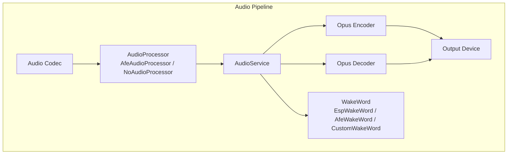
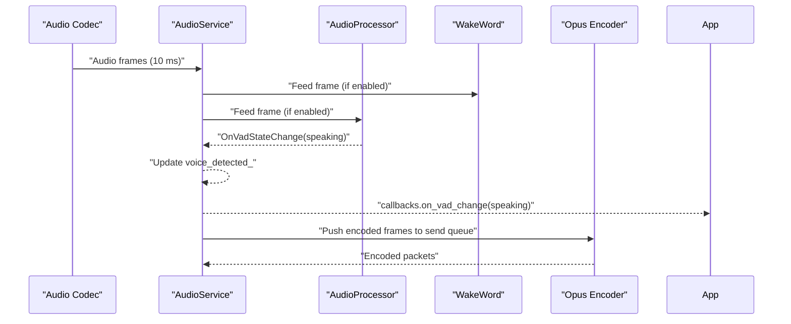
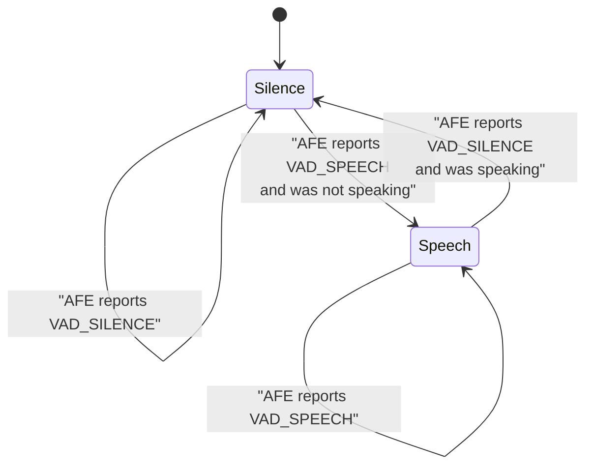
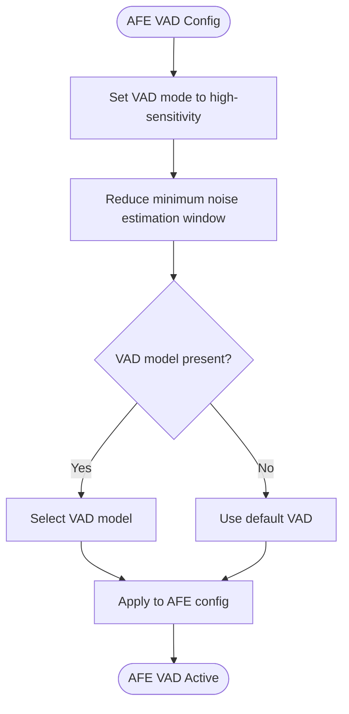
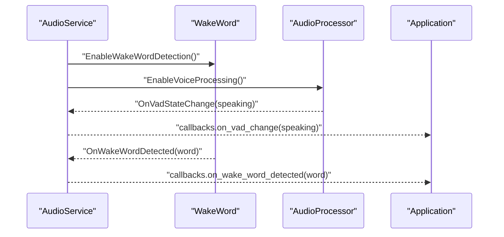
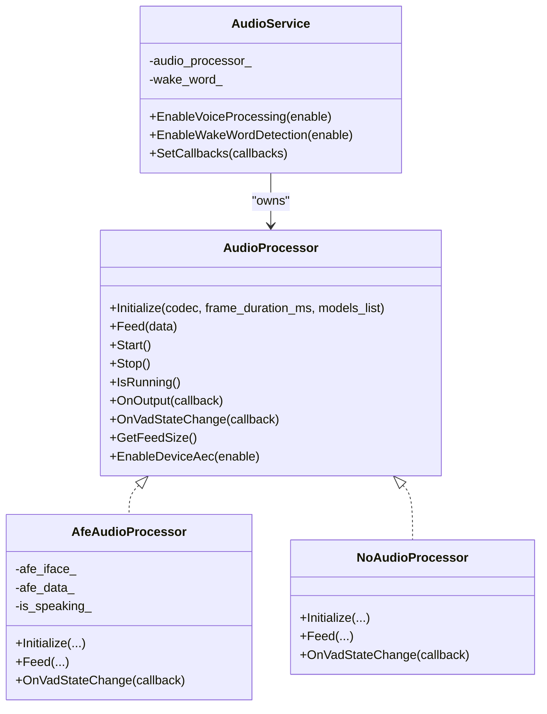
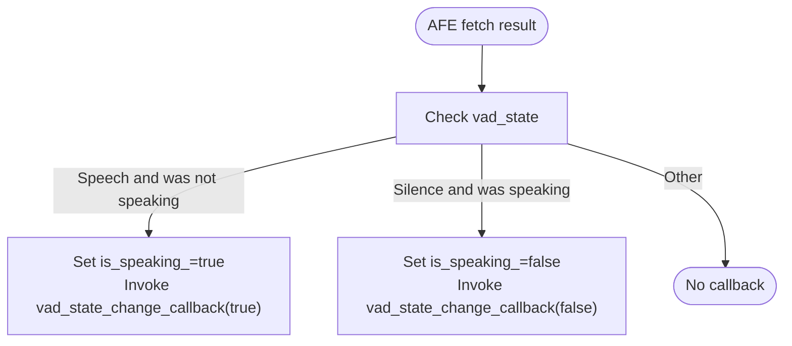

# Voice Activity Detection (VAD)

<cite>
**Referenced Files in This Document**
- [audio_processor.h](file://main/audio/audio_processor.h)
- [afe_audio_processor.h](file://main/audio/processors/afe_audio_processor.h)
- [afe_audio_processor.cc](file://main/audio/processors/afe_audio_processor.cc)
- [no_audio_processor.h](file://main/audio/processors/no_audio_processor.h)
- [no_audio_processor.cc](file://main/audio/processors/no_audio_processor.cc)
- [audio_service.h](file://main/audio/audio_service.h)
- [audio_service.cc](file://main/audio/audio_service.cc)
- [esp_wake_word.h](file://main/audio/wake_words/esp_wake_word.h)
- [esp_wake_word.cc](file://main/audio/wake_words/esp_wake_word.cc)
- [afe_wake_word.h](file://main/audio/wake_words/afe_wake_word.h)
- [afe_wake_word.cc](file://main/audio/wake_words/afe_wake_word.cc)
- [custom_wake_word.h](file://main/audio/wake_words/custom_wake_word.h)
- [custom_wake_word.cc](file://main/audio/wake_words/custom_wake_word.cc)
- [audio_debugger.h](file://main/audio/processors/audio_debugger.h)
- [audio_debugger.cc](file://main/audio/processors/audio_debugger.cc)
- [test_hw.c](file://test_firmware/main/test_hw.c)
</cite>

## Table of Contents
1. [Introduction](#introduction)
2. [Project Structure](#project-structure)
3. [Core Components](#core-components)
4. [Architecture Overview](#architecture-overview)
5. [Detailed Component Analysis](#detailed-component-analysis)
6. [Dependency Analysis](#dependency-analysis)
7. [Performance Considerations](#performance-considerations)
8. [Troubleshooting Guide](#troubleshooting-guide)
9. [Conclusion](#conclusion)
10. [Appendices](#appendices)

## Introduction
This document describes the Voice Activity Detection (VAD) system in the project, focusing on how speech/non-speech decisions are made, how the VAD state machine operates, and how VAD integrates with wake word detection and the broader audio processing pipeline. It also covers sensitivity tuning, false alarm reduction, adaptation to varying SNR conditions, callback mechanisms, configuration parameters, performance optimization, and debugging techniques.

## Project Structure
The VAD implementation centers around the AudioService orchestration layer and the AudioProcessor abstraction. Two concrete implementations are provided:
- AFE-based AudioProcessor that leverages the ESP-SR AFE VAD engine for on-device speech detection.
- A dummy NoAudioProcessor used for environments without audio processing.

The wake word subsystem supports multiple backends:
- ESP-based wake word detection for legacy targets.
- AFE-based wake word detection for ESP32S3/P4.
- Custom multinet-based wake word detection with configurable commands.

**Diagram sources**
- [audio_service.cc:62-123](file://main/audio/audio_service.cc#L62-L123)
- [afe_audio_processor.cc:13-46](file://main/audio/processors/afe_audio_processor.cc#L13-L46)
- [no_audio_processor.cc:16-33](file://main/audio/processors/no_audio_processor.cc#L16-L33)
- [esp_wake_word.cc:17-45](file://main/audio/wake_words/esp_wake_word.cc#L17-L45)
- [afe_wake_word.cc:42-101](file://main/audio/wake_words/afe_wake_word.cc#L42-L101)
- [custom_wake_word.cc:85-129](file://main/audio/wake_words/custom_wake_word.cc#L85-L129)

**Section sources**
- [audio_service.cc:62-123](file://main/audio/audio_service.cc#L62-L123)
- [audio_processor.h:11-26](file://main/audio/audio_processor.h#L11-L26)

## Core Components
- AudioProcessor interface defines the contract for audio processing, including initialization, feeding frames, lifecycle control, output callback, VAD state change callback, and feed size reporting.
- AfeAudioProcessor implements on-device VAD via ESP-SR AFE, exposing VAD events to higher layers.
- NoAudioProcessor provides a null implementation for environments without audio processing.
- AudioService orchestrates the audio pipeline, wires VAD callbacks to application callbacks, and coordinates wake word and voice processing modes.
- WakeWord implementations provide wake word detection and optional voice segment capture for subsequent recognition.

Key responsibilities:
- VAD decision-making and state transitions (speech/silence).
- Integration with wake word detection and audio processing pipeline triggers.
- Sensitivity tuning and thresholds via AFE configuration.
- Callback propagation for downstream audio workflows.

**Section sources**
- [audio_processor.h:11-26](file://main/audio/audio_processor.h#L11-L26)
- [afe_audio_processor.cc:13-46](file://main/audio/processors/afe_audio_processor.cc#L13-L46)
- [afe_audio_processor.cc:145-176](file://main/audio/processors/afe_audio_processor.cc#L145-L176)
- [audio_service.cc:101-110](file://main/audio/audio_service.cc#L101-L110)
- [esp_wake_word.cc:62-96](file://main/audio/wake_words/esp_wake_word.cc#L62-L96)
- [afe_wake_word.cc:121-172](file://main/audio/wake_words/afe_wake_word.cc#L121-L172)
- [custom_wake_word.cc:146-200](file://main/audio/wake_words/custom_wake_word.cc#L146-L200)

## Architecture Overview
The VAD system participates in two concurrent audio streams:
- Wake Word stream: periodic 10 ms frames are fed to wake word detectors.
- Voice Processing stream: periodic frames are fed to the AudioProcessor for VAD and downstream processing.

AudioService manages:
- Initialization of encoder/decoder and resamplers.
- Event-driven tasks for input, encoding/decoding, and output.
- VAD state propagation to application callbacks.
- Conditional enabling/disabling of wake word and voice processing.

**Diagram sources**
- [audio_service.cc:301-314](file://main/audio/audio_service.cc#L301-L314)
- [audio_service.cc:101-110](file://main/audio/audio_service.cc#L101-L110)
- [afe_audio_processor.cc:165-176](file://main/audio/processors/afe_audio_processor.cc#L165-L176)

## Detailed Component Analysis

### VAD State Machine and Decision Logic
The VAD state machine resides in the AFE-based AudioProcessor. It monitors the VAD state returned by the AFE engine and raises callbacks only on transitions:
- Transition from silence to speech triggers a positive VAD event.
- Transition from speech to silence triggers a negative VAD event.

These callbacks update the shared voice_detected_ flag and propagate to application callbacks.

**Diagram sources**
- [afe_audio_processor.cc:165-176](file://main/audio/processors/afe_audio_processor.cc#L165-L176)
- [audio_service.cc:105-110](file://main/audio/audio_service.cc#L105-L110)

**Section sources**
- [afe_audio_processor.cc:165-176](file://main/audio/processors/afe_audio_processor.cc#L165-L176)
- [audio_service.cc:105-110](file://main/audio/audio_service.cc#L105-L110)

### Energy-Based Detection and Spectral Features
The AFE-based VAD uses on-device models and modes tuned for performance. The configuration sets:
- VAD mode to a high-sensitivity variant.
- Minimum noise estimation window to accelerate silence-to-speech transitions.
- Optional VAD model selection via model lists.

While the internal algorithm is proprietary to the ESP-SR AFE, the configuration parameters influence detection sensitivity and speed.

**Diagram sources**
- [afe_audio_processor.cc:40-46](file://main/audio/processors/afe_audio_processor.cc#L40-L46)

**Section sources**
- [afe_audio_processor.cc:40-46](file://main/audio/processors/afe_audio_processor.cc#L40-L46)

### Decision Threshold Algorithms and Sensitivity Tuning
Sensitivity is primarily controlled via:
- VAD mode selection.
- Minimum noise estimation window.
- Optional VAD model selection.

These parameters are set during AudioProcessor initialization and influence the responsiveness and robustness of VAD decisions.

Practical tuning tips:
- Increase sensitivity by selecting a higher-sensitivity VAD mode and reducing the minimum noise window.
- Use a dedicated VAD model when available to improve accuracy in noisy environments.

**Section sources**
- [afe_audio_processor.cc:40-46](file://main/audio/processors/afe_audio_processor.cc#L40-L46)

### False Alarm Reduction Techniques
Recommended strategies grounded in the codebase:
- Prefer AFE-based VAD with appropriate model selection to reduce false positives.
- Use wake word detection to gate downstream processing; only start voice processing after a wake word is confirmed.
- Leverage silence suppression by disabling voice processing when VAD indicates silence.

Integration points:
- AudioService enables/disables voice processing based on VAD state and wake word state.
- Wake word backends stop feeding data upon detection, preventing unnecessary processing.

**Section sources**
- [audio_service.cc:582-637](file://main/audio/audio_service.cc#L582-L637)
- [esp_wake_word.cc:82-95](file://main/audio/wake_words/esp_wake_word.cc#L82-L95)
- [afe_wake_word.cc:163-170](file://main/audio/wake_words/afe_wake_word.cc#L163-L170)
- [custom_wake_word.cc:173-189](file://main/audio/wake_words/custom_wake_word.cc#L173-L189)

### Adaptation to Varying SNR Conditions
The test firmware demonstrates SNR measurement and AGC comparisons for microphone quality assessment. While not part of the VAD core, it highlights the importance of SNR-aware tuning and AGC behavior.

Recommendations:
- Measure baseline SNR and adjust VAD thresholds accordingly.
- Consider enabling AGC where appropriate to stabilize input levels.
- Use AFE VAD models trained for the target SNR range.

**Section sources**
- [test_hw.c:416-434](file://test_firmware/main/test_hw.c#L416-L434)
- [test_hw.c:446-448](file://test_firmware/main/test_hw.c#L446-L448)
- [test_hw.c:552-567](file://test_firmware/main/test_hw.c#L552-L567)

### Integration with Wake Word Detection and Audio Processing Pipeline Triggers
AudioService coordinates wake word and voice processing:
- Enables wake word detection and resets resamplers to prevent buffer overflow when switching modes.
- Enables voice processing and starts the AudioProcessor task.
- Propagates VAD state changes to application callbacks for triggering downstream actions.

**Diagram sources**
- [audio_service.cc:582-637](file://main/audio/audio_service.cc#L582-L637)
- [audio_service.cc:101-110](file://main/audio/audio_service.cc#L101-L110)
- [audio_service.cc:750-754](file://main/audio/audio_service.cc#L750-L754)

**Section sources**
- [audio_service.cc:582-637](file://main/audio/audio_service.cc#L582-L637)
- [audio_service.cc:730-756](file://main/audio/audio_service.cc#L730-L756)

### Callback Mechanism for VAD State Changes
The AudioProcessor exposes a VAD state change callback. AudioService subscribes to it and:
- Updates the internal voice_detected_ flag.
- Invokes the application callback on_vad_change(speaking).

This allows downstream components to react to speech/silence transitions (e.g., starting/stopping recording, enabling echo cancellation, etc.).

**Section sources**
- [audio_processor.h:21](file://main/audio/audio_processor.h#L21)
- [afe_audio_processor.cc:141-143](file://main/audio/processors/afe_audio_processor.cc#L141-L143)
- [audio_service.cc:105-110](file://main/audio/audio_service.cc#L105-L110)

### Configuration Parameters for Different Usage Scenarios
- VAD mode: Select a high-sensitivity mode for low SNR or noisy environments.
- Minimum noise estimation window: Reduce to accelerate onset detection.
- VAD model selection: Choose a model tailored to the deployment scenario.
- Frame duration: AudioService feeds 10 ms frames by default; adjust if needed for latency or throughput trade-offs.

**Section sources**
- [afe_audio_processor.cc:40-46](file://main/audio/processors/afe_audio_processor.cc#L40-L46)
- [audio_service.cc:303-312](file://main/audio/audio_service.cc#L303-L312)

## Dependency Analysis
The VAD system depends on:
- AudioProcessor abstraction and its implementations.
- ESP-SR AFE for on-device VAD.
- AudioService for orchestration and callback propagation.
- WakeWord backends for gating and voice segment capture.

**Diagram sources**
- [audio_processor.h:11-26](file://main/audio/audio_processor.h#L11-L26)
- [afe_audio_processor.h:18-31](file://main/audio/processors/afe_audio_processor.h#L18-L31)
- [no_audio_processor.h:11-24](file://main/audio/processors/no_audio_processor.h#L11-L24)
- [audio_service.h:141-142](file://main/audio/audio_service.h#L141-L142)

**Section sources**
- [audio_processor.h:11-26](file://main/audio/audio_processor.h#L11-L26)
- [afe_audio_processor.h:18-31](file://main/audio/processors/afe_audio_processor.h#L18-L31)
- [no_audio_processor.h:11-24](file://main/audio/processors/no_audio_processor.h#L11-L24)
- [audio_service.h:141-142](file://main/audio/audio_service.h#L141-L142)

## Performance Considerations
- Use PSRAM-backed static task stacks for audio tasks to reduce heap pressure.
- Prefer AFE-based VAD for on-device inference to minimize CPU overhead.
- Tune frame durations and feed sizes to balance latency and throughput.
- Reset resamplers when switching between wake word and voice processing modes to avoid buffer overflow and artifacts.
- Keep VAD model selection aligned with deployment SNR to reduce rework and false alarms.

[No sources needed since this section provides general guidance]

## Troubleshooting Guide
- Verify VAD callbacks: Ensure OnVadStateChange is wired and that AudioService updates voice_detected_.
- Check AFE configuration: Confirm VAD mode and minimum noise window are set appropriately.
- Validate wake word gating: Ensure wake word detection completes before enabling voice processing.
- Debug audio path: Use AudioDebugger to stream raw audio data for offline analysis when enabled.
- SNR assessment: Use test firmware routines to measure noise floor and SNR for tuning.

**Section sources**
- [audio_service.cc:105-110](file://main/audio/audio_service.cc#L105-L110)
- [afe_audio_processor.cc:40-46](file://main/audio/processors/afe_audio_processor.cc#L40-L46)
- [audio_debugger.cc:54-66](file://main/audio/processors/audio_debugger.cc#L54-L66)
- [test_hw.c:416-434](file://test_firmware/main/test_hw.c#L416-L434)

## Conclusion
The VAD system integrates tightly with the audio pipeline and wake word detection. By leveraging AFE-based VAD with tunable sensitivity parameters, gating via wake word detection, and robust callback propagation, the system achieves responsive and reliable speech activity detection suitable for real-time applications.

[No sources needed since this section summarizes without analyzing specific files]

## Appendices

### Appendix A: VAD State Machine Flow

**Diagram sources**
- [afe_audio_processor.cc:165-176](file://main/audio/processors/afe_audio_processor.cc#L165-L176)