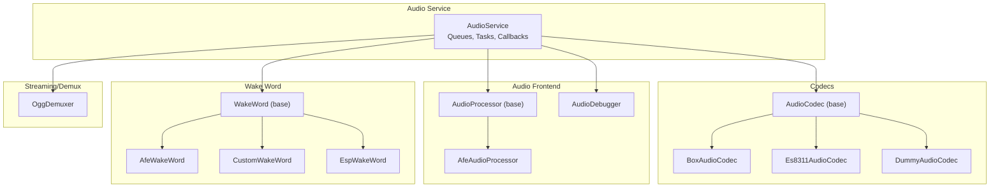
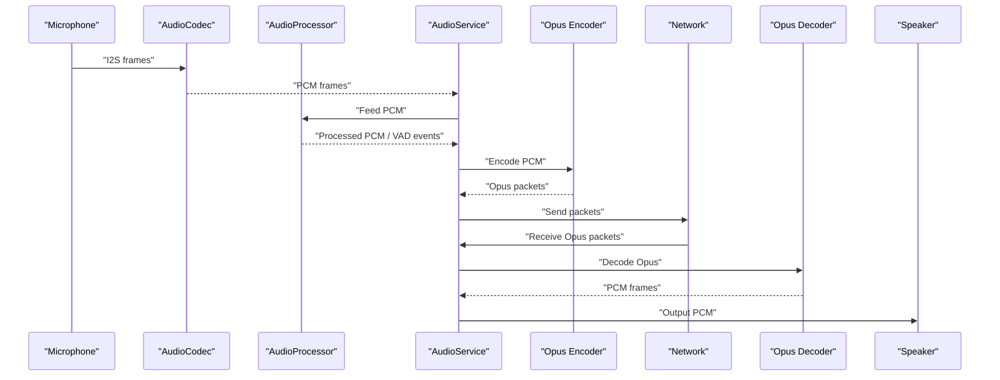
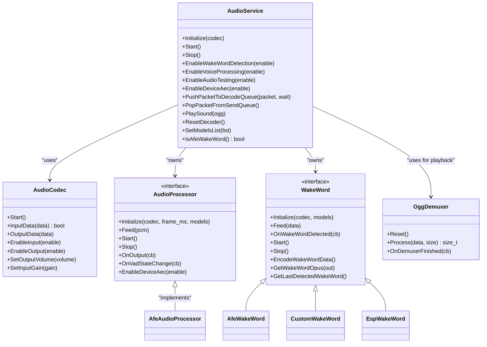
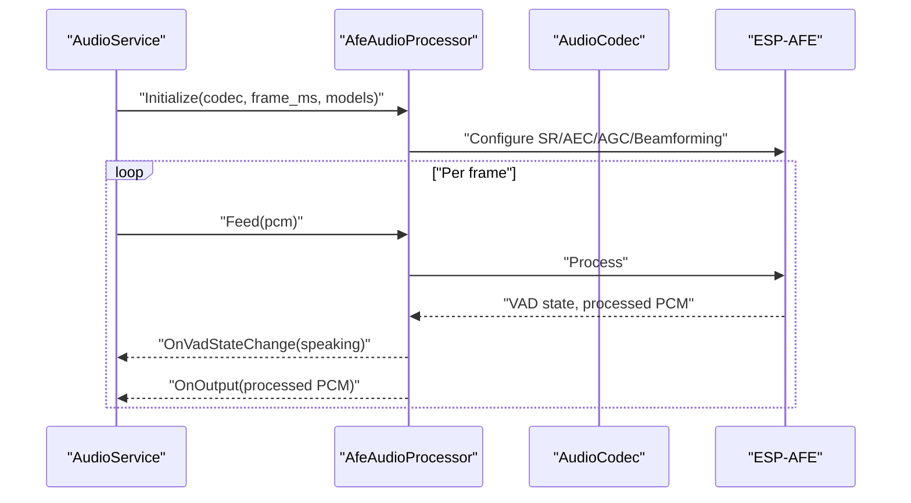
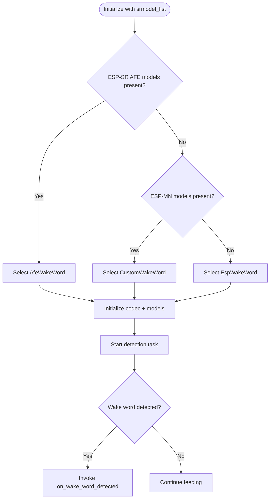
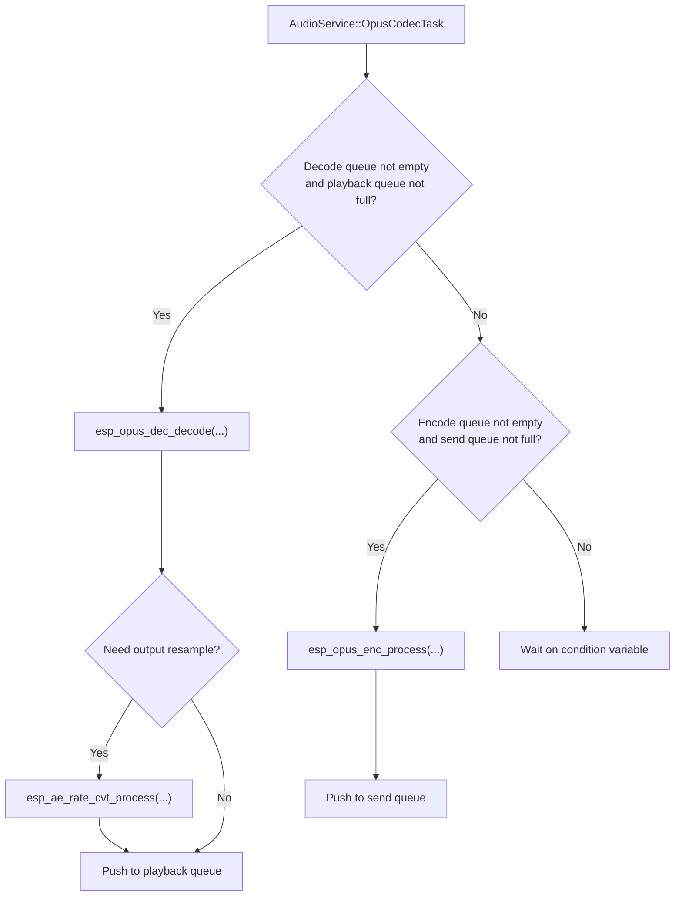
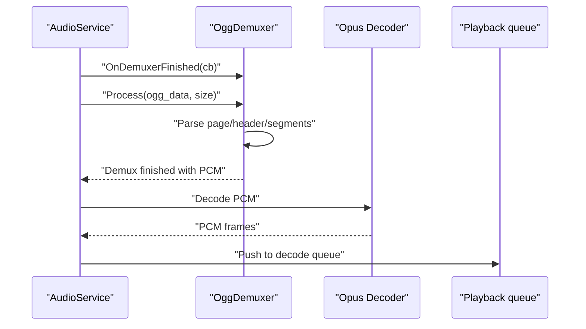
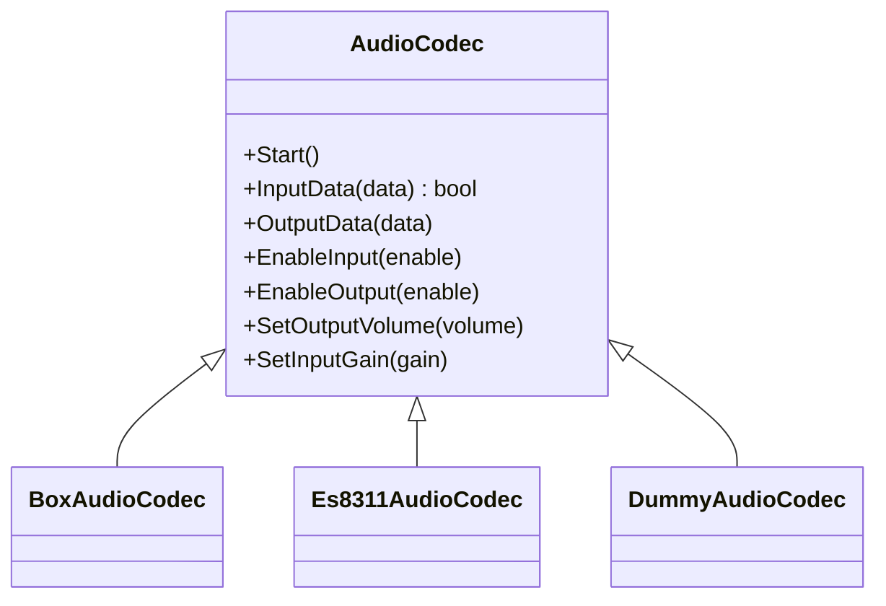
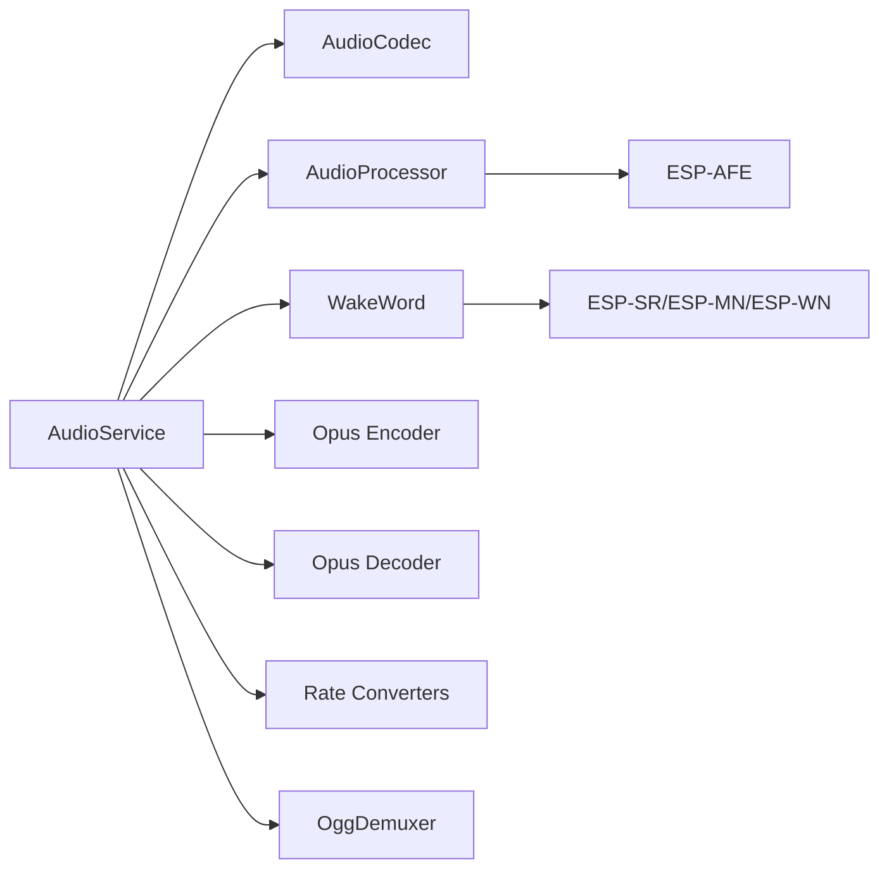

# Audio Processing System

<cite>
**Referenced Files in This Document**
- [audio_service.h](file://main/audio/audio_service.h)
- [audio_service.cc](file://main/audio/audio_service.cc)
- [audio_codec.h](file://main/audio/audio_codec.h)
- [audio_codec.cc](file://main/audio/audio_codec.cc)
- [audio_processor.h](file://main/audio/audio_processor.h)
- [afe_audio_processor.h](file://main/audio/processors/afe_audio_processor.h)
- [audio_debugger.h](file://main/audio/processors/audio_debugger.h)
- [wake_word.h](file://main/audio/wake_word.h)
- [afe_wake_word.h](file://main/audio/wake_words/afe_wake_word.h)
- [custom_wake_word.h](file://main/audio/wake_words/custom_wake_word.h)
- [esp_wake_word.h](file://main/audio/wake_words/esp_wake_word.h)
- [ogg_demuxer.h](file://main/audio/demuxer/ogg_demuxer.h)
- [box_audio_codec.h](file://main/audio/codecs/box_audio_codec.h)
- [es8311_audio_codec.h](file://main/audio/codecs/es8311_audio_codec.h)
- [dummy_audio_codec.h](file://main/audio/codecs/dummy_audio_codec.h)
</cite>

## Table of Contents
1. [Introduction](#introduction)
2. [Project Structure](#project-structure)
3. [Core Components](#core-components)
4. [Architecture Overview](#architecture-overview)
5. [Detailed Component Analysis](#detailed-component-analysis)
6. [Dependency Analysis](#dependency-analysis)
7. [Performance Considerations](#performance-considerations)
8. [Troubleshooting Guide](#troubleshooting-guide)
9. [Conclusion](#conclusion)
10. [Appendices](#appendices)

## Introduction
This document describes the audio processing system designed for real-time voice interaction. It covers the audio service architecture that integrates wake word detection, voice activity detection (VAD), audio stream processing, Opus encoding/decoding, optional device-side AEC, and OGG demuxing for playback. It also documents the audio frontend pipeline (automatic gain control, beamforming, and environmental noise adaptation), latency optimization strategies, buffer management, and configuration guidance for different environments.

## Project Structure
The audio subsystem is organized around a central service orchestrating tasks, codecs, processors, and wake word engines. Key areas:
- Audio service: orchestration, queues, tasks, and codec integration
- Audio codecs: hardware abstraction for I2S/codec devices
- Audio processors: VAD and optional AEC/Auto Gain Control/Beamforming
- Wake word engines: ESP-SR AFE-based, custom multinet-based, and legacy ESP-WN
- Demuxer: OGG/Opus demuxing for playback
- Audio debugger: optional UDP-based live audio monitoring

**Diagram sources**
- [audio_service.h:106-204](file://main/audio/audio_service.h#L106-L204)
- [audio_service.cc:62-123](file://main/audio/audio_service.cc#L62-L123)
- [audio_codec.h:17-59](file://main/audio/audio_codec.h#L17-L59)
- [box_audio_codec.h:11-38](file://main/audio/codecs/box_audio_codec.h#L11-L38)
- [es8311_audio_codec.h:13-40](file://main/audio/codecs/es8311_audio_codec.h#L13-L40)
- [dummy_audio_codec.h:6-14](file://main/audio/codecs/dummy_audio_codec.h#L6-L14)
- [audio_processor.h:11-24](file://main/audio/audio_processor.h#L11-L24)
- [afe_audio_processor.h:18-51](file://main/audio/processors/afe_audio_processor.h#L18-L51)
- [audio_debugger.h:10-21](file://main/audio/processors/audio_debugger.h#L10-L21)
- [wake_word.h:11-24](file://main/audio/wake_word.h#L11-L24)
- [afe_wake_word.h:23-65](file://main/audio/wake_words/afe_wake_word.h#L23-L65)
- [custom_wake_word.h:20-69](file://main/audio/wake_words/custom_wake_word.h#L20-L69)
- [esp_wake_word.h:17-43](file://main/audio/wake_words/esp_wake_word.h#L17-L43)
- [ogg_demuxer.h:9-61](file://main/audio/demuxer/ogg_demuxer.h#L9-L61)

**Section sources**
- [audio_service.h:29-38](file://main/audio/audio_service.h#L29-L38)
- [audio_service.cc:125-200](file://main/audio/audio_service.cc#L125-L200)

## Core Components
- AudioService: Central coordinator managing input/output tasks, Opus encode/decode tasks, queues, and lifecycle. Provides callbacks for wake word detection, VAD state, and send queue availability. Integrates rate conversion and optional device AEC.
- AudioCodec family: Base interface for I2S/codec devices; concrete implementations for specific hardware (e.g., ES8311, BOX variant).
- AudioProcessor: Base interface for audio front-end processing (VAD, AGC, beamforming, AEC).
- AfeAudioProcessor: Implements VAD and optionally device-side AEC via ESP-AFE integration.
- WakeWord family: Base interface plus three implementations:
  - AfeWakeWord: ESP-SR AFE-based wake word engine
  - CustomWakeWord: Multinet-based custom wake words
  - EspWakeWord: Legacy ESP-WN wake word engine
- OggDemuxer: Streaming demuxer for OGG/Opus content to extract PCM for playback.
- AudioDebugger: Optional UDP sink for live audio debugging.

**Section sources**
- [audio_service.h:106-204](file://main/audio/audio_service.h#L106-L204)
- [audio_service.cc:62-123](file://main/audio/audio_service.cc#L62-L123)
- [audio_codec.h:17-59](file://main/audio/audio_codec.h#L17-L59)
- [audio_processor.h:11-24](file://main/audio/audio_processor.h#L11-L24)
- [afe_audio_processor.h:18-51](file://main/audio/processors/afe_audio_processor.h#L18-L51)
- [wake_word.h:11-24](file://main/audio/wake_word.h#L11-L24)
- [afe_wake_word.h:23-65](file://main/audio/wake_words/afe_wake_word.h#L23-L65)
- [custom_wake_word.h:20-69](file://main/audio/wake_words/custom_wake_word.h#L20-L69)
- [esp_wake_word.h:17-43](file://main/audio/wake_words/esp_wake_word.h#L17-L43)
- [ogg_demuxer.h:9-61](file://main/audio/demuxer/ogg_demuxer.h#L9-L61)
- [audio_debugger.h:10-21](file://main/audio/processors/audio_debugger.h#L10-L21)

## Architecture Overview
The system operates with two primary data flows:
- Capture path: Microphone -> AudioProcessor/VAD -> Encode queue -> Opus encoder -> Send queue -> network/server
- Playback path: Server -> Decode queue -> Opus decoder -> Playback queue -> Speaker

Tasks and queues:
- Audio input task: reads frames, optionally feeds wake word and audio processor
- Opus codec task: encodes/decodes frames, manages queues and resamplers
- Audio output task: plays decoded PCM frames, records timestamps for server AEC

**Diagram sources**
- [audio_service.cc:263-321](file://main/audio/audio_service.cc#L263-L321)
- [audio_service.cc:360-479](file://main/audio/audio_service.cc#L360-L479)
- [audio_service.cc:323-358](file://main/audio/audio_service.cc#L323-L358)

## Detailed Component Analysis

### AudioService Orchestration
Key responsibilities:
- Initialize codec, Opus encoder/decoder, rate converters, and audio processor
- Manage three tasks: input, output, and codec
- Coordinate queues for encode/decode/playback/testing
- Provide runtime controls: wake word detection, voice processing, audio testing, device AEC
- Handle power-aware input/output gating with timers
- Support OGG playback via demuxer

**Diagram sources**
- [audio_service.h:106-204](file://main/audio/audio_service.h#L106-L204)
- [audio_codec.h:17-59](file://main/audio/audio_codec.h#L17-L59)
- [audio_processor.h:11-24](file://main/audio/audio_processor.h#L11-L24)
- [afe_audio_processor.h:18-51](file://main/audio/processors/afe_audio_processor.h#L18-L51)
- [wake_word.h:11-24](file://main/audio/wake_word.h#L11-L24)
- [afe_wake_word.h:23-65](file://main/audio/wake_words/afe_wake_word.h#L23-L65)
- [custom_wake_word.h:20-69](file://main/audio/wake_words/custom_wake_word.h#L20-L69)
- [esp_wake_word.h:17-43](file://main/audio/wake_words/esp_wake_word.h#L17-L43)
- [ogg_demuxer.h:9-61](file://main/audio/demuxer/ogg_demuxer.h#L9-L61)

**Section sources**
- [audio_service.cc:62-123](file://main/audio/audio_service.cc#L62-L123)
- [audio_service.cc:125-200](file://main/audio/audio_service.cc#L125-L200)
- [audio_service.cc:263-321](file://main/audio/audio_service.cc#L263-L321)
- [audio_service.cc:323-358](file://main/audio/audio_service.cc#L323-L358)
- [audio_service.cc:360-479](file://main/audio/audio_service.cc#L360-L479)
- [audio_service.cc:686-687](file://main/audio/audio_service.cc#L686-L687)

### Audio Frontend Processing (VAD, AGC, Beamforming, AEC)
- AfeAudioProcessor integrates ESP-AFE SR interfaces to provide:
  - Voice Activity Detection (VAD) state transitions
  - Optional device-side AEC
  - Automatic gain control and beamforming via ESP-AFE pipelines
- AudioService wires VAD callbacks to propagate speech state to callers.

**Diagram sources**
- [audio_service.cc:612-637](file://main/audio/audio_service.cc#L612-L637)
- [afe_audio_processor.h:18-51](file://main/audio/processors/afe_audio_processor.h#L18-L51)

**Section sources**
- [audio_service.cc:101-110](file://main/audio/audio_service.cc#L101-L110)
- [afe_audio_processor.h:18-51](file://main/audio/processors/afe_audio_processor.h#L18-L51)

### Wake Word Detection
- Model selection is automatic based on the provided model list:
  - ESP-SR AFE-based wake word (AFE_WN)
  - Custom multinet-based wake words (ESP-MN)
  - Legacy ESP-WN (ESP_WN)
- AfeWakeWord and CustomWakeWord maintain internal PCM/Opus buffers for wake word clips and support encoding captured wake word audio.

**Diagram sources**
- [audio_service.cc:730-756](file://main/audio/audio_service.cc#L730-L756)
- [afe_wake_word.h:23-65](file://main/audio/wake_words/afe_wake_word.h#L23-L65)
- [custom_wake_word.h:20-69](file://main/audio/wake_words/custom_wake_word.h#L20-L69)
- [esp_wake_word.h:17-43](file://main/audio/wake_words/esp_wake_word.h#L17-L43)

**Section sources**
- [audio_service.cc:582-610](file://main/audio/audio_service.cc#L582-L610)
- [audio_service.cc:730-756](file://main/audio/audio_service.cc#L730-L756)
- [afe_wake_word.h:23-65](file://main/audio/wake_words/afe_wake_word.h#L23-L65)
- [custom_wake_word.h:20-69](file://main/audio/wake_words/custom_wake_word.h#L20-L69)
- [esp_wake_word.h:17-43](file://main/audio/wake_words/esp_wake_word.h#L17-L43)

### Opus Encoding/Decoding and Rate Conversion
- Encoder configuration targets 16 kHz, mono, Opus audio application mode, adaptive bitrate, DTX enabled, VBR enabled, and configurable frame durations mapped to ESP_OPUS constants.
- Decoder supports dynamic sample rate/frame duration updates; a dedicated resampler is created when decoder output differs from codec output sample rate.
- AudioService maintains separate queues for encode/decode/playback/testing with bounded capacities to prevent latency spikes.

**Diagram sources**
- [audio_service.cc:360-479](file://main/audio/audio_service.cc#L360-L479)
- [audio_service.h:66-77](file://main/audio/audio_service.h#L66-L77)
- [audio_service.h:16-23](file://main/audio/audio_service.h#L16-L23)

**Section sources**
- [audio_service.h:66-77](file://main/audio/audio_service.h#L66-L77)
- [audio_service.cc:481-515](file://main/audio/audio_service.cc#L481-L515)
- [audio_service.cc:360-479](file://main/audio/audio_service.cc#L360-L479)

### OGG Demuxer for Playback
- Streaming demuxer parses OGG pages, tracks Opus headers/tags, and forwards extracted PCM to AudioService for decoding and playback.
- Provides a callback invoked when demuxing completes, enabling immediate playback scheduling.

**Diagram sources**
- [audio_service.cc:666-687](file://main/audio/audio_service.cc#L666-L687)
- [ogg_demuxer.h:9-61](file://main/audio/demuxer/ogg_demuxer.h#L9-L61)

**Section sources**
- [audio_service.cc:666-687](file://main/audio/audio_service.cc#L666-L687)
- [ogg_demuxer.h:9-61](file://main/audio/demuxer/ogg_demuxer.h#L9-L61)

### Audio Codec Abstractions
- AudioCodec defines the base interface for input/output, enabling volume/gain control and enabling/disabling input/output.
- Concrete implementations:
  - BoxAudioCodec: uses ESP-CODEC-DEV for duplex I2S channels and PA control
  - Es8311AudioCodec: I2C-controlled codec with PA pin and inversion option
  - DummyAudioCodec: stub for testing without hardware

**Diagram sources**
- [audio_codec.h:17-59](file://main/audio/audio_codec.h#L17-L59)
- [box_audio_codec.h:11-38](file://main/audio/codecs/box_audio_codec.h#L11-L38)
- [es8311_audio_codec.h:13-40](file://main/audio/codecs/es8311_audio_codec.h#L13-L40)
- [dummy_audio_codec.h:6-14](file://main/audio/codecs/dummy_audio_codec.h#L6-L14)

**Section sources**
- [audio_codec.h:17-59](file://main/audio/audio_codec.h#L17-L59)
- [audio_codec.cc:29-67](file://main/audio/audio_codec.cc#L29-L67)
- [box_audio_codec.h:11-38](file://main/audio/codecs/box_audio_codec.h#L11-L38)
- [es8311_audio_codec.h:13-40](file://main/audio/codecs/es8311_audio_codec.h#L13-L40)
- [dummy_audio_codec.h:6-14](file://main/audio/codecs/dummy_audio_codec.h#L6-L14)

### Audio Debugger
- Optional UDP sink for live audio monitoring during development and diagnostics.

**Section sources**
- [audio_debugger.h:10-21](file://main/audio/processors/audio_debugger.h#L10-L21)

## Dependency Analysis
High-level dependencies:
- AudioService depends on AudioCodec, AudioProcessor, WakeWord, Opus encoder/decoder, and rate converters
- WakeWord implementations depend on ESP-SR/ESP-MN/ESP-WN APIs and model lists
- AfeAudioProcessor depends on ESP-AFE SR interfaces for VAD/AEC/AGC/beamforming
- OggDemuxer is self-contained and used by AudioService for playback

**Diagram sources**
- [audio_service.h:140-149](file://main/audio/audio_service.h#L140-L149)
- [audio_service.cc:62-123](file://main/audio/audio_service.cc#L62-L123)
- [afe_audio_processor.h:18-51](file://main/audio/processors/afe_audio_processor.h#L18-L51)
- [afe_wake_word.h:23-65](file://main/audio/wake_words/afe_wake_word.h#L23-L65)
- [custom_wake_word.h:20-69](file://main/audio/wake_words/custom_wake_word.h#L20-L69)
- [esp_wake_word.h:17-43](file://main/audio/wake_words/esp_wake_word.h#L17-L43)
- [ogg_demuxer.h:9-61](file://main/audio/demuxer/ogg_demuxer.h#L9-L61)

**Section sources**
- [audio_service.h:140-149](file://main/audio/audio_service.h#L140-L149)
- [audio_service.cc:62-123](file://main/audio/audio_service.cc#L62-L123)

## Performance Considerations
- Task stack allocation in PSRAM: AudioService allocates static stacks in PSRAM for input/output and codec tasks to reduce heap fragmentation and improve deterministic latency.
- Queue sizing and backpressure:
  - Encode/decode/send queues capped to avoid unbounded memory growth
  - Playback queue limits prevent stalls
  - Testing queue allows burst capture without impacting normal operation
- Latency targets:
  - Frame duration configured via macros; encoder/decoder frame sizes derived from sample rate and duration
  - Timestamp propagation enables server-side AEC alignment
- Power-aware gating:
  - Separate timers gate input/output after inactivity thresholds to save power
- Resampling:
  - Dynamic resampling for decoder output to match codec output sample rate when needed

Practical tuning tips:
- Reduce frame duration for lower latency at the cost of higher CPU; adjust macro values accordingly
- Increase queue sizes only if memory permits and network conditions require burst tolerance
- Prefer device AEC when available to reduce CPU load on server-side AEC
- Calibrate input gain and output volume via codec setters to maximize SNR without clipping

**Section sources**
- [audio_service.h:40-46](file://main/audio/audio_service.h#L40-L46)
- [audio_service.h:164-175](file://main/audio/audio_service.h#L164-L175)
- [audio_service.cc:131-185](file://main/audio/audio_service.cc#L131-L185)
- [audio_service.cc:360-479](file://main/audio/audio_service.cc#L360-L479)
- [audio_service.cc:715-728](file://main/audio/audio_service.cc#L715-L728)

## Troubleshooting Guide
Common issues and remedies:
- No audio input:
  - Verify codec input is enabled and sample rates/channels match expectations
  - Check rate converter initialization when input differs from 16 kHz
- No audio output:
  - Ensure output is enabled and volume is set appropriately
  - Confirm playback queue is being drained by the output task
- Wake word not detected:
  - Confirm model list contains appropriate wake word models
  - Ensure wake word task is started and initialized
  - Check input gain and environment noise levels
- OGG playback fails:
  - Validate OGG content and Opus headers
  - Ensure demuxer finished callback is registered before playback
- Latency spikes:
  - Inspect queue depths and adjust queue limits or frame duration
  - Monitor power timer behavior and ensure input/output gates are not prematurely disabling I/O

Operational hooks:
- AudioService callbacks for wake word detection and VAD state changes
- AudioDebugger UDP sink for live inspection
- ResetDecoder to clear stale state and queues

**Section sources**
- [audio_service.cc:217-261](file://main/audio/audio_service.cc#L217-L261)
- [audio_service.cc:323-358](file://main/audio/audio_service.cc#L323-L358)
- [audio_service.cc:582-610](file://main/audio/audio_service.cc#L582-L610)
- [audio_service.cc:666-687](file://main/audio/audio_service.cc#L666-L687)
- [audio_service.cc:701-713](file://main/audio/audio_service.cc#L701-L713)
- [audio_debugger.h:10-21](file://main/audio/processors/audio_debugger.h#L10-L21)

## Conclusion
The audio processing system provides a robust, modular foundation for real-time voice interaction. It cleanly separates concerns among codec abstraction, audio front-end processing, wake word detection, streaming, and playback. With configurable latency, queue management, and power-aware operation, it is suitable for battery-powered devices and diverse acoustic environments. The design supports both device-side AEC and server-side AEC, enabling flexible deployment strategies.

## Appendices

### Configuration Examples and Environment Tuning
- Device AEC vs. server AEC:
  - Enable device AEC via AudioService to offload processing; otherwise rely on server-side AEC
- Input gain and output volume:
  - Adjust via codec setters; persisted in settings for continuity across boots
- Frame duration and bitrate:
  - Tune frame duration macro to balance latency and CPU; Opus VBR and DTX help adapt to speech activity
- Queue sizing:
  - Modify queue capacity macros to accommodate bursty networks or long wake word captures

**Section sources**
- [audio_service.cc:652-660](file://main/audio/audio_service.cc#L652-L660)
- [audio_codec.cc:40-67](file://main/audio/audio_codec.cc#L40-L67)
- [audio_service.h:40-46](file://main/audio/audio_service.h#L40-L46)
- [audio_service.h:66-77](file://main/audio/audio_service.h#L66-L77)