# Audio Service Core

<cite>
**Referenced Files in This Document**
- [audio_service.h](file://main/audio/audio_service.h)
- [audio_service.cc](file://main/audio/audio_service.cc)
- [audio_codec.h](file://main/audio/audio_codec.h)
- [audio_codec.cc](file://main/audio/audio_codec.cc)
- [audio_processor.h](file://main/audio/audio_processor.h)
- [wake_word.h](file://main/audio/wake_word.h)
- [afe_audio_processor.h](file://main/audio/processors/afe_audio_processor.h)
- [afe_wake_word.h](file://main/audio/wake_words/afe_wake_word.h)
- [es8388_audio_codec.h](file://main/audio/codecs/es8388_audio_codec.h)
- [es8389_audio_codec.h](file://main/audio/codecs/es8389_audio_codec.h)
- [ogg_demuxer.h](file://main/audio/demuxer/ogg_demuxer.h)
- [application.h](file://main/application.h)
- [application.cc](file://main/application.cc)
- [board.h](file://main/boards/common/board.h)
</cite>

## Table of Contents
1. [Introduction](#introduction)
2. [Project Structure](#project-structure)
3. [Core Components](#core-components)
4. [Architecture Overview](#architecture-overview)
5. [Detailed Component Analysis](#detailed-component-analysis)
6. [Dependency Analysis](#dependency-analysis)
7. [Performance Considerations](#performance-considerations)
8. [Troubleshooting Guide](#troubleshooting-guide)
9. [Conclusion](#conclusion)
10. [Appendices](#appendices)

## Introduction
This document provides comprehensive documentation for the AudioService core class that orchestrates the entire audio processing pipeline. It explains initialization of codec, Opus encoder/decoder, and resamplers; describes the three concurrent tasks (AudioInputTask, AudioOutputTask, OpusCodecTask); documents the event-driven architecture using FreeRTOS event groups; covers queue management for audio packets and timestamps; and details power management, idle detection, and resource cleanup. It also includes configuration examples and performance tuning guidelines tailored to different audio environments.

## Project Structure
The audio subsystem is organized around a central AudioService coordinator that manages:
- Codec abstraction and hardware I/O
- Audio processors (wake word detection and voice processing)
- Opus encoder/decoder and resampling
- Inter-task queues and synchronization primitives
- Power management and idle detection
- Integration with higher-level application state machine

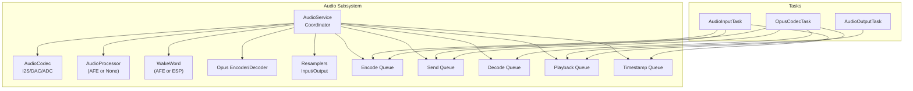

**Diagram sources**
- [audio_service.h:106-204](file://main/audio/audio_service.h#L106-L204)
- [audio_service.cc:62-123](file://main/audio/audio_service.cc#L62-L123)
- [audio_codec.h:17-62](file://main/audio/audio_codec.h#L17-L62)
- [audio_processor.h:11-27](file://main/audio/audio_processor.h#L11-L27)
- [wake_word.h:11-27](file://main/audio/wake_word.h#L11-L27)

**Section sources**
- [audio_service.h:1-204](file://main/audio/audio_service.h#L1-L204)
- [audio_service.cc:1-765](file://main/audio/audio_service.cc#L1-L765)

## Core Components
- AudioService: Central coordinator managing initialization, task orchestration, queues, event groups, and power management.
- AudioCodec: Hardware abstraction for I2S input/output and volume/gain controls.
- AudioProcessor: Voice processing pipeline (AFE-based or stub).
- WakeWord: Wake word detection (AFE-based or ESP-based).
- Opus Encoder/Decoder: ESP-ADF wrappers for audio compression and decompression.
- Resamplers: Rate conversion for input/output sample rates.
- Queues: Four primary queues for encode/send/decode/playback and a timestamp queue for server AEC.

Key responsibilities:
- Initialization: Start codec, configure Opus encoder/decoder, set up resamplers, create event group and timers.
- Concurrent tasks: Capture microphone, playback speakers, and perform Opus encode/decode.
- Event-driven coordination: FreeRTOS event groups for wake word, voice processing, and audio testing modes.
- Queue management: Producer/consumer queues with bounded capacity and condition variables.
- Power management: Idle detection and automatic codec power gating.
- Resource cleanup: Proper shutdown and FreeRTOS handle deletion.

**Section sources**
- [audio_service.h:106-204](file://main/audio/audio_service.h#L106-L204)
- [audio_service.cc:62-123](file://main/audio/audio_service.cc#L62-L123)
- [audio_codec.h:17-62](file://main/audio/audio_codec.h#L17-L62)

## Architecture Overview
The AudioService implements a producer-consumer pipeline with three tasks:
- AudioInputTask: Reads from codec, optionally feeds wake word and audio processor, and pushes tasks to the encode queue.
- OpusCodecTask: Encodes PCM to Opus packets (send queue) and decodes Opus packets to PCM (playback queue).
- AudioOutputTask: Pulls PCM from playback queue and writes to codec.

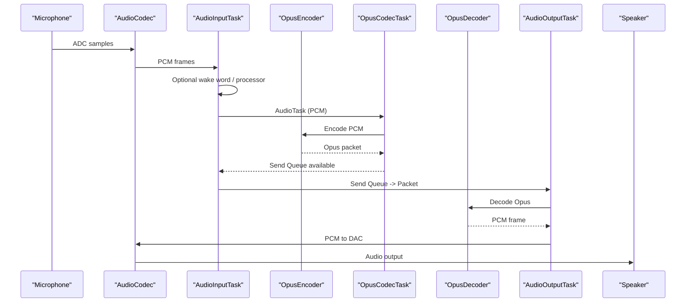

**Diagram sources**
- [audio_service.cc:263-321](file://main/audio/audio_service.cc#L263-L321)
- [audio_service.cc:360-479](file://main/audio/audio_service.cc#L360-L479)
- [audio_service.cc:323-358](file://main/audio/audio_service.cc#L323-L358)

## Detailed Component Analysis

### AudioService Initialization and Lifecycle
- Codec startup: The codec is started first; sample rates and channels are queried for downstream configuration.
- Opus configuration: Encoder and decoder are opened with fixed frame duration and VBR/DTX settings; frame size and output buffer sizes are computed.
- Resampler setup: Input resampler is created when codec input rate differs from encoder rate; output resampler is created when decoder rate differs from codec output rate.
- AudioProcessor and WakeWord: Processor output callback pushes PCM to encode queue; VAD state updates are propagated via callbacks.
- Power timer: A periodic timer checks idle periods and powers down codec input/output when inactive.

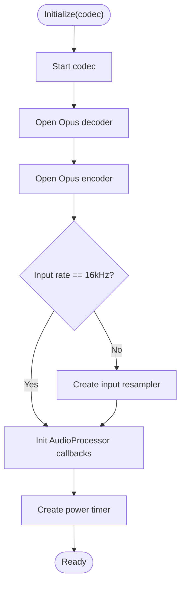

**Diagram sources**
- [audio_service.cc:62-123](file://main/audio/audio_service.cc#L62-L123)

**Section sources**
- [audio_service.cc:62-123](file://main/audio/audio_service.cc#L62-L123)
- [audio_service.h:138-204](file://main/audio/audio_service.h#L138-L204)

### AudioInputTask: Microphone Data Capture
- Waits on event group bits for audio testing, wake word, or voice processing modes.
- Reads PCM frames from codec; applies input resampler if needed.
- Feeds wake word and/or audio processor depending on active modes.
- For audio testing mode, converts stereo to mono and pushes to a dedicated testing queue.

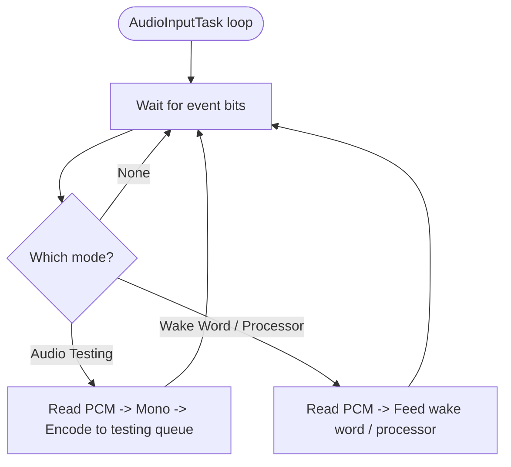

**Diagram sources**
- [audio_service.cc:263-321](file://main/audio/audio_service.cc#L263-L321)

**Section sources**
- [audio_service.cc:263-321](file://main/audio/audio_service.cc#L263-L321)

### AudioOutputTask: Speaker Playback
- Waits on playback queue availability.
- Enables codec output if needed and writes PCM frames to codec.
- Updates last output time for power management.
- Records timestamps for server AEC when available.

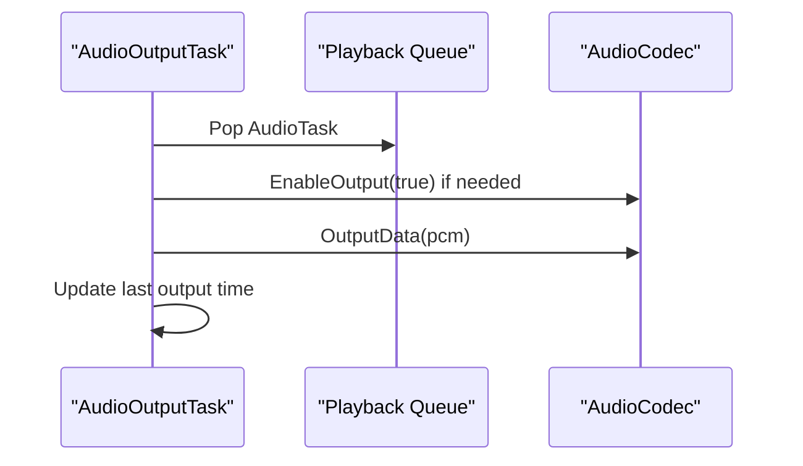

**Diagram sources**
- [audio_service.cc:323-358](file://main/audio/audio_service.cc#L323-L358)

**Section sources**
- [audio_service.cc:323-358](file://main/audio/audio_service.cc#L323-L358)

### OpusCodecTask: Encoding and Decoding Operations
- Encodes PCM to Opus packets for send queue when space is available.
- Decodes Opus packets to PCM for playback queue when space is available.
- Dynamically reconfigures decoder when incoming packet sample rate/frame duration changes.
- Applies output resampler when decoder sample rate differs from codec output rate.

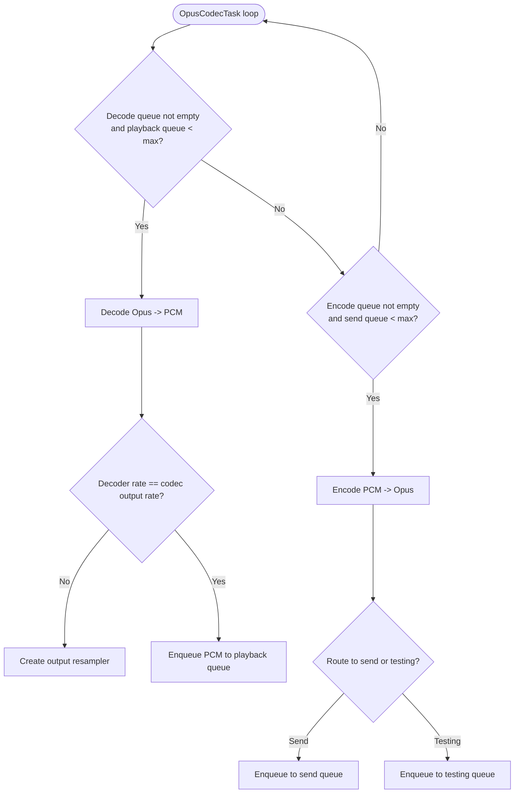

**Diagram sources**
- [audio_service.cc:360-479](file://main/audio/audio_service.cc#L360-L479)

**Section sources**
- [audio_service.cc:360-479](file://main/audio/audio_service.cc#L360-L479)

### Event-Driven Architecture with FreeRTOS Event Groups
- Event bits:
  - Audio testing running
  - Wake word running
  - Voice processor running
  - Playback not empty
- Tasks coordinate via event bits; enabling/disabling modes toggles bits to start/stop processing paths.

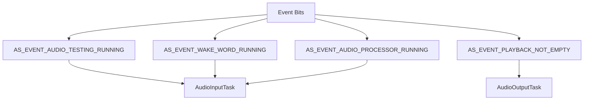

**Diagram sources**
- [audio_service.h:51-54](file://main/audio/audio_service.h#L51-L54)
- [audio_service.cc:263-321](file://main/audio/audio_service.cc#L263-L321)
- [audio_service.cc:323-358](file://main/audio/audio_service.cc#L323-L358)

**Section sources**
- [audio_service.h:51-54](file://main/audio/audio_service.h#L51-L54)
- [audio_service.cc:263-321](file://main/audio/audio_service.cc#L263-L321)
- [audio_service.cc:323-358](file://main/audio/audio_service.cc#L323-L358)

### Queue Management System
- Encode queue: Holds AudioTask items (PCM frames) produced by AudioInputTask.
- Send queue: Holds encoded Opus packets for transmission.
- Decode queue: Holds incoming Opus packets for playback.
- Playback queue: Holds PCM frames for speaker output.
- Timestamp queue: Maintains timestamps for server AEC alignment.
- Synchronization: Mutex and condition variables protect queues; bounded capacities prevent unbounded memory growth.

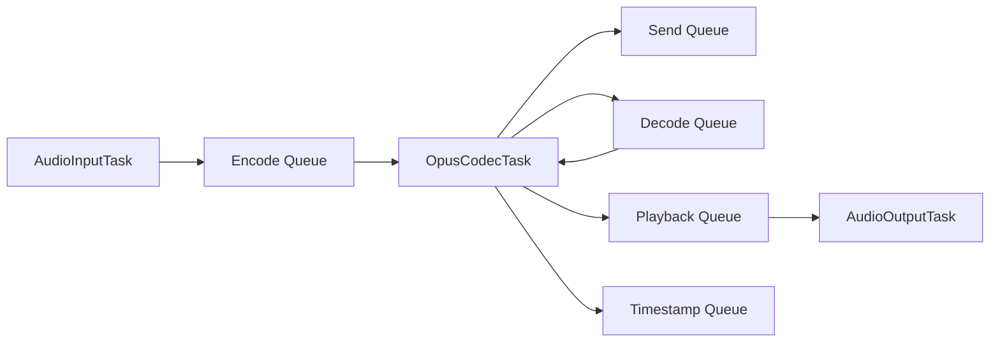

**Diagram sources**
- [audio_service.h:176-184](file://main/audio/audio_service.h#L176-L184)
- [audio_service.cc:517-551](file://main/audio/audio_service.cc#L517-L551)

**Section sources**
- [audio_service.h:176-184](file://main/audio/audio_service.h#L176-L184)
- [audio_service.cc:517-551](file://main/audio/audio_service.cc#L517-L551)

### Power Management and Idle Detection
- Periodic power timer checks last input/output activity.
- Powers down codec input/output after timeout to conserve energy.
- Timer interval switches to shorter intervals when codec is active to reduce latency.

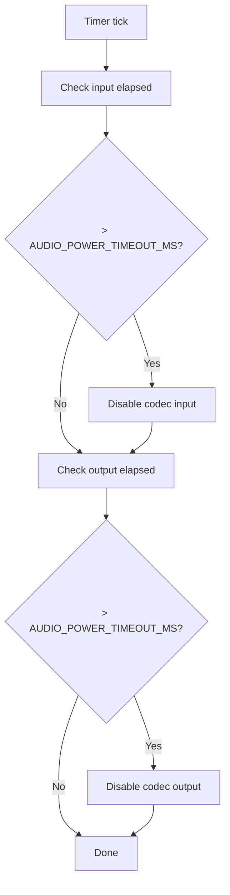

**Diagram sources**
- [audio_service.cc:715-728](file://main/audio/audio_service.cc#L715-L728)
- [audio_service.h:48-49](file://main/audio/audio_service.h#L48-L49)

**Section sources**
- [audio_service.cc:715-728](file://main/audio/audio_service.cc#L715-L728)
- [audio_service.h:48-49](file://main/audio/audio_service.h#L48-L49)

### Codec Abstraction and Hardware Options
- AudioCodec defines the interface for I2S-based hardware with input/output enablement, volume/gain control, and data transfer.
- Concrete implementations include ES8388 and ES8389 codecs, supporting duplex operation and external amplification pins.

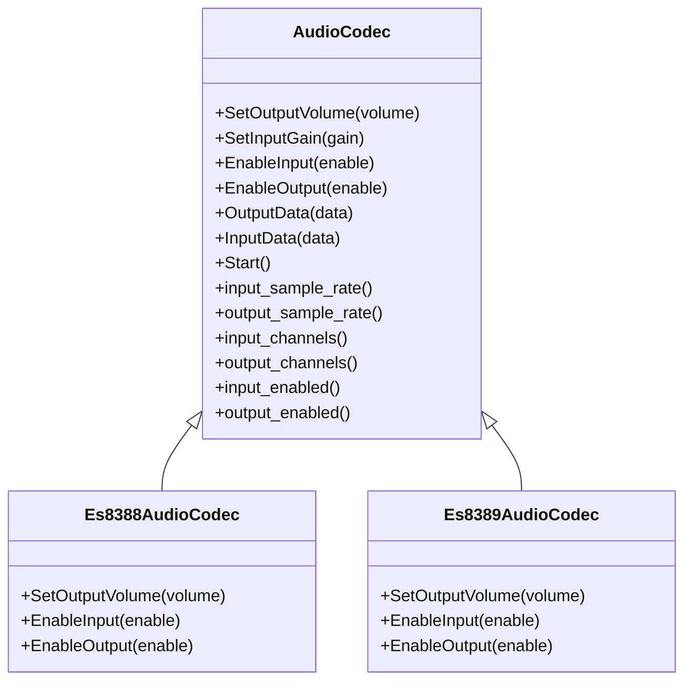

**Diagram sources**
- [audio_codec.h:17-62](file://main/audio/audio_codec.h#L17-L62)
- [es8388_audio_codec.h:12-41](file://main/audio/codecs/es8388_audio_codec.h#L12-L41)
- [es8389_audio_codec.h:12-41](file://main/audio/codecs/es8389_audio_codec.h#L12-L41)

**Section sources**
- [audio_codec.h:17-62](file://main/audio/audio_codec.h#L17-L62)
- [es8388_audio_codec.h:12-41](file://main/audio/codecs/es8388_audio_codec.h#L12-L41)
- [es8389_audio_codec.h:12-41](file://main/audio/codecs/es8389_audio_codec.h#L12-L41)

### Audio Processor and Wake Word Integration
- AudioProcessor interface supports initialization, feeding PCM, starting/stopping, and VAD state callbacks.
- WakeWord interface supports initialization, feeding PCM, wake word detection callbacks, and encoding captured wake word data.
- AFE-based implementations provide advanced features on supported targets.

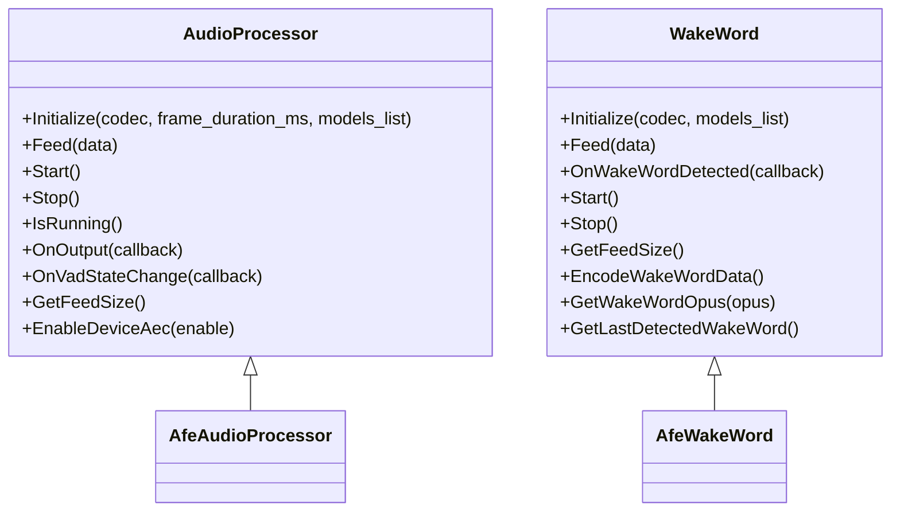

**Diagram sources**
- [audio_processor.h:11-27](file://main/audio/audio_processor.h#L11-L27)
- [wake_word.h:11-27](file://main/audio/wake_word.h#L11-L27)
- [afe_audio_processor.h:18-53](file://main/audio/processors/afe_audio_processor.h#L18-L53)
- [afe_wake_word.h:23-68](file://main/audio/wake_words/afe_wake_word.h#L23-L68)

**Section sources**
- [audio_processor.h:11-27](file://main/audio/audio_processor.h#L11-L27)
- [wake_word.h:11-27](file://main/audio/wake_word.h#L11-L27)
- [afe_audio_processor.h:18-53](file://main/audio/processors/afe_audio_processor.h#L18-L53)
- [afe_wake_word.h:23-68](file://main/audio/wake_words/afe_wake_word.h#L23-L68)

### Sound Playback Pipeline (OGG Demuxer)
- Incoming OGG audio is demuxed to raw Opus frames; demuxer emits decoded PCM with sample rate and payload.
- Decoded PCM is pushed to the decode queue for playback.

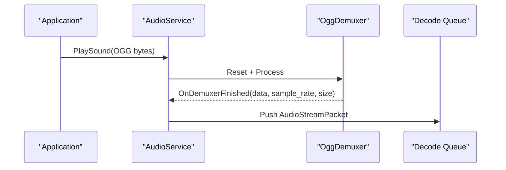

**Diagram sources**
- [audio_service.cc:666-687](file://main/audio/audio_service.cc#L666-L687)
- [ogg_demuxer.h:42-63](file://main/audio/demuxer/ogg_demuxer.h#L42-L63)

**Section sources**
- [audio_service.cc:666-687](file://main/audio/audio_service.cc#L666-L687)
- [ogg_demuxer.h:42-63](file://main/audio/demuxer/ogg_demuxer.h#L42-L63)

### Integration with Application State Machine
- Application initializes AudioService, registers callbacks, and drives audio operations based on device state transitions.
- Events from AudioService (send queue available, wake word detected, VAD change) are forwarded to the main event loop.

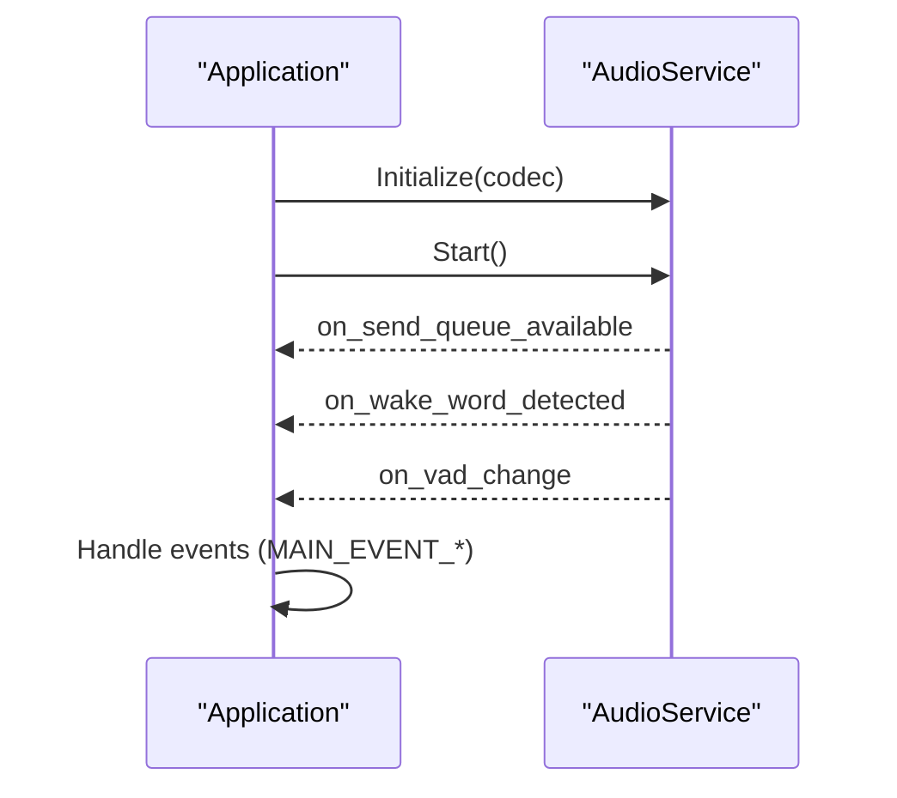

**Diagram sources**
- [application.cc:80-101](file://main/application.cc#L80-L101)
- [application.cc:235-254](file://main/application.cc#L235-L254)
- [audio_service.h:79-84](file://main/audio/audio_service.h#L79-L84)

**Section sources**
- [application.cc:80-101](file://main/application.cc#L80-L101)
- [application.cc:235-254](file://main/application.cc#L235-L254)
- [audio_service.h:79-84](file://main/audio/audio_service.h#L79-L84)

## Dependency Analysis
- AudioService depends on:
  - AudioCodec for hardware I/O
  - AudioProcessor for voice processing
  - WakeWord for wake word detection
  - ESP-ADF Opus encoder/decoder and resamplers
  - FreeRTOS for tasks, event groups, and timers
- Coupling:
  - AudioService coordinates queues and event bits; tasks are loosely coupled via shared state.
  - Processor/WakeWord are swappable implementations behind interfaces.
- External integrations:
  - Board abstraction supplies the codec instance.
  - Application orchestrates lifecycle and state transitions.

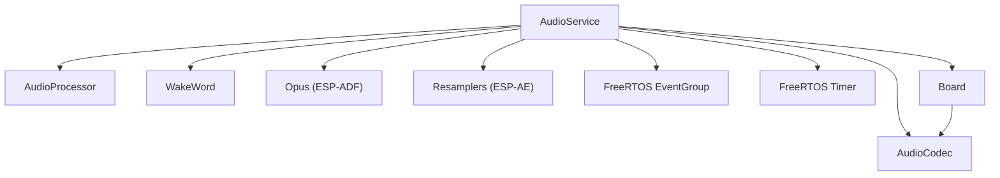

**Diagram sources**
- [audio_service.h:138-167](file://main/audio/audio_service.h#L138-L167)
- [board.h:75](file://main/boards/common/board.h#L75)

**Section sources**
- [audio_service.h:138-167](file://main/audio/audio_service.h#L138-L167)
- [board.h:75](file://main/boards/common/board.h#L75)

## Performance Considerations
- Frame duration: Fixed at 60 ms for encoder/decoder; impacts latency and CPU usage.
- Queue sizing:
  - Encode queue max: 2 tasks
  - Playback queue max: 2 tasks
  - Decode queue max: proportional to 2400 ms window
  - Send queue max: proportional to 2400 ms window
  - Timestamp queue max: 3 timestamps
- Stack allocation: PSRAM-backed static stacks for tasks to reduce heap pressure.
- Resampling: Input resampler when codec input rate differs from encoder rate; output resampler when decoder rate differs from codec output rate.
- Power management: Idle timeouts reduce power; short timer intervals when devices are active.
- Recommendations:
  - Tune frame duration for latency vs. CPU trade-offs.
  - Monitor queue depths; adjust model list or processing complexity to keep queues under load.
  - Ensure adequate PSRAM allocation for static stacks.
  - Validate sample rate compatibility between server and codec to minimize resampling overhead.

[No sources needed since this section provides general guidance]

## Troubleshooting Guide
- Encoder/decoder creation failures:
  - Check return codes from open operations and verify configuration parameters.
- Resampler creation failures:
  - Verify rate conversion configurations and ensure resampler handles are closed before recreation.
- Queue saturation:
  - Monitor queue sizes; implement backpressure or increase queue capacity if needed.
- Idle power-down:
  - Confirm power timer is active and last input/output timestamps are being updated.
- Wake word or processor not triggering:
  - Verify event bits are set and tasks are running; check initialization and start calls.
- Sound playback issues:
  - Ensure OGG demuxer finishes and packets are pushed to decode queue; confirm codec output is enabled.

**Section sources**
- [audio_service.cc:68-84](file://main/audio/audio_service.cc#L68-L84)
- [audio_service.cc:501-515](file://main/audio/audio_service.cc#L501-L515)
- [audio_service.cc:540-551](file://main/audio/audio_service.cc#L540-L551)
- [audio_service.cc:715-728](file://main/audio/audio_service.cc#L715-L728)

## Conclusion
AudioService provides a robust, event-driven audio pipeline with clear separation of concerns. Its design enables efficient concurrent processing, flexible codec support, and power-aware operation. By tuning queue sizes, frame durations, and resampling parameters, developers can adapt the system to diverse audio environments while maintaining stability and responsiveness.

[No sources needed since this section summarizes without analyzing specific files]

## Appendices

### Configuration Examples and Tuning Guidelines
- Opus encoder configuration:
  - Sample rate: 16 kHz
  - Channels: Mono
  - Bitrate: Auto
  - Frame duration: 60 ms
  - Application mode: Audio
  - Complexity: 0
  - FEC: Disabled
  - DTX: Enabled
  - VBR: Enabled
- Queue sizing:
  - MAX_ENCODE_TASKS_IN_QUEUE: 2
  - MAX_PLAYBACK_TASKS_IN_QUEUE: 2
  - MAX_DECODE_PACKETS_IN_QUEUE: 2400 / frame_duration_ms
  - MAX_SEND_PACKETS_IN_QUEUE: 2400 / frame_duration_ms
  - MAX_TIMESTAMPS_IN_QUEUE: 3
- Power management:
  - AUDIO_POWER_TIMEOUT_MS: 15000
  - AUDIO_POWER_CHECK_INTERVAL_MS: 1000
- Audio testing:
  - AUDIO_TESTING_MAX_DURATION_MS: 10000

**Section sources**
- [audio_service.h:66-77](file://main/audio/audio_service.h#L66-L77)
- [audio_service.h:40-47](file://main/audio/audio_service.h#L40-L47)
- [audio_service.h:48-49](file://main/audio/audio_service.h#L48-L49)