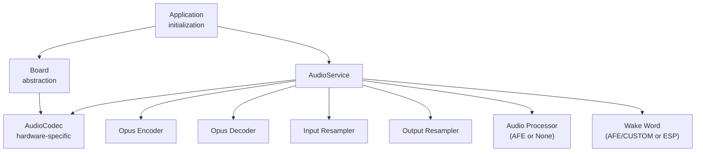
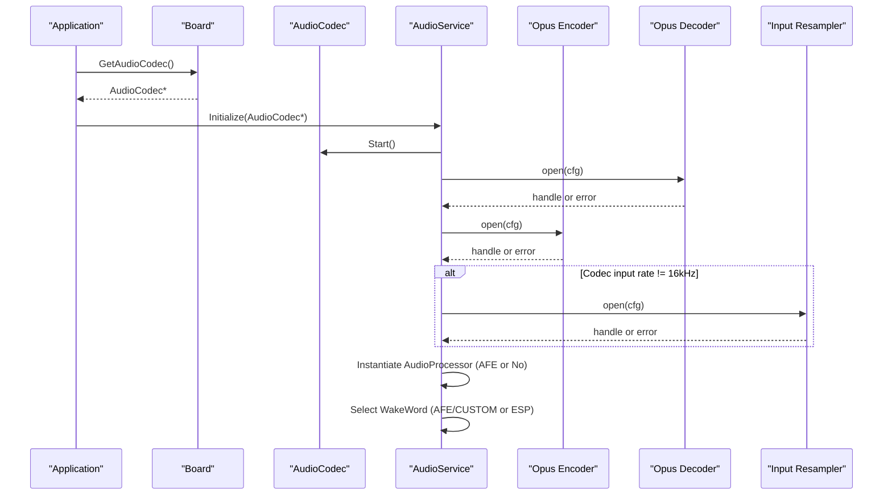
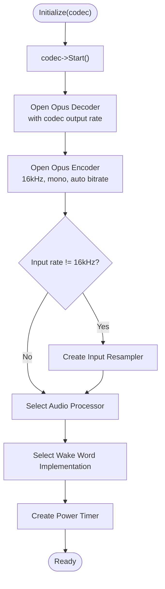
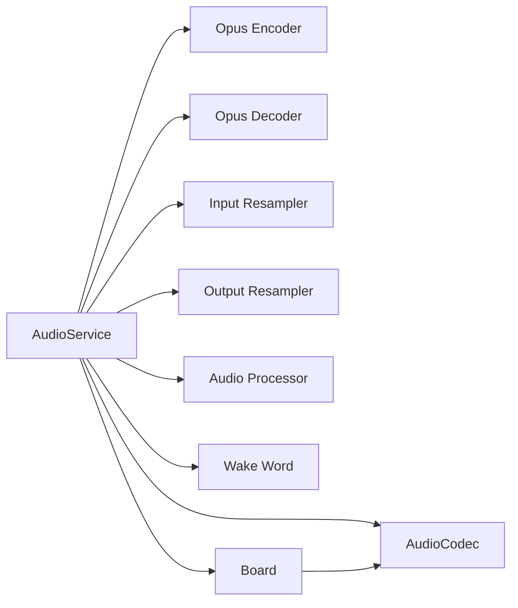

# Initialization and Configuration

<cite>
**Referenced Files in This Document**
- [audio_service.h](file://main/audio/audio_service.h)
- [audio_service.cc](file://main/audio/audio_service.cc)
- [audio_codec.h](file://main/audio/audio_codec.h)
- [board.h](file://main/boards/common/board.h)
- [lulu-esp32s3.cc](file://main/boards/lulu-esp32s3/lulu-esp32s3.cc)
- [config.h](file://main/boards/lulu-esp32s3/config.h)
- [afe_audio_processor.h](file://main/audio/processors/afe_audio_processor.h)
- [afe_wake_word.h](file://main/audio/wake_words/afe_wake_word.h)
- [application.cc](file://main/application.cc)
- [Kconfig.projbuild](file://main/Kconfig.projbuild)
</cite>

## Table of Contents
1. [Introduction](#introduction)
2. [Project Structure](#project-structure)
3. [Core Components](#core-components)
4. [Architecture Overview](#architecture-overview)
5. [Detailed Component Analysis](#detailed-component-analysis)
6. [Dependency Analysis](#dependency-analysis)
7. [Performance Considerations](#performance-considerations)
8. [Troubleshooting Guide](#troubleshooting-guide)
9. [Conclusion](#conclusion)

## Introduction
This document explains the AudioService initialization and configuration subsystem. It focuses on the Initialize() method and its role in setting up codec startup, Opus encoder/decoder configuration, and resampler initialization. It also covers codec parameter requirements, sample rate conversions, hardware-specific configurations, conditional compilation for different audio processors and wake word implementations, and the configuration structures used. Practical initialization sequences, error handling mechanisms, resource allocation patterns, and common pitfalls are included to guide correct deployment.

## Project Structure
The audio subsystem centers around AudioService, which orchestrates:
- Codec lifecycle and I/O
- Opus encoder/decoder setup and runtime
- Resampler configuration for sample rate conversion
- Audio processing pipeline and wake word detection
- Hardware-specific codec selection via Board abstraction

**Diagram sources**
- [application.cc:80-83](file://main/application.cc#L80-L83)
- [board.h:75](file://main/boards/common/board.h#L75)
- [audio_service.cc:62-123](file://main/audio/audio_service.cc#L62-L123)
- [audio_service.h:139-149](file://main/audio/audio_service.h#L139-L149)

**Section sources**
- [application.cc:80-83](file://main/application.cc#L80-L83)
- [board.h:75](file://main/boards/common/board.h#L75)
- [audio_service.cc:62-123](file://main/audio/audio_service.cc#L62-L123)

## Core Components
- AudioService: Central coordinator for audio pipeline, managing tasks, queues, and codec/encoder/decoder/resampler lifecycles.
- AudioCodec: Hardware abstraction for I/O and configuration (implemented per board).
- Opus Encoder/Decoder: Encodes microphone PCM to Opus packets and decodes Opus packets to PCM for playback.
- Resamplers: Input and output resamplers for sample rate conversion.
- Audio Processor: Optional AFE-based voice processing or a no-op implementation.
- Wake Word: AFE-based wake word detection or ESP-based implementation depending on target and configuration.

Key configuration structures:
- esp_opus_dec_cfg_t: Decoder configuration including sample rate, channel, frame duration, self-delimited flag.
- esp_opus_enc_config_t: Encoder configuration including sample rate, channel, bits-per-sample, bitrate, frame duration, application mode, FEC/DTX/VBR toggles.
- esp_ae_rate_cvt_cfg_t: Resampler configuration including source/destination rates, channels, bits-per-sample, complexity, and performance type.

**Section sources**
- [audio_service.h:66-77](file://main/audio/audio_service.h#L66-L77)
- [audio_service.cc:5-23](file://main/audio/audio_service.cc#L5-L23)
- [audio_service.h:139-149](file://main/audio/audio_service.h#L139-L149)

## Architecture Overview
AudioService.Initialize() performs:
- Codec startup
- Opus decoder creation with output sample rate and frame duration
- Opus encoder creation with fixed 16 kHz, mono, auto bitrate, VBR/DTX enabled
- Conditional input resampler creation when codec input rate differs from encoder rate
- Audio processor instantiation (AFE or no-op) and wake word selection (AFE/CUSTOM or ESP) based on target and configuration

**Diagram sources**
- [application.cc:80-83](file://main/application.cc#L80-L83)
- [audio_service.cc:62-123](file://main/audio/audio_service.cc#L62-L123)
- [audio_service.cc:25-36](file://main/audio/audio_service.cc#L25-L36)

## Detailed Component Analysis

### AudioService::Initialize
Responsibilities:
- Start the codec and configure decoder with codec output sample rate and frame duration macro.
- Configure and open the Opus encoder with fixed 16 kHz, mono, auto bitrate, VBR/DTX enabled, and selected frame duration.
- Compute encoder frame size and output buffer size post-open.
- Conditionally create an input resampler when codec input sample rate differs from encoder rate.
- Instantiate audio processor (AFE or no-op) and wire callbacks.
- Create a periodic power timer to manage codec power gating.

Important behaviors:
- Decoder sample rate and frame duration are stored and used to compute decoder frame size.
- Encoder sample rate is fixed at 16 kHz; frame size and output buffer size are queried post-open.
- Input resampler is only created when needed; otherwise, audio path bypasses resampling.

Error handling:
- Logs errors if decoder or encoder creation fails.
- Logs errors if input resampler creation fails.

Resource allocation:
- Static task stacks allocated in PSRAM for audio input, audio output, and Opus codec tasks.
- Event group created for coordination among tasks.

Conditional compilation:
- Audio processor selection controlled by CONFIG_USE_AUDIO_PROCESSOR.
- Wake word implementation selection depends on target (ESP32S3/P4) and model availability.

**Section sources**
- [audio_service.cc:62-123](file://main/audio/audio_service.cc#L62-L123)
- [audio_service.cc:5-23](file://main/audio/audio_service.cc#L5-L23)
- [audio_service.cc:25-36](file://main/audio/audio_service.cc#L25-L36)
- [audio_service.h:66-77](file://main/audio/audio_service.h#L66-L77)

### Opus Encoder Configuration
Fixed encoder configuration:
- Sample rate: 16 kHz
- Channel: Mono
- Bits per sample: 16-bit
- Bitrate: Auto
- Frame duration: From macro-derived enum
- Application mode: Audio
- Complexity: 0
- FEC: Disabled
- DTX: Enabled
- VBR: Enabled

Frame size and output buffer size are queried after opening the encoder to size buffers appropriately.

**Section sources**
- [audio_service.h:66-77](file://main/audio/audio_service.h#L66-L77)
- [audio_service.cc:75-84](file://main/audio/audio_service.cc#L75-L84)

### Opus Decoder Configuration
Decoder configuration:
- Sample rate: From codec output sample rate
- Channel: Mono
- Frame duration: From macro-derived enum
- Self-delimited: False

Decoder is also dynamically reconfigured when incoming packets change sample rate or frame duration, and an output resampler is created if needed.

**Section sources**
- [audio_service.cc:16-23](file://main/audio/audio_service.cc#L16-L23)
- [audio_service.cc:481-515](file://main/audio/audio_service.cc#L481-L515)

### Resampler Configuration
Input resampler:
- Created when codec input sample rate differs from encoder rate (16 kHz).
- Configured with src_rate, dest_rate, channel count, 16-bit depth, moderate complexity, and speed performance type.

Output resampler:
- Created when decoder sample rate differs from codec output sample rate.
- Configured similarly with appropriate rates and channel count.

Resampler reset is invoked when switching between wake word and audio processor modes to prevent buffer overflow.

**Section sources**
- [audio_service.cc:5-14](file://main/audio/audio_service.cc#L5-L14)
- [audio_service.cc:86-93](file://main/audio/audio_service.cc#L86-L93)
- [audio_service.cc:481-515](file://main/audio/audio_service.cc#L481-L515)
- [audio_service.cc:596-603](file://main/audio/audio_service.cc#L596-L603)
- [audio_service.cc:621-629](file://main/audio/audio_service.cc#L621-L629)

### Audio Processor and Wake Word Selection
Conditional compilation:
- CONFIG_USE_AUDIO_PROCESSOR selects AFE-based processor or no-op processor.
- Target-specific wake word selection:
  - ESP32S3/P4: AFE wake word or custom wake word based on model lists.
  - Other targets: ESP wake word.

Model filtering determines wake word implementation at runtime.

**Section sources**
- [audio_service.cc:25-29](file://main/audio/audio_service.cc#L25-L29)
- [audio_service.cc:31-36](file://main/audio/audio_service.cc#L31-L36)
- [audio_service.cc:733-756](file://main/audio/audio_service.cc#L733-L756)

### Hardware-Specific Codec Integration
Board abstraction supplies the codec:
- Lulu ESP32S3 board provides either a simplex or duplex codec depending on configuration macros.
- Board exposes GetAudioCodec() returning a codec instance with configured I/O pins and sample rates.

Board configuration defines:
- AUDIO_INPUT_SAMPLE_RATE and AUDIO_OUTPUT_SAMPLE_RATE
- I2S pin assignments for simplex or duplex modes

**Section sources**
- [lulu-esp32s3.cc:656-666](file://main/boards/lulu-esp32s3/lulu-esp32s3.cc#L656-L666)
- [config.h:6-28](file://main/boards/lulu-esp32s3/config.h#L6-L28)
- [board.h:75](file://main/boards/common/board.h#L75)

### Initialization Sequences and Lifecycle
Typical initialization flow:
1. Application retrieves Board and AudioCodec.
2. AudioService.Initialize(codec) starts codec, opens decoder/encoder, creates resamplers if needed, instantiates processor and wake word.
3. Application.Start() launches tasks with PSRAM stacks and starts periodic power timer.
4. Runtime tasks handle audio capture, encoding, decoding, playback, and wake word detection.

**Diagram sources**
- [audio_service.cc:62-123](file://main/audio/audio_service.cc#L62-L123)

**Section sources**
- [audio_service.cc:125-200](file://main/audio/audio_service.cc#L125-L200)
- [application.cc:80-83](file://main/application.cc#L80-L83)

## Dependency Analysis
- AudioService depends on:
  - AudioCodec for I/O and hardware configuration
  - ESP-ADF components for Opus encoder/decoder and resampler
  - Board for codec factory and hardware-specific wiring
- Conditional dependencies:
  - Audio processor: AFE or no-op based on CONFIG_USE_AUDIO_PROCESSOR
  - Wake word: AFE/CUSTOM or ESP based on target and model availability
- External integrations:
  - Protocol layer consumes encoded packets and pushes decoded packets for playback

**Diagram sources**
- [audio_service.h:139-149](file://main/audio/audio_service.h#L139-L149)
- [audio_service.cc:62-123](file://main/audio/audio_service.cc#L62-L123)

**Section sources**
- [audio_service.h:139-149](file://main/audio/audio_service.h#L139-L149)
- [audio_service.cc:62-123](file://main/audio/audio_service.cc#L62-L123)

## Performance Considerations
- PSRAM allocation: Audio input, output, and codec tasks allocate static stacks in PSRAM to reduce DMA and scheduling overhead.
- Resampler complexity: Moderate complexity and speed performance type balance quality and CPU usage.
- Queue sizing: Encode/send and decode/playback queues limit concurrent tasks to prevent memory pressure.
- Power timer: Periodic checks disable codec input/output when idle to save power.
- Frame duration: Fixed 60 ms frames simplify timing and reduce jitter.

[No sources needed since this section provides general guidance]

## Troubleshooting Guide
Common issues and resolutions:
- Decoder/Encoder creation failures: Verify hardware codec is started and supported parameters are correct. Check log messages for error codes.
  - See decoder/encoder open calls and logs.
- Input resampler creation failure: Ensure codec input rate differs from encoder rate; otherwise resampler is unnecessary.
- Model mismatch for wake word: Ensure model lists include expected prefixes for AFE/CUSTOM wake word or ESP wake word.
- Sample rate mismatch warnings: When server sample rate differs from device output rate, expect potential distortion; align server and device rates.
- Buffer overflow during mode switches: Reset resampler when switching between wake word and audio processor modes to clear buffered samples.

**Section sources**
- [audio_service.cc:68-79](file://main/audio/audio_service.cc#L68-L79)
- [audio_service.cc:481-515](file://main/audio/audio_service.cc#L481-L515)
- [audio_service.cc:596-603](file://main/audio/audio_service.cc#L596-L603)
- [audio_service.cc:621-629](file://main/audio/audio_service.cc#L621-L629)
- [application.cc:530-533](file://main/application.cc#L530-L533)

## Conclusion
AudioService.Initialize() establishes a robust audio pipeline by coordinating codec startup, Opus encoder/decoder configuration, and resampler initialization. Its conditional compilation supports flexible hardware and feature sets, while dynamic decoder configuration and resampler creation adapt to varying input/output sample rates. Proper initialization, careful queue sizing, and power-aware timers ensure reliable operation across devices and use cases.