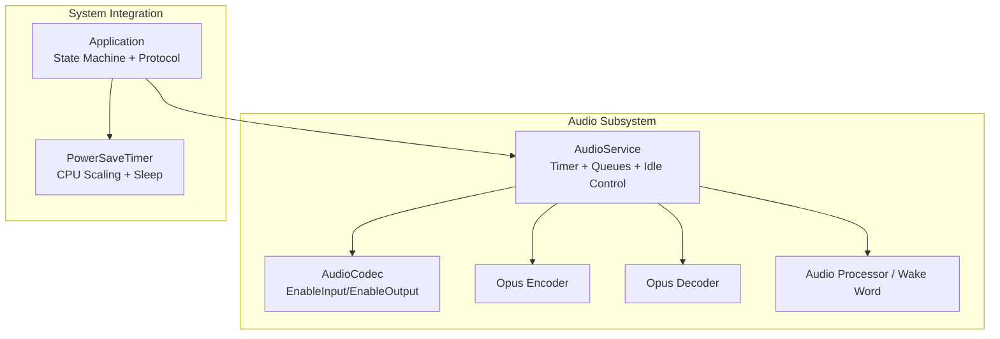
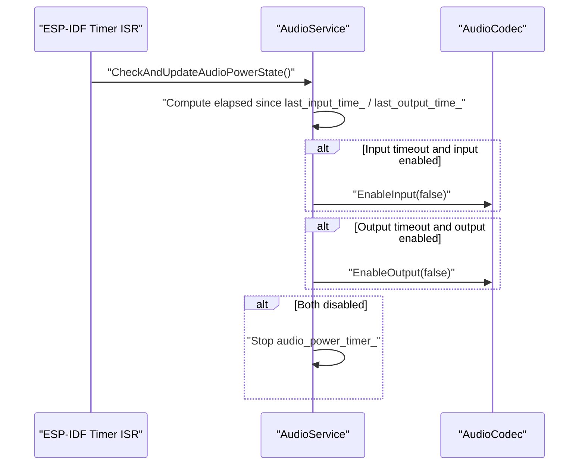
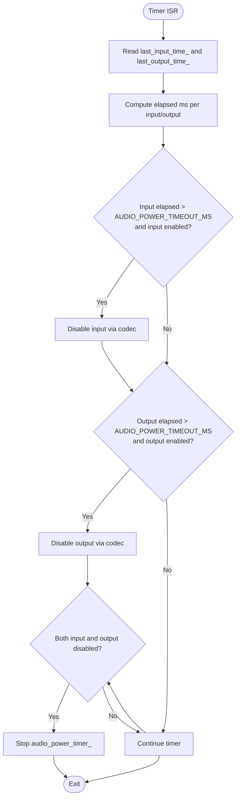
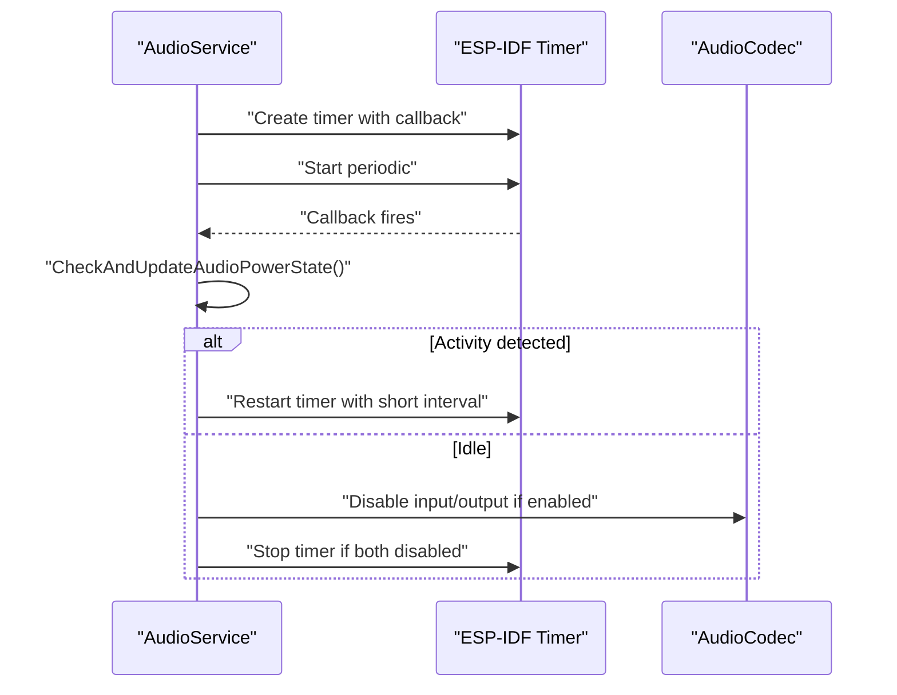
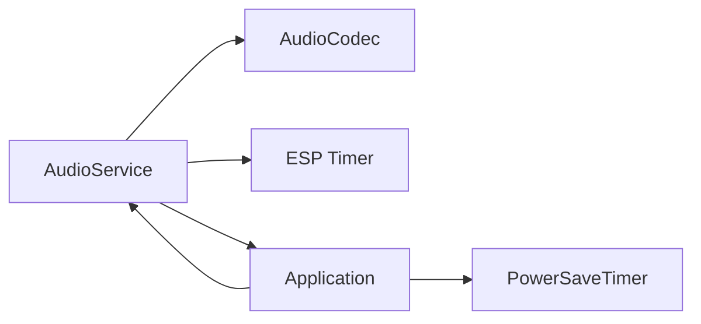

# Power Management and Idle Detection

<cite>
**Referenced Files in This Document**
- [audio_service.h](file://main/audio/audio_service.h)
- [audio_service.cc](file://main/audio/audio_service.cc)
- [audio_codec.h](file://main/audio/audio_codec.h)
- [es8388_audio_codec.cc](file://main/audio/codecs/es8388_audio_codec.cc)
- [es8389_audio_codec.cc](file://main/audio/codecs/es8389_audio_codec.cc)
- [es8311_audio_codec.cc](file://main/audio/codecs/es8311_audio_codec.cc)
- [box_audio_codec.cc](file://main/audio/codecs/box_audio_codec.cc)
- [power_save_timer.cc](file://main/boards/common/power_save_timer.cc)
- [application.h](file://main/application.h)
- [application.cc](file://main/application.cc)
- [audio_service README](file://main/audio/README.md)
</cite>

## Table of Contents
1. [Introduction](#introduction)
2. [Project Structure](#project-structure)
3. [Core Components](#core-components)
4. [Architecture Overview](#architecture-overview)
5. [Detailed Component Analysis](#detailed-component-analysis)
6. [Dependency Analysis](#dependency-analysis)
7. [Performance Considerations](#performance-considerations)
8. [Troubleshooting Guide](#troubleshooting-guide)
9. [Conclusion](#conclusion)

## Introduction
This document explains the AudioService power management and idle detection system. It focuses on the CheckAndUpdateAudioPowerState() method that monitors input/output activity and automatically disables codec power when idle. It also documents the AUDIO_POWER_TIMEOUT_MS configuration, last_input_time_ and last_output_time_ tracking mechanisms, automatic power cycling logic, integration with codec power control, timer-based monitoring, and resource conservation strategies. Configuration options for power thresholds, idle detection sensitivity, and power management policies are covered, along with practical optimization scenarios and troubleshooting guidance for idle detection issues.

## Project Structure
The power management system spans several modules:
- AudioService: orchestrates audio capture/playback, queues, timers, and idle power control
- AudioCodec family: hardware abstraction for codec input/output enabling/disabling
- PowerSaveTimer: broader device power saving policy and CPU frequency scaling
- Application: top-level integration and state coordination

**Diagram sources**
- [audio_service.h:106-202](file://main/audio/audio_service.h#L106-L202)
- [audio_service.cc:112-123](file://main/audio/audio_service.cc#L112-L123)
- [audio_codec.h:17-62](file://main/audio/audio_codec.h#L17-L62)
- [power_save_timer.cc:10-28](file://main/boards/common/power_save_timer.cc#L10-L28)
- [application.h:42-177](file://main/application.h#L42-L177)

**Section sources**
- [audio_service.h:48-49](file://main/audio/audio_service.h#L48-L49)
- [audio_service.cc:112-123](file://main/audio/audio_service.cc#L112-L123)
- [audio_codec.h:24-25](file://main/audio/audio_codec.h#L24-L25)
- [power_save_timer.cc:10-28](file://main/boards/common/power_save_timer.cc#L10-L28)
- [application.h:142-143](file://main/application.h#L142-L143)

## Core Components
- Timer-driven idle monitoring: An ESP-IDF timer triggers periodic checks of last_input_time_ and last_output_time_.
- Codec power control: AudioCodec::EnableInput()/EnableOutput() gate hardware resources.
- Activity tracking: ReadAudioData(), AudioOutputTask(), and PlaySound() update timestamps.
- Automatic power cycling: CheckAndUpdateAudioPowerState() enables power on demand and disables it after timeout.

Key constants and members:
- AUDIO_POWER_TIMEOUT_MS: idle threshold for disabling codec input/output
- AUDIO_POWER_CHECK_INTERVAL_MS: timer interval for periodic checks
- last_input_time_: timestamp of most recent input activity
- last_output_time_: timestamp of most recent output activity
- audio_power_timer_: ESP-IDF timer handle for periodic idle checks

**Section sources**
- [audio_service.h:48-49](file://main/audio/audio_service.h#L48-L49)
- [audio_service.h:192-194](file://main/audio/audio_service.h#L192-L194)
- [audio_service.cc:112-123](file://main/audio/audio_service.cc#L112-L123)
- [audio_service.cc:715-728](file://main/audio/audio_service.cc#L715-L728)

## Architecture Overview
The idle detection cycle operates as follows:
- On input/output activity, timestamps are refreshed and codec power is ensured enabled
- Periodic timer fires to evaluate elapsed time since last activity
- If elapsed exceeds AUDIO_POWER_TIMEOUT_MS and codec is currently enabled, power is disabled
- If both input and output are disabled, the timer is stopped to conserve CPU

**Diagram sources**
- [audio_service.cc:112-123](file://main/audio/audio_service.cc#L112-L123)
- [audio_service.cc:715-728](file://main/audio/audio_service.cc#L715-L728)
- [audio_codec.h:24-25](file://main/audio/audio_codec.h#L24-L25)

## Detailed Component Analysis

### Idle Detection and Power Control Loop
The core idle detection logic resides in CheckAndUpdateAudioPowerState():
- Reads steady_clock timestamps
- Compares elapsed milliseconds against AUDIO_POWER_TIMEOUT_MS
- Disables input or output as appropriate
- Stops the timer when both are off

**Diagram sources**
- [audio_service.cc:715-728](file://main/audio/audio_service.cc#L715-L728)
- [audio_service.h:48-49](file://main/audio/audio_service.h#L48-L49)

**Section sources**
- [audio_service.cc:715-728](file://main/audio/audio_service.cc#L715-L728)
- [audio_service.h:48-49](file://main/audio/audio_service.h#L48-L49)

### Timestamp Updates on Activity
Input and output activity updates the relevant timestamp:
- ReadAudioData(): refreshes last_input_time_ after capturing audio
- AudioOutputTask(): refreshes last_output_time_ after playback
- PlaySound(): ensures output power is enabled and refreshes last_output_time_

These updates guarantee the idle timer sees recent activity and avoids premature power-off.

**Section sources**
- [audio_service.cc:248-250](file://main/audio/audio_service.cc#L248-L250)
- [audio_service.cc:344-346](file://main/audio/audio_service.cc#L344-L346)
- [audio_service.cc:667-671](file://main/audio/audio_service.cc#L667-L671)

### Codec Power Control Abstractions
AudioCodec defines the interface for enabling/disabling input and output. Concrete implementations vary by hardware but follow the same pattern:
- EnableInput/EnableOutput open/close underlying drivers and update internal state
- AudioService relies on these methods to gate hardware resources

Example implementations:
- ES8388: opens/closes input device and applies gain settings
- ES8389: opens/closes input device and sets input gain
- ES8311: updates device state when enabling/disabling
- BoxAudioCodec: configures multi-channel input and output volumes
- NoAudioCodec: toggles I2S channels for simplex operation

**Section sources**
- [audio_codec.h:24-25](file://main/audio/audio_codec.h#L24-L25)
- [es8388_audio_codec.cc:144-171](file://main/audio/codecs/es8388_audio_codec.cc#L144-L171)
- [es8389_audio_codec.cc:140-164](file://main/audio/codecs/es8389_audio_codec.cc#L140-L164)
- [es8311_audio_codec.cc:163-199](file://main/audio/codecs/es8311_audio_codec.cc#L163-L199)
- [box_audio_codec.cc:184-247](file://main/audio/codecs/box_audio_codec.cc#L184-L247)
- [no_audio_codec.cc:257-287](file://main/audio/codecs/no_audio_codec.cc#L257-L287)

### Timer Lifecycle and Resource Conservation
- Creation: AudioService creates an ESP-IDF timer with a task dispatch method and registers a callback to CheckAndUpdateAudioPowerState()
- Start: Start() begins the timer with a periodic interval
- Pause: Stop() halts the timer; CheckAndUpdateAudioPowerState() also stops the timer when both input and output are disabled
- Restart: Methods that trigger new activity restart the timer with a short interval to ensure immediate response

**Diagram sources**
- [audio_service.cc:112-123](file://main/audio/audio_service.cc#L112-L123)
- [audio_service.cc:219-221](file://main/audio/audio_service.cc#L219-L221)
- [audio_service.cc:337-339](file://main/audio/audio_service.cc#L337-L339)
- [audio_service.cc:668-670](file://main/audio/audio_service.cc#L668-L670)
- [audio_service.cc:715-728](file://main/audio/audio_service.cc#L715-L728)

**Section sources**
- [audio_service.cc:112-123](file://main/audio/audio_service.cc#L112-L123)
- [audio_service.cc:219-221](file://main/audio/audio_service.cc#L219-L221)
- [audio_service.cc:337-339](file://main/audio/audio_service.cc#L337-L339)
- [audio_service.cc:668-670](file://main/audio/audio_service.cc#L668-L670)
- [audio_service.cc:715-728](file://main/audio/audio_service.cc#L715-L728)

### Integration with Application and State Machine
Application coordinates power management with higher-level state transitions:
- Sets power save levels that influence CPU frequency and sleep behavior
- Ensures audio resources are released or reconfigured during state changes
- Coordinates protocol lifecycle that affects audio channel usage

**Section sources**
- [application.h:142-143](file://main/application.h#L142-L143)
- [application.cc:332-338](file://main/application.cc#L332-L338)
- [application.cc:528-543](file://main/application.cc#L528-L543)
- [power_save_timer.cc:62-104](file://main/boards/common/power_save_timer.cc#L62-L104)

## Dependency Analysis
The idle detection system depends on:
- AudioService for timestamp maintenance and timer control
- AudioCodec for hardware gating
- ESP-IDF timer subsystem for periodic callbacks
- Application for state-driven power save policies

**Diagram sources**
- [audio_service.h:106-202](file://main/audio/audio_service.h#L106-L202)
- [audio_codec.h:17-62](file://main/audio/audio_codec.h#L17-L62)
- [power_save_timer.cc:10-28](file://main/boards/common/power_save_timer.cc#L10-L28)
- [application.h:42-177](file://main/application.h#L42-L177)

**Section sources**
- [audio_service.h:106-202](file://main/audio/audio_service.h#L106-L202)
- [audio_codec.h:17-62](file://main/audio/audio_codec.h#L17-L62)
- [power_save_timer.cc:10-28](file://main/boards/common/power_save_timer.cc#L10-L28)
- [application.h:42-177](file://main/application.h#L42-L177)

## Performance Considerations
- Timer interval trade-offs: AUDIO_POWER_CHECK_INTERVAL_MS balances responsiveness vs. CPU overhead. Short intervals improve responsiveness but increase wake-ups.
- Timeout tuning: AUDIO_POWER_TIMEOUT_MS should exceed typical bursty activity periods to avoid oscillation between enabling and disabling.
- Queue backpressure: Ensure encode/decode/playback queues are sized appropriately to prevent stalls that could trigger premature power-off.
- Codec warm-up: Some codecs require brief stabilization after enabling; the system accounts for this by delaying initial processing after enabling input/output.
- Memory and CPU allocation: PSRAM stacks for audio tasks reduce heap pressure; keep timer callbacks minimal to avoid blocking.

[No sources needed since this section provides general guidance]

## Troubleshooting Guide
Common issues and resolutions:
- Codec remains enabled despite inactivity
  - Verify that ReadAudioData(), AudioOutputTask(), and PlaySound() are updating timestamps
  - Confirm the timer is started and not stopped prematurely
  - Check for exceptions or early returns that bypass timestamp updates

- Frequent power toggling
  - Reduce AUDIO_POWER_CHECK_INTERVAL_MS or increase AUDIO_POWER_TIMEOUT_MS
  - Ensure activities are properly gated; avoid partial enable/disable sequences

- Timer not firing
  - Confirm Start() was called and timer handle is valid
  - Verify the callback registration and dispatch method

- Power save conflicts
  - PowerSaveTimer may disable audio input during sleep mode; coordinate state transitions to avoid race conditions

**Section sources**
- [audio_service.cc:248-250](file://main/audio/audio_service.cc#L248-L250)
- [audio_service.cc:344-346](file://main/audio/audio_service.cc#L344-L346)
- [audio_service.cc:667-671](file://main/audio/audio_service.cc#L667-L671)
- [audio_service.cc:129](file://main/audio/audio_service.cc#L129)
- [audio_service.cc:112-123](file://main/audio/audio_service.cc#L112-L123)
- [power_save_timer.cc:78-90](file://main/boards/common/power_save_timer.cc#L78-L90)

## Conclusion
The AudioService idle detection system provides robust, timer-driven power management for codec input and output. By tracking last activity timestamps and enforcing configurable timeouts, it conserves power while maintaining responsive audio operation. Proper configuration of AUDIO_POWER_TIMEOUT_MS and AUDIO_POWER_CHECK_INTERVAL_MS, combined with careful integration of codec enable/disable semantics and broader power save policies, yields efficient and reliable audio behavior across diverse operational modes.