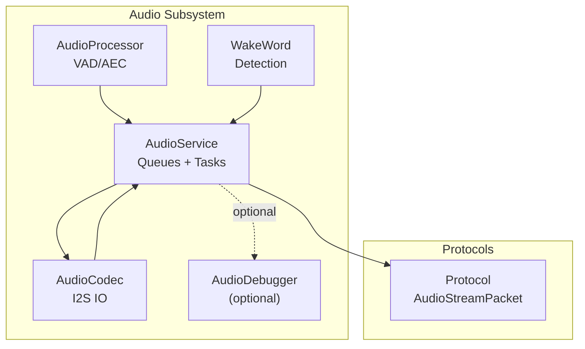
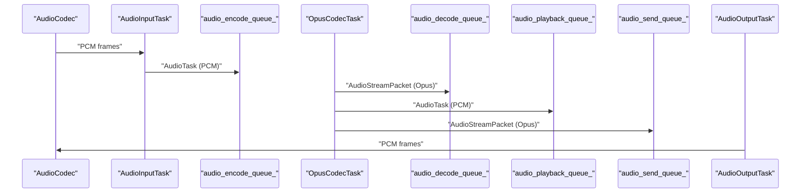
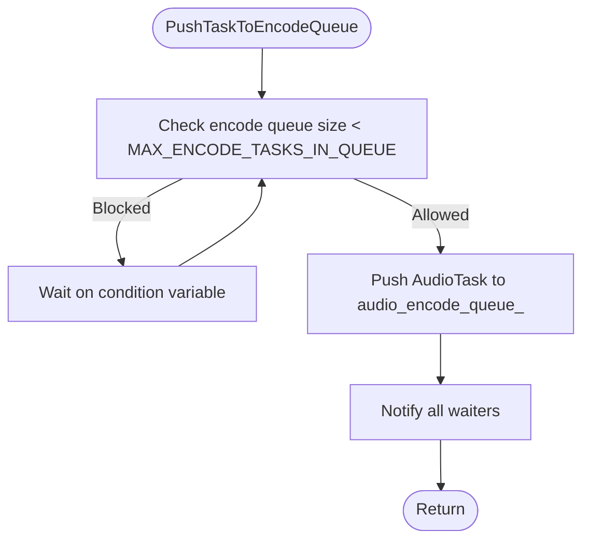
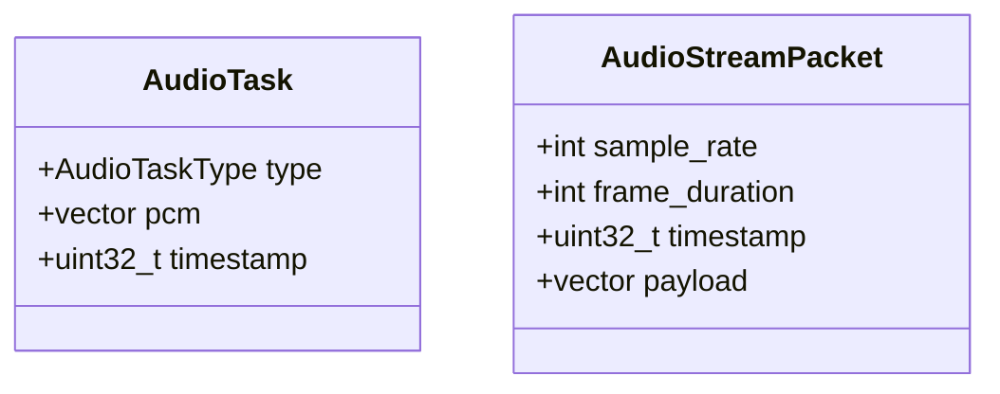
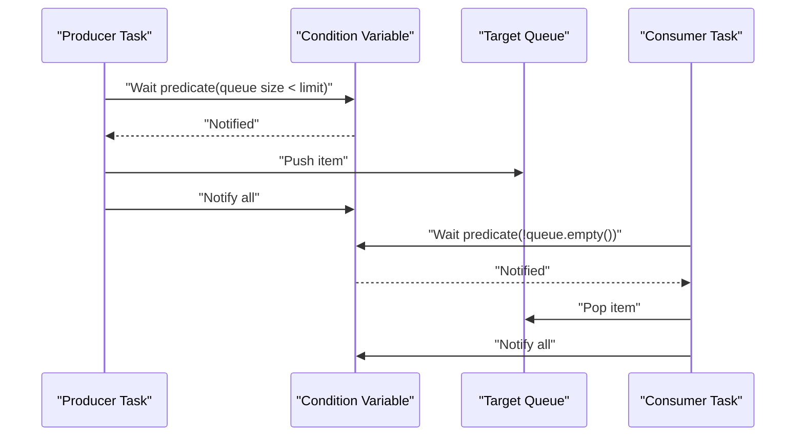
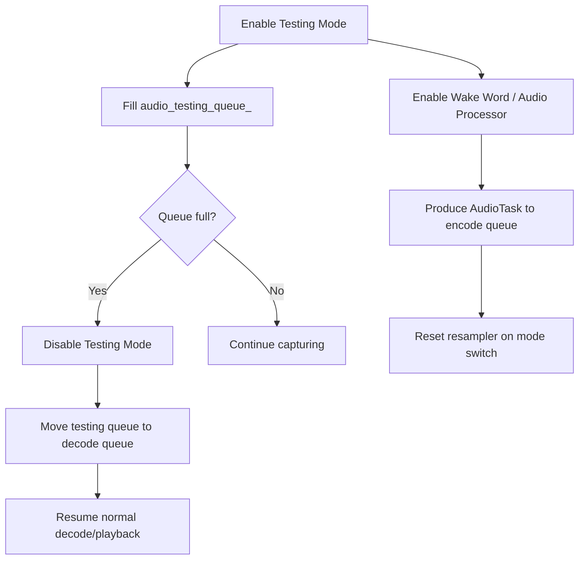
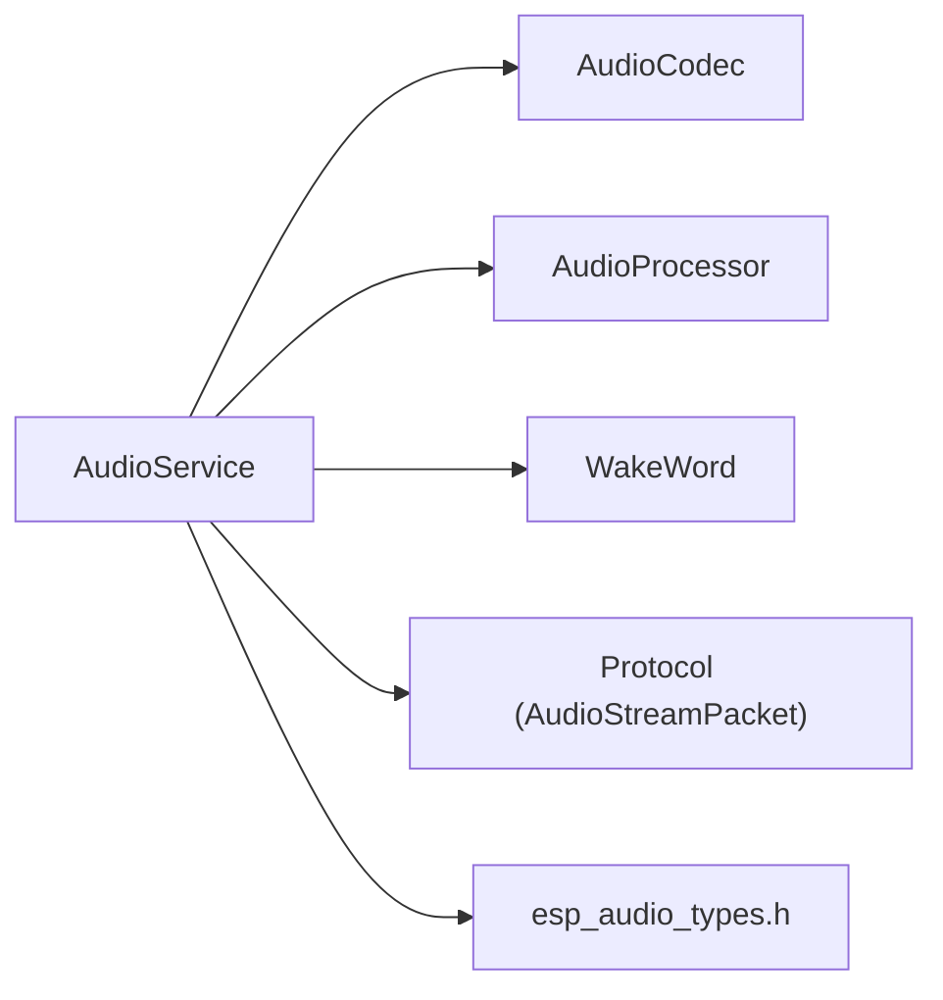

# Queue System and Data Flow

<cite>
**Referenced Files in This Document**
- [audio_service.h](file://main/audio/audio_service.h)
- [audio_service.cc](file://main/audio/audio_service.cc)
- [protocol.h](file://main/protocols/protocol.h)
- [audio_processor.h](file://main/audio/audio_processor.h)
- [wake_word.h](file://main/audio/wake_word.h)
- [audio_codec.h](file://main/audio/audio_codec.h)
- [box_audio_codec.h](file://main/audio/codecs/box_audio_codec.h)
- [esp_audio_types.h](file://managed_components/espressif__esp_audio_codec/include/esp_audio_types.h)
</cite>

## Table of Contents
1. [Introduction](#introduction)
2. [Project Structure](#project-structure)
3. [Core Components](#core-components)
4. [Architecture Overview](#architecture-overview)
5. [Detailed Component Analysis](#detailed-component-analysis)
6. [Dependency Analysis](#dependency-analysis)
7. [Performance Considerations](#performance-considerations)
8. [Troubleshooting Guide](#troubleshooting-guide)
9. [Conclusion](#conclusion)

## Introduction
This document explains the AudioService queue management system responsible for orchestrating audio packet flow across tasks. It covers the four primary queues:
- audio_encode_queue_: Producer for encoded Opus packets destined for the network send queue.
- audio_decode_queue_: Consumer of incoming Opus packets intended for playback.
- audio_playback_queue_: Consumer of decoded PCM frames scheduled for speaker output.
- audio_testing_queue_: Temporary staging area for captured audio during testing mode.

It also documents the AudioTask structure, the AudioStreamPacket format, timestamp management, producer-consumer patterns, thread-safe queue operations using mutexes and condition variables, and queue monitoring mechanisms. Guidance on queue sizing, overflow handling, and performance tuning is included.

## Project Structure
The AudioService lives under main/audio and collaborates with protocol definitions, audio processors, wake word detection, and the audio codec subsystem. The relevant files are:
- AudioService interface and declarations: [audio_service.h](file://main/audio/audio_service.h)
- AudioService implementation and queue logic: [audio_service.cc](file://main/audio/audio_service.cc)
- Packet format definition: [protocol.h](file://main/protocols/protocol.h)
- Processor and wake word interfaces: [audio_processor.h](file://main/audio/audio_processor.h), [wake_word.h](file://main/audio/wake_word.h)
- Audio codec base class and platform-specific codec: [audio_codec.h](file://main/audio/audio_codec.h), [box_audio_codec.h](file://main/audio/codecs/box_audio_codec.h)
- Audio constants and types used by the codec library: [esp_audio_types.h](file://managed_components/espressif__esp_audio_codec/include/esp_audio_types.h)

**Diagram sources**
- [audio_service.h](file://main/audio/audio_service.h)
- [audio_service.cc](file://main/audio/audio_service.cc)
- [protocol.h](file://main/protocols/protocol.h)
- [audio_processor.h](file://main/audio/audio_processor.h)
- [wake_word.h](file://main/audio/wake_word.h)
- [audio_codec.h](file://main/audio/audio_codec.h)
- [box_audio_codec.h](file://main/audio/codecs/box_audio_codec.h)

**Section sources**
- [audio_service.h](file://main/audio/audio_service.h)
- [audio_service.cc](file://main/audio/audio_service.cc)
- [protocol.h](file://main/protocols/protocol.h)

## Core Components
- AudioService: Central coordinator managing four queues, three tasks, and Opus encoding/decoding. It exposes APIs to push/pop packets, start/stop services, and toggle operational modes (testing, wake word, audio processor).
- AudioTask: Encapsulates PCM frames and metadata for encoding. Fields include type, PCM vector, and timestamp.
- AudioStreamPacket: Encapsulates Opus payload and metadata for transport and decoding. Fields include sample_rate, frame_duration, timestamp, and payload bytes.
- Thread synchronization: Uses std::mutex and std::condition_variable for safe queue operations across tasks.

Key queue definitions and limits:
- audio_encode_queue_: Stores AudioTask items produced by the audio processor/wake word pipeline. Limited by MAX_ENCODE_TASKS_IN_QUEUE.
- audio_decode_queue_: Incoming Opus packets awaiting decoding. Limited by MAX_DECODE_PACKETS_IN_QUEUE.
- audio_playback_queue_: Decoded PCM frames ready for output. Limited by MAX_PLAYBACK_TASKS_IN_QUEUE.
- audio_testing_queue_: Captured PCM frames during testing mode. Limited by AUDIO_TESTING_MAX_DURATION_MS / OPUS_FRAME_DURATION_MS.
- timestamp_queue_: Tracks timestamps for server AEC alignment, capped by MAX_TIMESTAMPS_IN_QUEUE.

**Section sources**
- [audio_service.h](file://main/audio/audio_service.h)
- [audio_service.cc](file://main/audio/audio_service.cc)
- [protocol.h](file://main/protocols/protocol.h)

## Architecture Overview
The system follows a classic producer-consumer model with three concurrent tasks:
- AudioInputTask: Reads PCM from codec, optionally feeds wake word and audio processor, and enqueues AudioTask items to audio_encode_queue_.
- OpusCodecTask: Decodes incoming packets to PCM and enqueues to audio_playback_queue_, or encodes outgoing PCM to Opus and enqueues to audio_send_queue_.
- AudioOutputTask: Dequeues PCM from audio_playback_queue_ and writes to codec for playback.

**Diagram sources**
- [audio_service.cc](file://main/audio/audio_service.cc)
- [audio_service.h](file://main/audio/audio_service.h)

## Detailed Component Analysis

### AudioService Queues and Operations
- Queue types and ownership:
  - audio_encode_queue_: deque of unique_ptr<AudioTask>.
  - audio_decode_queue_: deque of unique_ptr<AudioStreamPacket>.
  - audio_playback_queue_: deque of unique_ptr<AudioTask>.
  - audio_testing_queue_: deque of unique_ptr<AudioStreamPacket>.
  - audio_send_queue_: deque of unique_ptr<AudioStreamPacket>.
  - timestamp_queue_: deque of uint32_t timestamps.

- Push/pop semantics:
  - PushTaskToEncodeQueue: Creates AudioTask, optionally assigns timestamp from timestamp_queue_, waits until encode queue size < limit, pushes, notifies waiters.
  - PushPacketToDecodeQueue: Optionally waits until decode queue size < limit, pushes packet, notifies waiters.
  - PopPacketFromSendQueue: Lock-free pop with guard; returns null if empty.
  - AudioOutputTask: Waits for non-empty playback queue, pops front, notifies all, unlocks, outputs PCM via codec.

- Size limits and overflow handling:
  - MAX_ENCODE_TASKS_IN_QUEUE: Backpressure on producer to prevent encode queue overload.
  - MAX_DECODE_PACKETS_IN_QUEUE: Backpressure on incoming packets; optional blocking wait or immediate failure.
  - MAX_PLAYBACK_TASKS_IN_QUEUE: Prevents playback queue from growing indefinitely.
  - AUDIO_TESTING_MAX_DURATION_MS: Limits testing capture duration; queue full triggers automatic disable of testing mode.
  - MAX_TIMESTAMPS_IN_QUEUE: Bounds timestamp queue to avoid unbounded growth.

- Monitoring and statistics:
  - DebugStatistics tracks counts for input, decode, encode, and playback stages.
  - Optional AudioDebugger can be fed raw PCM for diagnostics.

**Diagram sources**
- [audio_service.cc](file://main/audio/audio_service.cc)

**Section sources**
- [audio_service.cc](file://main/audio/audio_service.cc)
- [audio_service.h](file://main/audio/audio_service.h)

### AudioTask and AudioStreamPacket
- AudioTask fields:
  - type: Determines downstream routing (encode/send vs encode/testing).
  - pcm: Frame-sized PCM vector aligned to encoder frame size.
  - timestamp: Optional monotonic timestamp for AEC alignment.

- AudioStreamPacket fields:
  - sample_rate: Sampling rate of the payload.
  - frame_duration: Duration in milliseconds per frame.
  - timestamp: Milliseconds for server-side AEC correlation.
  - payload: Encoded Opus bytes.

**Diagram sources**
- [audio_service.h](file://main/audio/audio_service.h)
- [protocol.h](file://main/protocols/protocol.h)

**Section sources**
- [audio_service.h](file://main/audio/audio_service.h)
- [protocol.h](file://main/protocols/protocol.h)

### Producer-Consumer Patterns and Synchronization
- Mutex and condition variable:
  - audio_queue_mutex_: Guards all queue operations.
  - audio_queue_cv_: Coordinates producers/consumers across tasks.
  - decoder_mutex_: Protects Opus decoder reconfiguration.

- Task coordination:
  - OpusCodecTask waits on cv until either encode queue has items and send queue is not full, or decode queue has items and playback queue is not full.
  - AudioOutputTask waits for non-empty playback queue, pops item, unlocks, outputs PCM, updates stats.

**Diagram sources**
- [audio_service.cc](file://main/audio/audio_service.cc)

**Section sources**
- [audio_service.cc](file://main/audio/audio_service.cc)

### Operational Modes and Queue State Management
- Testing mode:
  - Enabling sets event flag; AudioInputTask produces AudioTask items and enqueues to audio_testing_queue_.
  - Queue full triggers automatic disable and logs warning.
  - Disabling moves audio_testing_queue_ into audio_decode_queue_ for normal playback pipeline.

- Wake word and audio processor:
  - Both feed PCM to audio_encode_queue_ via AudioInputTask.
  - Switching modes resets resamplers to avoid buffer overflow.

- Playback reset:
  - Clears decoder, playback, testing queues, and timestamp queue; notifies all.

**Diagram sources**
- [audio_service.cc](file://main/audio/audio_service.cc)

**Section sources**
- [audio_service.cc](file://main/audio/audio_service.cc)

### Timestamp Management
- Timestamp assignment:
  - When pushing to send queue, the oldest timestamp is taken from timestamp_queue_ if within MAX_TIMESTAMPS_IN_QUEUE bounds.
  - Excess timestamps are dropped to maintain bounded memory.

- Playback and AEC:
  - AudioOutputTask records timestamps for server AEC when present.
  - OpusCodecTask preserves timestamp from incoming packet to outgoing AudioTask.

**Section sources**
- [audio_service.cc](file://main/audio/audio_service.cc)
- [audio_service.h](file://main/audio/audio_service.h)

## Dependency Analysis
- Internal dependencies:
  - AudioService depends on AudioCodec for I/O, AudioProcessor for VAD/AEC, WakeWord for detection, and Protocol for packet format.
  - Opus encoder/decoder and resamplers are managed internally with proper locking.

- External dependencies:
  - ESP-IDF FreeRTOS primitives (tasks, event groups, timers).
  - ESP Audio codec library types and constants.

**Diagram sources**
- [audio_service.h](file://main/audio/audio_service.h)
- [audio_service.cc](file://main/audio/audio_service.cc)
- [protocol.h](file://main/protocols/protocol.h)
- [esp_audio_types.h](file://managed_components/espressif__esp_audio_codec/include/esp_audio_types.h)

**Section sources**
- [audio_service.h](file://main/audio/audio_service.h)
- [audio_service.cc](file://main/audio/audio_service.cc)
- [protocol.h](file://main/protocols/protocol.h)
- [esp_audio_types.h](file://managed_components/espressif__esp_audio_codec/include/esp_audio_types.h)

## Performance Considerations
- Queue sizing:
  - Tune MAX_ENCODE_TASKS_IN_QUEUE to balance CPU load and latency; too small causes backpressure, too large increases memory footprint.
  - MAX_DECODE_PACKETS_IN_QUEUE and MAX_PLAYBACK_TASKS_IN_QUEUE should reflect expected burstiness and desired latency targets.
  - AUDIO_TESTING_MAX_DURATION_MS should align with testing scenarios and available RAM.

- Memory management:
  - Prefer move semantics for PCM vectors and payloads to minimize copies.
  - Limit timestamp_queue_ size to bound memory usage for AEC alignment.

- Throughput:
  - Ensure Opus encoder/decoder frame sizes match codec expectations to avoid reallocation overhead.
  - Use resamplers judiciously; frequent reconfiguration incurs cost.

- Power and idle behavior:
  - Audio power timer disables codec input/output after timeout to save power; queue operations update last input/output timestamps.

[No sources needed since this section provides general guidance]

## Troubleshooting Guide
- Symptoms: Stalled send queue or decode queue.
  - Causes: Consumer not draining, queue limits too low, or missing notify-all after pop.
  - Actions: Verify consumer loops, adjust MAX_* limits, confirm condition variable usage.

- Symptoms: Audio drops or glitches.
  - Causes: Playback queue overflow, insufficient resampling buffers, or codec I/O errors.
  - Actions: Increase MAX_PLAYBACK_TASKS_IN_QUEUE, check resampler configuration, validate codec enable/disable transitions.

- Symptoms: Testing mode does not stop.
  - Causes: Queue remains full beyond AUDIO_TESTING_MAX_DURATION_MS.
  - Actions: Reduce capture duration or increase queue capacity; monitor logs for “queue is full” warnings.

- Symptoms: Timestamp mismatch in AEC.
  - Causes: Excess timestamps exceeding MAX_TIMESTAMPS_IN_QUEUE.
  - Actions: Ensure timely consumption of timestamp_queue_ and avoid long stalls in encode pipeline.

**Section sources**
- [audio_service.cc](file://main/audio/audio_service.cc)
- [audio_service.h](file://main/audio/audio_service.h)

## Conclusion
The AudioService queue system cleanly separates concerns across three tasks and four queues, using robust synchronization primitives to coordinate producers and consumers. By carefully tuning queue sizes, leveraging move semantics, and monitoring queue depths, the system achieves predictable latency and throughput for both capture and playback paths. Proper handling of operational modes and timestamp management ensures compatibility with server-side AEC and efficient resource utilization.