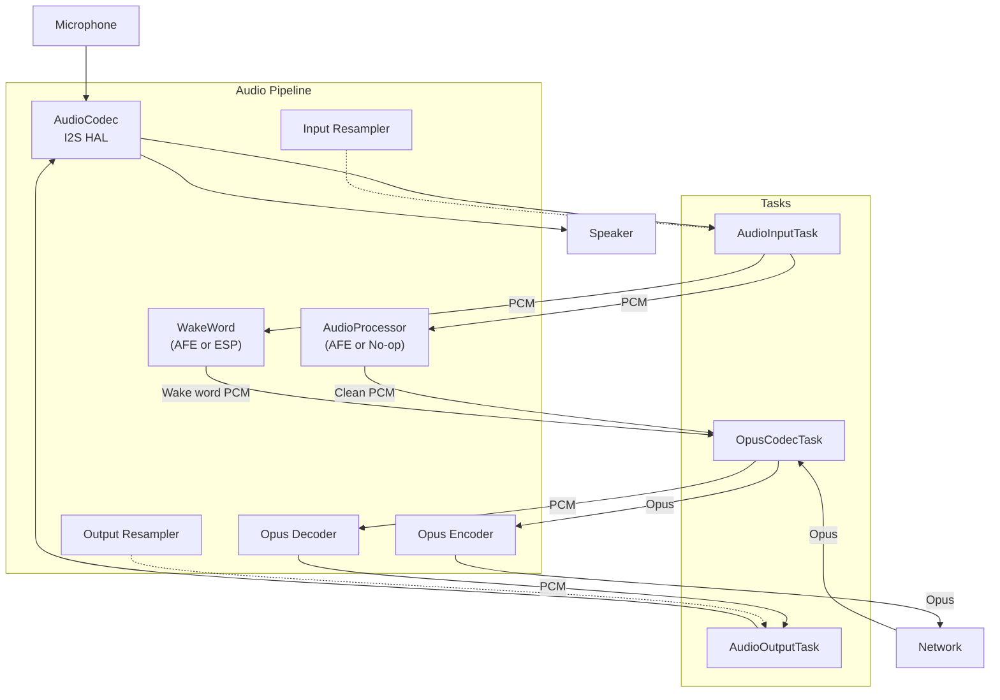
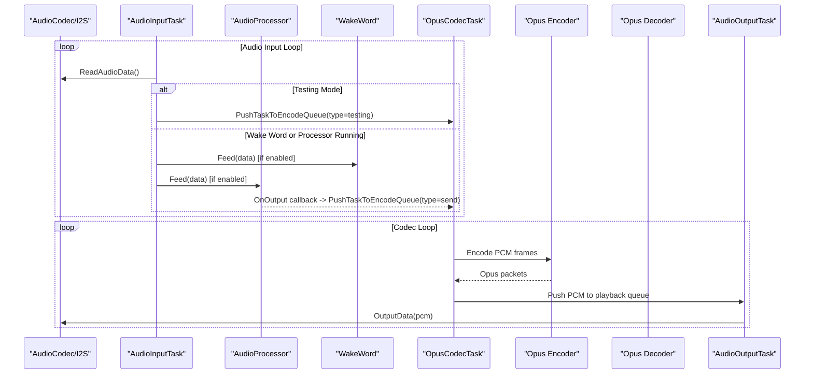
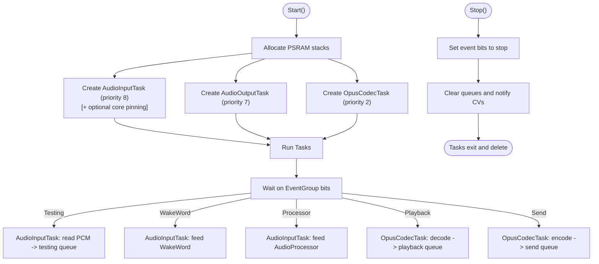
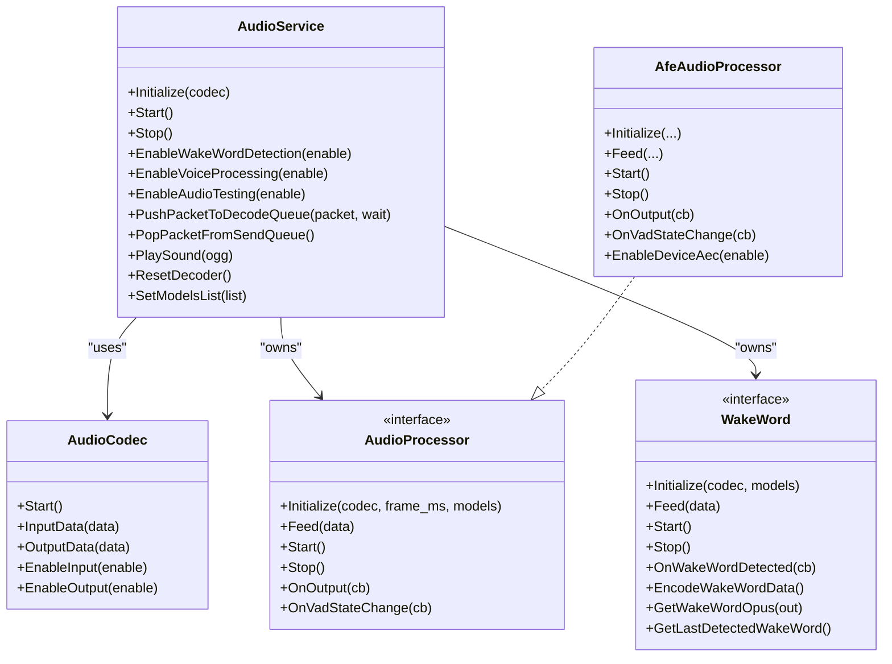

# Task Management and Threading

<cite>
**Referenced Files in This Document**
- [audio_service.h](file://main/audio/audio_service.h)
- [audio_service.cc](file://main/audio/audio_service.cc)
- [audio_codec.h](file://main/audio/audio_codec.h)
- [audio_processor.h](file://main/audio/audio_processor.h)
- [afe_audio_processor.h](file://main/audio/processors/afe_audio_processor.h)
- [es8388_audio_codec.h](file://main/audio/codecs/es8388_audio_codec.h)
- [README.md](file://main/audio/README.md)
</cite>

## Table of Contents
1. [Introduction](#introduction)
2. [Project Structure](#project-structure)
3. [Core Components](#core-components)
4. [Architecture Overview](#architecture-overview)
5. [Detailed Component Analysis](#detailed-component-analysis)
6. [Dependency Analysis](#dependency-analysis)
7. [Performance Considerations](#performance-considerations)
8. [Troubleshooting Guide](#troubleshooting-guide)
9. [Conclusion](#conclusion)

## Introduction
This document explains the AudioService task management system that coordinates three FreeRTOS tasks for audio capture, processing, encoding/decoding, and playback. It covers FreeRTOS task creation with PSRAM allocation, priority assignments, core pinning strategies, event-driven coordination via FreeRTOS event groups, task lifecycle, stack management, resource cleanup, threading safety, mutex usage, and inter-task communication. It also provides performance tuning guidelines for task priorities and stack sizes across different hardware configurations.

## Project Structure
The audio subsystem centers around the AudioService orchestrator and three FreeRTOS tasks:
- AudioInputTask: Reads raw PCM from the codec and feeds wake word detection and/or audio processing.
- AudioOutputTask: Plays PCM from the playback queue to the codec/speaker.
- OpusCodecTask: Encodes PCM to Opus for sending and decodes Opus to PCM for playback.

**Diagram sources**
- [audio_service.cc:263-321](file://main/audio/audio_service.cc#L263-L321)
- [audio_service.cc:323-358](file://main/audio/audio_service.cc#L323-L358)
- [audio_service.cc:360-479](file://main/audio/audio_service.cc#L360-L479)
- [audio_service.cc:62-123](file://main/audio/audio_service.cc#L62-L123)
- [audio_codec.h:17-61](file://main/audio/audio_codec.h#L17-L61)

**Section sources**
- [audio_service.h:106-204](file://main/audio/audio_service.h#L106-L204)
- [audio_service.cc:125-200](file://main/audio/audio_service.cc#L125-L200)
- [README.md:14-21](file://main/audio/README.md#L14-L21)

## Core Components
- AudioService: Central coordinator that initializes audio components, creates tasks, manages queues, and controls runtime modes via event groups.
- AudioCodec: Hardware abstraction for I2S input/output and volume/gain control.
- AudioProcessor: Real-time audio processing (AFE or no-op) with VAD and AEC support.
- WakeWord: Keyword detection module integrated with model lists.
- Opus Encoder/Decoder: Streaming codec for low-latency voice transport.
- Resamplers: Input and output resamplers for sample-rate conversion.

Key runtime constants and queues:
- Event flags for modes: audio testing, wake word detection, audio processor, and playback-not-empty.
- Queues: encode, send, decode, playback, and testing queues with bounded capacities.
- Timers: periodic power management timer to disable codec I/O after inactivity.

**Section sources**
- [audio_service.h:40-77](file://main/audio/audio_service.h#L40-L77)
- [audio_service.h:162-184](file://main/audio/audio_service.h#L162-L184)
- [audio_service.cc:112-123](file://main/audio/audio_service.cc#L112-L123)
- [audio_service.cc:517-537](file://main/audio/audio_service.cc#L517-L537)
- [audio_service.cc:539-551](file://main/audio/audio_service.cc#L539-L551)
- [audio_service.cc:553-562](file://main/audio/audio_service.cc#L553-L562)

## Architecture Overview
The system uses three FreeRTOS tasks to achieve concurrency:
- AudioInputTask: Priority 8, optionally pinned to core 0 depending on configuration.
- AudioOutputTask: Priority 7.
- OpusCodecTask: Priority 2.

Stacks are allocated in PSRAM using static buffers and xTaskCreateStatic variants to avoid heap fragmentation and improve deterministic behavior.

**Diagram sources**
- [audio_service.cc:263-321](file://main/audio/audio_service.cc#L263-L321)
- [audio_service.cc:360-479](file://main/audio/audio_service.cc#L360-L479)
- [audio_service.cc:101-110](file://main/audio/audio_service.cc#L101-L110)
- [audio_service.cc:517-537](file://main/audio/audio_service.cc#L517-L537)

## Detailed Component Analysis

### AudioService Task Lifecycle and Coordination
- Initialization: Creates event group, opens Opus encoder/decoder, sets up resamplers, and registers callbacks.
- Start: Allocates PSRAM stacks, creates tasks with priorities and optional core pinning, starts periodic power timer.
- Stop: Stops timer, signals tasks via event bits, clears queues, notifies condition variables.
- Runtime modes: Controlled by event bits for audio testing, wake word detection, and audio processor.

**Diagram sources**
- [audio_service.cc:125-200](file://main/audio/audio_service.cc#L125-L200)
- [audio_service.cc:263-321](file://main/audio/audio_service.cc#L263-L321)
- [audio_service.cc:360-479](file://main/audio/audio_service.cc#L360-L479)
- [audio_service.cc:202-215](file://main/audio/audio_service.cc#L202-L215)

**Section sources**
- [audio_service.cc:40-60](file://main/audio/audio_service.cc#L40-L60)
- [audio_service.cc:125-200](file://main/audio/audio_service.cc#L125-L200)
- [audio_service.cc:202-215](file://main/audio/audio_service.cc#L202-L215)

### AudioInputTask
Responsibilities:
- Waits on event group bits for audio testing, wake word, or processor modes.
- Reads PCM via ReadAudioData, applies mono conversion if needed, and enqueues tasks for encoding.
- Supports warm-up delay after mode switches to stabilize resamplers.

Threading and synchronization:
- Uses event group waits with indefinite blocking.
- Uses mutex for input resampler reset and process.
- Uses condition variable to coordinate with OpusCodecTask for encode queue capacity.

**Section sources**
- [audio_service.cc:263-321](file://main/audio/audio_service.cc#L263-L321)
- [audio_service.cc:217-261](file://main/audio/audio_service.cc#L217-L261)
- [audio_service.cc:598-603](file://main/audio/audio_service.cc#L598-L603)
- [audio_service.cc:625-630](file://main/audio/audio_service.cc#L625-L630)

### AudioOutputTask
Responsibilities:
- Consumes PCM from playback queue and writes to codec for playback.
- Automatically enables output when needed and disables after timeout.
- Records timestamps for server AEC when enabled.

Threading and synchronization:
- Uses mutex and condition variable to wait for queue items.
- Uses decoder mutex to guard decoder resets and reconfiguration.

**Section sources**
- [audio_service.cc:323-358](file://main/audio/audio_service.cc#L323-L358)
- [audio_service.cc:701-713](file://main/audio/audio_service.cc#L701-L713)

### OpusCodecTask
Responsibilities:
- Decodes Opus packets from decode queue to PCM and pushes to playback queue.
- Encodes PCM from encode queue to Opus packets and pushes to send queue.
- Dynamically reconfigures decoder sample rate and frame duration as needed.
- Applies output resampler when decoder sample rate differs from codec output rate.

Inter-task communication:
- Uses shared queues guarded by mutex and condition variables.
- Uses event bits to signal playback availability.

**Section sources**
- [audio_service.cc:360-479](file://main/audio/audio_service.cc#L360-L479)
- [audio_service.cc:481-515](file://main/audio/audio_service.cc#L481-L515)

### Event-Driven Coordination with FreeRTOS Event Groups
- Event bits:
  - Audio testing running
  - Wake word running
  - Audio processor running
  - Playback not empty
- AudioInputTask waits on these bits to decide whether to read for testing, wake word, or processor.
- OpusCodecTask waits on queue availability and event bits to schedule encode/decode work.
- Stop sets all bits to force tasks to exit cleanly.

**Section sources**
- [audio_service.h:51-54](file://main/audio/audio_service.h#L51-L54)
- [audio_service.cc:263-321](file://main/audio/audio_service.cc#L263-L321)
- [audio_service.cc:360-479](file://main/audio/audio_service.cc#L360-L479)
- [audio_service.cc:202-215](file://main/audio/audio_service.cc#L202-L215)

### Threading Safety and Mutex Usage Patterns
- audio_queue_mutex_: Guards all queues (encode, decode, playback, send, testing).
- audio_queue_cv_: Condition variable to block producers/consumers based on queue sizes and service state.
- decoder_mutex_: Protects Opus decoder open/close/reconfigure and output resampler open/reset.
- input_resampler_mutex_: Protects input resampler reset and process calls.
- decoder_mutex_ and input_resampler_mutex_ are held during critical sections to prevent race conditions.

**Section sources**
- [audio_service.h:176-177](file://main/audio/audio_service.h#L176-L177)
- [audio_service.cc:398-400](file://main/audio/audio_service.cc#L398-L400)
- [audio_service.cc:598-603](file://main/audio/audio_service.cc#L598-L603)
- [audio_service.cc:625-630](file://main/audio/audio_service.cc#L625-L630)
- [audio_service.cc:485-490](file://main/audio/audio_service.cc#L485-L490)

### Inter-Task Communication Mechanisms
- Shared queues:
  - audio_encode_queue_: PCM frames to encode.
  - audio_send_queue_: Encoded Opus packets ready to send.
  - audio_decode_queue_: Incoming Opus packets to decode.
  - audio_playback_queue_: Decoded PCM frames to play.
  - audio_testing_queue_: PCM frames for local testing.
- Condition variables enforce backpressure and prevent starvation.
- Callbacks from AudioProcessor forward clean PCM to OpusCodecTask.

**Section sources**
- [audio_service.h:178-182](file://main/audio/audio_service.h#L178-L182)
- [audio_service.cc:101-110](file://main/audio/audio_service.cc#L101-L110)
- [audio_service.cc:517-537](file://main/audio/audio_service.cc#L517-L537)
- [audio_service.cc:539-551](file://main/audio/audio_service.cc#L539-L551)
- [audio_service.cc:553-562](file://main/audio/audio_service.cc#L553-L562)

### Resource Cleanup Procedures
- Stop() stops the power timer, sets event bits to terminate tasks, clears all queues, and notifies condition variables.
- Destructor closes Opus encoder/decoder, resamplers, and deletes event group.
- PSRAM stacks are allocated once and reused; tasks are deleted after stopping.

**Section sources**
- [audio_service.cc:202-215](file://main/audio/audio_service.cc#L202-L215)
- [audio_service.cc:44-60](file://main/audio/audio_service.cc#L44-L60)

## Dependency Analysis

**Diagram sources**
- [audio_service.h:106-204](file://main/audio/audio_service.h#L106-L204)
- [audio_processor.h:11-24](file://main/audio/audio_processor.h#L11-L24)
- [afe_audio_processor.h:18-51](file://main/audio/processors/afe_audio_processor.h#L18-L51)
- [audio_codec.h:17-61](file://main/audio/audio_codec.h#L17-L61)

**Section sources**
- [audio_service.cc:62-123](file://main/audio/audio_service.cc#L62-L123)
- [audio_service.cc:730-756](file://main/audio/audio_service.cc#L730-L756)

## Performance Considerations
- Task priorities:
  - AudioInputTask: Priority 8. High enough to keep capture steady; consider raising if audio glitches occur under heavy load.
  - AudioOutputTask: Priority 7. Slightly lower than input to balance CPU usage.
  - OpusCodecTask: Priority 2. Lowest among audio tasks to avoid starving input/output under heavy encode/decode loads.
- Stack sizing:
  - AudioInputTask: 2048 * 3 bytes (PSRAM). Larger when audio processor is enabled; otherwise 2048 * 2 bytes.
  - AudioOutputTask: 2048 * 2 bytes (PSRAM) when processor enabled; otherwise 2048 bytes.
  - OpusCodecTask: 2048 * 12 bytes (PSRAM). Critical for codec throughput and latency.
- Core pinning:
  - AudioInputTask can be pinned to core 0 to reduce cache pressure and improve determinism on dual-core systems.
- Backpressure:
  - Queue limits prevent memory bloat and ensure timely processing. Tune MAX_*_TASKS_IN_QUEUE and MAX_*_PACKETS_IN_QUEUE per hardware capabilities.
- Resampling:
  - Input resampler resets on mode switch to avoid buffer overflow. Keep resampler open when possible to reduce overhead.
- Power management:
  - AUDIO_POWER_TIMEOUT_MS balances battery life and startup latency. Lower timeout reduces idle power but increases codec warm-up cost.

[No sources needed since this section provides general guidance]

## Troubleshooting Guide
Common symptoms and remedies:
- Audio stutters or drops:
  - Verify task priorities and stack sizes. Increase OpusCodecTask stack if encode/decode stalls.
  - Check queue sizes and backpressure; ensure MAX_*_TASKS_IN_QUEUE and MAX_*_PACKETS_IN_QUEUE are appropriate.
- Wake word not detected:
  - Confirm wake word initialization and model list assignment. Ensure EnableWakeWordDetection(true) is called and event bit is set.
- No audio playback:
  - Check audio_output_task_handle_ is valid and AudioOutputTask is running. Verify codec output is enabled and playback queue is being consumed.
- Excessive CPU usage:
  - Reduce Opus frame duration or complexity. Consider lowering encoder VBR or FEC flags.
- Memory issues:
  - Ensure PSRAM stacks are allocated before task creation. Avoid allocating large buffers on the heap inside tasks.

**Section sources**
- [audio_service.cc:125-200](file://main/audio/audio_service.cc#L125-L200)
- [audio_service.cc:582-610](file://main/audio/audio_service.cc#L582-L610)
- [audio_service.cc:640-650](file://main/audio/audio_service.cc#L640-L650)
- [audio_service.cc:715-728](file://main/audio/audio_service.cc#L715-L728)

## Conclusion
The AudioService employs a robust, event-driven, multi-task architecture with PSRAM-backed stacks and strict queue-based communication. Proper priority assignment, stack sizing, and mutex discipline ensure real-time performance and reliability. Tuning parameters such as task priorities, stack sizes, queue limits, and resampler behavior allows optimization across diverse hardware configurations.