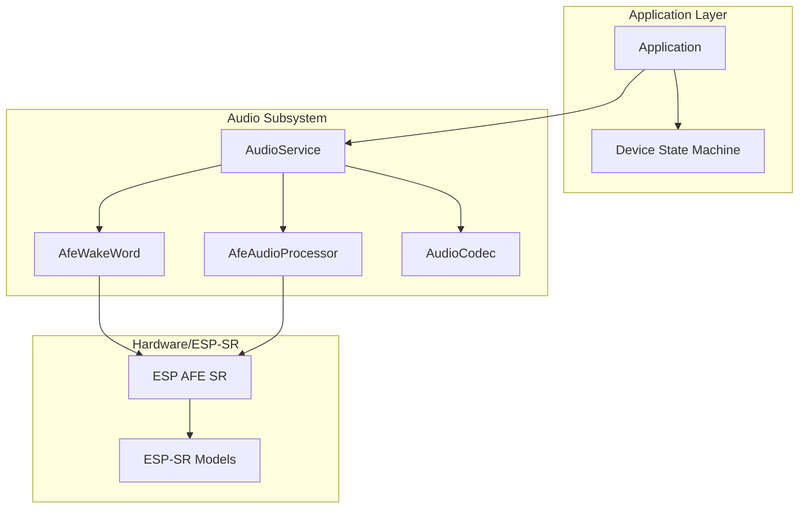
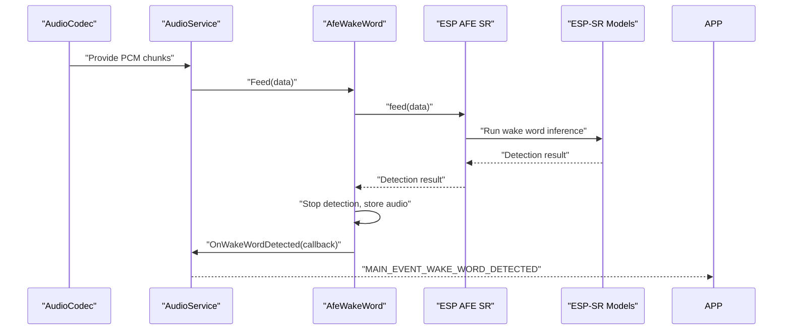
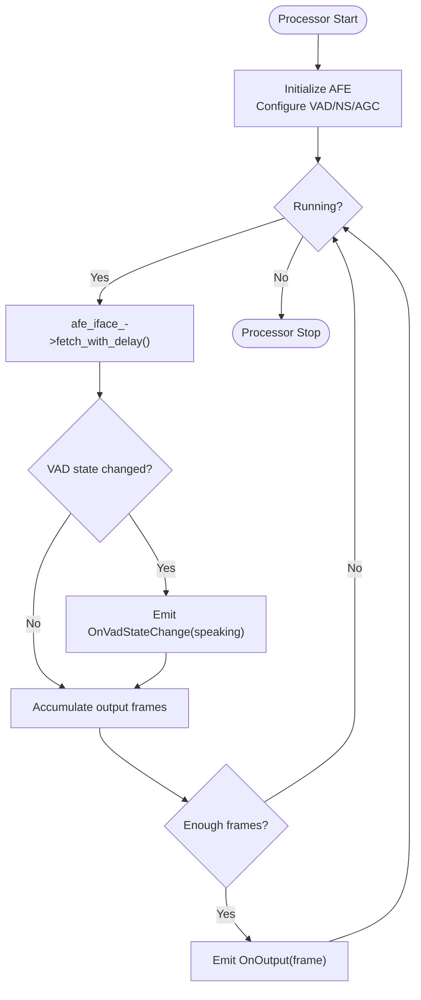
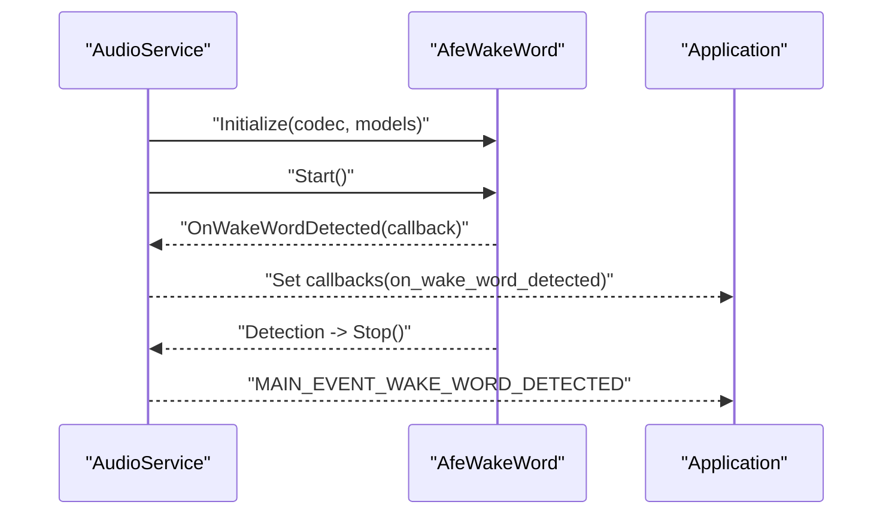
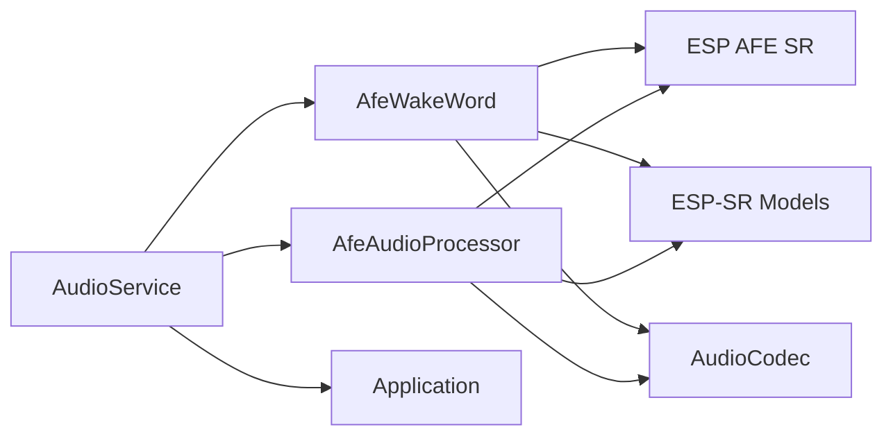

# AFE Wake Word Implementation

<cite>
**Referenced Files in This Document**
- [afe_wake_word.h](file://main/audio/wake_words/afe_wake_word.h)
- [afe_wake_word.cc](file://main/audio/wake_words/afe_wake_word.cc)
- [esp_wake_word.h](file://main/audio/wake_words/esp_wake_word.h)
- [esp_wake_word.cc](file://main/audio/wake_words/esp_wake_word.cc)
- [afe_audio_processor.h](file://main/audio/processors/afe_audio_processor.h)
- [afe_audio_processor.cc](file://main/audio/processors/afe_audio_processor.cc)
- [audio_service.h](file://main/audio/audio_service.h)
- [audio_service.cc](file://main/audio/audio_service.cc)
- [audio_processor.h](file://main/audio/audio_processor.h)
- [wake_word.h](file://main/audio/wake_word.h)
- [es8389_audio_codec.h](file://main/audio/codecs/es8389_audio_codec.h)
- [application.h](file://main/application.h)
- [application.cc](file://main/application.cc)
</cite>

## Table of Contents
1. [Introduction](#introduction)
2. [Project Structure](#project-structure)
3. [Core Components](#core-components)
4. [Architecture Overview](#architecture-overview)
5. [Detailed Component Analysis](#detailed-component-analysis)
6. [Dependency Analysis](#dependency-analysis)
7. [Performance Considerations](#performance-considerations)
8. [Troubleshooting Guide](#troubleshooting-guide)
9. [Conclusion](#conclusion)

## Introduction
This document explains the Audio Front End (AFE) wake word detection implementation for ESP32-S3 targets. It covers the AFE architecture, hardware acceleration benefits, integration with ESP-SR models, initialization and model loading, detection thresholds, callback mechanisms, integration with the main audio pipeline, hardware-specific optimizations, power consumption considerations, continuous listening mode, and configuration examples for sensitivity and false positive reduction.

## Project Structure
The AFE wake word implementation is part of the audio subsystem and integrates with the broader application state machine and protocol layer. Key components include:
- Wake word detection: AFE-based implementation for ESP32-S3
- Audio processor: AFE-based voice processing for VAD and noise suppression
- Audio service: Central orchestration of audio input, encoding, and wake word callbacks
- Application: State machine and event-driven integration with wake word detection



**Diagram sources**
- [audio_service.cc:62-123](file://main/audio/audio_service.cc#L62-L123)
- [afe_wake_word.cc:42-101](file://main/audio/wake_words/afe_wake_word.cc#L42-L101)
- [afe_audio_processor.cc:13-82](file://main/audio/processors/afe_audio_processor.cc#L13-L82)

**Section sources**
- [audio_service.h:106-204](file://main/audio/audio_service.h#L106-L204)
- [audio_service.cc:62-123](file://main/audio/audio_service.cc#L62-L123)

## Core Components
- AfeWakeWord: AFE-based wake word detector for ESP32-S3, integrating with ESP AFE SR and ESP-SR models. It initializes AFE configuration, feeds PCM chunks, detects wake words, and encodes captured audio to Opus.
- AfeAudioProcessor: AFE-based audio processor for voice processing, VAD, noise suppression, and AGC, integrated into the continuous audio pipeline.
- AudioService: Central coordinator that manages wake word and audio processor lifecycle, queues, and callbacks, and integrates with the application state machine.
- AudioCodec (Es8389): Hardware codec abstraction used by both wake word and audio processor.

Key capabilities:
- Hardware acceleration via ESP AFE SR
- PSRAM-backed static task stacks for low-latency processing
- Continuous listening support with configurable modes
- Opus encoding for wake word capture

**Section sources**
- [afe_wake_word.h:23-68](file://main/audio/wake_words/afe_wake_word.h#L23-L68)
- [afe_wake_word.cc:42-101](file://main/audio/wake_words/afe_wake_word.cc#L42-L101)
- [afe_audio_processor.h:18-53](file://main/audio/processors/afe_audio_processor.h#L18-L53)
- [afe_audio_processor.cc:13-82](file://main/audio/processors/afe_audio_processor.cc#L13-L82)
- [audio_service.h:106-204](file://main/audio/audio_service.h#L106-L204)
- [audio_service.cc:582-610](file://main/audio/audio_service.cc#L582-L610)

## Architecture Overview
The AFE wake word architecture leverages ESP AFE SR for efficient on-device inference and integrates tightly with the audio pipeline.



**Diagram sources**
- [audio_service.cc:300-318](file://main/audio/audio_service.cc#L300-L318)
- [afe_wake_word.cc:121-137](file://main/audio/wake_words/afe_wake_word.cc#L121-L137)
- [afe_wake_word.cc:146-172](file://main/audio/wake_words/afe_wake_word.cc#L146-L172)

## Detailed Component Analysis

### AfeWakeWord: Initialization, Model Loading, and Detection
- Initialization:
  - Builds AFE configuration from codec input format and ESP-SR models list.
  - Selects wake word model by filtering ESP-SR model list for wake word models.
  - Creates AFE interface and allocates a static task stack in PSRAM for detection.
- Model loading:
  - Uses ESP-SR model list to discover wake word models and extract wake words.
  - Initializes AFE with high-performance mode and preferred core/priority.
- Detection:
  - Feeds PCM data in chunks determined by AFE interface.
  - Runs fetch_with_delay loop to receive detection results.
  - Stops detection upon detection, stores recent PCM for encoding, and invokes callback.
- Encoding:
  - Spawns a dedicated static task to encode stored PCM to Opus using ESP-Audio Opus encoder.
  - Produces Opus packets via condition-variable guarded queue for retrieval.

```mermaid
classDiagram
class WakeWord {
+Initialize(codec, models_list) bool
+Feed(data) void
+OnWakeWordDetected(callback) void
+Start() void
+Stop() void
+GetFeedSize() size_t
+EncodeWakeWordData() void
+GetWakeWordOpus(opus) bool
+GetLastDetectedWakeWord() string
}
class AfeWakeWord {
-srmodel_list_t* models_
-const esp_afe_sr_iface_t* afe_iface_
-esp_afe_sr_data_t* afe_data_
-char* wakenet_model_
-vector<string> wake_words_
-EventGroupHandle_t event_group_
-function<void(string)> wake_word_detected_callback_
-AudioCodec* codec_
-string last_detected_wake_word_
-vector<int16_t> input_buffer_
-mutex input_buffer_mutex_
-TaskHandle_t wake_word_encode_task_
-deque<vector<int16_t>> wake_word_pcm_
-deque<vector<uint8_t>> wake_word_opus_
-mutex wake_word_mutex_
-condition_variable wake_word_cv_
+Initialize(codec, models_list) bool
+Feed(data) void
+OnWakeWordDetected(callback) void
+Start() void
+Stop() void
+GetFeedSize() size_t
+EncodeWakeWordData() void
+GetWakeWordOpus(opus) bool
+GetLastDetectedWakeWord() string
-StoreWakeWordData(data, size) void
-AudioDetectionTask() void
}
WakeWord <|-- AfeWakeWord
```

**Diagram sources**
- [wake_word.h:11-27](file://main/audio/wake_word.h#L11-L27)
- [afe_wake_word.h:23-68](file://main/audio/wake_words/afe_wake_word.h#L23-L68)

**Section sources**
- [afe_wake_word.cc:42-101](file://main/audio/wake_words/afe_wake_word.cc#L42-L101)
- [afe_wake_word.cc:121-172](file://main/audio/wake_words/afe_wake_word.cc#L121-L172)
- [afe_wake_word.cc:183-275](file://main/audio/wake_words/afe_wake_word.cc#L183-L275)

### AfeAudioProcessor: Voice Processing and VAD
- Initialization:
  - Configures AFE for voice communication with VAD, NS, and AGC.
  - Allocates static task stack in PSRAM and creates fetch loop.
- Processing:
  - Feeds PCM chunks to AFE, receives processed frames with VAD state.
  - Emits speech/non-speech transitions via callback and outputs fixed-size PCM frames to the pipeline.
- Device AEC:
  - Supports enabling device-side AEC or falling back to VAD depending on configuration.



**Diagram sources**
- [afe_audio_processor.cc:145-199](file://main/audio/processors/afe_audio_processor.cc#L145-L199)

**Section sources**
- [afe_audio_processor.cc:13-82](file://main/audio/processors/afe_audio_processor.cc#L13-L82)
- [afe_audio_processor.cc:145-199](file://main/audio/processors/afe_audio_processor.cc#L145-L199)

### AudioService: Integration and Pipeline Control
- Lifecycle management:
  - Initializes codec, Opus encoder/decoder, and resamplers.
  - Manages static task stacks in PSRAM for audio input, output, and codec tasks.
- Wake word integration:
  - Detects wake word models in ESP-SR list and selects AFE-based wake word.
  - Starts/stops wake word detection and feeds PCM chunks accordingly.
  - Encodes wake word PCM to Opus and exposes packets to the application.
- Callbacks:
  - Bridges wake word detection and VAD state changes to the application via event bits.



**Diagram sources**
- [audio_service.cc:582-610](file://main/audio/audio_service.cc#L582-L610)
- [audio_service.cc:730-756](file://main/audio/audio_service.cc#L730-L756)
- [application.cc:91-101](file://main/application.cc#L91-L101)

**Section sources**
- [audio_service.cc:582-610](file://main/audio/audio_service.cc#L582-L610)
- [audio_service.cc:730-756](file://main/audio/audio_service.cc#L730-L756)
- [application.cc:91-101](file://main/application.cc#L91-L101)

### EspWakeWord: Alternative Non-AFE Implementation
- Provides a non-AFE wake word implementation for platforms without AFE support.
- Demonstrates model selection and detection flow for comparison with AFE-based approach.

**Section sources**
- [esp_wake_word.h:17-46](file://main/audio/wake_words/esp_wake_word.h#L17-L46)
- [esp_wake_word.cc:17-111](file://main/audio/wake_words/esp_wake_word.cc#L17-L111)

## Dependency Analysis
- AfeWakeWord depends on:
  - ESP AFE SR interface and ESP-SR models for wake word inference
  - AudioCodec for PCM acquisition
  - FreeRTOS for event groups and static task creation
- AfeAudioProcessor depends on:
  - ESP AFE SR for voice processing, VAD, NS, and AGC
  - AudioCodec for PCM acquisition and output
- AudioService orchestrates both components and integrates with:
  - Application state machine and protocol layer
  - Opus encoder/decoder and resamplers



**Diagram sources**
- [afe_wake_word.cc:42-101](file://main/audio/wake_words/afe_wake_word.cc#L42-L101)
- [afe_audio_processor.cc:13-82](file://main/audio/processors/afe_audio_processor.cc#L13-L82)
- [audio_service.cc:582-610](file://main/audio/audio_service.cc#L582-L610)

**Section sources**
- [afe_wake_word.cc:42-101](file://main/audio/wake_words/afe_wake_word.cc#L42-L101)
- [afe_audio_processor.cc:13-82](file://main/audio/processors/afe_audio_processor.cc#L13-L82)
- [audio_service.cc:582-610](file://main/audio/audio_service.cc#L582-L610)

## Performance Considerations
- Hardware acceleration:
  - ESP AFE SR offloads wake word inference and voice processing to dedicated DSP, reducing CPU load.
- Memory optimization:
  - Static task stacks allocated in PSRAM minimize latency and fragmentation.
- Power management:
  - Audio power timer disables codec input/output when idle beyond timeout.
- Continuous listening:
  - Wake word detection can be kept running in listening mode when using AFE-based wake word.

Recommendations:
- Prefer AFE-based wake word on ESP32-S3 for lower CPU utilization.
- Use PSRAM-backed static stacks for deterministic real-time behavior.
- Tune VAD sensitivity and noise suppression parameters in AFE configuration for your environment.

**Section sources**
- [afe_wake_word.cc:87-98](file://main/audio/wake_words/afe_wake_word.cc#L87-L98)
- [afe_audio_processor.cc:56-66](file://main/audio/processors/afe_audio_processor.cc#L56-L66)
- [audio_service.cc:715-728](file://main/audio/audio_service.cc#L715-L728)
- [application.cc:892-898](file://main/application.cc#L892-L898)

## Troubleshooting Guide
Common issues and resolutions:
- Wake word not detected:
  - Verify ESP-SR model list contains wake word models and AFE configuration selects the correct model.
  - Ensure codec input format matches AFE expectations (M/R channels).
- Detection stops unexpectedly:
  - AFE wake word automatically stops after detection; re-enable detection after handling the event.
- Audio quality problems:
  - Confirm VAD/NS/AGC parameters are appropriate for the environment.
  - Check that codec is properly initialized and sampling rates match.
- Power consumption spikes:
  - Ensure audio power timer is active and codec is disabled when idle.

Operational hooks:
- AudioService callbacks for wake word detection and VAD state changes.
- Application event bits for wake word detection and state transitions.

**Section sources**
- [audio_service.cc:730-756](file://main/audio/audio_service.cc#L730-L756)
- [application.cc:243-245](file://main/application.cc#L243-L245)
- [application.cc:892-898](file://main/application.cc#L892-L898)

## Conclusion
The AFE wake word implementation on ESP32-S3 leverages ESP AFE SR for efficient, hardware-accelerated wake word detection and integrates seamlessly with the audio pipeline and application state machine. It supports continuous listening, PSRAM-backed static tasks for deterministic performance, and Opus encoding for wake word capture. Proper configuration of AFE parameters, codec settings, and power management ensures robust operation with minimal CPU overhead.