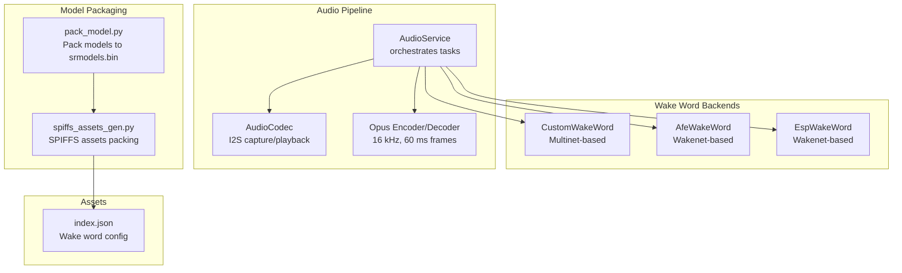
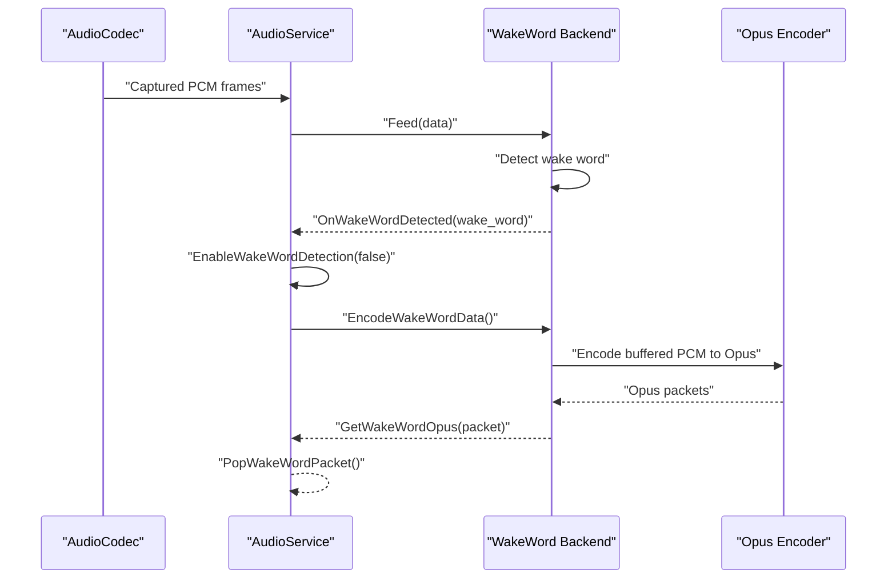
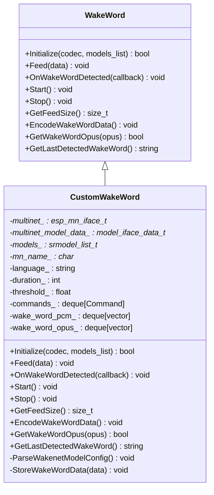
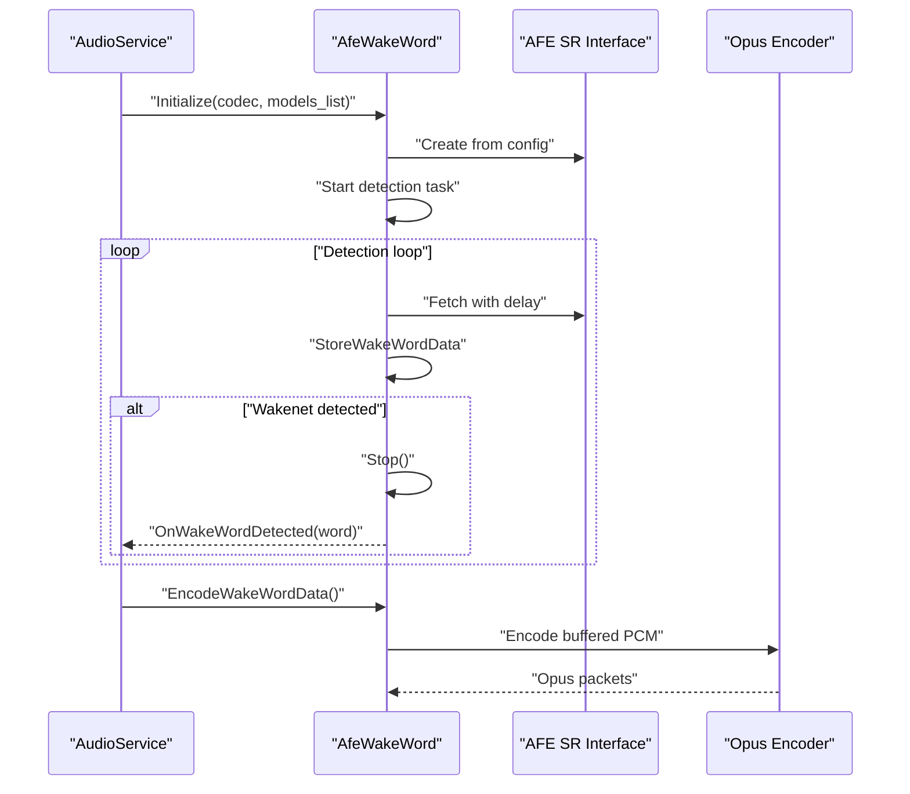
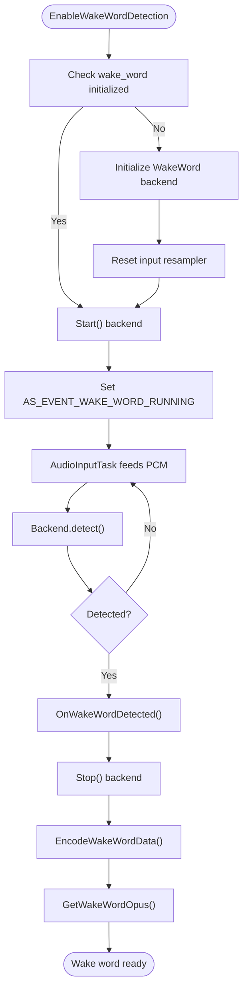
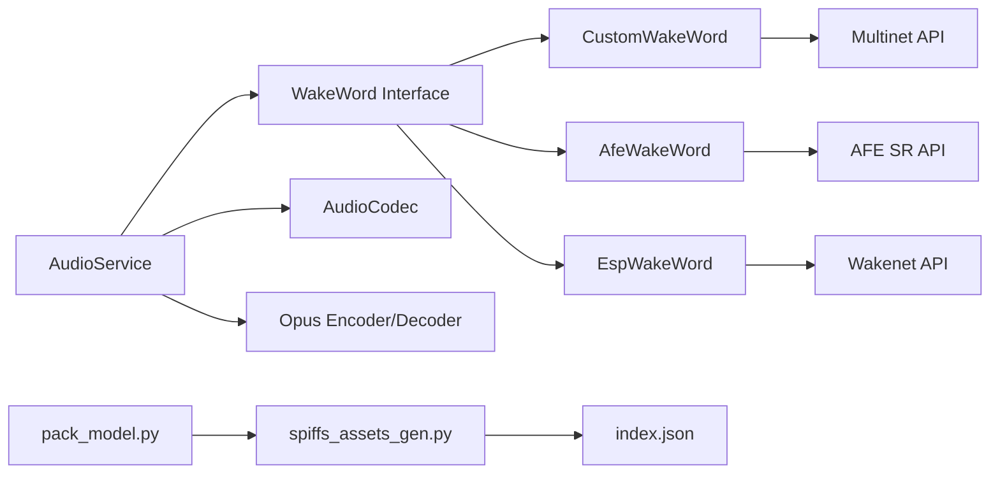

# Custom Wake Word System

<cite>
**Referenced Files in This Document**
- [custom_wake_word.h](file://main/audio/wake_words/custom_wake_word.h)
- [custom_wake_word.cc](file://main/audio/wake_words/custom_wake_word.cc)
- [afe_wake_word.h](file://main/audio/wake_words/afe_wake_word.h)
- [afe_wake_word.cc](file://main/audio/wake_words/afe_wake_word.cc)
- [esp_wake_word.h](file://main/audio/wake_words/esp_wake_word.h)
- [esp_wake_word.cc](file://main/audio/wake_words/esp_wake_word.cc)
- [wake_word.h](file://main/audio/wake_word.h)
- [audio_service.h](file://main/audio/audio_service.h)
- [audio_service.cc](file://main/audio/audio_service.cc)
- [audio_codec.h](file://main/audio/audio_codec.h)
- [audio_codec.cc](file://main/audio/audio_codec.cc)
- [pack_model.py](file://scripts/spiffs_assets/pack_model.py)
- [spiffs_assets_gen.py](file://scripts/spiffs_assets/spiffs_assets_gen.py)
- [index.json](file://main/boards/lulu-esp32s3/assets/index.json)
</cite>

## Table of Contents
1. [Introduction](#introduction)
2. [Project Structure](#project-structure)
3. [Core Components](#core-components)
4. [Architecture Overview](#architecture-overview)
5. [Detailed Component Analysis](#detailed-component-analysis)
6. [Dependency Analysis](#dependency-analysis)
7. [Performance Considerations](#performance-considerations)
8. [Troubleshooting Guide](#troubleshooting-guide)
9. [Conclusion](#conclusion)
10. [Appendices](#appendices)

## Introduction
This document explains the custom wake word system that enables user-defined wake word training and deployment on embedded devices. It covers the architecture, training pipeline, model conversion process, wake word filtering, model validation, integration with the detection pipeline, and deployment procedures. Practical examples, testing methodologies, performance evaluation, model size limitations, memory optimization, and integration challenges are included to guide developers through creating, validating, and deploying custom wake words effectively.

## Project Structure
The custom wake word system spans several modules:
- Wake word detection backends: AFE-based, ESP-based, and Multinet-based custom wake word implementations
- Audio pipeline: AudioService orchestrates capture, processing, encoding, and wake word detection
- Model packaging and asset generation: Tools to package and deploy models and assets to SPIFFS
- Configuration and assets: JSON-based configuration for wake word commands and assets indexing

**Diagram sources**
- [audio_service.cc:730-756](file://main/audio/audio_service.cc#L730-L756)
- [custom_wake_word.cc:85-129](file://main/audio/wake_words/custom_wake_word.cc#L85-L129)
- [afe_wake_word.cc:42-101](file://main/audio/wake_words/afe_wake_word.cc#L42-L101)
- [esp_wake_word.cc:17-45](file://main/audio/wake_words/esp_wake_word.cc#L17-L45)
- [pack_model.py:41-113](file://scripts/spiffs_assets/pack_model.py#L41-L113)
- [spiffs_assets_gen.py:391-462](file://scripts/spiffs_assets/spiffs_assets_gen.py#L391-L462)
- [index.json:1-26](file://main/boards/lulu-esp32s3/assets/index.json#L1-L26)

**Section sources**
- [audio_service.cc:730-756](file://main/audio/audio_service.cc#L730-L756)
- [pack_model.py:41-113](file://scripts/spiffs_assets/pack_model.py#L41-L113)
- [spiffs_assets_gen.py:391-462](file://scripts/spiffs_assets/spiffs_assets_gen.py#L391-L462)
- [index.json:1-26](file://main/boards/lulu-esp32s3/assets/index.json#L1-L26)

## Core Components
- WakeWord interface: Defines the contract for wake word backends (initialize, feed, detect, encode, etc.)
- CustomWakeWord: Multinet-based backend supporting user-defined commands via index.json configuration
- AfeWakeWord: Wakenet-based backend leveraging AFE SR for detection
- EspWakeWord: Wakenet-based backend for non-AFE targets
- AudioService: Central coordinator for audio capture, processing, wake word detection, and encoding
- AudioCodec: I2S abstraction for input/output and rate conversion
- Model packaging tools: pack_model.py and spiffs_assets_gen.py for building srmodels.bin and SPIFFS assets

Key responsibilities:
- Detection backends: Detect wake words, buffer short audio windows, and trigger callbacks
- AudioService: Manages task lifecycles, queues, and integrates wake word detection into the audio pipeline
- Model packaging: Ensures models and assets are packed and deployed correctly for runtime loading

**Section sources**
- [wake_word.h:11-24](file://main/audio/wake_word.h#L11-L24)
- [custom_wake_word.h:20-69](file://main/audio/wake_words/custom_wake_word.h#L20-L69)
- [afe_wake_word.h:23-65](file://main/audio/wake_words/afe_wake_word.h#L23-L65)
- [esp_wake_word.h:17-43](file://main/audio/wake_words/esp_wake_word.h#L17-L43)
- [audio_service.h:106-202](file://main/audio/audio_service.h#L106-L202)
- [audio_codec.h:17-59](file://main/audio/audio_codec.h#L17-L59)

## Architecture Overview
The system integrates wake word detection with the audio pipeline. AudioService initializes and selects the appropriate backend based on available models. The selected backend buffers short PCM windows, detects wake words, and triggers callbacks. The system can optionally encode buffered audio to Opus for transmission or storage.

**Diagram sources**
- [audio_service.cc:564-580](file://main/audio/audio_service.cc#L564-L580)
- [custom_wake_word.cc:218-293](file://main/audio/wake_words/custom_wake_word.cc#L218-L293)
- [afe_wake_word.cc:183-264](file://main/audio/wake_words/afe_wake_word.cc#L183-L264)
- [esp_wake_word.cc:105-111](file://main/audio/wake_words/esp_wake_word.cc#L105-L111)

## Detailed Component Analysis

### WakeWord Interface
The WakeWord interface defines the common contract for all wake word backends:
- Initialize: Prepare backend with codec and model list
- Feed: Provide PCM chunks for detection
- OnWakeWordDetected: Register callback for detection events
- Start/Stop: Control detection lifecycle
- GetFeedSize: Required chunk size for feeding
- EncodeWakeWordData: Asynchronously encode buffered audio
- GetWakeWordOpus: Retrieve encoded packets
- GetLastDetectedWakeWord: Access the last detected wake word

Implementation differences:
- CustomWakeWord: Uses Multinet for command word detection and supports configurable commands via index.json
- AfeWakeWord: Uses AFE SR with built-in wake words
- EspWakeWord: Uses ESP Wakenet for single-word detection

**Section sources**
- [wake_word.h:11-24](file://main/audio/wake_word.h#L11-L24)

### CustomWakeWord (Multinet-based)
CustomWakeWord implements a flexible wake word detection system:
- Initialization
  - Loads model list and parses index.json for language, duration, threshold, and commands
  - Selects Multinet model by language prefix and sets detection threshold
  - Registers active speech commands for detection
- Detection loop
  - Buffers PCM data, feeds Multinet in chunk sizes, and checks detection state
  - On detection, retrieves command ID, maps to configured command, and triggers callback
- Audio buffering and encoding
  - Stores up to approximately 2 seconds of PCM chunks for later encoding
  - Encodes buffered PCM to Opus in a dedicated task and exposes packets via GetWakeWordOpus

**Diagram sources**
- [wake_word.h:11-24](file://main/audio/wake_word.h#L11-L24)
- [custom_wake_word.h:20-69](file://main/audio/wake_words/custom_wake_word.h#L20-L69)

**Section sources**
- [custom_wake_word.cc:37-129](file://main/audio/wake_words/custom_wake_word.cc#L37-L129)
- [custom_wake_word.cc:209-293](file://main/audio/wake_words/custom_wake_word.cc#L209-L293)

### AfeWakeWord (AFE-based)
AfeWakeWord leverages AFE SR for wake word detection:
- Initialization
  - Scans model list for Wakenet models and extracts wake words
  - Configures AFE SR with input format and performance mode
  - Creates a static detection task in PSRAM
- Detection loop
  - Feeds PCM chunks to AFE SR and waits for detection events
  - On detection, stops detection, stores wake word, and triggers callback
- Encoding
  - Buffers PCM chunks and encodes to Opus in a dedicated task

**Diagram sources**
- [afe_wake_word.cc:42-101](file://main/audio/wake_words/afe_wake_word.cc#L42-L101)
- [afe_wake_word.cc:146-172](file://main/audio/wake_words/afe_wake_word.cc#L146-L172)
- [afe_wake_word.cc:183-264](file://main/audio/wake_words/afe_wake_word.cc#L183-L264)

**Section sources**
- [afe_wake_word.cc:42-101](file://main/audio/wake_words/afe_wake_word.cc#L42-L101)
- [afe_wake_word.cc:146-172](file://main/audio/wake_words/afe_wake_word.cc#L146-L172)
- [afe_wake_word.cc:183-264](file://main/audio/wake_words/afe_wake_word.cc#L183-L264)

### EspWakeWord (ESP-based)
EspWakeWord provides a lightweight wake word detection backend for non-AFE targets:
- Initialization
  - Initializes model list and selects the first available Wakenet model
  - Retrieves sample rate and chunk size for detection
- Detection loop
  - Buffers PCM data and feeds Wakenet detector
  - On detection, clears buffer and triggers callback
- Encoding
  - No-op for this backend (no audio encoding)

**Section sources**
- [esp_wake_word.cc:17-45](file://main/audio/wake_words/esp_wake_word.cc#L17-L45)
- [esp_wake_word.cc:62-96](file://main/audio/wake_words/esp_wake_word.cc#L62-L96)
- [esp_wake_word.cc:105-111](file://main/audio/wake_words/esp_wake_word.cc#L105-L111)

### AudioService Integration
AudioService coordinates wake word detection and audio pipeline:
- Backend selection
  - Chooses CustomWakeWord if Multinet models are available, otherwise AfeWakeWord (S3/P4) or EspWakeWord (non-S3)
- Lifecycle management
  - Initializes backends, resets resamplers when switching modes, and controls detection via event groups
- Audio pipeline integration
  - Feeds PCM to wake word backend and audio processor concurrently
  - Encodes wake word audio to Opus and exposes packets for downstream use

**Diagram sources**
- [audio_service.cc:582-610](file://main/audio/audio_service.cc#L582-L610)
- [audio_service.cc:263-321](file://main/audio/audio_service.cc#L263-L321)
- [audio_service.cc:564-580](file://main/audio/audio_service.cc#L564-L580)

**Section sources**
- [audio_service.cc:582-610](file://main/audio/audio_service.cc#L582-L610)
- [audio_service.cc:263-321](file://main/audio/audio_service.cc#L263-L321)
- [audio_service.cc:564-580](file://main/audio/audio_service.cc#L564-L580)

### Model Configuration and Validation
- index.json parsing
  - CustomWakeWord reads index.json to configure language, detection duration, threshold, and command list
  - Commands define command IDs, display text, and actions (e.g., "wake")
- Model availability validation
  - Backend initialization verifies model lists and filters for appropriate prefixes
  - Logs fallback behavior when language-specific models are unavailable

**Section sources**
- [custom_wake_word.cc:37-82](file://main/audio/wake_words/custom_wake_word.cc#L37-L82)
- [custom_wake_word.cc:85-129](file://main/audio/wake_words/custom_wake_word.cc#L85-L129)

### Model Packaging and Deployment
- pack_model.py
  - Packs multiple models into a single srmodels.bin with model headers and file metadata
- spiffs_assets_gen.py
  - Copies and converts assets, generates mmap headers, and merges assets into a single binary for SPIFFS
- index.json
  - Provides wake word configuration embedded in assets for runtime parsing

**Section sources**
- [pack_model.py:41-113](file://scripts/spiffs_assets/pack_model.py#L41-L113)
- [spiffs_assets_gen.py:391-462](file://scripts/spiffs_assets/spiffs_assets_gen.py#L391-L462)
- [index.json:1-26](file://main/boards/lulu-esp32s3/assets/index.json#L1-L26)

## Dependency Analysis
The wake word system exhibits layered dependencies:
- WakeWord interface decouples backends from AudioService
- AudioService depends on AudioCodec for I/O and on Opus for encoding
- Backends depend on ESP-IDF speech recognition APIs (Multinet, AFE SR, Wakenet)
- Model packaging tools depend on Python and PIL for asset conversion

**Diagram sources**
- [audio_service.cc:730-756](file://main/audio/audio_service.cc#L730-L756)
- [custom_wake_word.cc:106-129](file://main/audio/wake_words/custom_wake_word.cc#L106-L129)
- [afe_wake_word.cc:84-101](file://main/audio/wake_words/afe_wake_word.cc#L84-L101)
- [esp_wake_word.cc:36-45](file://main/audio/wake_words/esp_wake_word.cc#L36-L45)
- [pack_model.py:41-113](file://scripts/spiffs_assets/pack_model.py#L41-L113)
- [spiffs_assets_gen.py:391-462](file://scripts/spiffs_assets/spiffs_assets_gen.py#L391-L462)
- [index.json:1-26](file://main/boards/lulu-esp32s3/assets/index.json#L1-L26)

**Section sources**
- [audio_service.cc:730-756](file://main/audio/audio_service.cc#L730-L756)
- [custom_wake_word.cc:106-129](file://main/audio/wake_words/custom_wake_word.cc#L106-L129)
- [afe_wake_word.cc:84-101](file://main/audio/wake_words/afe_wake_word.cc#L84-L101)
- [esp_wake_word.cc:36-45](file://main/audio/wake_words/esp_wake_word.cc#L36-L45)
- [pack_model.py:41-113](file://scripts/spiffs_assets/pack_model.py#L41-L113)
- [spiffs_assets_gen.py:391-462](file://scripts/spiffs_assets/spiffs_assets_gen.py#L391-L462)
- [index.json:1-26](file://main/boards/lulu-esp32s3/assets/index.json#L1-L26)

## Performance Considerations
- Memory optimization
  - Detection tasks and encoder tasks allocate static stacks in PSRAM to reduce heap pressure
  - Buffered PCM windows limit memory footprint to approximately 2 seconds
- Throughput and latency
  - Opus frame duration is 60 ms; encoder/decoder frame sizes are derived from configuration
  - AudioService uses bounded queues to prevent unbounded growth and backpressure
- Power management
  - AudioService monitors input/output activity and powers down I/O when idle beyond a timeout

Recommendations:
- Tune detection duration and threshold to balance false positives and missed detections
- Monitor queue sizes and adjust frame durations to maintain real-time performance
- Prefer PSRAM allocations for large buffers and tasks to avoid heap fragmentation

**Section sources**
- [audio_service.h:40-77](file://main/audio/audio_service.h#L40-L77)
- [audio_service.cc:131-200](file://main/audio/audio_service.cc#L131-L200)
- [custom_wake_word.cc:218-293](file://main/audio/wake_words/custom_wake_word.cc#L218-L293)
- [afe_wake_word.cc:183-264](file://main/audio/wake_words/afe_wake_word.cc#L183-L264)

## Troubleshooting Guide
Common issues and resolutions:
- Model initialization failures
  - Verify model list contains expected prefixes (Multinet, Wakenet) and that filtering succeeds
  - Check index.json presence and validity for CustomWakeWord
- Detection not triggering
  - Confirm detection threshold and duration settings
  - Ensure Feed is called with correct chunk sizes returned by GetFeedSize
- Audio encoding errors
  - Validate encoder configuration and frame sizes
  - Confirm PCM buffer alignment and frame boundaries
- Memory issues
  - Ensure PSRAM stacks are allocated and static tasks are used for detection and encoding
  - Monitor queue depths and adjust limits if backpressure occurs

Operational tips:
- Use logging to confirm backend selection and initialization steps
- Test with minimal configurations (single wake word) before adding complexity
- Validate model packaging and SPIFFS assets before deployment

**Section sources**
- [custom_wake_word.cc:85-129](file://main/audio/wake_words/custom_wake_word.cc#L85-L129)
- [afe_wake_word.cc:42-101](file://main/audio/wake_words/afe_wake_word.cc#L42-L101)
- [esp_wake_word.cc:17-45](file://main/audio/wake_words/esp_wake_word.cc#L17-L45)
- [audio_service.cc:582-610](file://main/audio/audio_service.cc#L582-L610)

## Conclusion
The custom wake word system provides a robust, modular framework for user-defined wake word training and deployment. By leveraging Multinet, AFE SR, or ESP Wakenet depending on platform capabilities, it integrates seamlessly with the audio pipeline. Proper model packaging, configuration validation, and memory-conscious design ensure reliable operation under real-world constraints.

## Appendices

### Step-by-Step: Creating a Custom Wake Word
1. Prepare training data
   - Collect audio samples for each wake word variant
   - Ensure consistent recording conditions and sample rates
2. Train and export models
   - Use training tools to produce Multinet/Wakenet models
   - Package models into a single srmodels.bin using pack_model.py
3. Configure commands
   - Define language, duration, threshold, and commands in index.json
   - Map command IDs to display text and actions
4. Build and deploy assets
   - Run spiffs_assets_gen.py to pack assets and generate mmap headers
   - Flash firmware and verify model loading
5. Integrate with detection pipeline
   - Enable wake word detection via AudioService
   - Validate detection behavior and tune thresholds
6. Encode and transmit
   - Trigger EncodeWakeWordData and retrieve Opus packets via GetWakeWordOpus

**Section sources**
- [pack_model.py:41-113](file://scripts/spiffs_assets/pack_model.py#L41-L113)
- [spiffs_assets_gen.py:391-462](file://scripts/spiffs_assets/spiffs_assets_gen.py#L391-L462)
- [custom_wake_word.cc:37-82](file://main/audio/wake_words/custom_wake_word.cc#L37-L82)
- [audio_service.cc:582-610](file://main/audio/audio_service.cc#L582-L610)

### Testing Methodologies and Evaluation
- Detection accuracy
  - Measure precision and recall across multiple variants and environments
- Latency and throughput
  - Track detection latency and queue depths under load
- Memory usage
  - Profile static stack usage and heap fragmentation
- Robustness
  - Evaluate performance with noise, reverberation, and varying SNR

**Section sources**
- [audio_service.h:40-77](file://main/audio/audio_service.h#L40-L77)
- [custom_wake_word.cc:218-293](file://main/audio/wake_words/custom_wake_word.cc#L218-L293)
- [afe_wake_word.cc:183-264](file://main/audio/wake_words/afe_wake_word.cc#L183-L264)

### Model Size Limitations and Memory Optimization
- Model size
  - srmodels.bin size impacts flash and RAM usage; ensure partition sizing accommodates models and assets
- Memory allocation
  - Use PSRAM for large buffers and static task stacks
  - Limit buffered PCM to short windows to constrain memory usage
- Queue sizing
  - Adjust queue capacities to prevent overflow and maintain responsiveness

**Section sources**
- [pack_model.py:41-113](file://scripts/spiffs_assets/pack_model.py#L41-L113)
- [spiffs_assets_gen.py:590-601](file://scripts/spiffs_assets/spiffs_assets_gen.py#L590-L601)
- [audio_service.h:40-46](file://main/audio/audio_service.h#L40-L46)
- [custom_wake_word.cc:218-293](file://main/audio/wake_words/custom_wake_word.cc#L218-L293)