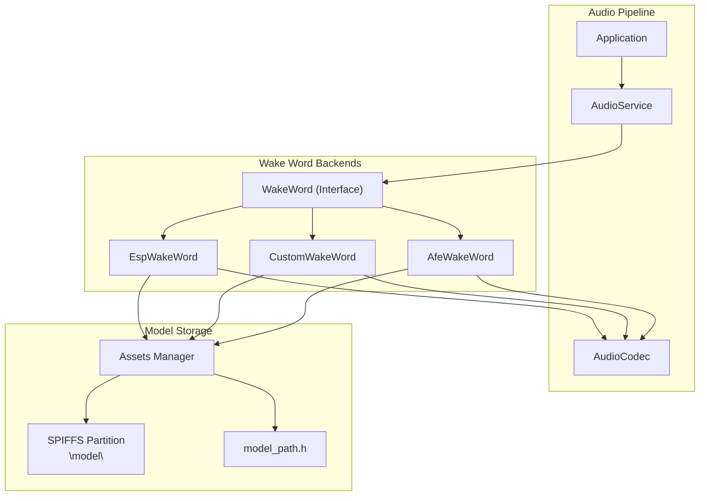
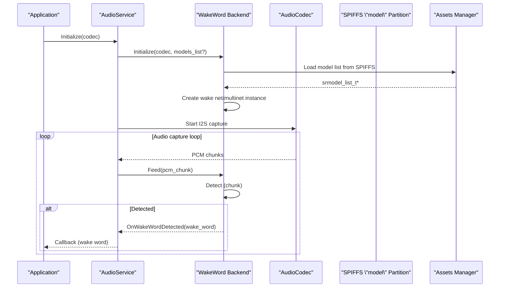
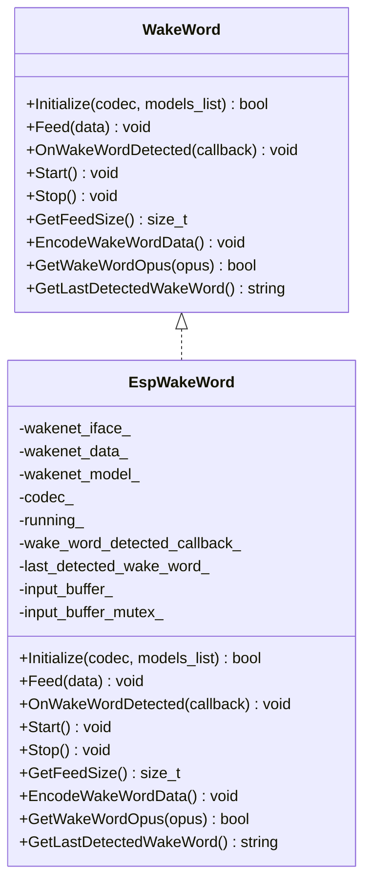
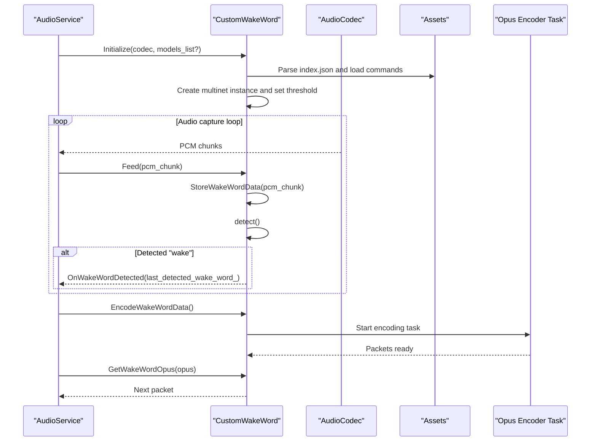
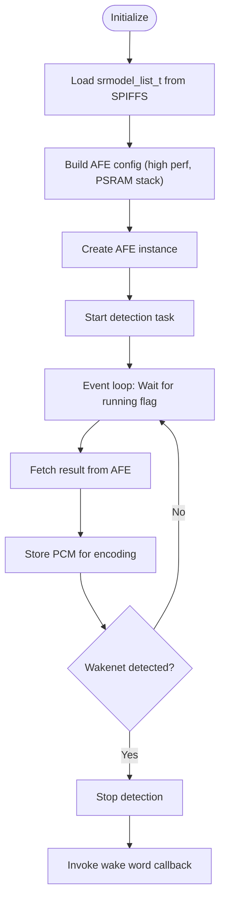
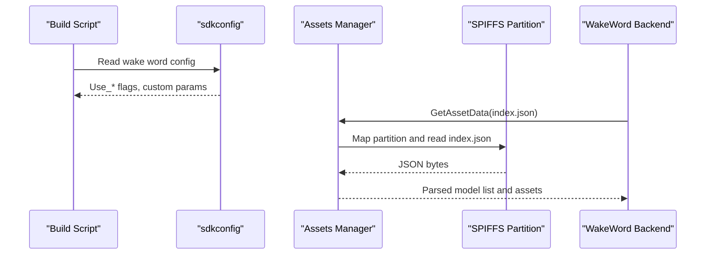
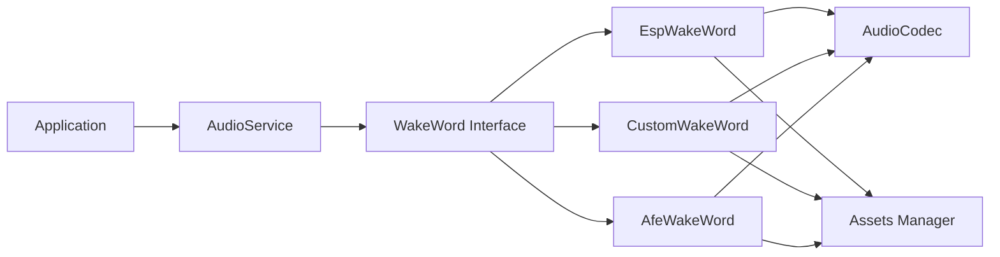

# ESP Wake Word Implementation

<cite>
**Referenced Files in This Document**
- [esp_wake_word.h](file://main/audio/wake_words/esp_wake_word.h)
- [esp_wake_word.cc](file://main/audio/wake_words/esp_wake_word.cc)
- [custom_wake_word.h](file://main/audio/wake_words/custom_wake_word.h)
- [custom_wake_word.cc](file://main/audio/wake_words/custom_wake_word.cc)
- [afe_wake_word.h](file://main/audio/wake_words/afe_wake_word.h)
- [afe_wake_word.cc](file://main/audio/wake_words/afe_wake_word.cc)
- [wake_word.h](file://main/audio/wake_word.h)
- [audio_codec.h](file://main/audio/audio_codec.h)
- [audio_service.h](file://main/audio/audio_service.h)
- [assets.h](file://main/assets.h)
- [assets.cc](file://main/assets.cc)
- [application.h](file://main/application.h)
- [build_default_assets.py](file://scripts/build_default_assets.py)
- [model_path.h](file://managed_components/espressif__esp-sr/src/include/model_path.h)
- [4m_esp-hi.csv](file://partitions/v1/4m_esp-hi.csv)
</cite>

## Table of Contents
1. [Introduction](#introduction)
2. [Project Structure](#project-structure)
3. [Core Components](#core-components)
4. [Architecture Overview](#architecture-overview)
5. [Detailed Component Analysis](#detailed-component-analysis)
6. [Dependency Analysis](#dependency-analysis)
7. [Performance Considerations](#performance-considerations)
8. [Troubleshooting Guide](#troubleshooting-guide)
9. [Conclusion](#conclusion)
10. [Appendices](#appendices)

## Introduction
This document explains the ESP wake word detection implementation for non-ESP32-S3 platforms. It covers the architecture, software-based detection algorithms, and the model processing pipeline. It documents initialization sequences, model loading from SPIFFS, detection parameter configuration, the wake word callback mechanism, integration with ESP-SR models, and performance optimization techniques. Platform-specific considerations, memory management, and CPU utilization strategies are included, along with configuration examples and troubleshooting guidance.

## Project Structure
The wake word subsystem is implemented as a set of interchangeable wake word backends that share a common interface. The primary components are:
- Base interface: WakeWord
- Backends:
  - EspWakeWord: Software-based wake word detection using ESP-SR wake net models
  - CustomWakeWord: Multinet-based custom wake word detection with configurable commands and thresholds
  - AfeWakeWord: Hardware-accelerated wake word detection via AFE SR pipeline
- Supporting infrastructure:
  - AudioCodec: Audio input/output abstraction
  - AudioService: Orchestrates audio pipeline, wake word detection, and encoding
  - Assets: SPIFFS-backed model and resource loader
  - Application: Top-level orchestrator that wires wake word detection into the system

**Diagram sources**
- [wake_word.h:11-24](file://main/audio/wake_word.h#L11-L24)
- [esp_wake_word.h:17-43](file://main/audio/wake_words/esp_wake_word.h#L17-L43)
- [custom_wake_word.h:20-69](file://main/audio/wake_words/custom_wake_word.h#L20-L69)
- [afe_wake_word.h:23-65](file://main/audio/wake_words/afe_wake_word.h#L23-L65)
- [audio_codec.h:17-59](file://main/audio/audio_codec.h#L17-L59)
- [audio_service.h:106-202](file://main/audio/audio_service.h#L106-L202)
- [assets.h:23-41](file://main/assets.h#L23-L41)
- [model_path.h](file://managed_components/espressif__esp-sr/src/include/model_path.h)

**Section sources**
- [wake_word.h:1-27](file://main/audio/wake_word.h#L1-L27)
- [audio_codec.h:1-62](file://main/audio/audio_codec.h#L1-L62)
- [audio_service.h:1-204](file://main/audio/audio_service.h#L1-L204)
- [assets.h:1-41](file://main/assets.h#L1-L41)

## Core Components
- WakeWord interface defines the contract for all wake word backends, including initialization, feeding audio chunks, starting/stopping detection, and retrieving encoded wake word data.
- EspWakeWord implements software-based wake word detection using ESP-SR wake net models. It loads a model list from SPIFFS, creates a wake net instance, and performs detection in chunks.
- CustomWakeWord implements multinet-based custom wake word detection with configurable commands, language, duration, and threshold. It stores wake word audio for later encoding and supports asynchronous Opus encoding.
- AfeWakeWord integrates with the AFE SR pipeline for hardware-accelerated wake word detection, feeding frames into the AFE and fetching results in a dedicated task.
- AudioCodec abstracts I2S input/output and exposes sample rate, channels, and gain controls used by all backends.
- AudioService coordinates wake word detection, audio capture, and encoding, and exposes callbacks for wake word detection events.
- Assets manages SPIFFS partition mapping and provides model/resource access used by the wake word backends.

**Section sources**
- [wake_word.h:11-24](file://main/audio/wake_word.h#L11-L24)
- [esp_wake_word.h:17-43](file://main/audio/wake_words/esp_wake_word.h#L17-L43)
- [custom_wake_word.h:20-69](file://main/audio/wake_words/custom_wake_word.h#L20-L69)
- [afe_wake_word.h:23-65](file://main/audio/wake_words/afe_wake_word.h#L23-L65)
- [audio_codec.h:17-59](file://main/audio/audio_codec.h#L17-L59)
- [audio_service.h:106-202](file://main/audio/audio_service.h#L106-L202)
- [assets.h:23-41](file://main/assets.h#L23-L41)

## Architecture Overview
The wake word detection pipeline is initialized by AudioService, which selects a backend (EspWakeWord, CustomWakeWord, or AfeWakeWord) based on configuration. The selected backend initializes ESP-SR models from the SPIFFS “model” partition via the Assets manager and model_path.h. Detection proceeds in fixed-size audio chunks supplied by AudioCodec. Upon detection, the backend invokes a callback registered with AudioService, which propagates the event to Application.

**Diagram sources**
- [audio_service.h:111-136](file://main/audio/audio_service.h#L111-L136)
- [esp_wake_word.cc:17-45](file://main/audio/wake_words/esp_wake_word.cc#L17-L45)
- [custom_wake_word.cc:85-129](file://main/audio/wake_words/custom_wake_word.cc#L85-L129)
- [afe_wake_word.cc:42-101](file://main/audio/wake_words/afe_wake_word.cc#L42-L101)
- [assets.cc:130-260](file://main/assets.cc#L130-L260)

## Detailed Component Analysis

### EspWakeWord: Software-Based Wake Word Detection
EspWakeWord uses ESP-SR wake net models to perform software-based detection. It initializes a model list from the “model” SPIFFS partition, selects the first available wake net model, and creates a wake net instance with a detection mode. It feeds PCM data into the detector in chunks sized according to the model’s requirements and triggers a callback upon detection.

Key behaviors:
- Initialization: Loads srmodel_list_t from SPIFFS, selects the first model, retrieves interface handle, and creates a wake net instance with a detection mode.
- Feed: Buffers input PCM (downmixes to mono if stereo), detects in chunks, clears buffers on detection, and invokes the callback.
- Callback: Propagates the detected wake word string to the registered callback.

**Diagram sources**
- [wake_word.h:11-24](file://main/audio/wake_word.h#L11-L24)
- [esp_wake_word.h:17-43](file://main/audio/wake_words/esp_wake_word.h#L17-L43)

**Section sources**
- [esp_wake_word.h:17-43](file://main/audio/wake_words/esp_wake_word.h#L17-L43)
- [esp_wake_word.cc:17-45](file://main/audio/wake_words/esp_wake_word.cc#L17-L45)
- [esp_wake_word.cc:62-96](file://main/audio/wake_words/esp_wake_word.cc#L62-L96)

### CustomWakeWord: Multinet-Based Custom Commands
CustomWakeWord implements multinet-based detection with configurable commands and thresholds. It parses an index.json from SPIFFS to configure language, duration, threshold, and command definitions. It stores recent PCM chunks for later encoding and provides asynchronous Opus encoding via a dedicated task.

Key behaviors:
- Initialization: Loads srmodel_list_t from SPIFFS, filters for multinet models, applies language fallback, sets detection threshold, and registers speech commands.
- Feed: Buffers PCM, detects in chunks, cleans detection state on timeout, and triggers callback for matched commands marked as “wake”.
- Encoding: Asynchronously encodes stored PCM chunks to Opus packets and signals completion.

**Diagram sources**
- [custom_wake_word.cc:85-129](file://main/audio/wake_words/custom_wake_word.cc#L85-L129)
- [custom_wake_word.cc:146-200](file://main/audio/wake_words/custom_wake_word.cc#L146-L200)
- [custom_wake_word.cc:218-293](file://main/audio/wake_words/custom_wake_word.cc#L218-L293)
- [assets.cc:130-260](file://main/assets.cc#L130-L260)

**Section sources**
- [custom_wake_word.h:20-69](file://main/audio/wake_words/custom_wake_word.h#L20-L69)
- [custom_wake_word.cc:37-82](file://main/audio/wake_words/custom_wake_word.cc#L37-L82)
- [custom_wake_word.cc:85-129](file://main/audio/wake_words/custom_wake_word.cc#L85-L129)
- [custom_wake_word.cc:146-200](file://main/audio/wake_words/custom_wake_word.cc#L146-L200)
- [custom_wake_word.cc:218-293](file://main/audio/wake_words/custom_wake_word.cc#L218-L293)

### AfeWakeWord: Hardware-Accelerated Detection
AfeWakeWord integrates with the AFE SR pipeline for hardware-accelerated wake word detection. It configures AFE with preferred core/priority and allocates PSRAM-backed task stacks. A dedicated detection task continuously fetches results from the AFE and triggers the wake word callback upon detection.

Key behaviors:
- Initialization: Initializes srmodel_list_t, discovers wake net models, builds AFE configuration with AFE_TYPE_SR and AFE_MODE_HIGH_PERF, allocates static task stack in PSRAM, and starts the detection task.
- Feed: Buffers PCM and feeds it to AFE in sizes determined by the AFE interface.
- Detection: Runs a loop waiting for detection events, stores PCM for encoding, and triggers the callback.

**Diagram sources**
- [afe_wake_word.cc:42-101](file://main/audio/wake_words/afe_wake_word.cc#L42-L101)
- [afe_wake_word.cc:146-172](file://main/audio/wake_words/afe_wake_word.cc#L146-L172)

**Section sources**
- [afe_wake_word.h:23-65](file://main/audio/wake_words/afe_wake_word.h#L23-L65)
- [afe_wake_word.cc:42-101](file://main/audio/wake_words/afe_wake_word.cc#L42-L101)
- [afe_wake_word.cc:146-172](file://main/audio/wake_words/afe_wake_word.cc#L146-L172)

### Model Loading from SPIFFS and Configuration
Model loading is performed via the Assets manager, which maps the SPIFFS partition and reads model metadata and resources. The model_path.h header provides the model namespace used by ESP-SR APIs. The build script reads sdkconfig to determine which wake word backend to enable and extracts custom wake word configuration.

Key behaviors:
- Assets mapping: Validates partition, maps SPIFFS region, and exposes indexed assets including index.json and model binaries.
- Model selection: esp_srmodel_init("model") loads models from the “model” partition. The wake word backends select appropriate models (wake net or multinet) and configure detection parameters.
- Build-time configuration: The build script reads sdkconfig to enable a specific backend and extract custom wake word parameters (name, display text, threshold).

**Diagram sources**
- [assets.cc:130-260](file://main/assets.cc#L130-L260)
- [build_default_assets.py:531-621](file://scripts/build_default_assets.py#L531-L621)

**Section sources**
- [assets.h:23-41](file://main/assets.h#L23-L41)
- [assets.cc:130-260](file://main/assets.cc#L130-L260)
- [build_default_assets.py:531-621](file://scripts/build_default_assets.py#L531-L621)
- [model_path.h](file://managed_components/espressif__esp-sr/src/include/model_path.h)

## Dependency Analysis
The wake word backends depend on ESP-SR interfaces and the AudioCodec for audio acquisition. They share the WakeWord interface, enabling runtime selection. AudioService composes the backends and provides callbacks to Application. Assets supplies model lists and resources from SPIFFS.

**Diagram sources**
- [wake_word.h:11-24](file://main/audio/wake_word.h#L11-L24)
- [esp_wake_word.h:17-43](file://main/audio/wake_words/esp_wake_word.h#L17-L43)
- [custom_wake_word.h:20-69](file://main/audio/wake_words/custom_wake_word.h#L20-L69)
- [afe_wake_word.h:23-65](file://main/audio/wake_words/afe_wake_word.h#L23-L65)
- [audio_codec.h:17-59](file://main/audio/audio_codec.h#L17-L59)
- [audio_service.h:106-202](file://main/audio/audio_service.h#L106-L202)
- [assets.h:23-41](file://main/assets.h#L23-L41)

**Section sources**
- [audio_service.h:106-202](file://main/audio/audio_service.h#L106-L202)
- [application.h:142-143](file://main/application.h#L142-L143)

## Performance Considerations
- Chunk sizing: Backends rely on model-provided chunk sizes to balance latency and accuracy. EspWakeWord and CustomWakeWord compute chunk sizes from the model interface; AfeWakeWord uses AFE-provided feed/fetch sizes.
- Memory allocation: AfeWakeWord and CustomWakeWord allocate static task stacks in PSRAM to reduce DRAM pressure and improve real-time performance.
- Threading: AfeWakeWord runs detection in a dedicated task; CustomWakeWord runs encoding in a separate task to avoid blocking the audio pipeline.
- CPU utilization: AFE-based detection offloads work to hardware accelerators. Software-based detection should be tuned to the detection threshold and chunk size to minimize false positives and missed detections.
- Power and idle: AudioService tracks power-related timers and can gate audio tasks to save power when idle.

[No sources needed since this section provides general guidance]

## Troubleshooting Guide
Common issues and resolutions:
- No model found or initialization failure:
  - Verify the “model” SPIFFS partition is present and contains valid model assets.
  - Confirm model_path.h and Assets mapping are functional.
- Detection not triggering:
  - Check detection chunk size and sample rate match the model requirements.
  - Adjust detection threshold for CustomWakeWord or ensure proper wake word configuration.
- Audio quality or artifacts:
  - Validate AudioCodec settings (sample rate, channels, gain).
  - Ensure I2S DMA descriptors and frame sizes are configured appropriately.
- Memory errors or PSRAM allocation failures:
  - Confirm PSRAM is enabled and sufficient capacity exists for static task stacks.
  - Review partition layout and ensure the “model” partition size accommodates models.

**Section sources**
- [esp_wake_word.cc:26-35](file://main/audio/wake_words/esp_wake_word.cc#L26-L35)
- [custom_wake_word.cc:101-116](file://main/audio/wake_words/custom_wake_word.cc#L101-L116)
- [afe_wake_word.cc:87-98](file://main/audio/wake_words/afe_wake_word.cc#L87-L98)
- [audio_codec.h:14-15](file://main/audio/audio_codec.h#L14-L15)
- [4m_esp-hi.csv:6](file://partitions/v1/4m_esp-hi.csv#L6)

## Conclusion
The ESP wake word implementation provides three complementary detection strategies: software-based EspWakeWord, multinet-based CustomWakeWord, and hardware-accelerated AfeWakeWord. All backends integrate with ESP-SR models loaded from SPIFFS via Assets and model_path.h, and they expose a unified WakeWord interface for seamless selection and operation. Proper configuration of detection parameters, memory allocation, and threading ensures robust performance across non-ESP32-S3 platforms.

[No sources needed since this section summarizes without analyzing specific files]

## Appendices

### Configuration Examples
- Enabling a backend via sdkconfig:
  - Use the build script to read sdkconfig and enable a specific backend (EspWakeWord, CustomWakeWord, or AfeWakeWord).
- Custom wake word configuration:
  - Define wake word name, display text, and threshold in sdkconfig; the build script converts threshold to a decimal value for runtime use.
- SPIFFS partition layout:
  - Ensure the “model” partition exists and is large enough to hold the selected models and assets.

**Section sources**
- [build_default_assets.py:531-621](file://scripts/build_default_assets.py#L531-L621)
- [4m_esp-hi.csv:6](file://partitions/v1/4m_esp-hi.csv#L6)