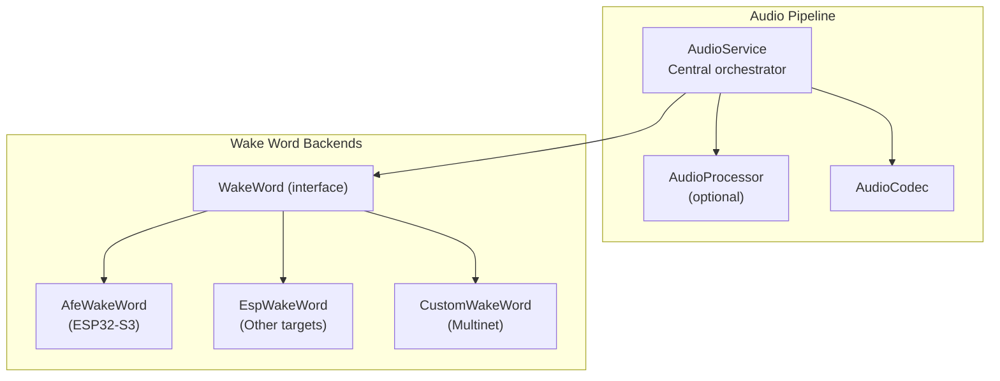
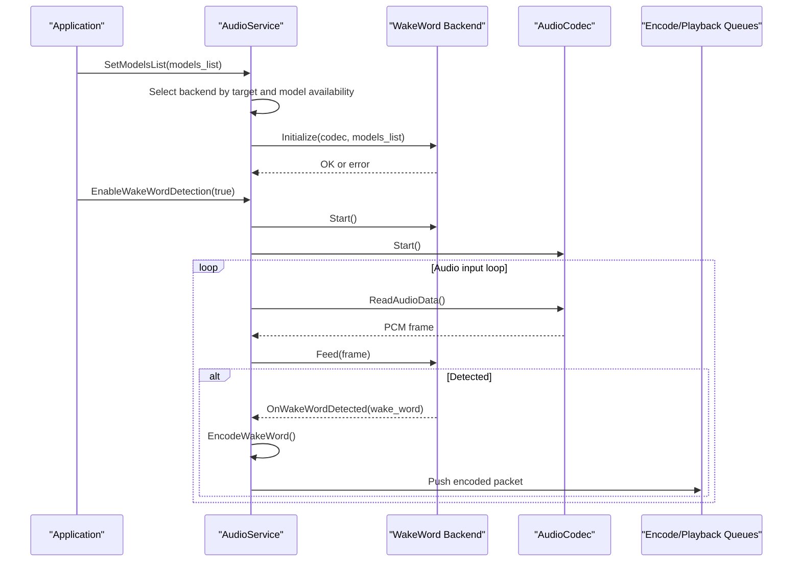
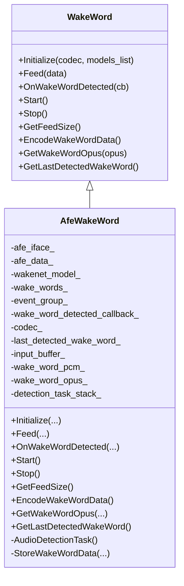
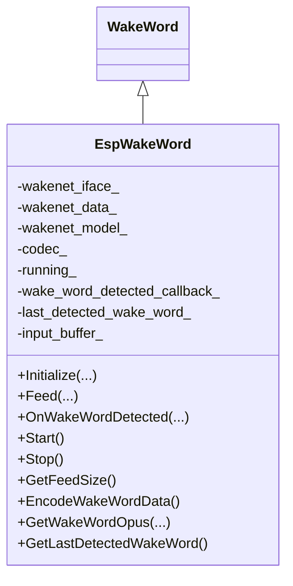
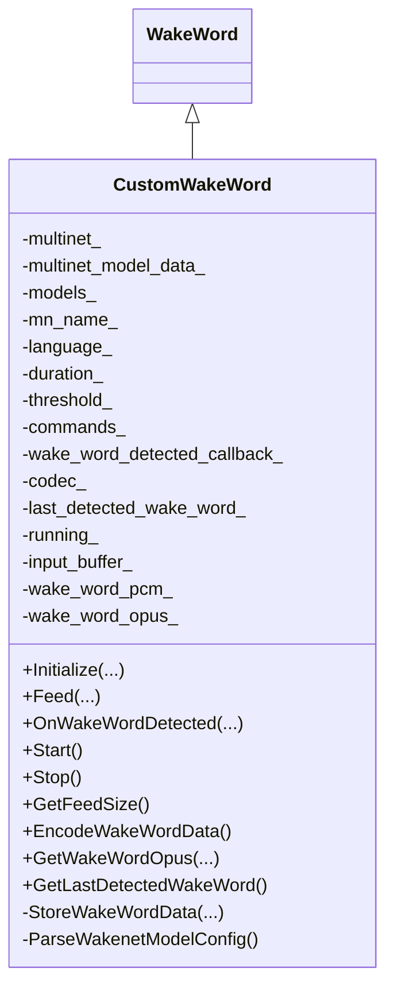
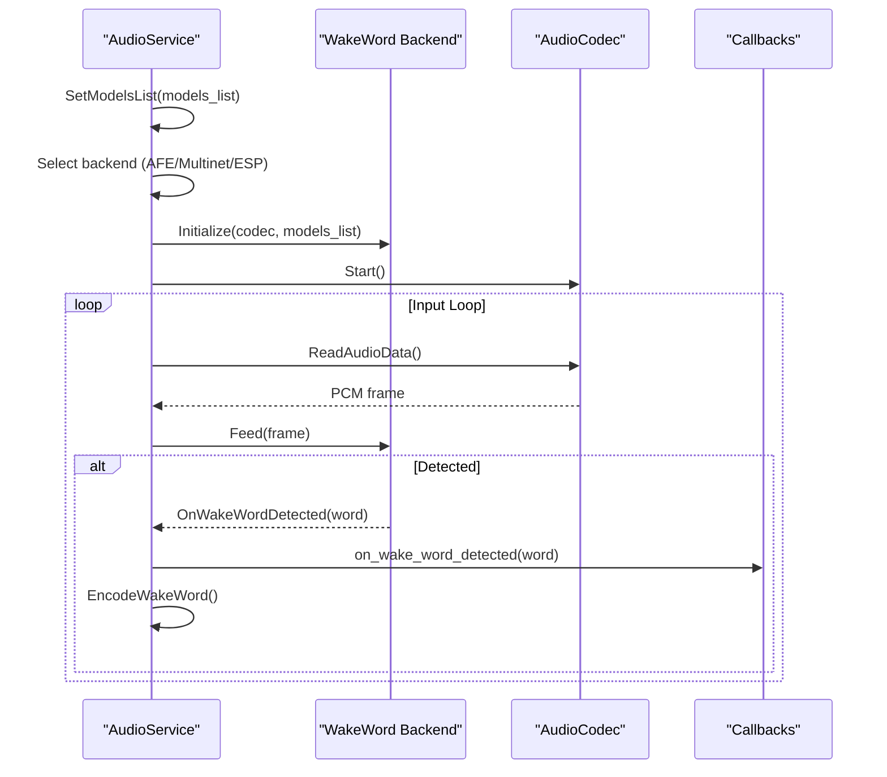
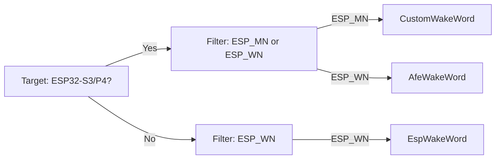

# Wake Word Detection System

<cite>
**Referenced Files in This Document**
- [wake_word.h](file://main/audio/wake_word.h)
- [afe_wake_word.h](file://main/audio/wake_words/afe_wake_word.h)
- [afe_wake_word.cc](file://main/audio/wake_words/afe_wake_word.cc)
- [esp_wake_word.h](file://main/audio/wake_words/esp_wake_word.h)
- [esp_wake_word.cc](file://main/audio/wake_words/esp_wake_word.cc)
- [custom_wake_word.h](file://main/audio/wake_words/custom_wake_word.h)
- [custom_wake_word.cc](file://main/audio/wake_words/custom_wake_word.cc)
- [audio_service.h](file://main/audio/audio_service.h)
- [audio_service.cc](file://main/audio/audio_service.cc)
- [sdkconfig.defaults](file://sdkconfig.defaults)
- [sdkconfig.defaults.esp32s3](file://sdkconfig.defaults.esp32s3)
- [config.json](file://main/boards/lulu-esp32s3/config.json)
- [emote_config.json](file://main/boards/lulu-esp32s3/emote_config.json)
- [build_default_assets.py](file://scripts/build_default_assets.py)
</cite>

## Table of Contents
1. [Introduction](#introduction)
2. [Project Structure](#project-structure)
3. [Core Components](#core-components)
4. [Architecture Overview](#architecture-overview)
5. [Detailed Component Analysis](#detailed-component-analysis)
6. [Dependency Analysis](#dependency-analysis)
7. [Performance Considerations](#performance-considerations)
8. [Troubleshooting Guide](#troubleshooting-guide)
9. [Conclusion](#conclusion)
10. [Appendices](#appendices)

## Introduction
This document explains the wake word detection system used in the project. It covers the wake word architecture, platform-specific implementations (AFE wake word for ESP32-S3 and ESP wake word for other targets), model loading and initialization, detection thresholds, callback integration with the main audio pipeline, custom wake word training and filtering, and performance/power optimization strategies for continuous listening modes.

## Project Structure
The wake word system is implemented as a pluggable interface with platform-specific backends and integrates with the central audio pipeline.

**Diagram sources**
- [audio_service.h:106-204](file://main/audio/audio_service.h#L106-L204)
- [audio_service.cc:31-36](file://main/audio/audio_service.cc#L31-L36)
- [audio_service.cc:730-756](file://main/audio/audio_service.cc#L730-L756)
- [wake_word.h:11-24](file://main/audio/wake_word.h#L11-L24)
- [afe_wake_word.h:23-65](file://main/audio/wake_words/afe_wake_word.h#L23-L65)
- [esp_wake_word.h:17-43](file://main/audio/wake_words/esp_wake_word.h#L17-L43)
- [custom_wake_word.h:20-69](file://main/audio/wake_words/custom_wake_word.h#L20-L69)

**Section sources**
- [audio_service.h:106-204](file://main/audio/audio_service.h#L106-L204)
- [audio_service.cc:31-36](file://main/audio/audio_service.cc#L31-L36)
- [audio_service.cc:730-756](file://main/audio/audio_service.cc#L730-L756)
- [wake_word.h:11-24](file://main/audio/wake_word.h#L11-L24)

## Core Components
- WakeWord interface defines the contract for wake word backends.
- AfeWakeWord: AFE-based wake word for ESP32-S3 with high-performance AFE configuration and Opus encoding support.
- EspWakeWord: ESP-IDF wake word backend for non-ESP32-S3 targets.
- CustomWakeWord: Multinet-based custom wake word with configurable commands, thresholds, and durations.
- AudioService: Central controller that initializes, selects, and runs the appropriate wake word backend, coordinates with the audio pipeline, and exposes callbacks.

Key responsibilities:
- Model discovery and initialization via model lists.
- Frame-based feeding and detection loop.
- Callback dispatch to the audio pipeline.
- Optional Opus encoding of captured wake word audio for downstream processing.

**Section sources**
- [wake_word.h:11-24](file://main/audio/wake_word.h#L11-L24)
- [afe_wake_word.h:23-65](file://main/audio/wake_words/afe_wake_word.h#L23-L65)
- [esp_wake_word.h:17-43](file://main/audio/wake_words/esp_wake_word.h#L17-L43)
- [custom_wake_word.h:20-69](file://main/audio/wake_words/custom_wake_word.h#L20-L69)
- [audio_service.cc:730-756](file://main/audio/audio_service.cc#L730-L756)

## Architecture Overview
The system dynamically selects a wake word backend based on the target and available models. The AudioService manages lifecycle, event groups, and queues, while each backend encapsulates detection logic and optional audio capture/encoding.

**Diagram sources**
- [audio_service.cc:582-610](file://main/audio/audio_service.cc#L582-L610)
- [audio_service.cc:62-123](file://main/audio/audio_service.cc#L62-L123)
- [audio_service.cc:263-321](file://main/audio/audio_service.cc#L263-L321)
- [audio_service.cc:730-756](file://main/audio/audio_service.cc#L730-L756)

## Detailed Component Analysis

### WakeWord Interface
Defines the unified API for all wake word backends:
- Initialize: prepare codec and model list.
- Feed: submit PCM frames for detection.
- OnWakeWordDetected: register callback for detection events.
- Start/Stop: control lifecycle.
- GetFeedSize: required frame size per backend.
- EncodeWakeWordData/GetWakeWordOpus: optional capture and Opus encoding.
- GetLastDetectedWakeWord: last detected wake word.

**Section sources**
- [wake_word.h:11-24](file://main/audio/wake_word.h#L11-L24)

### AfeWakeWord (ESP32-S3)
- Initializes ESP-SR AFE with high-performance settings and preferred core/priority.
- Uses AFE SR interface to feed PCM frames and fetch detection results.
- Maintains a ring buffer of recent PCM chunks for later encoding.
- Encodes captured audio to Opus in a dedicated static task with PSRAM stack.
- Detects wake word and triggers the registered callback.

**Diagram sources**
- [wake_word.h:11-24](file://main/audio/wake_word.h#L11-L24)
- [afe_wake_word.h:23-65](file://main/audio/wake_words/afe_wake_word.h#L23-L65)

**Section sources**
- [afe_wake_word.h:23-65](file://main/audio/wake_words/afe_wake_word.h#L23-L65)
- [afe_wake_word.cc:42-101](file://main/audio/wake_words/afe_wake_word.cc#L42-L101)
- [afe_wake_word.cc:146-172](file://main/audio/wake_words/afe_wake_word.cc#L146-L172)
- [afe_wake_word.cc:183-275](file://main/audio/wake_words/afe_wake_word.cc#L183-L275)

### EspWakeWord (Other Targets)
- Initializes ESP-IDF wake word interface from model list.
- Feeds PCM frames (downmixing to left channel if stereo).
- Detects wake word and stops further processing until re-enabled.

**Diagram sources**
- [wake_word.h:11-24](file://main/audio/wake_word.h#L11-L24)
- [esp_wake_word.h:17-43](file://main/audio/wake_words/esp_wake_word.h#L17-L43)

**Section sources**
- [esp_wake_word.h:17-43](file://main/audio/wake_words/esp_wake_word.h#L17-L43)
- [esp_wake_word.cc:17-45](file://main/audio/wake_words/esp_wake_word.cc#L17-L45)
- [esp_wake_word.cc:62-96](file://main/audio/wake_words/esp_wake_word.cc#L62-L96)

### CustomWakeWord (Multinet-based)
- Loads multinet models filtered by language and duration.
- Supports configurable commands and detection threshold.
- Captures wake word audio and encodes to Opus similarly to AFE backend.
- Integrates with the asset index to discover model configuration.

**Diagram sources**
- [wake_word.h:11-24](file://main/audio/wake_word.h#L11-L24)
- [custom_wake_word.h:20-69](file://main/audio/wake_words/custom_wake_word.h#L20-L69)

**Section sources**
- [custom_wake_word.h:20-69](file://main/audio/wake_words/custom_wake_word.h#L20-L69)
- [custom_wake_word.cc:85-129](file://main/audio/wake_words/custom_wake_word.cc#L85-L129)
- [custom_wake_word.cc:146-200](file://main/audio/wake_words/custom_wake_word.cc#L146-L200)
- [custom_wake_word.cc:218-293](file://main/audio/wake_words/custom_wake_word.cc#L218-L293)

### AudioService Integration
- Dynamically selects backend based on target and model availability.
- Initializes Opus encoder/decoder and resamplers.
- Runs audio input loop, feeds wake word and optional audio processor.
- Dispatches wake word detection via callback to the application.
- Manages power-aware input/output enabling/disabling.

**Diagram sources**
- [audio_service.cc:730-756](file://main/audio/audio_service.cc#L730-L756)
- [audio_service.cc:582-610](file://main/audio/audio_service.cc#L582-L610)
- [audio_service.cc:263-321](file://main/audio/audio_service.cc#L263-L321)

**Section sources**
- [audio_service.h:106-204](file://main/audio/audio_service.h#L106-L204)
- [audio_service.cc:62-123](file://main/audio/audio_service.cc#L62-L123)
- [audio_service.cc:263-321](file://main/audio/audio_service.cc#L263-L321)
- [audio_service.cc:582-610](file://main/audio/audio_service.cc#L582-L610)
- [audio_service.cc:730-756](file://main/audio/audio_service.cc#L730-L756)

## Dependency Analysis
- Platform selection:
  - ESP32-S3/P4: Prefer AFE-based wake word when available; otherwise Multinet.
  - Other targets: ESP wake word if available.
- Model filtering:
  - AFE: ESP-SR wake word models (prefix-based).
  - Multinet: ESP-MN models filtered by language/duration/threshold.
  - ESP: ESP-WN models via ESP-IDF interface.
- Hardware-specific optimizations:
  - AFE backend allocates static task stacks in PSRAM and sets preferred core/priority.
  - Opus encoder configured for low-latency, adaptive bitrate with DTX/VBR.

**Diagram sources**
- [audio_service.cc:733-747](file://main/audio/audio_service.cc#L733-L747)
- [custom_wake_word.cc:107-120](file://main/audio/wake_words/custom_wake_word.cc#L107-L120)
- [afe_wake_word.cc:56-68](file://main/audio/wake_words/afe_wake_word.cc#L56-L68)
- [esp_wake_word.cc:36-44](file://main/audio/wake_words/esp_wake_word.cc#L36-L44)

**Section sources**
- [audio_service.cc:733-747](file://main/audio/audio_service.cc#L733-L747)
- [custom_wake_word.cc:107-120](file://main/audio/wake_words/custom_wake_word.cc#L107-L120)
- [afe_wake_word.cc:56-68](file://main/audio/wake_words/afe_wake_word.cc#L56-L68)
- [esp_wake_word.cc:36-44](file://main/audio/wake_words/esp_wake_word.cc#L36-L44)

## Performance Considerations
- Memory and stack:
  - Static tasks for detection and encoding use PSRAM allocations to reduce DRAM pressure.
  - Preferred core and priority set for deterministic AFE processing.
- Encoding:
  - Opus encoder configured for 16 kHz, mono, variable bitrate, DTX, and 60 ms frames.
- Power management:
  - Audio input/output automatically disabled after inactivity timeouts to save power.
- Resampling:
  - Input resampler used when ADC sample rate differs from internal processing rate.

Recommendations:
- Keep wake word detection enabled only during active listening to minimize CPU usage.
- Tune detection threshold to balance sensitivity vs. false positives.
- Use Multinet duration to constrain recognition window for faster response.

**Section sources**
- [afe_wake_word.cc:87-98](file://main/audio/wake_words/afe_wake_word.cc#L87-L98)
- [custom_wake_word.cc:218-228](file://main/audio/wake_words/custom_wake_word.cc#L218-L228)
- [audio_service.cc:66-84](file://main/audio/audio_service.cc#L66-L84)
- [audio_service.cc:715-728](file://main/audio/audio_service.cc#L715-L728)

## Troubleshooting Guide
Common issues and resolutions:
- No wake word backend selected:
  - Ensure models are present and filtered correctly for the target.
  - Verify model list passed to AudioService.
- Detection not triggering:
  - Confirm wake word is initialized and Start() called.
  - Check that Feed() receives frames sized according to GetFeedSize().
- False positives:
  - Increase detection threshold for Multinet.
  - Reduce duration to shorten recognition window.
  - Verify microphone placement and environment noise.
- Power-related issues:
  - Confirm power timer logic is active and codec input/output are disabled after idle periods.
- Encoding failures:
  - Ensure Opus encoder is configured and frame sizes match encoder expectations.

**Section sources**
- [audio_service.cc:582-610](file://main/audio/audio_service.cc#L582-L610)
- [custom_wake_word.cc:173-189](file://main/audio/wake_words/custom_wake_word.cc#L173-L189)
- [audio_service.cc:715-728](file://main/audio/audio_service.cc#L715-L728)

## Conclusion
The wake word system provides a flexible, platform-aware architecture supporting AFE-based detection on ESP32-S3, ESP wake word on other targets, and custom Multinet-based wake words. It integrates tightly with the audio pipeline, supports optional Opus encoding of captured audio, and includes power-aware operation and performance optimizations suitable for continuous listening modes.

## Appendices

### Configuration Examples and Options
- Target and board configuration:
  - ESP32-S3 board configuration indicates PSRAM availability and target type.
  - Emote configuration references assets used by the system.
- Custom wake word configuration:
  - Build-time configuration supports setting wake word, display text, and threshold.
  - Threshold is normalized to a 0.0–1.0 range for runtime use.

**Section sources**
- [config.json:1-8](file://main/boards/lulu-esp32s3/config.json#L1-L8)
- [emote_config.json:1-34](file://main/boards/lulu-esp32s3/emote_config.json#L1-L34)
- [build_default_assets.py:531-567](file://scripts/build_default_assets.py#L531-L567)
- [build_default_assets.py:888-912](file://scripts/build_default_assets.py#L888-L912)

### SDK and Build Notes
- General defaults and partition tables.
- ESP32-S3-specific defaults including SPIRAM and board type.

**Section sources**
- [sdkconfig.defaults:1-83](file://sdkconfig.defaults#L1-L83)
- [sdkconfig.defaults.esp32s3:1-63](file://sdkconfig.defaults.esp32s3#L1-L63)