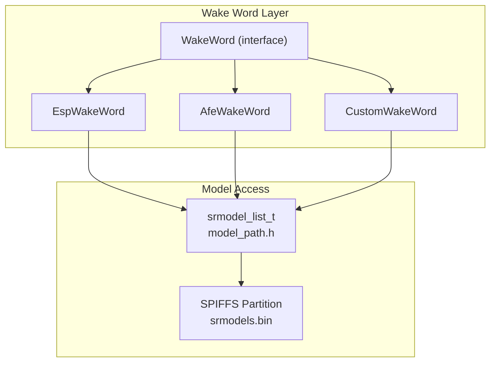
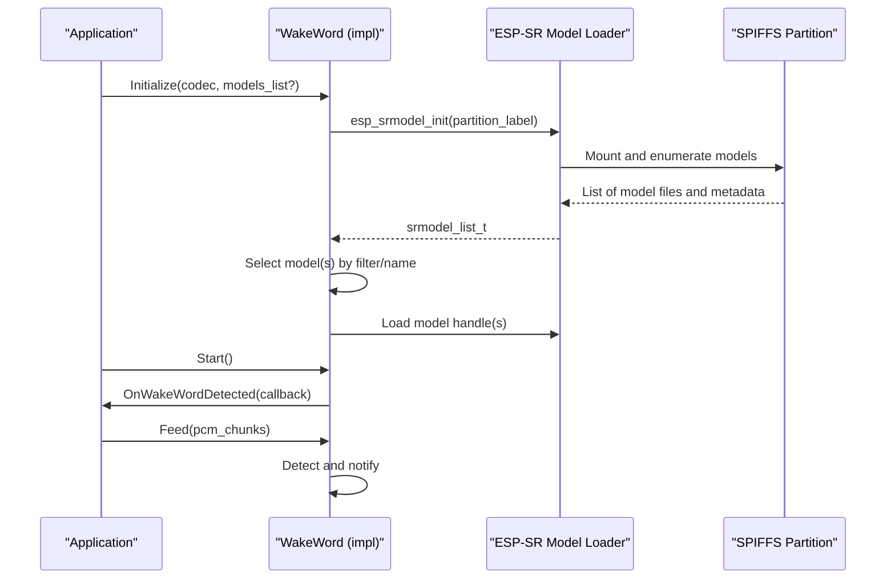
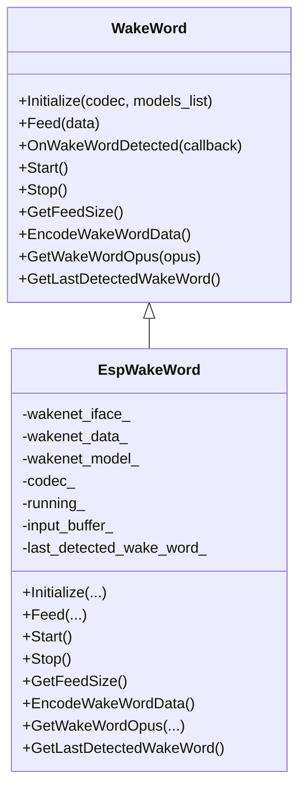
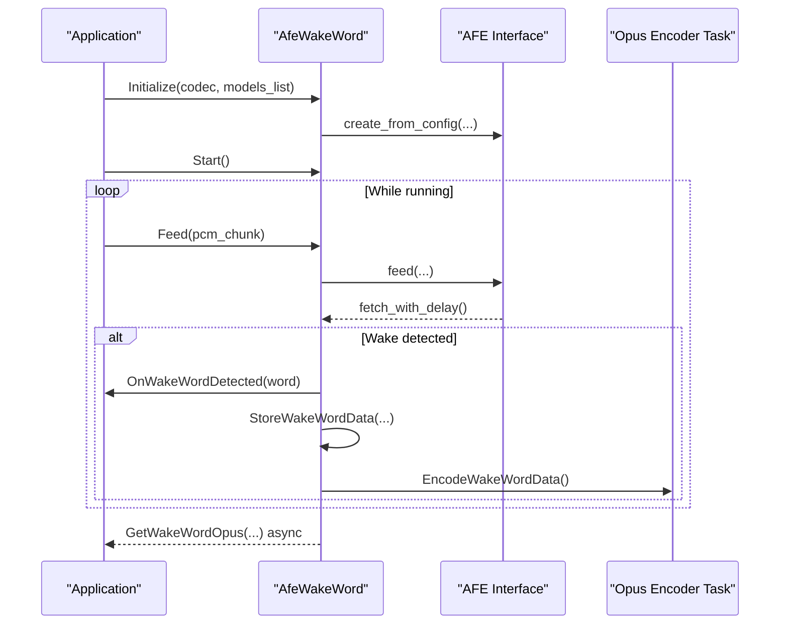
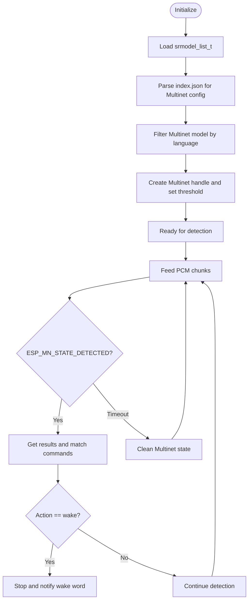
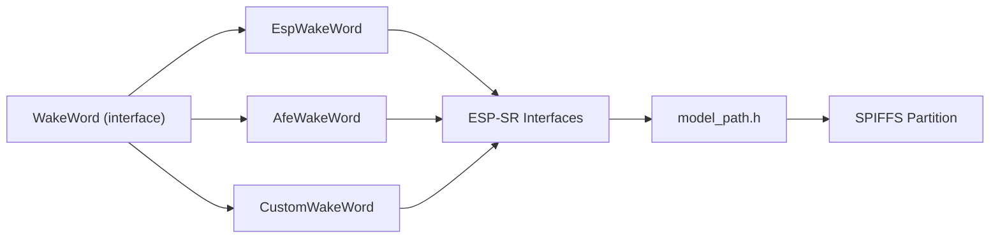

# Wake Word Model Management

<cite>
**Referenced Files in This Document**
- [wake_word.h](file://main/audio/wake_word.h)
- [afe_wake_word.h](file://main/audio/wake_words/afe_wake_word.h)
- [afe_wake_word.cc](file://main/audio/wake_words/afe_wake_word.cc)
- [custom_wake_word.h](file://main/audio/wake_words/custom_wake_word.h)
- [custom_wake_word.cc](file://main/audio/wake_words/custom_wake_word.cc)
- [esp_wake_word.h](file://main/audio/wake_words/esp_wake_word.h)
- [esp_wake_word.cc](file://main/audio/wake_words/esp_wake_word.cc)
- [model_path.h](file://managed_components/espressif__esp-sr/src/include/model_path.h)
- [build.py](file://scripts/spiffs_assets/build.py)
- [pack_model.py](file://scripts/spiffs_assets/pack_model.py)
</cite>

## Table of Contents
1. [Introduction](#introduction)
2. [Project Structure](#project-structure)
3. [Core Components](#core-components)
4. [Architecture Overview](#architecture-overview)
5. [Detailed Component Analysis](#detailed-component-analysis)
6. [Dependency Analysis](#dependency-analysis)
7. [Performance Considerations](#performance-considerations)
8. [Troubleshooting Guide](#troubleshooting-guide)
9. [Conclusion](#conclusion)
10. [Appendices](#appendices)

## Introduction
This document explains the wake word model management system used in the project. It covers how models are loaded from SPIFFS, validated, and integrated into three wake word implementations: ESP-WakeWord, AFE WakeWord, and Custom WakeWord. It also documents model storage formats, validation and integrity checks, fallback strategies, model switching and hot-swapping considerations, dynamic updates, memory management, caching strategies, performance impact, versioning and compatibility, and practical deployment and troubleshooting workflows.

## Project Structure
The wake word subsystem is organized around a common interface and three concrete implementations. Models are stored in a packed binary format within SPIFFS and accessed via the ESP-SR model loader.

**Diagram sources**
- [wake_word.h:11-24](file://main/audio/wake_word.h#L11-L24)
- [esp_wake_word.h:17-43](file://main/audio/wake_words/esp_wake_word.h#L17-L43)
- [afe_wake_word.h:23-67](file://main/audio/wake_words/afe_wake_word.h#L23-L67)
- [custom_wake_word.h:20-71](file://main/audio/wake_words/custom_wake_word.h#L20-L71)
- [model_path.h:12-29](file://managed_components/espressif__esp-sr/src/include/model_path.h#L12-L29)

**Section sources**
- [wake_word.h:1-27](file://main/audio/wake_word.h#L1-L27)
- [model_path.h:34-106](file://managed_components/espressif__esp-sr/src/include/model_path.h#L34-L106)

## Core Components
- WakeWord interface defines the contract for wake word detection: initialization, feeding PCM chunks, starting/stopping detection, registering callbacks, and optional voice clip encoding to Opus.
- EspWakeWord: Uses ESP-WakeNet models via ESP-SR APIs, supports single-model selection and basic detection.
- AfeWakeWord: Integrates ESP-SR AFE for high-performance streaming detection, buffering, and optional Opus encoding of recent audio clips.
- CustomWakeWord: Loads Multinet models for custom wake words, parses configuration from index.json, supports configurable thresholds and commands.

Key responsibilities:
- Model discovery and filtering via srmodel_list_t and model_path.h.
- SPIFFS-backed model packaging and runtime access.
- Detection loop management and thread/task creation for streaming inference.

**Section sources**
- [wake_word.h:11-24](file://main/audio/wake_word.h#L11-L24)
- [esp_wake_word.cc:17-45](file://main/audio/wake_words/esp_wake_word.cc#L17-L45)
- [afe_wake_word.cc:42-101](file://main/audio/wake_words/afe_wake_word.cc#L42-L101)
- [custom_wake_word.cc:85-129](file://main/audio/wake_words/custom_wake_word.cc#L85-L129)

## Architecture Overview
The model management architecture integrates three detection backends with a unified model abstraction and SPIFFS storage.

**Diagram sources**
- [model_path.h:41-50](file://managed_components/espressif__esp-sr/src/include/model_path.h#L41-L50)
- [esp_wake_word.cc:17-45](file://main/audio/wake_words/esp_wake_word.cc#L17-L45)
- [afe_wake_word.cc:42-101](file://main/audio/wake_words/afe_wake_word.cc#L42-L101)
- [custom_wake_word.cc:85-129](file://main/audio/wake_words/custom_wake_word.cc#L85-L129)

## Detailed Component Analysis

### EspWakeWord
- Initialization loads a single wakenet model by name from srmodel_list_t and creates a detection handle.
- Detection feeds PCM chunks sized to the model’s required chunk size and triggers a callback upon detection.
- Does not provide Opus encoding; GetWakeWordOpus returns false.

**Diagram sources**
- [wake_word.h:11-24](file://main/audio/wake_word.h#L11-L24)
- [esp_wake_word.h:17-43](file://main/audio/wake_words/esp_wake_word.h#L17-L43)

**Section sources**
- [esp_wake_word.cc:17-45](file://main/audio/wake_words/esp_wake_word.cc#L17-L45)
- [esp_wake_word.cc:62-96](file://main/audio/wake_words/esp_wake_word.cc#L62-L96)
- [esp_wake_word.cc:98-111](file://main/audio/wake_words/esp_wake_word.cc#L98-L111)

### AfeWakeWord
- Initializes ESP-SR AFE with a model list, sets up preferred core/priority and PSRAM allocation for detection task stacks.
- Streams PCM chunks to AFE, detects wake-up events, buffers recent PCM for later encoding, and spawns an encoding task to produce Opus packets.
- Uses event groups to coordinate detection lifecycle and condition variables for asynchronous Opus retrieval.

**Diagram sources**
- [afe_wake_word.cc:42-101](file://main/audio/wake_words/afe_wake_word.cc#L42-L101)
- [afe_wake_word.cc:146-172](file://main/audio/wake_words/afe_wake_word.cc#L146-L172)
- [afe_wake_word.cc:183-264](file://main/audio/wake_words/afe_wake_word.cc#L183-L264)

**Section sources**
- [afe_wake_word.cc:42-101](file://main/audio/wake_words/afe_wake_word.cc#L42-L101)
- [afe_wake_word.cc:146-172](file://main/audio/wake_words/afe_wake_word.cc#L146-L172)
- [afe_wake_word.cc:183-264](file://main/audio/wake_words/afe_wake_word.cc#L183-L264)

### CustomWakeWord
- Parses index.json to configure Multinet language, detection duration, threshold, and command definitions.
- Initializes Multinet with filtered model names and sets detection thresholds.
- Feeds left-channel PCM for detection and triggers wake-word callbacks when configured actions occur.

**Diagram sources**
- [custom_wake_word.cc:85-129](file://main/audio/wake_words/custom_wake_word.cc#L85-L129)
- [custom_wake_word.cc:146-200](file://main/audio/wake_words/custom_wake_word.cc#L146-L200)

**Section sources**
- [custom_wake_word.cc:37-82](file://main/audio/wake_words/custom_wake_word.cc#L37-L82)
- [custom_wake_word.cc:85-129](file://main/audio/wake_words/custom_wake_word.cc#L85-L129)
- [custom_wake_word.cc:146-200](file://main/audio/wake_words/custom_wake_word.cc#L146-L200)

## Dependency Analysis
- All implementations depend on srmodel_list_t and model_path.h for model discovery, filtering, and loading.
- EspWakeWord depends on ESP-WakeNet interfaces; AfeWakeWord depends on ESP-SR AFE; CustomWakeWord depends on ESP-SR Multinet.
- Memory allocation for detection tasks uses PSRAM where applicable, and internal buffers are protected by mutexes and condition variables.

**Diagram sources**
- [wake_word.h:11-24](file://main/audio/wake_word.h#L11-L24)
- [esp_wake_word.h:17-43](file://main/audio/wake_words/esp_wake_word.h#L17-L43)
- [afe_wake_word.h:23-67](file://main/audio/wake_words/afe_wake_word.h#L23-L67)
- [custom_wake_word.h:20-71](file://main/audio/wake_words/custom_wake_word.h#L20-L71)
- [model_path.h:12-29](file://managed_components/espressif__esp-sr/src/include/model_path.h#L12-L29)

**Section sources**
- [model_path.h:41-86](file://managed_components/espressif__esp-sr/src/include/model_path.h#L41-L86)
- [afe_wake_word.cc:87-98](file://main/audio/wake_words/afe_wake_word.cc#L87-L98)
- [custom_wake_word.cc:107-128](file://main/audio/wake_words/custom_wake_word.cc#L107-L128)

## Performance Considerations
- Streaming inference:
  - EspWakeWord and CustomWakeWord compute chunk sizes from model interfaces and feed aligned PCM chunks to minimize overhead.
  - AfeWakeWord uses AFE’s optimized streaming with preferred core and priority settings and allocates detection task stacks in PSRAM to reduce DRAM pressure.
- Encoding overhead:
  - Both AfeWakeWord and CustomWakeWord spawn dedicated tasks to encode buffered PCM to Opus, avoiding blocking the detection loop.
  - Frame size and packetization are handled per encoder capability to balance CPU and latency.
- Memory management:
  - Static task buffers and stacks are allocated in internal/PSRAM-capable regions depending on component.
  - Buffers maintain bounded history (approx. 2 seconds) to cap memory footprint during encoding.
- Threading:
  - Event groups coordinate lifecycle; condition variables enable asynchronous Opus retrieval.

[No sources needed since this section provides general guidance]

## Troubleshooting Guide
Common issues and resolutions:
- Model initialization failures:
  - Symptom: Failure to initialize models or empty model lists.
  - Actions: Verify SPIFFS partition label and contents; ensure srmodels.bin is present and correctly packaged; confirm model names and prefixes.
- No wake word detected:
  - Symptom: Detection returns no results.
  - Actions: Adjust detection thresholds; verify input channel configuration; ensure feed chunk sizes match model requirements; check audio quality and gain.
- Encoding errors:
  - Symptom: Opus encoder fails to open or encode frames.
  - Actions: Confirm encoder availability and configuration; ensure sufficient PSRAM for encoder task stacks; validate buffered PCM integrity.
- Lifecycle races:
  - Symptom: Spurious detection after Stop().
  - Actions: Ensure Start()/Stop() synchronize with Feed() using event groups and locks; avoid TOCTOU conditions by checking state inside locks.

**Section sources**
- [esp_wake_word.cc:26-35](file://main/audio/wake_words/esp_wake_word.cc#L26-L35)
- [afe_wake_word.cc:121-137](file://main/audio/wake_words/afe_wake_word.cc#L121-L137)
- [custom_wake_word.cc:146-200](file://main/audio/wake_words/custom_wake_word.cc#L146-L200)
- [afe_wake_word.cc:183-264](file://main/audio/wake_words/afe_wake_word.cc#L183-L264)

## Conclusion
The wake word model management system provides a robust, modular framework for loading, validating, and operating multiple detection backends on ESP-IDF. Models are stored in a compact SPIFFS-backed binary format and accessed through ESP-SR’s model loader. The three implementations offer different trade-offs: simplicity with ESP-WakeNet, high-performance streaming with AFE, and flexible custom wake words with Multinet. Proper initialization, lifecycle management, and memory allocation strategies ensure reliable operation under real-time constraints.

[No sources needed since this section summarizes without analyzing specific files]

## Appendices

### Model Storage Architecture in SPIFFS
- Packaging:
  - Models are packed into a single binary (srmodels.bin) with a structured header and concatenated file data.
  - The packer enumerates model directories and writes model metadata and file segments in a contiguous layout.
- Runtime access:
  - The model loader initializes from a partition label, mounts SPIFFS if needed, and exposes srmodel_list_t with model names, info strings, and file descriptors.
- Base path and static models:
  - Utilities provide base paths and static model pointers for advanced scenarios.

**Section sources**
- [pack_model.py:41-113](file://scripts/spiffs_assets/pack_model.py#L41-L113)
- [model_path.h:41-50](file://managed_components/espressif__esp-sr/src/include/model_path.h#L41-L50)
- [model_path.h:94-105](file://managed_components/espressif__esp-sr/src/include/model_path.h#L94-L105)
- [model_path.h:113-121](file://managed_components/espressif__esp-sr/src/include/model_path.h#L113-L121)

### Model File Formats and Loading Mechanisms
- srmodels.bin format:
  - Header includes model count and per-model metadata (name, file count, offsets).
  - Concatenated file data follows the header.
- Loading:
  - esp_srmodel_init reads the partition label, mounts SPIFFS, and constructs srmodel_list_t.
  - Filtering and existence checks are supported via helper functions.

**Section sources**
- [pack_model.py:41-113](file://scripts/spiffs_assets/pack_model.py#L41-L113)
- [model_path.h:41-50](file://managed_components/espressif__esp-sr/src/include/model_path.h#L41-L50)
- [model_path.h:65-75](file://managed_components/espressif__esp-sr/src/include/model_path.h#L65-L75)

### Model Validation, Integrity Checking, and Fallback Strategies
- Validation:
  - Check model list initialization success and non-empty counts.
  - Verify model names and wake words via filters and getters.
- Integrity:
  - Ensure srmodels.bin integrity and correct offsets; verify partition mounting.
- Fallback:
  - CustomWakeWord attempts language-specific Multinet first, then falls back to any Multinet model if language-specific is unavailable.

**Section sources**
- [esp_wake_word.cc:26-35](file://main/audio/wake_words/esp_wake_word.cc#L26-L35)
- [custom_wake_word.cc:107-128](file://main/audio/wake_words/custom_wake_word.cc#L107-L128)

### Model Switching, Hot-Swapping, and Dynamic Updates
- Switching:
  - Re-initialize the desired implementation with a new srmodel_list_t or filtered model name.
- Hot-swapping:
  - Not directly supported in current implementations; recommended approach is graceful shutdown of the current backend and reinitialization with the new model list.
- Dynamic updates:
  - Repackage and reflash SPIFFS partition with updated srmodels.bin; reinitialize model loader and backends.

**Section sources**
- [model_path.h:41-50](file://managed_components/espressif__esp-sr/src/include/model_path.h#L41-L50)
- [esp_wake_word.cc:17-45](file://main/audio/wake_words/esp_wake_word.cc#L17-L45)
- [custom_wake_word.cc:85-129](file://main/audio/wake_words/custom_wake_word.cc#L85-L129)

### Memory Management and Caching Strategies
- Allocation:
  - Detection task stacks allocated in PSRAM-capable regions for AFE and Custom implementations.
  - Static task buffers and internal PCM/Opus queues managed with bounded sizes.
- Caching:
  - Recent PCM buffers maintained for a fixed duration to support post-detection encoding.
  - Opus packets produced asynchronously and retrieved via condition variables.

**Section sources**
- [afe_wake_word.cc:87-98](file://main/audio/wake_words/afe_wake_word.cc#L87-L98)
- [afe_wake_word.cc:174-181](file://main/audio/wake_words/afe_wake_word.cc#L174-L181)
- [custom_wake_word.cc:218-293](file://main/audio/wake_words/custom_wake_word.cc#L218-L293)

### Performance Impact Analysis
- CPU and latency:
  - ESP-WakeNet: Lower CPU due to simpler detection pipeline.
  - AFE: Higher throughput with optimized streaming but increased memory and task overhead.
  - Multinet: Additional CPU for command parsing and thresholding; benefits from configurable duration/threshold tuning.
- Memory:
  - PSRAM allocation reduces DRAM usage; bounded PCM/Opus queues limit peak memory.

**Section sources**
- [afe_wake_word.cc:183-264](file://main/audio/wake_words/afe_wake_word.cc#L183-L264)
- [custom_wake_word.cc:218-293](file://main/audio/wake_words/custom_wake_word.cc#L218-L293)

### Model Versioning, Compatibility Checks, and Migration
- Versioning:
  - Model info strings include version and detection parameters; use esp_srmodel_get_wake_words to inspect model metadata.
- Compatibility:
  - Filter models by prefixes and language tags; ensure codec/sample-rate compatibility.
- Migration:
  - Repackage models into srmodels.bin with updated versions; update index.json as needed; reflash SPIFFS partition.

**Section sources**
- [model_path.h:20-22](file://managed_components/espressif__esp-sr/src/include/model_path.h#L20-L22)
- [model_path.h:84-85](file://managed_components/espressif__esp-sr/src/include/model_path.h#L84-L85)
- [build.py:264-291](file://scripts/spiffs_assets/build.py#L264-L291)

### Deployment Examples and Validation Workflows
- Build and package:
  - Use the SPIFFS asset builder to copy and package models, fonts, emojis, and layouts; generate index.json and assets.bin.
- Flash and run:
  - Flash the firmware with the SPIFFS partition containing srmodels.bin; initialize the model loader and select the desired backend.
- Validation:
  - Log model names and wake words; verify detection callbacks fire; encode and retrieve Opus packets for post-processing.

**Section sources**
- [build.py:325-382](file://scripts/spiffs_assets/build.py#L325-L382)
- [pack_model.py:41-113](file://scripts/spiffs_assets/pack_model.py#L41-L113)
- [model_path.h:41-50](file://managed_components/espressif__esp-sr/src/include/model_path.h#L41-L50)