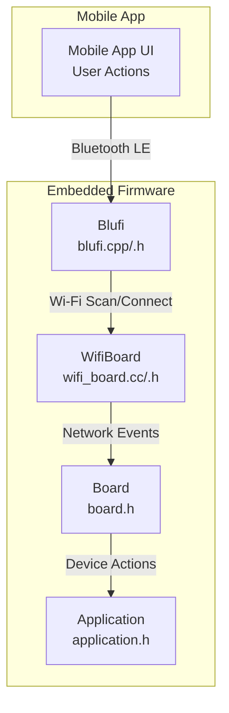
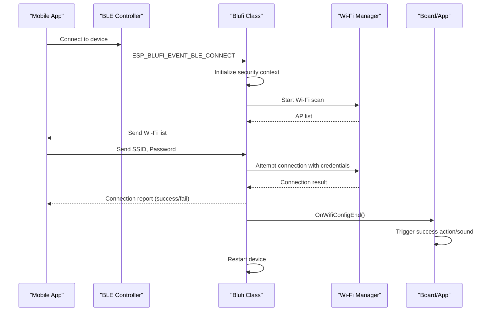
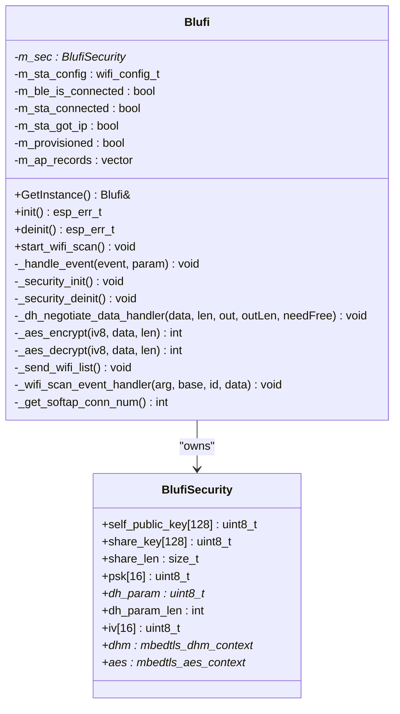
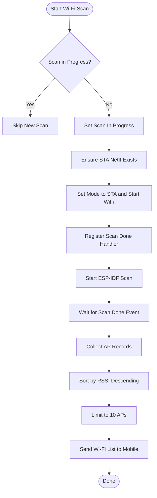
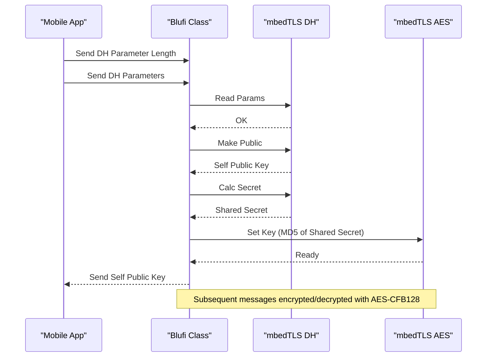
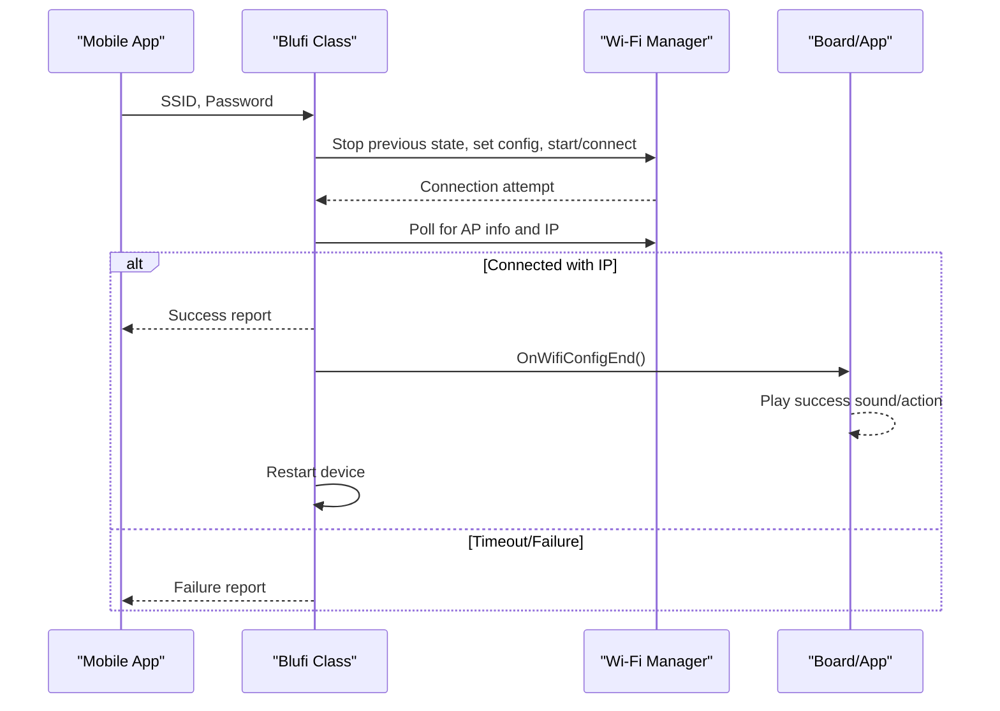
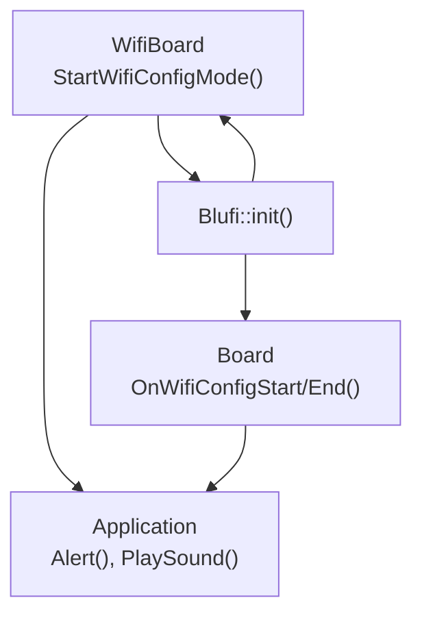
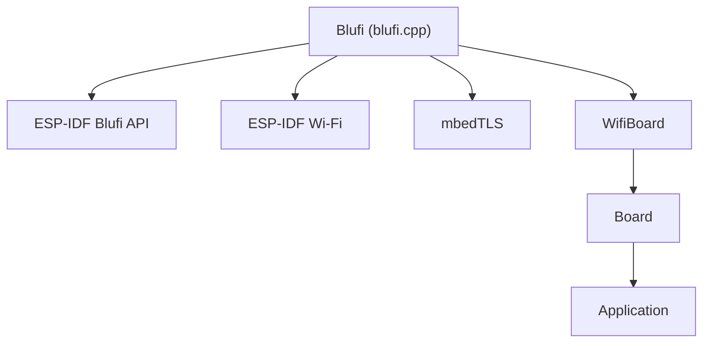

# BluFi WiFi Provisioning System

<cite>
**Referenced Files in This Document**
- [blufi.h](file://main/boards/common/blufi.h)
- [blufi.cpp](file://main/boards/common/blufi.cpp)
- [wifi_board.h](file://main/boards/common/wifi_board.h)
- [wifi_board.cc](file://main/boards/common/wifi_board.cc)
- [board.h](file://main/boards/common/board.h)
- [lulu-esp32s3.cc](file://main/boards/lulu-esp32s3/lulu-esp32s3.cc)
- [application.h](file://main/application.h)
</cite>

## Table of Contents
1. [Introduction](#introduction)
2. [Project Structure](#project-structure)
3. [Core Components](#core-components)
4. [Architecture Overview](#architecture-overview)
5. [Detailed Component Analysis](#detailed-component-analysis)
6. [Dependency Analysis](#dependency-analysis)
7. [Performance Considerations](#performance-considerations)
8. [Troubleshooting Guide](#troubleshooting-guide)
9. [Conclusion](#conclusion)

## Introduction
This document describes the BluFi WiFi provisioning system that enables Bluetooth-assisted network configuration for embedded devices. It explains how the ESP-IDF-based Blufi protocol transfers WiFi credentials securely from a mobile device to an embedded target, covering Bluetooth LE advertisement and scanning, pairing and security negotiation, credential validation, and error handling. It also documents step-by-step workflows for initial setup, reconfiguration, and fallback scenarios, along with security considerations and integration patterns for mobile applications and UI.

## Project Structure
The BluFi implementation centers around a Blufi class that encapsulates Bluetooth LE profile initialization, Wi-Fi scanning, security negotiation, and credential provisioning. Integration with the board and application layers ensures smooth UX transitions and device actions during provisioning.

**Diagram sources**
- [blufi.cpp:104-138](file://main/boards/common/blufi.cpp#L104-L138)
- [wifi_board.cc:173-221](file://main/boards/common/wifi_board.cc#L173-L221)
- [board.h:20-93](file://main/boards/common/board.h#L20-L93)
- [application.h:42-177](file://main/application.h#L42-L177)

**Section sources**
- [blufi.h:16-48](file://main/boards/common/blufi.h#L16-L48)
- [blufi.cpp:104-138](file://main/boards/common/blufi.cpp#L104-L138)
- [wifi_board.h:9-76](file://main/boards/common/wifi_board.h#L9-L76)
- [wifi_board.cc:173-221](file://main/boards/common/wifi_board.cc#L173-L221)
- [board.h:20-93](file://main/boards/common/board.h#L20-L93)
- [application.h:42-177](file://main/application.h#L42-L177)

## Core Components
- Blufi class: Manages Bluetooth controller/host initialization, GAP/GATT profile registration, event callbacks, Wi-Fi scanning, security negotiation (Diffie-Hellman and AES-CFB128), and credential provisioning lifecycle.
- WifiBoard: Integrates provisioning into the board lifecycle, triggers UI feedback, and coordinates state transitions.
- Board: Provides hooks for provisioning start/end actions and device-specific behaviors.
- Application: Central orchestrator for UI alerts, sounds, and state transitions during provisioning.

Key responsibilities:
- Initialize and deinitialize the Blufi profile and Bluetooth stack.
- Start Wi-Fi scans and deliver AP lists to the mobile app.
- Negotiate shared keys and encrypt/decrypt messages.
- Validate received credentials and attempt connection with timeout handling.
- Report connection status and trigger post-provisioning actions.

**Section sources**
- [blufi.h:16-148](file://main/boards/common/blufi.h#L16-L148)
- [blufi.cpp:104-138](file://main/boards/common/blufi.cpp#L104-L138)
- [wifi_board.h:9-76](file://main/boards/common/wifi_board.h#L9-L76)
- [board.h:20-93](file://main/boards/common/board.h#L20-L93)
- [application.h:42-177](file://main/application.h#L42-L177)

## Architecture Overview
The system follows a layered architecture:
- Mobile App: Initiates provisioning via Bluetooth LE, sends Wi-Fi credentials, and receives status updates.
- Embedded Blufi: Handles BLE events, manages Wi-Fi operations, and executes provisioning.
- Board/Application: Provide UI feedback, device actions, and state transitions.

**Diagram sources**
- [blufi.cpp:644-936](file://main/boards/common/blufi.cpp#L644-L936)
- [wifi_board.cc:173-221](file://main/boards/common/wifi_board.cc#L173-L221)
- [board.h:90-92](file://main/boards/common/board.h#L90-L92)

## Detailed Component Analysis

### Blufi Class
The Blufi class encapsulates the entire provisioning flow:
- Initialization: Initializes Bluetooth controller/host, registers callbacks, and starts advertising.
- Security: Performs Diffie-Hellman key exchange and AES-CFB128 encryption for secure communication.
- Wi-Fi Operations: Starts scans, collects AP records, sorts by signal strength, and limits results to avoid timeouts.
- Credential Provisioning: Receives SSID/password, validates, attempts connection with a timeout, reports results, and triggers post-provisioning actions.

**Diagram sources**
- [blufi.h:16-148](file://main/boards/common/blufi.h#L16-L148)
- [blufi.cpp:348-377](file://main/boards/common/blufi.cpp#L348-L377)

**Section sources**
- [blufi.h:16-148](file://main/boards/common/blufi.h#L16-L148)
- [blufi.cpp:104-138](file://main/boards/common/blufi.cpp#L104-L138)
- [blufi.cpp:348-470](file://main/boards/common/blufi.cpp#L348-L470)
- [blufi.cpp:472-516](file://main/boards/common/blufi.cpp#L472-L516)
- [blufi.cpp:531-642](file://main/boards/common/blufi.cpp#L531-L642)
- [blufi.cpp:644-936](file://main/boards/common/blufi.cpp#L644-L936)

### Wi-Fi Scanning and List Delivery
The system performs targeted Wi-Fi scans and delivers a sorted list of APs to the mobile app, limiting the number to prevent transport timeouts.

**Diagram sources**
- [blufi.cpp:531-642](file://main/boards/common/blufi.cpp#L531-L642)
- [blufi.cpp:583-613](file://main/boards/common/blufi.cpp#L583-L613)

**Section sources**
- [blufi.cpp:531-642](file://main/boards/common/blufi.cpp#L531-L642)
- [blufi.cpp:583-613](file://main/boards/common/blufi.cpp#L583-L613)

### Security and Encryption
The Blufi class negotiates a shared secret using Diffie-Hellman and derives a 128-bit PSK via MD5, then uses AES in CFB128 mode for confidentiality. An IV is maintained per message to ensure uniqueness.

**Diagram sources**
- [blufi.cpp:379-470](file://main/boards/common/blufi.cpp#L379-L470)
- [blufi.cpp:472-516](file://main/boards/common/blufi.cpp#L472-L516)

**Section sources**
- [blufi.cpp:379-470](file://main/boards/common/blufi.cpp#L379-L470)
- [blufi.cpp:472-516](file://main/boards/common/blufi.cpp#L472-L516)

### Credential Provisioning and Connection Flow
Upon receiving SSID and password, the system validates, attempts a direct connection, monitors for IP acquisition, and reports results. On success, it triggers board-level actions and restarts the device.

**Diagram sources**
- [blufi.cpp:719-847](file://main/boards/common/blufi.cpp#L719-L847)
- [blufi.cpp:826-837](file://main/boards/common/blufi.cpp#L826-L837)
- [board.h:90-92](file://main/boards/common/board.h#L90-L92)

**Section sources**
- [blufi.cpp:719-847](file://main/boards/common/blufi.cpp#L719-L847)
- [blufi.cpp:826-837](file://main/boards/common/blufi.cpp#L826-L837)
- [board.h:90-92](file://main/boards/common/board.h#L90-L92)

### Integration with Board and Application
The board layer integrates provisioning into device state transitions and provides hooks for UI feedback and actions. The application layer schedules UI updates and sounds.

**Diagram sources**
- [wifi_board.cc:173-221](file://main/boards/common/wifi_board.cc#L173-L221)
- [blufi.cpp:104-138](file://main/boards/common/blufi.cpp#L104-L138)
- [board.h:90-92](file://main/boards/common/board.h#L90-L92)
- [application.h:82-113](file://main/application.h#L82-L113)

**Section sources**
- [wifi_board.cc:173-221](file://main/boards/common/wifi_board.cc#L173-L221)
- [board.h:90-92](file://main/boards/common/board.h#L90-L92)
- [application.h:82-113](file://main/application.h#L82-L113)

## Dependency Analysis
The Blufi class depends on ESP-IDF’s Blufi API, Wi-Fi subsystem, and mbedTLS for cryptographic operations. It integrates with the board and application layers for UI and device actions.

**Diagram sources**
- [blufi.cpp:1-63](file://main/boards/common/blufi.cpp#L1-L63)
- [blufi.h:3-14](file://main/boards/common/blufi.h#L3-L14)
- [wifi_board.cc:173-221](file://main/boards/common/wifi_board.cc#L173-L221)
- [board.h:20-93](file://main/boards/common/board.h#L20-L93)
- [application.h:42-177](file://main/application.h#L42-L177)

**Section sources**
- [blufi.cpp:1-63](file://main/boards/common/blufi.cpp#L1-L63)
- [blufi.h:3-14](file://main/boards/common/blufi.h#L3-L14)
- [wifi_board.cc:173-221](file://main/boards/common/wifi_board.cc#L173-L221)
- [board.h:20-93](file://main/boards/common/board.h#L20-L93)
- [application.h:42-177](file://main/application.h#L42-L177)

## Performance Considerations
- Wi-Fi scan batching: AP lists are limited to reduce Bluetooth transfer time and memory overhead.
- Connection polling: Uses periodic checks with a bounded timeout to avoid indefinite blocking.
- Task scheduling: Long-running operations are offloaded to FreeRTOS tasks to keep the event loop responsive.
- Security overhead: AES-CFB128 and DH operations are lightweight for embedded targets but should be monitored under load.

[No sources needed since this section provides general guidance]

## Troubleshooting Guide
Common issues and handling:
- Bluetooth initialization failures: The Blufi initializer logs errors and returns failure codes; check controller and host initialization paths.
- Wi-Fi scan failures: Verify Wi-Fi mode and startup; ensure scan handler registration succeeds.
- DH negotiation errors: Validate parameter lengths and mbedtls return codes; ensure proper cleanup on failure.
- Connection timeout: Confirm credentials validity, AP availability, and network reachability; review connection attempt and IP acquisition loops.
- Deinitialization: Ensure proper shutdown order for BLE and Wi-Fi stacks to avoid resource leaks.

**Section sources**
- [blufi.cpp:104-138](file://main/boards/common/blufi.cpp#L104-L138)
- [blufi.cpp:307-341](file://main/boards/common/blufi.cpp#L307-L341)
- [blufi.cpp:379-470](file://main/boards/common/blufi.cpp#L379-L470)
- [blufi.cpp:762-847](file://main/boards/common/blufi.cpp#L762-L847)

## Conclusion
The BluFi WiFi provisioning system provides a robust, secure, and user-friendly mechanism for transferring Wi-Fi credentials from a mobile device to an embedded target over Bluetooth LE. Its architecture cleanly separates BLE handling, Wi-Fi operations, security, and UI integration, enabling reliable initial setup, reconfiguration, and graceful fallbacks. By following the documented workflows and security practices, developers can integrate seamless provisioning experiences into their products.