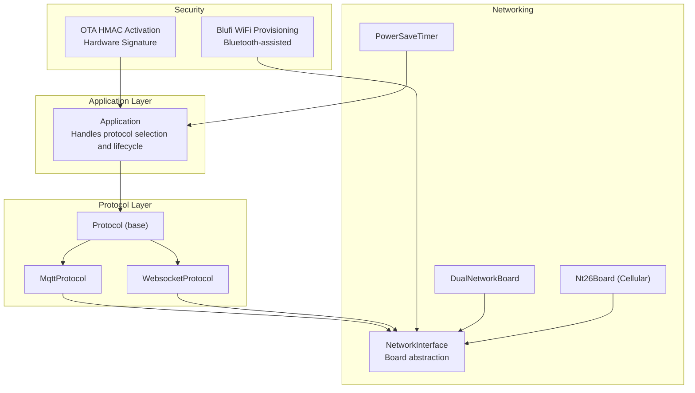
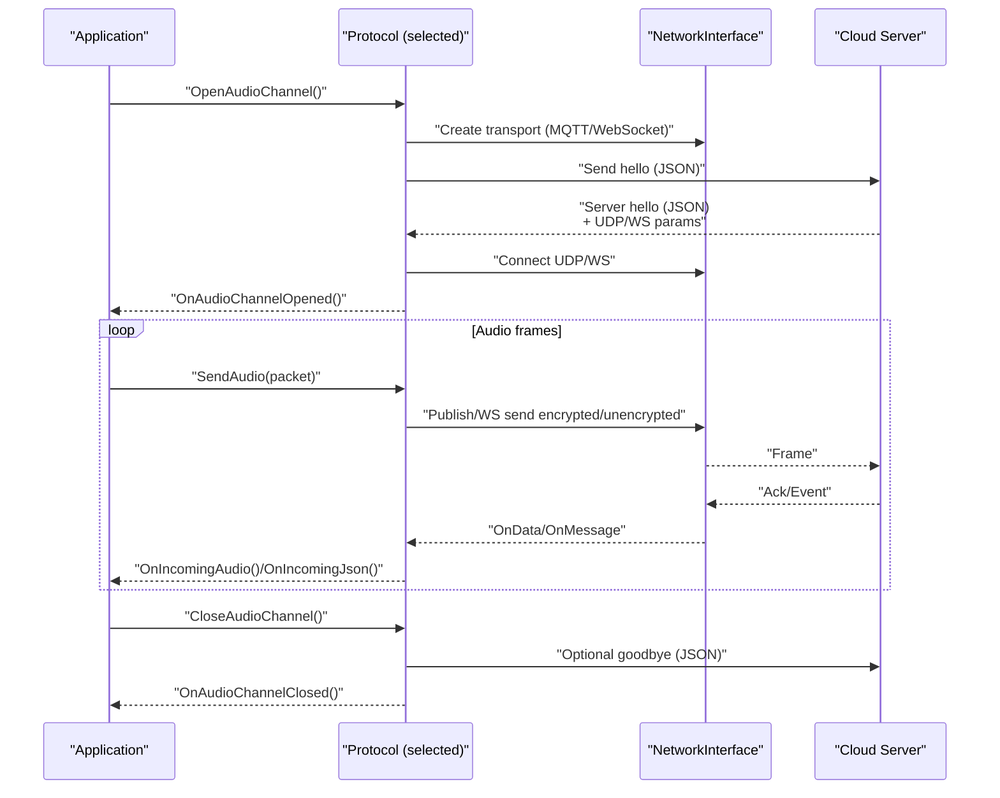
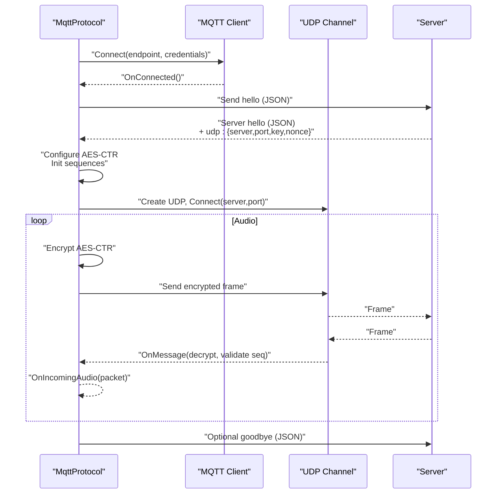
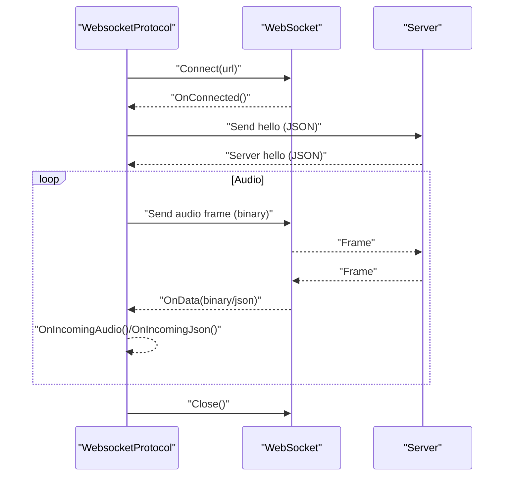
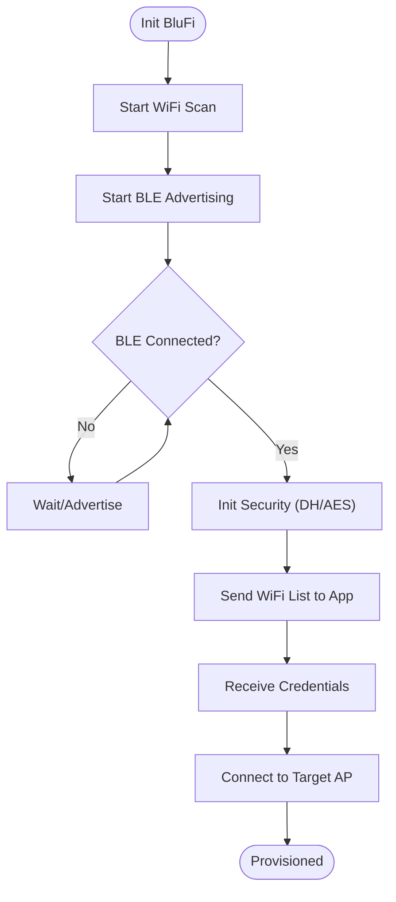
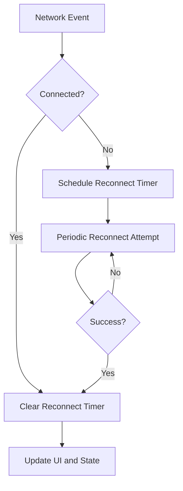
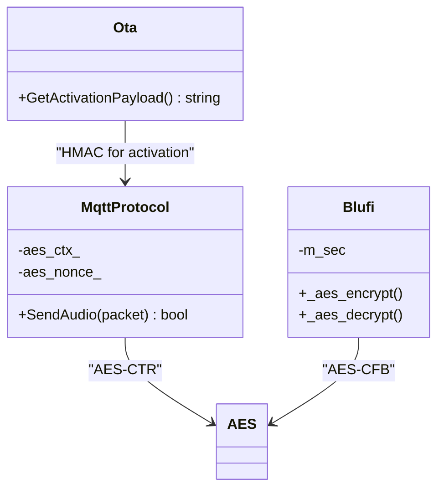
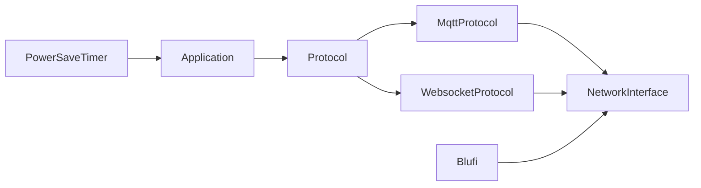

# Communication Protocols

<cite>
**Referenced Files in This Document**
- [protocol.h](file://main/protocols/protocol.h)
- [protocol.cc](file://main/protocols/protocol.cc)
- [mqtt_protocol.h](file://main/protocols/mqtt_protocol.h)
- [mqtt_protocol.cc](file://main/protocols/mqtt_protocol.cc)
- [websocket_protocol.h](file://main/protocols/websocket_protocol.h)
- [websocket_protocol.cc](file://main/protocols/websocket_protocol.cc)
- [blufi.h](file://main/boards/common/blufi.h)
- [blufi.cpp](file://main/boards/common/blufi.cpp)
- [ota.cc](file://main/ota.cc)
- [application.cc](file://main/application.cc)
- [settings.h](file://main/settings.h)
- [dual_network_board.cc](file://main/boards/common/dual_network_board.cc)
- [nt26_board.cc](file://main/boards/common/nt26_board.cc)
- [power_save_timer.cc](file://main/boards/common/power_save_timer.cc)
</cite>

## Table of Contents
1. [Introduction](#introduction)
2. [Project Structure](#project-structure)
3. [Core Components](#core-components)
4. [Architecture Overview](#architecture-overview)
5. [Detailed Component Analysis](#detailed-component-analysis)
6. [Dependency Analysis](#dependency-analysis)
7. [Performance Considerations](#performance-considerations)
8. [Troubleshooting Guide](#troubleshooting-guide)
9. [Conclusion](#conclusion)
10. [Appendices](#appendices)

## Introduction
This document explains the communication protocol implementations for network connectivity and cloud integration in the project. It covers:
- MQTT protocol for reliable message delivery, topic management, and quality-of-service handling
- WebSocket protocol for real-time bidirectional communication, event streaming, and interactive control
- BluFi WiFi provisioning system enabling Bluetooth-assisted network configuration via mobile apps
- Network management with automatic reconnection, connection recovery, and power-aware optimization
- Security implementations including hardware HMAC activation, encrypted communications, and authentication mechanisms
- Protocol selection strategies, fallback mechanisms, and performance optimization for low-bandwidth environments
- Configuration examples, troubleshooting guides, and integration patterns with external services

## Project Structure
The communication stack is organized around a shared Protocol interface and two concrete protocol implementations (MQTT and WebSocket). Network provisioning is handled by the BluFi subsystem. Power-aware optimizations and network board abstractions are provided by board-specific components.

**Diagram sources**
- [application.cc:1-200](file://main/application.cc#L1-L200)
- [protocol.h:44-95](file://main/protocols/protocol.h#L44-L95)
- [mqtt_protocol.h:26-62](file://main/protocols/mqtt_protocol.h#L26-L62)
- [websocket_protocol.h:13-32](file://main/protocols/websocket_protocol.h#L13-L32)
- [blufi.h:16-147](file://main/boards/common/blufi.h#L16-L147)
- [dual_network_board.cc:80-98](file://main/boards/common/dual_network_board.cc#L80-L98)
- [nt26_board.cc:137-140](file://main/boards/common/nt26_board.cc#L137-L140)
- [power_save_timer.cc:10-28](file://main/boards/common/power_save_timer.cc#L10-L28)
- [ota.cc:421-442](file://main/ota.cc#L421-L442)

**Section sources**
- [application.cc:1-200](file://main/application.cc#L1-L200)
- [protocol.h:1-99](file://main/protocols/protocol.h#L1-L99)
- [mqtt_protocol.h:1-66](file://main/protocols/mqtt_protocol.h#L1-L66)
- [websocket_protocol.h:1-35](file://main/protocols/websocket_protocol.h#L1-L35)
- [blufi.h:1-148](file://main/boards/common/blufi.h#L1-L148)
- [dual_network_board.cc:80-98](file://main/boards/common/dual_network_board.cc#L80-L98)
- [nt26_board.cc:137-140](file://main/boards/common/nt26_board.cc#L137-L140)
- [power_save_timer.cc:10-28](file://main/boards/common/power_save_timer.cc#L10-L28)
- [ota.cc:421-442](file://main/ota.cc#L421-L442)

## Core Components
- Protocol base class defines the contract for audio streaming, JSON messaging, and lifecycle hooks. It also provides helpers for sending structured messages and detecting timeouts.
- MqttProtocol implements MQTT-based transport with embedded UDP audio channels, AES-CTR encryption, and hello exchange for session setup.
- WebsocketProtocol implements WebSocket-based transport with optional binary framing variants and JSON-based control messages.
- BluFi provides Bluetooth-assisted WiFi provisioning with Diffie-Hellman key exchange, AES-CFB encryption, and secure parameter negotiation.
- Network boards abstract transport specifics (WiFi, cellular) and expose a unified NetworkInterface for protocol clients.
- PowerSaveTimer and board power controls optimize runtime under constrained conditions.

**Section sources**
- [protocol.h:44-95](file://main/protocols/protocol.h#L44-L95)
- [protocol.cc:35-91](file://main/protocols/protocol.cc#L35-L91)
- [mqtt_protocol.h:26-62](file://main/protocols/mqtt_protocol.h#L26-L62)
- [mqtt_protocol.cc:59-152](file://main/protocols/mqtt_protocol.cc#L59-L152)
- [websocket_protocol.h:13-32](file://main/protocols/websocket_protocol.h#L13-L32)
- [websocket_protocol.cc:23-76](file://main/protocols/websocket_protocol.cc#L23-L76)
- [blufi.h:16-147](file://main/boards/common/blufi.h#L16-L147)
- [blufi.cpp:104-138](file://main/boards/common/blufi.cpp#L104-L138)
- [dual_network_board.cc:80-98](file://main/boards/common/dual_network_board.cc#L80-L98)
- [nt26_board.cc:137-140](file://main/boards/common/nt26_board.cc#L137-L140)
- [power_save_timer.cc:10-28](file://main/boards/common/power_save_timer.cc#L10-L28)

## Architecture Overview
The system selects a protocol at runtime, negotiates a session via a “hello” message, and establishes either an MQTT-based UDP audio channel or a WebSocket audio channel. BluFi provisions WiFi credentials securely over Bluetooth. Power-aware optimizations adjust CPU locks and sleep behavior.

**Diagram sources**
- [application.cc:1-200](file://main/application.cc#L1-L200)
- [protocol.h:44-95](file://main/protocols/protocol.h#L44-L95)
- [mqtt_protocol.cc:215-295](file://main/protocols/mqtt_protocol.cc#L215-L295)
- [websocket_protocol.cc:83-201](file://main/protocols/websocket_protocol.cc#L83-L201)

## Detailed Component Analysis

### MQTT Protocol Implementation
- Reliable message delivery and QoS handling:
  - Uses an MQTT client with keepalive and explicit reconnect scheduling via a FreeRTOS timer.
  - On disconnect, schedules a reconnect after a fixed interval; on connect clears the reconnect timer.
- Topic management:
  - Publishes control messages to a configured topic; listens on MQTT for server commands.
- Quality-of-service handling:
  - Relies on MQTT broker semantics; audio is transported out-of-band via UDP after server hello.
- Audio channel establishment:
  - Sends a JSON hello with transport=udp and feature flags; parses server hello to configure UDP parameters, AES key/nonce, and session ID.
- Audio encryption and sequencing:
  - AES-CTR encryption with per-packet nonce derived from shared key and monotonic sequence number.
  - UDP packets carry sequence numbers and timestamps; receiver validates ordering and decrypts frames.
- Error handling and timeouts:
  - Tracks last incoming activity; marks channel error on timeout; exposes SetError to notify upper layers.

**Diagram sources**
- [mqtt_protocol.cc:59-152](file://main/protocols/mqtt_protocol.cc#L59-L152)
- [mqtt_protocol.cc:215-295](file://main/protocols/mqtt_protocol.cc#L215-L295)
- [mqtt_protocol.cc:322-366](file://main/protocols/mqtt_protocol.cc#L322-L366)

**Section sources**
- [mqtt_protocol.h:26-62](file://main/protocols/mqtt_protocol.h#L26-L62)
- [mqtt_protocol.cc:59-152](file://main/protocols/mqtt_protocol.cc#L59-L152)
- [mqtt_protocol.cc:215-295](file://main/protocols/mqtt_protocol.cc#L215-L295)
- [mqtt_protocol.cc:322-366](file://main/protocols/mqtt_protocol.cc#L322-L366)

### WebSocket Protocol Implementation
- Real-time bidirectional communication:
  - Creates a WebSocket client on demand; sets headers including Authorization, Protocol-Version, Device-Id, and Client-Id.
- Event streaming and interactive control:
  - Parses JSON control messages; supports binary protocol variants with typed payloads and sizes.
- Audio channel establishment:
  - Sends a JSON hello with transport=websocket and feature flags; waits for server hello to configure audio parameters.
- Audio framing and encryption:
  - Sends raw audio or binary frames depending on negotiated version; decrypts inbound frames if applicable.

**Diagram sources**
- [websocket_protocol.cc:83-201](file://main/protocols/websocket_protocol.cc#L83-L201)

**Section sources**
- [websocket_protocol.h:13-32](file://main/protocols/websocket_protocol.h#L13-L32)
- [websocket_protocol.cc:23-76](file://main/protocols/websocket_protocol.cc#L23-L76)
- [websocket_protocol.cc:83-201](file://main/protocols/websocket_protocol.cc#L83-L201)
- [websocket_protocol.cc:228-254](file://main/protocols/websocket_protocol.cc#L228-L254)

### BluFi WiFi Provisioning System
- Bluetooth-assisted network configuration:
  - Initializes BLE controller/host and registers callbacks; advertises device name derived from MAC address.
  - Supports both legacy Bluedroid and modern NimBLE stacks.
- Secure parameter negotiation:
  - Performs Diffie-Hellman key exchange to derive a shared key; computes MD5-based PSK and initializes AES context.
  - Provides AES-CFB encrypt/decrypt and CRC checksum functions for secure data exchange.
- WiFi provisioning workflow:
  - Scans for nearby APs and sends a curated list to the mobile app; accepts SSID/password and connects directly to the target network.
  - Persists credentials and manages connection state transitions.

**Diagram sources**
- [blufi.cpp:104-138](file://main/boards/common/blufi.cpp#L104-L138)
- [blufi.cpp:348-377](file://main/boards/common/blufi.cpp#L348-L377)
- [blufi.cpp:379-470](file://main/boards/common/blufi.cpp#L379-L470)
- [blufi.cpp:531-642](file://main/boards/common/blufi.cpp#L531-L642)
- [blufi.cpp:694-800](file://main/boards/common/blufi.cpp#L694-L800)

**Section sources**
- [blufi.h:16-147](file://main/boards/common/blufi.h#L16-L147)
- [blufi.cpp:104-138](file://main/boards/common/blufi.cpp#L104-L138)
- [blufi.cpp:348-470](file://main/boards/common/blufi.cpp#L348-L470)
- [blufi.cpp:531-642](file://main/boards/common/blufi.cpp#L531-L642)
- [blufi.cpp:694-800](file://main/boards/common/blufi.cpp#L694-L800)

### Network Management and Power-Aware Optimization
- Automatic reconnection and recovery:
  - MQTT protocol schedules periodic reconnects on disconnect; clears timer on successful connect.
  - Application reacts to network events (scanning/connecting/connected/disconnected) to update UI and state.
- Power-aware optimization:
  - PowerSaveTimer periodically evaluates idle conditions and toggles CPU max lock to reduce power consumption.
  - Board-level power controls adjust CPU locks based on power save level.
- Multi-network support:
  - DualNetworkBoard delegates to the active board’s NetworkInterface, enabling seamless switching between WiFi and cellular.

**Diagram sources**
- [mqtt_protocol.cc:85-98](file://main/protocols/mqtt_protocol.cc#L85-L98)
- [application.cc:116-171](file://main/application.cc#L116-L171)
- [power_save_timer.cc:10-28](file://main/boards/common/power_save_timer.cc#L10-L28)
- [nt26_board.cc:161-178](file://main/boards/common/nt26_board.cc#L161-L178)
- [dual_network_board.cc:80-98](file://main/boards/common/dual_network_board.cc#L80-L98)

**Section sources**
- [mqtt_protocol.cc:85-98](file://main/protocols/mqtt_protocol.cc#L85-L98)
- [application.cc:116-171](file://main/application.cc#L116-L171)
- [power_save_timer.cc:10-28](file://main/boards/common/power_save_timer.cc#L10-L28)
- [nt26_board.cc:161-178](file://main/boards/common/nt26_board.cc#L161-L178)
- [dual_network_board.cc:80-98](file://main/boards/common/dual_network_board.cc#L80-L98)

### Security Implementations
- Hardware HMAC activation:
  - Computes SHA-256 HMAC using a hardware key and challenge; returns hex-encoded signature for activation payloads.
- Encrypted communications:
  - MQTT audio channel uses AES-CTR with per-packet nonce and shared key.
  - BluFi uses AES-CFB and MD5-derived PSK for secure negotiation and data exchange.
- Authentication mechanisms:
  - MQTT supports username/password; WebSocket supports Authorization header (Bearer token).
  - BluFi authenticates via BLE pairing and secure handshake.

**Diagram sources**
- [ota.cc:421-442](file://main/ota.cc#L421-L442)
- [mqtt_protocol.cc:166-190](file://main/protocols/mqtt_protocol.cc#L166-L190)
- [blufi.cpp:472-512](file://main/boards/common/blufi.cpp#L472-L512)

**Section sources**
- [ota.cc:421-442](file://main/ota.cc#L421-L442)
- [mqtt_protocol.cc:166-190](file://main/protocols/mqtt_protocol.cc#L166-L190)
- [blufi.cpp:472-512](file://main/boards/common/blufi.cpp#L472-L512)

## Dependency Analysis
- Protocol interface decouples application logic from transport specifics.
- MqttProtocol and WebsocketProtocol depend on NetworkInterface abstraction exposed by board implementations.
- BluFi depends on ESP-IDF BLE APIs and mbedtls for cryptographic operations.
- PowerSaveTimer integrates with Application scheduling and board power controls.

**Diagram sources**
- [application.cc:1-200](file://main/application.cc#L1-L200)
- [protocol.h:44-95](file://main/protocols/protocol.h#L44-L95)
- [mqtt_protocol.h:26-62](file://main/protocols/mqtt_protocol.h#L26-L62)
- [websocket_protocol.h:13-32](file://main/protocols/websocket_protocol.h#L13-L32)
- [blufi.h:16-147](file://main/boards/common/blufi.h#L16-L147)
- [power_save_timer.cc:10-28](file://main/boards/common/power_save_timer.cc#L10-L28)

**Section sources**
- [application.cc:1-200](file://main/application.cc#L1-L200)
- [protocol.h:44-95](file://main/protocols/protocol.h#L44-L95)
- [mqtt_protocol.h:26-62](file://main/protocols/mqtt_protocol.h#L26-L62)
- [websocket_protocol.h:13-32](file://main/protocols/websocket_protocol.h#L13-L32)
- [blufi.h:16-147](file://main/boards/common/blufi.h#L16-L147)
- [power_save_timer.cc:10-28](file://main/boards/common/power_save_timer.cc#L10-L28)

## Performance Considerations
- Low-bandwidth optimization:
  - Opus encoder uses adaptive bitrate and DTX; frame durations are configurable to balance latency and bandwidth.
  - MQTT audio uses AES-CTR with minimal overhead; UDP transport reduces MQTT broker load.
- Power-aware operation:
  - CPU max lock is acquired during active sessions and released during idle periods to conserve energy.
  - PowerSaveTimer periodically checks idle conditions and adjusts power mode.
- Protocol selection:
  - Prefer WebSocket for real-time interactivity and JSON control; prefer MQTT for robustness and offload of audio via UDP.

[No sources needed since this section provides general guidance]

## Troubleshooting Guide
- MQTT connection failures:
  - Verify endpoint, client_id, username, password, and publish_topic in settings namespace “mqtt”.
  - Check logs for server-not-found or server-not-connected errors; confirm network availability and DNS resolution.
- Audio channel not opening:
  - Ensure hello exchange completes within timeout; inspect server hello parsing and UDP/WS connection establishment.
  - For MQTT, confirm UDP server/port/key/nonce are present in server hello.
- WebSocket handshake issues:
  - Confirm Authorization header and Protocol-Version headers; ensure URL and token are configured in settings namespace “websocket”.
- BluFi provisioning problems:
  - Ensure BLE is initialized and advertising; check DH negotiation and AES setup logs.
  - Validate WiFi scan results and AP credentials received from the mobile app.
- Timeouts and disconnections:
  - Monitor last incoming activity; channel is considered timed out after extended silence.
  - For MQTT, confirm keepalive and reconnect timer behavior.

**Section sources**
- [mqtt_protocol.cc:65-80](file://main/protocols/mqtt_protocol.cc#L65-L80)
- [mqtt_protocol.cc:233-238](file://main/protocols/mqtt_protocol.cc#L233-L238)
- [websocket_protocol.cc:84-90](file://main/protocols/websocket_protocol.cc#L84-L90)
- [websocket_protocol.cc:189-194](file://main/protocols/websocket_protocol.cc#L189-L194)
- [blufi.cpp:104-138](file://main/boards/common/blufi.cpp#L104-L138)
- [blufi.cpp:348-377](file://main/boards/common/blufi.cpp#L348-L377)
- [protocol.cc:82-91](file://main/protocols/protocol.cc#L82-L91)

## Conclusion
The communication stack combines robust MQTT transport with optional WebSocket alternatives, secure BluFi provisioning, and power-aware optimizations. The modular Protocol interface enables flexible integration with external services and smooth fallback between transports. Security is layered through hardware HMAC activation, AES-based encryption, and authenticated connections.

[No sources needed since this section summarizes without analyzing specific files]

## Appendices

### Configuration Examples
- MQTT settings (namespace “mqtt”):
  - endpoint: Broker address and optional port
  - client_id: Unique client identifier
  - username/password: Authentication credentials
  - keepalive: Keepalive interval in seconds
  - publish_topic: Topic for control messages
- WebSocket settings (namespace “websocket”):
  - url: WebSocket server URL
  - token: Optional bearer token
  - version: Binary protocol version (2 or 3)

**Section sources**
- [settings.h:7-26](file://main/settings.h#L7-L26)
- [mqtt_protocol.cc:65-71](file://main/protocols/mqtt_protocol.cc#L65-L71)
- [websocket_protocol.cc:84-87](file://main/protocols/websocket_protocol.cc#L84-L87)

### Integration Patterns with External Services
- Cloud server roles:
  - MQTT broker: Accepts control JSON and serves UDP parameters upon hello.
  - WebSocket server: Handles real-time control and binary audio frames.
  - OTA activation: Uses hardware HMAC to sign activation challenges.
- Mobile app integration:
  - BluFi app provides SSID list and credential submission; device responds with provisioning status.

**Section sources**
- [ota.cc:421-442](file://main/ota.cc#L421-L442)
- [blufi.cpp:583-613](file://main/boards/common/blufi.cpp#L583-L613)
- [blufi.cpp:719-800](file://main/boards/common/blufi.cpp#L719-L800)