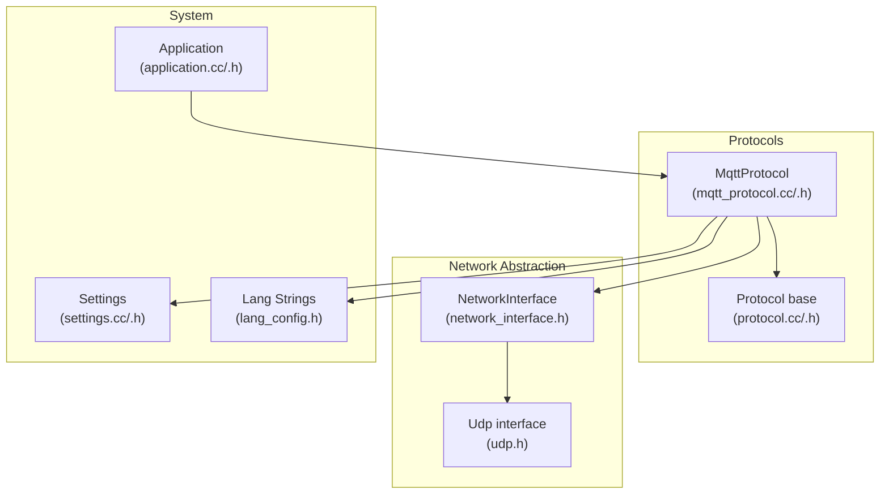
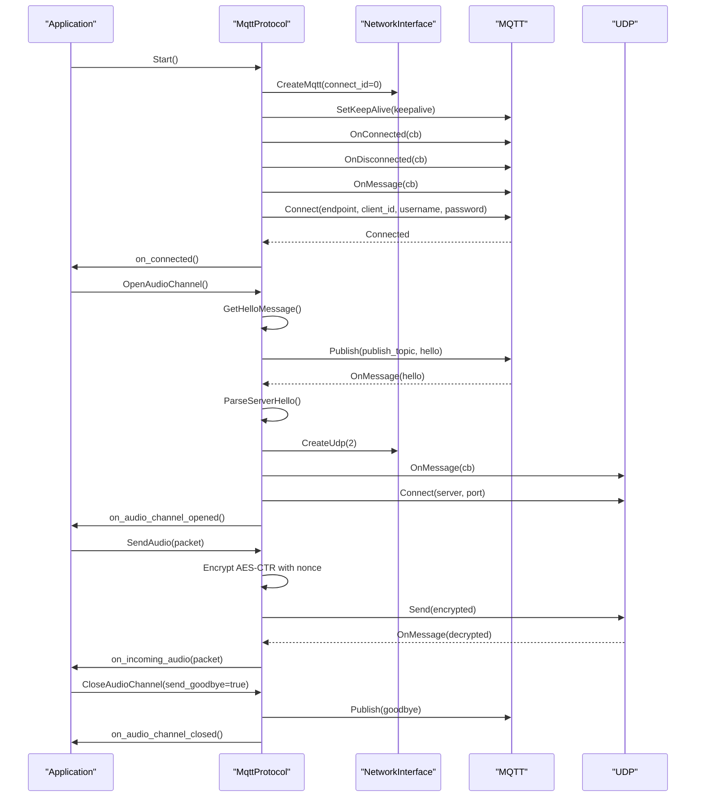
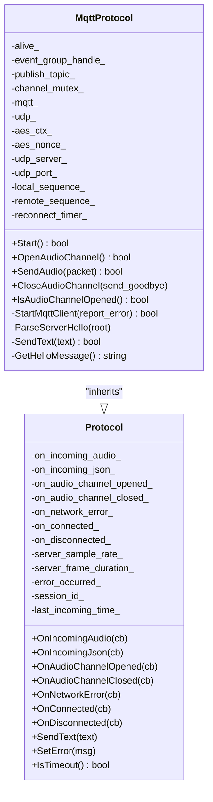
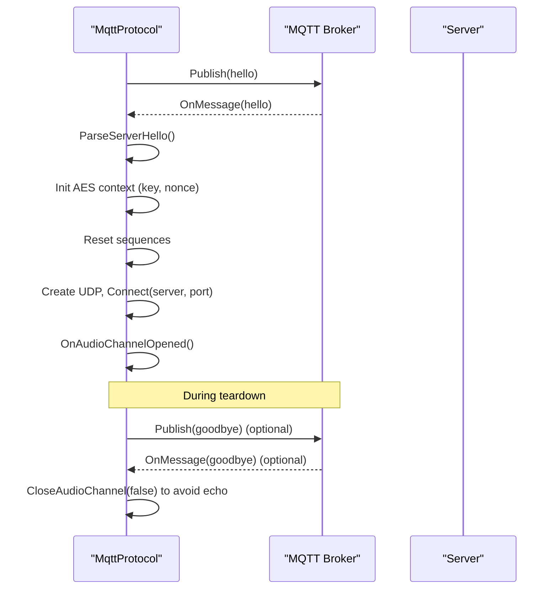
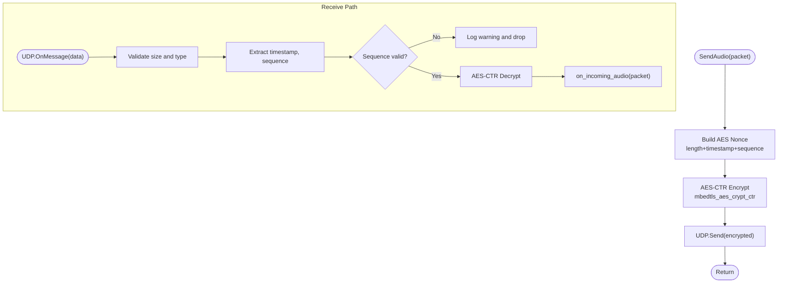
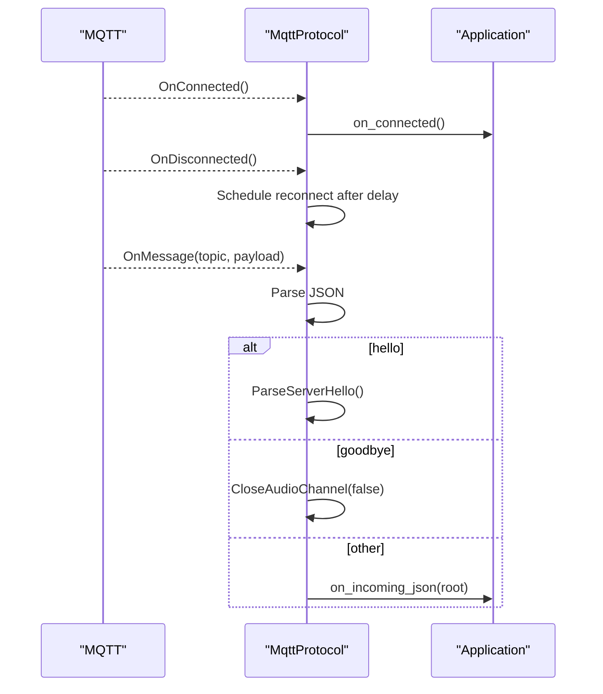
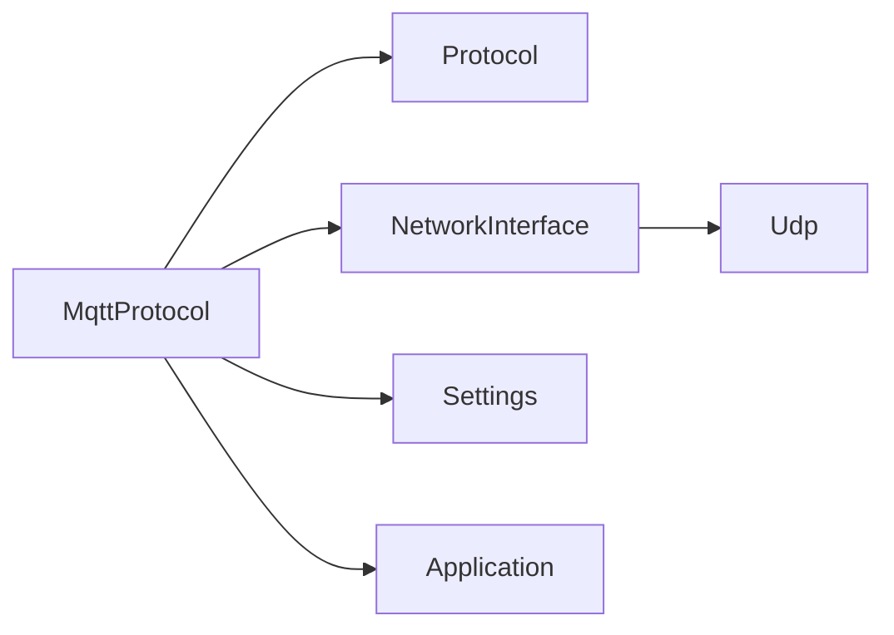

# MQTT Protocol Implementation

<cite>
**Referenced Files in This Document**
- [mqtt_protocol.h](file://main/protocols/mqtt_protocol.h)
- [mqtt_protocol.cc](file://main/protocols/mqtt_protocol.cc)
- [protocol.h](file://main/protocols/protocol.h)
- [protocol.cc](file://main/protocols/protocol.cc)
- [network_interface.h](file://managed_components/78__esp-ml307/include/network_interface.h)
- [udp.h](file://managed_components/78__esp-ml307/include/udp.h)
- [settings.h](file://main/settings.h)
- [settings.cc](file://main/settings.cc)
- [application.h](file://main/application.h)
- [application.cc](file://main/application.cc)
- [lang_config.h](file://main/assets/lang_config.h)
</cite>

## Table of Contents
1. [Introduction](#introduction)
2. [Project Structure](#project-structure)
3. [Core Components](#core-components)
4. [Architecture Overview](#architecture-overview)
5. [Detailed Component Analysis](#detailed-component-analysis)
6. [Dependency Analysis](#dependency-analysis)
7. [Performance Considerations](#performance-considerations)
8. [Troubleshooting Guide](#troubleshooting-guide)
9. [Conclusion](#conclusion)
10. [Appendices](#appendices)

## Introduction
This document explains the MQTT-based protocol implementation for reliable message delivery and cloud connectivity in the project. It covers MQTT client initialization and connection management, automatic reconnection with configurable intervals, the hello/goodbye handshake for secure audio channels, session management, and timeout detection. It also documents encrypted audio streaming over UDP via the MQTT broker, including AES-CTR encryption, nonce handling, and sequence number validation. Configuration parameters for broker endpoints, credentials, and keepalive intervals are described, along with the event-driven architecture, JSON message parsing with cJSON, and practical examples of message formats and error handling.

## Project Structure
The MQTT protocol implementation resides under the protocols module and integrates with the network abstraction layer and settings storage. The application orchestrates protocol lifecycle and scheduling of tasks.

**Diagram sources**
- [mqtt_protocol.h:26-62](file://main/protocols/mqtt_protocol.h#L26-L62)
- [mqtt_protocol.cc:59-152](file://main/protocols/mqtt_protocol.cc#L59-L152)
- [protocol.h:44-95](file://main/protocols/protocol.h#L44-L95)
- [network_interface.h:11-22](file://managed_components/78__esp-ml307/include/network_interface.h#L11-L22)
- [udp.h:8-26](file://managed_components/78__esp-ml307/include/udp.h#L8-L26)
- [application.h:42-177](file://main/application.h#L42-L177)
- [settings.h:7-26](file://main/settings.h#L7-L26)

**Section sources**
- [mqtt_protocol.h:1-66](file://main/protocols/mqtt_protocol.h#L1-L66)
- [mqtt_protocol.cc:1-390](file://main/protocols/mqtt_protocol.cc#L1-L390)
- [protocol.h:1-99](file://main/protocols/protocol.h#L1-L99)
- [protocol.cc:1-92](file://main/protocols/protocol.cc#L1-L92)
- [network_interface.h:1-25](file://managed_components/78__esp-ml307/include/network_interface.h#L1-L25)
- [udp.h:1-29](file://managed_components/78__esp-ml307/include/udp.h#L1-L29)
- [application.h:1-195](file://main/application.h#L1-L195)
- [application.cc:1-482](file://main/application.cc#L1-L482)
- [settings.h:1-29](file://main/settings.h#L1-L29)
- [settings.cc:1-109](file://main/settings.cc#L1-L109)
- [lang_config.h:165-191](file://main/assets/lang_config.h#L165-L191)

## Core Components
- MqttProtocol: Implements MQTT-based audio channel establishment and encrypted UDP streaming. Manages MQTT connection, JSON message parsing, hello/goodbye handshake, AES-CTR encryption, and sequence validation.
- Protocol: Base class defining event callbacks, session management, and timeout detection.
- NetworkInterface/Udp: Abstractions for MQTT and UDP creation and operations.
- Settings: Persistent storage for MQTT endpoint, credentials, and keepalive interval.
- Application: Schedules protocol tasks, manages state transitions, and coordinates protocol lifecycle.

Key responsibilities:
- Initialization and configuration via Settings namespace "mqtt".
- Connection lifecycle with automatic reconnection on disconnect.
- Hello handshake to negotiate UDP transport, session ID, and crypto material.
- Encrypted audio streaming with AES-CTR and sequence validation.
- Timeout detection and error propagation via Protocol base.

**Section sources**
- [mqtt_protocol.h:26-62](file://main/protocols/mqtt_protocol.h#L26-L62)
- [mqtt_protocol.cc:59-152](file://main/protocols/mqtt_protocol.cc#L59-L152)
- [protocol.h:44-95](file://main/protocols/protocol.h#L44-L95)
- [protocol.cc:82-91](file://main/protocols/protocol.cc#L82-L91)
- [network_interface.h:11-22](file://managed_components/78__esp-ml307/include/network_interface.h#L11-L22)
- [udp.h:8-26](file://managed_components/78__esp-ml307/include/udp.h#L8-L26)
- [settings.h:7-26](file://main/settings.h#L7-L26)
- [settings.cc:21-59](file://main/settings.cc#L21-L59)
- [application.h:129-177](file://main/application.h#L129-L177)

## Architecture Overview
The system uses an event-driven architecture:
- Application initializes and schedules protocol operations.
- MqttProtocol creates MQTT and UDP instances via NetworkInterface.
- MQTT receives JSON messages; on hello, it configures AES keys and opens UDP.
- Audio packets are encrypted with AES-CTR and transmitted over UDP.
- Goodbye closes the channel gracefully; timeouts trigger error reporting.

**Diagram sources**
- [mqtt_protocol.cc:59-152](file://main/protocols/mqtt_protocol.cc#L59-L152)
- [mqtt_protocol.cc:215-295](file://main/protocols/mqtt_protocol.cc#L215-L295)
- [mqtt_protocol.cc:166-190](file://main/protocols/mqtt_protocol.cc#L166-L190)
- [network_interface.h:11-22](file://managed_components/78__esp-ml307/include/network_interface.h#L11-L22)
- [udp.h:8-26](file://managed_components/78__esp-ml307/include/udp.h#L8-L26)
- [application.h:129-177](file://main/application.h#L129-L177)

## Detailed Component Analysis

### MqttProtocol Class
Responsibilities:
- Manage MQTT lifecycle: connect, disconnect, reconnect.
- Parse incoming JSON messages and route to handlers.
- Build and send hello requests for audio channel negotiation.
- Establish UDP channel and handle encrypted audio streaming.
- Track session ID, sequence numbers, and AES context.
- Integrate with Application scheduler for safe task execution.

Key methods and behaviors:
- Constructor initializes event group and reconnect timer.
- Destructor stops timers, resets resources, and clears event group.
- StartMqttClient reads Settings, creates MQTT, registers callbacks, and connects.
- OnConnected clears reconnect timer; OnDisconnected schedules reconnect.
- OnMessage parses JSON, dispatches hello/goodbye, or forwards to Protocol.
- ParseServerHello extracts session_id, audio_params, and UDP crypto material.
- OpenAudioChannel sends hello, waits for server response, configures AES, and opens UDP.
- SendAudio encrypts with AES-CTR, increments local sequence, and sends over UDP.
- CloseAudioChannel optionally sends goodbye and invokes callbacks.

**Diagram sources**
- [protocol.h:44-95](file://main/protocols/protocol.h#L44-L95)
- [mqtt_protocol.h:26-62](file://main/protocols/mqtt_protocol.h#L26-L62)

**Section sources**
- [mqtt_protocol.h:13-54](file://main/protocols/mqtt_protocol.h#L13-L54)
- [mqtt_protocol.cc:59-152](file://main/protocols/mqtt_protocol.cc#L59-L152)
- [mqtt_protocol.cc:215-295](file://main/protocols/mqtt_protocol.cc#L215-L295)
- [mqtt_protocol.cc:166-190](file://main/protocols/mqtt_protocol.cc#L166-L190)
- [mqtt_protocol.cc:322-366](file://main/protocols/mqtt_protocol.cc#L322-L366)

### Hello/Goodbye Handshake and Session Management
- Client sends a JSON hello containing transport type, features, and audio parameters.
- Server responds with hello including session_id, audio_params, and UDP configuration (server, port, key, nonce).
- MqttProtocol parses the server hello, initializes AES context with provided key and nonce, resets sequence counters, and signals channel opened.
- Goodbye message can be initiated by either client or server; the protocol avoids ping-pong by not echoing goodbye when initiated by the server.

**Diagram sources**
- [mqtt_protocol.cc:297-320](file://main/protocols/mqtt_protocol.cc#L297-L320)
- [mqtt_protocol.cc:322-366](file://main/protocols/mqtt_protocol.cc#L322-L366)
- [mqtt_protocol.cc:113-132](file://main/protocols/mqtt_protocol.cc#L113-L132)
- [mqtt_protocol.cc:192-213](file://main/protocols/mqtt_protocol.cc#L192-L213)

**Section sources**
- [mqtt_protocol.cc:297-320](file://main/protocols/mqtt_protocol.cc#L297-L320)
- [mqtt_protocol.cc:322-366](file://main/protocols/mqtt_protocol.cc#L322-L366)
- [mqtt_protocol.cc:113-132](file://main/protocols/mqtt_protocol.cc#L113-L132)
- [mqtt_protocol.cc:192-213](file://main/protocols/mqtt_protocol.cc#L192-L213)

### Encrypted Audio Streaming Over UDP
- Nonce composition: fixed header + payload length (16-bit) + timestamp (32-bit) + sequence (32-bit).
- AES-CTR encryption: uses mbedtls_aes_crypt_ctr with the per-session nonce.
- UDP packet format: type, flags, payload_len, ssrc, timestamp, sequence, encrypted payload.
- Sequence validation: rejects out-of-order or duplicate packets; logs warnings for gaps.

**Diagram sources**
- [mqtt_protocol.cc:166-190](file://main/protocols/mqtt_protocol.cc#L166-L190)
- [mqtt_protocol.cc:243-287](file://main/protocols/mqtt_protocol.cc#L243-L287)

**Section sources**
- [mqtt_protocol.cc:166-190](file://main/protocols/mqtt_protocol.cc#L166-L190)
- [mqtt_protocol.cc:243-287](file://main/protocols/mqtt_protocol.cc#L243-L287)

### Configuration Parameters
Parameters are stored under the "mqtt" namespace in Settings:
- endpoint: Broker address and optional port (e.g., host:port). Defaults to TLS port 8883 if not specified.
- client_id: MQTT client identifier.
- username/password: Authentication credentials.
- keepalive: Keepalive interval in seconds (default applied if missing).
- publish_topic: Topic used for publishing JSON control messages.

These are read during StartMqttClient to configure the MQTT client and connection.

**Section sources**
- [mqtt_protocol.cc:65-71](file://main/protocols/mqtt_protocol.cc#L65-L71)
- [settings.cc:21-59](file://main/settings.cc#L21-L59)
- [settings.h:12-18](file://main/settings.h#L12-L18)

### Event-Driven Architecture and Callbacks
- Connection callbacks: OnConnected and OnDisconnected notify the application and manage reconnect scheduling.
- JSON message routing: OnMessage parses JSON and routes to ParseServerHello, goodbye handling, or generic JSON handler.
- Audio callbacks: on_audio_channel_opened/on_audio_channel_closed and on_incoming_audio integrate with higher-level audio pipeline.
- Error propagation: SetError marks error state and triggers on_network_error callback.

**Diagram sources**
- [mqtt_protocol.cc:85-98](file://main/protocols/mqtt_protocol.cc#L85-L98)
- [mqtt_protocol.cc:100-132](file://main/protocols/mqtt_protocol.cc#L100-L132)
- [protocol.cc:7-33](file://main/protocols/protocol.cc#L7-L33)

**Section sources**
- [mqtt_protocol.cc:85-98](file://main/protocols/mqtt_protocol.cc#L85-L98)
- [mqtt_protocol.cc:100-132](file://main/protocols/mqtt_protocol.cc#L100-L132)
- [protocol.cc:7-33](file://main/protocols/protocol.cc#L7-L33)

### Timeout Detection
- Last incoming time is updated on each JSON message arrival.
- IsTimeout checks elapsed time against a 120-second threshold and logs an error if exceeded.

**Section sources**
- [mqtt_protocol.cc:131](file://main/protocols/mqtt_protocol.cc#L131)
- [protocol.cc:82-91](file://main/protocols/protocol.cc#L82-L91)

## Dependency Analysis
- MqttProtocol depends on Protocol for callbacks and shared state.
- NetworkInterface abstracts MQTT and UDP creation; MqttProtocol uses it to instantiate network primitives.
- Settings provides configuration values for MQTT connection parameters.
- Application provides scheduling and state coordination for safe task execution.

**Diagram sources**
- [mqtt_protocol.h:26-62](file://main/protocols/mqtt_protocol.h#L26-L62)
- [protocol.h:44-95](file://main/protocols/protocol.h#L44-L95)
- [network_interface.h:11-22](file://managed_components/78__esp-ml307/include/network_interface.h#L11-L22)
- [udp.h:8-26](file://managed_components/78__esp-ml307/include/udp.h#L8-L26)
- [settings.h:7-26](file://main/settings.h#L7-L26)
- [application.h:129-177](file://main/application.h#L129-L177)

**Section sources**
- [mqtt_protocol.h:26-62](file://main/protocols/mqtt_protocol.h#L26-L62)
- [protocol.h:44-95](file://main/protocols/protocol.h#L44-L95)
- [network_interface.h:11-22](file://managed_components/78__esp-ml307/include/network_interface.h#L11-L22)
- [udp.h:8-26](file://managed_components/78__esp-ml307/include/udp.h#L8-L26)
- [settings.h:7-26](file://main/settings.h#L7-L26)
- [application.h:129-177](file://main/application.h#L129-L177)

## Performance Considerations
- Reconnect scheduling uses a one-shot timer to avoid overlapping attempts and reduce CPU load.
- AES-CTR encryption is efficient for streaming; ensure nonce uniqueness per packet to maintain security.
- Sequence validation prevents unnecessary decryption work on out-of-order packets.
- Keepalive interval should balance responsiveness with network overhead; defaults are applied if not configured.

## Troubleshooting Guide
Common issues and resolutions:
- MQTT endpoint not specified: Verify "mqtt:endpoint" is set; otherwise, connection fails early.
- Connection failures: Check broker address/port, credentials, and TLS settings; inspect last error code from MQTT client.
- No hello response: Confirm publish topic and broker connectivity; verify hello message format.
- Audio channel not opening: Ensure hello was parsed successfully and UDP connect succeeds.
- Timeout errors: Inspect network stability and server responsiveness; check IsTimeout logs.
- Encryption failures: Validate AES key and nonce formats; ensure consistent nonce construction.

Error propagation:
- Errors are reported via SetError and on_network_error callback, with localized messages from Lang strings.

**Section sources**
- [mqtt_protocol.cc:73-79](file://main/protocols/mqtt_protocol.cc#L73-L79)
- [mqtt_protocol.cc:144-148](file://main/protocols/mqtt_protocol.cc#L144-L148)
- [mqtt_protocol.cc:233-238](file://main/protocols/mqtt_protocol.cc#L233-L238)
- [protocol.cc:35-40](file://main/protocols/protocol.cc#L35-L40)
- [lang_config.h:165-191](file://main/assets/lang_config.h#L165-L191)

## Conclusion
The MQTT protocol implementation provides a robust, event-driven foundation for reliable cloud connectivity and secure audio streaming. It manages connection lifecycles, automatic reconnection, JSON-based handshakes, and encrypted UDP transport with strict sequence validation. Configuration is centralized via Settings, and integration with Application ensures safe scheduling and state coordination.

## Appendices

### Practical Examples

- Hello message (client to server):
  - Fields: type, version, transport, features, audio_params.
  - Example outline: type="hello", transport="udp", features include "mcp" and optional "aec", audio_params specify format, sample_rate, channels, frame_duration.

- Goodbye message (client to server):
  - Fields: session_id, type="goodbye".

- UDP encrypted packet format:
  - Header: type, flags, payload_len, ssrc, timestamp, sequence.
  - Body: encrypted audio payload derived from AES-CTR.

- Configuration keys (Settings "mqtt"):
  - endpoint, client_id, username, password, keepalive, publish_topic.

- Error codes and messages:
  - SERVER_NOT_FOUND, SERVER_NOT_CONNECTED, SERVER_ERROR, SERVER_TIMEOUT.
  - These are surfaced via SetError and on_network_error callback.

**Section sources**
- [mqtt_protocol.cc:297-320](file://main/protocols/mqtt_protocol.cc#L297-L320)
- [mqtt_protocol.cc:202-208](file://main/protocols/mqtt_protocol.cc#L202-L208)
- [mqtt_protocol.cc:244-258](file://main/protocols/mqtt_protocol.cc#L244-L258)
- [settings.cc:21-59](file://main/settings.cc#L21-L59)
- [protocol.cc:35-40](file://main/protocols/protocol.cc#L35-L40)
- [lang_config.h:165-191](file://main/assets/lang_config.h#L165-L191)