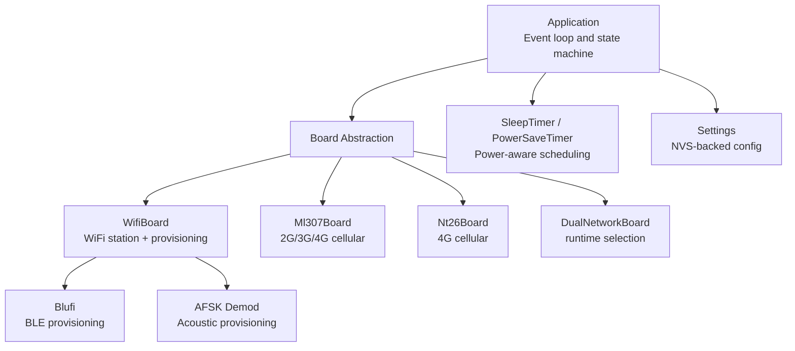
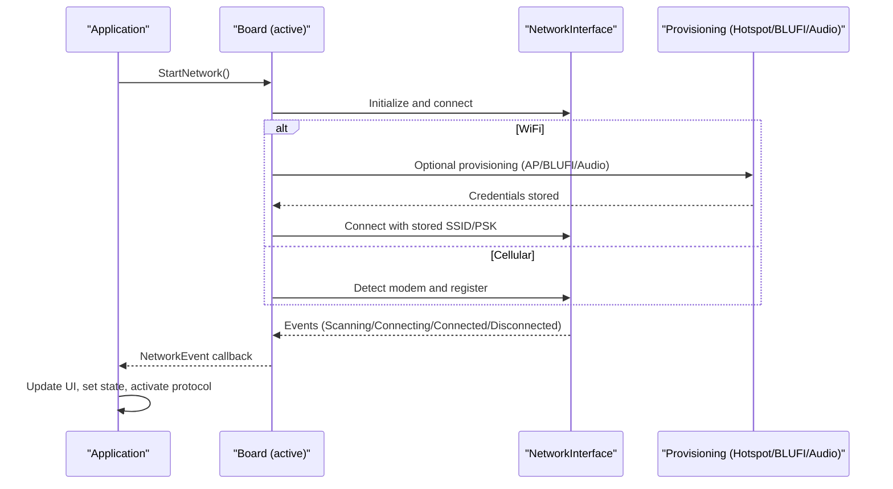
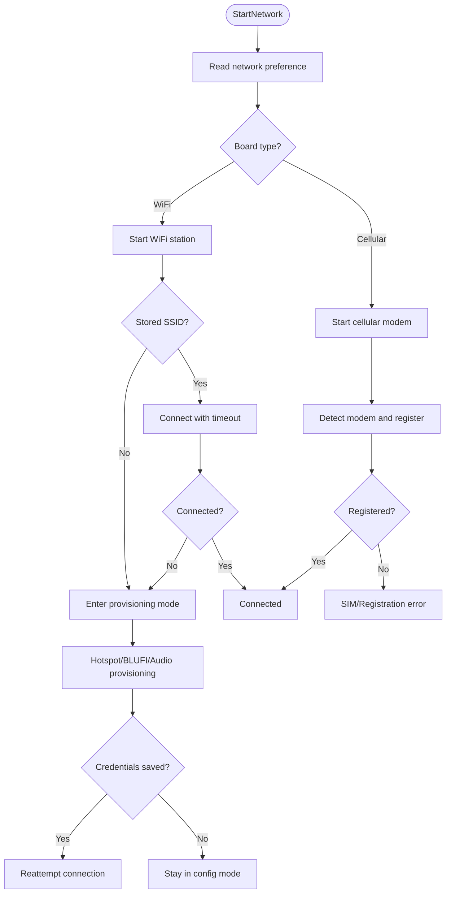
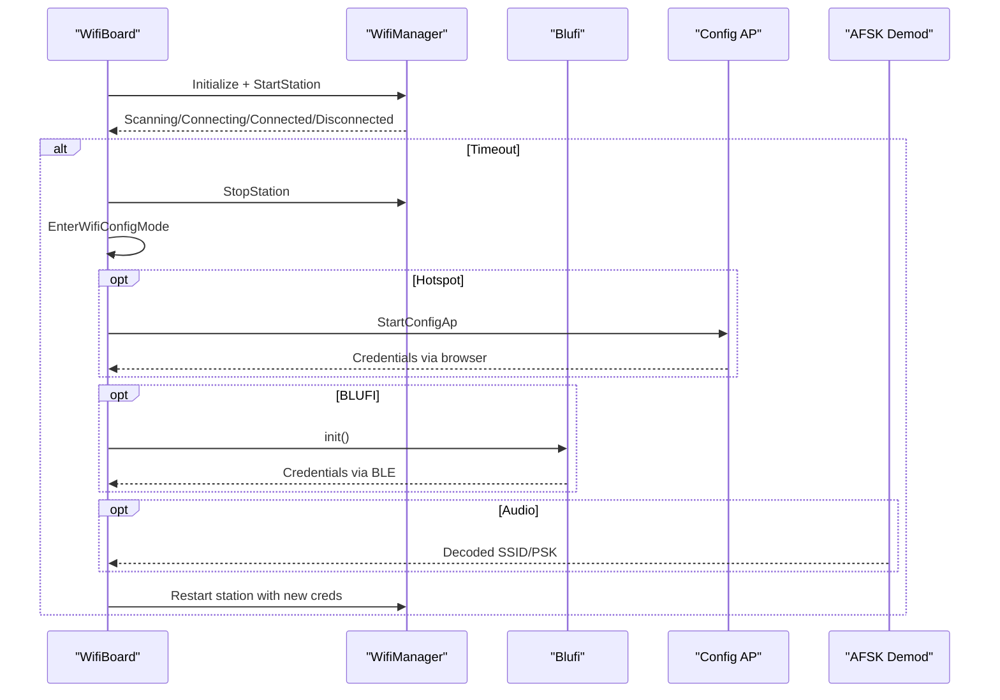
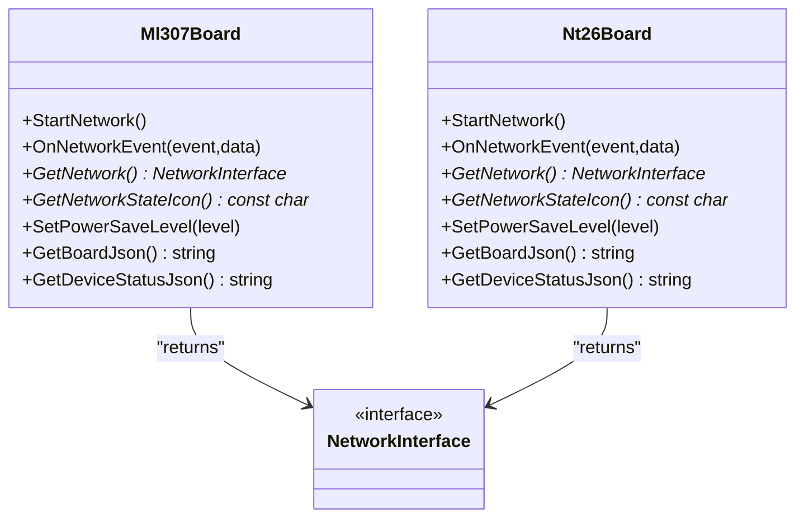
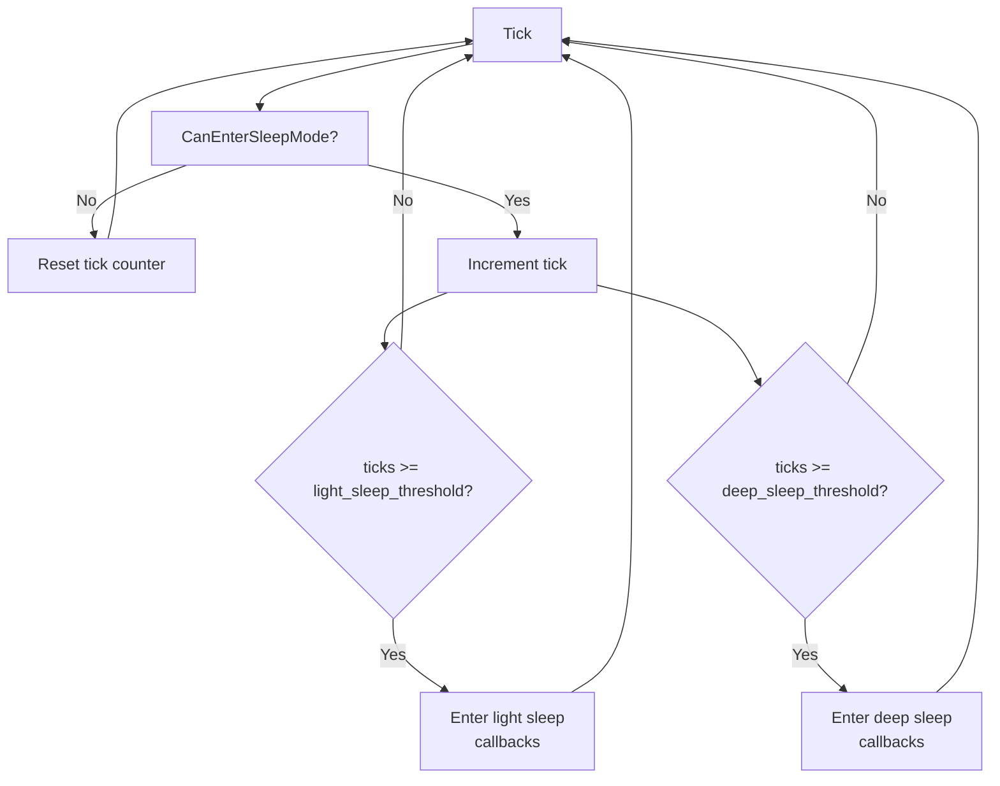
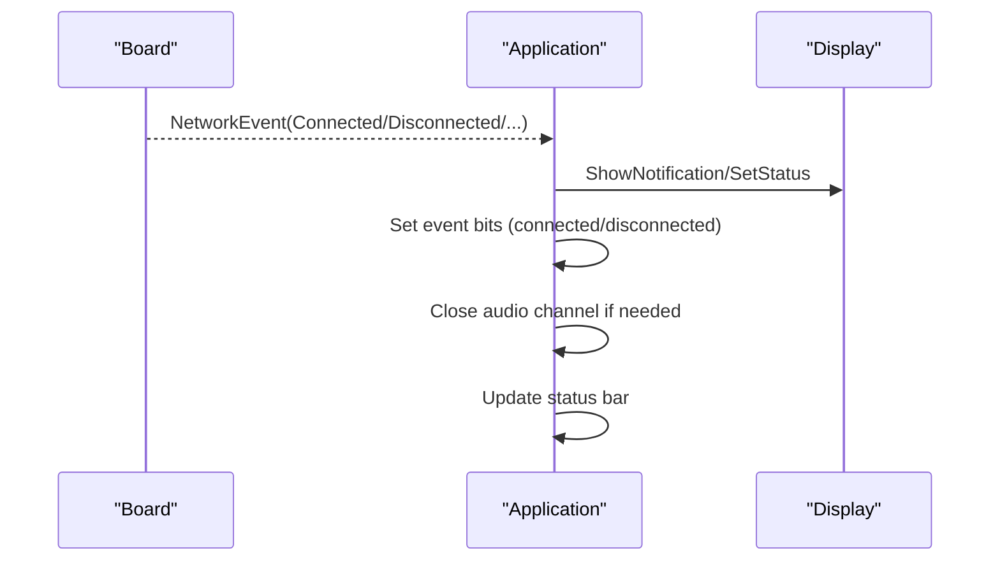
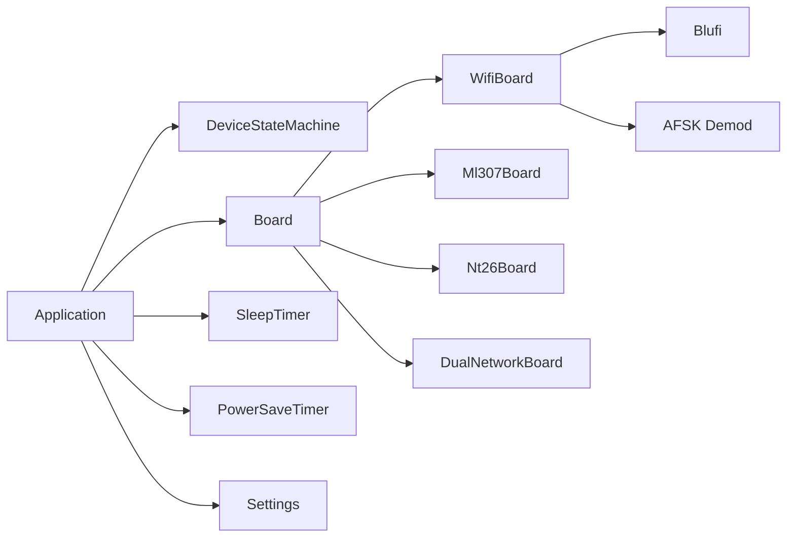

# Network Management and Connectivity

<cite>
**Referenced Files in This Document**
- [wifi_board.h](file://main/boards/common/wifi_board.h)
- [wifi_board.cc](file://main/boards/common/wifi_board.cc)
- [dual_network_board.h](file://main/boards/common/dual_network_board.h)
- [dual_network_board.cc](file://main/boards/common/dual_network_board.cc)
- [ml307_board.h](file://main/boards/common/ml307_board.h)
- [ml307_board.cc](file://main/boards/common/ml307_board.cc)
- [nt26_board.h](file://main/boards/common/nt26_board.h)
- [nt26_board.cc](file://main/boards/common/nt26_board.cc)
- [blufi.cpp](file://main/boards/common/blufi.cpp)
- [afsk_demod.cc](file://main/boards/common/afsk_demod.cc)
- [application.h](file://main/application.h)
- [application.cc](file://main/application.cc)
- [device_state_machine.h](file://main/device_state_machine.h)
- [device_state_machine.cc](file://main/device_state_machine.cc)
- [sleep_timer.h](file://main/boards/common/sleep_timer.h)
- [sleep_timer.cc](file://main/boards/common/sleep_timer.cc)
- [power_save_timer.h](file://main/boards/common/power_save_timer.h)
- [power_save_timer.cc](file://main/boards/common/power_save_timer.cc)
- [adc_battery_monitor.h](file://main/boards/common/adc_battery_monitor.h)
- [settings.h](file://main/settings.h)
</cite>

## Table of Contents
1. [Introduction](#introduction)
2. [Project Structure](#project-structure)
3. [Core Components](#core-components)
4. [Architecture Overview](#architecture-overview)
5. [Detailed Component Analysis](#detailed-component-analysis)
6. [Dependency Analysis](#dependency-analysis)
7. [Performance Considerations](#performance-considerations)
8. [Troubleshooting Guide](#troubleshooting-guide)
9. [Conclusion](#conclusion)
10. [Appendices](#appendices)

## Introduction
This document describes the network management and connectivity subsystem for a device that supports multiple transport technologies: WiFi, cellular (2G/3G/4G), and Bluetooth-based provisioning. It explains automatic network selection, connection prioritization, and failover mechanisms across these transports. It also documents power-aware optimization including sleep scheduling, duty cycling, and battery conservation strategies. The document covers network event handling, connection state monitoring, recovery procedures for interrupted connections, configuration management for network profiles and security policies, and practical diagnostics for signal strength and performance. Finally, it outlines integration patterns for cloud services and enterprise-grade redundancy.

## Project Structure
The network stack is organized around board-specific implementations that expose a unified interface for starting connections, reporting state, and applying power-saving modes. A dual-network board abstraction allows runtime switching between WiFi and cellular. Provisioning pathways include Wi-Fi hotspots, ESP-BLUFI over BLE, and acoustic provisioning via audio.

**Diagram sources**
- [application.cc:116-171](file://main/application.cc#L116-L171)
- [dual_network_board.cc:64-73](file://main/boards/common/dual_network_board.cc#L64-L73)
- [wifi_board.cc:53-88](file://main/boards/common/wifi_board.cc#L53-L88)
- [ml307_board.cc:134-141](file://main/boards/common/ml307_board.cc#L134-L141)
- [nt26_board.cc:67-123](file://main/boards/common/nt26_board.cc#L67-L123)
- [blufi.cpp:104-138](file://main/boards/common/blufi.cpp#L104-L138)
- [afsk_demod.cc:80-108](file://main/boards/common/afsk_demod.cc#L80-L108)
- [sleep_timer.cc:14-52](file://main/boards/common/sleep_timer.cc#L14-L52)
- [power_save_timer.cc:10-48](file://main/boards/common/power_save_timer.cc#L10-L48)
- [settings.h:7-26](file://main/settings.h#L7-L26)

**Section sources**
- [application.cc:116-171](file://main/application.cc#L116-L171)
- [dual_network_board.cc:64-73](file://main/boards/common/dual_network_board.cc#L64-L73)
- [wifi_board.cc:53-88](file://main/boards/common/wifi_board.cc#L53-L88)
- [ml307_board.cc:134-141](file://main/boards/common/ml307_board.cc#L134-L141)
- [nt26_board.cc:67-123](file://main/boards/common/nt26_board.cc#L67-L123)
- [blufi.cpp:104-138](file://main/boards/common/blufi.cpp#L104-L138)
- [afsk_demod.cc:80-108](file://main/boards/common/afsk_demod.cc#L80-L108)
- [sleep_timer.cc:14-52](file://main/boards/common/sleep_timer.cc#L14-L52)
- [power_save_timer.cc:10-48](file://main/boards/common/power_save_timer.cc#L10-L48)
- [settings.h:7-26](file://main/settings.h#L7-L26)

## Core Components
- Board abstraction layer: Provides a uniform interface for starting networks, receiving events, and adjusting power saving.
- WifiBoard: Implements WiFi station lifecycle, scanning, connecting, and multiple provisioning modes (hotspot, BLUFI, acoustic).
- Ml307Board and Nt26Board: Implement cellular modems with registration, signal quality reporting, and error handling.
- DualNetworkBoard: Dynamically selects between WiFi and cellular based on persistent settings and exposes a single interface.
- Application: Central event loop that reacts to network events, updates UI, and coordinates protocol activation.
- Power timers: SleepTimer and PowerSaveTimer implement duty-cycling and CPU frequency scaling to conserve energy.
- Settings: Non-volatile storage for network preferences and runtime toggles.

**Section sources**
- [wifi_board.h:39-73](file://main/boards/common/wifi_board.h#L39-L73)
- [wifi_board.cc:53-88](file://main/boards/common/wifi_board.cc#L53-L88)
- [ml307_board.h:48-61](file://main/boards/common/ml307_board.h#L48-L61)
- [ml307_board.cc:134-141](file://main/boards/common/ml307_board.cc#L134-L141)
- [nt26_board.h:48-62](file://main/boards/common/nt26_board.h#L48-L62)
- [nt26_board.cc:67-123](file://main/boards/common/nt26_board.cc#L67-L123)
- [dual_network_board.h:36-58](file://main/boards/common/dual_network_board.h#L36-L58)
- [dual_network_board.cc:64-73](file://main/boards/common/dual_network_board.cc#L64-L73)
- [application.h:42-177](file://main/application.h#L42-L177)
- [application.cc:116-171](file://main/application.cc#L116-L171)
- [sleep_timer.h:8-32](file://main/boards/common/sleep_timer.h#L8-L32)
- [power_save_timer.h:8-34](file://main/boards/common/power_save_timer.h#L8-L34)
- [settings.h:7-26](file://main/settings.h#L7-L26)

## Architecture Overview
The system orchestrates connectivity across transports with a focus on resilience and power efficiency. The Application subscribes to network events from the active Board, which encapsulates either WiFi, ML307 cellular, or NT26 cellular. Provisioning occurs through Wi-Fi AP, BLUFI, or acoustic audio frames. Power-awareness is achieved via periodic timers that reduce CPU frequency and suspend non-essential peripherals.

**Diagram sources**
- [application.cc:116-171](file://main/application.cc#L116-L171)
- [wifi_board.cc:53-88](file://main/boards/common/wifi_board.cc#L53-L88)
- [blufi.cpp:104-138](file://main/boards/common/blufi.cpp#L104-L138)
- [afsk_demod.cc:80-108](file://main/boards/common/afsk_demod.cc#L80-L108)
- [ml307_board.cc:134-141](file://main/boards/common/ml307_board.cc#L134-L141)
- [nt26_board.cc:67-123](file://main/boards/common/nt26_board.cc#L67-L123)

## Detailed Component Analysis

### Automatic Network Selection and Failover
- Runtime selection: DualNetworkBoard reads a persisted preference and initializes the corresponding board. Switching persists a new preference and reboots to apply.
- Failover behavior: When WiFi lacks stored credentials or times out, the system enters provisioning mode. On successful provisioning, it reconnects automatically. Cellular paths report explicit errors for SIM issues or registration denial, allowing Application to alert and potentially retry or wait.

**Diagram sources**
- [dual_network_board.cc:23-57](file://main/boards/common/dual_network_board.cc#L23-L57)
- [wifi_board.cc:90-105](file://main/boards/common/wifi_board.cc#L90-L105)
- [wifi_board.cc:165-171](file://main/boards/common/wifi_board.cc#L165-L171)
- [ml307_board.cc:67-132](file://main/boards/common/ml307_board.cc#L67-L132)
- [nt26_board.cc:67-123](file://main/boards/common/nt26_board.cc#L67-L123)

**Section sources**
- [dual_network_board.cc:23-57](file://main/boards/common/dual_network_board.cc#L23-L57)
- [wifi_board.cc:90-105](file://main/boards/common/wifi_board.cc#L90-L105)
- [wifi_board.cc:165-171](file://main/boards/common/wifi_board.cc#L165-L171)
- [ml307_board.cc:67-132](file://main/boards/common/ml307_board.cc#L67-L132)
- [nt26_board.cc:67-123](file://main/boards/common/nt26_board.cc#L67-L123)

### WiFi Orchestration and Provisioning
- Station lifecycle: WifiBoard initializes the WiFi manager, forwards events, and manages a connection timeout. On timeout, it stops the station and enters provisioning mode.
- Provisioning modes:
  - Hotspot: Starts a configuration AP and displays hints for web-based configuration.
  - BLUFI: Initializes ESP-BLUFI, optionally releases BLE controller memory after successful WiFi connection.
  - Acoustic: Receives SSID/password via decoded audio frames and saves them for subsequent connection attempts.
- UI and state: Application updates notifications and status messages for scanning, connecting, and provisioning.

**Diagram sources**
- [wifi_board.cc:53-88](file://main/boards/common/wifi_board.cc#L53-L88)
- [wifi_board.cc:165-171](file://main/boards/common/wifi_board.cc#L165-L171)
- [wifi_board.cc:173-221](file://main/boards/common/wifi_board.cc#L173-L221)
- [blufi.cpp:104-138](file://main/boards/common/blufi.cpp#L104-L138)
- [afsk_demod.cc:80-108](file://main/boards/common/afsk_demod.cc#L80-L108)

**Section sources**
- [wifi_board.cc:53-88](file://main/boards/common/wifi_board.cc#L53-L88)
- [wifi_board.cc:165-171](file://main/boards/common/wifi_board.cc#L165-L171)
- [wifi_board.cc:173-221](file://main/boards/common/wifi_board.cc#L173-L221)
- [blufi.cpp:104-138](file://main/boards/common/blufi.cpp#L104-L138)
- [afsk_demod.cc:80-108](file://main/boards/common/afsk_demod.cc#L80-L108)

### Cellular Orchestration (ML307 and NT26)
- ML307: Detects the modem via high-speed UART, registers to the network with retry limits, and reports CSQ and carrier info. Emits explicit events for SIM missing, registration denied, and timeouts.
- NT26: Initializes a UART Ethernet modem, monitors readiness with a timer, and translates events to NetworkEvents. Applies PM locks for performance and releases them for low power.

**Diagram sources**
- [ml307_board.h:48-61](file://main/boards/common/ml307_board.h#L48-L61)
- [ml307_board.cc:134-141](file://main/boards/common/ml307_board.cc#L134-L141)
- [nt26_board.h:48-62](file://main/boards/common/nt26_board.h#L48-L62)
- [nt26_board.cc:137-140](file://main/boards/common/nt26_board.cc#L137-L140)

**Section sources**
- [ml307_board.cc:67-132](file://main/boards/common/ml307_board.cc#L67-L132)
- [nt26_board.cc:67-123](file://main/boards/common/nt26_board.cc#L67-L123)
- [nt26_board.cc:161-178](file://main/boards/common/nt26_board.cc#L161-L178)

### Power-Aware Network Optimization
- Sleep scheduling: SleepTimer periodically checks conditions and triggers light/deep sleep callbacks. It can be enabled/disabled via settings and integrates with Application’s CanEnterSleepMode.
- Duty cycling and CPU scaling: PowerSaveTimer reduces CPU frequency and can disable wake word detection and audio input to minimize power draw. It can schedule shutdown on extended idle.
- Battery monitoring: ADC-based battery monitor exposes charging/discharging status and battery level for UI and policy decisions.

**Diagram sources**
- [sleep_timer.cc:66-104](file://main/boards/common/sleep_timer.cc#L66-L104)
- [power_save_timer.cc:62-104](file://main/boards/common/power_save_timer.cc#L62-L104)
- [application.cc:303-314](file://main/application.cc#L303-L314)

**Section sources**
- [sleep_timer.h:8-32](file://main/boards/common/sleep_timer.h#L8-L32)
- [sleep_timer.cc:14-52](file://main/boards/common/sleep_timer.cc#L14-L52)
- [sleep_timer.cc:66-104](file://main/boards/common/sleep_timer.cc#L66-L104)
- [power_save_timer.h:8-34](file://main/boards/common/power_save_timer.h#L8-L34)
- [power_save_timer.cc:10-48](file://main/boards/common/power_save_timer.cc#L10-L48)
- [power_save_timer.cc:62-104](file://main/boards/common/power_save_timer.cc#L62-L104)
- [adc_battery_monitor.h:9-31](file://main/boards/common/adc_battery_monitor.h#L9-L31)

### Network Event Handling and Recovery
- Application listens for NetworkEvents and updates UI, toggling event group bits for connected/disconnected states. On disconnect, it closes audio channels if needed and refreshes status.
- Device state machine validates transitions and notifies observers, ensuring robust state progression during network changes.

**Diagram sources**
- [application.cc:116-171](file://main/application.cc#L116-L171)
- [application.cc:303-314](file://main/application.cc#L303-L314)
- [device_state_machine.h:17-81](file://main/device_state_machine.h#L17-L81)

**Section sources**
- [application.cc:116-171](file://main/application.cc#L116-L171)
- [application.cc:303-314](file://main/application.cc#L303-L314)
- [device_state_machine.h:17-81](file://main/device_state_machine.h#L17-L81)
- [device_state_machine.cc:128-161](file://main/device_state_machine.cc#L128-L161)

### Configuration Management and Security Policies
- Network profiles: Stored SSIDs/passwords are managed by the provisioning pathway and consumed by WifiManager to connect automatically.
- Security: BLUFI initialization and deinitialization are handled; on successful WiFi connection, BLE controller memory is released to reduce footprint.
- Persistence: Network type preference is stored in NVS under a dedicated namespace and loaded at boot.

**Section sources**
- [blufi.cpp:104-138](file://main/boards/common/blufi.cpp#L104-L138)
- [wifi_board.cc:114-118](file://main/boards/common/wifi_board.cc#L114-L118)
- [dual_network_board.cc:23-33](file://main/boards/common/dual_network_board.cc#L23-L33)
- [settings.h:7-26](file://main/settings.h#L7-L26)

### Bandwidth Allocation and Diagnostics
- Signal strength monitoring:
  - WiFi: RSSI thresholds drive UI icon selection and status JSON signal rating.
  - Cellular: CSQ values are mapped to signal strength categories and exposed in status JSON.
- Performance metrics: Status JSON includes network type, SSID/carrier, signal rating, and chip temperature for diagnostics.

**Section sources**
- [wifi_board.cc:278-295](file://main/boards/common/wifi_board.cc#L278-L295)
- [wifi_board.cc:364-371](file://main/boards/common/wifi_board.cc#L364-L371)
- [ml307_board.cc:247-263](file://main/boards/common/ml307_board.cc#L247-L263)
- [nt26_board.cc:246-262](file://main/boards/common/nt26_board.cc#L246-L262)

## Dependency Analysis
The following diagram highlights key dependencies among components involved in network orchestration and power management.

**Diagram sources**
- [application.h:42-177](file://main/application.h#L42-L177)
- [device_state_machine.h:17-81](file://main/device_state_machine.h#L17-L81)
- [dual_network_board.h:36-58](file://main/boards/common/dual_network_board.h#L36-L58)
- [wifi_board.h:39-73](file://main/boards/common/wifi_board.h#L39-L73)
- [ml307_board.h:48-61](file://main/boards/common/ml307_board.h#L48-L61)
- [nt26_board.h:48-62](file://main/boards/common/nt26_board.h#L48-L62)
- [blufi.cpp:104-138](file://main/boards/common/blufi.cpp#L104-L138)
- [afsk_demod.cc:80-108](file://main/boards/common/afsk_demod.cc#L80-L108)
- [sleep_timer.h:8-32](file://main/boards/common/sleep_timer.h#L8-L32)
- [power_save_timer.h:8-34](file://main/boards/common/power_save_timer.h#L8-L34)
- [settings.h:7-26](file://main/settings.h#L7-L26)

**Section sources**
- [application.h:42-177](file://main/application.h#L42-L177)
- [device_state_machine.h:17-81](file://main/device_state_machine.h#L17-L81)
- [dual_network_board.h:36-58](file://main/boards/common/dual_network_board.h#L36-L58)
- [wifi_board.h:39-73](file://main/boards/common/wifi_board.h#L39-L73)
- [ml307_board.h:48-61](file://main/boards/common/ml307_board.h#L48-L61)
- [nt26_board.h:48-62](file://main/boards/common/nt26_board.h#L48-L62)
- [blufi.cpp:104-138](file://main/boards/common/blufi.cpp#L104-L138)
- [afsk_demod.cc:80-108](file://main/boards/common/afsk_demod.cc#L80-L108)
- [sleep_timer.h:8-32](file://main/boards/common/sleep_timer.h#L8-L32)
- [power_save_timer.h:8-34](file://main/boards/common/power_save_timer.h#L8-L34)
- [settings.h:7-26](file://main/settings.h#L7-L26)

## Performance Considerations
- Prefer low-power modes when idle: Use SleepTimer and PowerSaveTimer to reduce CPU frequency and suspend non-essential subsystems.
- Minimize blocking operations: Provisioning and connection routines are asynchronous; avoid long delays in callbacks.
- Optimize UI updates: Batch status updates and avoid frequent redraws during scanning or connecting.
- Monitor signal quality: Use RSSI/CSQ thresholds to inform fallback decisions and adjust expectations for throughput.

## Troubleshooting Guide
- WiFi connection timeout:
  - Symptom: After a fixed period, the device enters provisioning mode.
  - Action: Verify AP availability, credentials correctness, and antenna/antenna tuning. Retry connection after provisioning.
  - Reference: [wifi_board.cc:165-171](file://main/boards/common/wifi_board.cc#L165-L171)
- No SIM or registration denied (cellular):
  - Symptom: Modem error events indicate SIM missing or registration denied.
  - Action: Insert a valid SIM, check carrier support, and retry registration. Review logs for detailed error codes.
  - Reference: [ml307_board.cc:109-115](file://main/boards/common/ml307_board.cc#L109-L115), [nt26_board.cc:96-109](file://main/boards/common/nt26_board.cc#L96-L109)
- Provisioning failures:
  - Symptom: Credentials not saved or AP/BLUFI session ends without effect.
  - Action: Confirm provisioning method is supported, retry with correct SSID/password, and ensure audio decoding completes successfully.
  - References: [blufi.cpp:724-737](file://main/boards/common/blufi.cpp#L724-L737), [afsk_demod.cc:80-108](file://main/boards/common/afsk_demod.cc#L80-L108)
- DNS resolution or firewall issues:
  - Symptom: Device connects but cannot reach cloud services.
  - Action: Validate router DNS settings, firewall rules, and port forwarding if required. Test connectivity with a simple HTTP client or ping.
  - References: [wifi_board.cc:114-118](file://main/boards/common/wifi_board.cc#L114-L118), [application.cc:316-333](file://main/application.cc#L316-L333)
- Power conservation concerns:
  - Symptom: Battery drains quickly or device wakes frequently.
  - Action: Adjust sleep thresholds, disable unnecessary features, and confirm PowerSaveTimer is enabled and functioning.
  - References: [sleep_timer.cc:14-52](file://main/boards/common/sleep_timer.cc#L14-L52), [power_save_timer.cc:10-48](file://main/boards/common/power_save_timer.cc#L10-L48)

**Section sources**
- [wifi_board.cc:165-171](file://main/boards/common/wifi_board.cc#L165-L171)
- [ml307_board.cc:109-115](file://main/boards/common/ml307_board.cc#L109-L115)
- [nt26_board.cc:96-109](file://main/boards/common/nt26_board.cc#L96-L109)
- [blufi.cpp:724-737](file://main/boards/common/blufi.cpp#L724-L737)
- [afsk_demod.cc:80-108](file://main/boards/common/afsk_demod.cc#L80-L108)
- [application.cc:316-333](file://main/application.cc#L316-L333)
- [sleep_timer.cc:14-52](file://main/boards/common/sleep_timer.cc#L14-L52)
- [power_save_timer.cc:10-48](file://main/boards/common/power_save_timer.cc#L10-L48)

## Conclusion
The network management subsystem provides a robust, power-aware foundation for multi-transport connectivity. It supports automatic selection, resilient provisioning, and clear recovery procedures. With built-in diagnostics and power-saving controls, it is suitable for enterprise deployments requiring reliability and battery longevity.

## Appendices

### Network Diagnostic Procedures
- Signal strength verification:
  - WiFi: Observe UI icon and RSSI thresholds; correlate with status JSON signal rating.
  - Cellular: Check CSQ and carrier name in status JSON; map CSQ to signal category.
- Connectivity tests:
  - Confirm IP acquisition and basic HTTP reachability.
  - Validate DNS resolution and firewall rules.
- Provisioning validation:
  - Ensure SSID/password persistence after successful BLUFI/audio provisioning.

**Section sources**
- [wifi_board.cc:278-295](file://main/boards/common/wifi_board.cc#L278-L295)
- [wifi_board.cc:364-371](file://main/boards/common/wifi_board.cc#L364-L371)
- [ml307_board.cc:247-263](file://main/boards/common/ml307_board.cc#L247-L263)
- [nt26_board.cc:246-262](file://main/boards/common/nt26_board.cc#L246-L262)

### Enterprise Integration Patterns
- Redundancy:
  - DualNetworkBoard enables runtime switching between WiFi and cellular for failover.
- Cloud services:
  - Application activates protocol upon Connected event and closes channels on Disconnected.
- Load balancing:
  - Use separate SSID lists and roaming strategies per deployment; persist preferred order in settings.

**Section sources**
- [dual_network_board.cc:45-57](file://main/boards/common/dual_network_board.cc#L45-L57)
- [application.cc:116-171](file://main/application.cc#L116-L171)
- [application.cc:303-314](file://main/application.cc#L303-L314)
- [settings.h:7-26](file://main/settings.h#L7-L26)