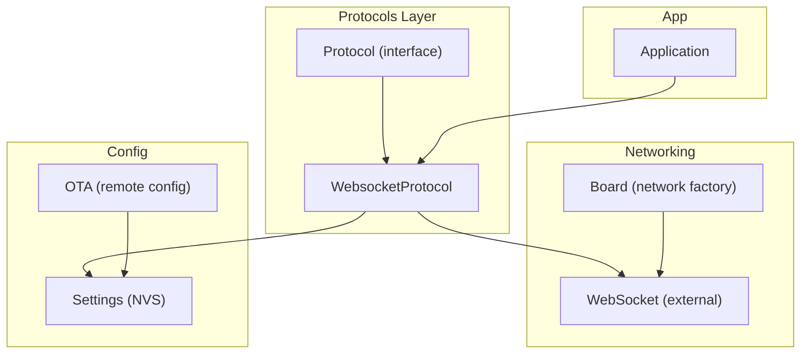
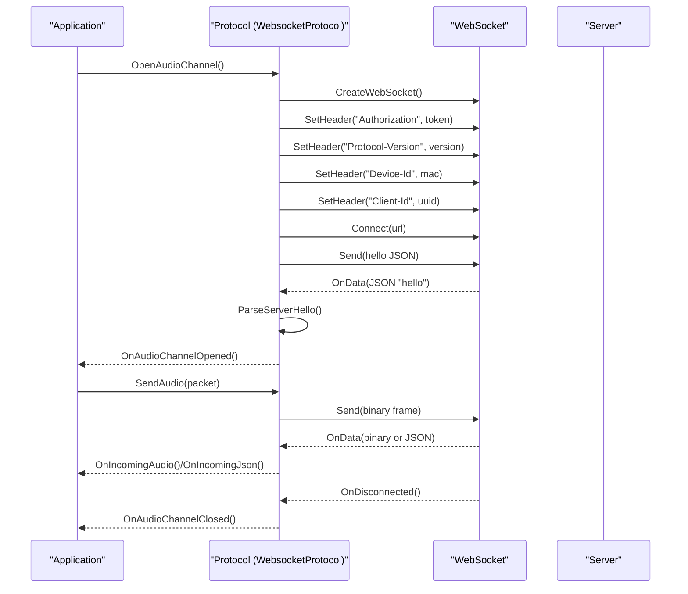
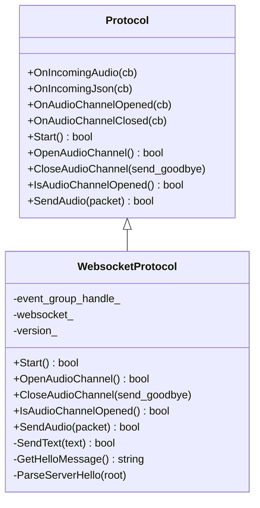
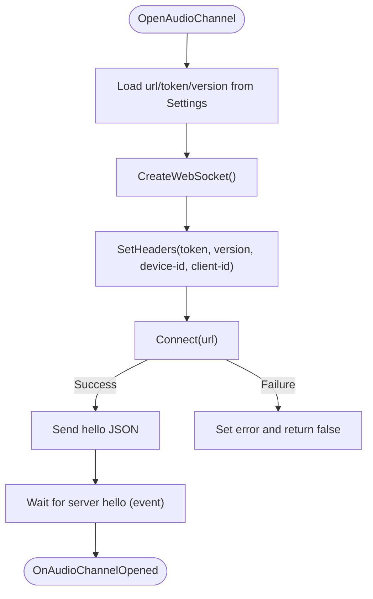
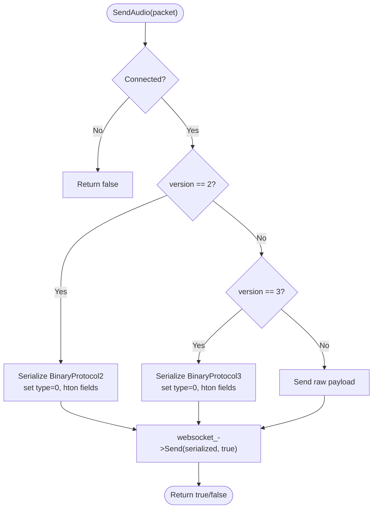
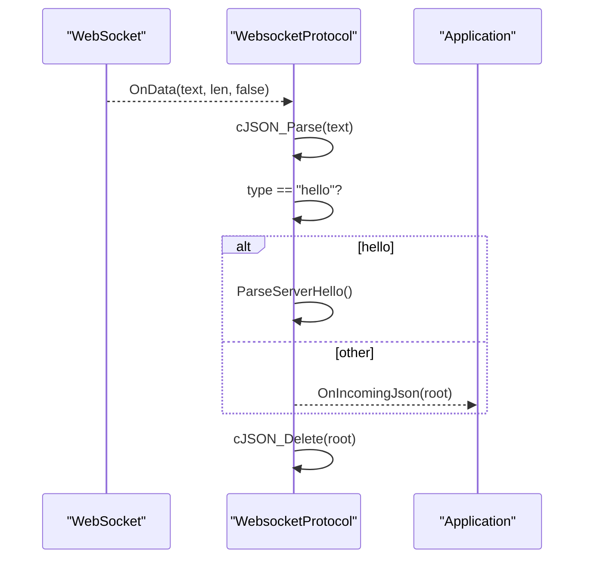
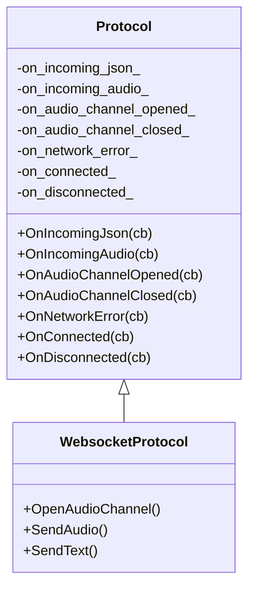
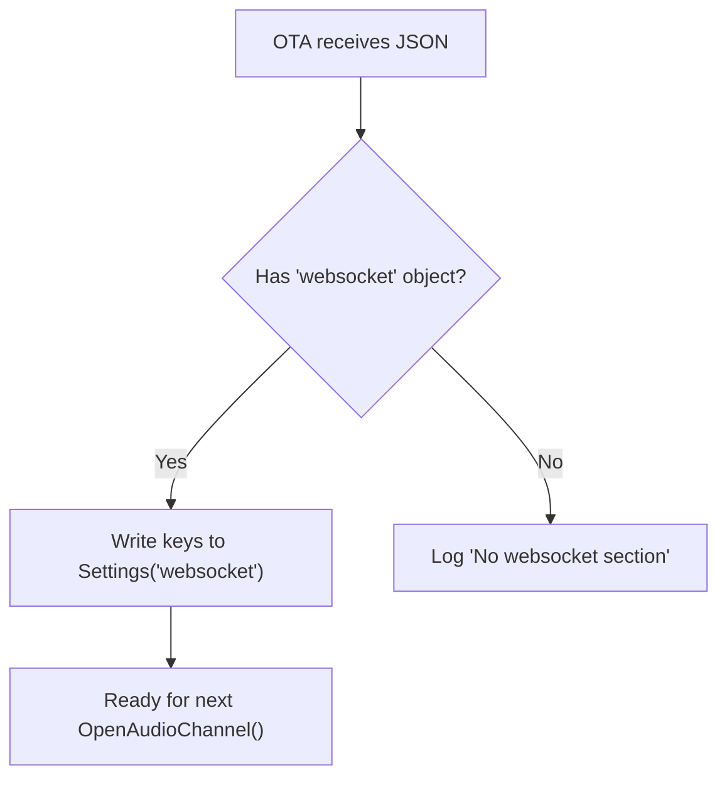
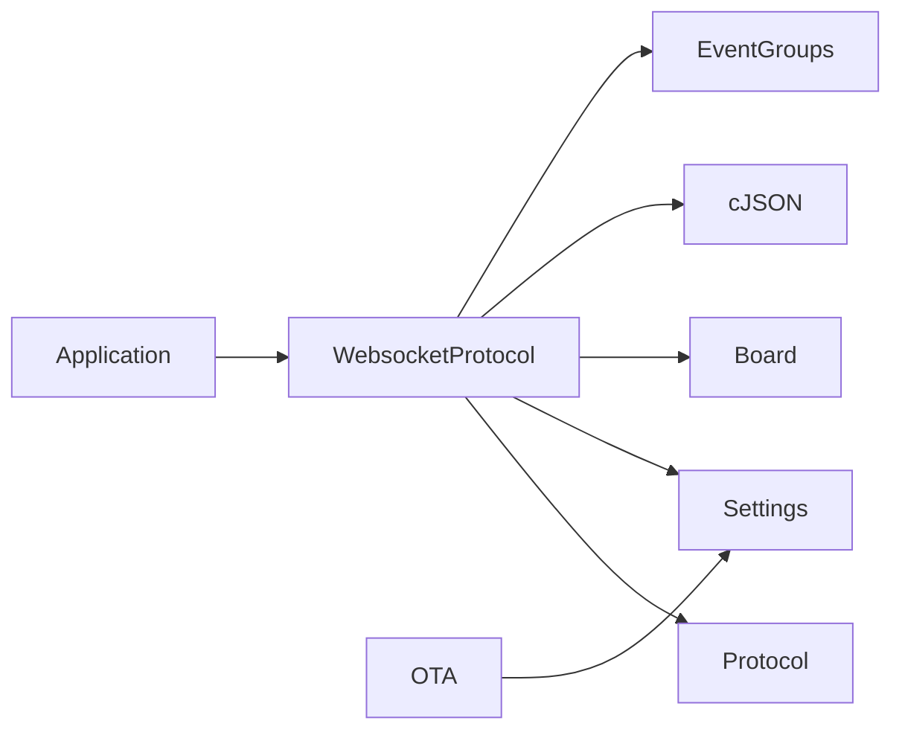

# WebSocket Protocol Support

<cite>
**Referenced Files in This Document**
- [websocket_protocol.h](file://main/protocols/websocket_protocol.h)
- [websocket_protocol.cc](file://main/protocols/websocket_protocol.cc)
- [protocol.h](file://main/protocols/protocol.h)
- [settings.h](file://main/settings.h)
- [ota.cc](file://main/ota.cc)
- [board.h](file://main/boards/common/board.h)
- [application.h](file://main/application.h)
</cite>

## Table of Contents
1. [Introduction](#introduction)
2. [Project Structure](#project-structure)
3. [Core Components](#core-components)
4. [Architecture Overview](#architecture-overview)
5. [Detailed Component Analysis](#detailed-component-analysis)
6. [Dependency Analysis](#dependency-analysis)
7. [Performance Considerations](#performance-considerations)
8. [Troubleshooting Guide](#troubleshooting-guide)
9. [Conclusion](#conclusion)
10. [Appendices](#appendices)

## Introduction
This document explains the WebSocket protocol implementation for real-time bidirectional communication in the embedded firmware. It covers connection establishment and handshake, message framing for binary audio and text JSON, event-driven architecture with connection and message callbacks, configuration options for endpoints and authentication, and practical guidance for integrating with mobile and web clients for remote device control and monitoring.

## Project Structure
The WebSocket support is implemented as a protocol plugin layered over a generic Protocol interface. The implementation relies on:
- A Protocol base class defining the contract for audio streaming and JSON messaging
- A WebsocketProtocol subclass implementing WebSocket-specific behavior
- A Settings abstraction for persistent configuration storage
- OTA logic that updates WebSocket endpoint configuration from remote commands
- Board/network interfaces exposing WebSocket creation and lifecycle hooks

**Diagram sources**
- [protocol.h:44-95](file://main/protocols/protocol.h#L44-L95)
- [websocket_protocol.h:13-32](file://main/protocols/websocket_protocol.h#L13-L32)
- [board.h:17-43](file://main/boards/common/board.h#L17-L43)
- [settings.h:7-26](file://main/settings.h#L7-L26)
- [ota.cc:167-186](file://main/ota.cc#L167-L186)
- [application.h:42-177](file://main/application.h#L42-L177)

**Section sources**
- [protocol.h:1-99](file://main/protocols/protocol.h#L1-L99)
- [websocket_protocol.h:1-35](file://main/protocols/websocket_protocol.h#L1-L35)
- [board.h:1-43](file://main/boards/common/board.h#L1-L43)
- [settings.h:1-29](file://main/settings.h#L1-L29)
- [ota.cc:167-186](file://main/ota.cc#L167-L186)
- [application.h:1-195](file://main/application.h#L1-L195)

## Core Components
- Protocol: Defines the audio and JSON messaging contract, including callbacks for incoming audio packets and JSON messages, and methods to open/close the audio channel.
- WebsocketProtocol: Implements the Protocol contract over WebSocket, handling connection, authentication, handshake, binary audio framing, and JSON message parsing.
- Settings: Provides a namespace-based key-value store for persistent configuration (e.g., WebSocket URL, token, version).
- OTA: Receives remote configuration updates and writes them to Settings under the “websocket” namespace.
- Board: Supplies the WebSocket instance via a network factory method and exposes network events.

Key responsibilities:
- Connection lifecycle: create WebSocket, set headers, connect, send hello, await server hello, notify open
- Audio streaming: serialize frames according to negotiated version, send as binary frames
- Text messaging: send/receive JSON messages, parse server hello and update runtime parameters
- Error handling: track errors, timeouts, and disconnections; trigger callbacks

**Section sources**
- [protocol.h:44-95](file://main/protocols/protocol.h#L44-L95)
- [websocket_protocol.cc:23-201](file://main/protocols/websocket_protocol.cc#L23-L201)
- [settings.h:7-26](file://main/settings.h#L7-L26)
- [ota.cc:167-186](file://main/ota.cc#L167-L186)
- [board.h:17-43](file://main/boards/common/board.h#L17-L43)

## Architecture Overview
The WebSocket protocol integrates with the application’s event-driven architecture. The Application manages device state and schedules protocol operations. The Protocol interface decouples transport from application logic, enabling pluggable transports like WebSocket and MQTT.

**Diagram sources**
- [websocket_protocol.cc:83-201](file://main/protocols/websocket_protocol.cc#L83-L201)
- [protocol.h:58-64](file://main/protocols/protocol.h#L58-L64)
- [application.h:153-177](file://main/application.h#L153-L177)

## Detailed Component Analysis

### WebsocketProtocol Class
Implements the Protocol interface for WebSocket transport. Manages:
- Event group signaling for handshake synchronization
- WebSocket lifecycle: creation, headers, connection, data/disconnect callbacks
- Hello exchange: constructs and sends client hello, parses server hello
- Binary audio framing: serializes frames per negotiated version
- Text messaging: sends/receives JSON, triggers callbacks

**Diagram sources**
- [protocol.h:44-95](file://main/protocols/protocol.h#L44-L95)
- [websocket_protocol.h:13-32](file://main/protocols/websocket_protocol.h#L13-L32)

**Section sources**
- [websocket_protocol.h:13-32](file://main/protocols/websocket_protocol.h#L13-L32)
- [websocket_protocol.cc:15-21](file://main/protocols/websocket_protocol.cc#L15-L21)
- [websocket_protocol.cc:23-201](file://main/protocols/websocket_protocol.cc#L23-L201)

### Connection Establishment and Handshake
- Endpoint and credentials are loaded from Settings under the “websocket” namespace.
- Headers include Authorization (with Bearer prefix if missing), Protocol-Version, Device-Id, and Client-Id.
- Connect to the configured URL; upon success, send a JSON hello describing client capabilities and audio parameters.
- Await server hello; the handshake completes when the server hello is received and parsed.

**Diagram sources**
- [websocket_protocol.cc:83-201](file://main/protocols/websocket_protocol.cc#L83-L201)
- [settings.h:12-15](file://main/settings.h#L12-L15)

**Section sources**
- [websocket_protocol.cc:83-201](file://main/protocols/websocket_protocol.cc#L83-L201)
- [settings.h:12-15](file://main/settings.h#L12-L15)

### Message Framing and Binary Data Handling
The implementation supports multiple binary protocol versions:
- Version 2: Fixed-width header with version, type, reserved, timestamp, payload_size followed by payload.
- Version 3: Compact header with type, reserved, payload_size followed by payload.
- Legacy: Raw audio payload sent as-is.

Serialization uses network byte order for numeric fields. Deserialization mirrors the process on receipt.

**Diagram sources**
- [websocket_protocol.cc:28-58](file://main/protocols/websocket_protocol.cc#L28-L58)
- [protocol.h:17-31](file://main/protocols/protocol.h#L17-L31)

**Section sources**
- [websocket_protocol.cc:28-58](file://main/protocols/websocket_protocol.cc#L28-L58)
- [protocol.h:17-31](file://main/protocols/protocol.h#L17-L31)

### Text Message Processing and Event Types
- Text frames are parsed as JSON. The implementation recognizes a “hello” type to finalize handshake and routes other JSON to the application via OnIncomingJson.
- The hello message includes transport, session_id, and audio_params to configure the runtime.

**Diagram sources**
- [websocket_protocol.cc:112-166](file://main/protocols/websocket_protocol.cc#L112-L166)
- [websocket_protocol.cc:228-254](file://main/protocols/websocket_protocol.cc#L228-L254)

**Section sources**
- [websocket_protocol.cc:112-166](file://main/protocols/websocket_protocol.cc#L112-L166)
- [websocket_protocol.cc:228-254](file://main/protocols/websocket_protocol.cc#L228-L254)

### Event-Driven Architecture and Callbacks
- Connection callbacks: OnAudioChannelOpened, OnAudioChannelClosed, OnConnected, OnDisconnected, OnNetworkError.
- Message callbacks: OnIncomingAudio for binary audio packets, OnIncomingJson for text JSON.
- The Protocol base class stores function pointers for these callbacks and provides helpers to set error and detect timeouts.

**Diagram sources**
- [protocol.h:58-95](file://main/protocols/protocol.h#L58-L95)
- [websocket_protocol.h:13-32](file://main/protocols/websocket_protocol.h#L13-L32)

**Section sources**
- [protocol.h:58-95](file://main/protocols/protocol.h#L58-L95)
- [websocket_protocol.cc:168-173](file://main/protocols/websocket_protocol.cc#L168-L173)

### Automatic Reconnection Strategies
- The current implementation does not implement automatic reconnection within WebsocketProtocol. Disconnection triggers OnAudioChannelClosed; higher-level components (e.g., Application) can manage retry policies.
- Recommendations:
  - Track last_incoming_time_ to detect idle disconnects
  - Implement exponential backoff on reconnect attempts
  - Re-send hello after reconnect to re-establish session
  - Use OnNetworkError to surface transient failures

Note: These are implementation recommendations derived from observed callback patterns and timeout helpers.

**Section sources**
- [websocket_protocol.cc:168-173](file://main/protocols/websocket_protocol.cc#L168-L173)
- [protocol.h:90-95](file://main/protocols/protocol.h#L90-L95)

### Configuration Options
- Namespace: “websocket”
- Keys:
  - url: WebSocket endpoint URI
  - token: Authentication token; if no space present, “Bearer ” is prepended automatically
  - version: Protocol version for binary framing (2 or 3); defaults to 1 if unset
- OTA updates: Remote configuration pushes JSON containing websocket settings; OTA writes them to Settings.

**Diagram sources**
- [ota.cc:167-186](file://main/ota.cc#L167-L186)
- [websocket_protocol.cc:84-107](file://main/protocols/websocket_protocol.cc#L84-L107)

**Section sources**
- [ota.cc:167-186](file://main/ota.cc#L167-L186)
- [websocket_protocol.cc:84-107](file://main/protocols/websocket_protocol.cc#L84-L107)
- [settings.h:12-15](file://main/settings.h#L12-L15)

### Heartbeat and Liveness
- No explicit heartbeat mechanism is implemented in the WebSocket protocol layer.
- Recommendation: Implement periodic ping/pong or application-level keepalive messages to maintain liveness and detect stale connections.

[No sources needed since this section provides general guidance]

### Examples of Message Formats and Event Types
- Client hello (text JSON):
  - Fields: type, version, features, transport, audio_params
  - Example fields: transport=websocket, audio_params.format=opus, audio_params.sample_rate, audio_params.channels, audio_params.frame_duration
- Server hello (text JSON):
  - Fields: transport, session_id, audio_params (sample_rate, frame_duration)
- Binary audio frames:
  - Version 2: header with version, type, reserved, timestamp, payload_size
  - Version 3: header with type, reserved, payload_size
  - Legacy: raw payload

**Section sources**
- [websocket_protocol.cc:203-226](file://main/protocols/websocket_protocol.cc#L203-L226)
- [websocket_protocol.cc:228-254](file://main/protocols/websocket_protocol.cc#L228-L254)
- [protocol.h:17-31](file://main/protocols/protocol.h#L17-L31)

### Real-Time Interaction Patterns
- Interactive control scenarios:
  - Start/stop listening: send JSON control messages via Protocol.SendStartListening/SendStopListening
  - MCP messages: Protocol.SendMcpMessage for device-specific commands
  - Wake word detection: Protocol.SendWakeWordDetected
  - Abort speaking: Protocol.SendAbortSpeaking
- The Protocol interface defines these methods; WebsocketProtocol inherits them and can forward to the WebSocket transport as appropriate.

**Section sources**
- [protocol.h:71-76](file://main/protocols/protocol.h#L71-L76)
- [websocket_protocol.cc:112-166](file://main/protocols/websocket_protocol.cc#L112-L166)

### Integration Patterns with Mobile/Web Clients
- Mobile apps and web dashboards can connect to the same WebSocket endpoint and exchange JSON control messages.
- Use the “transport” field in hello to indicate WebSocket and negotiate audio parameters.
- Maintain session_id for session continuity across reconnects.

[No sources needed since this section provides general guidance]

## Dependency Analysis
- WebsocketProtocol depends on:
  - Protocol interface for the contract
  - Settings for configuration
  - Board for WebSocket creation
  - cJSON for JSON parsing
  - FreeRTOS event groups for handshake synchronization
- OTA updates Settings used by WebsocketProtocol
- Application coordinates protocol lifecycle and scheduling

**Diagram sources**
- [websocket_protocol.h:5-9](file://main/protocols/websocket_protocol.h#L5-L9)
- [websocket_protocol.cc:1-11](file://main/protocols/websocket_protocol.cc#L1-L11)
- [board.h:4-10](file://main/boards/common/board.h#L4-L10)
- [ota.cc:167-186](file://main/ota.cc#L167-L186)
- [application.h:135](file://main/application.h#L135)

**Section sources**
- [websocket_protocol.h:5-9](file://main/protocols/websocket_protocol.h#L5-L9)
- [websocket_protocol.cc:1-11](file://main/protocols/websocket_protocol.cc#L1-L11)
- [board.h:4-10](file://main/boards/common/board.h#L4-L10)
- [ota.cc:167-186](file://main/ota.cc#L167-L186)
- [application.h:135](file://main/application.h#L135)

## Performance Considerations
- Latency:
  - Prefer minimal JSON overhead in control messages
  - Use binary framing for audio to reduce CPU overhead
- Throughput:
  - Tune audio_params.frame_duration to balance latency and bandwidth
  - Ensure network buffers and MTU alignment for efficient binary transmission
- Power and connectivity:
  - Use Application-level power-save modes compatible with long-lived connections
  - Implement keepalive to prevent NAT/session timeouts

[No sources needed since this section provides general guidance]

## Troubleshooting Guide
Common issues and diagnostics:
- Connection fails:
  - Verify url and token in Settings
  - Check network availability and firewall rules
  - Inspect GetLastError() and logs
- Handshake timeout:
  - Confirm server responds with hello within the 10-second window
  - Validate Authorization header and Protocol-Version
- Audio not received:
  - Ensure server hello included audio_params with compatible sample_rate/frame_duration
  - Confirm binary protocol version matches server expectations
- Disconnection:
  - Implement Application-level reconnection with backoff
  - Re-send hello after reconnect

**Section sources**
- [websocket_protocol.cc:175-194](file://main/protocols/websocket_protocol.cc#L175-L194)
- [websocket_protocol.cc:228-254](file://main/protocols/websocket_protocol.cc#L228-L254)

## Conclusion
The WebSocket protocol implementation provides a robust foundation for real-time bidirectional communication, with clear separation of concerns via the Protocol interface. It supports configurable endpoints and authentication, structured JSON messaging, and flexible binary audio framing. Extending automatic reconnection and heartbeat mechanisms would further improve resilience for production deployments.

## Appendices

### Configuration Reference
- Namespace: websocket
- Keys:
  - url: string
  - token: string (Bearer prefix added automatically if absent)
  - version: integer (2 or 3)

**Section sources**
- [websocket_protocol.cc:84-107](file://main/protocols/websocket_protocol.cc#L84-L107)
- [settings.h:12-15](file://main/settings.h#L12-L15)
- [ota.cc:167-186](file://main/ota.cc#L167-L186)