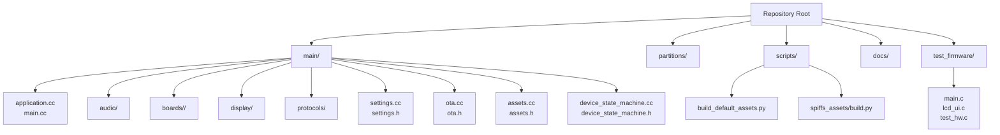
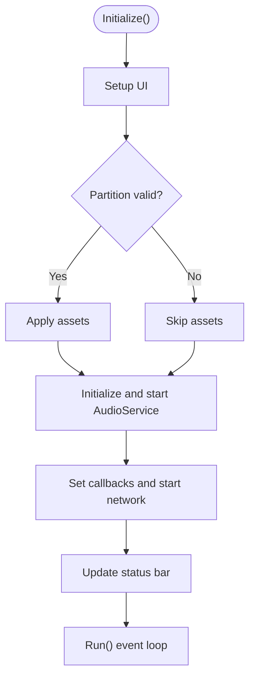
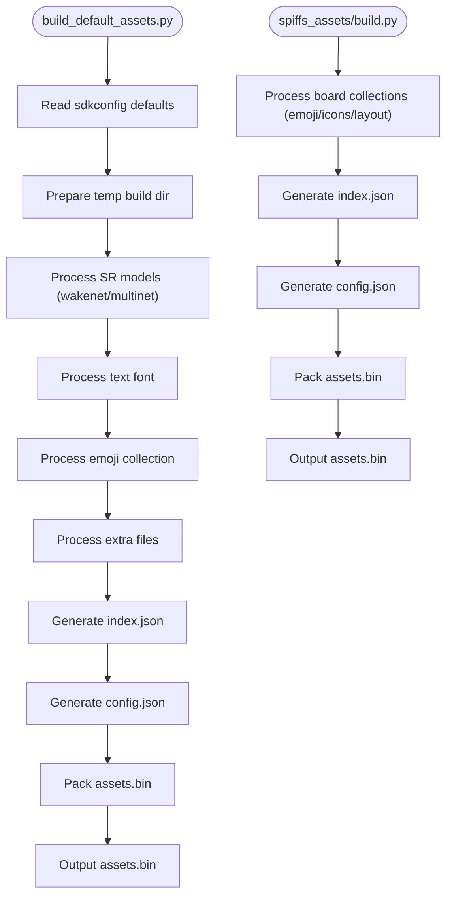
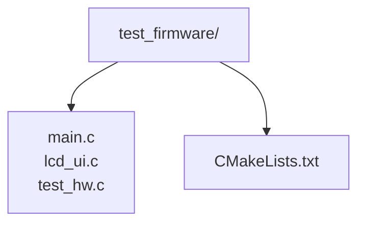
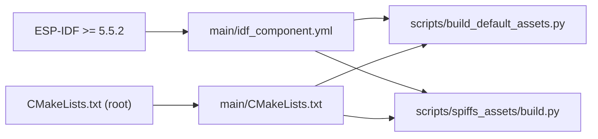

# Contributing Guidelines

<cite>
**Referenced Files in This Document**
- [README.md](file://README.md)
- [CMakeLists.txt](file://CMakeLists.txt)
- [main/CMakeLists.txt](file://main/CMakeLists.txt)
- [main/idf_component.yml](file://main/idf_component.yml)
- [.clang-format](file://.clang-format)
- [.gitignore](file://.gitignore)
- [scripts/build_default_assets.py](file://scripts/build_default_assets.py)
- [scripts/spiffs_assets/build.py](file://scripts/spiffs_assets/build.py)
- [main/application.cc](file://main/application.cc)
- [main/main.cc](file://main/main.cc)
- [test_firmware/main/CMakeLists.txt](file://test_firmware/main/CMakeLists.txt)
</cite>

## Table of Contents
1. [Introduction](#introduction)
2. [Project Structure](#project-structure)
3. [Core Components](#core-components)
4. [Architecture Overview](#architecture-overview)
5. [Detailed Component Analysis](#detailed-component-analysis)
6. [Dependency Analysis](#dependency-analysis)
7. [Development Environment Setup](#development-environment-setup)
8. [Coding Standards](#coding-standards)
9. [Pull Request Process](#pull-request-process)
10. [Testing Requirements](#testing-requirements)
11. [Continuous Integration and Quality Gates](#continuous-integration-and-quality-gates)
12. [Code Review Guidelines](#code-review-guidelines)
13. [Documentation Standards](#documentation-standards)
14. [Community Contribution Expectations](#community-contribution-expectations)
15. [Examples and Procedures](#examples-and-procedures)
16. [Licensing and Intellectual Property](#licensing-and-intellectual-property)
17. [Troubleshooting Guide](#troubleshooting-guide)
18. [Conclusion](#conclusion)

## Introduction
This document defines the contribution workflow for the RIG-Puppy project. It consolidates development environment setup, coding standards, collaboration processes, testing, continuous integration, and community expectations. Contributions are welcome via Issues and Pull Requests.

## Project Structure
The repository is organized around an ESP-IDF-based firmware for an ESP32-S3 device, with modular components for audio, display, protocols, and board-specific implementations. Scripts support asset packaging and tooling.



**Diagram sources**
- [main/CMakeLists.txt:1-120](file://main/CMakeLists.txt#L1-L120)
- [scripts/build_default_assets.py:1-120](file://scripts/build_default_assets.py#L1-L120)
- [scripts/spiffs_assets/build.py:1-120](file://scripts/spiffs_assets/build.py#L1-L120)
- [test_firmware/main/CMakeLists.txt:1-5](file://test_firmware/main/CMakeLists.txt#L1-L5)

**Section sources**
- [README.md:115-137](file://README.md#L115-L137)
- [main/CMakeLists.txt:1-120](file://main/CMakeLists.txt#L1-L120)

## Core Components
- Application lifecycle and state machine orchestration
- Audio pipeline (codecs, processors, wake words)
- Display subsystem (LVGL-based animations, images, fonts)
- Protocol stack (MQTT, WebSocket)
- Board abstraction and hardware peripherals
- Asset packaging and SPIFFS generation
- OTA and settings persistence

**Section sources**
- [main/application.cc:1-120](file://main/application.cc#L1-L120)
- [main/main.cc:1-30](file://main/main.cc#L1-L30)
- [main/CMakeLists.txt:1-120](file://main/CMakeLists.txt#L1-L120)

## Architecture Overview
The firmware initializes NVS, constructs the Application singleton, sets up display, audio, and network, then enters a cooperative event-driven loop. Assets are applied early to ensure UI and audio resources are available.

```mermaid
sequenceDiagram
participant Boot as "Boot"
participant NVS as "NVS Flash"
participant App as "Application"
participant Board as "Board Abstraction"
participant Display as "Display"
participant Audio as "AudioService"
participant Net as "Network"
Boot->>NVS : Initialize and handle corruption
Boot->>App : Construct singleton
App->>App : Initialize()
App->>Board : GetDisplay()
Board-->>Display : Instance
App->>Display : SetupUI()
App->>App : Apply assets if valid
App->>Board : GetAudioCodec()
Board-->>Audio : Instance
App->>Audio : Initialize(codec); Start()
App->>Board : OnStartup()
App->>Board : CheckCalibration(display, audio)
App->>Audio : SetCallbacks(...)
App->>Board : SetNetworkEventCallback(...)
App->>Net : StartNetwork()
App->>Display : UpdateStatusBar(true)
App->>App : Run() event loop
```

**Diagram sources**
- [main/main.cc:14-29](file://main/main.cc#L14-L29)
- [main/application.cc:62-178](file://main/application.cc#L62-L178)

## Detailed Component Analysis

### Application Orchestration
- Initializes event group, timers, and state machine
- Applies assets partition early for UI/audio readiness
- Sets up audio callbacks and network event handlers
- Starts network asynchronously and updates UI accordingly



**Diagram sources**
- [main/application.cc:62-178](file://main/application.cc#L62-L178)

**Section sources**
- [main/application.cc:1-120](file://main/application.cc#L1-L120)
- [main/application.cc:180-220](file://main/application.cc#L180-L220)

### Asset Packaging Pipeline
Two complementary asset builders exist:
- Default assets builder driven by configuration and SDK settings
- SPIFFS assets builder supporting board-specific emoji, icons, and layouts



**Diagram sources**
- [scripts/build_default_assets.py:450-800](file://scripts/build_default_assets.py#L450-L800)
- [scripts/spiffs_assets/build.py:325-385](file://scripts/spiffs_assets/build.py#L325-L385)

**Section sources**
- [scripts/build_default_assets.py:1-120](file://scripts/build_default_assets.py#L1-L120)
- [scripts/spiffs_assets/build.py:1-120](file://scripts/spiffs_assets/build.py#L1-L120)

### Test Firmware
A minimal test firmware exists under test_firmware for hardware validation and regression checks.



**Diagram sources**
- [test_firmware/main/CMakeLists.txt:1-5](file://test_firmware/main/CMakeLists.txt#L1-L5)

**Section sources**
- [test_firmware/main/CMakeLists.txt:1-5](file://test_firmware/main/CMakeLists.txt#L1-L5)

## Dependency Analysis
- ESP-IDF minimum version and target configuration are enforced via CMake and component manifests
- Component dependencies are declared in the IDF component manifest
- Asset generation scripts depend on managed components and configuration



**Diagram sources**
- [main/idf_component.yml:125-128](file://main/idf_component.yml#L125-L128)
- [CMakeLists.txt:1-14](file://CMakeLists.txt#L1-L14)
- [main/CMakeLists.txt:1-120](file://main/CMakeLists.txt#L1-L120)
- [scripts/build_default_assets.py:1-120](file://scripts/build_default_assets.py#L1-L120)
- [scripts/spiffs_assets/build.py:1-120](file://scripts/spiffs_assets/build.py#L1-L120)

**Section sources**
- [main/idf_component.yml:125-128](file://main/idf_component.yml#L125-L128)
- [CMakeLists.txt:1-14](file://CMakeLists.txt#L1-L14)
- [main/CMakeLists.txt:1-120](file://main/CMakeLists.txt#L1-L120)

## Development Environment Setup
- ESP-IDF v5.4+ is required; configure the target to ESP32-S3 and build with idf.py
- Optional: menuconfig for board and language selection
- Assets partition can be rebuilt and flashed independently

Key commands and steps are documented in the project’s README.

**Section sources**
- [README.md:51-82](file://README.md#L51-L82)

## Coding Standards
- C++ style follows Google style with clang-format configuration
- Formatting rules include column limit, indentation, brace wrapping, and include sorting
- Naming conventions are inferred from the codebase (e.g., PascalCase for classes, snake_case for variables, UPPER_CASE for macros)

Recommended actions:
- Run clang-format locally before submitting changes
- Keep lines under the configured column limit
- Group includes by category and sort them

**Section sources**
- [.clang-format:1-126](file://.clang-format#L1-L126)
- [main/application.cc:1-30](file://main/application.cc#L1-L30)

## Pull Request Process
Branching and commits:
- Use descriptive branch names reflecting the feature or fix
- Keep commits atomic and focused
- Follow a clear commit message convention (e.g., type(scope): subject)

PR checklist:
- All CI checks pass
- Changes are scoped and documented
- Tests included where applicable
- No unrelated whitespace changes

Review procedure:
- Assign maintainers for review
- Address feedback promptly
- Squash or rebase as requested

[No sources needed since this section provides general guidance]

## Testing Requirements
Unit and integration tests:
- Unit tests: Add unit tests alongside the code under test; place them in appropriate directories mirroring the source tree
- Integration tests: Validate end-to-end flows (audio pipeline, display updates, network events)
- Hardware validation: Use the test firmware to exercise peripherals and confirm regressions

Asset and build verification:
- Rebuild assets after adding new audio or emoji assets
- Confirm assets.bin is generated and flashed correctly

**Section sources**
- [test_firmware/main/CMakeLists.txt:1-5](file://test_firmware/main/CMakeLists.txt#L1-L5)
- [scripts/build_default_assets.py:750-800](file://scripts/build_default_assets.py#L750-L800)
- [scripts/spiffs_assets/build.py:325-385](file://scripts/spiffs_assets/build.py#L325-L385)

## Continuous Integration and Quality Gates
- CI should enforce:
  - Successful build across targets (ESP32-S3)
  - Formatting checks via clang-format
  - Asset generation completeness
  - Basic integration tests on test firmware
- Quality gates:
  - PRs require at least one approval
  - All checks must pass before merging

[No sources needed since this section provides general guidance]

## Code Review Guidelines
- Focus on correctness, readability, and maintainability
- Verify adherence to style and naming conventions
- Ensure resource safety (memory, NVS, timers)
- Confirm minimal impact and clear intent

[No sources needed since this section provides general guidance]

## Documentation Standards
- Update README for user-facing changes
- Add inline comments for complex logic
- Keep public APIs and module responsibilities clear

[No sources needed since this section provides general guidance]

## Community Contribution Expectations
- Be respectful and collaborative
- Follow the project’s license and contribution policies
- Engage constructively in discussions and reviews

[No sources needed since this section provides general guidance]

## Examples and Procedures
Common contribution scenarios:
- Adding a new expression:
  - Prepare EAF animation and board config
  - Update emote configuration and rebuild assets
- Adding new voice assets:
  - Place OGG files in locale directories
  - Update language config and reconfigure
- Calibration workflow:
  - Triple-click to enter calibration
  - Adjust joints to zero positions
  - Triple-click again to save

Issue reporting:
- Provide environment details, steps to reproduce, and expected vs. actual behavior

Feature requests:
- Open an issue describing the feature, rationale, and potential impact

**Section sources**
- [README.md:139-178](file://README.md#L139-L178)

## Licensing and Intellectual Property
- The project is licensed under MIT; see the license notice
- Contributors retain copyright; by submitting, you agree to license your contributions under the project’s license

**Section sources**
- [README.md:207-214](file://README.md#L207-L214)

## Troubleshooting Guide
- WiFi scan timeout: AP list is capped and ordered by signal strength
- Slow wake response: Ensure emotion setting occurs after enabling voice processing
- Servo jitter: Verify calibration values and power stability

**Section sources**
- [README.md:196-206](file://README.md#L196-L206)

## Conclusion
By following these guidelines, contributors can efficiently collaborate, maintain code quality, and deliver reliable enhancements to the RIG-Puppy firmware.