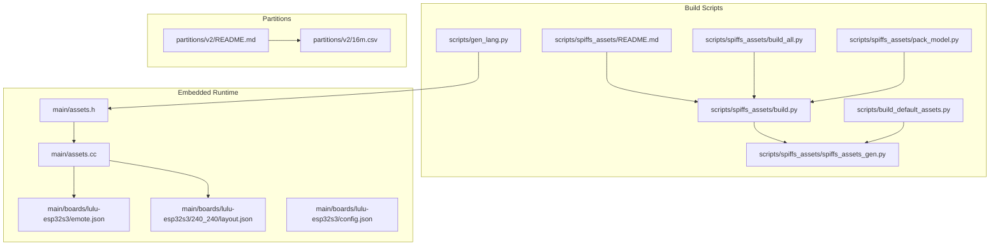
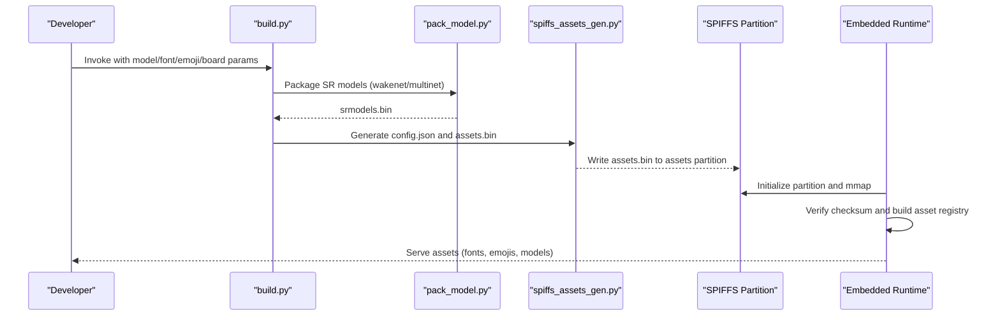
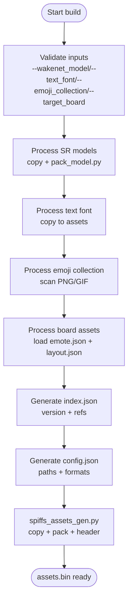
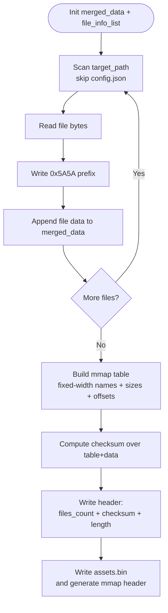
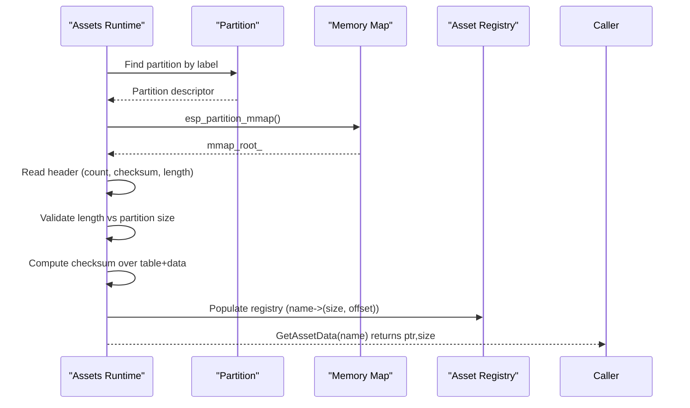
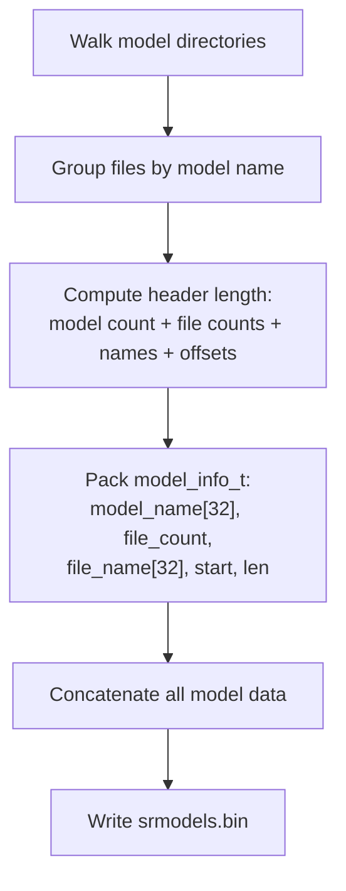
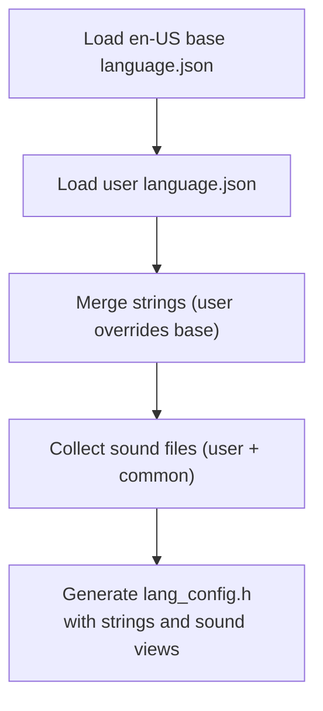
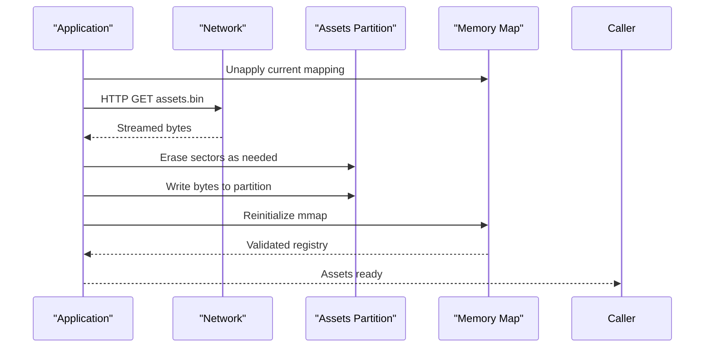
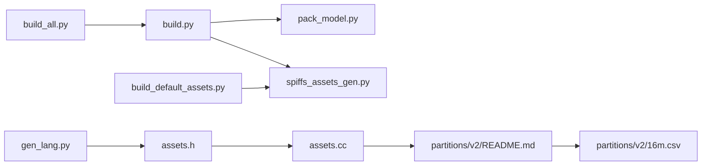

# Asset Management Tools

<cite>
**Referenced Files in This Document**
- [README.md](file://scripts/spiffs_assets/README.md)
- [build.py](file://scripts/spiffs_assets/build.py)
- [build_all.py](file://scripts/spiffs_assets/build_all.py)
- [pack_model.py](file://scripts/spiffs_assets/pack_model.py)
- [spiffs_assets_gen.py](file://scripts/spiffs_assets/spiffs_assets_gen.py)
- [assets.h](file://main/assets.h)
- [assets.cc](file://main/assets.cc)
- [build_default_assets.py](file://scripts/build_default_assets.py)
- [gen_lang.py](file://scripts/gen_lang.py)
- [README.md](file://partitions/v2/README.md)
- [16m.csv](file://partitions/v2/16m.csv)
- [emote.json](file://main/boards/lulu-esp32s3/emote.json)
- [layout.json](file://main/boards/lulu-esp32s3/240_240/layout.json)
- [config.json](file://main/boards/lulu-esp32s3/config.json)
</cite>

## Table of Contents
1. [Introduction](#introduction)
2. [Project Structure](#project-structure)
3. [Core Components](#core-components)
4. [Architecture Overview](#architecture-overview)
5. [Detailed Component Analysis](#detailed-component-analysis)
6. [Dependency Analysis](#dependency-analysis)
7. [Performance Considerations](#performance-considerations)
8. [Troubleshooting Guide](#troubleshooting-guide)
9. [Conclusion](#conclusion)
10. [Appendices](#appendices)

## Introduction
This document explains the asset management tools used to prepare, package, and deploy SPIFFS-based assets for embedded devices. It covers the asset generation pipeline from raw resources to optimized binary formats, the SPIFFS asset packing algorithm, file metadata handling, and memory-mapped access patterns. It also documents the model packaging system for speech recognition models (wakenet and multinet), practical examples for extending the system, and OTA-driven asset updates with versioning and rollback considerations.

## Project Structure
The asset management system spans two primary areas:
- Scripts that build and package assets for deployment
- Embedded runtime code that loads and validates assets from the SPIFFS partition

**Diagram sources**
- [README.md:1-111](file://scripts/spiffs_assets/README.md#L1-L111)
- [build.py:1-385](file://scripts/spiffs_assets/build.py#L1-L385)
- [build_all.py:1-149](file://scripts/spiffs_assets/build_all.py#L1-L149)
- [pack_model.py:1-124](file://scripts/spiffs_assets/pack_model.py#L1-L124)
- [spiffs_assets_gen.py:1-648](file://scripts/spiffs_assets/spiffs_assets_gen.py#L1-L648)
- [build_default_assets.py:1-935](file://scripts/build_default_assets.py#L1-L935)
- [gen_lang.py:1-187](file://scripts/gen_lang.py#L1-L187)
- [assets.h:1-90](file://main/assets.h#L1-L90)
- [assets.cc:1-561](file://main/assets.cc#L1-L561)
- [README.md:1-107](file://partitions/v2/README.md#L1-L107)
- [16m.csv:1-9](file://partitions/v2/16m.csv#L1-L9)

**Section sources**
- [README.md:1-111](file://scripts/spiffs_assets/README.md#L1-L111)
- [build.py:1-385](file://scripts/spiffs_assets/build.py#L1-L385)
- [spiffs_assets_gen.py:1-648](file://scripts/spiffs_assets/spiffs_assets_gen.py#L1-L648)
- [assets.h:1-90](file://main/assets.h#L1-L90)
- [assets.cc:1-561](file://main/assets.cc#L1-L561)
- [README.md:1-107](file://partitions/v2/README.md#L1-L107)

## Core Components
- Asset builder scripts orchestrate resource ingestion, model packaging, and final SPIFFS binary generation.
- The embedded runtime initializes the assets partition, validates integrity, and exposes assets via memory-mapped access.
- Partition tables define the assets partition and its size per device configuration.

Key responsibilities:
- Build scripts: collect wakenet/multinet models, fonts, emoji sets, and board-specific assets; generate index.json and config.json; produce assets.bin.
- Runtime: mmap the assets partition, verify checksum, populate asset registry, and serve assets to UI and audio subsystems.
- Partitions: define assets partition placement and sizing for different flash capacities.

**Section sources**
- [build.py:325-385](file://scripts/spiffs_assets/build.py#L325-L385)
- [spiffs_assets_gen.py:391-462](file://scripts/spiffs_assets/spiffs_assets_gen.py#L391-L462)
- [assets.cc:130-196](file://main/assets.cc#L130-L196)
- [README.md:24-107](file://partitions/v2/README.md#L24-L107)

## Architecture Overview
The asset pipeline transforms raw resources into a memory-mapped SPIFFS image consumed by the embedded application.

**Diagram sources**
- [build.py:325-385](file://scripts/spiffs_assets/build.py#L325-L385)
- [pack_model.py:41-124](file://scripts/spiffs_assets/pack_model.py#L41-L124)
- [spiffs_assets_gen.py:534-589](file://scripts/spiffs_assets/spiffs_assets_gen.py#L534-L589)
- [assets.cc:130-196](file://main/assets.cc#L130-L196)

## Detailed Component Analysis

### Asset Builder Pipeline
The builder orchestrates:
- Model packaging for SR models (wakenet/multinet) into a single binary
- Collection of fonts and emoji sets
- Board-specific assets (emojis, icons, layout)
- Index and configuration generation
- Final SPIFFS binary packaging

**Diagram sources**
- [build.py:48-381](file://scripts/spiffs_assets/build.py#L48-L381)
- [pack_model.py:41-124](file://scripts/spiffs_assets/pack_model.py#L41-L124)
- [spiffs_assets_gen.py:534-589](file://scripts/spiffs_assets/spiffs_assets_gen.py#L534-L589)

**Section sources**
- [build.py:48-381](file://scripts/spiffs_assets/build.py#L48-L381)
- [pack_model.py:41-124](file://scripts/spiffs_assets/pack_model.py#L41-L124)
- [spiffs_assets_gen.py:534-589](file://scripts/spiffs_assets/spiffs_assets_gen.py#L534-L589)

### SPIFFS Asset Packing Algorithm
The packing algorithm merges files into a single binary with a header, a fixed-size asset table, and concatenated data. It computes a checksum over the assembled payload and writes metadata for memory-mapped access.

**Diagram sources**
- [spiffs_assets_gen.py:391-462](file://scripts/spiffs_assets/spiffs_assets_gen.py#L391-L462)

**Section sources**
- [spiffs_assets_gen.py:391-462](file://scripts/spiffs_assets/spiffs_assets_gen.py#L391-L462)

### Memory-Mapped Access Pattern
The embedded runtime maps the assets partition and validates integrity before exposing assets by name.

**Diagram sources**
- [assets.cc:130-196](file://main/assets.cc#L130-L196)

**Section sources**
- [assets.cc:130-196](file://main/assets.cc#L130-L196)

### Model Packaging System (Wakenet/Multinet)
The model packaging system aggregates multiple model files into a single binary with structured metadata for indexing and loading.

**Diagram sources**
- [pack_model.py:41-124](file://scripts/spiffs_assets/pack_model.py#L41-L124)

**Section sources**
- [pack_model.py:41-124](file://scripts/spiffs_assets/pack_model.py#L41-L124)
- [build_default_assets.py:58-203](file://scripts/build_default_assets.py#L58-L203)

### Board-Specific Asset Processing
Board configurations drive which assets are included and how they are presented (emojis, icons, layout).

- Emoji definitions are read from emote.json and copied into assets with optional properties (loop, fps).
- Layout definitions from layout.json are included for UI composition.
- Icons and special assets are collected from the board’s resource directory.

**Section sources**
- [build.py:116-262](file://scripts/spiffs_assets/build.py#L116-L262)
- [emote.json:1-30](file://main/boards/lulu-esp32s3/emote.json#L1-L30)
- [layout.json:1-85](file://main/boards/lulu-esp32s3/240_240/layout.json#L1-L85)

### Language Resource Generation
Language assets are merged with fallbacks and compiled into headers for fast access.

**Diagram sources**
- [gen_lang.py:32-175](file://scripts/gen_lang.py#L32-L175)

**Section sources**
- [gen_lang.py:32-175](file://scripts/gen_lang.py#L32-L175)

### OTA Asset Updates and Rollback
The runtime supports downloading new assets over HTTP, erasing sectors as needed, writing new content, and reinitializing the partition.

**Diagram sources**
- [assets.cc:426-560](file://main/assets.cc#L426-L560)

**Section sources**
- [assets.cc:426-560](file://main/assets.cc#L426-L560)

## Dependency Analysis
The asset system integrates build-time scripts with runtime components and partition definitions.

**Diagram sources**
- [build.py:1-385](file://scripts/spiffs_assets/build.py#L1-L385)
- [pack_model.py:1-124](file://scripts/spiffs_assets/pack_model.py#L1-L124)
- [spiffs_assets_gen.py:1-648](file://scripts/spiffs_assets/spiffs_assets_gen.py#L1-L648)
- [build_all.py:1-149](file://scripts/spiffs_assets/build_all.py#L1-L149)
- [build_default_assets.py:1-935](file://scripts/build_default_assets.py#L1-L935)
- [gen_lang.py:1-187](file://scripts/gen_lang.py#L1-L187)
- [assets.h:1-90](file://main/assets.h#L1-L90)
- [assets.cc:1-561](file://main/assets.cc#L1-L561)
- [README.md:1-107](file://partitions/v2/README.md#L1-L107)
- [16m.csv:1-9](file://partitions/v2/16m.csv#L1-L9)

**Section sources**
- [build.py:1-385](file://scripts/spiffs_assets/build.py#L1-L385)
- [spiffs_assets_gen.py:1-648](file://scripts/spiffs_assets/spiffs_assets_gen.py#L1-L648)
- [assets.cc:1-561](file://main/assets.cc#L1-L561)
- [README.md:1-107](file://partitions/v2/README.md#L1-L107)

## Performance Considerations
- SPIFFS packing: The packing algorithm writes a fixed-width asset table followed by concatenated data, enabling O(1) random access by name after initial parsing.
- Memory mapping: The runtime validates the entire payload with a checksum and constructs a name-to-offset map, minimizing repeated IO.
- Image optimization: The SPIFFS generator supports splitting images and converting to compressed formats (e.g., QOI/SIMG) to reduce storage footprint.
- OTA streaming: Downloads are streamed with sector-wise erase/write to minimize RAM usage and improve resilience.

[No sources needed since this section provides general guidance]

## Troubleshooting Guide
Common issues and resolutions:
- assets.bin larger than partition: The packing tool checks partition size and exits with an error if exceeded. Increase assets partition size or reduce asset content.
- Asset checksum mismatch: The runtime recalculates the checksum and compares against stored value; mismatches indicate corruption or partial writes.
- Missing assets: Ensure index.json references are correct and assets are present in the built assets directory before packaging.
- OTA failures: Verify network connectivity, partition availability, and sufficient free sectors prior to writing.

**Section sources**
- [spiffs_assets_gen.py:597-601](file://scripts/spiffs_assets/spiffs_assets_gen.py#L597-L601)
- [assets.cc:169-172](file://main/assets.cc#L169-L172)

## Conclusion
The asset management system provides a robust pipeline for building, validating, and deploying embedded assets. It leverages SPIFFS packaging, memory-mapped access, and OTA updates to deliver flexible, scalable asset delivery for speech recognition models and UI resources.

[No sources needed since this section summarizes without analyzing specific files]

## Appendices

### Practical Examples

- Adding a new asset type
  - Extend the builder to include new directories or files in the assets directory and update index.json accordingly.
  - Ensure the runtime can locate and parse the new asset type (e.g., register handlers for new keys in index.json).
  - Reference: [build.py:264-291](file://scripts/spiffs_assets/build.py#L264-L291), [assets.cc:214-356](file://main/assets.cc#L214-L356)

- Configuring asset priorities
  - Adjust the order of processing in the builder to influence inclusion and naming precedence.
  - Reference: [build.py:351-363](file://scripts/spiffs_assets/build.py#L351-L363)

- Optimizing storage utilization
  - Enable image compression and splitting where supported by the SPIFFS generator.
  - Reference: [spiffs_assets_gen.py:565-577](file://scripts/spiffs_assets/spiffs_assets_gen.py#L565-L577)

- Asset versioning and OTA updates
  - Use index.json versioning and runtime checks to manage compatibility.
  - Download and apply assets via HTTP with sector-wise erase and write.
  - Reference: [assets.cc:426-560](file://main/assets.cc#L426-L560), [assets.cc:228-234](file://main/assets.cc#L228-L234)

- Partition sizing for assets
  - Choose appropriate partition tables for target flash sizes and device families.
  - Reference: [README.md:42-107](file://partitions/v2/README.md#L42-L107), [16m.csv:1-9](file://partitions/v2/16m.csv#L1-L9)