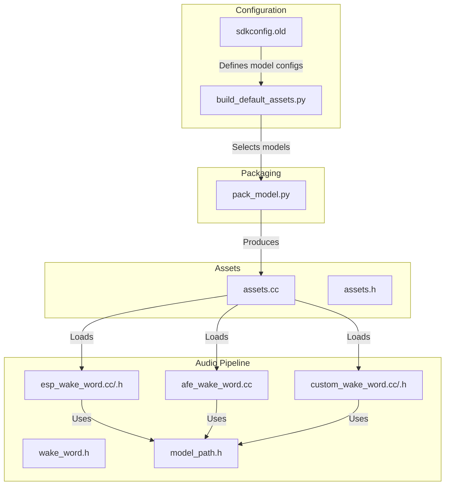
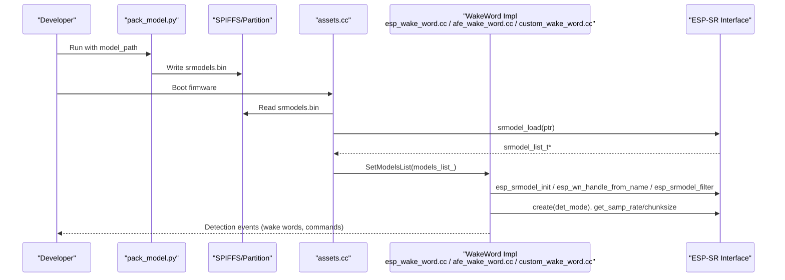
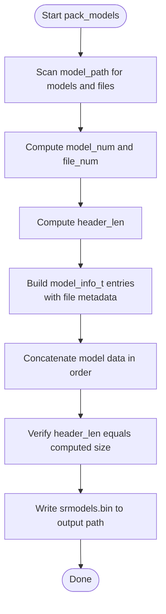
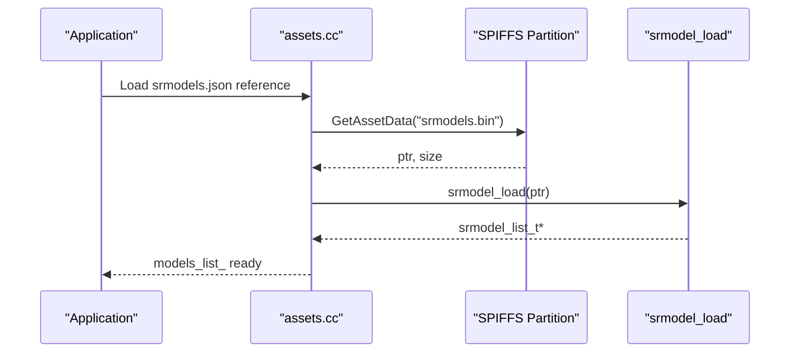
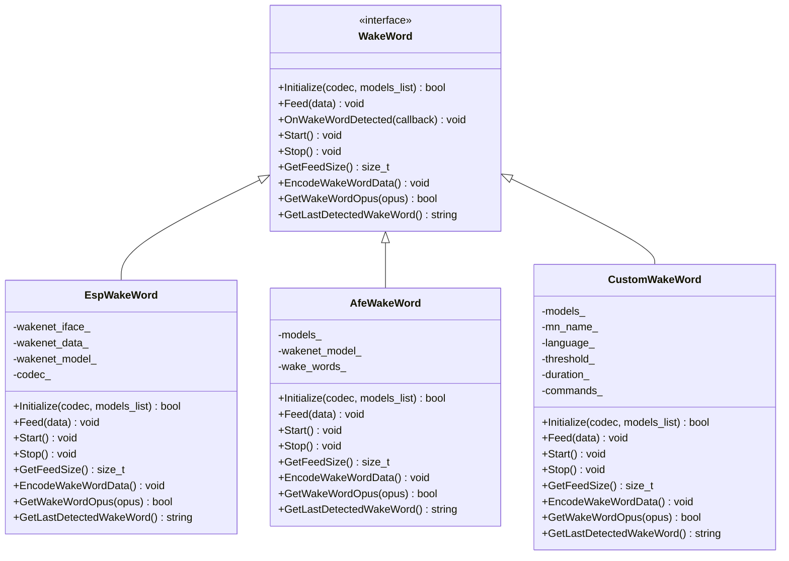
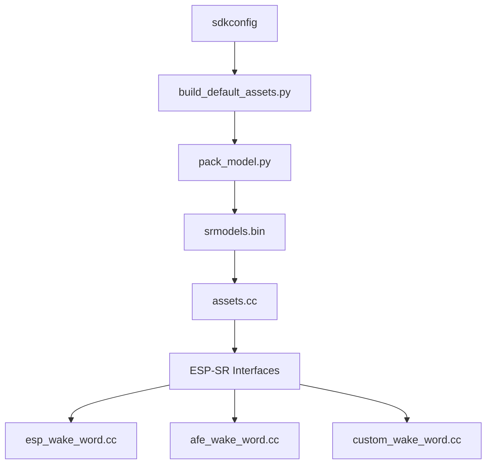

# Model Packaging System

<cite>
**Referenced Files in This Document**
- [pack_model.py](file://scripts/spiffs_assets/pack_model.py)
- [assets.cc](file://main/assets.cc)
- [assets.h](file://main/assets.h)
- [esp_wake_word.cc](file://main/audio/wake_words/esp_wake_word.cc)
- [esp_wake_word.h](file://main/audio/wake_words/esp_wake_word.h)
- [afe_wake_word.cc](file://main/audio/wake_words/afe_wake_word.cc)
- [custom_wake_word.cc](file://main/audio/wake_words/custom_wake_word.cc)
- [custom_wake_word.h](file://main/audio/wake_words/custom_wake_word.h)
- [wake_word.h](file://main/audio/wake_words/wake_word.h)
- [model_path.h](file://managed_components/espressif__esp-sr/src/include/model_path.h)
- [build_default_assets.py](file://scripts/build_default_assets.py)
- [sdkconfig.old](file://sdkconfig.old)
</cite>

## Table of Contents
1. [Introduction](#introduction)
2. [Project Structure](#project-structure)
3. [Core Components](#core-components)
4. [Architecture Overview](#architecture-overview)
5. [Detailed Component Analysis](#detailed-component-analysis)
6. [Dependency Analysis](#dependency-analysis)
7. [Performance Considerations](#performance-considerations)
8. [Troubleshooting Guide](#troubleshooting-guide)
9. [Conclusion](#conclusion)
10. [Appendices](#appendices)

## Introduction
This document describes the model packaging system for speech recognition models in the project, focusing on preparing and optimizing models for embedded deployment. It explains how raw model files are packaged into the srmodels.bin format using the pack_model.py script, details the wakenet model processing pipeline (preprocessing, quantization, and format conversion), documents supported model formats, size optimization techniques, and memory-mapped loading strategies. Practical guidance is included for adding new speech models, configuring model parameters, handling model versioning, validating models, managing errors during packaging, and integrating with the audio processing pipeline for real-time inference.

## Project Structure
The model packaging system spans several areas:
- Packaging tool: scripts/spiffs_assets/pack_model.py converts raw model files into a single binary archive srmodels.bin.
- Runtime asset loading: main/assets.cc loads srmodels.bin and exposes the model list to the audio pipeline.
- Wake word and multinet integration: main/audio/wake_words/* components initialize and run wakenet/multinet models.
- Model discovery and configuration: scripts/build_default_assets.py and sdkconfig controls which models are included.
- Memory mapping: main/assets.h integrates with SPIFFS/LVGL mmap for efficient access.

**Diagram sources**
- [pack_model.py:1-124](file://scripts/spiffs_assets/pack_model.py#L1-L124)
- [assets.cc:91-132](file://main/assets.cc#L91-L132)
- [assets.h:1-90](file://main/assets.h#L1-L90)
- [esp_wake_word.cc:1-45](file://main/audio/wake_words/esp_wake_word.cc#L1-L45)
- [esp_wake_word.h:1-45](file://main/audio/wake_words/esp_wake_word.h#L1-L45)
- [afe_wake_word.cc:46-68](file://main/audio/wake_words/afe_wake_word.cc#L46-L68)
- [custom_wake_word.cc:37-116](file://main/audio/wake_words/custom_wake_word.cc#L37-L116)
- [wake_word.h:1-26](file://main/audio/wake_words/wake_word.h#L1-L26)
- [model_path.h](file://managed_components/espressif__esp-sr/src/include/model_path.h)
- [build_default_assets.py:516-664](file://scripts/build_default_assets.py#L516-L664)
- [sdkconfig.old:835-845](file://sdkconfig.old#L835-L845)

**Section sources**
- [pack_model.py:1-124](file://scripts/spiffs_assets/pack_model.py#L1-L124)
- [assets.cc:91-132](file://main/assets.cc#L91-L132)
- [assets.h:1-90](file://main/assets.h#L1-L90)
- [build_default_assets.py:516-664](file://scripts/build_default_assets.py#L516-L664)
- [sdkconfig.old:835-845](file://sdkconfig.old#L835-L845)

## Core Components
- Model packaging tool (pack_model.py): Reads model directories recursively, builds a packed binary with a header describing model and file metadata, and writes srmodels.bin.
- Asset loader (assets.cc): Loads srmodels.bin from assets storage, initializes the model list, and hands it to the audio service.
- Wake word integrations:
  - EspWakeWord: Initializes wakenet models via the ESP-SR interface.
  - AfeWakeWord: Scans the model list for wakenet models and extracts wake words.
  - CustomWakeWord: Initializes multinet models and parses configuration from index.json.
- Model path header: Provides model path definitions used by the runtime.
- Build-time selection (build_default_assets.py): Determines which models to include based on configuration flags.
- Configuration (sdkconfig): Controls which speech recognition models are enabled.

Key responsibilities:
- Packaging: Convert raw model files into a compact, indexed binary archive.
- Loading: Map srmodels.bin into memory and expose model metadata to the audio pipeline.
- Initialization: Select appropriate models and configure detection parameters.
- Integration: Feed audio chunks to models and handle detection callbacks.

**Section sources**
- [pack_model.py:41-113](file://scripts/spiffs_assets/pack_model.py#L41-L113)
- [assets.cc:91-132](file://main/assets.cc#L91-L132)
- [esp_wake_word.cc:17-45](file://main/audio/wake_words/esp_wake_word.cc#L17-L45)
- [afe_wake_word.cc:46-68](file://main/audio/wake_words/afe_wake_word.cc#L46-L68)
- [custom_wake_word.cc:85-116](file://main/audio/wake_words/custom_wake_word.cc#L85-L116)
- [build_default_assets.py:516-664](file://scripts/build_default_assets.py#L516-L664)
- [sdkconfig.old:835-845](file://sdkconfig.old#L835-L845)

## Architecture Overview
The model packaging and runtime architecture connects packaging, asset loading, and audio inference:

**Diagram sources**
- [pack_model.py:115-124](file://scripts/spiffs_assets/pack_model.py#L115-L124)
- [assets.cc:91-132](file://main/assets.cc#L91-L132)
- [esp_wake_word.cc:17-45](file://main/audio/wake_words/esp_wake_word.cc#L17-L45)
- [afe_wake_word.cc:46-68](file://main/audio/wake_words/afe_wake_word.cc#L46-L68)
- [custom_wake_word.cc:85-116](file://main/audio/wake_words/custom_wake_word.cc#L85-L116)

## Detailed Component Analysis

### Model Packaging Tool (pack_model.py)
Purpose:
- Convert a directory tree of speech models into a single binary archive srmodels.bin.
- Build a header containing model and file metadata, followed by concatenated model data.

Format specification (as documented in the script):
- Header layout:
  - model_num: int
  - For each model: model_name (char[32]), file_count: int
  - For each file in the model: file_name (char[32]), file_start: int, file_length: int
- Data section: Concatenated raw model data in order.

Processing logic:
- Walk model_path to discover models and files.
- Compute header length based on counts.
- Pack model metadata and compute offsets for each file.
- Append concatenated data after the header.
- Write the final binary to model_path/srmodels.bin.

**Diagram sources**
- [pack_model.py:41-113](file://scripts/spiffs_assets/pack_model.py#L41-L113)

**Section sources**
- [pack_model.py:41-113](file://scripts/spiffs_assets/pack_model.py#L41-L113)

### Asset Loading and Memory Mapping (assets.cc, assets.h)
Runtime responsibilities:
- Locate srmodels.bin from assets storage.
- Load the binary into memory.
- Initialize the model list via srmodel_load.
- Expose the model list to the audio service.

Memory mapping:
- assets.h integrates with LVGL and SPIFFS mmap for efficient access to assets, enabling zero-copy reads when applicable.

**Diagram sources**
- [assets.cc:91-132](file://main/assets.cc#L91-L132)
- [assets.h:14-16](file://main/assets.h#L14-L16)

**Section sources**
- [assets.cc:91-132](file://main/assets.cc#L91-L132)
- [assets.h:14-16](file://main/assets.h#L14-L16)

### Wake Word and Multinet Integration
- EspWakeWord: Initializes wakenet models, retrieves sampling rate and chunk size, and logs initialization details.
- AfeWakeWord: Scans the model list for wakenet models and extracts wake words from model metadata.
- CustomWakeWord: Parses index.json for multinet configuration (language, duration, threshold, commands), selects a multinet model by language, and runs detection.

**Diagram sources**
- [wake_word.h:11-24](file://main/audio/wake_words/wake_word.h#L11-L24)
- [esp_wake_word.h:17-43](file://main/audio/wake_words/esp_wake_word.h#L17-L43)
- [afe_wake_word.cc:46-68](file://main/audio/wake_words/afe_wake_word.cc#L46-L68)
- [custom_wake_word.h:20-34](file://main/audio/wake_words/custom_wake_word.h#L20-L34)

**Section sources**
- [esp_wake_word.cc:17-45](file://main/audio/wake_words/esp_wake_word.cc#L17-L45)
- [afe_wake_word.cc:46-68](file://main/audio/wake_words/afe_wake_word.cc#L46-L68)
- [custom_wake_word.cc:37-116](file://main/audio/wake_words/custom_wake_word.cc#L37-L116)

### Model Discovery and Configuration (build_default_assets.py, sdkconfig)
- build_default_assets.py determines which models to include based on configuration flags and language indicators in model names.
- sdkconfig controls which speech recognition configurations are enabled, influencing model availability.

Practical implications:
- Enable/disable specific models via sdkconfig flags.
- Use model naming conventions (e.g., _cn, _en) to select language-specific models.
- Build-time selection ensures only intended models are packaged.

**Section sources**
- [build_default_assets.py:516-664](file://scripts/build_default_assets.py#L516-L664)
- [sdkconfig.old:835-845](file://sdkconfig.old#L835-L845)

## Dependency Analysis
High-level dependencies:
- pack_model.py depends on Python standard libraries for file I/O and struct packing.
- assets.cc depends on the ESP-IDF partition and model loading APIs.
- Wake word components depend on ESP-SR interfaces and model metadata.
- build_default_assets.py and sdkconfig influence which models are packaged and loaded.

**Diagram sources**
- [pack_model.py:115-124](file://scripts/spiffs_assets/pack_model.py#L115-L124)
- [assets.cc:91-132](file://main/assets.cc#L91-L132)
- [esp_wake_word.cc:17-45](file://main/audio/wake_words/esp_wake_word.cc#L17-L45)
- [afe_wake_word.cc:46-68](file://main/audio/wake_words/afe_wake_word.cc#L46-L68)
- [custom_wake_word.cc:85-116](file://main/audio/wake_words/custom_wake_word.cc#L85-L116)
- [build_default_assets.py:516-664](file://scripts/build_default_assets.py#L516-L664)
- [sdkconfig.old:835-845](file://sdkconfig.old#L835-L845)

**Section sources**
- [pack_model.py:115-124](file://scripts/spiffs_assets/pack_model.py#L115-L124)
- [assets.cc:91-132](file://main/assets.cc#L91-L132)
- [build_default_assets.py:516-664](file://scripts/build_default_assets.py#L516-L664)
- [sdkconfig.old:835-845](file://sdkconfig.old#L835-L845)

## Performance Considerations
- Binary packing reduces filesystem overhead and improves read locality for model data.
- Memory-mapped asset access (LVGL/SPIFFS) minimizes RAM usage and speeds up model loading.
- Quantized models reduce memory footprint and improve inference latency on constrained devices.
- Chunk size and sampling rate are model-specific; selecting appropriate models ensures efficient real-time processing.

[No sources needed since this section provides general guidance]

## Troubleshooting Guide
Common issues and resolutions:
- Packaging failures:
  - Ensure model_path contains valid model directories with expected files (e.g., index and data).
  - Verify that the total header length matches computed sizes after concatenation.
- Loading failures:
  - Confirm srmodels.bin exists in assets and is readable.
  - Check that srmodel_load returns a valid model list pointer.
- Initialization failures:
  - For wakenet, verify that at least one model is present and that esp_wn_handle_from_name resolves to a valid interface.
  - For multinet, ensure language-specific models are available or fall back to any model as implemented.
- Configuration mismatches:
  - Review sdkconfig flags and model naming conventions to align with build_default_assets.py logic.

**Section sources**
- [pack_model.py:84-106](file://scripts/spiffs_assets/pack_model.py#L84-L106)
- [assets.cc:91-132](file://main/assets.cc#L91-L132)
- [esp_wake_word.cc:26-35](file://main/audio/wake_words/esp_wake_word.cc#L26-L35)
- [afe_wake_word.cc:52-55](file://main/audio/wake_words/afe_wake_word.cc#L52-L55)
- [custom_wake_word.cc:101-116](file://main/audio/wake_words/custom_wake_word.cc#L101-L116)

## Conclusion
The model packaging system provides a robust pipeline for speech recognition model preparation and deployment. By packaging models into srmodels.bin, loading them efficiently at runtime, and integrating with ESP-SR interfaces, the system supports real-time wake word and command recognition on embedded platforms. Proper configuration, validation, and error handling ensure reliable operation across diverse hardware and model variants.

[No sources needed since this section summarizes without analyzing specific files]

## Appendices

### Supported Model Formats and Versioning
- Supported formats:
  - Wakenet models: Directory per model containing index and data files.
  - Multinet models: Language-specific models selected via naming conventions and configuration.
- Versioning:
  - Use model naming conventions (e.g., _cn, _en) to indicate language/version.
  - Keep model directories self-contained; pack_model.py will include all files within a model directory.

**Section sources**
- [pack_model.py:70-83](file://scripts/spiffs_assets/pack_model.py#L70-L83)
- [build_default_assets.py:624-664](file://scripts/build_default_assets.py#L624-L664)

### Adding New Speech Models
Steps:
- Place model files under a new model directory inside the model root.
- Ensure the directory contains required files (index and data).
- Re-run the packaging tool to regenerate srmodels.bin.
- Verify assets loading and model initialization in the audio pipeline.

**Section sources**
- [pack_model.py:70-83](file://scripts/spiffs_assets/pack_model.py#L70-L83)
- [assets.cc:91-132](file://main/assets.cc#L91-L132)

### Configuring Model Parameters
- Wake word detection parameters:
  - Sampling rate and chunk size are retrieved from the model interface.
- Multinet parameters:
  - Language, duration, threshold, and commands are parsed from index.json when available.
- Build-time selection:
  - Use sdkconfig flags to enable/disable specific models and languages.

**Section sources**
- [esp_wake_word.cc:40-42](file://main/audio/wake_words/esp_wake_word.cc#L40-L42)
- [custom_wake_word.cc:37-67](file://main/audio/wake_words/custom_wake_word.cc#L37-L67)
- [build_default_assets.py:516-527](file://scripts/build_default_assets.py#L516-L527)
- [sdkconfig.old:835-845](file://sdkconfig.old#L835-L845)

### Integration with Audio Processing Pipeline
- Initialization:
  - Initialize the wake word component with an AudioCodec and optional preloaded model list.
- Real-time inference:
  - Feed audio chunks sized according to the model’s chunk size.
  - Handle detection callbacks and encode wake word data when needed.

**Section sources**
- [esp_wake_word.cc:17-45](file://main/audio/wake_words/esp_wake_word.cc#L17-L45)
- [afe_wake_word.cc:46-68](file://main/audio/wake_words/afe_wake_word.cc#L46-L68)
- [custom_wake_word.cc:85-116](file://main/audio/wake_words/custom_wake_word.cc#L85-L116)