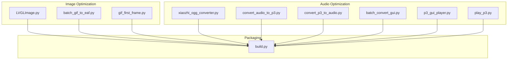
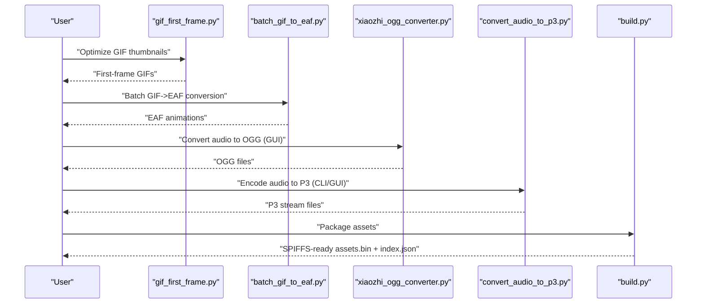
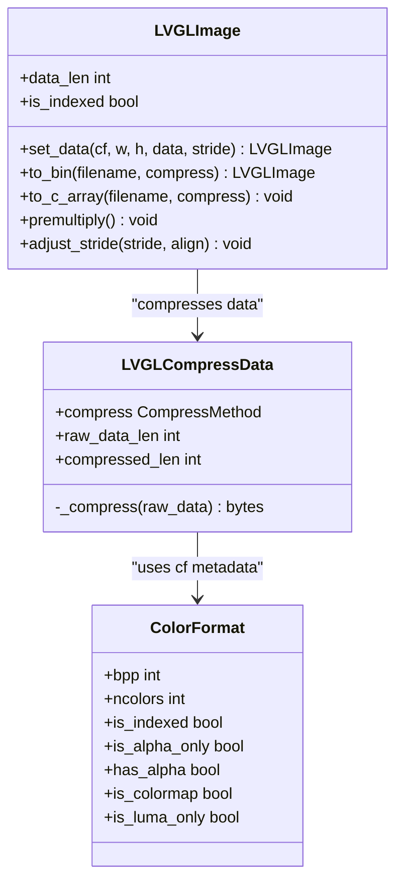
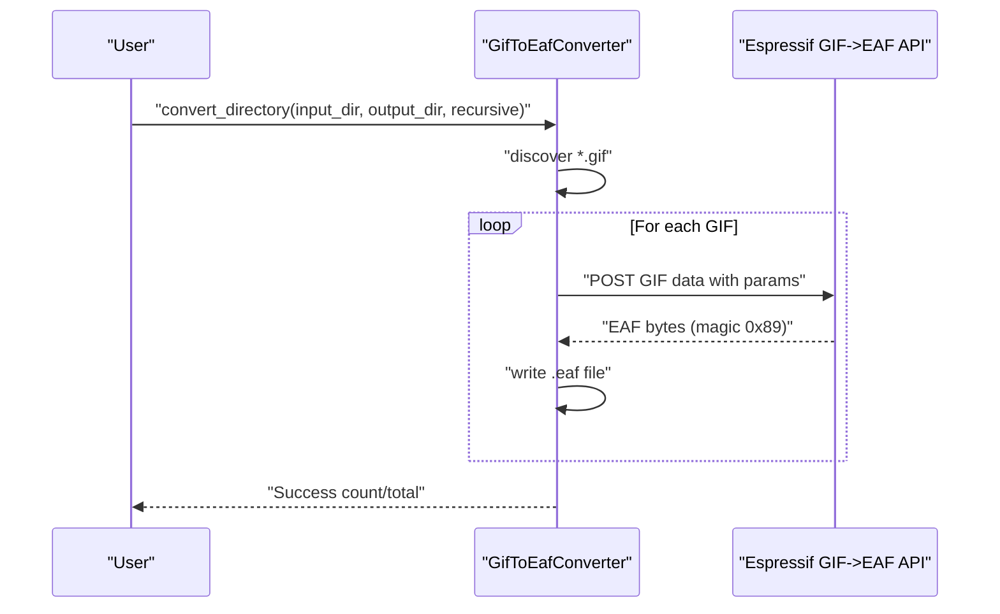
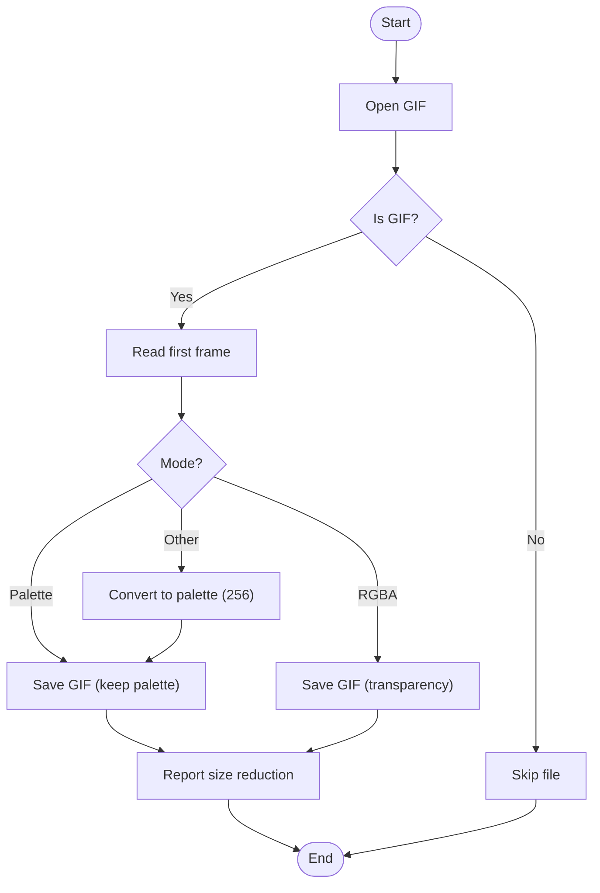
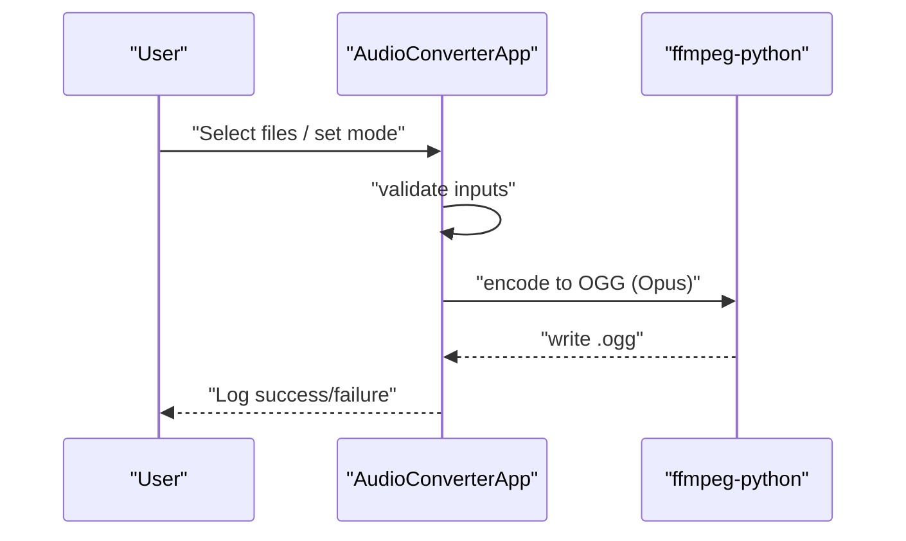
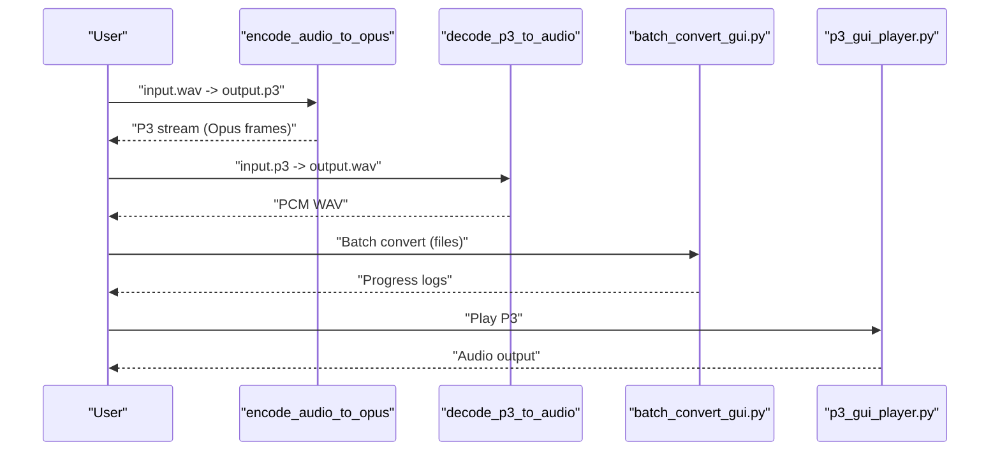
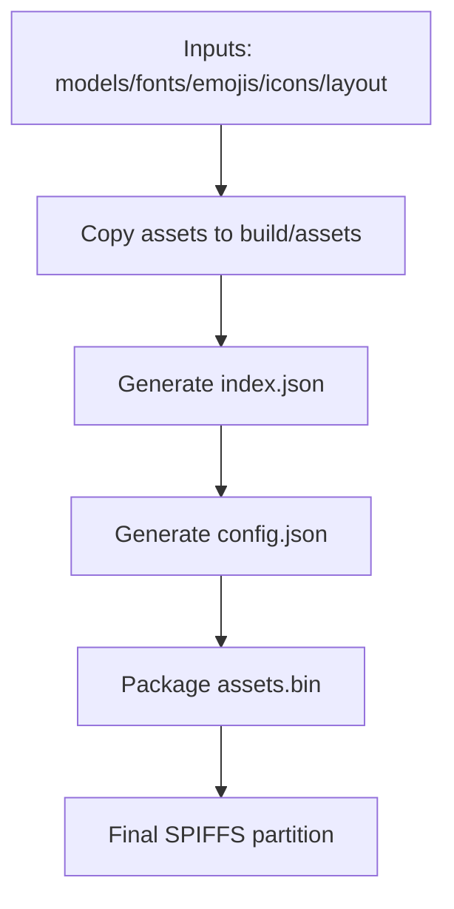
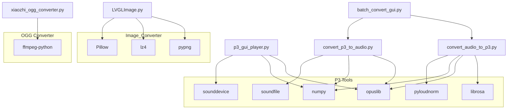

# Resource Optimization

<cite>
**Referenced Files in This Document**
- [LVGLImage.py](file://scripts/Image_Converter/LVGLImage.py)
- [batch_gif_to_eaf.py](file://scripts/Image_Converter/batch_gif_to_eaf.py)
- [gif_first_frame.py](file://scripts/gif_first_frame.py)
- [README.md](file://scripts/Image_Converter/README.md)
- [xiaozhi_ogg_converter.py](file://scripts/ogg_converter/xiaozhi_ogg_converter.py)
- [README.md](file://scripts/ogg_converter/README.md)
- [convert_audio_to_p3.py](file://scripts/p3_tools/convert_audio_to_p3.py)
- [convert_p3_to_audio.py](file://scripts/p3_tools/convert_p3_to_audio.py)
- [batch_convert_gui.py](file://scripts/p3_tools/batch_convert_gui.py)
- [p3_gui_player.py](file://scripts/p3_tools/p3_gui_player.py)
- [play_p3.py](file://scripts/p3_tools/play_p3.py)
- [requirements.txt](file://scripts/Image_Converter/requirements.txt)
- [requirements.txt](file://scripts/p3_tools/requirements.txt)
- [build.py](file://scripts/spiffs_assets/build.py)
</cite>

## Table of Contents
1. [Introduction](#introduction)
2. [Project Structure](#project-structure)
3. [Core Components](#core-components)
4. [Architecture Overview](#architecture-overview)
5. [Detailed Component Analysis](#detailed-component-analysis)
6. [Dependency Analysis](#dependency-analysis)
7. [Performance Considerations](#performance-considerations)
8. [Troubleshooting Guide](#troubleshooting-guide)
9. [Conclusion](#conclusion)
10. [Appendices](#appendices)

## Introduction
This document focuses on resource optimization tools for asset compression, format conversion, and storage efficiency. It covers:
- Image optimization for LVGL, including GIF to EAF conversion, PNG/JPG optimization, and format selection algorithms
- Thumbnail generation via first-frame extraction for GIFs
- Audio format optimization for OGG and P3 (Opus-based) streams
- Practical examples for balancing quality and storage
- Performance and memory implications for embedded systems

These tools are designed to streamline asset preparation for embedded targets, ensuring efficient storage and fast rendering on constrained devices.

## Project Structure
The repository organizes resource optimization under dedicated scripts:
- Image_Converter: LVGL image conversion and EAF generation
- ogg_converter: OGG audio conversion with GUI and FFmpeg integration
- p3_tools: Opus-based P3 audio processing, conversion, and playback
- spiffs_assets: Packaging assets into a SPIFFS-ready partition

**Diagram sources**
- [LVGLImage.py](file://scripts/Image_Converter/LVGLImage.py)
- [batch_gif_to_eaf.py](file://scripts/Image_Converter/batch_gif_to_eaf.py)
- [gif_first_frame.py](file://scripts/gif_first_frame.py)
- [xiaozhi_ogg_converter.py](file://scripts/ogg_converter/xiaozhi_ogg_converter.py)
- [convert_audio_to_p3.py](file://scripts/p3_tools/convert_audio_to_p3.py)
- [convert_p3_to_audio.py](file://scripts/p3_tools/convert_p3_to_audio.py)
- [batch_convert_gui.py](file://scripts/p3_tools/batch_convert_gui.py)
- [p3_gui_player.py](file://scripts/p3_tools/p3_gui_player.py)
- [play_p3.py](file://scripts/p3_tools/play_p3.py)
- [build.py](file://scripts/spiffs_assets/build.py)

**Section sources**
- [README.md](file://scripts/Image_Converter/README.md)
- [README.md](file://scripts/ogg_converter/README.md)

## Core Components
- LVGL image pipeline: color format detection, compression (RLE/LZ4), and C-array emission for embedded use
- GIF to EAF conversion: batch conversion using an online service with configurable bit depth and encoding
- GIF thumbnail extraction: first-frame capture preserving palette/transparency
- OGG conversion: GUI-driven Opus-based OGG creation with optional loudness normalization
- P3 audio tools: Opus encoder/decoder for 16 kHz mono frames, GUI player, and CLI playback
- Asset packaging: collects optimized assets into a SPIFFS-ready index and binary

**Section sources**
- [LVGLImage.py](file://scripts/Image_Converter/LVGLImage.py)
- [batch_gif_to_eaf.py](file://scripts/Image_Converter/batch_gif_to_eaf.py)
- [gif_first_frame.py](file://scripts/gif_first_frame.py)
- [xiaozhi_ogg_converter.py](file://scripts/ogg_converter/xiaozhi_ogg_converter.py)
- [convert_audio_to_p3.py](file://scripts/p3_tools/convert_audio_to_p3.py)
- [convert_p3_to_audio.py](file://scripts/p3_tools/convert_p3_to_audio.py)
- [batch_convert_gui.py](file://scripts/p3_tools/batch_convert_gui.py)
- [p3_gui_player.py](file://scripts/p3_tools/p3_gui_player.py)
- [play_p3.py](file://scripts/p3_tools/play_p3.py)
- [build.py](file://scripts/spiffs_assets/build.py)

## Architecture Overview
The optimization workflow integrates preprocessing, conversion, and packaging:
- Preprocessing: extract thumbnails, normalize audio loudness
- Conversion: format-specific optimization (PNG quantization, GIF to EAF, OGG/Opus)
- Packaging: assemble assets into SPIFFS-compatible structures

**Diagram sources**
- [gif_first_frame.py](file://scripts/gif_first_frame.py)
- [batch_gif_to_eaf.py](file://scripts/Image_Converter/batch_gif_to_eaf.py)
- [xiaozhi_ogg_converter.py](file://scripts/ogg_converter/xiaozhi_ogg_converter.py)
- [convert_audio_to_p3.py](file://scripts/p3_tools/convert_audio_to_p3.py)
- [build.py](file://scripts/spiffs_assets/build.py)

## Detailed Component Analysis

### LVGL Image Converter (LVGLImage.py)
Key capabilities:
- Color format enumeration and metadata (BPP, palette support, alpha presence)
- Data unpacking for various LVGL formats (indexed, grayscale, RGB565, ARGB8888, etc.)
- Compression pipeline supporting RLE and LZ4
- Header construction and C-array emission for embedded integration
- Optional alpha pre-multiplication and stride alignment

**Diagram sources**
- [LVGLImage.py](file://scripts/Image_Converter/LVGLImage.py)

Practical usage tips:
- Choose RGB565 for color images with moderate quality needs to halve storage compared to ARGB8888
- Use indexed formats (I1/I2/I4/I8) for low-color graphics to achieve significant savings
- Enable RLE for repetitive patterns; use LZ4 for photographic content
- Pre-multiply alpha for smoother blending and reduced runtime cost

**Section sources**
- [LVGLImage.py](file://scripts/Image_Converter/LVGLImage.py)
- [README.md](file://scripts/Image_Converter/README.md)

### GIF to EAF Converter (batch_gif_to_eaf.py)
Highlights:
- Batch conversion using an online Espressif service
- Configurable bit depth (4/8/24) and encoding (RLE/Huffman/JPEG)
- Recursive directory traversal and progress reporting

**Diagram sources**
- [batch_gif_to_eaf.py](file://scripts/Image_Converter/batch_gif_to_eaf.py)

Best practices:
- Prefer 8-bit color depth for most animations; switch to 24-bit only for gradients
- Use RLE for simple, low-color animations; JPEG for complex frames
- Limit frame count and dimensions to reduce EAF size

**Section sources**
- [batch_gif_to_eaf.py](file://scripts/Image_Converter/batch_gif_to_eaf.py)

### GIF Thumbnail Extraction (gif_first_frame.py)
Purpose:
- Extract the first frame of animated GIFs to reduce asset size for static previews
- Preserve palette/transparency when possible

**Diagram sources**
- [gif_first_frame.py](file://scripts/gif_first_frame.py)

**Section sources**
- [gif_first_frame.py](file://scripts/gif_first_frame.py)

### OGG Audio Converter (xiaozhi_ogg_converter.py)
Capabilities:
- GUI for converting audio to OGG using Opus codec
- Optional loudness normalization (LUFS) and frame duration tuning
- Bidirectional conversion (audio <-> OGG)

**Diagram sources**
- [xiaozhi_ogg_converter.py](file://scripts/ogg_converter/xiaozhi_ogg_converter.py)

Guidelines:
- Target 16 kHz sample rate and mono for voice/audio
- Keep bitrate reasonable (e.g., 16 kbps) for embedded playback
- Use loudness normalization for consistent perceived volume

**Section sources**
- [xiaozhi_ogg_converter.py](file://scripts/ogg_converter/xiaozhi_ogg_converter.py)
- [README.md](file://scripts/ogg_converter/README.md)

### P3 Audio Tools (convert_audio_to_p3.py, convert_p3_to_audio.py, GUI/player)
Features:
- Opus encoder for 60 ms frames at 16 kHz mono
- Decoder for playback and reverse conversion
- GUI for batch operations and a simple CLI player

**Diagram sources**
- [convert_audio_to_p3.py](file://scripts/p3_tools/convert_audio_to_p3.py)
- [convert_p3_to_audio.py](file://scripts/p3_tools/convert_p3_to_audio.py)
- [batch_convert_gui.py](file://scripts/p3_tools/batch_convert_gui.py)
- [p3_gui_player.py](file://scripts/p3_tools/p3_gui_player.py)
- [play_p3.py](file://scripts/p3_tools/play_p3.py)

Recommendations:
- Use 16 kHz mono for speech to minimize bandwidth and CPU
- Disable loudness normalization when input is already normalized or synthetic
- Frame duration of 60 ms balances latency and overhead

**Section sources**
- [convert_audio_to_p3.py](file://scripts/p3_tools/convert_audio_to_p3.py)
- [convert_p3_to_audio.py](file://scripts/p3_tools/convert_p3_to_audio.py)
- [batch_convert_gui.py](file://scripts/p3_tools/batch_convert_gui.py)
- [p3_gui_player.py](file://scripts/p3_tools/p3_gui_player.py)
- [play_p3.py](file://scripts/p3_tools/play_p3.py)

### Asset Packaging (build.py)
Responsibilities:
- Collects wakenet models, fonts, emojis, icons, and layouts
- Generates index.json and config.json for SPIFFS
- Invokes packaging to produce assets.bin

**Diagram sources**
- [build.py](file://scripts/spiffs_assets/build.py)

**Section sources**
- [build.py](file://scripts/spiffs_assets/build.py)

## Dependency Analysis
External tooling and libraries:
- Image_Converter
  - pypng, Pillow, lz4
- OGG Converter
  - ffmpeg-python (requires FFmpeg)
- P3 Tools
  - librosa, opuslib, numpy, tqdm, sounddevice, pyloudnorm, soundfile

**Diagram sources**
- [LVGLImage.py](file://scripts/Image_Converter/LVGLImage.py)
- [xiaozhi_ogg_converter.py](file://scripts/ogg_converter/xiaozhi_ogg_converter.py)
- [convert_audio_to_p3.py](file://scripts/p3_tools/convert_audio_to_p3.py)
- [convert_p3_to_audio.py](file://scripts/p3_tools/convert_p3_to_audio.py)
- [batch_convert_gui.py](file://scripts/p3_tools/batch_convert_gui.py)
- [p3_gui_player.py](file://scripts/p3_tools/p3_gui_player.py)
- [requirements.txt](file://scripts/Image_Converter/requirements.txt)
- [requirements.txt](file://scripts/p3_tools/requirements.txt)

**Section sources**
- [requirements.txt](file://scripts/Image_Converter/requirements.txt)
- [requirements.txt](file://scripts/p3_tools/requirements.txt)

## Performance Considerations
- Image formats
  - Indexed formats (I1/I2/I4/I8) dramatically reduce storage for low-color assets
  - RGB565 halves pixel size versus ARGB8888; suitable for UI graphics
  - Pre-multiplied alpha reduces blending cost at render time
- Compression
  - RLE excels on repetitive patterns; LZ4 suits photographic content
  - EAF with RLE/JPEG trades CPU for smaller footprint; Huffman offers balanced compression
- Audio
  - Opus at 16 kHz mono achieves good quality with minimal bandwidth
  - 60 ms frames balance latency and CPU usage
  - Loudness normalization improves perceived consistency but may alter dynamics
- Memory and CPU
  - Prefer preprocessed assets (first-frame thumbnails, EAF) to reduce runtime work
  - Use LZ4 for decompression on demand; RLE for static assets
  - Keep audio buffers small for real-time playback on embedded devices

[No sources needed since this section provides general guidance]

## Troubleshooting Guide
Common issues and resolutions:
- Missing external tools
  - Image_Converter requires pypng, Pillow, lz4; install via requirements
  - OGG Converter requires FFmpeg; ensure ffmpeg-python and FFmpeg are installed
  - P3 Tools require librosa, opuslib, numpy, sounddevice, pyloudnorm, soundfile
- GIF to EAF failures
  - Verify network connectivity and API availability; inspect debug output for HTTP errors
  - Ensure GIFs are valid and not corrupted
- Audio conversion anomalies
  - For loudness normalization warnings, consider disabling normalization for already-normalized inputs
  - Confirm sample rates and channel configurations match expectations
- Playback issues
  - Ensure Opus decoder libraries are available and compatible
  - Check frame sizes and sample rates (16 kHz, 60 ms) for compatibility

**Section sources**
- [requirements.txt](file://scripts/Image_Converter/requirements.txt)
- [requirements.txt](file://scripts/p3_tools/requirements.txt)
- [batch_gif_to_eaf.py](file://scripts/Image_Converter/batch_gif_to_eaf.py)
- [xiaozhi_ogg_converter.py](file://scripts/ogg_converter/xiaozhi_ogg_converter.py)
- [convert_audio_to_p3.py](file://scripts/p3_tools/convert_audio_to_p3.py)
- [p3_gui_player.py](file://scripts/p3_tools/p3_gui_player.py)

## Conclusion
These tools collectively enable efficient asset optimization across images and audio for embedded deployment. By selecting appropriate formats, applying targeted compression, and packaging assets systematically, teams can significantly reduce storage requirements while maintaining acceptable quality and performance.

[No sources needed since this section summarizes without analyzing specific files]

## Appendices

### Practical Examples and Parameter Tuning
- Optimize UI graphics
  - Use indexed formats for icons and simple logos; choose I4/I8 for medium complexity
  - Apply RLE for tiled backgrounds; use LZ4 for photos
- Optimize animations
  - Reduce color depth to 8-bit; apply RLE for simple animations; JPEG for complex frames
  - Extract first frames for static previews to save space
- Optimize voice/audio
  - Convert to OGG/Opus at 16 kHz mono; tune bitrate to balance quality and size
  - Normalize loudness for consistent perception; disable for synthetic or already-normalized audio
- P3 streams
  - Encode with 60 ms frames; decode for playback or reverse conversion to WAV

[No sources needed since this section provides general guidance]