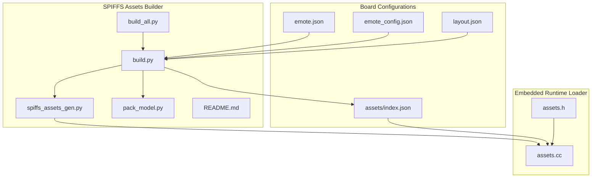
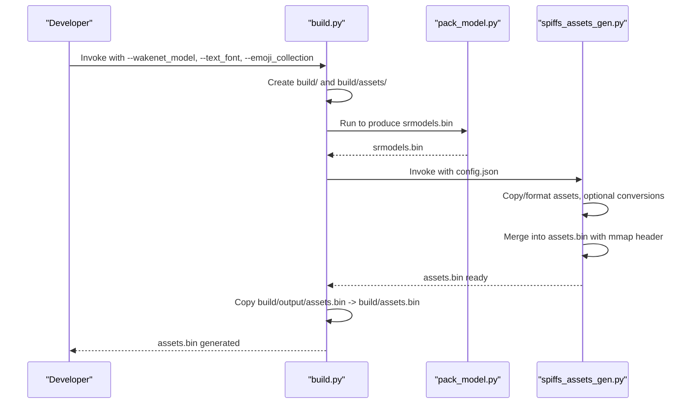
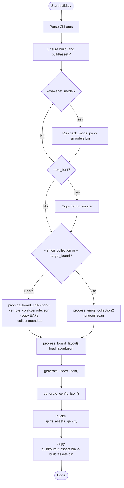
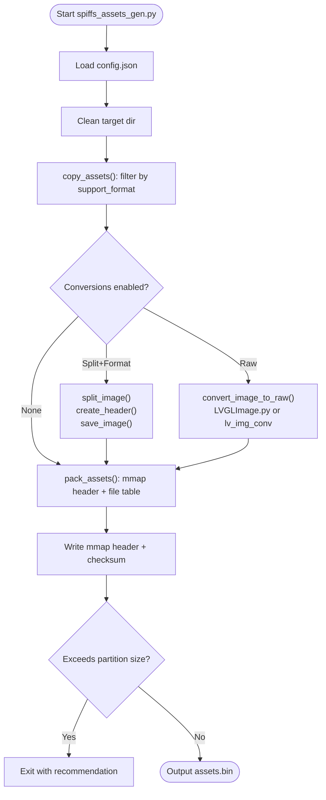
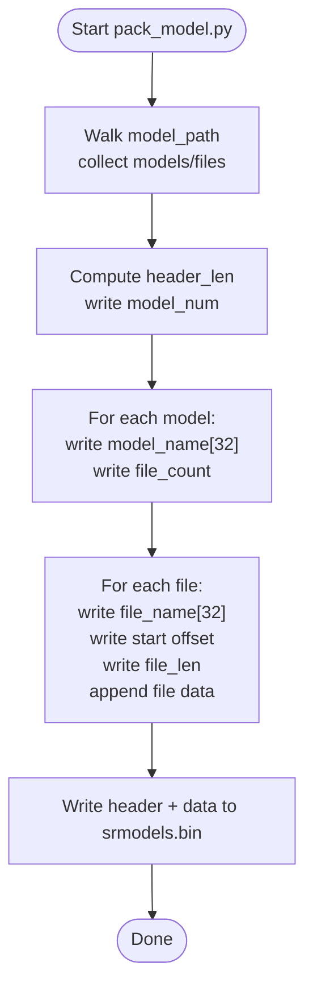
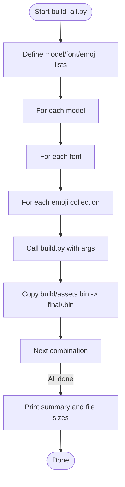
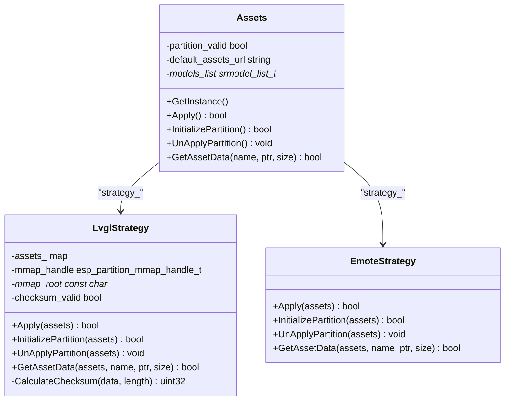
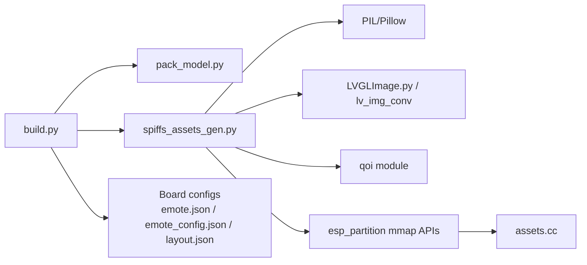

# SPIFFS Packing System

<cite>
**Referenced Files in This Document**
- [build.py](file://scripts/spiffs_assets/build.py)
- [spiffs_assets_gen.py](file://scripts/spiffs_assets/spiffs_assets_gen.py)
- [pack_model.py](file://scripts/spiffs_assets/pack_model.py)
- [build_all.py](file://scripts/spiffs_assets/build_all.py)
- [README.md](file://scripts/spiffs_assets/README.md)
- [emote.json](file://main/boards/lulu-esp32s3/emote.json)
- [emote_config.json](file://main/boards/lulu-esp32s3/emote_config.json)
- [layout.json](file://main/boards/lulu-esp32s3/240_240/layout.json)
- [assets/index.json](file://main/boards/lulu-esp32s3/assets/index.json)
- [assets.h](file://main/assets.h)
- [assets.cc](file://main/assets.cc)
</cite>

## Table of Contents
1. [Introduction](#introduction)
2. [Project Structure](#project-structure)
3. [Core Components](#core-components)
4. [Architecture Overview](#architecture-overview)
5. [Detailed Component Analysis](#detailed-component-analysis)
6. [Dependency Analysis](#dependency-analysis)
7. [Performance Considerations](#performance-considerations)
8. [Troubleshooting Guide](#troubleshooting-guide)
9. [Conclusion](#conclusion)
10. [Appendices](#appendices)

## Introduction
This document explains the SPIFFS packing system that transforms raw resources into an optimized embedded binary suitable for ESP-IDF devices. It covers the complete asset packaging pipeline from argument parsing and directory management to asset copying, model packaging, and final binary generation. It also documents the integration with the runtime asset loader, asset organization structure, naming conventions, metadata handling, and practical examples for building assets across boards. Finally, it provides troubleshooting guidance and performance optimization techniques tailored for embedded storage systems.

## Project Structure
The SPIFFS packing system is centered around a small set of Python scripts under scripts/spiffs_assets, along with board-specific configuration files and the embedded runtime asset loader.

**Diagram sources**
- [build.py:1-385](file://scripts/spiffs_assets/build.py#L1-L385)
- [spiffs_assets_gen.py:1-648](file://scripts/spiffs_assets/spiffs_assets_gen.py#L1-L648)
- [pack_model.py:1-124](file://scripts/spiffs_assets/pack_model.py#L1-L124)
- [build_all.py:1-149](file://scripts/spiffs_assets/build_all.py#L1-L149)
- [README.md:1-111](file://scripts/spiffs_assets/README.md#L1-L111)
- [emote.json:1-30](file://main/boards/lulu-esp32s3/emote.json#L1-L30)
- [emote_config.json:1-34](file://main/boards/lulu-esp32s3/emote_config.json#L1-L34)
- [layout.json:1-85](file://main/boards/lulu-esp32s3/240_240/layout.json#L1-L85)
- [assets/index.json:1-26](file://main/boards/lulu-esp32s3/assets/index.json#L1-L26)
- [assets.h:1-90](file://main/assets.h#L1-L90)
- [assets.cc:1-561](file://main/assets.cc#L1-L561)

**Section sources**
- [README.md:1-111](file://scripts/spiffs_assets/README.md#L1-L111)

## Core Components
- build.py: Orchestrates asset packaging. Parses arguments, manages build directories, copies assets, generates index.json and config.json, runs model packing, and invokes the final packaging tool.
- spiffs_assets_gen.py: Copies and converts assets, merges them into a single binary with a memory-mapped header, and optionally merges with the app binary.
- pack_model.py: Packs WakeNet model files into a single srmodels.bin with a structured header and offsets.
- build_all.py: Automates generation of multiple assets.bin variants by iterating over predefined model, font, and emoji combinations.
- Board configs: emote.json and emote_config.json define per-board emoji sets and properties; layout.json defines UI layout elements; assets/index.json is the generated index for the board.

Key runtime integration:
- assets.h/cc: Declares the Assets class and strategies for LVGL and emote modes, including mmap-based access and checksum verification.

**Section sources**
- [build.py:325-382](file://scripts/spiffs_assets/build.py#L325-L382)
- [spiffs_assets_gen.py:534-648](file://scripts/spiffs_assets/spiffs_assets_gen.py#L534-L648)
- [pack_model.py:41-113](file://scripts/spiffs_assets/pack_model.py#L41-L113)
- [build_all.py:80-143](file://scripts/spiffs_assets/build_all.py#L80-L143)
- [assets.h:1-90](file://main/assets.h#L1-L90)
- [assets.cc:121-357](file://main/assets.cc#L121-L357)

## Architecture Overview
The packaging pipeline consists of three stages:
1) Build-time preparation: Argument parsing, directory creation, asset copying, and index/config generation.
2) Model packaging: WakeNet models are packed into srmodels.bin.
3) Final packaging: Assets are copied, optionally converted, merged into assets.bin with a memory-mapped header, and validated against partition size.

**Diagram sources**
- [build.py:325-382](file://scripts/spiffs_assets/build.py#L325-L382)
- [pack_model.py:115-124](file://scripts/spiffs_assets/pack_model.py#L115-L124)
- [spiffs_assets_gen.py:534-648](file://scripts/spiffs_assets/spiffs_assets_gen.py#L534-L648)

## Detailed Component Analysis

### build.py: Asset Packaging Orchestration
Responsibilities:
- Argument parsing for WakeNet model, text font, emoji collection, and board-specific resources.
- Directory management: Ensures build and assets directories exist; cleans previous assets.
- Asset processing:
  - WakeNet model: Copies model directory, runs pack_model.py, places srmodels.bin into assets.
  - Text font: Copies .bin font file into assets.
  - Emoji collection: Scans directory for .png/.gif; generates index entries; supports board-specific emote.json.
  - Board-specific resources: Reads emote_config.json or emote.json, resolves src paths, copies EAFs, records metadata (fps, loop, lack).
  - Layout: Loads layout.json and preserves all fields for runtime UI composition.
- Index and config generation: Writes index.json and config.json consumed by the packaging tool and runtime.
- Final packaging: Invokes spiffs_assets_gen.py with the generated config.json and copies the resulting assets.bin to the build root.

**Diagram sources**
- [build.py:325-382](file://scripts/spiffs_assets/build.py#L325-L382)

**Section sources**
- [build.py:25-382](file://scripts/spiffs_assets/build.py#L25-L382)

### spiffs_assets_gen.py: Final Binary Packaging and Conversion
Responsibilities:
- Asset copying: Filters assets by supported formats and copies to a staging target directory.
- Optional conversions:
  - Split images by height and convert to .sjpg/.spng or .sqoi formats.
  - Convert to raw LVGL BIN via LVGLImage.py (v9+) or lv_img_conv (v8).
- Memory-mapped packaging:
  - Builds a header containing total file count and checksum.
  - Constructs a file info table with fixed-length names, sizes, offsets, width, and height.
  - Merges data with a 0x5A5A magic prefix per file.
  - Generates mmap_generate_<assets>.h with enums for each asset.
- Partition sizing checks: Validates assets.bin against configured partition size and reports recommended sizes.
- Optional merge mode: Appends assets.bin to the app binary to form a combined image.

**Diagram sources**
- [spiffs_assets_gen.py:534-648](file://scripts/spiffs_assets/spiffs_assets_gen.py#L534-L648)

**Section sources**
- [spiffs_assets_gen.py:291-491](file://scripts/spiffs_assets/spiffs_assets_gen.py#L291-L491)

### pack_model.py: WakeNet Model Packing
Responsibilities:
- Walks a model directory tree and reads all model files.
- Packs them into a single srmodels.bin with a structured header:
  - Model count and per-model info (name, file count).
  - Offsets and lengths for each file within the model group.
  - Concatenated model data immediately following the header.

**Diagram sources**
- [pack_model.py:41-113](file://scripts/spiffs_assets/pack_model.py#L41-L113)

**Section sources**
- [pack_model.py:1-124](file://scripts/spiffs_assets/pack_model.py#L1-L124)

### build_all.py: Automation for Multiple Combinations
Responsibilities:
- Iterates over predefined lists of WakeNet models, fonts, and emoji collections.
- Invokes build.py for each combination, captures generated assets.bin, and renames/copies to a final directory with descriptive filenames.

**Diagram sources**
- [build_all.py:80-143](file://scripts/spiffs_assets/build_all.py#L80-L143)

**Section sources**
- [build_all.py:1-149](file://scripts/spiffs_assets/build_all.py#L1-L149)

### Runtime Asset Loader Integration
The embedded runtime loads assets from the "assets" partition using memory-mapped access and validates integrity via checksums.

**Diagram sources**
- [assets.h:23-87](file://main/assets.h#L23-L87)
- [assets.cc:121-357](file://main/assets.cc#L121-L357)

**Section sources**
- [assets.h:1-90](file://main/assets.h#L1-L90)
- [assets.cc:1-561](file://main/assets.cc#L1-L561)

## Dependency Analysis
- build.py depends on:
  - pack_model.py for WakeNet model packing.
  - spiffs_assets_gen.py for final binary packaging.
  - Board configuration files (emote.json, emote_config.json, layout.json) for board-specific assets.
- spiffs_assets_gen.py depends on:
  - PIL/Pillow for image operations.
  - LVGLImage.py (v9+) or lv_img_conv (v8) for raw conversion.
  - qoi module for QOI conversion when enabled.
- assets.cc depends on:
  - esp_partition mmap APIs and cJSON for parsing index.json and loading assets.

**Diagram sources**
- [build.py:62-73](file://scripts/spiffs_assets/build.py#L62-L73)
- [spiffs_assets_gen.py:141-174](file://scripts/spiffs_assets/spiffs_assets_gen.py#L141-L174)
- [assets.cc:130-184](file://main/assets.cc#L130-L184)

**Section sources**
- [build.py:1-385](file://scripts/spiffs_assets/build.py#L1-L385)
- [spiffs_assets_gen.py:1-648](file://scripts/spiffs_assets/spiffs_assets_gen.py#L1-L648)
- [assets.cc:1-561](file://main/assets.cc#L1-L561)

## Performance Considerations
- Image splitting and compression:
  - Use split_height to reduce memory pressure during decompression; smaller tiles improve streaming and reduce peak RAM usage.
  - Prefer .spng/.sjpg/.sqoi when supported to reduce storage footprint; ensure split_height is set appropriately.
- Raw LVGL conversion:
  - Choose LVGLImage.py (v9+) for modern workflows; it avoids extra conversion steps compared to lv_img_conv (v8).
- Partition sizing:
  - Monitor total assets.bin size versus partition size; spiffs_assets_gen.py provides recommendations when limits are exceeded.
- Naming and metadata:
  - Keep asset names within name_length limit to avoid truncation overhead.
  - Minimize redundant assets; leverage board-specific emote_config.json to include only necessary animations/icons.

[No sources needed since this section provides general guidance]

## Troubleshooting Guide
Common issues and resolutions:
- Missing source files or directories:
  - build.py prints warnings when sources do not exist; verify paths passed to --wakenet_model, --text_font, --emoji_collection, --res_path, and --target_board.
- Model packing failures:
  - pack_model.py requires a valid model directory tree; ensure all model files are present and readable.
- Conversion errors:
  - spiffs_assets_gen.py downloads LVGLImage.py (v9+) or clones lv_img_conv (v8); network issues or missing Python packages can cause failures. Install Pillow and required modules.
- Partition size exceeded:
  - spiffs_assets_gen.py validates assets.bin against assets_size; increase partition size or remove unused assets.
- Board-specific emote resolution:
  - If emote.json references src files not present, build.py logs warnings; ensure all referenced EAFs exist in the emoji collection directory.
- Runtime mmap checksum mismatch:
  - assets.cc verifies checksum after mmap; mismatches indicate corrupted or mismatched assets.bin; regenerate assets using the latest build.py and spiffs_assets_gen.py.

**Section sources**
- [build.py:31-37](file://scripts/spiffs_assets/build.py#L31-L37)
- [spiffs_assets_gen.py:77-99](file://scripts/spiffs_assets/spiffs_assets_gen.py#L77-L99)
- [assets.cc:169-172](file://main/assets.cc#L169-L172)

## Conclusion
The SPIFFS packing system provides a robust, automated pipeline to transform raw assets into a memory-mapped, validated binary suitable for embedded devices. By leveraging board-specific configurations, flexible conversion options, and strict partition validation, it enables efficient storage utilization and reliable runtime asset access. The included automation scripts further streamline multi-variant builds, while the runtime loader ensures secure and fast asset retrieval.

[No sources needed since this section summarizes without analyzing specific files]

## Appendices

### Asset Organization and Naming Conventions
- Supported formats:
  - Images: .png, .gif (converted to .spng/.sjpg/.sqoi or raw BIN).
  - Fonts: .bin (e.g., cbin fonts).
  - Models: .bin (packed into srmodels.bin).
  - Layout: .json (layout.json).
  - Index: index.json (generated).
- Naming conventions:
  - Asset names in index.json are fixed-length and null-padded to name_length.
  - EAF references in emote_config.json/src must match actual filenames in the emoji collection directory.
- Metadata handling:
  - emote_config.json supports fps, loop, and lack flags per emote.
  - layout.json preserves UI element definitions for runtime rendering.

**Section sources**
- [spiffs_assets_gen.py:444-458](file://scripts/spiffs_assets/spiffs_assets_gen.py#L444-L458)
- [emote_config.json:1-34](file://main/boards/lulu-esp32s3/emote_config.json#L1-L34)
- [layout.json:1-85](file://main/boards/lulu-esp32s3/240_240/layout.json#L1-L85)
- [assets/index.json:1-26](file://main/boards/lulu-esp32s3/assets/index.json#L1-L26)

### Practical Examples

- Building assets for a specific board:
  - Use --target_board and --res_path to process board-specific assets defined by emote.json/emote_config.json and layout.json.
  - Example invocation pattern is shown in the build.py usage and README.

- Configuring asset priorities:
  - Selectively include WakeNet models, fonts, and emoji sets via command-line arguments to optimize storage.
  - Use build_all.py to iterate combinations and compare sizes; choose the smallest acceptable variant.

- Optimizing storage utilization:
  - Enable .spng/.sjpg/.sqoi conversions and set split_height to balance memory and storage.
  - Remove unused assets and rely on board-specific configs to include only necessary animations/icons.

**Section sources**
- [README.md:18-50](file://scripts/spiffs_assets/README.md#L18-L50)
- [build_all.py:80-143](file://scripts/spiffs_assets/build_all.py#L80-L143)
- [spiffs_assets_gen.py:565-576](file://scripts/spiffs_assets/spiffs_assets_gen.py#L565-L576)