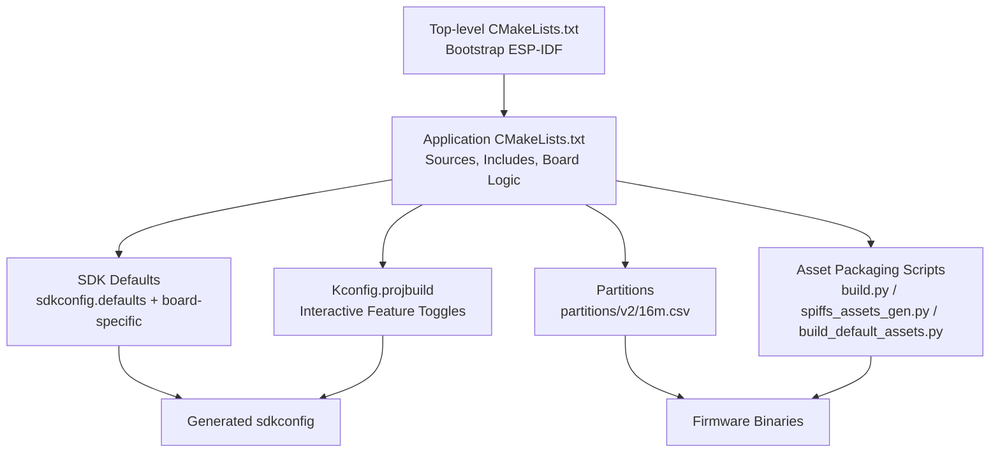
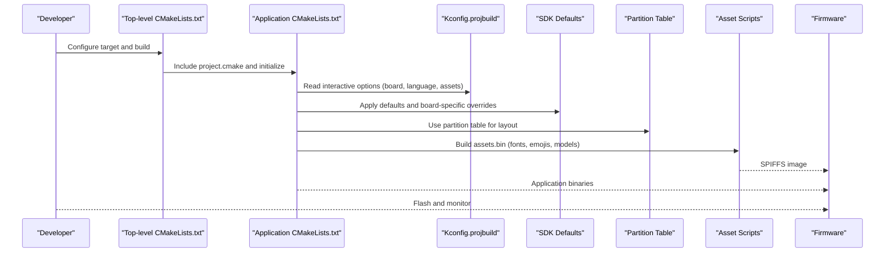
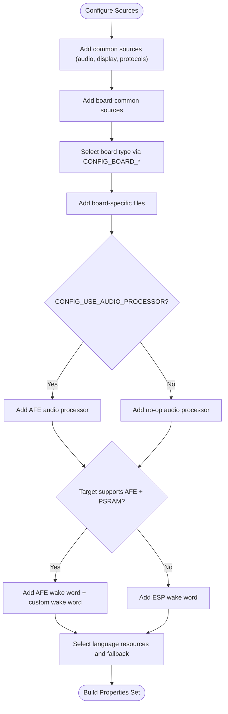
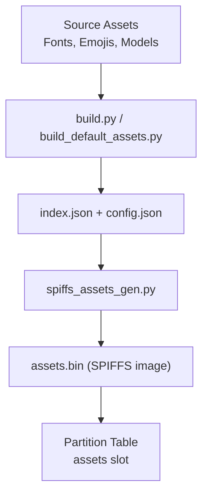
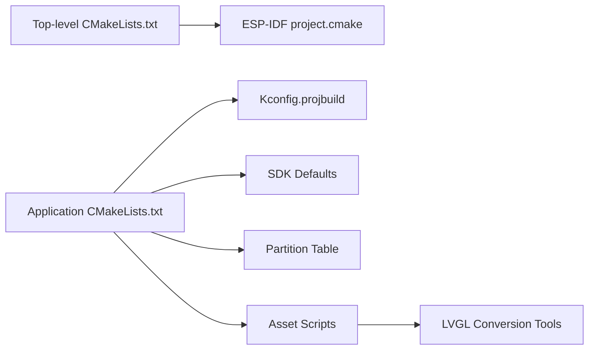

# Build System Overview

<cite>
**Referenced Files in This Document**
- [CMakeLists.txt](file://CMakeLists.txt)
- [main/CMakeLists.txt](file://main/CMakeLists.txt)
- [main/Kconfig.projbuild](file://main/Kconfig.projbuild)
- [main/idf_component.yml](file://main/idf_component.yml)
- [sdkconfig.defaults](file://sdkconfig.defaults)
- [sdkconfig.defaults.esp32s3](file://sdkconfig.defaults.esp32s3)
- [partitions/v2/16m.csv](file://partitions/v2/16m.csv)
- [scripts/spiffs_assets/build.py](file://scripts/spiffs_assets/build.py)
- [scripts/spiffs_assets/spiffs_assets_gen.py](file://scripts/spiffs_assets/spiffs_assets_gen.py)
- [scripts/build_default_assets.py](file://scripts/build_default_assets.py)
- [test_firmware/sdkconfig.defaults](file://test_firmware/sdkconfig.defaults)
- [README.md](file://README.md)
</cite>

## Table of Contents
1. [Introduction](#introduction)
2. [Project Structure](#project-structure)
3. [Core Components](#core-components)
4. [Architecture Overview](#architecture-overview)
5. [Detailed Component Analysis](#detailed-component-analysis)
6. [Dependency Analysis](#dependency-analysis)
7. [Performance Considerations](#performance-considerations)
8. [Troubleshooting Guide](#troubleshooting-guide)
9. [Conclusion](#conclusion)
10. [Appendices](#appendices)

## Introduction
This document explains the ESP-IDF build system for the project, focusing on project configuration, the CMake-based compilation workflow, and the build pipeline from source to firmware. It covers SDK configuration options, board-specific settings, component dependencies, partition table processing, and asset integration. Practical guidance is included for customizing build settings, adding new components, and optimizing build performance, along with cross-compilation and environment setup.

## Project Structure
The project follows an ESP-IDF monorepo layout with a top-level CMake build that includes a main application component. The build system integrates:
- Top-level CMakeLists.txt to bootstrap the ESP-IDF project and enable minimal builds
- Application-level CMakeLists.txt to define sources, include paths, and board-specific logic
- Kconfig.projbuild for interactive configuration of board types, languages, assets, and features
- sdkconfig.defaults and board-specific defaults for SDK configuration
- Partition tables and SPIFFS asset packaging scripts

**Diagram sources**
- [CMakeLists.txt:1-14](file://CMakeLists.txt#L1-L14)
- [main/CMakeLists.txt:1-1121](file://main/CMakeLists.txt#L1-L1121)
- [main/Kconfig.projbuild:1-846](file://main/Kconfig.projbuild#L1-L846)
- [sdkconfig.defaults:1-83](file://sdkconfig.defaults#L1-L83)
- [sdkconfig.defaults.esp32s3:1-63](file://sdkconfig.defaults.esp32s3#L1-L63)
- [partitions/v2/16m.csv:1-9](file://partitions/v2/16m.csv#L1-L9)
- [scripts/spiffs_assets/build.py:1-385](file://scripts/spiffs_assets/build.py#L1-L385)
- [scripts/spiffs_assets/spiffs_assets_gen.py:1-648](file://scripts/spiffs_assets/spiffs_assets_gen.py#L1-L648)
- [scripts/build_default_assets.py:1-935](file://scripts/build_default_assets.py#L1-L935)

**Section sources**
- [CMakeLists.txt:1-14](file://CMakeLists.txt#L1-L14)
- [main/CMakeLists.txt:1-1121](file://main/CMakeLists.txt#L1-L1121)
- [main/Kconfig.projbuild:1-846](file://main/Kconfig.projbuild#L1-L846)
- [sdkconfig.defaults:1-83](file://sdkconfig.defaults#L1-L83)
- [sdkconfig.defaults.esp32s3:1-63](file://sdkconfig.defaults.esp32s3#L1-L63)
- [partitions/v2/16m.csv:1-9](file://partitions/v2/16m.csv#L1-L9)
- [scripts/spiffs_assets/build.py:1-385](file://scripts/spiffs_assets/build.py#L1-L385)
- [scripts/spiffs_assets/spiffs_assets_gen.py:1-648](file://scripts/spiffs_assets/spiffs_assets_gen.py#L1-L648)
- [scripts/build_default_assets.py:1-935](file://scripts/build_default_assets.py#L1-L935)

## Core Components
- Top-level CMake bootstrap: sets minimum CMake version, adds compile options, includes ESP-IDF project.cmake, enables minimal build, and defines project metadata.
- Application CMakeLists.txt: aggregates sources, include directories, board-specific files, and dynamic selection logic based on Kconfig options. It also selects audio processors, wake word implementations, and language resources.
- Kconfig.projbuild: interactive configuration for board types, languages, assets flashing modes, Wi-Fi provisioning, audio processing, and wake word features.
- SDK defaults: global defaults and board-specific overrides controlling flash/PSRAM, CPU frequency, cache, LVGL, partition table, and feature toggles.
- Partition table: defines NVS, ota slots, PHY init, and assets partition for SPIFFS.
- Asset packaging: scripts to build assets.bin from fonts, emojis, and wake word models, and to package them into a SPIFFS image.

**Section sources**
- [CMakeLists.txt:1-14](file://CMakeLists.txt#L1-L14)
- [main/CMakeLists.txt:1-1121](file://main/CMakeLists.txt#L1-L1121)
- [main/Kconfig.projbuild:1-846](file://main/Kconfig.projbuild#L1-L846)
- [sdkconfig.defaults:1-83](file://sdkconfig.defaults#L1-L83)
- [sdkconfig.defaults.esp32s3:1-63](file://sdkconfig.defaults.esp32s3#L1-L63)
- [partitions/v2/16m.csv:1-9](file://partitions/v2/16m.csv#L1-L9)

## Architecture Overview
The build system orchestrates configuration, source compilation, and firmware generation with optional asset packaging. The flow below maps to actual source files and scripts.

**Diagram sources**
- [CMakeLists.txt:1-14](file://CMakeLists.txt#L1-L14)
- [main/CMakeLists.txt:1-1121](file://main/CMakeLists.txt#L1-L1121)
- [main/Kconfig.projbuild:1-846](file://main/Kconfig.projbuild#L1-L846)
- [sdkconfig.defaults:1-83](file://sdkconfig.defaults#L1-L83)
- [sdkconfig.defaults.esp32s3:1-63](file://sdkconfig.defaults.esp32s3#L1-L63)
- [partitions/v2/16m.csv:1-9](file://partitions/v2/16m.csv#L1-L9)
- [scripts/spiffs_assets/build.py:1-385](file://scripts/spiffs_assets/build.py#L1-L385)
- [scripts/spiffs_assets/spiffs_assets_gen.py:1-648](file://scripts/spiffs_assets/spiffs_assets_gen.py#L1-L648)
- [scripts/build_default_assets.py:1-935](file://scripts/build_default_assets.py#L1-L935)

## Detailed Component Analysis

### CMake Bootstrap and Minimal Build
- Sets minimum CMake version and disables a specific compiler warning.
- Includes ESP-IDF’s project.cmake to integrate the framework.
- Enables MINIMAL_BUILD to trim the build to essential components plus the main application and its dependencies.
- Defines project version and project name.

**Section sources**
- [CMakeLists.txt:1-14](file://CMakeLists.txt#L1-L14)

### Application CMakeLists.txt: Sources, Includes, and Board Logic
- Declares application sources across audio, display, protocols, and device state management.
- Adds board-common sources and dynamically selects board-specific sources based on CONFIG_BOARD_* options.
- Selects audio processor implementation depending on Kconfig and target family.
- Chooses wake word implementation based on target and PSRAM availability.
- Handles language resource selection and fallback logic.
- Applies board-specific defaults for fonts, emoji collections, and resolution.

**Diagram sources**
- [main/CMakeLists.txt:1-1121](file://main/CMakeLists.txt#L1-L1121)

**Section sources**
- [main/CMakeLists.txt:1-1121](file://main/CMakeLists.txt#L1-L1121)

### Kconfig.projbuild: Interactive Configuration
- Provides a “Xiaozhi Assistant” menu with:
  - Board Type selection covering many ESP32/ESP32-S3/ESP32-P4 boards
  - Default Language choice (Chinese or English)
  - Flash Assets mode (None, Default, Custom, Emote)
  - Wi-Fi provisioning method (Hotspot, Acoustic, Esp Blufi)
  - Audio processing and AEC options
  - Wake word type selection (Disabled, ESP, AFE, Custom)
  - Custom wake word parameters and thresholds
  - Display styles and screen configurations for specific boards

These choices influence the application CMakeLists.txt logic and SDK defaults.

**Section sources**
- [main/Kconfig.projbuild:1-846](file://main/Kconfig.projbuild#L1-L846)

### SDK Configuration System
- Global defaults in sdkconfig.defaults:
  - Compiler optimization, exceptions, RTTI, logging levels
  - Bootloader optimization and validation
  - HTTPD limits, FreeRTOS stats, task stack sizes
  - mbedTLS dynamic buffers and SSL renegotiation
  - LVGL configuration and widget set reduction
  - Partition table customization and offsets
- Board-specific defaults in sdkconfig.defaults.esp32s3:
  - Flash size/mode, CPU frequency, PSRAM configuration
  - ESP32-S3 cache settings, SPIRAM allocator behavior
  - OTA URL, Bluetooth/NimBLE configuration for provisioning
  - LVGL snapshot support and board-specific flags

These defaults are applied during configuration and can be overridden by user selections in Kconfig.projbuild.

**Section sources**
- [sdkconfig.defaults:1-83](file://sdkconfig.defaults#L1-L83)
- [sdkconfig.defaults.esp32s3:1-63](file://sdkconfig.defaults.esp32s3#L1-L63)

### Partition Table and Assets Integration
- Partition table partitions:
  - NVS, ota data, PHY init data
  - Two OTA slots
  - Assets partition for SPIFFS with a fixed offset and size
- Asset packaging pipeline:
  - build.py: processes wake word models, fonts, emoji collections, and board-specific resources; generates index.json and config.json; packages assets.bin
  - spiffs_assets_gen.py: copies, optionally converts images to LVGL-compatible formats, and packs assets into a binary with a memory-mapped header
  - build_default_assets.py: integrates with sdkconfig to build assets.bin for default/emote assets, including model packing and header generation

**Diagram sources**
- [scripts/spiffs_assets/build.py:1-385](file://scripts/spiffs_assets/build.py#L1-L385)
- [scripts/spiffs_assets/spiffs_assets_gen.py:1-648](file://scripts/spiffs_assets/spiffs_assets_gen.py#L1-L648)
- [scripts/build_default_assets.py:1-935](file://scripts/build_default_assets.py#L1-L935)
- [partitions/v2/16m.csv:1-9](file://partitions/v2/16m.csv#L1-L9)

**Section sources**
- [partitions/v2/16m.csv:1-9](file://partitions/v2/16m.csv#L1-L9)
- [scripts/spiffs_assets/build.py:1-385](file://scripts/spiffs_assets/build.py#L1-L385)
- [scripts/spiffs_assets/spiffs_assets_gen.py:1-648](file://scripts/spiffs_assets/spiffs_assets_gen.py#L1-L648)
- [scripts/build_default_assets.py:1-935](file://scripts/build_default_assets.py#L1-L935)

### Component Dependencies and IDF Component Manager
- main/idf_component.yml declares managed dependencies for display panels, touch controllers, audio components, ESP-ANSI fonts, LED strips, ESP-SR, and other peripherals.
- Rules restrict certain components to specific targets (e.g., esp32s3, esp32p4), ensuring compatibility.

**Section sources**
- [main/idf_component.yml:1-128](file://main/idf_component.yml#L1-L128)

### Test Firmware Configuration
- test_firmware/sdkconfig.defaults demonstrates a minimal ESP32-S3 configuration with PSRAM, flash settings, CPU frequency, cache, camera module, and console UART.

**Section sources**
- [test_firmware/sdkconfig.defaults:1-26](file://test_firmware/sdkconfig.defaults#L1-L26)

## Dependency Analysis
The build system exhibits clear separation of concerns:
- Top-level CMake depends on ESP-IDF project.cmake
- Application CMake depends on Kconfig.projbuild and SDK defaults
- Application CMake depends on board-specific sources and assets
- Asset scripts depend on configuration JSON and LVGL conversion utilities

**Diagram sources**
- [CMakeLists.txt:1-14](file://CMakeLists.txt#L1-L14)
- [main/CMakeLists.txt:1-1121](file://main/CMakeLists.txt#L1-L1121)
- [main/Kconfig.projbuild:1-846](file://main/Kconfig.projbuild#L1-L846)
- [sdkconfig.defaults:1-83](file://sdkconfig.defaults#L1-L83)
- [sdkconfig.defaults.esp32s3:1-63](file://sdkconfig.defaults.esp32s3#L1-L63)
- [partitions/v2/16m.csv:1-9](file://partitions/v2/16m.csv#L1-L9)
- [scripts/spiffs_assets/spiffs_assets_gen.py:1-648](file://scripts/spiffs_assets/spiffs_assets_gen.py#L1-L648)

**Section sources**
- [CMakeLists.txt:1-14](file://CMakeLists.txt#L1-L14)
- [main/CMakeLists.txt:1-1121](file://main/CMakeLists.txt#L1-L1121)
- [main/Kconfig.projbuild:1-846](file://main/Kconfig.projbuild#L1-L846)
- [sdkconfig.defaults:1-83](file://sdkconfig.defaults#L1-L83)
- [sdkconfig.defaults.esp32s3:1-63](file://sdkconfig.defaults.esp32s3#L1-L63)
- [partitions/v2/16m.csv:1-9](file://partitions/v2/16m.csv#L1-L9)
- [scripts/spiffs_assets/spiffs_assets_gen.py:1-648](file://scripts/spiffs_assets/spiffs_assets_gen.py#L1-L648)

## Performance Considerations
- Minimal build trimming reduces compile time and memory footprint by including only essential components plus the main application and its dependencies.
- PSRAM and octal flash settings improve performance for graphics and audio processing on ESP32-S3/P4 targets.
- LVGL widget set reduction and disabling unused widgets decrease flash usage and runtime overhead.
- Image conversion to LVGL-compatible formats (e.g., .sjpg/.spng/.sqoi) and splitting by height can optimize rendering performance and memory usage.
- Choosing appropriate wake word implementations (ESP vs AFE vs Custom) balances accuracy, latency, and memory requirements.

[No sources needed since this section provides general guidance]

## Troubleshooting Guide
- Assets exceed partition size: The asset packaging scripts validate that the generated assets.bin fits within the configured partition size and will report an error if exceeded.
- Missing board-specific resources: Ensure the selected board type matches the intended hardware and that emoji/layout configs are present for board-specific assets.
- Wi-Fi provisioning conflicts: Selecting Esp Blufi provisioning requires enabling related Bluetooth/NimBLE options; verify dependencies are met.
- Language fallback: When a language lacks certain audio assets, the build logic automatically falls back to English assets; verify both locales are present if expecting full coverage.

**Section sources**
- [scripts/spiffs_assets/spiffs_assets_gen.py:590-601](file://scripts/spiffs_assets/spiffs_assets_gen.py#L590-L601)
- [main/CMakeLists.txt:770-791](file://main/CMakeLists.txt#L770-L791)
- [main/Kconfig.projbuild:711-732](file://main/Kconfig.projbuild#L711-L732)

## Conclusion
The project’s ESP-IDF build system combines a streamlined CMake bootstrap, interactive Kconfig configuration, and robust SDK defaults to deliver a flexible, maintainable build pipeline. Board-specific logic, asset packaging, and partition management are integrated to support diverse hardware targets and feature sets. Following the customization and optimization guidelines in this document will help developers tailor builds for different scenarios while maintaining reliability and performance.

[No sources needed since this section summarizes without analyzing specific files]

## Appendices

### Build Targets and Commands
- Set target: idf.py set-target <target>
- Configure: idf.py menuconfig
- Build: idf.py build
- Flash app only: idf.py -p PORT app-flash
- Flash assets only: esptool.py write_flash <offset> build/assets.bin
- Monitor logs: idf.py -p PORT monitor

**Section sources**
- [README.md:65-92](file://README.md#L65-L92)

### Environment Setup
- ESP-IDF v5.4+ is required.
- Ensure Python dependencies for asset scripts are installed (Pillow, numpy, packaging).
- For test firmware, PSRAM and flash settings are preconfigured in sdkconfig.defaults.

**Section sources**
- [README.md:51-57](file://README.md#L51-L57)
- [test_firmware/sdkconfig.defaults:1-26](file://test_firmware/sdkconfig.defaults#L1-L26)