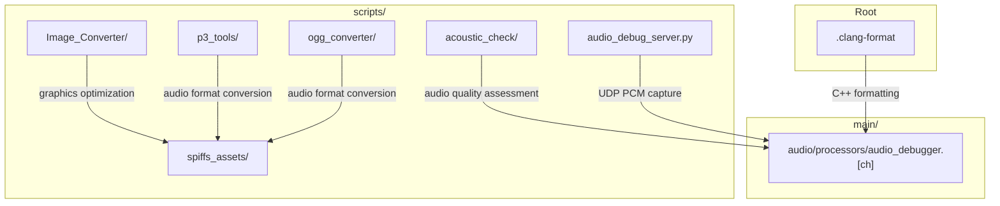
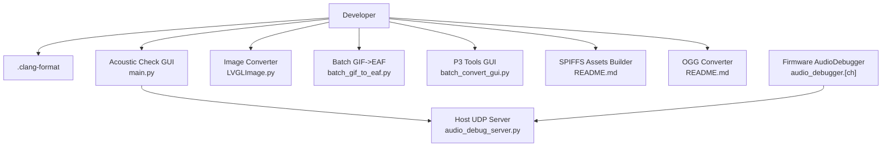
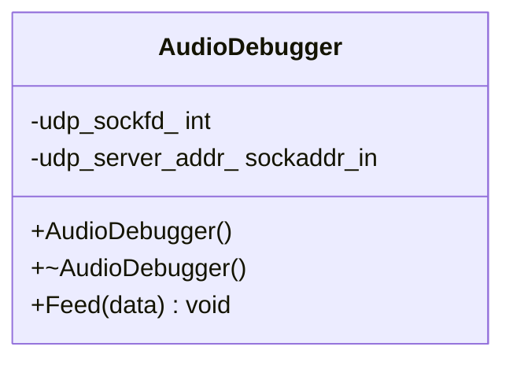
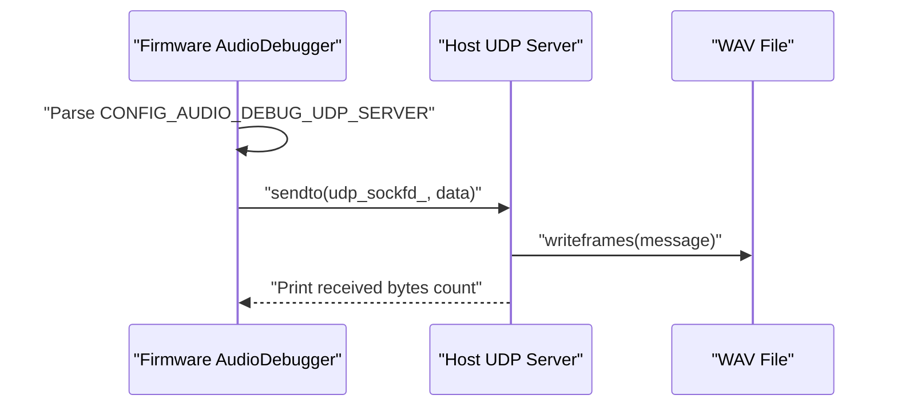
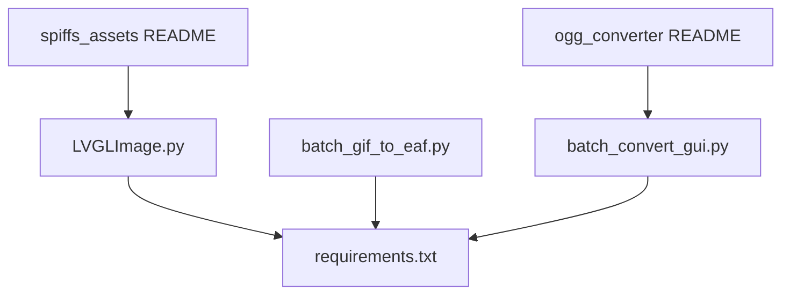

# Code Quality and Formatting

<cite>
**Referenced Files in This Document**
- [.clang-format](file://.clang-format)
- [scripts/acoustic_check/readme.md](file://scripts/acoustic_check/readme.md)
- [scripts/acoustic_check/main.py](file://scripts/acoustic_check/main.py)
- [scripts/Image_Converter/README.md](file://scripts/Image_Converter/README.md)
- [scripts/Image_Converter/LVGLImage.py](file://scripts/Image_Converter/LVGLImage.py)
- [scripts/Image_Converter/batch_gif_to_eaf.py](file://scripts/Image_Converter/batch_gif_to_eaf.py)
- [scripts/p3_tools/requirements.txt](file://scripts/p3_tools/requirements.txt)
- [scripts/p3_tools/batch_convert_gui.py](file://scripts/p3_tools/batch_convert_gui.py)
- [scripts/spiffs_assets/README.md](file://scripts/spiffs_assets/README.md)
- [scripts/ogg_converter/README.md](file://scripts/ogg_converter/README.md)
- [scripts/audio_debug_server.py](file://scripts/audio_debug_server.py)
- [main/audio/processors/audio_debugger.h](file://main/audio/processors/audio_debugger.h)
- [main/audio/processors/audio_debugger.cc](file://main/audio/processors/audio_debugger.cc)
</cite>

## Table of Contents
1. [Introduction](#introduction)
2. [Project Structure](#project-structure)
3. [Core Components](#core-components)
4. [Architecture Overview](#architecture-overview)
5. [Detailed Component Analysis](#detailed-component-analysis)
6. [Dependency Analysis](#dependency-analysis)
7. [Performance Considerations](#performance-considerations)
8. [Troubleshooting Guide](#troubleshooting-guide)
9. [Conclusion](#conclusion)
10. [Appendices](#appendices)

## Introduction
This document defines the code quality and formatting standards for the project, focusing on development consistency, automated checking, and maintenance procedures. It explains the clang-format configuration for C++ code style enforcement, documents acoustic analysis tools for audio quality assessment, image conversion utilities for graphics optimization, and Python-based development helpers. It also covers linting procedures, static analysis integration, continuous improvement workflows, debugging aids, profiling tools, and performance analysis utilities. Practical examples demonstrate how to extend formatting rules, add new quality checks, and integrate tools into development workflows.

## Project Structure
The repository organizes quality-related tooling under the scripts directory and core C++ formatting in the root configuration. The main application code resides under main/, with audio debugging and processor utilities integrated into the firmware build.

**Diagram sources**
- [.clang-format](file://.clang-format)
- [scripts/acoustic_check/main.py](file://scripts/acoustic_check/main.py)
- [scripts/Image_Converter/LVGLImage.py](file://scripts/Image_Converter/LVGLImage.py)
- [scripts/p3_tools/batch_convert_gui.py](file://scripts/p3_tools/batch_convert_gui.py)
- [scripts/spiffs_assets/README.md](file://scripts/spiffs_assets/README.md)
- [scripts/ogg_converter/README.md](file://scripts/ogg_converter/README.md)
- [scripts/audio_debug_server.py](file://scripts/audio_debug_server.py)
- [main/audio/processors/audio_debugger.h](file://main/audio/processors/audio_debugger.h)
- [main/audio/processors/audio_debugger.cc](file://main/audio/processors/audio_debugger.cc)

**Section sources**
- [.clang-format](file://.clang-format)
- [scripts/Image_Converter/README.md](file://scripts/Image_Converter/README.md)
- [scripts/spiffs_assets/README.md](file://scripts/spiffs_assets/README.md)
- [scripts/ogg_converter/README.md](file://scripts/ogg_converter/README.md)

## Core Components
- C++ formatting with clang-format: Enforces Google-style rules with project-specific overrides for indentation, spacing, includes, and comments.
- Acoustic analysis tools: Real-time audio monitoring, plotting, and AFSK decoding for soundwave transmission testing.
- Image conversion utilities: LVGL image conversion and batch GIF-to-EAF conversion for embedded graphics optimization.
- Python-based development helpers: Audio format conversion, SPIFFS asset packaging, and OGG conversion tools.
- Audio debugging pipeline: Firmware-side UDP audio sender and host-side UDP receiver for real-time inspection.

**Section sources**
- [.clang-format](file://.clang-format)
- [scripts/acoustic_check/readme.md](file://scripts/acoustic_check/readme.md)
- [scripts/Image_Converter/README.md](file://scripts/Image_Converter/README.md)
- [scripts/Image_Converter/batch_gif_to_eaf.py](file://scripts/Image_Converter/batch_gif_to_eaf.py)
- [scripts/p3_tools/requirements.txt](file://scripts/p3_tools/requirements.txt)
- [scripts/spiffs_assets/README.md](file://scripts/spiffs_assets/README.md)
- [scripts/ogg_converter/README.md](file://scripts/ogg_converter/README.md)
- [scripts/audio_debug_server.py](file://scripts/audio_debug_server.py)
- [main/audio/processors/audio_debugger.h](file://main/audio/processors/audio_debugger.h)
- [main/audio/processors/audio_debugger.cc](file://main/audio/processors/audio_debugger.cc)

## Architecture Overview
The quality toolchain integrates host-side Python utilities with firmware components to ensure consistent code style, optimized assets, and reliable audio behavior during development and CI.

**Diagram sources**
- [.clang-format](file://.clang-format)
- [scripts/acoustic_check/main.py](file://scripts/acoustic_check/main.py)
- [scripts/Image_Converter/LVGLImage.py](file://scripts/Image_Converter/LVGLImage.py)
- [scripts/Image_Converter/batch_gif_to_eaf.py](file://scripts/Image_Converter/batch_gif_to_eaf.py)
- [scripts/p3_tools/batch_convert_gui.py](file://scripts/p3_tools/batch_convert_gui.py)
- [scripts/spiffs_assets/README.md](file://scripts/spiffs_assets/README.md)
- [scripts/ogg_converter/README.md](file://scripts/ogg_converter/README.md)
- [scripts/audio_debug_server.py](file://scripts/audio_debug_server.py)
- [main/audio/processors/audio_debugger.h](file://main/audio/processors/audio_debugger.h)
- [main/audio/processors/audio_debugger.cc](file://main/audio/processors/audio_debugger.cc)

## Detailed Component Analysis

### C++ Formatting with clang-format
The project uses a YAML-formatted clang-format configuration to enforce consistent C++ style across the codebase. Key aspects include:
- Style basis: Google style with project-specific adjustments.
- Indentation: 4 spaces for indentation and continuation, with tab width set to 4.
- Includes: Sorted and grouped by categories for clarity and reproducibility.
- Comments: Trailing comments aligned, reflow enabled, and pragmas recognized.
- Braces: Attached style with controlled wrapping behavior.
- Line length: Column limit set to 100 characters.
- Function and template declarations: Always broken after return type and template declarations.
- Spaces: Carefully tuned around operators, parentheses, and container literals.

Recommended extension steps:
- Add a pre-commit hook to auto-format staged files.
- Integrate a CI job to check formatting compliance and fail builds on violations.
- Document naming conventions in comments and enforce via static analysis rules.

**Section sources**
- [.clang-format](file://.clang-format)

### Acoustic Analysis Tools
The acoustic check suite provides a Qt-based GUI for real-time audio visualization and AFSK decoding, plus a README documenting device compatibility and testing outcomes.

Key capabilities:
- Real-time plotting of time-domain and frequency-domain audio received via UDP.
- AFSK ASCII decoding for verifying transmission accuracy.
- Device-specific test results and notes for ADC/MIC configurations.

Integration guidance:
- Enable firmware-side audio debugging and configure the UDP server address.
- Run the GUI and connect to the firmware to inspect live audio streams.
- Use the recorded WAV files for offline analysis and noise characterization.

**Section sources**
- [scripts/acoustic_check/readme.md](file://scripts/acoustic_check/readme.md)
- [scripts/acoustic_check/main.py](file://scripts/acoustic_check/main.py)

### Image Conversion Utilities
The Image Converter package offers:
- LVGLImage.py: A robust library for converting images to LVGL-compatible formats, supporting multiple color formats, compression methods, and palette handling.
- batch_gif_to_eaf.py: A batch converter leveraging Espressif’s online service to transform GIF animations into EAF format for embedded playback.

Optimization highlights:
- Automatic selection of optimal color formats.
- Support for indexed palettes, alpha channels, and various bit depths.
- Batch processing with progress and rate-limiting safeguards.

**Section sources**
- [scripts/Image_Converter/README.md](file://scripts/Image_Converter/README.md)
- [scripts/Image_Converter/LVGLImage.py](file://scripts/Image_Converter/LVGLImage.py)
- [scripts/Image_Converter/batch_gif_to_eaf.py](file://scripts/Image_Converter/batch_gif_to_eaf.py)

### Python-Based Development Helpers
- p3_tools: A GUI for OPUS-based audio conversion with loudness normalization and batch processing.
- spiffs_assets: A builder for packaging fonts, emojis, and wake word models into a SPIFFS-ready assets.bin.
- ogg_converter: A batch OGG conversion tool with FFmpeg integration and optional loudness adjustments.

Workflow examples:
- Use the P3 GUI to normalize and convert audio assets for consistent loudness.
- Package resources with the SPIFFS builder for firmware deployment.
- Convert audio assets to OGG using the OGG converter with FFmpeg.

**Section sources**
- [scripts/p3_tools/requirements.txt](file://scripts/p3_tools/requirements.txt)
- [scripts/p3_tools/batch_convert_gui.py](file://scripts/p3_tools/batch_convert_gui.py)
- [scripts/spiffs_assets/README.md](file://scripts/spiffs_assets/README.md)
- [scripts/ogg_converter/README.md](file://scripts/ogg_converter/README.md)

### Audio Debugging Pipeline
The firmware provides an AudioDebugger class that sends PCM frames over UDP to a host-side server for inspection and recording.

**Diagram sources**
- [main/audio/processors/audio_debugger.h](file://main/audio/processors/audio_debugger.h)
- [main/audio/processors/audio_debugger.cc](file://main/audio/processors/audio_debugger.cc)

**Diagram sources**
- [main/audio/processors/audio_debugger.cc](file://main/audio/processors/audio_debugger.cc)
- [scripts/audio_debug_server.py](file://scripts/audio_debug_server.py)

**Section sources**
- [main/audio/processors/audio_debugger.h](file://main/audio/processors/audio_debugger.h)
- [main/audio/processors/audio_debugger.cc](file://main/audio/processors/audio_debugger.cc)
- [scripts/audio_debug_server.py](file://scripts/audio_debug_server.py)

## Dependency Analysis
Quality tooling relies on external libraries and services:
- LVGLImage.py depends on pypng and lz4 for image processing and compression.
- batch_gif_to_eaf.py uses requests to communicate with Espressif’s online conversion service.
- p3_tools requires librosa, opuslib, numpy, and related audio libraries.
- spiffs_assets and ogg_converter depend on Python scripts and external tools (e.g., FFmpeg).

**Diagram sources**
- [scripts/Image_Converter/LVGLImage.py](file://scripts/Image_Converter/LVGLImage.py)
- [scripts/Image_Converter/batch_gif_to_eaf.py](file://scripts/Image_Converter/batch_gif_to_eaf.py)
- [scripts/p3_tools/requirements.txt](file://scripts/p3_tools/requirements.txt)
- [scripts/spiffs_assets/README.md](file://scripts/spiffs_assets/README.md)
- [scripts/ogg_converter/README.md](file://scripts/ogg_converter/README.md)

**Section sources**
- [scripts/Image_Converter/LVGLImage.py](file://scripts/Image_Converter/LVGLImage.py)
- [scripts/Image_Converter/batch_gif_to_eaf.py](file://scripts/Image_Converter/batch_gif_to_eaf.py)
- [scripts/p3_tools/requirements.txt](file://scripts/p3_tools/requirements.txt)
- [scripts/spiffs_assets/README.md](file://scripts/spiffs_assets/README.md)
- [scripts/ogg_converter/README.md](file://scripts/ogg_converter/README.md)

## Performance Considerations
- Formatting: clang-format reduces cognitive load and improves readability, indirectly aiding maintainability and reducing merge conflicts.
- Image conversion: Choose appropriate color formats and compression methods to balance fidelity and memory footprint.
- Audio debugging: UDP streaming introduces network overhead; ensure low latency and sufficient buffer sizes for real-time inspection.
- Batch tools: Use rate limiting and progress indicators to manage long-running conversions efficiently.

[No sources needed since this section provides general guidance]

## Troubleshooting Guide
Common issues and resolutions:
- clang-format not applied:
  - Ensure the editor plugin is configured to use the project’s .clang-format.
  - Run the formatter on staged files before committing.
- LVGL conversion failures:
  - Verify pypng and lz4 are installed; confirm input image formats and color modes are supported.
- GIF-to-EAF conversion errors:
  - Check network connectivity to the Espressif service; retry with smaller batches and enable debug mode.
- P3 conversion issues:
  - Confirm FFmpeg availability and correct codec support; validate target LUFS settings.
- SPIFFS packaging problems:
  - Validate resource paths and ensure all required assets are present; review generated index and config files.
- Audio debugging:
  - Confirm firmware configuration for the UDP server address and that the host UDP server is listening on the expected port.

**Section sources**
- [scripts/Image_Converter/LVGLImage.py](file://scripts/Image_Converter/LVGLImage.py)
- [scripts/Image_Converter/batch_gif_to_eaf.py](file://scripts/Image_Converter/batch_gif_to_eaf.py)
- [scripts/p3_tools/requirements.txt](file://scripts/p3_tools/requirements.txt)
- [scripts/spiffs_assets/README.md](file://scripts/spiffs_assets/README.md)
- [scripts/ogg_converter/README.md](file://scripts/ogg_converter/README.md)
- [scripts/audio_debug_server.py](file://scripts/audio_debug_server.py)
- [main/audio/processors/audio_debugger.cc](file://main/audio/processors/audio_debugger.cc)

## Conclusion
The project’s quality toolchain combines standardized C++ formatting, robust image and audio conversion utilities, and a practical audio debugging pipeline. Integrating these tools into development workflows ensures consistent code quality, optimized assets, and reliable audio behavior. Extending the toolset—such as adding new formatting rules, linting checks, and CI integrations—will further strengthen the development process.

[No sources needed since this section summarizes without analyzing specific files]

## Appendices

### Extending Formatting Rules
- Add new style preferences in .clang-format and document rationale.
- Configure pre-commit hooks to enforce formatting automatically.
- Include a CI step to validate formatting and report diffs.

**Section sources**
- [.clang-format](file://.clang-format)

### Adding New Quality Checks
- Static analysis: Integrate a linter or analyzer for C++ and Python.
- Unit tests: Add test coverage for conversion utilities and asset builders.
- Regression tests: Include acoustic and image conversion validation in CI.

[No sources needed since this section provides general guidance]

### Integrating Tools into Workflows
- Pre-commit: Run clang-format and basic Python checks.
- CI: Validate formatting, run conversion utilities, and package assets.
- Release: Automate asset generation and firmware packaging.

[No sources needed since this section provides general guidance]