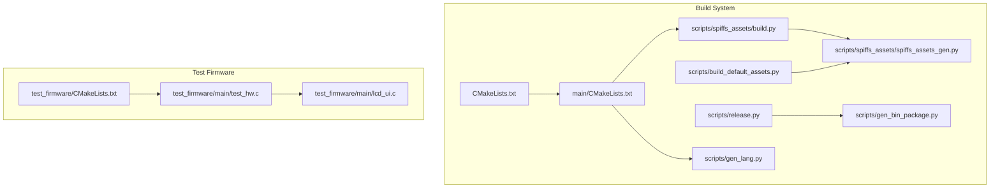
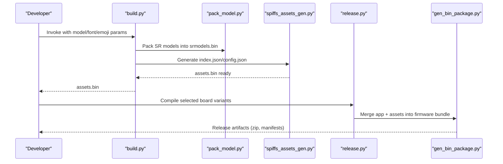
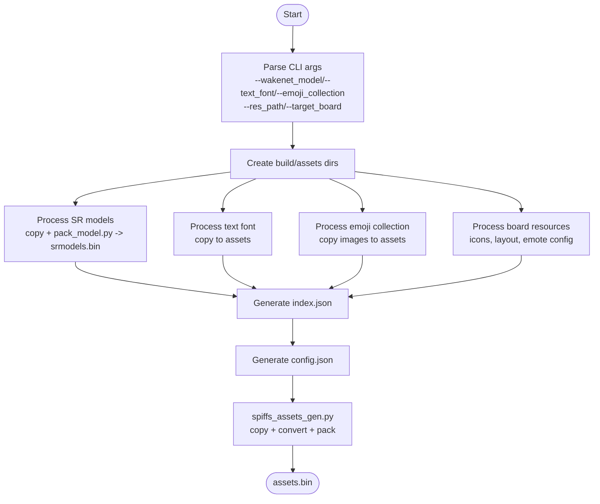
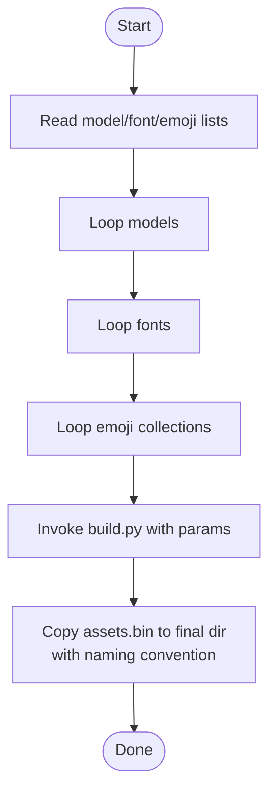
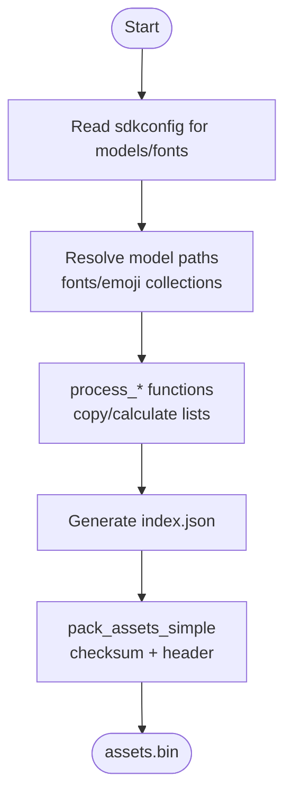
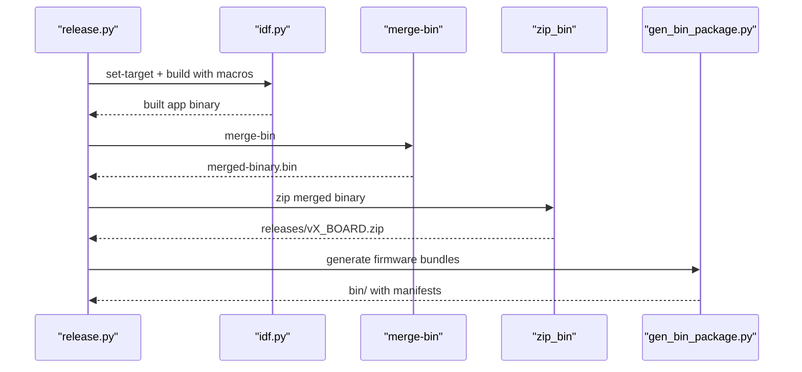
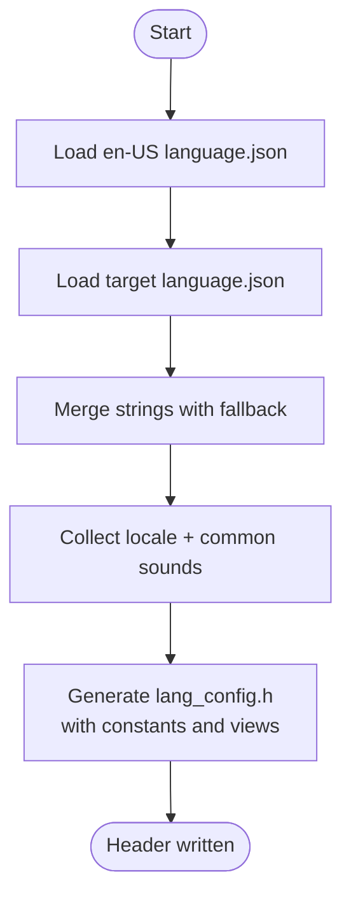
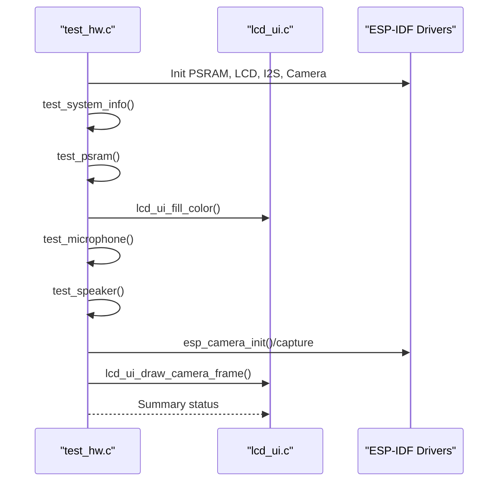
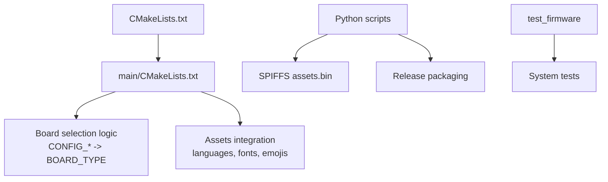

# Development Tools and Build System

<cite>
**Referenced Files in This Document**
- [CMakeLists.txt](file://CMakeLists.txt)
- [main/CMakeLists.txt](file://main/CMakeLists.txt)
- [scripts/spiffs_assets/build.py](file://scripts/spiffs_assets/build.py)
- [scripts/spiffs_assets/build_all.py](file://scripts/spiffs_assets/build_all.py)
- [scripts/spiffs_assets/pack_model.py](file://scripts/spiffs_assets/pack_model.py)
- [scripts/spiffs_assets/spiffs_assets_gen.py](file://scripts/spiffs_assets/spiffs_assets_gen.py)
- [scripts/build_default_assets.py](file://scripts/build_default_assets.py)
- [scripts/release.py](file://scripts/release.py)
- [scripts/gen_bin_package.py](file://scripts/gen_bin_package.py)
- [scripts/gen_lang.py](file://scripts/gen_lang.py)
- [test_firmware/main/test_hw.c](file://test_firmware/main/test_hw.c)
- [test_firmware/main/lcd_ui.c](file://test_firmware/main/lcd_ui.c)
- [test_firmware/CMakeLists.txt](file://test_firmware/CMakeLists.txt)
- [.clang-format](file://.clang-format)
</cite>

## Table of Contents
1. [Introduction](#introduction)
2. [Project Structure](#project-structure)
3. [Core Components](#core-components)
4. [Architecture Overview](#architecture-overview)
5. [Detailed Component Analysis](#detailed-component-analysis)
6. [Dependency Analysis](#dependency-analysis)
7. [Performance Considerations](#performance-considerations)
8. [Troubleshooting Guide](#troubleshooting-guide)
9. [Conclusion](#conclusion)
10. [Appendices](#appendices)

## Introduction
This document describes the development tools and build system for automation, asset generation, and testing frameworks. It covers Python-based build scripts for asset packaging, OTA release preparation, and SPIFFS asset management including batch conversion, model packaging, and resource optimization. It also documents the hardware validation firmware, unit and integration testing procedures, continuous integration setup, automated build pipelines, deployment workflows, code formatting standards, linting procedures, quality assurance processes, debugging tools, profiling techniques, and performance analysis methods. Finally, it provides examples for extending the build system, adding new asset types, and integrating custom development workflows.

## Project Structure
The project is organized around an ESP-IDF-based firmware with a dedicated scripts directory for build automation, SPIFFS asset management, and release packaging. The test_firmware directory provides hardware validation firmware for board-level testing. Key areas:
- Scripts for asset packaging and SPIFFS generation
- Release packaging and OTA preparation
- Language resource generation
- Hardware test firmware and UI
- Build configuration and board selection logic

**Diagram sources**
- [CMakeLists.txt:1-14](file://CMakeLists.txt#L1-L14)
- [main/CMakeLists.txt:1-800](file://main/CMakeLists.txt#L1-L800)
- [scripts/spiffs_assets/build.py:1-385](file://scripts/spiffs_assets/build.py#L1-L385)
- [scripts/spiffs_assets/spiffs_assets_gen.py:1-648](file://scripts/spiffs_assets/spiffs_assets_gen.py#L1-L648)
- [scripts/build_default_assets.py:1-935](file://scripts/build_default_assets.py#L1-L935)
- [scripts/release.py:1-360](file://scripts/release.py#L1-L360)
- [scripts/gen_bin_package.py:1-177](file://scripts/gen_bin_package.py#L1-L177)
- [scripts/gen_lang.py:1-187](file://scripts/gen_lang.py#L1-L187)
- [test_firmware/CMakeLists.txt:1-8](file://test_firmware/CMakeLists.txt#L1-L8)
- [test_firmware/main/test_hw.c:1-1119](file://test_firmware/main/test_hw.c#L1-L1119)
- [test_firmware/main/lcd_ui.c:1-340](file://test_firmware/main/lcd_ui.c#L1-L340)

**Section sources**
- [CMakeLists.txt:1-14](file://CMakeLists.txt#L1-L14)
- [main/CMakeLists.txt:1-800](file://main/CMakeLists.txt#L1-L800)

## Core Components
- SPIFFS Asset Packaging Pipeline: Orchestrated by build.py and spiffs_assets_gen.py, supporting model packing, image conversion, and final assets.bin generation.
- Batch Asset Generation: build_all.py automates building multiple asset variants for different model and font combinations.
- Default Assets Builder: build_default_assets.py integrates SDK configuration to produce assets.bin tailored to the current board.
- Release and OTA Packaging: release.py compiles variants, merges binaries, and packages releases; gen_bin_package.py creates firmware bundles with manifests.
- Language Resource Generator: gen_lang.py merges locale JSON and generates C++ headers with fallback logic.
- Hardware Validation Firmware: test_hw.c and lcd_ui.c provide board-level tests for system info, PSRAM, LCD, microphone, speaker, camera, and UI rendering.

**Section sources**
- [scripts/spiffs_assets/build.py:1-385](file://scripts/spiffs_assets/build.py#L1-L385)
- [scripts/spiffs_assets/spiffs_assets_gen.py:1-648](file://scripts/spiffs_assets/spiffs_assets_gen.py#L1-L648)
- [scripts/spiffs_assets/build_all.py:1-149](file://scripts/spiffs_assets/build_all.py#L1-L149)
- [scripts/build_default_assets.py:1-935](file://scripts/build_default_assets.py#L1-L935)
- [scripts/release.py:1-360](file://scripts/release.py#L1-L360)
- [scripts/gen_bin_package.py:1-177](file://scripts/gen_bin_package.py#L1-L177)
- [scripts/gen_lang.py:1-187](file://scripts/gen_lang.py#L1-L187)
- [test_firmware/main/test_hw.c:1-1119](file://test_firmware/main/test_hw.c#L1-L1119)
- [test_firmware/main/lcd_ui.c:1-340](file://test_firmware/main/lcd_ui.c#L1-L340)

## Architecture Overview
The build system centers on Python scripts that transform source assets into a final SPIFFS image and integrate with ESP-IDF build targets. The release pipeline composes application and assets binaries into deployable packages. The hardware test firmware validates platform capabilities and displays results on the onboard LCD.

**Diagram sources**
- [scripts/spiffs_assets/build.py:1-385](file://scripts/spiffs_assets/build.py#L1-L385)
- [scripts/spiffs_assets/pack_model.py:1-124](file://scripts/spiffs_assets/pack_model.py#L1-L124)
- [scripts/spiffs_assets/spiffs_assets_gen.py:1-648](file://scripts/spiffs_assets/spiffs_assets_gen.py#L1-L648)
- [scripts/release.py:1-360](file://scripts/release.py#L1-L360)
- [scripts/gen_bin_package.py:1-177](file://scripts/gen_bin_package.py#L1-L177)

## Detailed Component Analysis

### SPIFFS Asset Packaging Pipeline
The pipeline processes model, font, emoji, and board-specific resources into a unified assets.bin with metadata and optional image conversion.

**Diagram sources**
- [scripts/spiffs_assets/build.py:1-385](file://scripts/spiffs_assets/build.py#L1-L385)
- [scripts/spiffs_assets/pack_model.py:1-124](file://scripts/spiffs_assets/pack_model.py#L1-L124)
- [scripts/spiffs_assets/spiffs_assets_gen.py:1-648](file://scripts/spiffs_assets/spiffs_assets_gen.py#L1-L648)

Key behaviors:
- Model packing: pack_model.py consolidates model files into a single binary with structured headers.
- Image conversion: spiffs_assets_gen.py supports splitting, QOI conversion, and LVGL raw formats.
- Asset packing: Generates mmap header and checksummed assets.bin with metadata.

**Section sources**
- [scripts/spiffs_assets/build.py:1-385](file://scripts/spiffs_assets/build.py#L1-L385)
- [scripts/spiffs_assets/pack_model.py:1-124](file://scripts/spiffs_assets/pack_model.py#L1-L124)
- [scripts/spiffs_assets/spiffs_assets_gen.py:1-648](file://scripts/spiffs_assets/spiffs_assets_gen.py#L1-L648)

### Batch Asset Generation
Automates building multiple asset variants by iterating over model, font, and emoji combinations.

**Diagram sources**
- [scripts/spiffs_assets/build_all.py:1-149](file://scripts/spiffs_assets/build_all.py#L1-L149)

**Section sources**
- [scripts/spiffs_assets/build_all.py:1-149](file://scripts/spiffs_assets/build_all.py#L1-L149)

### Default Assets Builder
Integrates SDK configuration to build assets.bin tailored to the current board, including wake word models, fonts, and emoji collections.

**Diagram sources**
- [scripts/build_default_assets.py:1-935](file://scripts/build_default_assets.py#L1-L935)

**Section sources**
- [scripts/build_default_assets.py:1-935](file://scripts/build_default_assets.py#L1-L935)

### Release and OTA Packaging
Release pipeline compiles board variants, merges binaries, and packages releases with versioned archives and manifests.

**Diagram sources**
- [scripts/release.py:1-360](file://scripts/release.py#L1-L360)
- [scripts/gen_bin_package.py:1-177](file://scripts/gen_bin_package.py#L1-L177)

**Section sources**
- [scripts/release.py:1-360](file://scripts/release.py#L1-L360)
- [scripts/gen_bin_package.py:1-177](file://scripts/gen_bin_package.py#L1-L177)

### Language Resource Generation
Generates C++ headers with string and audio resource constants, merging locale data with en-US fallback.

**Diagram sources**
- [scripts/gen_lang.py:1-187](file://scripts/gen_lang.py#L1-L187)

**Section sources**
- [scripts/gen_lang.py:1-187](file://scripts/gen_lang.py#L1-L187)

### Hardware Validation Firmware
Provides automated tests for system info, PSRAM, LCD, microphone, speaker, and camera, displaying results on the onboard LCD.

**Diagram sources**
- [test_firmware/main/test_hw.c:1-1119](file://test_firmware/main/test_hw.c#L1-L1119)
- [test_firmware/main/lcd_ui.c:1-340](file://test_firmware/main/lcd_ui.c#L1-L340)

**Section sources**
- [test_firmware/main/test_hw.c:1-1119](file://test_firmware/main/test_hw.c#L1-L1119)
- [test_firmware/main/lcd_ui.c:1-340](file://test_firmware/main/lcd_ui.c#L1-L340)

## Dependency Analysis
The build system relies on ESP-IDF CMake integration and Python scripts for asset processing. Board selection logic in main/CMakeLists.txt dynamically includes board-specific sources and sets defaults. The hardware test firmware targets ESP32-S3 and uses ESP-IDF drivers for peripherals.

**Diagram sources**
- [CMakeLists.txt:1-14](file://CMakeLists.txt#L1-L14)
- [main/CMakeLists.txt:1-800](file://main/CMakeLists.txt#L1-L800)
- [scripts/spiffs_assets/build.py:1-385](file://scripts/spiffs_assets/build.py#L1-L385)
- [scripts/release.py:1-360](file://scripts/release.py#L1-L360)
- [test_firmware/CMakeLists.txt:1-8](file://test_firmware/CMakeLists.txt#L1-L8)

**Section sources**
- [CMakeLists.txt:1-14](file://CMakeLists.txt#L1-L14)
- [main/CMakeLists.txt:1-800](file://main/CMakeLists.txt#L1-L800)
- [test_firmware/CMakeLists.txt:1-8](file://test_firmware/CMakeLists.txt#L1-L8)

## Performance Considerations
- Image conversion and packing: Use split_height and QOI conversion to reduce memory footprint and optimize runtime access.
- Asset size monitoring: spiffs_assets_gen.py compares total assets against partition size and warns on overflow.
- Model packing: pack_model.py consolidates multiple model files into a single binary to minimize filesystem overhead.
- Memory allocation: Hardware tests allocate buffers carefully and report sizes to ensure adequate PSRAM availability.

[No sources needed since this section provides general guidance]

## Troubleshooting Guide
Common issues and resolutions:
- Missing source files or directories: build.py and build_all.py print warnings and skip missing inputs; ensure paths are correct.
- Partition size exceeded: spiffs_assets_gen.py checks partition size and exits with an error if exceeded; increase partition size or reduce assets.
- SDK configuration parsing: build_default_assets.py reads sdkconfig for model and font selection; verify CONFIG_* entries.
- Release packaging failures: release.py invokes idf.py commands; ensure toolchain and environment are set up correctly.
- Hardware test failures: test_hw.c initializes drivers and reports errors; verify pin configurations and peripheral wiring.

**Section sources**
- [scripts/spiffs_assets/build.py:1-385](file://scripts/spiffs_assets/build.py#L1-L385)
- [scripts/spiffs_assets/spiffs_assets_gen.py:1-648](file://scripts/spiffs_assets/spiffs_assets_gen.py#L1-L648)
- [scripts/build_default_assets.py:1-935](file://scripts/build_default_assets.py#L1-L935)
- [scripts/release.py:1-360](file://scripts/release.py#L1-L360)
- [test_firmware/main/test_hw.c:1-1119](file://test_firmware/main/test_hw.c#L1-L1119)

## Conclusion
The build system provides a robust, automated pipeline for asset generation, model packaging, and release preparation. The hardware validation firmware ensures platform readiness across boards. By leveraging Python scripts, ESP-IDF integration, and standardized manifests, teams can reliably produce firmware bundles and maintain consistent quality across variants.

[No sources needed since this section summarizes without analyzing specific files]

## Appendices

### Continuous Integration Setup
- Use idf.py set-target and build with macros to compile board variants.
- Automate release packaging with release.py and gen_bin_package.py to produce zipped releases and manifests.
- Integrate hardware test firmware into CI to validate platform capabilities on target devices.

**Section sources**
- [scripts/release.py:1-360](file://scripts/release.py#L1-L360)
- [scripts/gen_bin_package.py:1-177](file://scripts/gen_bin_package.py#L1-L177)
- [test_firmware/CMakeLists.txt:1-8](file://test_firmware/CMakeLists.txt#L1-L8)

### Code Formatting and Quality Assurance
- Code formatting: Use .clang-format for consistent C/C++ formatting across the project.
- Quality checks: Integrate static analysis and linting in CI to enforce style and detect issues early.

**Section sources**
- [.clang-format](file://.clang-format)

### Extending the Build System
- Adding new asset types: Extend build.py and spiffs_assets_gen.py to recognize new file extensions and conversion steps.
- Integrating custom workflows: Add new Python scripts to the scripts/ directory and invoke them from main/CMakeLists.txt or CI pipelines.

[No sources needed since this section provides general guidance]