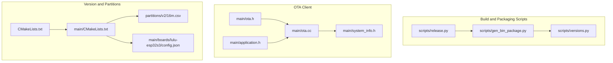
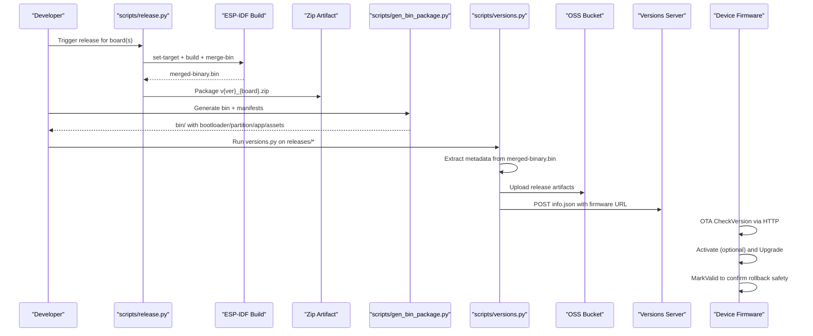
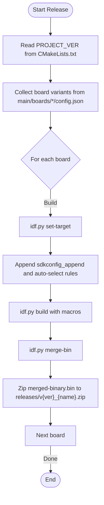
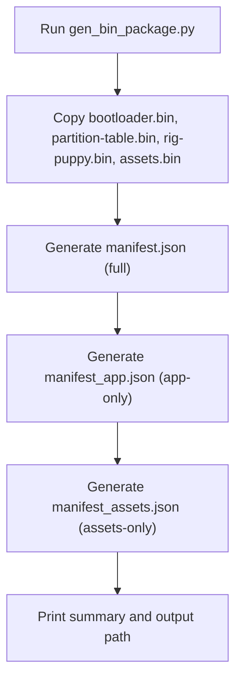
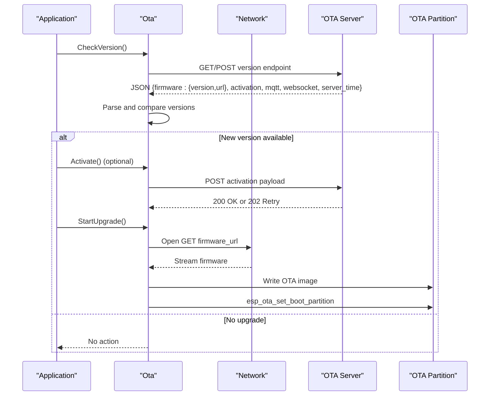
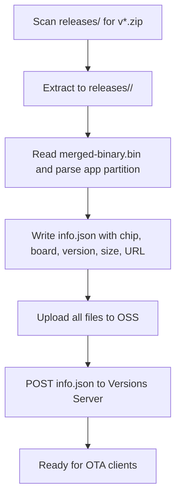
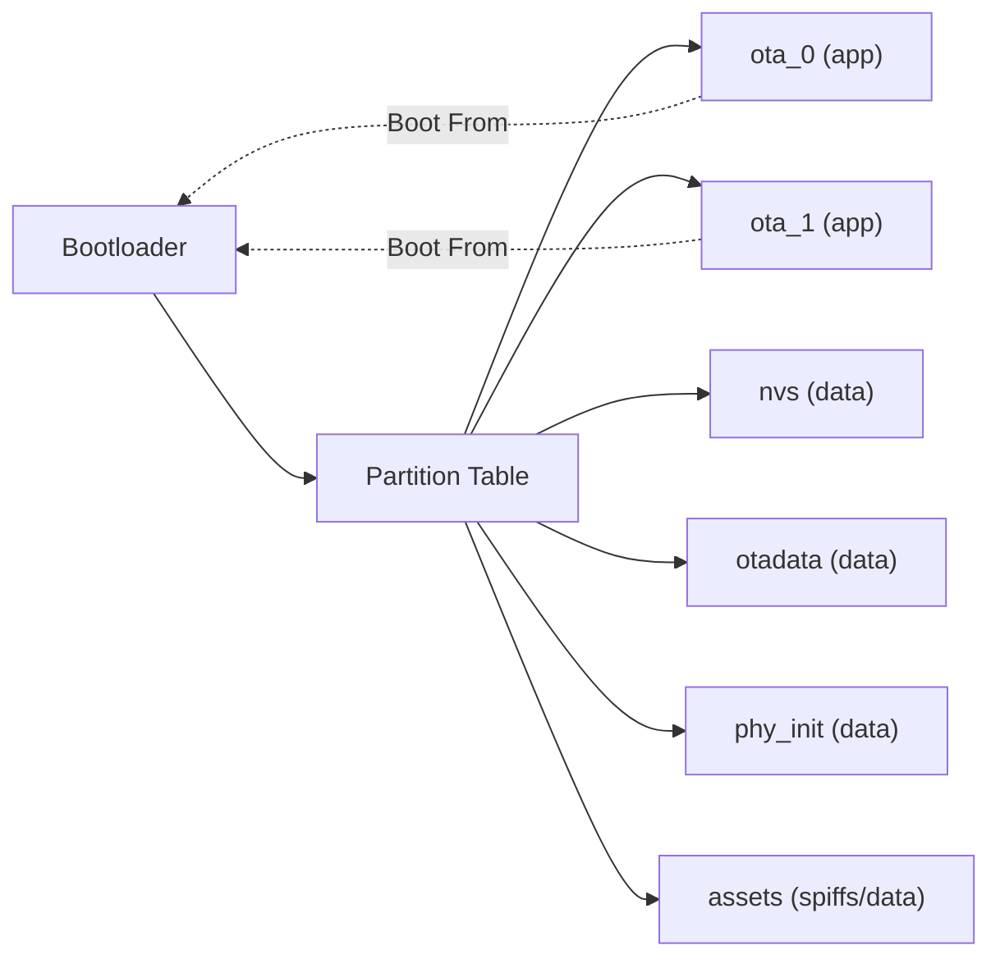
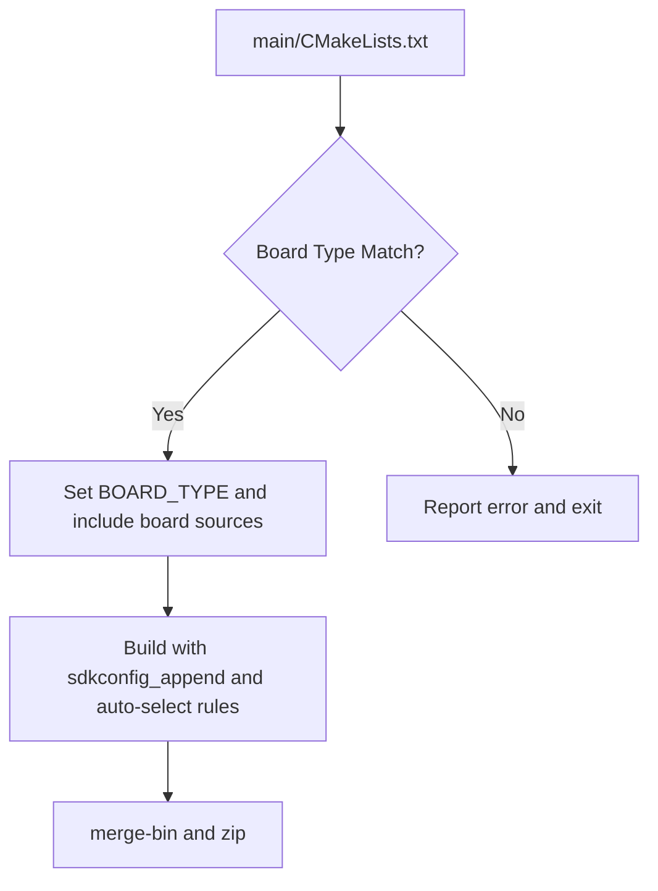
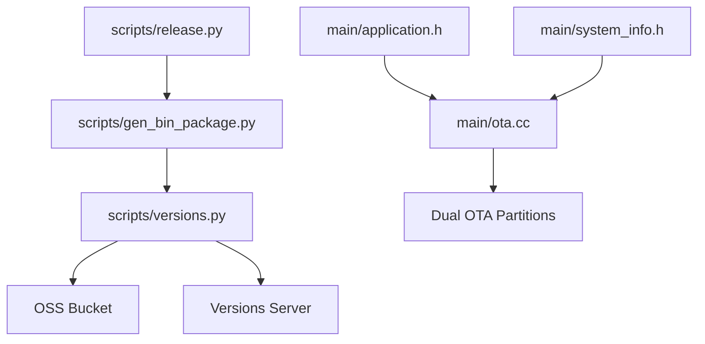

# Release and Deployment

<cite>
**Referenced Files in This Document**
- [release.py](file://scripts/release.py)
- [gen_bin_package.py](file://scripts/gen_bin_package.py)
- [versions.py](file://scripts/versions.py)
- [ota.h](file://main/ota.h)
- [ota.cc](file://main/ota.cc)
- [CMakeLists.txt](file://CMakeLists.txt)
- [main/CMakeLists.txt](file://main/CMakeLists.txt)
- [system_info.h](file://main/system_info.h)
- [application.h](file://main/application.h)
- [16m.csv](file://partitions/v2/16m.csv)
- [lulu-esp32s3/config.json](file://main/boards/lulu-esp32s3/config.json)
</cite>

## Table of Contents
1. [Introduction](#introduction)
2. [Project Structure](#project-structure)
3. [Core Components](#core-components)
4. [Architecture Overview](#architecture-overview)
5. [Detailed Component Analysis](#detailed-component-analysis)
6. [Dependency Analysis](#dependency-analysis)
7. [Performance Considerations](#performance-considerations)
8. [Troubleshooting Guide](#troubleshooting-guide)
9. [Conclusion](#conclusion)
10. [Appendices](#appendices)

## Introduction
This document explains the firmware release management and deployment automation for the project, covering:
- Firmware packaging and version control
- OTA update mechanism, rollback, and staged rollout strategies
- Distribution channels and artifact management
- Security considerations and integrity verification
- Large-scale device deployment and monitoring
- Practical examples for customizing workflows and handling emergency updates

It synthesizes the repository’s build and release scripts, OTA client implementation, and partition layout to provide a complete picture of the release pipeline from build completion to device deployment.

## Project Structure
The release and deployment system spans several areas:
- Build and packaging scripts under scripts/
- OTA client implementation under main/
- Version and partition metadata under root and partitions/

**Diagram sources**
- [release.py:1-360](file://scripts/release.py#L1-L360)
- [gen_bin_package.py:1-177](file://scripts/gen_bin_package.py#L1-L177)
- [versions.py:1-250](file://scripts/versions.py#L1-L250)
- [ota.h:1-59](file://main/ota.h#L1-L59)
- [ota.cc:1-493](file://main/ota.cc#L1-L493)
- [system_info.h:1-25](file://main/system_info.h#L1-L25)
- [application.h:1-195](file://main/application.h#L1-L195)
- [CMakeLists.txt:1-14](file://CMakeLists.txt#L1-L14)
- [main/CMakeLists.txt:1-1121](file://main/CMakeLists.txt#L1-L1121)
- [16m.csv:1-9](file://partitions/v2/16m.csv#L1-L9)
- [lulu-esp32s3/config.json:1-8](file://main/boards/lulu-esp32s3/config.json#L1-L8)

**Section sources**
- [release.py:1-360](file://scripts/release.py#L1-L360)
- [gen_bin_package.py:1-177](file://scripts/gen_bin_package.py#L1-L177)
- [versions.py:1-250](file://scripts/versions.py#L1-L250)
- [ota.h:1-59](file://main/ota.h#L1-L59)
- [ota.cc:1-493](file://main/ota.cc#L1-L493)
- [system_info.h:1-25](file://main/system_info.h#L1-L25)
- [application.h:1-195](file://main/application.h#L1-L195)
- [CMakeLists.txt:1-14](file://CMakeLists.txt#L1-L14)
- [main/CMakeLists.txt:1-1121](file://main/CMakeLists.txt#L1-L1121)
- [16m.csv:1-9](file://partitions/v2/16m.csv#L1-L9)
- [lulu-esp32s3/config.json:1-8](file://main/boards/lulu-esp32s3/config.json#L1-L8)

## Core Components
- Release packaging and board variant orchestration
- Binary packaging and manifest generation
- OTA client with version checking, activation, and upgrade
- Version extraction and artifact upload
- Partition layout enabling dual-app OTA

Key responsibilities:
- scripts/release.py: Compiles per-board variants, merges binaries, and zips artifacts with versioned filenames.
- scripts/gen_bin_package.py: Copies partition images and generates manifests for full, app-only, and assets-only flashing.
- main/ota.*: Implements version check, activation handshake, OTA upgrade, and rollback marking.
- scripts/versions.py: Reads merged binaries, extracts app metadata, uploads to OSS, and posts to a server.
- partitions/v2/16m.csv: Defines dual-app OTA partitions for safe rollback.
- CMakeLists.txt and main/CMakeLists.txt: Provide project version and board selection logic.

**Section sources**
- [release.py:219-297](file://scripts/release.py#L219-L297)
- [gen_bin_package.py:51-116](file://scripts/gen_bin_package.py#L51-L116)
- [ota.cc:77-244](file://main/ota.cc#L77-L244)
- [versions.py:98-159](file://scripts/versions.py#L98-L159)
- [16m.csv:1-9](file://partitions/v2/16m.csv#L1-L9)
- [CMakeLists.txt:12-12](file://CMakeLists.txt#L12-L12)
- [main/CMakeLists.txt:88-726](file://main/CMakeLists.txt#L88-L726)

## Architecture Overview
The release pipeline integrates local build automation with remote distribution and device-side OTA.

**Diagram sources**
- [release.py:219-297](file://scripts/release.py#L219-L297)
- [gen_bin_package.py:140-176](file://scripts/gen_bin_package.py#L140-L176)
- [versions.py:223-246](file://scripts/versions.py#L223-L246)
- [ota.cc:77-244](file://main/ota.cc#L77-L244)
- [ota.cc:267-387](file://main/ota.cc#L267-L387)
- [ota.cc:247-265](file://main/ota.cc#L247-L265)

## Detailed Component Analysis

### Firmware Packaging and Version Control
- Version sourcing: The project version is defined in the root CMakeLists and propagated to the build system.
- Board variants: scripts/release.py enumerates boards and builds named variants, writing versioned ZIP artifacts.
- Binary merging: The build produces a merged binary suitable for flashing; packaging scripts also generate separate partition images and manifests for flexible distribution.

**Diagram sources**
- [release.py:32-38](file://scripts/release.py#L32-L38)
- [release.py:73-138](file://scripts/release.py#L73-L138)
- [release.py:219-297](file://scripts/release.py#L219-L297)
- [CMakeLists.txt:12-12](file://CMakeLists.txt#L12-L12)

**Section sources**
- [release.py:32-38](file://scripts/release.py#L32-L38)
- [release.py:73-138](file://scripts/release.py#L73-L138)
- [release.py:219-297](file://scripts/release.py#L219-L297)
- [CMakeLists.txt:12-12](file://CMakeLists.txt#L12-L12)

### Binary Packaging and Manifest Generation
- The packaging script copies partition images and generates three manifests:
  - Full flash: bootloader + partition table + app + assets
  - App-only: app at offset for delta updates
  - Assets-only: assets SPIFFS partition for resource updates
- This enables staged rollouts and efficient distribution.

**Diagram sources**
- [gen_bin_package.py:51-116](file://scripts/gen_bin_package.py#L51-L116)
- [gen_bin_package.py:140-176](file://scripts/gen_bin_package.py#L140-L176)

**Section sources**
- [gen_bin_package.py:51-116](file://scripts/gen_bin_package.py#L51-L116)
- [gen_bin_package.py:140-176](file://scripts/gen_bin_package.py#L140-L176)

### OTA Update Mechanism
- Version checking: The device queries a server endpoint for firmware metadata, parses JSON, and decides whether to upgrade.
- Activation: Optional activation flow supports device attestation using HMAC when serial number is present.
- Upgrade: Downloads firmware, validates image header, writes OTA partitions sequentially, and sets the boot partition.
- Rollback: Marks current app as valid after successful boot; otherwise, device remains on the previous partition.

**Diagram sources**
- [ota.cc:77-244](file://main/ota.cc#L77-L244)
- [ota.cc:267-387](file://main/ota.cc#L267-L387)
- [ota.cc:458-492](file://main/ota.cc#L458-L492)

**Section sources**
- [ota.h:10-56](file://main/ota.h#L10-L56)
- [ota.cc:77-244](file://main/ota.cc#L77-L244)
- [ota.cc:267-387](file://main/ota.cc#L267-L387)
- [ota.cc:458-492](file://main/ota.cc#L458-L492)
- [application.h:108-108](file://main/application.h#L108-L108)

### Artifact Management and Distribution
- Artifact extraction: scripts/versions.py reads merged binaries, extracts app metadata, and generates info.json.
- Upload: Artifacts are uploaded to OSS with a firmware URL embedded in info.json.
- Registration: info.json is posted to a versions server for discovery and rollout orchestration.

**Diagram sources**
- [versions.py:223-246](file://scripts/versions.py#L223-L246)
- [versions.py:98-159](file://scripts/versions.py#L98-L159)

**Section sources**
- [versions.py:98-159](file://scripts/versions.py#L98-L159)
- [versions.py:168-178](file://scripts/versions.py#L168-L178)
- [versions.py:179-222](file://scripts/versions.py#L179-L222)
- [versions.py:223-246](file://scripts/versions.py#L223-L246)

### Partition Layout and Rollback Safety
- Dual-app partitions enable rollback: the device boots from one OTA slot and installs to the other, marking the new image as bootable upon success.
- The partition table defines two app slots and a shared assets partition.

**Diagram sources**
- [16m.csv:1-9](file://partitions/v2/16m.csv#L1-L9)

**Section sources**
- [16m.csv:1-9](file://partitions/v2/16m.csv#L1-L9)
- [ota.cc:247-265](file://main/ota.cc#L247-L265)

### Version Control and Board Variants
- Board selection and configuration are driven by CMake logic and board-specific config.json files.
- scripts/release.py validates board types against CMake definitions and collects variants for packaging.

**Diagram sources**
- [main/CMakeLists.txt:88-726](file://main/CMakeLists.txt#L88-L726)
- [release.py:142-161](file://scripts/release.py#L142-L161)
- [release.py:219-297](file://scripts/release.py#L219-L297)

**Section sources**
- [main/CMakeLists.txt:88-726](file://main/CMakeLists.txt#L88-L726)
- [release.py:142-161](file://scripts/release.py#L142-L161)
- [release.py:219-297](file://scripts/release.py#L219-L297)
- [lulu-esp32s3/config.json:1-8](file://main/boards/lulu-esp32s3/config.json#L1-L8)

## Dependency Analysis
- scripts/release.py depends on ESP-IDF tooling and board config files to orchestrate builds and packaging.
- scripts/gen_bin_package.py depends on build outputs and writes deterministic manifests for distribution.
- scripts/versions.py depends on OSS credentials and a versions server endpoint to publish artifacts.
- main/ota.cc depends on ESP-IDF OTA APIs and board/network abstractions for secure upgrades.

**Diagram sources**
- [release.py:219-297](file://scripts/release.py#L219-L297)
- [gen_bin_package.py:140-176](file://scripts/gen_bin_package.py#L140-L176)
- [versions.py:168-178](file://scripts/versions.py#L168-L178)
- [ota.cc:267-387](file://main/ota.cc#L267-L387)
- [application.h:143-143](file://main/application.h#L143-L143)
- [system_info.h:1-25](file://main/system_info.h#L1-L25)
- [16m.csv:1-9](file://partitions/v2/16m.csv#L1-L9)

**Section sources**
- [release.py:219-297](file://scripts/release.py#L219-L297)
- [gen_bin_package.py:140-176](file://scripts/gen_bin_package.py#L140-L176)
- [versions.py:168-178](file://scripts/versions.py#L168-L178)
- [ota.cc:267-387](file://main/ota.cc#L267-L387)
- [application.h:143-143](file://main/application.h#L143-L143)
- [system_info.h:1-25](file://main/system_info.h#L1-L25)
- [16m.csv:1-9](file://partitions/v2/16m.csv#L1-L9)

## Performance Considerations
- OTA streaming: Firmware is downloaded in chunks and written sequentially to minimize memory footprint.
- Progress reporting: Periodic progress and throughput logging aid monitoring during upgrades.
- Partition alignment: Using predefined offsets and page sizes ensures efficient flash writes.
- Manifest-based updates: App-only and assets-only manifests reduce bandwidth and improve reliability for partial updates.

[No sources needed since this section provides general guidance]

## Troubleshooting Guide
Common issues and remedies:
- Build failures: Verify board type exists in main/CMakeLists and that config.json is present for the selected board.
- Missing version: Ensure PROJECT_VER is set in CMakeLists and propagated to build metadata.
- OTA validation errors: Confirm firmware image integrity and that the OTA partition is correctly sized in the partition table.
- Activation failures: Check activation challenge/response and HMAC availability on the device.
- Distribution registration: Ensure OSS credentials and versions server token are configured; review server responses for upload errors.

**Section sources**
- [release.py:337-354](file://scripts/release.py#L337-L354)
- [CMakeLists.txt:12-12](file://CMakeLists.txt#L12-L12)
- [ota.cc:371-377](file://main/ota.cc#L371-L377)
- [16m.csv:1-9](file://partitions/v2/16m.csv#L1-L9)
- [versions.py:187-221](file://scripts/versions.py#L187-L221)

## Conclusion
The repository provides a robust, script-driven release pipeline with strong OTA capabilities:
- Automated packaging and manifest generation support flexible distribution.
- Dual-app OTA partitions enable safe rollbacks.
- Activation and integrity checks strengthen security.
- Artifact upload and server registration streamline large-scale deployments.

Adopting staged rollouts, emergency update procedures, and continuous monitoring yields reliable, production-grade firmware delivery.

[No sources needed since this section summarizes without analyzing specific files]

## Appendices

### Example Workflows and Strategies
- Staged rollouts:
  - Use manifest_app.json for incremental app updates to reduce risk.
  - Gradually increase the rollout percentage and monitor device logs.
- Emergency updates:
  - Force-install via firmware.force in the OTA response to bypass version comparison.
  - Ensure activation is performed to validate device identity before upgrade.
- Security hardening:
  - Enforce HTTPS endpoints for OTA and activation.
  - Validate firmware signatures and enforce partition boundaries.
- Monitoring:
  - Track OTA progress callbacks and device-reported metrics from system_info.
  - Aggregate server logs and device telemetry for anomaly detection.

[No sources needed since this section provides general guidance]