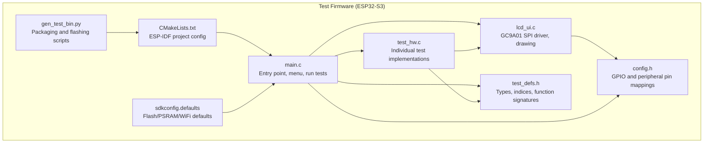
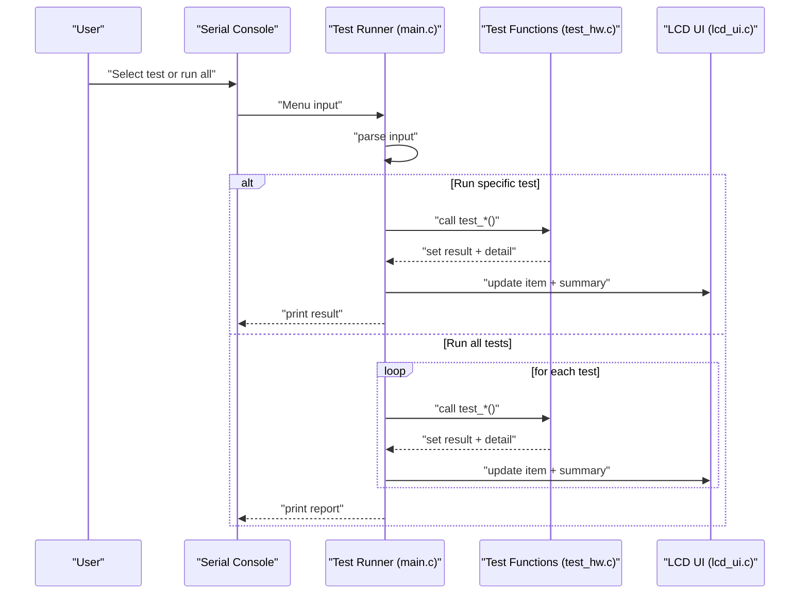
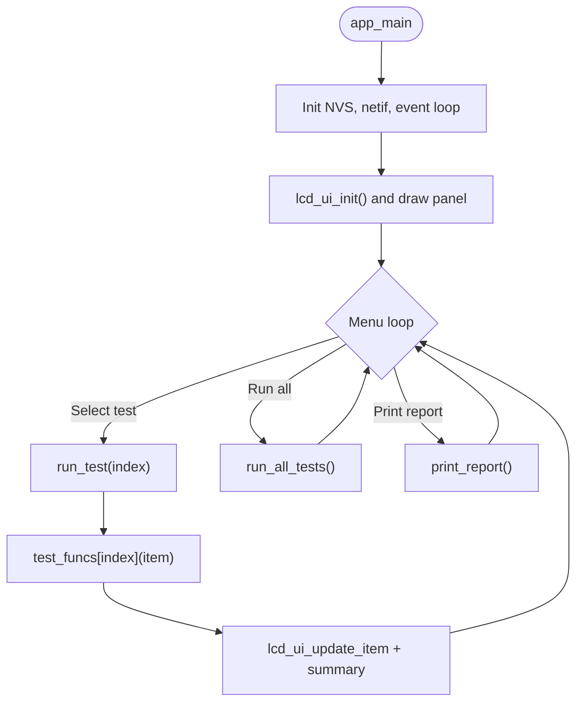
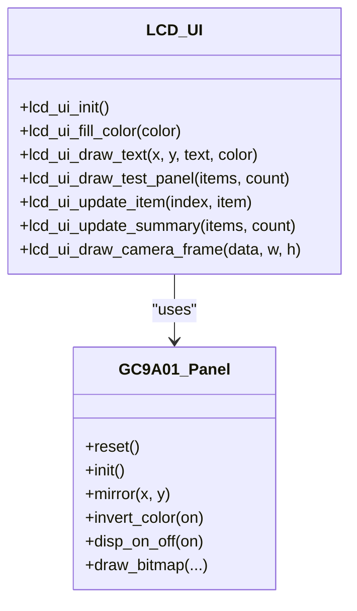
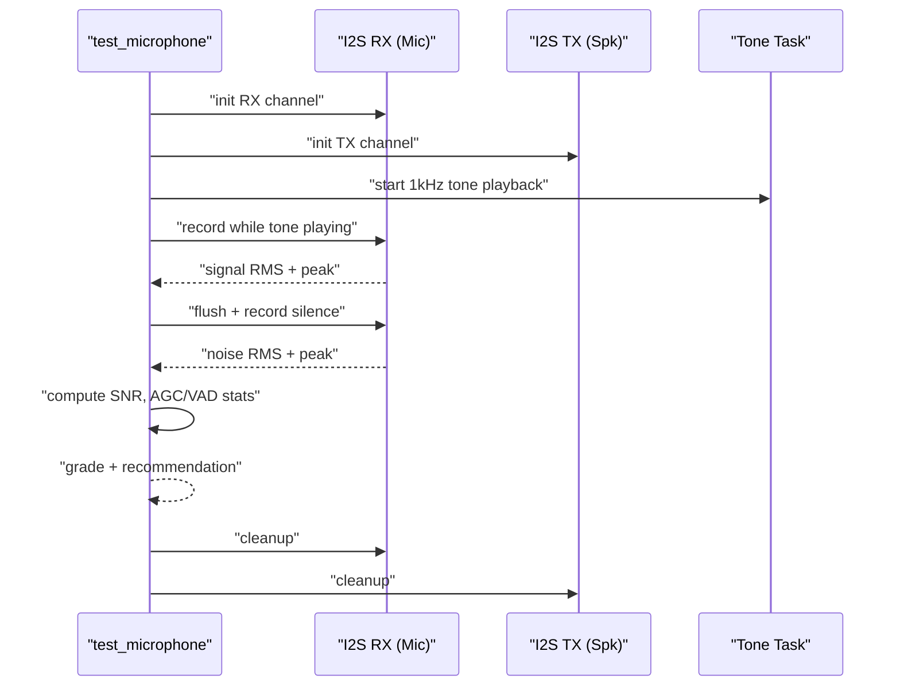
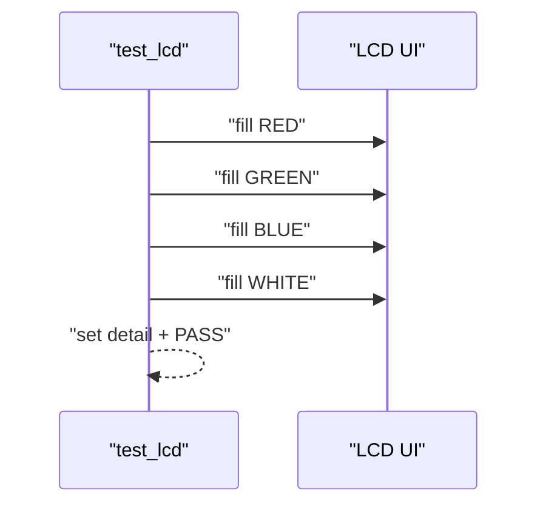
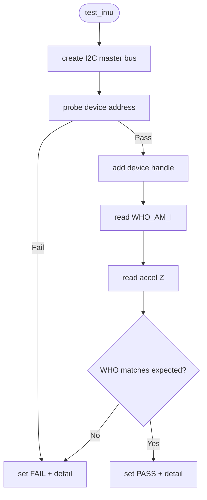
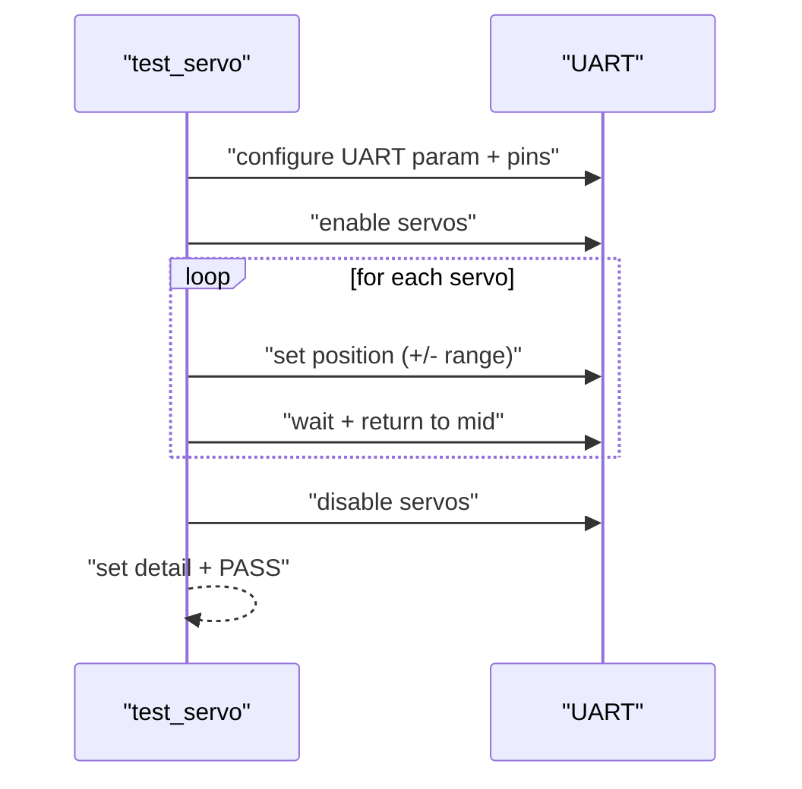
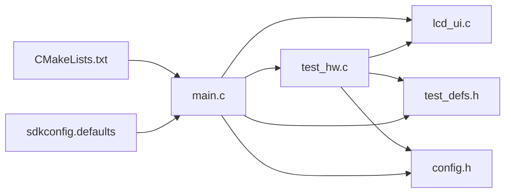

# Testing Framework

<cite>
**Referenced Files in This Document**
- [main.c](file://test_firmware/main/main.c)
- [test_hw.c](file://test_firmware/main/test_hw.c)
- [lcd_ui.c](file://test_firmware/main/lcd_ui.c)
- [test_defs.h](file://test_firmware/main/test_defs.h)
- [config.h](file://test_firmware/main/config.h)
- [CMakeLists.txt](file://test_firmware/CMakeLists.txt)
- [sdkconfig.defaults](file://test_firmware/sdkconfig.defaults)
- [gen_test_bin.py](file://test_firmware/scripts/gen_test_bin.py)
- [README.md](file://README.md)
- [RIG-Puppy-TestList.md](file://docs/RIG-Puppy-TestList.md)
- [main.cc](file://main/main.cc)
- [application.cc](file://main/application.cc)
</cite>

## Table of Contents
1. [Introduction](#introduction)
2. [Project Structure](#project-structure)
3. [Core Components](#core-components)
4. [Architecture Overview](#architecture-overview)
5. [Detailed Component Analysis](#detailed-component-analysis)
6. [Dependency Analysis](#dependency-analysis)
7. [Performance Considerations](#performance-considerations)
8. [Troubleshooting Guide](#troubleshooting-guide)
9. [Conclusion](#conclusion)
10. [Appendices](#appendices)

## Introduction
This document describes the hardware testing framework for validating RIG-Puppy hardware modules. It covers the standalone test firmware architecture, the LCD UI testing interface, automated test sequences, and the integration of tests into development and production workflows. It also provides guidance for writing custom test cases, interpreting results, and performing performance benchmarking and failure mode analysis.

## Project Structure
The testing framework is implemented as a separate ESP-IDF application under test_firmware. It provides a serial-menu-driven test runner with an LCD UI for real-time feedback. The main components are:
- Test runner entry point and menu loop
- Test suite covering system info, PSRAM, LCD, microphone/VAD, speaker, camera, IMU, servo UART, laser, button, and WiFi
- LCD UI driver for GC9A01 display
- Build and packaging scripts for flashing and distribution

**Diagram sources**
- [main.c:166-210](file://test_firmware/main/main.c#L166-L210)
- [test_hw.c:1-1119](file://test_firmware/main/test_hw.c#L1-L1119)
- [lcd_ui.c:48-107](file://test_firmware/main/lcd_ui.c#L48-L107)
- [test_defs.h:9-56](file://test_firmware/main/test_defs.h#L9-L56)
- [config.h:1-66](file://test_firmware/main/config.h#L1-L66)
- [CMakeLists.txt:1-8](file://test_firmware/CMakeLists.txt#L1-L8)
- [sdkconfig.defaults:1-26](file://test_firmware/sdkconfig.defaults#L1-L26)
- [gen_test_bin.py:1-161](file://test_firmware/scripts/gen_test_bin.py#L1-L161)

**Section sources**
- [main.c:166-210](file://test_firmware/main/main.c#L166-L210)
- [CMakeLists.txt:1-8](file://test_firmware/CMakeLists.txt#L1-L8)
- [sdkconfig.defaults:1-26](file://test_firmware/sdkconfig.defaults#L1-L26)

## Core Components
- Test runner and menu
  - Initializes NVS, network, and LCD
  - Presents a serial menu to run individual tests or all tests
  - Updates LCD panel and prints structured reports
- Test suite
  - System info, PSRAM, LCD, microphone/VAD, speaker, camera, IMU, servo UART, laser, button, WiFi
  - Each test sets a result and a detail string for reporting
- LCD UI
  - SPI GC9A01 driver with double buffering
  - Drawing text, rectangles, and camera frames
  - Circular 240x240 layout optimized for the device’s display
- Build and packaging
  - ESP-IDF project targeting ESP32-S3
  - Packaging script generates manifest and flash scripts for distribution

**Section sources**
- [main.c:24-113](file://test_firmware/main/main.c#L24-L113)
- [test_hw.c:36-1119](file://test_firmware/main/test_hw.c#L36-L1119)
- [lcd_ui.c:48-340](file://test_firmware/main/lcd_ui.c#L48-L340)
- [test_defs.h:9-56](file://test_firmware/main/test_defs.h#L9-L56)
- [config.h:1-66](file://test_firmware/main/config.h#L1-L66)
- [gen_test_bin.py:24-161](file://test_firmware/scripts/gen_test_bin.py#L24-L161)

## Architecture Overview
The test firmware is a standalone FreeRTOS application that:
- Initializes peripherals and the display
- Runs a loop to accept user commands via serial
- Executes selected tests and updates the LCD panel
- Produces a final report summarizing pass/fail/not-run counts

**Diagram sources**
- [main.c:166-210](file://test_firmware/main/main.c#L166-L210)
- [test_hw.c:57-86](file://test_firmware/main/test_hw.c#L57-L86)
- [lcd_ui.c:246-319](file://test_firmware/main/lcd_ui.c#L246-L319)

## Detailed Component Analysis

### Test Runner and Menu
- Initializes NVS, network, and creates the event loop
- Draws the initial LCD panel and enters the menu loop
- Supports running a single test by index, running all tests, or printing a report
- Uses a function pointer table to dispatch to test implementations

**Diagram sources**
- [main.c:166-210](file://test_firmware/main/main.c#L166-L210)
- [main.c:57-86](file://test_firmware/main/main.c#L57-L86)
- [main.c:91-113](file://test_firmware/main/main.c#L91-L113)

**Section sources**
- [main.c:166-210](file://test_firmware/main/main.c#L166-L210)
- [main.c:24-52](file://test_firmware/main/main.c#L24-L52)

### LCD UI Driver
- SPI bus initialization and GC9A01 panel setup
- Double-buffered drawing for DMA-safe transfers
- Text rendering with a fixed 8x16 font
- Circular layout optimized for 240x240 display
- Camera frame drawing and color fill helpers

**Diagram sources**
- [lcd_ui.c:48-107](file://test_firmware/main/lcd_ui.c#L48-L107)
- [lcd_ui.c:246-340](file://test_firmware/main/lcd_ui.c#L246-L340)

**Section sources**
- [lcd_ui.c:48-107](file://test_firmware/main/lcd_ui.c#L48-L107)
- [lcd_ui.c:112-180](file://test_firmware/main/lcd_ui.c#L112-L180)
- [lcd_ui.c:246-340](file://test_firmware/main/lcd_ui.c#L246-L340)

### Test Suite: Audio Processing
- Microphone + VAD test
  - Initializes I2S RX/TX channels
  - Records silence to measure noise floor
  - Plays a 1kHz tone while recording to compute SNR
  - Simulates human speech with AGC and VAD comparisons
  - Computes grades and recommendations
- Speaker test
  - Initializes I2S TX channel and plays a 1kHz sine wave for 1s

**Diagram sources**
- [test_hw.c:344-580](file://test_firmware/main/test_hw.c#L344-L580)
- [test_hw.c:129-208](file://test_firmware/main/test_hw.c#L129-L208)
- [test_hw.c:268-292](file://test_firmware/main/test_hw.c#L268-L292)

**Section sources**
- [test_hw.c:344-580](file://test_firmware/main/test_hw.c#L344-L580)
- [test_hw.c:585-669](file://test_firmware/main/test_hw.c#L585-L669)

### Test Suite: Display Functionality
- LCD test fills the screen with red, green, blue, and white colors in sequence
- Camera test initializes OV2640, captures a frame, displays it on the LCD, converts to JPEG, and streams base64 image data via serial

**Diagram sources**
- [test_hw.c:97-118](file://test_firmware/main/test_hw.c#L97-L118)
- [lcd_ui.c:112-126](file://test_firmware/main/lcd_ui.c#L112-L126)

**Section sources**
- [test_hw.c:97-118](file://test_firmware/main/test_hw.c#L97-L118)
- [test_hw.c:713-817](file://test_firmware/main/test_hw.c#L713-L817)

### Test Suite: Sensor Integration
- IMU test probes I2C address, reads WHO_AM_I, and verifies accelerometer data

**Diagram sources**
- [test_hw.c:822-882](file://test_firmware/main/test_hw.c#L822-L882)

**Section sources**
- [test_hw.c:822-882](file://test_firmware/main/test_hw.c#L822-L882)

### Test Suite: Communication Modules
- Servo UART test configures XGO UART, enables servos, moves each servo ±range, and disables them
- WiFi scan test initializes station mode, starts an active scan, and reports AP count

**Diagram sources**
- [test_hw.c:928-1001](file://test_firmware/main/test_hw.c#L928-L1001)

**Section sources**
- [test_hw.c:928-1001](file://test_firmware/main/test_hw.c#L928-L1001)
- [test_hw.c:1072-1118](file://test_firmware/main/test_hw.c#L1072-L1118)

### Test Suite: Other Hardware
- Laser test toggles GPIO high/low for 500 ms each
- Button test waits for GPIO0 press within 5 seconds
- PSRAM test allocates 1MB from SPIRAM, writes a pattern, reads back, and validates

**Section sources**
- [test_hw.c:1006-1032](file://test_firmware/main/test_hw.c#L1006-L1032)
- [test_hw.c:1037-1067](file://test_firmware/main/test_hw.c#L1037-L1067)
- [test_hw.c:58-92](file://test_firmware/main/test_hw.c#L58-L92)

### Writing Custom Test Cases
- Define a new function with signature matching the test function typedef
- Add an entry to the test items array and the function pointer table
- Use the test_item_t structure to set result and detail
- Utilize existing drivers (I2C, SPI, I2S, UART) and LCD UI helpers
- Keep tests deterministic and self-contained; clean up resources on failure

Example steps:
- Add declaration in header or keep internal
- Implement test logic using driver APIs
- Update test_items and test_funcs arrays
- Use lcd_ui_update_item for live feedback

**Section sources**
- [test_defs.h:38-52](file://test_firmware/main/test_defs.h#L38-L52)
- [main.c:24-52](file://test_firmware/main/main.c#L24-L52)
- [main.c:57-74](file://test_firmware/main/main.c#L57-L74)

### Interpreting Test Results
- Each test sets one of the result codes: not run, running, pass, fail
- The detail field carries a concise message for the report
- The report aggregates PASS/FAIL/NOT RUN totals and prints a summary table

**Section sources**
- [test_defs.h:9-15](file://test_firmware/main/test_defs.h#L9-L15)
- [main.c:91-113](file://test_firmware/main/main.c#L91-L113)

### Automated Test Sequences and CI/CD Integration
- Build and packaging
  - ESP-IDF project configured for ESP32-S3
  - Packaging script generates manifest.json and platform-specific flash scripts
- Integration ideas
  - Use the packaging script to produce a flashable bundle
  - Automate flashing via CLI or web tools using the generated manifest
  - Capture serial output to parse PASS/FAIL and generate machine-readable reports

**Section sources**
- [CMakeLists.txt:1-8](file://test_firmware/CMakeLists.txt#L1-L8)
- [sdkconfig.defaults:1-26](file://test_firmware/sdkconfig.defaults#L1-L26)
- [gen_test_bin.py:24-161](file://test_firmware/scripts/gen_test_bin.py#L24-L161)

## Dependency Analysis
The test firmware depends on ESP-IDF drivers and the LCD UI module. The test runner depends on the test function table and LCD UI for updates.

**Diagram sources**
- [main.c:166-210](file://test_firmware/main/main.c#L166-L210)
- [test_hw.c:1-1119](file://test_firmware/main/test_hw.c#L1-L1119)
- [lcd_ui.c:48-107](file://test_firmware/main/lcd_ui.c#L48-L107)
- [test_defs.h:9-56](file://test_firmware/main/test_defs.h#L9-L56)
- [config.h:1-66](file://test_firmware/main/config.h#L1-L66)
- [CMakeLists.txt:1-8](file://test_firmware/CMakeLists.txt#L1-L8)
- [sdkconfig.defaults:1-26](file://test_firmware/sdkconfig.defaults#L1-L26)

**Section sources**
- [main.c:166-210](file://test_firmware/main/main.c#L166-L210)
- [test_hw.c:1-1119](file://test_firmware/main/test_hw.c#L1-L1119)
- [lcd_ui.c:48-107](file://test_firmware/main/lcd_ui.c#L48-L107)

## Performance Considerations
- Memory allocation
  - PSRAM allocation is validated for correctness; ensure similar patterns for memory-intensive tests
- I2S throughput
  - Audio tests rely on precise timing; ensure sample rates and DMA buffers align with configuration
- Display updates
  - Double buffering and strip-based drawing minimize tearing and improve responsiveness
- WiFi scanning
  - Active scans consume more power; limit scan duration and frequency in production tests

[No sources needed since this section provides general guidance]

## Troubleshooting Guide
- NVS initialization failures
  - The test firmware erases and reinitializes NVS if needed; ensure NVS is accessible
- LCD initialization
  - SPI bus and panel initialization errors are logged; verify wiring and pin mappings
- I2C device probing
  - Probe failures indicate incorrect address or wiring; confirm pull-ups and bus integrity
- Camera capture
  - Frame buffer allocation and JPEG conversion failures require PSRAM availability and correct frame size
- UART tests
  - Ensure correct baud rate and pin configuration; verify device enable signals

**Section sources**
- [main.c:168-175](file://test_firmware/main/main.c#L168-L175)
- [lcd_ui.c:48-107](file://test_firmware/main/lcd_ui.c#L48-L107)
- [test_hw.c:842-848](file://test_firmware/main/test_hw.c#L842-L848)
- [test_hw.c:748-754](file://test_firmware/main/test_hw.c#L748-L754)
- [test_hw.c:938-943](file://test_firmware/main/test_hw.c#L938-L943)

## Conclusion
The hardware testing framework provides a robust, menu-driven, and LCD-assisted validation suite for RIG-Puppy modules. It supports audio processing, display, sensors, actuators, and communication interfaces. The modular design allows easy addition of new tests, and the packaging pipeline simplifies distribution and flashing. Integrating these tests into CI/CD enables automated quality assurance and regression detection.

[No sources needed since this section summarizes without analyzing specific files]

## Appendices

### Appendix A: Test Procedure Index
- System Info
- PSRAM
- LCD
- Mic + VAD
- Speaker
- Camera
- IMU
- Servo UART
- Laser
- Button
- WiFi Scan

**Section sources**
- [main.c:24-52](file://test_firmware/main/main.c#L24-L52)
- [test_hw.c:36-1119](file://test_firmware/main/test_hw.c#L36-L1119)

### Appendix B: Example Integration into CI/CD
- Build the test firmware using ESP-IDF
- Package the firmware using the provided script to generate manifest and flash scripts
- Flash via CLI or web tools
- Monitor serial output to parse PASS/FAIL and generate reports

**Section sources**
- [CMakeLists.txt:1-8](file://test_firmware/CMakeLists.txt#L1-L8)
- [gen_test_bin.py:115-161](file://test_firmware/scripts/gen_test_bin.py#L115-L161)

### Appendix C: Relationship to Main Application
- The main application demonstrates runtime behavior and state transitions; the test firmware focuses on hardware verification
- Both share common drivers and configurations for audio, display, and sensors

**Section sources**
- [main.cc:14-29](file://main/main.cc#L14-L29)
- [application.cc:62-178](file://main/application.cc#L62-L178)
- [README.md:1-214](file://README.md#L1-L214)