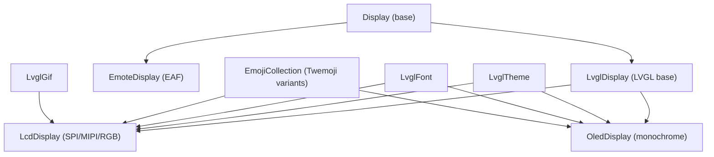
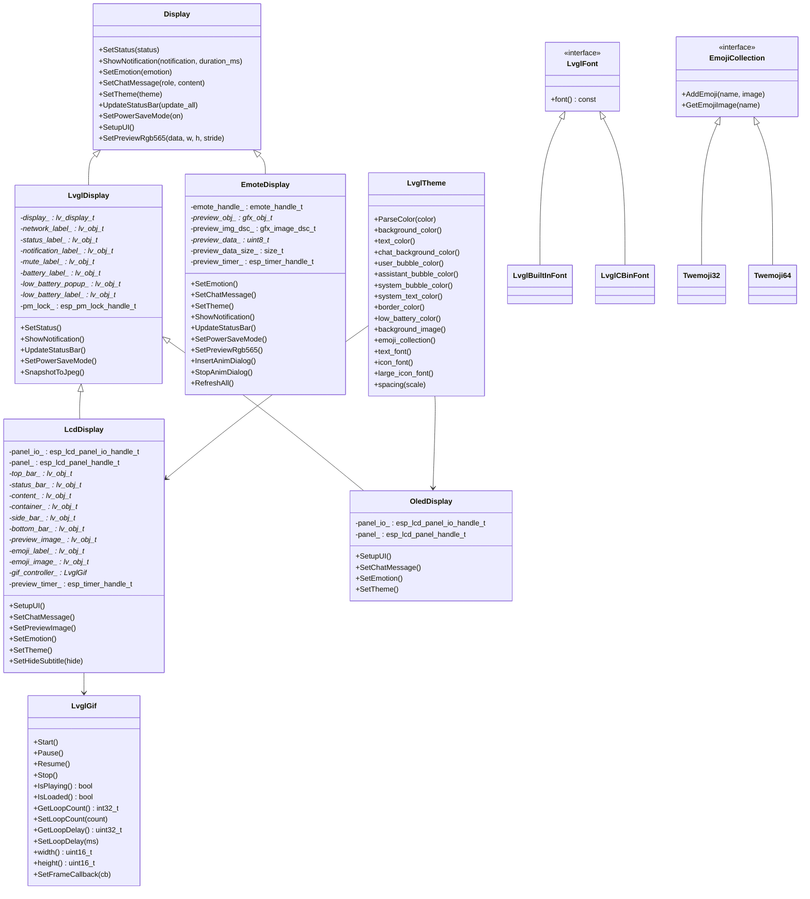
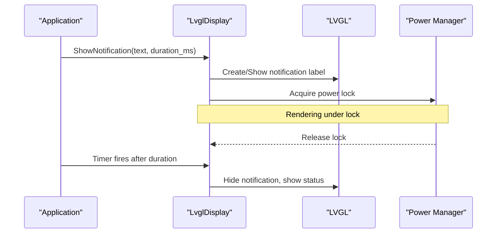
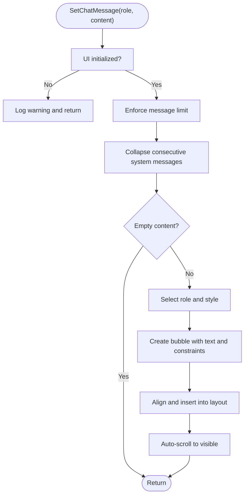
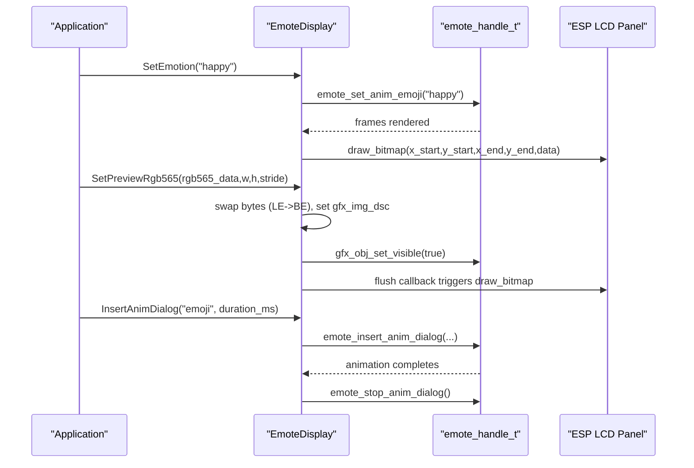
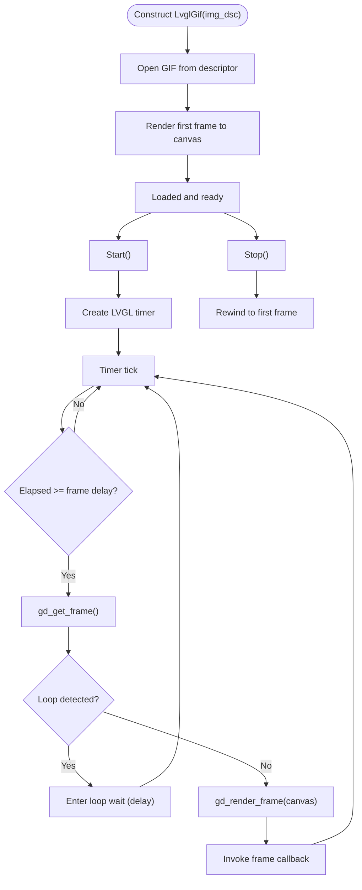
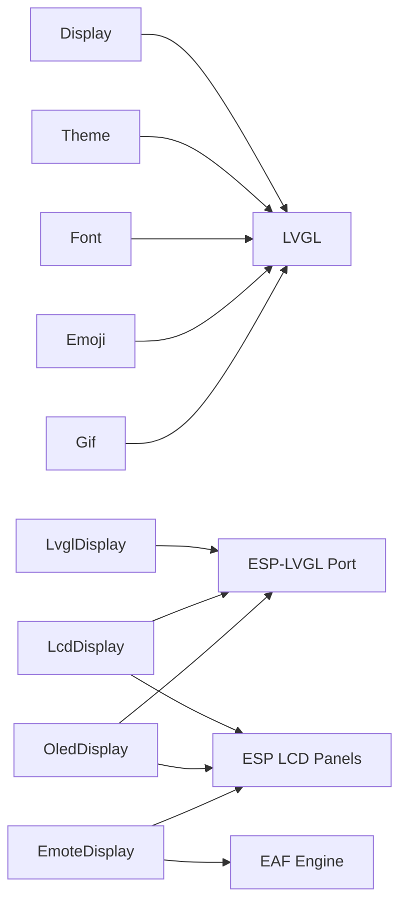

# Display and Visual Interface

<cite>
**Referenced Files in This Document**
- [display.h](file://main/display/display.h)
- [display.cc](file://main/display/display.cc)
- [lvgl_display.h](file://main/display/lvgl_display/lvgl_display.h)
- [lvgl_display.cc](file://main/display/lvgl_display/lvgl_display.cc)
- [lcd_display.h](file://main/display/lcd_display.h)
- [lcd_display.cc](file://main/display/lcd_display.cc)
- [oled_display.h](file://main/display/oled_display.h)
- [oled_display.cc](file://main/display/oled_display.cc)
- [emote_display.h](file://main/display/emote_display.h)
- [emote_display.cc](file://main/display/emote_display.cc)
- [lvgl_theme.h](file://main/display/lvgl_display/lvgl_theme.h)
- [lvgl_theme.cc](file://main/display/lvgl_display/lvgl_theme.cc)
- [lvgl_font.h](file://main/display/lvgl_display/lvgl_font.h)
- [lvgl_font.cc](file://main/display/lvgl_display/lvgl_font.cc)
- [emoji_collection.h](file://main/display/lvgl_display/emoji_collection.h)
- [emoji_collection.cc](file://main/display/lvgl_display/emoji_collection.cc)
- [lvgl_gif.h](file://main/display/lvgl_display/gif/lvgl_gif.h)
- [lvgl_gif.cc](file://main/display/lvgl_display/gif/lvgl_gif.cc)
</cite>

## Table of Contents
1. [Introduction](#introduction)
2. [Project Structure](#project-structure)
3. [Core Components](#core-components)
4. [Architecture Overview](#architecture-overview)
5. [Detailed Component Analysis](#detailed-component-analysis)
6. [Dependency Analysis](#dependency-analysis)
7. [Performance Considerations](#performance-considerations)
8. [Troubleshooting Guide](#troubleshooting-guide)
9. [Conclusion](#conclusion)
10. [Appendices](#appendices)

## Introduction
This document describes the display and visual interface system built around LVGL for embedded devices and an animation framework for expressive visuals. It covers:
- LVGL-based display controller architecture with frame buffer management, rendering pipeline, and status bar updates
- EAF (Embedded Animation Format) animation engine integration for facial expressions and dialog animations
- Emoji collection management and theme system
- Dynamic content loading for images and animated GIFs
- Font rendering and iconography
- Power-aware display management and performance optimization strategies
- Practical examples for creating custom animations and integrating visual feedback with system states

## Project Structure
The display subsystem is organized into layered abstractions:
- Base display interface and locking mechanism
- LVGL-based implementations for LCD and OLED screens
- Emote display for EAF animations and preview images
- Theme, font, and emoji subsystems
- GIF playback support for animated assets

**Diagram sources**
- [display.h:28-65](file://main/display/display.h#L28-L65)
- [lvgl_display.h:15-50](file://main/display/lvgl_display/lvgl_display.h#L15-L50)
- [lcd_display.h:17-85](file://main/display/lcd_display.h#L17-L85)
- [oled_display.h:10-42](file://main/display/oled_display.h#L10-L42)
- [emote_display.h:14-48](file://main/display/emote_display.h#L14-L48)
- [lvgl_theme.h:14-76](file://main/display/lvgl_display/lvgl_theme.h#L14-L76)
- [lvgl_font.h:6-31](file://main/display/lvgl_display/lvgl_font.h#L6-L31)
- [emoji_collection.h:14-34](file://main/display/lvgl_display/emoji_collection.h#L14-L34)
- [lvgl_gif.h:13-117](file://main/display/lvgl_display/gif/lvgl_gif.h#L13-L117)

**Section sources**
- [display.h:1-92](file://main/display/display.h#L1-L92)
- [lvgl_display.h:1-54](file://main/display/lvgl_display/lvgl_display.h#L1-L54)
- [lcd_display.h:1-86](file://main/display/lcd_display.h#L1-L86)
- [oled_display.h:1-42](file://main/display/oled_display.h#L1-L42)
- [emote_display.h:1-51](file://main/display/emote_display.h#L1-L51)

## Core Components
- Display base class defines the contract for setting emotions, chat messages, notifications, status, themes, power save mode, and UI setup lifecycle.
- LvglDisplay extends Display with LVGL-specific UI elements (status/notification bars, low-battery popup) and power management locks.
- LcdDisplay adds full-screen UI with top/status/content areas, chat bubbles, and preview image handling for SPI, RGB, and MIPI panels.
- OledDisplay provides compact monochrome UI layouts for 128x64 and 128x32 displays.
- EmoteDisplay integrates the EAF animation engine for facial expressions and dialog animations, plus camera preview overlay.
- Theme, Font, and Emoji subsystems provide styling, typography, and emoji assets for LVGL surfaces.
- GIF playback support enables animated assets with loop controls and frame callbacks.

**Section sources**
- [display.h:28-65](file://main/display/display.h#L28-L65)
- [lvgl_display.cc:72-275](file://main/display/lvgl_display/lvgl_display.cc#L72-L275)
- [lcd_display.cc:353-800](file://main/display/lcd_display.cc#L353-L800)
- [oled_display.cc:83-409](file://main/display/oled_display.cc#L83-L409)
- [emote_display.cc:119-343](file://main/display/emote_display.cc#L119-L343)
- [lvgl_theme.h:14-95](file://main/display/lvgl_display/lvgl_theme.h#L14-L95)
- [lvgl_font.h:6-31](file://main/display/lvgl_display/lvgl_font.h#L6-L31)
- [emoji_collection.cc:9-124](file://main/display/lvgl_display/emoji_collection.cc#L9-L124)
- [lvgl_gif.cc:7-253](file://main/display/lvgl_display/gif/lvgl_gif.cc#L7-L253)

## Architecture Overview
The system composes multiple display backends behind a unified Display interface. LVGL handles rendering, input, and UI composition. The EAF engine renders facial expressions and dialog animations. Themes and fonts unify visual styles. GIFs augment static assets.

**Diagram sources**
- [display.h:28-65](file://main/display/display.h#L28-L65)
- [lvgl_display.h:15-50](file://main/display/lvgl_display/lvgl_display.h#L15-L50)
- [lcd_display.h:17-85](file://main/display/lcd_display.h#L17-L85)
- [oled_display.h:10-42](file://main/display/oled_display.h#L10-L42)
- [emote_display.h:14-48](file://main/display/emote_display.h#L14-L48)
- [lvgl_theme.h:14-95](file://main/display/lvgl_display/lvgl_theme.h#L14-L95)
- [lvgl_font.h:6-31](file://main/display/lvgl_display/lvgl_font.h#L6-L31)
- [emoji_collection.h:14-34](file://main/display/lvgl_display/emoji_collection.h#L14-L34)
- [lvgl_gif.h:13-117](file://main/display/lvgl_display/gif/lvgl_gif.h#L13-L117)

## Detailed Component Analysis

### LVGL Display Controller (LvglDisplay)
- Responsibilities:
  - Manage LVGL UI elements for status, notifications, and system indicators (network, mute, battery).
  - Provide power management lock to coordinate rendering with CPU frequency scaling.
  - Support snapshot-to-JPEG capture for diagnostics or UI export.
- Key behaviors:
  - Notification timer hides notifications after a configured duration.
  - Status bar updates include time display, mute state, battery level, and network icon.
  - Low battery popup triggers sound alerts and visibility changes based on battery state.
- Thread safety:
  - Uses a display lock guard to synchronize LVGL operations.

**Diagram sources**
- [lvgl_display.cc:94-111](file://main/display/lvgl_display/lvgl_display.cc#L94-L111)
- [lvgl_display.cc:113-219](file://main/display/lvgl_display/lvgl_display.cc#L113-L219)

**Section sources**
- [lvgl_display.h:15-50](file://main/display/lvgl_display/lvgl_display.h#L15-L50)
- [lvgl_display.cc:18-70](file://main/display/lvgl_display/lvgl_display.cc#L18-L70)
- [lvgl_display.cc:94-111](file://main/display/lvgl_display/lvgl_display.cc#L94-L111)
- [lvgl_display.cc:113-219](file://main/display/lvgl_display/lvgl_display.cc#L113-L219)
- [lvgl_display.cc:234-275](file://main/display/lvgl_display/lvgl_display.cc#L234-L275)

### LCD Display (LcdDisplay) and Panels
- Supports SPI, RGB, and MIPI panels via ESP-LVGL Port.
- UI layers:
  - Top bar: network and status icons
  - Status bar: centered notification/status text
  - Content area: chat bubbles with role-based styling and auto-scroll
  - Low battery popup
- Features:
  - Chat bubble creation with wrapping and alignment per role (user, assistant, system)
  - Preview image insertion with scaling and cleanup
  - GIF playback integration for animated assets
  - Theme switching and PSRAM-backed image cache on platforms with sufficient memory

**Diagram sources**
- [lcd_display.cc:504-698](file://main/display/lcd_display.cc#L504-L698)

**Section sources**
- [lcd_display.h:17-85](file://main/display/lcd_display.h#L17-L85)
- [lcd_display.cc:25-63](file://main/display/lcd_display.cc#L25-L63)
- [lcd_display.cc:353-498](file://main/display/lcd_display.cc#L353-L498)
- [lcd_display.cc:504-698](file://main/display/lcd_display.cc#L504-L698)
- [lcd_display.cc:700-782](file://main/display/lcd_display.cc#L700-L782)
- [lcd_display.cc:784-800](file://main/display/lcd_display.cc#L784-L800)

### OLED Display (OledDisplay)
- Monochrome UI optimized for small screens (128x64 and 128x32).
- Layouts:
  - 128x64: top bar with icons, status bar with centered text, emotion label on left, chat on right with horizontal scroll.
  - 128x32: vertical split with emotion on left and status/icons/chat on right.
- Emotion display uses FontAwesome icons mapped to UTF-8.

**Section sources**
- [oled_display.h:10-42](file://main/display/oled_display.h#L10-L42)
- [oled_display.cc:20-81](file://main/display/oled_display.cc#L20-L81)
- [oled_display.cc:83-136](file://main/display/oled_display.cc#L83-L136)
- [oled_display.cc:168-385](file://main/display/oled_display.cc#L168-L385)
- [oled_display.cc:387-409](file://main/display/oled_display.cc#L387-L409)

### Emote Display (EAF Animation Engine)
- Integrates the EAF animation engine for facial expressions and dialog animations.
- Capabilities:
  - Set emotion by name
  - Show notifications via event messages
  - Camera preview overlay with RGB565 data, byte-swapped for LCD endianness
  - Dialog insertion and stopping, refresh signaling
- Panel integration:
  - Registers flush completion callbacks to panel IO
  - Uses double-buffering and DMA-friendly configurations

**Diagram sources**
- [emote_display.cc:151-157](file://main/display/emote_display.cc#L151-L157)
- [emote_display.cc:209-300](file://main/display/emote_display.cc#L209-L300)
- [emote_display.cc:326-333](file://main/display/emote_display.cc#L326-L333)
- [emote_display.cc:62-69](file://main/display/emote_display.cc#L62-L69)

**Section sources**
- [emote_display.h:14-48](file://main/display/emote_display.h#L14-L48)
- [emote_display.cc:75-113](file://main/display/emote_display.cc#L75-L113)
- [emote_display.cc:119-149](file://main/display/emote_display.cc#L119-L149)
- [emote_display.cc:151-200](file://main/display/emote_display.cc#L151-L200)
- [emote_display.cc:209-300](file://main/display/emote_display.cc#L209-L300)
- [emote_display.cc:317-343](file://main/display/emote_display.cc#L317-L343)

### Theme System and Typography
- LvglTheme encapsulates colors, fonts, backgrounds, and emoji collections.
- LvglThemeManager registers and retrieves themes by name.
- Fonts:
  - Built-in LVGL fonts
  - CBIN fonts loaded from binary assets
- Spacing helpers scale consistently across resolutions.

**Section sources**
- [lvgl_theme.h:14-95](file://main/display/lvgl_display/lvgl_theme.h#L14-L95)
- [lvgl_theme.cc:3-31](file://main/display/lvgl_display/lvgl_theme.cc#L3-L31)
- [lvgl_font.h:6-31](file://main/display/lvgl_display/lvgl_font.h#L6-L31)
- [lvgl_font.cc:5-13](file://main/display/lvgl_display/lvgl_font.cc#L5-L13)

### Emoji Collection Management
- EmojiCollection stores named images for runtime lookup.
- Twemoji32 and Twemoji64 provide predefined sets of facial expressions (neutral, happy, sad, thinking, listen, etc.) sourced from compiled emoji assets.

**Section sources**
- [emoji_collection.h:14-34](file://main/display/lvgl_display/emoji_collection.h#L14-L34)
- [emoji_collection.cc:9-28](file://main/display/lvgl_display/emoji_collection.cc#L9-L28)
- [emoji_collection.cc:53-75](file://main/display/lvgl_display/emoji_collection.cc#L53-L75)
- [emoji_collection.cc:101-123](file://main/display/lvgl_display/emoji_collection.cc#L101-L123)

### GIF Playback Pipeline
- LvglGif wraps gifdec decoding and LVGL image descriptor updates.
- Controls:
  - Start/Stop/Pause/Resume
  - Loop count and inter-loop delay
  - Frame callback hook for synchronization
- Rendering:
  - LVGL timer advances frames based on delays
  - Canvas rendering updates the descriptor’s pixel buffer

**Diagram sources**
- [lvgl_gif.cc:7-39](file://main/display/lvgl_display/gif/lvgl_gif.cc#L7-L39)
- [lvgl_gif.cc:55-80](file://main/display/lvgl_display/gif/lvgl_gif.cc#L55-L80)
- [lvgl_gif.cc:172-232](file://main/display/lvgl_display/gif/lvgl_gif.cc#L172-L232)

**Section sources**
- [lvgl_gif.h:13-117](file://main/display/lvgl_display/gif/lvgl_gif.h#L13-L117)
- [lvgl_gif.cc:7-253](file://main/display/lvgl_display/gif/lvgl_gif.cc#L7-L253)

### Touch Input Handling
- Not implemented in the referenced files. LVGL supports input devices via drivers; integration would typically involve registering input devices and handling events in the LVGL port layer. This section is conceptual and does not analyze specific files.

[No sources needed since this section doesn't analyze specific source files]

## Dependency Analysis
- Display depends on LVGL for UI primitives and ESP-LVGL Port for hardware integration.
- LcdDisplay depends on ESP LCD panels and LVGL port configuration for SPI, RGB, and MIPI modes.
- EmoteDisplay depends on the EAF engine and panel IO callbacks for drawing.
- Theme and font systems decouple visual styling from rendering logic.
- GIF playback is independent of display backends and can be used with any LVGL image.

**Diagram sources**
- [display.h:28-65](file://main/display/display.h#L28-L65)
- [lcd_display.cc:129-172](file://main/display/lcd_display.cc#L129-L172)
- [oled_display.cc:39-81](file://main/display/oled_display.cc#L39-L81)
- [emote_display.cc:75-113](file://main/display/emote_display.cc#L75-L113)
- [lvgl_theme.h:14-76](file://main/display/lvgl_display/lvgl_theme.h#L14-L76)
- [lvgl_font.h:6-31](file://main/display/lvgl_display/lvgl_font.h#L6-L31)
- [emoji_collection.h:14-34](file://main/display/lvgl_display/emoji_collection.h#L14-L34)
- [lvgl_gif.h:13-117](file://main/display/lvgl_display/gif/lvgl_gif.h#L13-L117)

**Section sources**
- [display.h:1-92](file://main/display/display.h#L1-L92)
- [lcd_display.cc:129-284](file://main/display/lcd_display.cc#L129-L284)
- [oled_display.cc:39-81](file://main/display/oled_display.cc#L39-L81)
- [emote_display.cc:75-113](file://main/display/emote_display.cc#L75-L113)

## Performance Considerations
- Frame buffer management:
  - LVGL port buffer sizes tuned per panel type (SPI vs RGB vs MIPI).
  - Double buffering and DMA flags selected for throughput/performance balance.
- Memory usage:
  - PSRAM-backed image cache enabled on platforms with sufficient memory to reduce decompression overhead.
  - Preview image buffers allocated from external RAM; data swapped in-place for LCD endianness.
- Power-aware display:
  - Power management lock acquired during status bar updates to prevent CPU frequency scaling conflicts.
  - Power save mode switches to sleep-like emotion and clears chat/status to reduce activity.
- Real-time animation:
  - LVGL timers drive GIF playback; loop delay and frame timing ensure smooth playback.
  - EAF engine flush callbacks integrate with panel DMA to minimize latency.

**Section sources**
- [lcd_display.cc:118-126](file://main/display/lcd_display.cc#L118-L126)
- [lcd_display.cc:141-161](file://main/display/lcd_display.cc#L141-L161)
- [lcd_display.cc:200-215](file://main/display/lcd_display.cc#L200-L215)
- [lcd_display.cc:252-268](file://main/display/lcd_display.cc#L252-L268)
- [lvgl_display.cc:152-218](file://main/display/lvgl_display/lvgl_display.cc#L152-L218)
- [emote_display.cc:262-277](file://main/display/emote_display.cc#L262-L277)
- [lvgl_gif.cc:172-232](file://main/display/lvgl_display/gif/lvgl_gif.cc#L172-L232)

## Troubleshooting Guide
- UI elements missing after initialization:
  - Ensure SetupUI() is called after display initialization and before setting status/notification/chat.
- Notifications not hiding:
  - Verify notification timer creation and that the timer is started with the correct duration.
- Battery or network icons not updating:
  - Confirm UpdateStatusBar is invoked periodically and device state allows network checks.
- Low battery popup not appearing:
  - Check battery level reporting and that the popup is hidden/shown based on discharge state.
- Preview image not displayed:
  - Ensure RGB565 data is provided with correct stride and dimensions; confirm byte-swap and timer visibility logic.
- GIF not animating:
  - Confirm GIF is loaded, timer created, and frame delay conditions are met; check loop detection and wait state.

**Section sources**
- [lvgl_display.cc:18-41](file://main/display/lvgl_display/lvgl_display.cc#L18-L41)
- [lvgl_display.cc:94-111](file://main/display/lvgl_display/lvgl_display.cc#L94-L111)
- [lvgl_display.cc:113-219](file://main/display/lvgl_display/lvgl_display.cc#L113-L219)
- [emote_display.cc:209-300](file://main/display/emote_display.cc#L209-L300)
- [lvgl_gif.cc:55-80](file://main/display/lvgl_display/gif/lvgl_gif.cc#L55-L80)
- [lvgl_gif.cc:172-232](file://main/display/lvgl_display/gif/lvgl_gif.cc#L172-L232)

## Conclusion
The display and visual interface system provides a robust, extensible foundation for embedded visual feedback:
- A unified Display interface with LVGL backends for LCD and OLED
- EAF-based animation engine for expressive UI
- Theme and font subsystems for consistent styling
- GIF playback and preview image handling for dynamic content
- Power-aware rendering and performance-tuned buffer management

This architecture supports real-time animation playback, efficient memory usage, and flexible integration with system states.

## Appendices

### Creating Custom Animations and Visual Feedback
- Emote animations:
  - Use EmoteDisplay::InsertAnimDialog to queue an animation with a duration.
  - Stop animations with EmoteDisplay::StopAnimDialog.
  - Trigger refresh with EmoteDisplay::RefreshAll to re-render the scene.
- GIF assets:
  - Wrap image descriptors with LvglGif and control playback via Start/Stop/Pause/Resume.
  - Use SetFrameCallback to synchronize with audio or system events.
- Chat visuals:
  - LcdDisplay::SetChatMessage creates styled bubbles per role and auto-scrolls to the latest content.
- Power save:
  - Lcd/Oled Emote displays support SetPowerSaveMode to switch to sleep-like visuals.

**Section sources**
- [emote_display.cc:317-343](file://main/display/emote_display.cc#L317-L343)
- [lvgl_gif.cc:55-101](file://main/display/lvgl_display/gif/lvgl_gif.cc#L55-L101)
- [lcd_display.cc:504-698](file://main/display/lcd_display.cc#L504-L698)
- [lvgl_display.cc:224-232](file://main/display/lvgl_display/lvgl_display.cc#L224-L232)