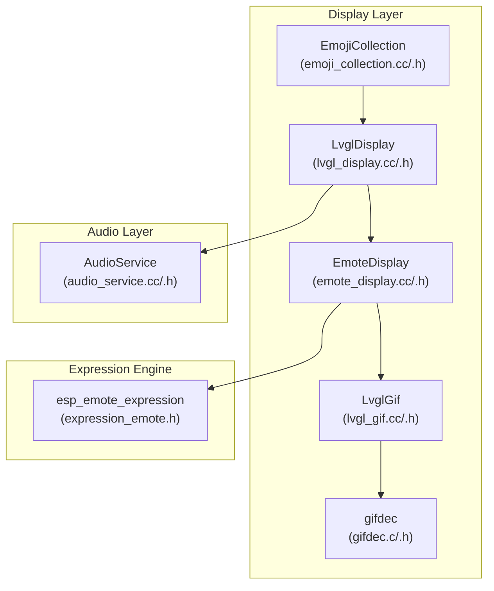
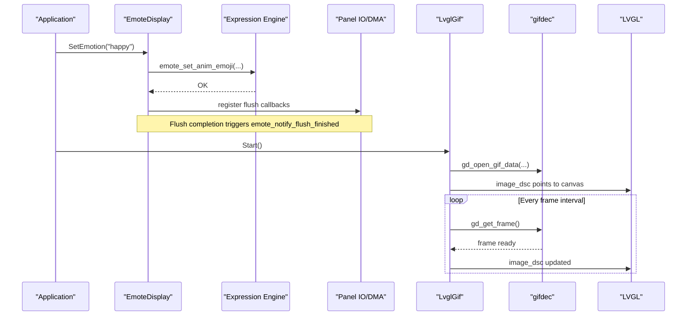
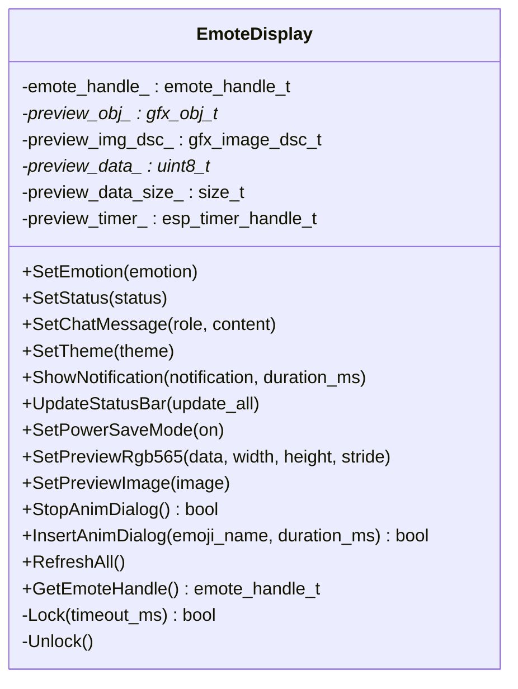
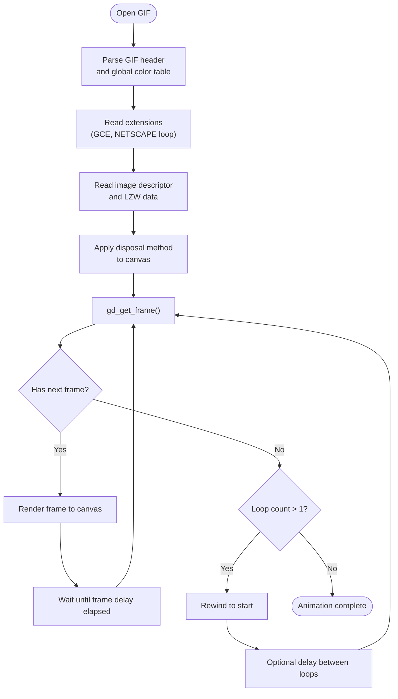
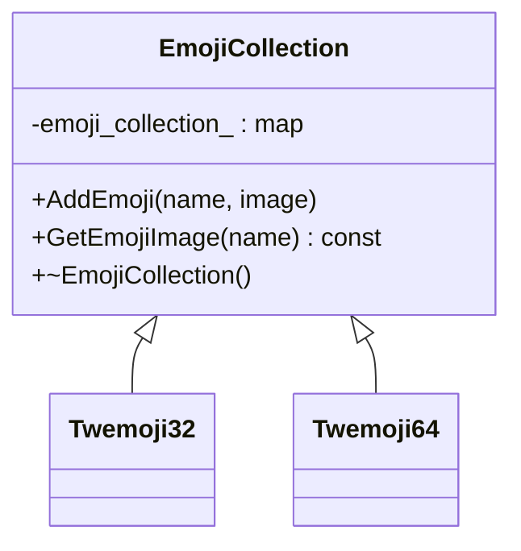
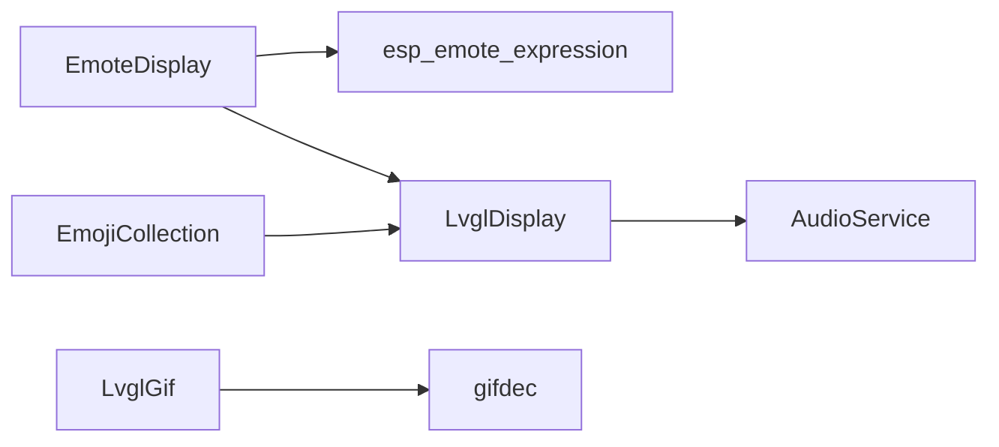

# EAF Animation Engine

<cite>
**Referenced Files in This Document**
- [emote_display.h](file://main/display/emote_display.h)
- [emote_display.cc](file://main/display/emote_display.cc)
- [expression_emote.h](file://managed_components/espressif2022__esp_emote_expression/include/expression_emote.h)
- [gifdec.h](file://main/display/lvgl_display/gif/gifdec.h)
- [gifdec.c](file://main/display/lvgl_display/gif/gifdec.c)
- [lvgl_gif.h](file://main/display/lvgl_display/gif/lvgl_gif.h)
- [lvgl_gif.cc](file://main/display/lvgl_display/gif/lvgl_gif.cc)
- [emoji_collection.h](file://main/display/lvgl_display/emoji_collection.h)
- [emoji_collection.cc](file://main/display/lvgl_display/emoji_collection.cc)
- [lvgl_display.h](file://main/display/lvgl_display/lvgl_display.h)
- [lvgl_display.cc](file://main/display/lvgl_display/lvgl_display.cc)
- [audio_service.h](file://main/audio/audio_service.h)
- [audio_service.cc](file://main/audio/audio_service.cc)
</cite>

## Table of Contents
1. [Introduction](#introduction)
2. [Project Structure](#project-structure)
3. [Core Components](#core-components)
4. [Architecture Overview](#architecture-overview)
5. [Detailed Component Analysis](#detailed-component-analysis)
6. [Dependency Analysis](#dependency-analysis)
7. [Performance Considerations](#performance-considerations)
8. [Troubleshooting Guide](#troubleshooting-guide)
9. [Conclusion](#conclusion)
10. [Appendices](#appendices)

## Introduction
This document describes the Embedded Animation Format (EAF) animation engine and GIF playback system powering facial expressions and animated emojis on embedded displays. It explains the EmoteDisplay class architecture supporting multiple expressions, the gifdec-based GIF decoder and LVGL integration, emoji collection management, synchronization with audio events, and the end-to-end animation pipeline from file loading to rendering. It also covers memory optimization, performance tuning, and practical guidance for creating custom animations, expression triggers, and lip-sync integration.

## Project Structure
The EAF/GIF subsystem spans several modules:
- EmoteDisplay: high-level display controller for EAF animations and emoji insertion
- Expression engine: integration with the esp_emote_expression component
- GIF playback: gifdec C library plus LVGL wrapper for timed frame updates
- Emoji collection: in-memory cache of emoji images for fast lookup
- LVGL display base: shared UI infrastructure and power management hooks
- Audio service: audio pipeline enabling lip-sync and speech-driven expression changes

**Diagram sources**
- [emote_display.cc:119-128](file://main/display/emote_display.cc#L119-L128)
- [expression_emote.h:1-11](file://managed_components/espressif2022__esp_emote_expression/include/expression_emote.h#L1-L11)
- [gifdec.h:1-69](file://main/display/lvgl_display/gif/gifdec.h#L1-L69)
- [gifdec.c:50-72](file://main/display/lvgl_display/gif/gifdec.c#L50-L72)
- [lvgl_gif.h:1-118](file://main/display/lvgl_display/gif/lvgl_gif.h#L1-L118)
- [lvgl_gif.cc:7-39](file://main/display/lvgl_display/gif/lvgl_gif.cc#L7-L39)
- [emoji_collection.h:1-35](file://main/display/lvgl_display/emoji_collection.h#L1-L35)
- [emoji_collection.cc:9-21](file://main/display/lvgl_display/emoji_collection.cc#L9-L21)
- [lvgl_display.h:15-50](file://main/display/lvgl_display/lvgl_display.h#L15-L50)
- [lvgl_display.cc:18-41](file://main/display/lvgl_display/lvgl_display.cc#L18-L41)
- [audio_service.h:106-204](file://main/audio/audio_service.h#L106-L204)
- [audio_service.cc:62-123](file://main/audio/audio_service.cc#L62-L123)

**Section sources**
- [emote_display.h:1-51](file://main/display/emote_display.h#L1-L51)
- [emote_display.cc:119-128](file://main/display/emote_display.cc#L119-L128)
- [expression_emote.h:1-11](file://managed_components/espressif2022__esp_emote_expression/include/expression_emote.h#L1-L11)
- [gifdec.h:1-69](file://main/display/lvgl_display/gif/gifdec.h#L1-L69)
- [gifdec.c:50-72](file://main/display/lvgl_display/gif/gifdec.c#L50-L72)
- [lvgl_gif.h:1-118](file://main/display/lvgl_display/gif/lvgl_gif.h#L1-L118)
- [lvgl_gif.cc:7-39](file://main/display/lvgl_display/gif/lvgl_gif.cc#L7-L39)
- [emoji_collection.h:1-35](file://main/display/lvgl_display/emoji_collection.h#L1-L35)
- [emoji_collection.cc:9-21](file://main/display/lvgl_display/emoji_collection.cc#L9-L21)
- [lvgl_display.h:15-50](file://main/display/lvgl_display/lvgl_display.h#L15-L50)
- [lvgl_display.cc:18-41](file://main/display/lvgl_display/lvgl_display.cc#L18-L41)
- [audio_service.h:106-204](file://main/audio/audio_service.h#L106-L204)
- [audio_service.cc:62-123](file://main/audio/audio_service.cc#L62-L123)

## Core Components
- EmoteDisplay: initializes the expression engine, manages flush callbacks, exposes APIs to set emotions, insert dialog animations, and manage preview images. It wraps the emote_handle_t and integrates with LVGL’s panel IO for DMA-safe drawing.
- Expression engine: esp_emote_expression provides the emote_init/emote_set_anim_emoji/emote_set_event_msg family of functions used by EmoteDisplay.
- GIF playback: gifdec parses GIFs and renders frames into a canvas buffer. LvglGif wraps gifdec, drives LVGL image descriptors, and schedules frame updates via LVGL timers with per-frame delays and loop control.
- Emoji collection: EmojiCollection caches emoji images keyed by name, with concrete implementations for different sizes (Twemoji32/Twemoji64).
- LVGL display base: LvglDisplay provides shared UI scaffolding, power management locks, and status/notification rendering used by higher-level displays.
- Audio service: AudioService orchestrates audio capture, encoding, decoding, and playback, exposing callbacks for VAD and wake-word events that can drive expression changes.

**Section sources**
- [emote_display.cc:75-113](file://main/display/emote_display.cc#L75-L113)
- [expression_emote.h:1-11](file://managed_components/espressif2022__esp_emote_expression/include/expression_emote.h#L1-L11)
- [gifdec.c:50-72](file://main/display/lvgl_display/gif/gifdec.c#L50-L72)
- [lvgl_gif.cc:7-39](file://main/display/lvgl_display/gif/lvgl_gif.cc#L7-L39)
- [emoji_collection.cc:9-21](file://main/display/lvgl_display/emoji_collection.cc#L9-L21)
- [lvgl_display.cc:18-41](file://main/display/lvgl_display/lvgl_display.cc#L18-L41)
- [audio_service.cc:62-123](file://main/audio/audio_service.cc#L62-L123)

## Architecture Overview
The animation pipeline integrates hardware LCD panels, the expression engine, GIF decoding, and LVGL rendering. EmoteDisplay initializes the emote engine and registers flush callbacks to the panel IO. GIF playback is handled by gifdec and exposed via LvglGif, which updates an LVGL image descriptor at timed intervals. Emoji assets are cached in EmojiCollection for quick retrieval. Audio events from AudioService can trigger expression changes and synchronized animations.

**Diagram sources**
- [emote_display.cc:52-69](file://main/display/emote_display.cc#L52-L69)
- [expression_emote.h:1-11](file://managed_components/espressif2022__esp_emote_expression/include/expression_emote.h#L1-L11)
- [lvgl_gif.cc:55-79](file://main/display/lvgl_display/gif/lvgl_gif.cc#L55-L79)
- [gifdec.c:726-750](file://main/display/lvgl_display/gif/gifdec.c#L726-L750)

## Detailed Component Analysis

### EmoteDisplay Class
EmoteDisplay encapsulates the EAF animation surface, initializing the expression engine with configurable buffers, task priorities, and flush callbacks. It exposes methods to set emotions, status notifications, and insert dialog animations. It also supports a preview image overlay with automatic hiding after a fixed interval.

Key behaviors:
- Initialization: constructs emote_config_t, sets up swap/double-buffer flags, FPS, buffer sizes, and task stack/affinity. Registers flush callback to panel IO.
- Emotion control: routes emotion strings to emote_set_anim_emoji.
- Dialog insertion: inserts a named emoji dialog with a duration.
- Preview image: converts RGB565 LE to BE, uploads to a gfx image object, aligns to center, and hides after a 5-second timer.
- Synchronization: flush completion callback signals emote_notify_flush_finished to continue rendering.

**Diagram sources**
- [emote_display.h:14-48](file://main/display/emote_display.h#L14-L48)
- [emote_display.cc:119-343](file://main/display/emote_display.cc#L119-L343)

**Section sources**
- [emote_display.h:14-48](file://main/display/emote_display.h#L14-L48)
- [emote_display.cc:75-113](file://main/display/emote_display.cc#L75-L113)
- [emote_display.cc:151-184](file://main/display/emote_display.cc#L151-L184)
- [emote_display.cc:209-300](file://main/display/emote_display.cc#L209-L300)
- [emote_display.cc:317-333](file://main/display/emote_display.cc#L317-L333)
- [emote_display.cc:335-341](file://main/display/emote_display.cc#L335-L341)

### GIF Decoding and Playback (gifdec + LvglGif)
gifdec is a pure-C GIF decoder that parses headers, local/global color tables, LZW-compressed frames, and disposal/transparent pixel handling. LvglGif wraps gifdec to:
- Open GIF from image descriptor
- Maintain an LVGL image descriptor pointing to the gifdec canvas
- Drive frame updates via LVGL timers using per-frame delays (gce.delay)
- Support loop counts and optional inter-frame delays between loops
- Provide callbacks per frame

**Diagram sources**
- [gifdec.c:726-750](file://main/display/lvgl_display/gif/gifdec.c#L726-L750)
- [gifdec.c:660-722](file://main/display/lvgl_display/gif/gifdec.c#L660-L722)
- [gifdec.c:50-72](file://main/display/lvgl_display/gif/gifdec.c#L50-L72)

**Section sources**
- [gifdec.h:27-62](file://main/display/lvgl_display/gif/gifdec.h#L27-L62)
- [gifdec.c:726-750](file://main/display/lvgl_display/gif/gifdec.c#L726-L750)
- [gifdec.c:660-722](file://main/display/lvgl_display/gif/gifdec.c#L660-L722)
- [gifdec.c:50-72](file://main/display/lvgl_display/gif/gifdec.c#L50-L72)
- [lvgl_gif.h:13-118](file://main/display/lvgl_display/gif/lvgl_gif.h#L13-L118)
- [lvgl_gif.cc:7-39](file://main/display/lvgl_display/gif/lvgl_gif.cc#L7-L39)
- [lvgl_gif.cc:172-232](file://main/display/lvgl_display/gif/lvgl_gif.cc#L172-L232)

### Emoji Collection Management
EmojiCollection provides a simple cache keyed by emoji name, with concrete implementations Twemoji32 and Twemoji64. EmoteDisplay can leverage this to quickly show predefined expressions (e.g., neutral, happy, sad, thinking) as static images or dialogs.

Key behaviors:
- AddEmoji(name, image): stores a pointer to an image
- GetEmojiImage(name): retrieves stored image or logs a warning if missing
- Twemoji32/Twemoji64 constructors populate collections with emoji_XXXX_XX descriptors

**Diagram sources**
- [emoji_collection.h:14-32](file://main/display/lvgl_display/emoji_collection.h#L14-L32)
- [emoji_collection.cc:9-21](file://main/display/lvgl_display/emoji_collection.cc#L9-L21)
- [emoji_collection.cc:53-75](file://main/display/lvgl_display/emoji_collection.cc#L53-L75)
- [emoji_collection.cc:101-123](file://main/display/lvgl_display/emoji_collection.cc#L101-L123)

**Section sources**
- [emoji_collection.h:14-32](file://main/display/lvgl_display/emoji_collection.h#L14-L32)
- [emoji_collection.cc:9-21](file://main/display/lvgl_display/emoji_collection.cc#L9-L21)
- [emoji_collection.cc:53-75](file://main/display/lvgl_display/emoji_collection.cc#L53-L75)
- [emoji_collection.cc:101-123](file://main/display/lvgl_display/emoji_collection.cc#L101-L123)

### LVGL Display Base and Power Management
LvglDisplay provides shared UI scaffolding including status/notification labels, power management locks, and periodic updates. It creates a notification timer and a power management lock to keep CPU frequency adequate during display updates. It also toggles expressions based on power-save mode.

Key behaviors:
- Notification timer: shows transient messages and auto-hides after a duration
- Power management: acquires/releases PM lock around UI updates
- Power save mode: switches to sleepy/neutral expressions

**Section sources**
- [lvgl_display.h:15-50](file://main/display/lvgl_display/lvgl_display.h#L15-L50)
- [lvgl_display.cc:18-41](file://main/display/lvgl_display/lvgl_display.cc#L18-L41)
- [lvgl_display.cc:94-111](file://main/display/lvgl_display/lvgl_display.cc#L94-L111)
- [lvgl_display.cc:224-232](file://main/display/lvgl_display/lvgl_display.cc#L224-L232)

### Audio Integration for Lip-Sync and Expression Triggers
AudioService manages audio capture, encoding, decoding, and playback. It exposes callbacks for VAD state changes and wake-word detection. These can be used to:
- Trigger expression transitions (e.g., “listening”, “speaking”)
- Drive GIF playback synchronized with speech
- Adjust power-save modes based on audio activity

Integration points:
- VAD callback: update expression or start GIF playback when speaking begins
- Wake-word callback: trigger a “detected” expression
- Power management: toggle power-save mode based on idle detection

**Section sources**
- [audio_service.h:79-137](file://main/audio/audio_service.h#L79-L137)
- [audio_service.cc:101-110](file://main/audio/audio_service.cc#L101-L110)
- [audio_service.cc:582-610](file://main/audio/audio_service.cc#L582-L610)
- [audio_service.cc:715-728](file://main/audio/audio_service.cc#L715-L728)
- [lvgl_display.cc:224-232](file://main/display/lvgl_display/lvgl_display.cc#L224-L232)

## Dependency Analysis
The following diagram shows key dependencies among components involved in animation and display:

**Diagram sources**
- [emote_display.cc:119-128](file://main/display/emote_display.cc#L119-L128)
- [expression_emote.h:1-11](file://managed_components/espressif2022__esp_emote_expression/include/expression_emote.h#L1-L11)
- [lvgl_gif.cc:7-39](file://main/display/lvgl_display/gif/lvgl_gif.cc#L7-L39)
- [gifdec.h:1-69](file://main/display/lvgl_display/gif/gifdec.h#L1-L69)
- [lvgl_display.cc:18-41](file://main/display/lvgl_display/lvgl_display.cc#L18-L41)
- [audio_service.h:106-204](file://main/audio/audio_service.h#L106-L204)
- [emoji_collection.h:1-35](file://main/display/lvgl_display/emoji_collection.h#L1-L35)

**Section sources**
- [emote_display.cc:119-128](file://main/display/emote_display.cc#L119-L128)
- [lvgl_gif.cc:7-39](file://main/display/lvgl_display/gif/lvgl_gif.cc#L7-L39)
- [gifdec.h:1-69](file://main/display/lvgl_display/gif/gifdec.h#L1-L69)
- [lvgl_display.cc:18-41](file://main/display/lvgl_display/lvgl_display.cc#L18-L41)
- [audio_service.h:106-204](file://main/audio/audio_service.h#L106-L204)
- [emoji_collection.h:1-35](file://main/display/lvgl_display/emoji_collection.h#L1-L35)

## Performance Considerations
- Memory allocation and buffers:
  - EmoteDisplay configures emote buffers sized to width×16 pixels and uses double buffering with DMA-friendly settings. Ensure sufficient PSRAM for large displays.
  - gifdec allocates canvas and frame buffers proportional to width×height; consider loop cache flags for very large GIFs.
- Rendering throughput:
  - FPS is configurable in emote_config_t; tune for target display refresh and CPU headroom.
  - LVGL timers schedule frame updates; ensure gce.delay matches intended animation speed.
- Power and thermal management:
  - Use power management locks around heavy UI updates to maintain stable performance.
  - Consider power-save mode to reduce CPU load and heat during idle periods.
- Heap usage:
  - Preview image data is allocated with heap_caps_malloc using SPIRAM/8BIT flags; ensure adequate external RAM.
  - EmojiCollection holds pointers to images; ensure lifecycle management avoids leaks.

[No sources needed since this section provides general guidance]

## Troubleshooting Guide
Common issues and remedies:
- Emote initialization fails:
  - Verify panel handle validity and configuration flags. Check log output for initialization errors.
- GIF does not animate:
  - Confirm gifdec opened successfully and canvas is non-null. Ensure LVGL timer is created and running.
- Frame timing incorrect:
  - Verify gce.delay values and timer intervals. Some GIFs rely on loop delays between cycles.
- Preview image not visible:
  - Ensure RGB565 byte-swapping is applied and image object is aligned and visible. Check timer deletion and re-creation on updates.
- Audio-driven expression not updating:
  - Confirm VAD/wake-word callbacks are registered and invoked. Validate expression names passed to emote_set_anim_emoji.

**Section sources**
- [emote_display.cc:75-113](file://main/display/emote_display.cc#L75-L113)
- [lvgl_gif.cc:55-79](file://main/display/lvgl_display/gif/lvgl_gif.cc#L55-L79)
- [lvgl_gif.cc:172-232](file://main/display/lvgl_display/gif/lvgl_gif.cc#L172-L232)
- [emote_display.cc:209-300](file://main/display/emote_display.cc#L209-L300)
- [audio_service.cc:101-110](file://main/audio/audio_service.cc#L101-L110)

## Conclusion
The EAF animation engine and GIF playback system combine a robust expression engine with a lightweight GIF decoder and LVGL integration to deliver responsive, synchronized animations. EmoteDisplay provides a clean API for emotion and dialog control, while gifdec and LvglGif offer precise frame timing and loop management. EmojiCollection enables efficient asset reuse, and AudioService offers hooks for lip-sync and speech-triggered expressions. With careful buffer sizing, power management, and heap planning, the system achieves smooth playback suitable for embedded devices.

[No sources needed since this section summarizes without analyzing specific files]

## Appendices

### Creating Custom Animations and Expression Triggers
- Define a new expression:
  - Use emote_set_anim_emoji with the desired expression name to switch faces.
- Insert a dialog animation:
  - Use InsertAnimDialog with an emoji name and duration to overlay a short animation.
- Trigger on audio events:
  - Register VAD callbacks to change expressions when speech starts/stops.
  - Use wake-word callbacks to trigger a “detected” expression.
- Lip-sync integration:
  - Drive GIF playback or expression changes based on audio energy or phoneme predictions.

**Section sources**
- [emote_display.cc:151-157](file://main/display/emote_display.cc#L151-L157)
- [emote_display.cc:326-333](file://main/display/emote_display.cc#L326-L333)
- [audio_service.cc:101-110](file://main/audio/audio_service.cc#L101-L110)
- [lvgl_gif.cc:55-79](file://main/display/lvgl_display/gif/lvgl_gif.cc#L55-L79)

### Asset Distribution and Compression Strategies
- GIF optimization:
  - Reduce color depth and frame size; enable loop cache flags if available.
  - Use appropriate gce.delay values to balance smoothness and bandwidth.
- Emoji assets:
  - Prefer Twemoji variants appropriate to display resolution (32 vs 64).
  - Keep emoji names consistent with expression engine expectations.
- Memory footprint:
  - Pre-allocate preview buffers with SPIRAM flags; reuse buffers when possible.
  - Monitor heap usage during peak loads (multiple concurrent GIFs or high-resolution previews).

**Section sources**
- [gifdec.h:49-51](file://main/display/lvgl_display/gif/gifdec.h#L49-L51)
- [emoji_collection.cc:53-75](file://main/display/lvgl_display/emoji_collection.cc#L53-L75)
- [emoji_collection.cc:101-123](file://main/display/lvgl_display/emoji_collection.cc#L101-L123)
- [emote_display.cc:255-277](file://main/display/emote_display.cc#L255-L277)