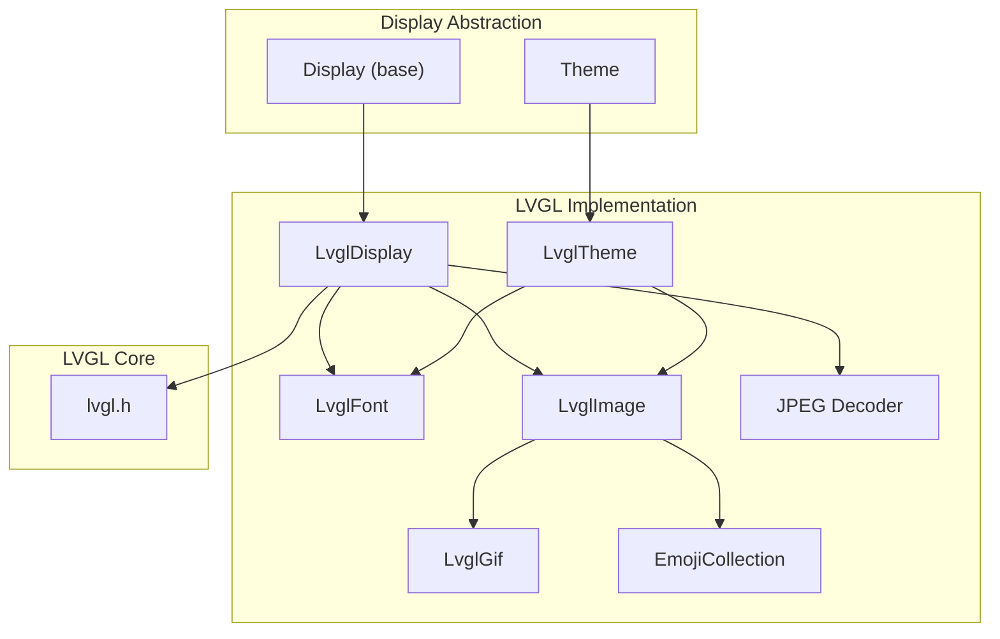
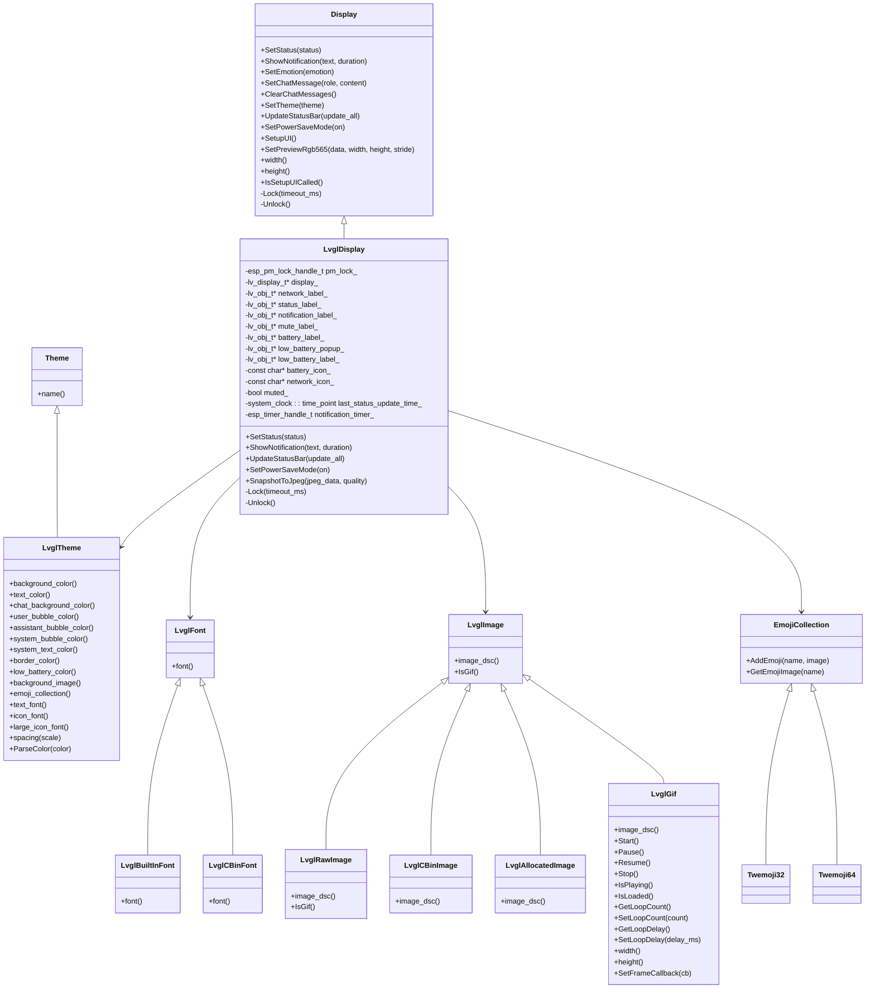
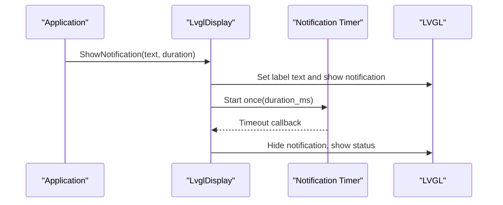
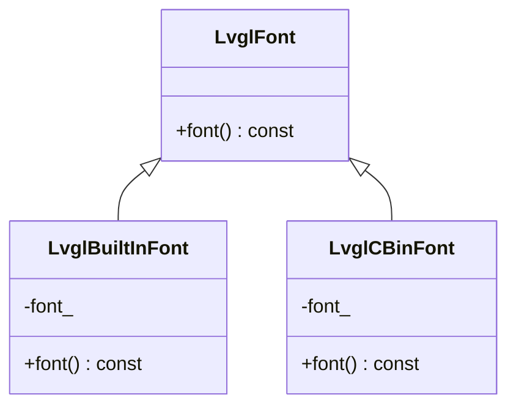
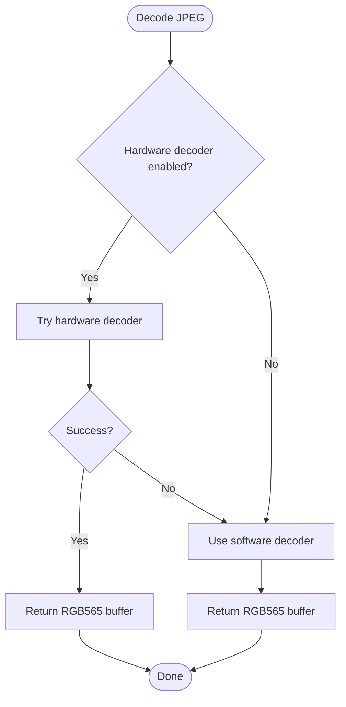
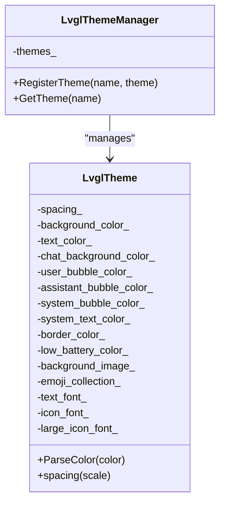
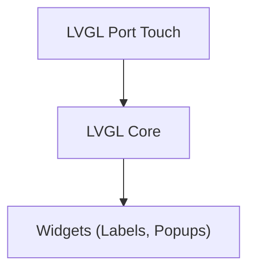
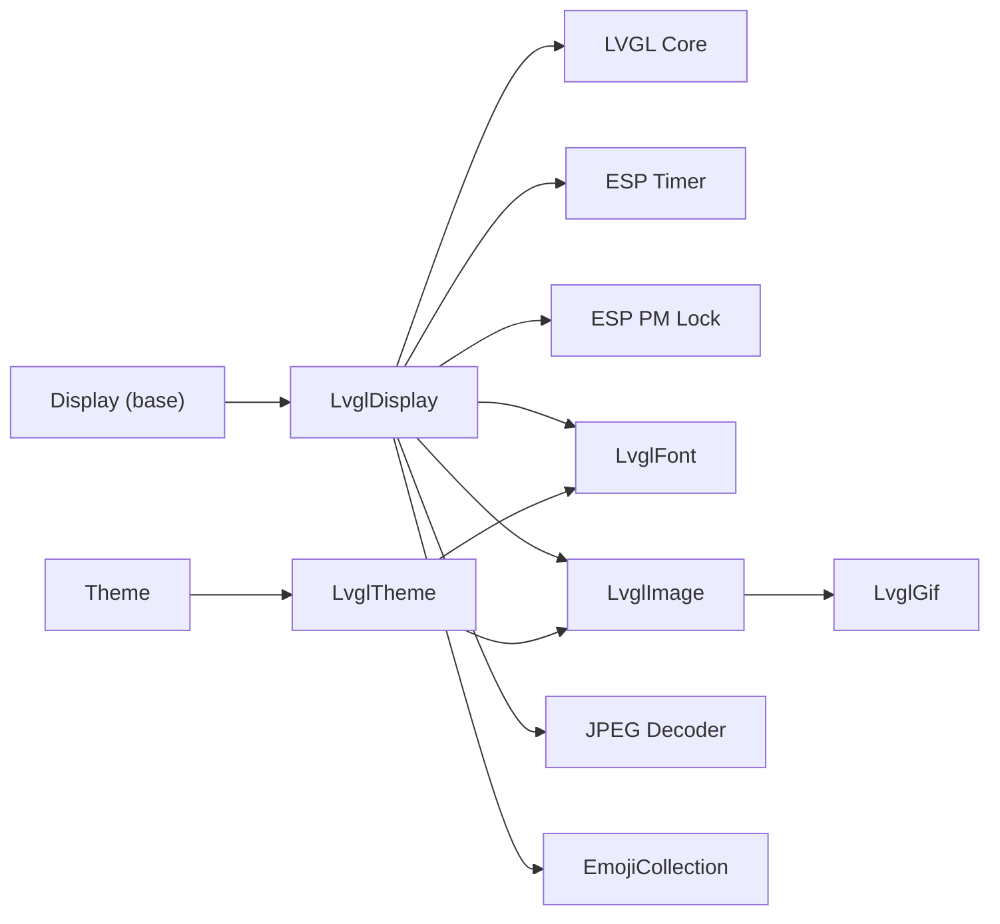

# LVGL Graphics Framework

<cite>
**Referenced Files in This Document**
- [lvgl_display.h](file://main/display/lvgl_display/lvgl_display.h)
- [lvgl_display.cc](file://main/display/lvgl_display/lvgl_display.cc)
- [lvgl_font.h](file://main/display/lvgl_display/lvgl_font.h)
- [lvgl_font.cc](file://main/display/lvgl_display/lvgl_font.cc)
- [lvgl_image.h](file://main/display/lvgl_display/lvgl_image.h)
- [lvgl_image.cc](file://main/display/lvgl_display/lvgl_image.cc)
- [lvgl_theme.h](file://main/display/lvgl_display/lvgl_theme.h)
- [lvgl_theme.cc](file://main/display/lvgl_display/lvgl_theme.cc)
- [lvgl_gif.h](file://main/display/lvgl_display/gif/lvgl_gif.h)
- [lvgl_gif.cc](file://main/display/lvgl_display/gif/lvgl_gif.cc)
- [jpeg_to_image.h](file://main/display/lvgl_display/jpg/jpeg_to_image.h)
- [jpeg_to_image.c](file://main/display/lvgl_display/jpg/jpeg_to_image.c)
- [emoji_collection.h](file://main/display/lvgl_display/emoji_collection.h)
- [emoji_collection.cc](file://main/display/lvgl_display/emoji_collection.cc)
- [display.h](file://main/display/display.h)
</cite>

## Table of Contents
1. [Introduction](#introduction)
2. [Project Structure](#project-structure)
3. [Core Components](#core-components)
4. [Architecture Overview](#architecture-overview)
5. [Detailed Component Analysis](#detailed-component-analysis)
6. [Dependency Analysis](#dependency-analysis)
7. [Performance Considerations](#performance-considerations)
8. [Troubleshooting Guide](#troubleshooting-guide)
9. [Conclusion](#conclusion)
10. [Appendices](#appendices)

## Introduction
This document describes the LVGL graphics framework implementation in the project, focusing on the LvglDisplay class, frame buffer management, rendering pipeline, and display driver integration. It also covers LVGL initialization patterns, object creation and widget management, font rendering with multiple sizes and encodings, image processing (JPEG decoding, GIF animation, RGB565 handling), theme system with color schemes and styles, touch input handling, gesture recognition, and user interaction patterns. Finally, it addresses performance optimization for embedded systems, memory management strategies, power-aware rendering, and practical examples for custom widgets, responsive layouts, and display abstraction integration.

## Project Structure
The LVGL integration is primarily located under main/display/lvgl_display, with supporting modules for fonts, images, themes, GIF animations, and JPEG decoding. The base display abstraction resides in main/display/display.h, and the LVGL-specific display implementation extends it.

**Diagram sources**
- [display.h:28-65](file://main/display/display.h#L28-L65)
- [lvgl_display.h:15-50](file://main/display/lvgl_display/lvgl_display.h#L15-L50)
- [lvgl_font.h:6-31](file://main/display/lvgl_display/lvgl_font.h#L6-L31)
- [lvgl_image.h:7-52](file://main/display/lvgl_display/lvgl_image.h#L7-L52)
- [lvgl_gif.h:13-117](file://main/display/lvgl_display/gif/lvgl_gif.h#L13-L117)
- [jpeg_to_image.h:10-56](file://main/display/lvgl_display/jpg/jpeg_to_image.h#L10-L56)
- [emoji_collection.h:14-32](file://main/display/lvgl_display/emoji_collection.h#L14-L32)
- [lvgl_theme.h:14-94](file://main/display/lvgl_display/lvgl_theme.h#L14-L94)

**Section sources**
- [display.h:28-65](file://main/display/display.h#L28-L65)
- [lvgl_display.h:15-50](file://main/display/lvgl_display/lvgl_display.h#L15-L50)

## Core Components
- LvglDisplay: Extends the base Display interface to integrate LVGL rendering, manage status bar widgets, notifications, power-save mode, and snapshot-to-JPEG capture. It uses a power management lock and an LVGL timer for notification visibility transitions.
- LvglFont: Abstracts LVGL font providers, with built-in and cbin-backed implementations.
- LvglImage: Wraps LVGL image descriptors for raw, cbin, source, and allocated images, with GIF detection for raw buffers.
- LvglGif: Implements animated GIF playback using gifdec, with loop controls, delays, and frame callbacks.
- JPEG Decoder: Hardware-accelerated and software fallback JPEG decoding to RGB565 with proper memory management.
- EmojiCollection: Manages emoji sets (Twemoji variants) and provides lookup by name.
- LvglTheme: Encapsulates theme properties (colors, fonts, images, spacing) and a registry for theme instances.

**Section sources**
- [lvgl_display.cc:18-70](file://main/display/lvgl_display/lvgl_display.cc#L18-L70)
- [lvgl_font.h:6-31](file://main/display/lvgl_display/lvgl_font.h#L6-L31)
- [lvgl_image.h:7-52](file://main/display/lvgl_display/lvgl_image.h#L7-L52)
- [lvgl_gif.h:13-117](file://main/display/lvgl_display/gif/lvgl_gif.h#L13-L117)
- [jpeg_to_image.h:10-56](file://main/display/lvgl_display/jpg/jpeg_to_image.h#L10-L56)
- [emoji_collection.h:14-32](file://main/display/lvgl_display/emoji_collection.h#L14-L32)
- [lvgl_theme.h:14-94](file://main/display/lvgl_display/lvgl_theme.h#L14-L94)

## Architecture Overview
The LVGL implementation follows a layered design:
- Base Display defines the contract for UI updates, theme switching, and power modes.
- LvglDisplay implements LVGL-specific UI lifecycle, timers, and resource cleanup.
- Fonts, Images, Themes, and GIFs are composable building blocks integrated via LvglDisplay.
- JPEG decoding supports external image ingestion into LVGL-compatible RGB565 frames.

**Diagram sources**
- [display.h:28-65](file://main/display/display.h#L28-L65)
- [lvgl_display.h:15-50](file://main/display/lvgl_display/lvgl_display.h#L15-L50)
- [lvgl_font.h:6-31](file://main/display/lvgl_display/lvgl_font.h#L6-L31)
- [lvgl_image.h:7-52](file://main/display/lvgl_display/lvgl_image.h#L7-L52)
- [lvgl_gif.h:13-117](file://main/display/lvgl_display/gif/lvgl_gif.h#L13-L117)
- [emoji_collection.h:14-32](file://main/display/lvgl_display/emoji_collection.h#L14-L32)
- [lvgl_theme.h:14-94](file://main/display/lvgl_display/lvgl_theme.h#L14-L94)

## Detailed Component Analysis

### LvglDisplay: Frame Buffer Management, Rendering Pipeline, and Driver Integration
- Initialization and lifecycle:
  - Creates an LVGL timer for notification visibility transitions and a power management lock to keep APB frequency at max during updates.
  - Destroys timer, labels, popups, and PM lock in destructor.
- Status and notifications:
  - Uses DisplayLockGuard to synchronize LVGL object updates.
  - Switches between status and notification labels with a one-shot timer to hide notifications after a delay.
- Status bar updates:
  - Updates mute icon based on audio codec volume.
  - Updates time label when idle and system time is valid.
  - Updates battery icon based on charge/discharge state and level bands.
  - Manages a low-battery popup with sound scheduling.
  - Updates network icon periodically, respecting allowed device states to avoid UART contention.
- Power save mode:
  - Switches emotion visuals to sleep/neutral depending on power mode.
- Snapshot to JPEG:
  - Captures active screen, swaps bytes for RGB565, and streams JPEG encoding via a callback to minimize peak memory usage.

**Diagram sources**
- [lvgl_display.cc:94-111](file://main/display/lvgl_display/lvgl_display.cc#L94-L111)
- [lvgl_display.cc:18-41](file://main/display/lvgl_display/lvgl_display.cc#L18-L41)

**Section sources**
- [lvgl_display.cc:18-70](file://main/display/lvgl_display/lvgl_display.cc#L18-L70)
- [lvgl_display.cc:72-111](file://main/display/lvgl_display/lvgl_display.cc#L72-L111)
- [lvgl_display.cc:113-219](file://main/display/lvgl_display/lvgl_display.cc#L113-L219)
- [lvgl_display.cc:224-232](file://main/display/lvgl_display/lvgl_display.cc#L224-L232)
- [lvgl_display.cc:234-274](file://main/display/lvgl_display/lvgl_display.cc#L234-L274)

### Font Rendering System: Sizes and Encodings
- Font abstractions:
  - LvglFont interface exposes a const lv_font_t pointer.
  - LvglBuiltInFont wraps a native LVGL font.
  - LvglCBinFont loads a font from cbin data.
- Integration pattern:
  - Themes expose text_font, icon_font, and large_icon_font for consistent typography across UI.
- Encoding support:
  - Fonts are loaded from cbin data, enabling scalable glyph rendering for various sizes and character sets.

**Diagram sources**
- [lvgl_font.h:6-31](file://main/display/lvgl_display/lvgl_font.h#L6-L31)
- [lvgl_font.cc:5-13](file://main/display/lvgl_display/lvgl_font.cc#L5-L13)

**Section sources**
- [lvgl_font.h:6-31](file://main/display/lvgl_display/lvgl_font.h#L6-L31)
- [lvgl_font.cc:5-13](file://main/display/lvgl_display/lvgl_font.cc#L5-L13)
- [lvgl_theme.h:20-51](file://main/display/lvgl_display/lvgl_theme.h#L20-L51)

### Image Processing: JPEG Decoding, GIF Animation, and RGB565 Handling
- JPEG decoding:
  - Hardware-accelerated path (when enabled) with fallback to software decoder.
  - Outputs RGB565-aligned buffers with stride handling for YUV subsampling.
  - Requires heap_caps_free for returned buffers.
- GIF animation:
  - Uses gifdec to decode frames into ARGB8888 canvas.
  - Manages playback state, loop counts, and optional loop delay with LVGL timers.
  - Exposes Start/Pause/Resume/Stop and frame callbacks.
- RGB565 handling:
  - SnapshotToJpeg swaps bytes to match LVGL expectations and streams JPEG output via a callback to reduce memory pressure.

**Diagram sources**
- [jpeg_to_image.c:245-264](file://main/display/lvgl_display/jpg/jpeg_to_image.c#L245-L264)
- [jpeg_to_image.h:10-56](file://main/display/lvgl_display/jpg/jpeg_to_image.h#L10-L56)

**Section sources**
- [jpeg_to_image.c:23-100](file://main/display/lvgl_display/jpg/jpeg_to_image.c#L23-L100)
- [jpeg_to_image.c:102-242](file://main/display/lvgl_display/jpg/jpeg_to_image.c#L102-L242)
- [jpeg_to_image.c:245-264](file://main/display/lvgl_display/jpg/jpeg_to_image.c#L245-L264)
- [lvgl_gif.cc:7-39](file://main/display/lvgl_display/gif/lvgl_gif.cc#L7-L39)
- [lvgl_gif.cc:55-80](file://main/display/lvgl_display/gif/lvgl_gif.cc#L55-L80)
- [lvgl_gif.cc:172-232](file://main/display/lvgl_display/gif/lvgl_gif.cc#L172-L232)
- [lvgl_display.cc:234-274](file://main/display/lvgl_display/lvgl_display.cc#L234-L274)

### Theme System: Color Schemes, Styles, and Component Styling
- Theme properties:
  - Colors: background, text, chat backgrounds, bubble colors, borders, low battery indicators.
  - Assets: background image, emoji collection, fonts (text, icon, large icon).
  - Spacing: configurable scale factor.
- Theme manager:
  - Singleton registry for named themes with registration and retrieval.
- Integration:
  - Themes are applied via SetTheme on Display, enabling consistent styling across widgets and components.

**Diagram sources**
- [lvgl_theme.h:14-94](file://main/display/lvgl_display/lvgl_theme.h#L14-L94)
- [lvgl_theme.cc:3-15](file://main/display/lvgl_display/lvgl_theme.cc#L3-L15)
- [lvgl_theme.cc:20-30](file://main/display/lvgl_display/lvgl_theme.cc#L20-L30)

**Section sources**
- [lvgl_theme.h:14-94](file://main/display/lvgl_display/lvgl_theme.h#L14-L94)
- [lvgl_theme.cc:3-15](file://main/display/lvgl_display/lvgl_theme.cc#L3-L15)
- [lvgl_theme.cc:20-30](file://main/display/lvgl_display/lvgl_theme.cc#L20-L30)

### Touch Input Handling, Gesture Recognition, and Interaction Patterns
- Touch integration:
  - The project includes LVGL port touch headers indicating LVGL Port touch integration is available.
  - While the core display implementation does not directly implement touch handlers here, LVGL’s input devices and gesture recognition are configured via the LVGL Port touch module.
- Interaction patterns:
  - Widgets managed by LvglDisplay (labels, popups) are updated through LVGL APIs guarded by DisplayLockGuard.
  - GIF playback and timers demonstrate reactive UI updates driven by LVGL timers and callbacks.

**Diagram sources**
- [lvgl_display.cc:18-41](file://main/display/lvgl_display/lvgl_display.cc#L18-L41)

**Section sources**
- [lvgl_display.cc:18-41](file://main/display/lvgl_display/lvgl_display.cc#L18-L41)

### LVGL Initialization, Object Creation, and Widget Management
- Initialization:
  - Timer and PM lock are created in constructor; destruction cleans up timers, objects, and locks.
- Object creation:
  - Status/notification/mute/battery/network labels are created and managed by the UI setup phase.
  - Low battery popup is conditionally shown/hidden based on battery state.
- Widget management:
  - Hidden/visible flags are toggled to switch between status and notification views.
  - Frame callbacks enable reactive updates for GIF animations.

**Section sources**
- [lvgl_display.cc:18-70](file://main/display/lvgl_display/lvgl_display.cc#L18-L70)
- [lvgl_display.cc:72-111](file://main/display/lvgl_display/lvgl_display.cc#L72-L111)
- [lvgl_display.cc:113-219](file://main/display/lvgl_display/lvgl_display.cc#L113-L219)
- [lvgl_gif.cc:168-170](file://main/display/lvgl_display/gif/lvgl_gif.cc#L168-L170)

### Emoji Collection and Character Encodings
- EmojiCollection provides a map-based lookup for emoji images.
- Twemoji32 and Twemoji64 load predefined emoji sets into memory-mapped descriptors.
- Integration with themes allows selecting emoji collections for consistent UI.

**Section sources**
- [emoji_collection.h:14-32](file://main/display/lvgl_display/emoji_collection.h#L14-L32)
- [emoji_collection.cc:9-28](file://main/display/lvgl_display/emoji_collection.cc#L9-L28)
- [emoji_collection.cc:53-75](file://main/display/lvgl_display/emoji_collection.cc#L53-L75)
- [emoji_collection.cc:101-123](file://main/display/lvgl_display/emoji_collection.cc#L101-L123)

## Dependency Analysis
- LvglDisplay depends on LVGL core, ESP-IDF timers and power management, and the base Display interface.
- Fonts and images are decoupled abstractions used by themes and UI components.
- GIF playback relies on gifdec and LVGL timers.
- JPEG decoding integrates hardware and software paths with strict memory ownership rules.

**Diagram sources**
- [display.h:28-65](file://main/display/display.h#L28-L65)
- [lvgl_display.h:15-50](file://main/display/lvgl_display/lvgl_display.h#L15-L50)
- [lvgl_gif.h:13-117](file://main/display/lvgl_display/gif/lvgl_gif.h#L13-L117)
- [jpeg_to_image.h:10-56](file://main/display/lvgl_display/jpg/jpeg_to_image.h#L10-L56)
- [emoji_collection.h:14-32](file://main/display/lvgl_display/emoji_collection.h#L14-L32)
- [lvgl_theme.h:14-94](file://main/display/lvgl_display/lvgl_theme.h#L14-L94)

**Section sources**
- [display.h:28-65](file://main/display/display.h#L28-L65)
- [lvgl_display.h:15-50](file://main/display/lvgl_display/lvgl_display.h#L15-L50)

## Performance Considerations
- Power-aware rendering:
  - Use a PM lock to maintain APB frequency during intensive updates; release immediately after drawing to save power.
- Memory management:
  - JPEG decoder returns buffers requiring heap_caps_free; always free returned pointers.
  - Allocated image buffers are freed in destructor; avoid leaking image descriptors.
- Minimizing memory spikes:
  - Use callback-based JPEG encoding to avoid pre-allocating large buffers.
  - GIF playback uses ARGB8888 canvas; keep animations short-lived and pause when not visible.
- Timers and UI updates:
  - One-shot notification timer prevents blocking and reduces CPU usage.
  - Update status bar selectively to avoid unnecessary redraws.

[No sources needed since this section provides general guidance]

## Troubleshooting Guide
- Notifications not hiding:
  - Verify notification timer is created and started; check that the callback hides notification and shows status.
- Battery icon not updating:
  - Ensure battery monitoring returns valid values and that the icon is updated only when changed.
- GIF not animating:
  - Confirm GIF is loaded, timer is created, and Start() is invoked; check frame delay logic and loop conditions.
- JPEG snapshot failures:
  - Ensure LV_USE_SNAPSHOT is enabled; verify draw buffer allocation and byte-swapping; confirm callback writes to output string.
- Memory leaks:
  - Free JPEG decoder buffers with heap_caps_free; ensure LvglAllocatedImage destructor runs; delete emoji images in EmojiCollection destructor.

**Section sources**
- [lvgl_display.cc:18-41](file://main/display/lvgl_display/lvgl_display.cc#L18-L41)
- [lvgl_display.cc:94-111](file://main/display/lvgl_display/lvgl_display.cc#L94-L111)
- [lvgl_display.cc:113-219](file://main/display/lvgl_display/lvgl_display.cc#L113-L219)
- [lvgl_gif.cc:55-80](file://main/display/lvgl_display/gif/lvgl_gif.cc#L55-L80)
- [lvgl_gif.cc:172-232](file://main/display/lvgl_display/gif/lvgl_gif.cc#L172-L232)
- [lvgl_display.cc:234-274](file://main/display/lvgl_display/lvgl_display.cc#L234-L274)
- [jpeg_to_image.c:245-264](file://main/display/lvgl_display/jpg/jpeg_to_image.c#L245-L264)
- [emoji_collection.cc:23-28](file://main/display/lvgl_display/emoji_collection.cc#L23-L28)
- [lvgl_image.cc:59-64](file://main/display/lvgl_display/lvgl_image.cc#L59-L64)

## Conclusion
The LVGL integration provides a robust, modular foundation for UI rendering on embedded targets. LvglDisplay orchestrates LVGL updates, timers, and power management, while LvglFont, LvglImage, LvglGif, and JPEG decoding form a cohesive media pipeline. Themes encapsulate styling and assets, and the base Display interface enables clean abstraction and testing. Following the memory and power guidelines ensures efficient operation on constrained devices.

[No sources needed since this section summarizes without analyzing specific files]

## Appendices

### Practical Examples
- Creating a custom widget:
  - Derive from LvglImage to wrap a custom descriptor or cbin asset; use LvglDisplay to add it to the active screen.
- Implementing responsive layouts:
  - Use theme spacing and font scaling to adapt to different resolutions; adjust label widths and padding accordingly.
- Integrating with display abstraction:
  - Implement Display::SetPreviewRgb565 to render RGB565 frames; leverage DisplayLockGuard for thread-safe LVGL updates.

[No sources needed since this section provides general guidance]