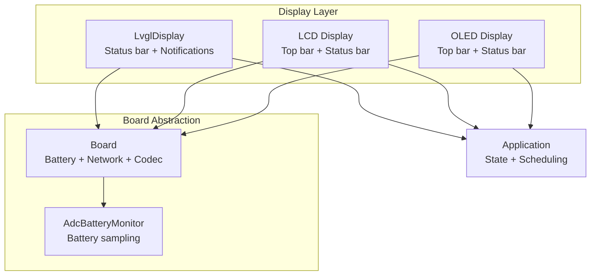
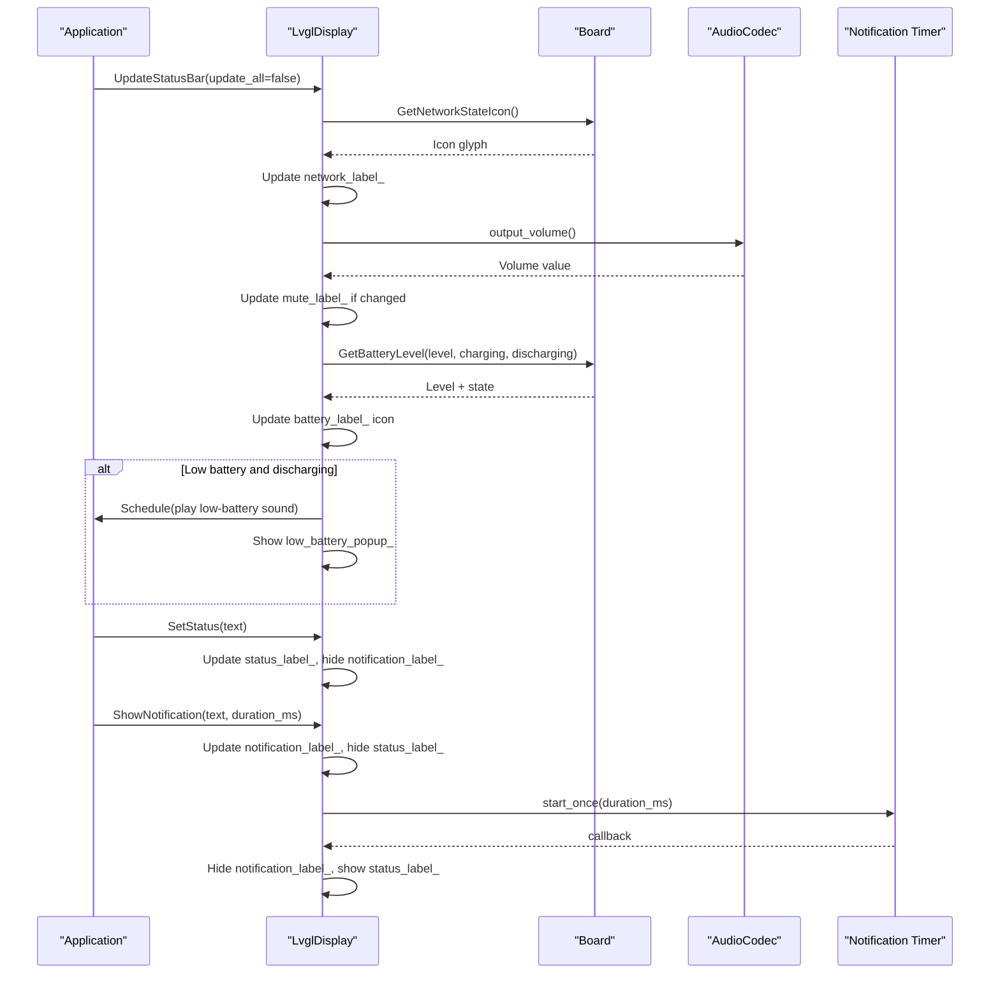
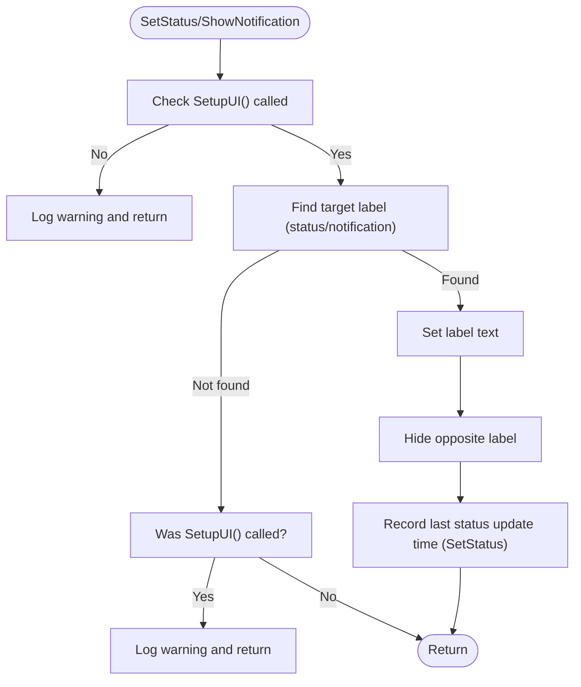
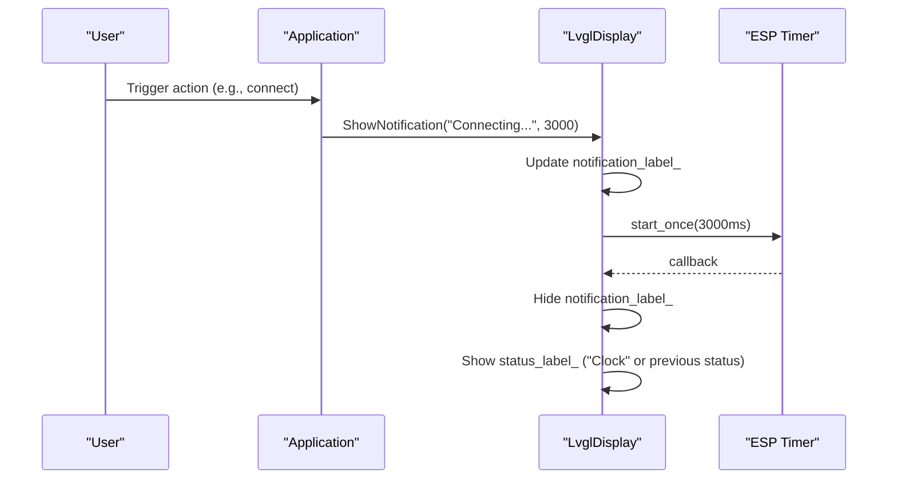
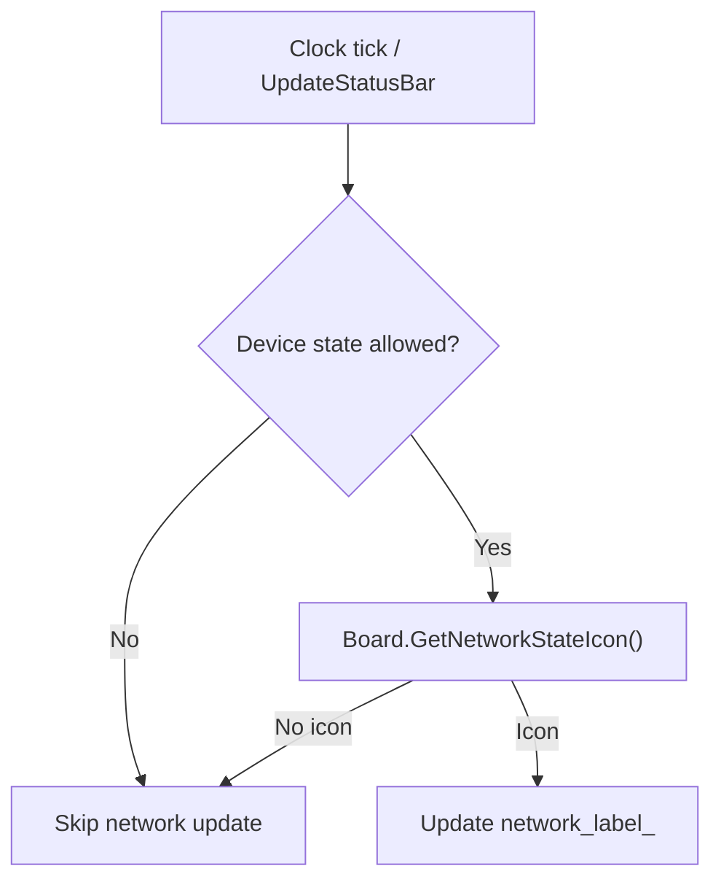
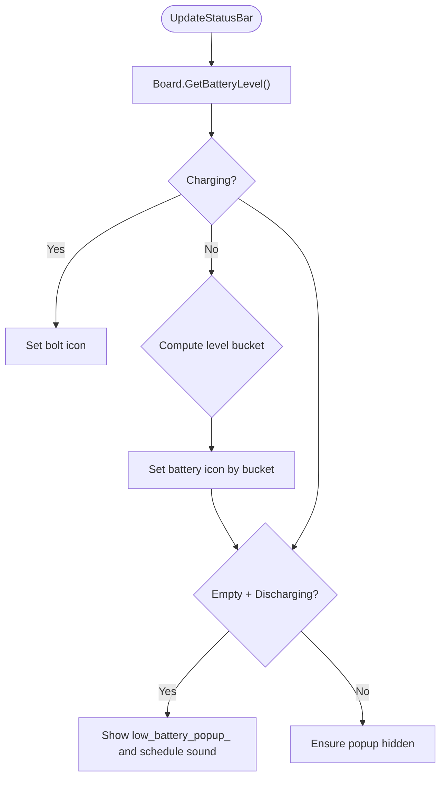
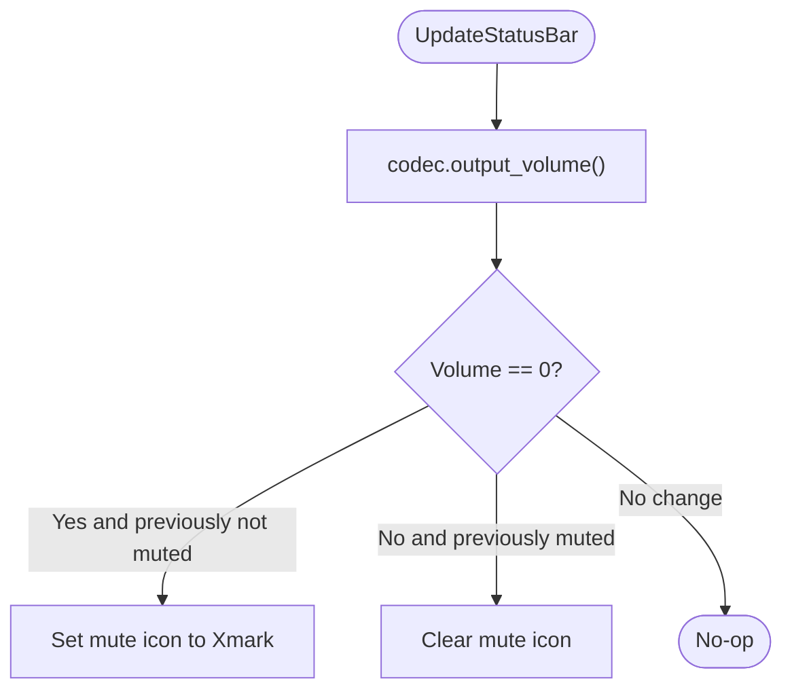
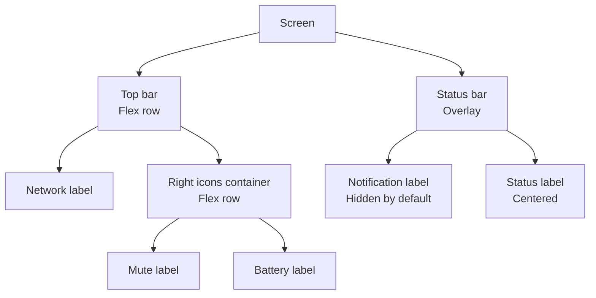
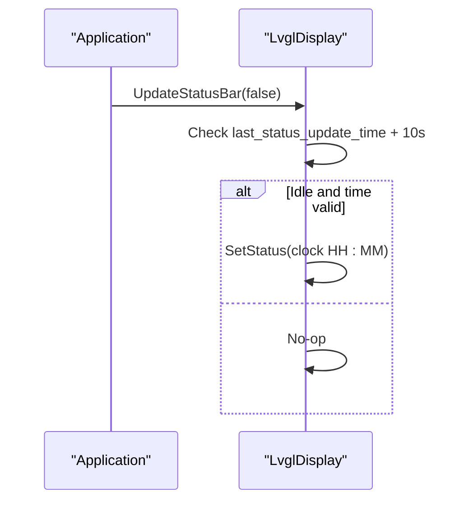
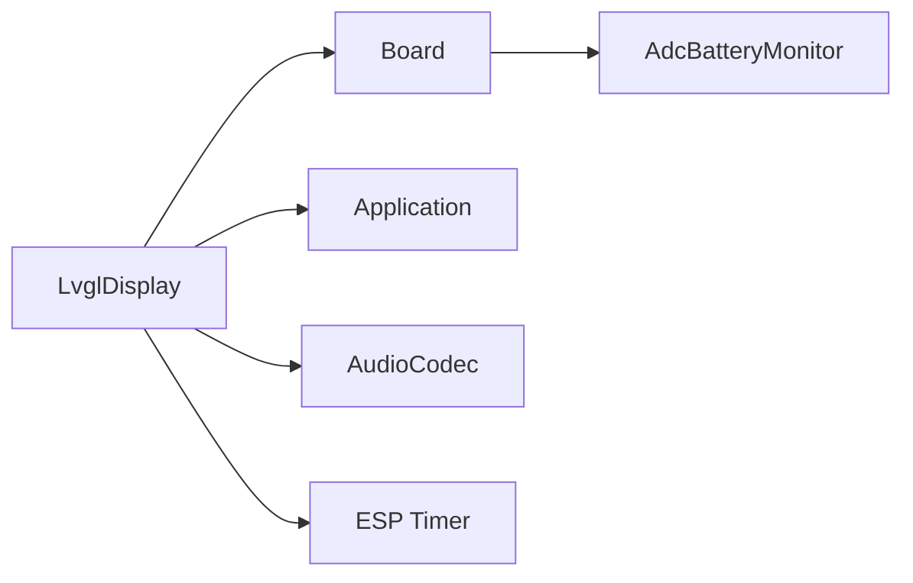

# Status Bar and System Indicators

<cite>
**Referenced Files in This Document**
- [lvgl_display.h](file://main/display/lvgl_display/lvgl_display.h)
- [lvgl_display.cc](file://main/display/lvgl_display/lvgl_display.cc)
- [lcd_display.cc](file://main/display/lcd_display.cc)
- [oled_display.cc](file://main/display/oled_display.cc)
- [board.h](file://main/boards/common/board.h)
- [adc_battery_monitor.h](file://main/boards/common/adc_battery_monitor.h)
- [adc_battery_monitor.cc](file://main/boards/common/adc_battery_monitor.cc)
- [device_state.h](file://main/device_state.h)
- [application.h](file://main/application.h)
- [system_info.h](file://main/system_info.h)
</cite>

## Table of Contents
1. [Introduction](#introduction)
2. [Project Structure](#project-structure)
3. [Core Components](#core-components)
4. [Architecture Overview](#architecture-overview)
5. [Detailed Component Analysis](#detailed-component-analysis)
6. [Dependency Analysis](#dependency-analysis)
7. [Performance Considerations](#performance-considerations)
8. [Troubleshooting Guide](#troubleshooting-guide)
9. [Conclusion](#conclusion)
10. [Appendices](#appendices)

## Introduction
This document explains the status bar interface and system indicators implementation for the embedded UI. It covers how the status label displays system messages and operational status, how notifications appear with timed dismissal, and how system indicators communicate network connectivity, battery level, mute status, and low battery warnings. It also documents layout management, icon integration via LVGL, real-time updates, accessibility and internationalization considerations, and responsive adaptation across screen sizes.

## Project Structure
The status bar and indicators are implemented in the display subsystem and integrated with board-level hardware and application state. The LVGL-based display layer exposes APIs for setting status text, showing notifications, updating the status bar, and managing power save visuals. The board abstraction supplies network and battery state, while the application orchestrates state transitions and schedules UI updates.

**Diagram sources**
- [lvgl_display.h:15-50](file://main/display/lvgl_display/lvgl_display.h#L15-L50)
- [lvgl_display.cc:113-219](file://main/display/lvgl_display/lvgl_display.cc#L113-L219)
- [lcd_display.cc:374-917](file://main/display/lcd_display.cc#L374-L917)
- [oled_display.cc:188-242](file://main/display/oled_display.cc#L188-L242)
- [board.h:52-93](file://main/boards/common/board.h#L52-L93)
- [adc_battery_monitor.h:9-28](file://main/boards/common/adc_battery_monitor.h#L9-L28)
- [application.h:42-177](file://main/application.h#L42-L177)

**Section sources**
- [lvgl_display.h:15-50](file://main/display/lvgl_display/lvgl_display.h#L15-L50)
- [lvgl_display.cc:113-219](file://main/display/lvgl_display/lvgl_display.cc#L113-L219)
- [lcd_display.cc:374-917](file://main/display/lcd_display.cc#L374-L917)
- [oled_display.cc:188-242](file://main/display/oled_display.cc#L188-L242)
- [board.h:52-93](file://main/boards/common/board.h#L52-L93)
- [adc_battery_monitor.h:9-28](file://main/boards/common/adc_battery_monitor.h#L9-L28)
- [application.h:42-177](file://main/application.h#L42-L177)

## Core Components
- Status label management
  - SetStatus: Displays a centered status message and hides notifications.
  - ShowNotification: Displays a temporary notification with a configurable duration and hides the status label.
- System indicators
  - Mute status: Toggles a mute icon based on audio codec output volume.
  - Battery level: Updates battery icon based on charging/discharging state and level.
  - Low battery warning: Shows a persistent popup and plays a warning sound when battery is low and discharging.
  - Network connectivity: Periodically updates the network icon based on board-provided state.
- Layout and integration
  - Top bar: Contains left-side network icon and right-side icons (mute, battery).
  - Status bar: Overlaid layer for centered status text and notifications.
  - Icons: Font Awesome icons rendered via LVGL labels.

**Section sources**
- [lvgl_display.h:20-46](file://main/display/lvgl_display/lvgl_display.h#L20-L46)
- [lvgl_display.cc:72-111](file://main/display/lvgl_display/lvgl_display.cc#L72-L111)
- [lvgl_display.cc:113-219](file://main/display/lvgl_display/lvgl_display.cc#L113-L219)
- [lcd_display.cc:401-424](file://main/display/lcd_display.cc#L401-L424)
- [lcd_display.cc:474-490](file://main/display/lcd_display.cc#L474-L490)
- [oled_display.cc:188-242](file://main/display/oled_display.cc#L188-L242)

## Architecture Overview
The status bar is composed of two layers:
- Top bar: Left-aligned network icon and right-aligned system icons (mute, battery).
- Status bar: Centered overlay for status text and notifications.

The display layer queries the board for current state and updates UI elements accordingly. Notifications are scheduled with timers and automatically dismissed. Low battery warnings are triggered by battery state checks and can schedule sounds through the application.

**Diagram sources**
- [lvgl_display.cc:113-219](file://main/display/lvgl_display/lvgl_display.cc#L113-L219)
- [lvgl_display.cc:94-111](file://main/display/lvgl_display/lvgl_display.cc#L94-L111)
- [lvgl_display.cc:72-88](file://main/display/lvgl_display/lvgl_display.cc#L72-L88)
- [board.h:82-83](file://main/boards/common/board.h#L82-L83)
- [application.h:175-176](file://main/application.h#L175-L176)

## Detailed Component Analysis

### Status Label Management
- SetStatus
  - Ensures UI is initialized, updates the status label text, unhides it, and hides the notification label.
  - Records the last status update time for periodic clock updates.
- ShowNotification
  - Updates the notification label text, unhides it, and hides the status label.
  - Starts a one-shot ESP-IDF timer to automatically hide the notification and restore the status label.

**Diagram sources**
- [lvgl_display.cc:72-88](file://main/display/lvgl_display/lvgl_display.cc#L72-L88)
- [lvgl_display.cc:94-111](file://main/display/lvgl_display/lvgl_display.cc#L94-L111)

**Section sources**
- [lvgl_display.cc:72-88](file://main/display/lvgl_display/lvgl_display.cc#L72-L88)
- [lvgl_display.cc:94-111](file://main/display/lvgl_display/lvgl_display.cc#L94-L111)

### Notification System
- Timed alerts
  - Notifications are displayed immediately and automatically hidden after a duration.
  - A one-shot ESP timer triggers the dismissal callback, restoring the previous status label.
- Priority handling
  - Notifications temporarily override the status label; when a new status arrives, it replaces the notification immediately.
- User interaction patterns
  - Notifications are passive; they do not accept user input. They are ideal for transient system messages.

**Diagram sources**
- [lvgl_display.cc:94-111](file://main/display/lvgl_display/lvgl_display.cc#L94-L111)
- [lvgl_display.cc:18-32](file://main/display/lvgl_display/lvgl_display.cc#L18-L32)

**Section sources**
- [lvgl_display.cc:94-111](file://main/display/lvgl_display/lvgl_display.cc#L94-L111)
- [lvgl_display.cc:18-32](file://main/display/lvgl_display/lvgl_display.cc#L18-L32)

### Network Connectivity Indicator
- The network icon is periodically updated (every 10 seconds) when the device is in allowed states (idle, starting, wifi-configuring, listening, activating).
- The board provides the icon glyph based on current network conditions.

**Diagram sources**
- [lvgl_display.cc:196-216](file://main/display/lvgl_display/lvgl_display.cc#L196-L216)
- [board.h:82](file://main/boards/common/board.h#L82)

**Section sources**
- [lvgl_display.cc:196-216](file://main/display/lvgl_display/lvgl_display.cc#L196-L216)
- [board.h:82](file://main/boards/common/board.h#L82)

### Battery Level Display and Low Battery Warning
- Battery level and charging state are queried from the board.
- Battery icon selection:
  - Charging: special bolt icon.
  - Discharging: stepped icons based on percentage ranges.
- Low battery warning:
  - When the lowest level icon is shown and the device is discharging, the low battery popup is shown and a warning sound is scheduled.
  - The popup is hidden when the battery level rises above the lowest threshold.

**Diagram sources**
- [lvgl_display.cc:153-194](file://main/display/lvgl_display/lvgl_display.cc#L153-L194)
- [application.h:175-176](file://main/application.h#L175-L176)

**Section sources**
- [lvgl_display.cc:153-194](file://main/display/lvgl_display/lvgl_display.cc#L153-L194)
- [application.h:175-176](file://main/application.h#L175-L176)

### Mute Status Visualization
- The mute icon reflects the audio codec’s output volume.
- When volume becomes zero, the mute icon is shown; when volume increases, the icon is cleared.

**Diagram sources**
- [lvgl_display.cc:118-133](file://main/display/lvgl_display/lvgl_display.cc#L118-L133)

**Section sources**
- [lvgl_display.cc:118-133](file://main/display/lvgl_display/lvgl_display.cc#L118-L133)

### Status Bar Layout Management and Icon Integration
- Top bar
  - Left-aligned network icon.
  - Right-aligned container for mute and battery icons.
- Status bar
  - Overlaid layer for centered status text and notifications.
  - Notifications are hidden by default and shown on demand; status text is shown otherwise.
- Icon integration
  - Icons are rendered as text glyphs using a dedicated icon font (Font Awesome).
  - LVGL labels are used for all indicators.

**Diagram sources**
- [lcd_display.cc:385-425](file://main/display/lcd_display.cc#L385-L425)
- [lcd_display.cc:898-917](file://main/display/lcd_display.cc#L898-L917)
- [oled_display.cc:188-242](file://main/display/oled_display.cc#L188-L242)

**Section sources**
- [lcd_display.cc:385-425](file://main/display/lcd_display.cc#L385-L425)
- [lcd_display.cc:898-917](file://main/display/lcd_display.cc#L898-L917)
- [oled_display.cc:188-242](file://main/display/oled_display.cc#L188-L242)

### Real-Time Status Updates
- Clock updates
  - When idle, the status label is refreshed every 10 seconds with the current time if valid system time is available.
- Power save visuals
  - Power save mode toggles chat and emotion visuals to reflect reduced activity.

**Diagram sources**
- [lvgl_display.cc:135-150](file://main/display/lvgl_display/lvgl_display.cc#L135-L150)

**Section sources**
- [lvgl_display.cc:135-150](file://main/display/lvgl_display/lvgl_display.cc#L135-L150)

### Implementing Custom Status Indicators
- Add a new indicator label in the top bar container alongside existing icons.
- Extend the update routine to fetch the indicator’s state from the board or codec and update the label text/icon.
- Ensure the indicator is hidden/shown conditionally and styled consistently with other icons.

Example steps:
- Create a new label in the top bar creation code.
- Add a branch in UpdateStatusBar to set the label’s text/icon based on the new state.
- Optionally integrate with the power management lock around UI updates.

**Section sources**
- [lcd_display.cc:401-424](file://main/display/lcd_display.cc#L401-L424)
- [lvgl_display.cc:113-219](file://main/display/lvgl_display/lvgl_display.cc#L113-L219)

### Configuring Notification Timing
- Adjust the duration parameter when calling ShowNotification to control how long a notification remains visible.
- The underlying timer is a one-shot ESP timer configured in microseconds; the duration is passed in milliseconds.

**Section sources**
- [lvgl_display.cc:94-111](file://main/display/lvgl_display/lvgl_display.cc#L94-L111)
- [lvgl_display.cc:18-32](file://main/display/lvgl_display/lvgl_display.cc#L18-L32)

### Integrating with System State Monitoring
- Use Application::Schedule to safely trigger UI actions from background tasks.
- Respect device state constraints when updating network icons to avoid resource contention during upgrades.

**Section sources**
- [application.h:78](file://main/application.h#L78)
- [lvgl_display.cc:200-207](file://main/display/lvgl_display/lvgl_display.cc#L200-L207)

## Dependency Analysis
The display layer depends on the board abstraction for hardware state and on the application for scheduling UI updates. Battery monitoring is encapsulated by the ADC battery monitor, which periodically samples and reports charging state and capacity.

**Diagram sources**
- [lvgl_display.cc:113-219](file://main/display/lvgl_display/lvgl_display.cc#L113-L219)
- [board.h:82-83](file://main/boards/common/board.h#L82-L83)
- [adc_battery_monitor.h:9-28](file://main/boards/common/adc_battery_monitor.h#L9-L28)

**Section sources**
- [lvgl_display.cc:113-219](file://main/display/lvgl_display/lvgl_display.cc#L113-L219)
- [board.h:82-83](file://main/boards/common/board.h#L82-L83)
- [adc_battery_monitor.h:9-28](file://main/boards/common/adc_battery_monitor.h#L9-L28)

## Performance Considerations
- Power management lock
  - UI updates acquire a power management lock to prevent frequency scaling during rendering, reducing UI stutter.
- Throttled network updates
  - Network icon updates occur every 10 seconds to minimize polling overhead.
- Conditional battery updates
  - Battery icon updates only when the icon changes to reduce unnecessary LVGL operations.
- One-shot timers
  - Notification timers are lightweight and deleted after use to avoid accumulation.

**Section sources**
- [lvgl_display.cc:152-153](file://main/display/lvgl_display/lvgl_display.cc#L152-L153)
- [lvgl_display.cc:196-216](file://main/display/lvgl_display/lvgl_display.cc#L196-L216)
- [lvgl_display.cc:171-175](file://main/display/lvgl_display/lvgl_display.cc#L171-L175)
- [lvgl_display.cc:43-48](file://main/display/lvgl_display/lvgl_display.cc#L43-L48)

## Troubleshooting Guide
- Status or notification not appearing
  - Ensure SetupUI() has been called before invoking SetStatus or ShowNotification.
  - Verify the corresponding label pointers are created during UI setup.
- Notifications not dismissing
  - Confirm the notification timer is created and started; check for timer errors.
- Mute icon not updating
  - Ensure the audio codec’s output volume changes are reflected; the mute icon updates only on state transitions.
- Network icon not updating
  - Check that the device state is among allowed states and that the board returns a valid icon.
- Low battery warning not triggering
  - Confirm battery readings indicate discharging at the lowest level; verify the popup is hidden initially and that sound playback is configured.

**Section sources**
- [lvgl_display.cc:72-88](file://main/display/lvgl_display/lvgl_display.cc#L72-L88)
- [lvgl_display.cc:94-111](file://main/display/lvgl_display/lvgl_display.cc#L94-L111)
- [lvgl_display.cc:18-32](file://main/display/lvgl_display/lvgl_display.cc#L18-L32)
- [lvgl_display.cc:118-133](file://main/display/lvgl_display/lvgl_display.cc#L118-L133)
- [lvgl_display.cc:196-216](file://main/display/lvgl_display/lvgl_display.cc#L196-L216)
- [lvgl_display.cc:177-194](file://main/display/lvgl_display/lvgl_display.cc#L177-L194)

## Conclusion
The status bar and system indicators provide a concise, real-time view of device state through a layered UI design. Status messages and notifications are managed with clear priorities and timing controls, while system indicators communicate network, battery, and audio state efficiently. The architecture cleanly separates concerns between display, board hardware, and application orchestration, enabling extensibility for additional indicators and robust operation under power constraints.

## Appendices

### Accessibility Considerations
- Text contrast and icon visibility
  - Ensure sufficient contrast between icons and backgrounds; leverage theme-aware color APIs exposed by the display layer.
- Alternative feedback
  - Combine visual indicators with audible alerts (as used for low battery) for users who rely on audio cues.
- Reduced motion
  - Avoid rapid animations; keep icon updates minimal and state-driven.

### Internationalization Support
- Status and notification text
  - Use localized strings for messages and pass translated text to SetStatus or ShowNotification.
- Language configuration
  - The project includes locale assets; ensure the selected language is applied before rendering status text.

**Section sources**
- [lvgl_display.cc:72-88](file://main/display/lvgl_display/lvgl_display.cc#L72-L88)
- [lvgl_display.cc:94-111](file://main/display/lvgl_display/lvgl_display.cc#L94-L111)

### Responsive Adaptation
- Flexible layouts
  - Use LVGL flex containers for the top bar and status bar to adapt to varying widths.
- Dynamic sizing
  - Scale notification label widths relative to screen width to maintain readability across resolutions.
- Orientation handling
  - Monitor orientation changes and recompute label widths and alignments accordingly.

**Section sources**
- [lcd_display.cc:385-425](file://main/display/lcd_display.cc#L385-L425)
- [lcd_display.cc:898-917](file://main/display/lcd_display.cc#L898-L917)