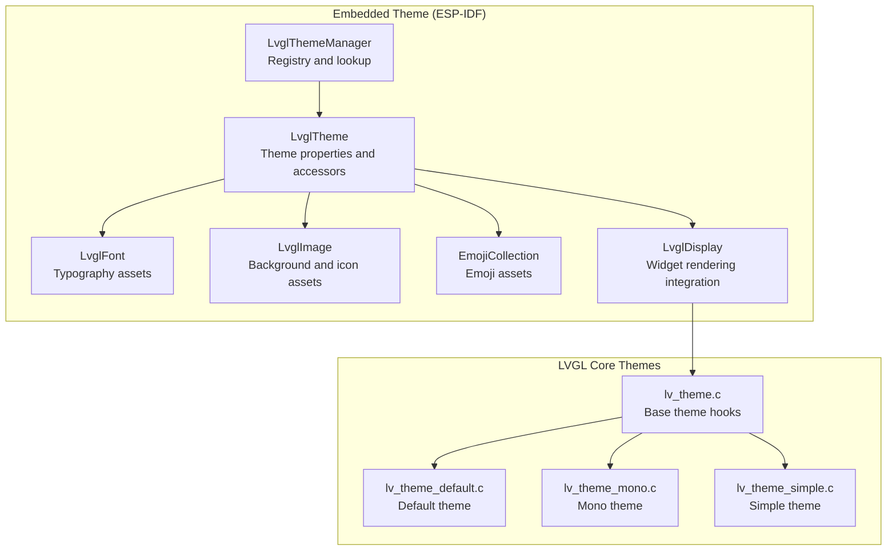
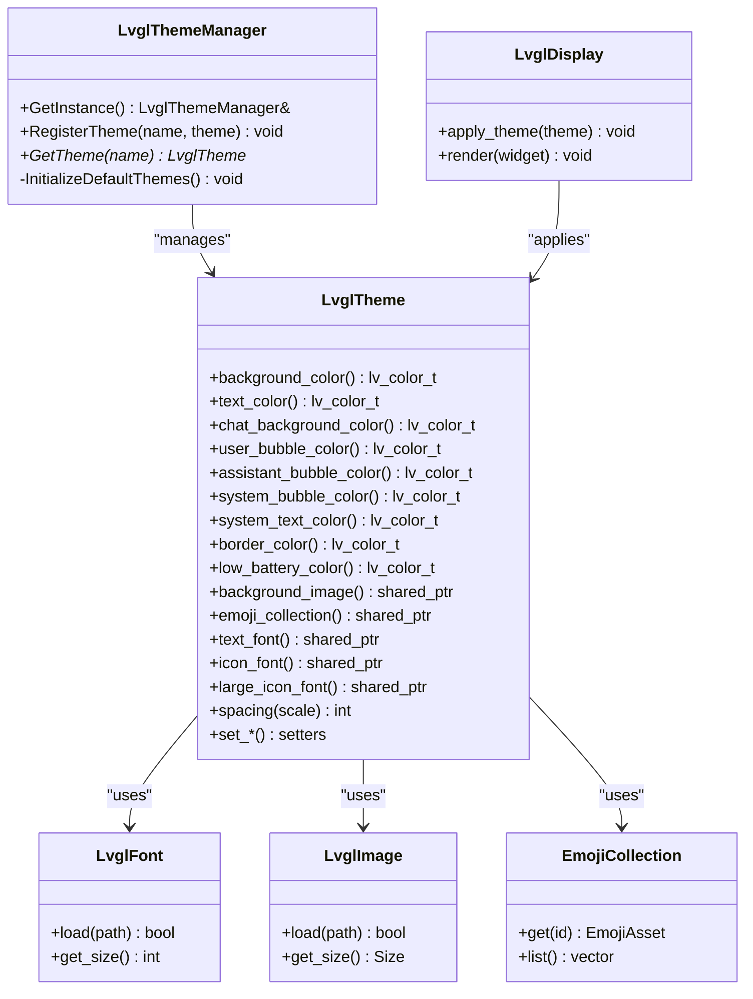
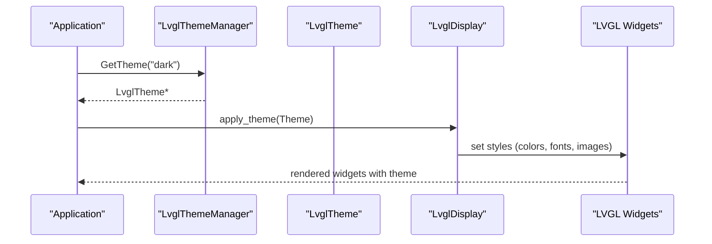
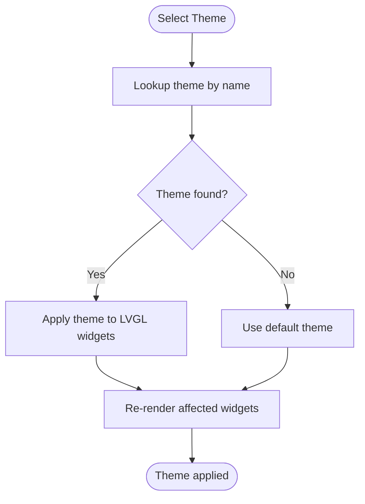
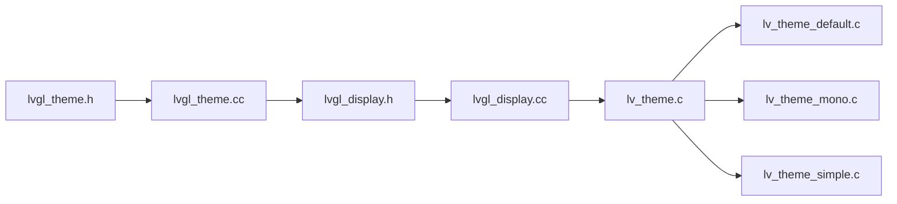

# Theme System and Styling

<cite>
**Referenced Files in This Document**
- [lvgl_theme.h](file://main/display/lvgl_display/lvgl_theme.h)
- [lvgl_theme.cc](file://main/display/lvgl_display/lvgl_theme.cc)
- [lvgl_display.h](file://main/display/lvgl_display/lvgl_display.h)
- [lvgl_display.cc](file://main/display/lvgl_display/lvgl_display.cc)
- [emoji_collection.h](file://main/display/lvgl_display/emoji_collection.h)
- [emoji_collection.cc](file://main/display/lvgl_display/emoji_collection.cc)
- [lvgl_font.h](file://main/display/lvgl_display/lvgl_font.h)
- [lvgl_font.cc](file://main/display/lvgl_display/lvgl_font.cc)
- [lvgl_image.h](file://main/display/lvgl_display/lvgl_image.h)
- [lvgl_image.cc](file://main/display/lvgl_display/lvgl_image.cc)
- [lv_theme.c](file://managed_components/lvgl__lvgl/src/themes/lv_theme.c)
- [lv_theme_default.c](file://managed_components/lvgl__lvgl/src/themes/default/lv_theme_default.c)
- [lv_theme_mono.c](file://managed_components/lvgl__lvgl/src/themes/mono/lv_theme_mono.c)
- [lv_theme_simple.c](file://managed_components/lvgl__lvgl/src/themes/simple/lv_theme_simple.c)
</cite>

## Table of Contents
1. [Introduction](#introduction)
2. [Project Structure](#project-structure)
3. [Core Components](#core-components)
4. [Architecture Overview](#architecture-overview)
5. [Detailed Component Analysis](#detailed-component-analysis)
6. [Dependency Analysis](#dependency-analysis)
7. [Performance Considerations](#performance-considerations)
8. [Troubleshooting Guide](#troubleshooting-guide)
9. [Conclusion](#conclusion)

## Introduction
This document describes the theme system implementation for both embedded LVGL-based displays and web-based styling. It explains how color palettes, typography scales, and component styling rules are organized, how the embedded theme integrates with LVGL widgets, and how runtime theme switching can be achieved. It also covers customization patterns, CSS-in-JS integration approaches, and performance considerations for memory usage and responsiveness across different screen sizes and orientations.

## Project Structure
The theme system spans two primary areas:
- Embedded LVGL theme classes and manager for ESP-IDF/LVGL integration
- LVGL built-in theme modules included via managed components

Key embedded theme files:
- Theme definition and manager for LVGL widgets
- Font, image, and emoji asset abstractions used by themes
- LVGL display integration that applies theme styles to widgets

LVGL theme modules:
- Base LVGL theme implementation and built-in theme variants

**Diagram sources**
- [lvgl_theme.h:14-94](file://main/display/lvgl_display/lvgl_theme.h#L14-L94)
- [lvgl_theme.cc:1-31](file://main/display/lvgl_display/lvgl_theme.cc#L1-L31)
- [lv_theme.c](file://managed_components/lvgl__lvgl/src/themes/lv_theme.c)
- [lv_theme_default.c](file://managed_components/lvgl__lvgl/src/themes/default/lv_theme_default.c)
- [lv_theme_mono.c](file://managed_components/lvgl__lvgl/src/themes/mono/lv_theme_mono.c)
- [lv_theme_simple.c](file://managed_components/lvgl__lvgl/src/themes/simple/lv_theme_simple.c)

**Section sources**
- [lvgl_theme.h:1-95](file://main/display/lvgl_display/lvgl_theme.h#L1-L95)
- [lvgl_theme.cc:1-31](file://main/display/lvgl_display/lvgl_theme.cc#L1-L31)
- [lv_theme.c](file://managed_components/lvgl__lvgl/src/themes/lv_theme.c)
- [lv_theme_default.c](file://managed_components/lvgl__lvgl/src/themes/default/lv_theme_default.c)
- [lv_theme_mono.c](file://managed_components/lvgl__lvgl/src/themes/mono/lv_theme_mono.c)
- [lv_theme_simple.c:1-95](file://main/display/lvgl_display/lvgl_theme.h#L1-L95)

## Core Components
This section documents the embedded theme classes and their responsibilities, along with LVGL theme integration points.

- LvglTheme: Encapsulates theme properties such as colors, spacing, fonts, images, and emoji collections. Provides setters/getters for LVGL color and resource properties.
- LvglThemeManager: Singleton registry for named themes, enabling runtime theme switching by name.
- LvglFont, LvglImage, EmojiCollection: Asset abstractions used by themes to manage typography, backgrounds/icons, and emojis.
- LvglDisplay: Integrates theme resources into LVGL widget rendering.

Key embedded theme properties include:
- Color palette: background, text, chat bubbles, borders, low battery indicator
- Spacing scale: uniform spacing multiplier for consistent layouts
- Fonts: text, icon, and large icon fonts
- Assets: background image and emoji collection

LVGL theme integration:
- LVGL base theme hooks and built-in themes provide widget-level styling defaults. The embedded theme augments or overrides these defaults via the display integration layer.

**Section sources**
- [lvgl_theme.h:14-94](file://main/display/lvgl_display/lvgl_theme.h#L14-L94)
- [lvgl_theme.cc:1-31](file://main/display/lvgl_display/lvgl_theme.cc#L1-L31)
- [lvgl_display.h](file://main/display/lvgl_display/lvgl_display.h)
- [lvgl_display.cc](file://main/display/lvgl_display/lvgl_display.cc)
- [lv_theme.c](file://managed_components/lvgl__lvgl/src/themes/lv_theme.c)

## Architecture Overview
The embedded theme system composes theme properties into LVGL widget styles. The manager resolves the active theme by name, while the display layer applies fonts, colors, and assets to LVGL objects.

**Diagram sources**
- [lvgl_theme.h:14-94](file://main/display/lvgl_display/lvgl_theme.h#L14-L94)
- [lvgl_theme.cc:1-31](file://main/display/lvgl_display/lvgl_theme.cc#L1-L31)
- [lvgl_font.h](file://main/display/lvgl_display/lvgl_font.h)
- [lvgl_font.cc](file://main/display/lvgl_display/lvgl_font.cc)
- [lvgl_image.h](file://main/display/lvgl_display/lvgl_image.h)
- [lvgl_image.cc](file://main/display/lvgl_display/lvgl_image.cc)
- [emoji_collection.h](file://main/display/lvgl_display/emoji_collection.h)
- [emoji_collection.cc](file://main/display/lvgl_display/emoji_collection.cc)
- [lvgl_display.h](file://main/display/lvgl_display/lvgl_display.h)
- [lvgl_display.cc](file://main/display/lvgl_display/lvgl_display.cc)

## Detailed Component Analysis

### Embedded Theme Classes
- LvglTheme: Centralized theme property container with typed accessors for colors, spacing, fonts, images, and emoji collections. Includes a color parsing utility for hex strings.
- LvglThemeManager: Thread-safe singleton registry keyed by theme name, with initialization of default themes and lookup by name.

Implementation highlights:
- Property getters/setters enable decoupled access to theme values.
- Color parsing supports standard hex notation for theme authoring.
- Manager ensures single-instance access and safe registration/lookup.

**Section sources**
- [lvgl_theme.h:14-94](file://main/display/lvgl_display/lvgl_theme.h#L14-L94)
- [lvgl_theme.cc:1-31](file://main/display/lvgl_display/lvgl_theme.cc#L1-L31)

### LVGL Theme Integration
LVGL provides built-in theme modules that define widget-level styles. The embedded theme augments these defaults by applying theme properties during widget rendering.

Built-in themes:
- Base theme hooks
- Default theme
- Mono theme
- Simple theme

Integration pattern:
- The display layer queries the active theme from the manager and applies fonts, colors, and assets to LVGL widgets.
- Theme switching is performed by selecting a registered theme by name and re-applying styles.

**Diagram sources**
- [lvgl_theme.h:14-94](file://main/display/lvgl_display/lvgl_theme.h#L14-L94)
- [lvgl_theme.cc:1-31](file://main/display/lvgl_display/lvgl_theme.cc#L1-L31)
- [lvgl_display.h](file://main/display/lvgl_display/lvgl_display.h)
- [lvgl_display.cc](file://main/display/lvgl_display/lvgl_display.cc)
- [lv_theme.c](file://managed_components/lvgl__lvgl/src/themes/lv_theme.c)

**Section sources**
- [lv_theme.c](file://managed_components/lvgl__lvgl/src/themes/lv_theme.c)
- [lv_theme_default.c](file://managed_components/lvgl__lvgl/src/themes/default/lv_theme_default.c)
- [lv_theme_mono.c](file://managed_components/lvgl__lvgl/src/themes/mono/lv_theme_mono.c)
- [lv_theme_simple.c](file://managed_components/lvgl__lvgl/src/themes/simple/lv_theme_simple.c)

### Typography and Assets
Typography and assets are encapsulated in dedicated classes:
- LvglFont: loads and manages font metrics and sizes.
- LvglImage: loads and manages image assets for backgrounds and icons.
- EmojiCollection: provides access to emoji assets used by themed UI.

These abstractions allow themes to remain portable across different hardware configurations and asset pipelines.

**Section sources**
- [lvgl_font.h](file://main/display/lvgl_display/lvgl_font.h)
- [lvgl_font.cc](file://main/display/lvgl_display/lvgl_font.cc)
- [lvgl_image.h](file://main/display/lvgl_display/lvgl_image.h)
- [lvgl_image.cc](file://main/display/lvgl_display/lvgl_image.cc)
- [emoji_collection.h](file://main/display/lvgl_display/emoji_collection.h)
- [emoji_collection.cc](file://main/display/lvgl_display/emoji_collection.cc)

### Runtime Theme Switching
Runtime switching is supported by:
- Registering multiple themes under distinct names
- Resolving the active theme by name
- Re-applying theme resources to LVGL widgets

This enables dynamic theme updates without restarting the UI.

**Diagram sources**
- [lvgl_theme.h:14-94](file://main/display/lvgl_display/lvgl_theme.h#L14-L94)
- [lvgl_theme.cc:1-31](file://main/display/lvgl_display/lvgl_theme.cc#L1-L31)

**Section sources**
- [lvgl_theme.h:14-94](file://main/display/lvgl_display/lvgl_theme.h#L14-L94)
- [lvgl_theme.cc:1-31](file://main/display/lvgl_display/lvgl_theme.cc#L1-L31)

## Dependency Analysis
The embedded theme system depends on LVGL’s theme hooks and built-in themes. The display layer bridges theme properties to LVGL widget rendering.

**Diagram sources**
- [lvgl_theme.h:1-95](file://main/display/lvgl_display/lvgl_theme.h#L1-L95)
- [lvgl_theme.cc:1-31](file://main/display/lvgl_display/lvgl_theme.cc#L1-L31)
- [lvgl_display.h](file://main/display/lvgl_display/lvgl_display.h)
- [lvgl_display.cc](file://main/display/lvgl_display/lvgl_display.cc)
- [lv_theme.c](file://managed_components/lvgl__lvgl/src/themes/lv_theme.c)
- [lv_theme_default.c](file://managed_components/lvgl__lvgl/src/themes/default/lv_theme_default.c)
- [lv_theme_mono.c](file://managed_components/lvgl__lvgl/src/themes/mono/lv_theme_mono.c)
- [lv_theme_simple.c](file://managed_components/lvgl__lvgl/src/themes/simple/lv_theme_simple.c)

**Section sources**
- [lvgl_theme.h:1-95](file://main/display/lvgl_display/lvgl_theme.h#L1-L95)
- [lvgl_theme.cc:1-31](file://main/display/lvgl_display/lvgl_theme.cc#L1-L31)
- [lvgl_display.h](file://main/display/lvgl_display/lvgl_display.h)
- [lvgl_display.cc](file://main/display/lvgl_display/lvgl_display.cc)
- [lv_theme.c](file://managed_components/lvgl__lvgl/src/themes/lv_theme.c)

## Performance Considerations
- Memory usage: Fonts, images, and emoji collections should be loaded once and reused across widgets to minimize memory footprint. Consider asset compression and caching strategies appropriate for embedded targets.
- Rendering efficiency: Prefer theme property reuse (e.g., shared fonts and colors) to reduce style recalculations. Batch widget updates when switching themes to avoid flicker and redundant redraws.
- Theme switching cost: Keep theme switching lightweight by updating only changed properties and deferring expensive operations until necessary.
- Responsive design: Use the spacing scale consistently to adapt layouts across different screen sizes and orientations. Maintain readable typography by scaling fonts proportionally.

[No sources needed since this section provides general guidance]

## Troubleshooting Guide
Common issues and resolutions:
- Theme not found: Verify the theme is registered under the expected name before lookup.
- Incorrect colors: Ensure color hex strings are properly formatted and parsed.
- Missing assets: Confirm font, image, and emoji assets are loaded and accessible before applying them in the theme.
- Widget style inconsistencies: Re-apply theme after switching to ensure all widgets reflect the new style.

**Section sources**
- [lvgl_theme.cc:1-31](file://main/display/lvgl_display/lvgl_theme.cc#L1-L31)
- [lvgl_theme.h:14-94](file://main/display/lvgl_display/lvgl_theme.h#L14-L94)

## Conclusion
The embedded theme system combines a flexible property-driven theme model with LVGL’s built-in theme infrastructure to deliver consistent, customizable styling across devices. By centralizing theme properties, managing assets through dedicated classes, and integrating with LVGL’s theme hooks, the system supports runtime theme switching and scalable customization. For web-based styling, adopt a similar property-first approach with CSS-in-JS or modular SCSS to mirror embedded theme semantics and maintain cross-interface consistency.