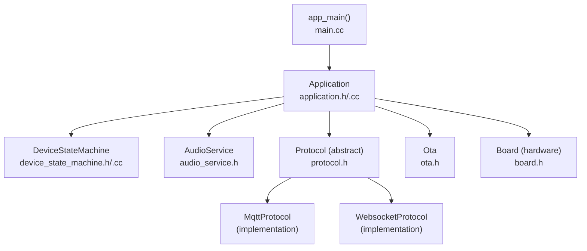
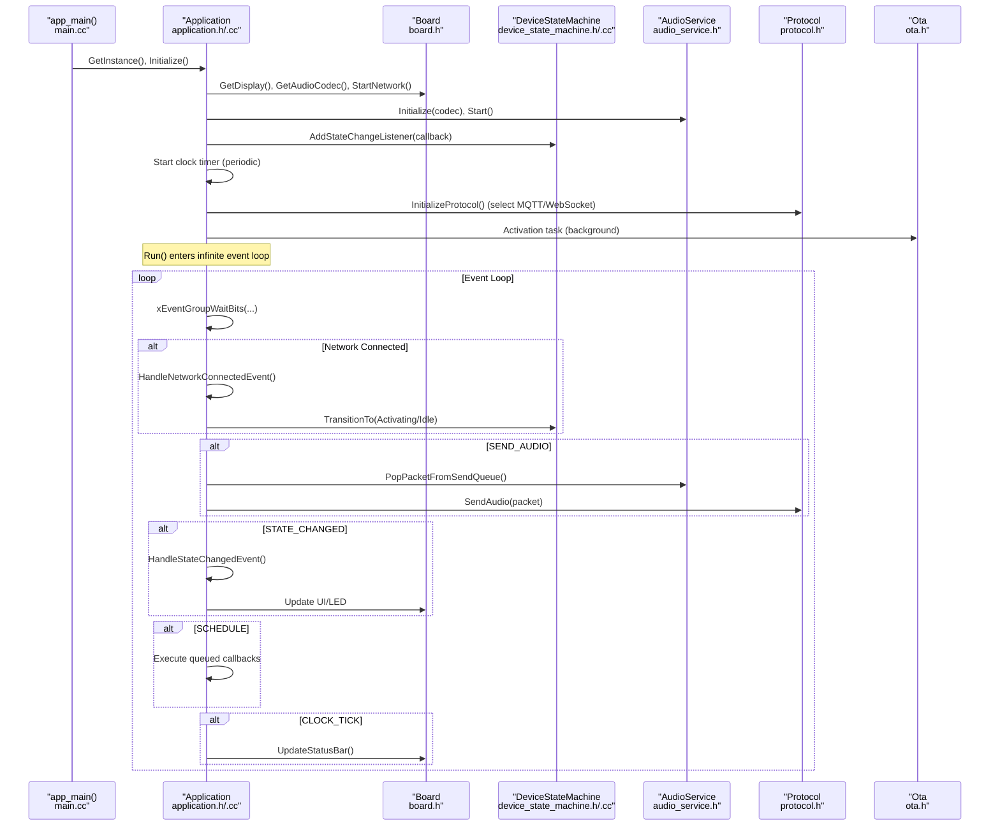
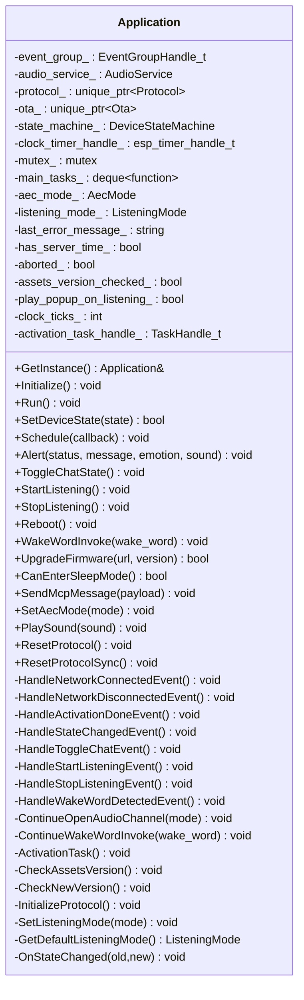
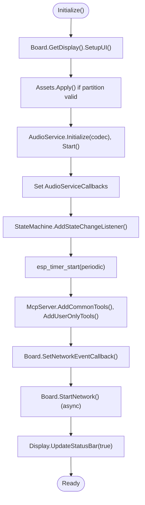
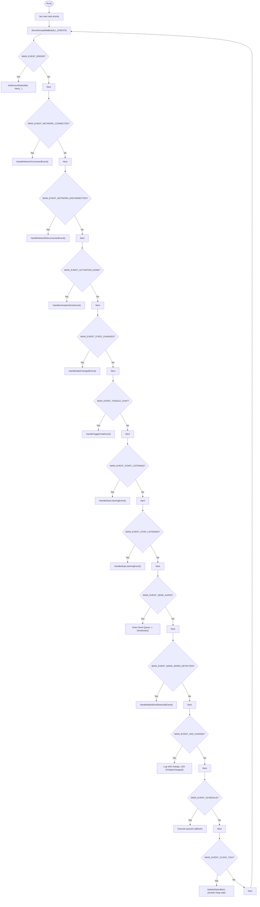
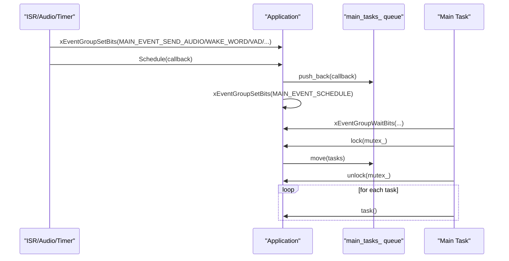
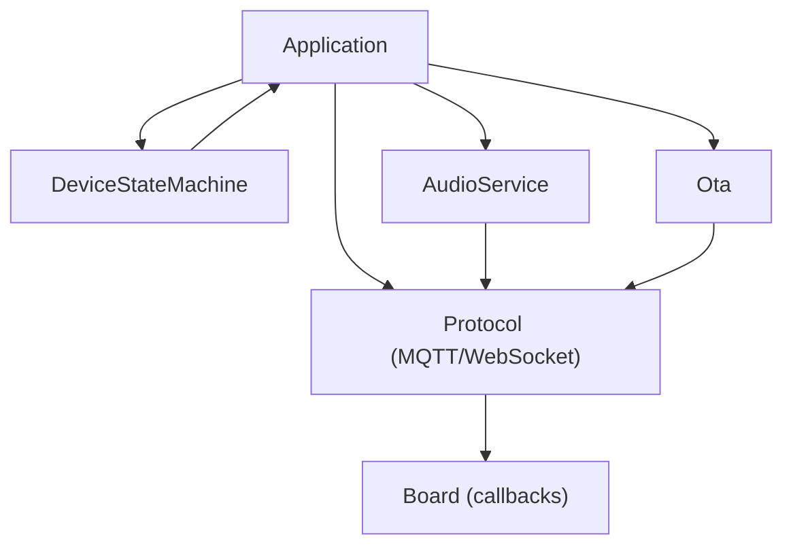
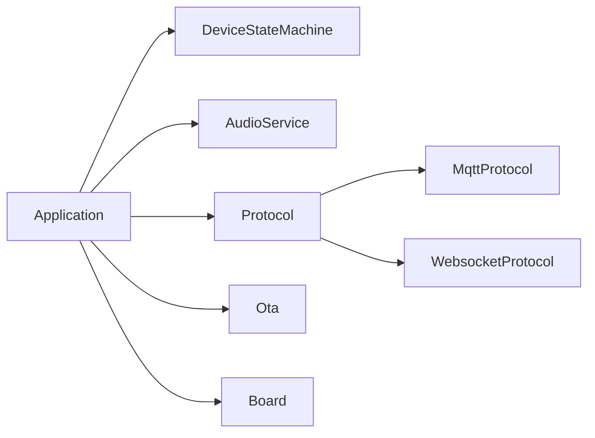

# Application Layer

<cite>
**Referenced Files in This Document**
- [application.h](file://main/application.h)
- [application.cc](file://main/application.cc)
- [main.cc](file://main/main.cc)
- [device_state_machine.h](file://main/device_state_machine.h)
- [device_state_machine.cc](file://main/device_state_machine.cc)
- [device_state.h](file://main/device_state.h)
- [audio_service.h](file://main/audio/audio_service.h)
- [protocol.h](file://main/protocols/protocol.h)
- [ota.h](file://main/ota.h)
- [board.h](file://main/boards/common/board.h)
- [system_info.cc](file://main/system_info.cc)
</cite>

## Table of Contents
1. [Introduction](#introduction)
2. [Project Structure](#project-structure)
3. [Core Components](#core-components)
4. [Architecture Overview](#architecture-overview)
5. [Detailed Component Analysis](#detailed-component-analysis)
6. [Dependency Analysis](#dependency-analysis)
7. [Performance Considerations](#performance-considerations)
8. [Troubleshooting Guide](#troubleshooting-guide)
9. [Conclusion](#conclusion)
10. [Appendices](#appendices)

## Introduction
This document explains the application layer centered on the Application class and the main entry point. It covers the singleton pattern, initialization sequence, and the main event loop architecture. It documents the event-driven design with FreeRTOS event groups, callback scheduling, and thread-safe operations. It also details component orchestration among audio service, protocol management, OTA updates, and state machine coordination. Memory management strategies, priority handling with TaskPriorityReset, and resource cleanup are included. Real-time constraints, error handling, and graceful shutdown procedures are addressed, along with practical examples for extending functionality and maintaining system stability.

## Project Structure
The application layer is implemented primarily in the main directory. The central Application class coordinates subsystems and runs the main event loop. Supporting components include:
- Device state machine for state transitions
- Audio service for audio capture, encoding, decoding, and playback
- Protocol abstraction for MQTT/WebSocket
- OTA module for version checking and upgrades
- Board abstraction for hardware-specific operations

**Diagram sources**
- [main.cc:14-29](file://main/main.cc#L14-L29)
- [application.h:42-177](file://main/application.h#L42-L177)
- [device_state_machine.h:17-81](file://main/device_state_machine.h#L17-L81)
- [audio_service.h:106-204](file://main/audio/audio_service.h#L106-L204)
- [protocol.h:44-95](file://main/protocols/protocol.h#L44-L95)
- [ota.h:10-59](file://main/ota.h#L10-L59)
- [board.h:52-68](file://main/boards/common/board.h#L52-L68)

**Section sources**
- [main.cc:14-29](file://main/main.cc#L14-L29)
- [application.h:42-177](file://main/application.h#L42-L177)

## Core Components
- Application: Singleton orchestrator implementing the main event loop, event dispatching, and cross-component coordination.
- DeviceStateMachine: Enforces state transitions and notifies observers.
- AudioService: Manages audio capture, encoding, decoding, playback, and wake word detection.
- Protocol: Abstract interface for transport protocols (MQTT/WebSocket).
- Ota: Handles version checks, activation challenges, and firmware upgrades.
- Board: Hardware abstraction for display, LED, networking, and power management.

Key responsibilities:
- Initialization: Board setup, display, audio, network callbacks, MCP tools registration, and periodic clock timer.
- Event Loop: Waits on FreeRTOS event group bits and dispatches to dedicated handlers.
- Scheduling: Thread-safe callback queue with mutex and event signaling.
- State Machine: Strict transitions and UI/LED updates per state.
- Protocol Management: Dynamic selection of MQTT or WebSocket based on OTA configuration.
- OTA Integration: Pre-activation asset checks, version verification, activation challenge handling, and upgrade flow.
- Resource Cleanup: Proper deletion of timers, event groups, and protocol instances.

**Section sources**
- [application.h:42-177](file://main/application.h#L42-L177)
- [application.cc:62-178](file://main/application.cc#L62-L178)
- [device_state_machine.h:17-81](file://main/device_state_machine.h#L17-L81)
- [audio_service.h:106-204](file://main/audio/audio_service.h#L106-L204)
- [protocol.h:44-95](file://main/protocols/protocol.h#L44-L95)
- [ota.h:10-59](file://main/ota.h#L10-L59)
- [board.h:52-68](file://main/boards/common/board.h#L52-L68)

## Architecture Overview
The Application class acts as the central hub:
- Initializes subsystems and registers callbacks.
- Runs a FreeRTOS-based event loop using an event group.
- Schedules work from interrupts or background tasks into the main task.
- Coordinates state transitions and UI updates.
- Manages protocol lifecycle and audio channel operations.
- Orchestrates OTA activation and upgrades.

**Diagram sources**
- [main.cc:14-29](file://main/main.cc#L14-L29)
- [application.cc:62-276](file://main/application.cc#L62-L276)
- [application.h:42-177](file://main/application.h#L42-L177)
- [device_state_machine.h:17-81](file://main/device_state_machine.h#L17-L81)
- [audio_service.h:106-204](file://main/audio/audio_service.h#L106-L204)
- [protocol.h:44-95](file://main/protocols/protocol.h#L44-L95)
- [ota.h:10-59](file://main/ota.h#L10-L59)

## Detailed Component Analysis

### Application Singleton and Main Entry Point
- Singleton pattern: Static instance with deleted copy constructor/assignment operator.
- Entry point: app_main initializes NVS, obtains Application singleton, calls Initialize, then Run.
- Priority: Sets main task priority early in Run.
- Event Group: Centralized event dispatching for audio, network, state changes, and scheduled tasks.

**Diagram sources**
- [application.h:42-177](file://main/application.h#L42-L177)
- [application.cc:24-56](file://main/application.cc#L24-L56)

**Section sources**
- [main.cc:14-29](file://main/main.cc#L14-L29)
- [application.h:42-177](file://main/application.h#L42-L177)
- [application.cc:180-276](file://main/application.cc#L180-L276)

### Initialization Sequence
- Board initialization: display setup, audio codec initialization, board startup callback, calibration check.
- Audio service: initialize and start, register callbacks for send queue availability, wake word detection, VAD changes.
- State machine: register state change listener to trigger UI updates.
- Clock timer: create and start periodic timer emitting clock ticks.
- MCP server: add common and user-only tools once during initialization.
- Network: set network event callback for UI notifications and state handling, start network asynchronously.
- Status bar: immediate update to reflect initial network state.

**Diagram sources**
- [application.cc:62-178](file://main/application.cc#L62-L178)

**Section sources**
- [application.cc:62-178](file://main/application.cc#L62-L178)

### Main Event Loop Architecture
- Priority: Elevates main task priority at loop start.
- Event mask: Aggregates all event bits for audio, network, state changes, wake word, VAD, schedule, and clock tick.
- Dispatch: Bitwise checks trigger dedicated handlers.
- Audio loop: Continuously drains send queue and forwards to protocol until failure.
- State changes: Trigger UI updates and LED notifications.
- Clock tick: Updates status bar and periodically prints heap statistics.

**Diagram sources**
- [application.cc:180-276](file://main/application.cc#L180-L276)

**Section sources**
- [application.cc:180-276](file://main/application.cc#L180-L276)

### Event-Driven Design and Thread Safety
- Event Groups: Centralized signaling for asynchronous events from audio callbacks, network events, and timers.
- Scheduling: Application::Schedule pushes lambdas into a protected queue and signals MAIN_EVENT_SCHEDULE. Handlers execute tasks atomically under a lock.
- Callback Registration: AudioService and Protocol register lambda callbacks that set event bits for thread-safe handoff to the main task.
- TaskPriorityReset: RAII wrapper to temporarily elevate task priority for critical sections, restoring original priority on destruction.

**Diagram sources**
- [application.cc:92-101](file://main/application.cc#L92-L101)
- [application.cc:235-263](file://main/application.cc#L235-L263)
- [application.h:180-192](file://main/application.h#L180-L192)

**Section sources**
- [application.cc:92-101](file://main/application.cc#L92-L101)
- [application.cc:235-263](file://main/application.cc#L235-L263)
- [application.h:180-192](file://main/application.h#L180-L192)

### Component Orchestration
- Audio Service: Manages encode/decode queues, wake word detection, VAD, and playback. Provides callbacks for send queue availability and wake word detection.
- Protocol Management: Dynamically selects MQTT or WebSocket based on OTA configuration. Registers callbacks for incoming audio/json, channel open/close, and network errors. Starts protocol after activation.
- OTA Updates: Pre-activation asset version check and download; version check with exponential backoff; activation challenge handling; firmware upgrade with progress reporting and graceful fallback.
- State Machine Coordination: Strict transitions enforced; UI and LED updates triggered by state changes; default listening mode determined by AEC configuration.

**Diagram sources**
- [application.cc:497-634](file://main/application.cc#L497-L634)
- [application.cc:358-495](file://main/application.cc#L358-L495)
- [device_state_machine.h:17-81](file://main/device_state_machine.h#L17-L81)
- [audio_service.h:106-204](file://main/audio/audio_service.h#L106-L204)
- [protocol.h:44-95](file://main/protocols/protocol.h#L44-L95)
- [ota.h:10-59](file://main/ota.h#L10-L59)

**Section sources**
- [application.cc:497-634](file://main/application.cc#L497-L634)
- [application.cc:358-495](file://main/application.cc#L358-L495)
- [device_state_machine.h:17-81](file://main/device_state_machine.h#L17-L81)
- [audio_service.h:106-204](file://main/audio/audio_service.h#L106-L204)
- [protocol.h:44-95](file://main/protocols/protocol.h#L44-L95)
- [ota.h:10-59](file://main/ota.h#L10-L59)

### Memory Management Strategies
- Smart pointers: protocol_ and ota_ use std::unique_ptr for automatic lifetime management.
- Event group and timer lifecycle: Created in constructor, deleted in destructor to prevent leaks.
- Audio queues: Fixed-capacity queues with bounded sizes to control memory footprint.
- Heap diagnostics: Periodic printing of free SRAM and minimum free SRAM for monitoring.

**Section sources**
- [application.cc:50-56](file://main/application.cc#L50-L56)
- [application.cc:152-153](file://main/application.cc#L152-L153)
- [audio_service.h:176-182](file://main/audio/audio_service.h#L176-L182)
- [system_info.cc:152-165](file://main/system_info.cc#L152-L165)

### Priority Handling with TaskPriorityReset
- RAII wrapper to temporarily raise task priority for critical sections and restore it automatically.
- Used around operations requiring deterministic timing or exclusive access.

**Section sources**
- [application.h:180-192](file://main/application.h#L180-L192)

### Resource Cleanup Procedures
- Destructor: Stops and deletes clock timer; deletes event group.
- ResetProtocol/ResetProtocolSync: Close audio channel if open, reset protocol pointer; synchronous variant executes immediately.
- Reboot: Close audio channel if open, reset protocol, stop audio service, delay, then restart.
- UpgradeFirmware: Close audio channel if open, stop audio service, perform upgrade, handle success/failure with UI feedback.

**Section sources**
- [application.cc:50-56](file://main/application.cc#L50-L56)
- [application.cc:1114-1131](file://main/application.cc#L1114-L1131)
- [application.cc:959-970](file://main/application.cc#L959-L970)
- [application.cc:972-1022](file://main/application.cc#L972-L1022)

### Main Task Execution and Inter-Task Communication
- Main task priority elevation at loop start ensures timely event processing.
- Inter-task communication via:
  - FreeRTOS event groups for signaling
  - AudioService callbacks setting event bits
  - Protocol callbacks invoking Application::Schedule
  - MCP server parsing and forwarding messages to Application

**Section sources**
- [application.cc:180-276](file://main/application.cc#L180-L276)
- [application.cc:513-543](file://main/application.cc#L513-L543)

### Real-Time Constraints and Error Handling
- Real-time audio: Dedicated encode/decode tasks, bounded queues, and periodic drain of send queue to maintain latency.
- Error propagation: Protocol network errors set MAIN_EVENT_ERROR; Application displays alert and transitions to idle.
- Graceful degradation: During OTA failures, audio service is restarted and operation continues.
- Power management: Adjusts power save levels based on activity (PERFORMANCE vs LOW_POWER).

**Section sources**
- [application.cc:202-205](file://main/application.cc#L202-L205)
- [application.cc:1006-1013](file://main/application.cc#L1006-L1013)
- [application.cc:528-543](file://main/application.cc#L528-L543)

### Extending Functionality and Stability
- Adding new event handlers: Define new MAIN_EVENT_* bit, set it from callbacks, and add a handler in Run() with appropriate state checks.
- Maintaining stability: Use Application::Schedule for UI updates and state changes; guard protocol operations with state checks; leverage DeviceStateMachine for valid transitions.

**Section sources**
- [application.h:20-34](file://main/application.h#L20-L34)
- [application.cc:180-276](file://main/application.cc#L180-L276)
- [device_state_machine.h:36-41](file://main/device_state_machine.h#L36-L41)

## Dependency Analysis
The Application class depends on:
- DeviceStateMachine for state transitions
- AudioService for audio pipeline
- Protocol for network transport
- Ota for activation and upgrades
- Board for hardware abstraction

**Diagram sources**
- [application.h:133-143](file://main/application.h#L133-L143)
- [application.cc:497-634](file://main/application.cc#L497-L634)

**Section sources**
- [application.h:133-143](file://main/application.h#L133-L143)
- [application.cc:497-634](file://main/application.cc#L497-L634)

## Performance Considerations
- Event-driven processing avoids blocking the main task; audio draining occurs only when signaled.
- Bounded audio queues prevent memory pressure; fixed frame durations optimize CPU usage.
- Periodic clock ticks keep UI responsive without impacting audio processing.
- Heap statistics printed periodically aid in tuning memory usage.

[No sources needed since this section provides general guidance]

## Troubleshooting Guide
- Network errors: MAIN_EVENT_ERROR triggers alert and idle state; verify network callbacks and protocol connectivity.
- OTA failures: UpgradeFirmware logs failure, restarts audio service, and continues operation; check network connectivity and storage.
- State transition warnings: DeviceStateMachine logs invalid transitions; ensure callers use SetDeviceState or proper event sequences.
- Audio stalls: Check send queue draining and playback queue emptiness; verify wake word and voice processing flags.

**Section sources**
- [application.cc:202-205](file://main/application.cc#L202-L205)
- [application.cc:1006-1013](file://main/application.cc#L1006-L1013)
- [device_state_machine.cc:116-131](file://main/device_state_machine.cc#L116-L131)
- [audio_service.h:176-182](file://main/audio/audio_service.h#L176-L182)

## Conclusion
The Application class provides a robust, event-driven foundation for coordinating audio, protocol, OTA, and state management. Its singleton pattern, FreeRTOS-based event loop, and thread-safe scheduling ensure reliable operation across real-time audio and network tasks. The design emphasizes stability, memory safety, and graceful error handling, enabling straightforward extension for new features while maintaining system integrity.

[No sources needed since this section summarizes without analyzing specific files]

## Appendices
- Device states enumeration and state machine transitions define the operational model.
- Protocol interface supports pluggable transports with standardized callbacks.
- AudioService defines audio pipeline queues and task boundaries.

**Section sources**
- [device_state.h:4-16](file://main/device_state.h#L4-L16)
- [device_state_machine.cc:34-102](file://main/device_state_machine.cc#L34-L102)
- [protocol.h:44-95](file://main/protocols/protocol.h#L44-L95)
- [audio_service.h:106-204](file://main/audio/audio_service.h#L106-L204)