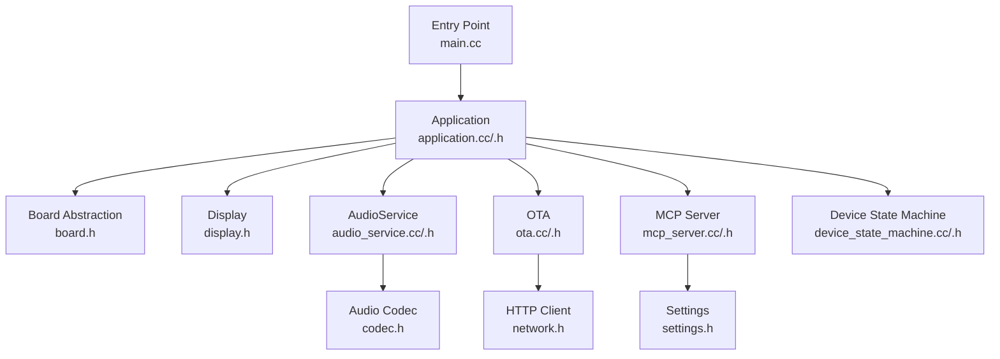
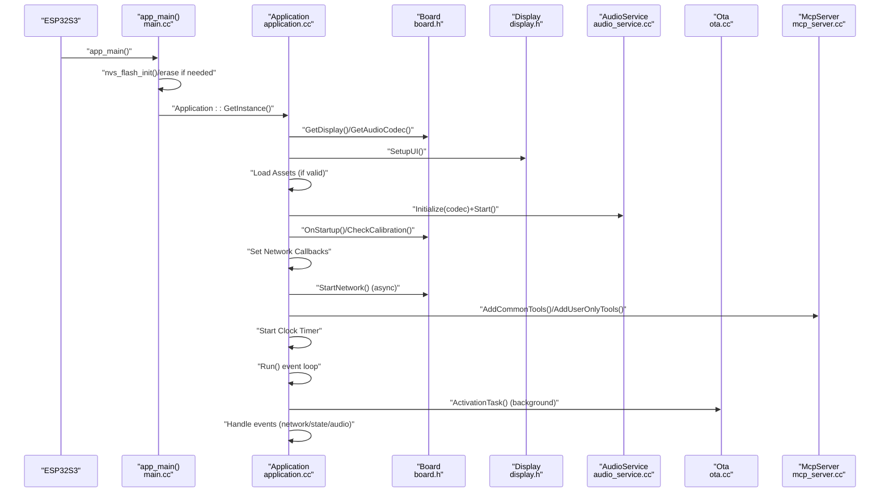
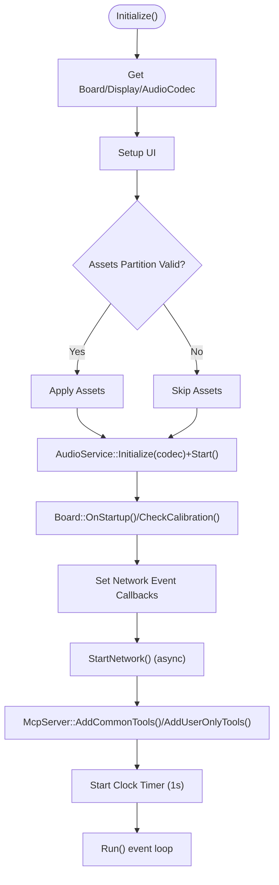
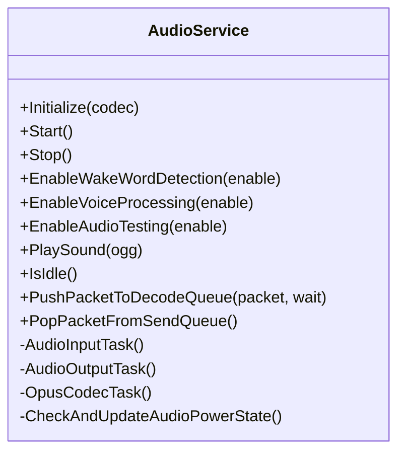
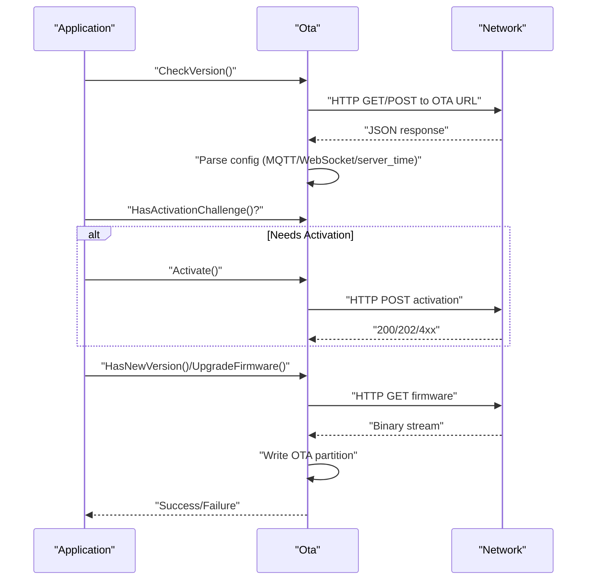
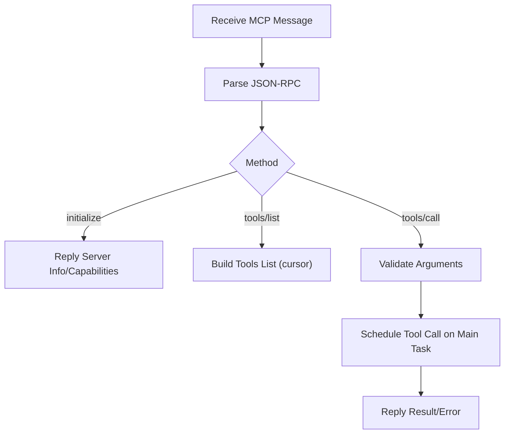
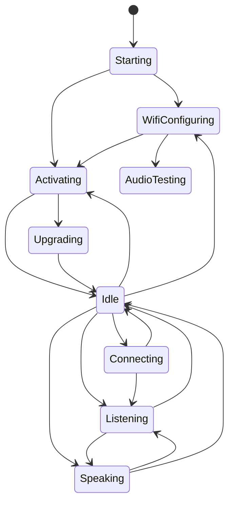
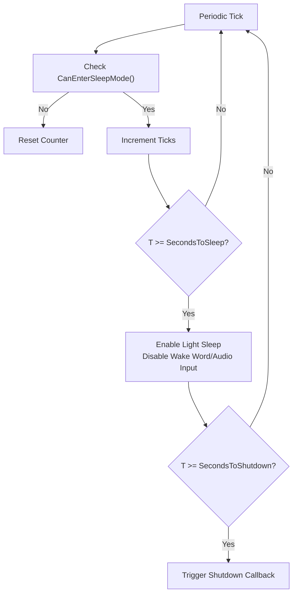
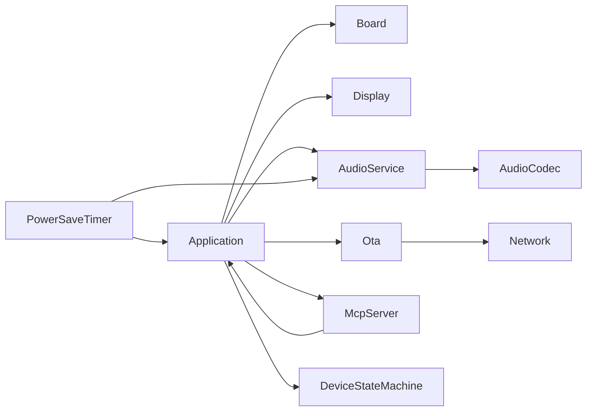

# Component Initialization and Lifecycle

<cite>
**Referenced Files in This Document**
- [main.cc](file://main/main.cc)
- [application.h](file://main/application.h)
- [application.cc](file://main/application.cc)
- [audio_service.h](file://main/audio/audio_service.h)
- [audio_service.cc](file://main/audio/audio_service.cc)
- [ota.h](file://main/ota.h)
- [ota.cc](file://main/ota.cc)
- [mcp_server.h](file://main/mcp_server.h)
- [mcp_server.cc](file://main/mcp_server.cc)
- [device_state.h](file://main/device_state.h)
- [device_state_machine.h](file://main/device_state_machine.h)
- [device_state_machine.cc](file://main/device_state_machine.cc)
- [power_save_timer.cc](file://main/boards/common/power_save_timer.cc)
- [system_info.cc](file://main/system_info.cc)
</cite>

## Table of Contents
1. [Introduction](#introduction)
2. [Project Structure](#project-structure)
3. [Core Components](#core-components)
4. [Architecture Overview](#architecture-overview)
5. [Detailed Component Analysis](#detailed-component-analysis)
6. [Dependency Analysis](#dependency-analysis)
7. [Performance Considerations](#performance-considerations)
8. [Troubleshooting Guide](#troubleshooting-guide)
9. [Conclusion](#conclusion)

## Introduction
This document explains the component initialization and lifecycle management of the embedded application. It covers the startup sequence from the main entry point through application initialization, component registration, and dependency injection. It documents initialization order dependencies, error propagation, and fallback mechanisms. It also details the lifecycle phases (construction, initialization, operation, and cleanup), the relationship between main task creation, FreeRTOS task scheduling, and component startup timing, and the shutdown sequence, resource deallocation, and graceful termination procedures. Finally, it addresses initialization failure handling, component health monitoring, recovery strategies, and practical examples for adding new components while maintaining proper dependency resolution.

## Project Structure
The application follows a layered architecture:
- Entry point initializes platform services and delegates to a singleton Application controller.
- Application orchestrates subsystems (display, audio, network, OTA, MCP server) via a deterministic initialization sequence.
- FreeRTOS tasks are used for audio processing, protocol handling, and background activation work.
- A state machine governs device state transitions and component reactions.

**Diagram sources**
- [main.cc:14-29](file://main/main.cc#L14-L29)
- [application.cc:62-178](file://main/application.cc#L62-L178)
- [audio_service.cc:62-123](file://main/audio/audio_service.cc#L62-L123)
- [ota.cc:77-245](file://main/ota.cc#L77-L245)
- [mcp_server.cc:33-143](file://main/mcp_server.cc#L33-L143)
- [device_state_machine.cc:108-131](file://main/device_state_machine.cc#L108-L131)

**Section sources**
- [main.cc:14-29](file://main/main.cc#L14-L29)
- [application.h:42-177](file://main/application.h#L42-L177)
- [application.cc:62-178](file://main/application.cc#L62-L178)

## Core Components
- Application: Central controller that initializes subsystems, manages FreeRTOS events, and coordinates state transitions.
- AudioService: Manages audio input/output, encoding/decoding, wake word detection, and power-aware operation.
- OTA: Handles firmware version checks, activation, and upgrades.
- MCP Server: Provides runtime tooling and diagnostics via Model Context Protocol.
- Device State Machine: Enforces valid state transitions and notifies listeners.
- Power Save Timer: Coordinates sleep/shutdown transitions and audio codec power gating.

**Section sources**
- [application.h:42-177](file://main/application.h#L42-L177)
- [audio_service.h:1-120](file://main/audio/audio_service.h#L1-L120)
- [ota.h:1-120](file://main/ota.h#L1-L120)
- [mcp_server.h:1-120](file://main/mcp_server.h#L1-L120)
- [device_state_machine.h:17-47](file://main/device_state_machine.h#L17-L47)
- [power_save_timer.cc:62-118](file://main/boards/common/power_save_timer.cc#L62-L118)

## Architecture Overview
The system initializes platform NVS, then constructs and runs the Application singleton. Application performs ordered initialization of display, assets, audio, board callbacks, and network. A periodic FreeRTOS timer triggers UI updates. Background tasks handle activation (OTA checks, protocol selection, and upgrades). The main event loop reacts to FreeRTOS events and state changes.

**Diagram sources**
- [main.cc:14-29](file://main/main.cc#L14-L29)
- [application.cc:62-178](file://main/application.cc#L62-L178)
- [application.cc:290-356](file://main/application.cc#L290-L356)
- [audio_service.cc:125-200](file://main/audio/audio_service.cc#L125-L200)
- [mcp_server.cc:33-143](file://main/mcp_server.cc#L33-L143)

## Detailed Component Analysis

### Application: Startup, Initialization, and Event Loop
- Construction: Creates an event group, configures AEC mode, and sets up a periodic clock timer.
- Initialization: 
  - Obtains Board singleton and Display/AudioCodec instances.
  - Sets up UI, loads assets, initializes and starts AudioService.
  - Calls board-level startup and calibration checks.
  - Registers network event callbacks and starts network asynchronously.
  - Adds MCP tools and starts a 1-second clock timer for UI updates.
- Event Loop: Elevates main task priority, waits on an event group bitmask, and dispatches handlers for network, state changes, audio events, and scheduled tasks. Errors are surfaced via alerts and state transitions.

**Diagram sources**
- [application.cc:62-178](file://main/application.cc#L62-L178)

**Section sources**
- [application.h:42-177](file://main/application.h#L42-L177)
- [application.cc:24-56](file://main/application.cc#L24-L56)
- [application.cc:62-178](file://main/application.cc#L62-L178)
- [application.cc:180-276](file://main/application.cc#L180-L276)

### AudioService: Initialization, Tasks, and Power Management
- Initialization: Configures Opus encoder/decoder, optional resamplers, and audio processor. Creates a periodic timer for power-aware input/output gating.
- Runtime: Starts three FreeRTOS tasks (audio input, audio output, opus codec) pinned to PSRAM stacks. Uses queues and condition variables to coordinate encoding/decoding and playback.
- Power Management: Periodic timer disables codec input/output when idle beyond thresholds.

**Diagram sources**
- [audio_service.h:1-120](file://main/audio/audio_service.h#L1-L120)
- [audio_service.cc:62-123](file://main/audio/audio_service.cc#L62-L123)
- [audio_service.cc:125-200](file://main/audio/audio_service.cc#L125-L200)
- [audio_service.cc:263-358](file://main/audio/audio_service.cc#L263-L358)
- [audio_service.cc:360-479](file://main/audio/audio_service.cc#L360-L479)
- [audio_service.cc:715-728](file://main/audio/audio_service.cc#L715-L728)

**Section sources**
- [audio_service.cc:62-123](file://main/audio/audio_service.cc#L62-L123)
- [audio_service.cc:125-200](file://main/audio/audio_service.cc#L125-L200)
- [audio_service.cc:263-358](file://main/audio/audio_service.cc#L263-L358)
- [audio_service.cc:360-479](file://main/audio/audio_service.cc#L360-L479)
- [audio_service.cc:715-728](file://main/audio/audio_service.cc#L715-L728)

### OTA: Version Checking, Activation, and Upgrades
- Version Check: Queries remote endpoint, parses JSON, and sets flags for MQTT/WebSocket configuration and server time.
- Activation: Supports device activation with HMAC challenge-response when applicable.
- Upgrade: Downloads firmware image in 4KB pages, writes OTA partition, validates, and sets boot partition.

**Diagram sources**
- [ota.cc:77-245](file://main/ota.cc#L77-L245)
- [ota.cc:458-492](file://main/ota.cc#L458-L492)
- [ota.cc:267-387](file://main/ota.cc#L267-L387)

**Section sources**
- [ota.cc:77-245](file://main/ota.cc#L77-L245)
- [ota.cc:267-387](file://main/ota.cc#L267-L387)
- [ota.cc:458-492](file://main/ota.cc#L458-L492)

### MCP Server: Tool Registration and Message Handling
- Tool Registration: Adds common tools (device status, audio/video/screen controls) and user-only tools (reboot, upgrade, snapshots).
- Message Parsing: Validates JSON-RPC 2.0, routes methods (initialize, tools/list, tools/call), and replies via Application’s message bus.
- Scheduling: Executes tool calls on the main task to maintain thread safety.

**Diagram sources**
- [mcp_server.cc:341-453](file://main/mcp_server.cc#L341-L453)
- [mcp_server.cc:472-526](file://main/mcp_server.cc#L472-L526)
- [mcp_server.cc:528-580](file://main/mcp_server.cc#L528-L580)

**Section sources**
- [mcp_server.cc:33-143](file://main/mcp_server.cc#L33-L143)
- [mcp_server.cc:341-453](file://main/mcp_server.cc#L341-L453)
- [mcp_server.cc:472-526](file://main/mcp_server.cc#L472-L526)
- [mcp_server.cc:528-580](file://main/mcp_server.cc#L528-L580)

### Device State Machine: Transitions and Notifications
- Validation: Enforces a strict state transition graph ensuring safe progression (e.g., Starting → WifiConfiguring/Activating, Idle → Connecting/Listening/Speaking).
- Notification: Invokes registered listeners on state changes for coordinated reactions across components.

**Diagram sources**
- [device_state_machine.cc:34-102](file://main/device_state_machine.cc#L34-L102)
- [device_state_machine.cc:108-131](file://main/device_state_machine.cc#L108-L131)

**Section sources**
- [device_state.h:4-16](file://main/device_state.h#L4-L16)
- [device_state_machine.h:17-47](file://main/device_state_machine.h#L17-L47)
- [device_state_machine.cc:34-102](file://main/device_state_machine.cc#L34-L102)
- [device_state_machine.cc:108-131](file://main/device_state_machine.cc#L108-L131)

### Power Save Timer: Sleep/Shutdown Coordination
- Sleep Check: Monitors idle conditions and CPU frequency policy; disables wake word detection and audio input prior to entering light sleep.
- Shutdown Request: Triggers shutdown callback when configured thresholds are met.

**Diagram sources**
- [power_save_timer.cc:62-118](file://main/boards/common/power_save_timer.cc#L62-L118)

**Section sources**
- [power_save_timer.cc:62-118](file://main/boards/common/power_save_timer.cc#L62-L118)

## Dependency Analysis
- Application depends on Board, Display, AudioService, OTA, MCP Server, and Device State Machine.
- AudioService depends on AudioCodec and uses ESP-IDF audio components and FreeRTOS timers.
- OTA depends on Network and Settings.
- MCP Server depends on Board, Display, and Application for scheduling and messaging.
- Power Save Timer depends on Application for state queries and AudioService for power gating.

**Diagram sources**
- [application.cc:62-178](file://main/application.cc#L62-L178)
- [audio_service.cc:62-123](file://main/audio/audio_service.cc#L62-L123)
- [ota.cc:77-245](file://main/ota.cc#L77-L245)
- [mcp_server.cc:33-143](file://main/mcp_server.cc#L33-L143)
- [power_save_timer.cc:62-118](file://main/boards/common/power_save_timer.cc#L62-L118)

**Section sources**
- [application.cc:62-178](file://main/application.cc#L62-L178)
- [audio_service.cc:62-123](file://main/audio/audio_service.cc#L62-L123)
- [ota.cc:77-245](file://main/ota.cc#L77-L245)
- [mcp_server.cc:33-143](file://main/mcp_server.cc#L33-L143)
- [power_save_timer.cc:62-118](file://main/boards/common/power_save_timer.cc#L62-L118)

## Performance Considerations
- Audio tasks use PSRAM-stacked static tasks to reduce heap pressure and improve real-time performance.
- AudioService uses queues with bounded capacity and condition variables to prevent blocking and backpressure.
- PowerSaveTimer periodically disables audio input/output and reduces CPU frequency to minimize power consumption.
- Application’s main task priority is elevated to ensure timely handling of events and UI updates.

[No sources needed since this section provides general guidance]

## Troubleshooting Guide
- NVS Initialization Failure: The entry point erases and reinitializes NVS if corruption is detected. Verify NVS partition health and retry initialization.
- Network Connectivity: Application surfaces network events to UI and state machine; monitor event bits and state transitions to diagnose connectivity issues.
- Audio Issues: Use AudioService’s power-aware gating and idle detection to identify codec input/output stalls. Inspect queue sizes and task logs.
- OTA Failures: Check version check errors, HTTP status codes, and image validation failures. Retry with exponential backoff and ensure sufficient free space.
- MCP Tool Errors: Validate JSON-RPC messages, tool arguments, and payload size limits; ensure tools are registered and scheduled on the main task.

**Section sources**
- [main.cc:16-23](file://main/main.cc#L16-L23)
- [application.cc:178-276](file://main/application.cc#L178-L276)
- [audio_service.cc:715-728](file://main/audio/audio_service.cc#L715-L728)
- [ota.cc:426-449](file://main/ota.cc#L426-L449)
- [mcp_server.cc:370-453](file://main/mcp_server.cc#L370-L453)

## Conclusion
The system employs a robust initialization sequence with explicit ordering and FreeRTOS-driven coordination. Application centralizes lifecycle management, state transitions, and event handling. AudioService and PowerSaveTimer ensure efficient resource usage, while OTA and MCP Server provide upgrade and diagnostics capabilities. The design supports graceful degradation, error propagation, and recovery strategies through state machines and event-driven loops.