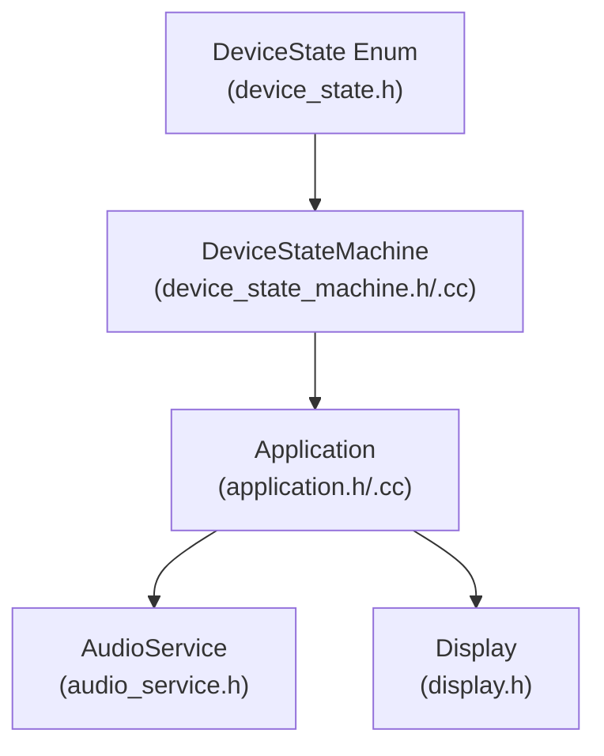
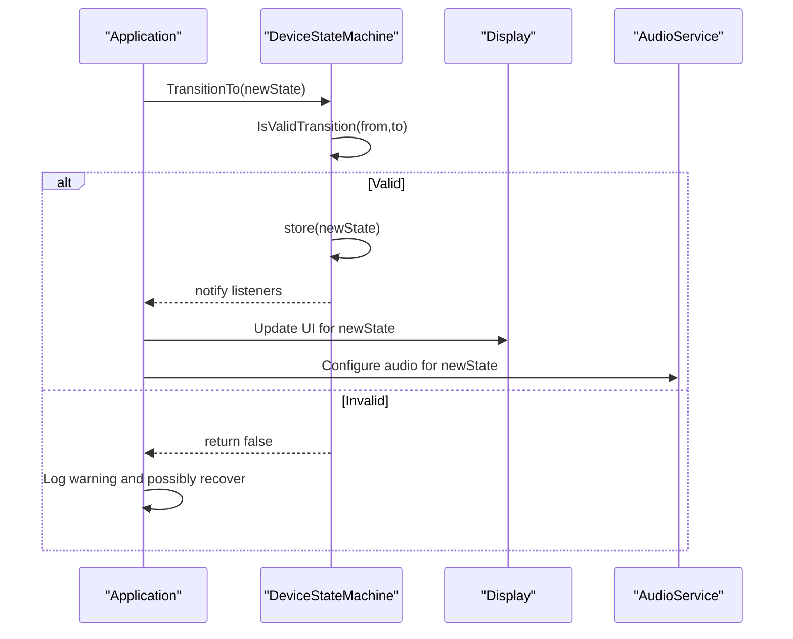
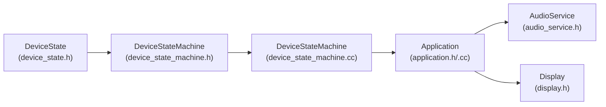
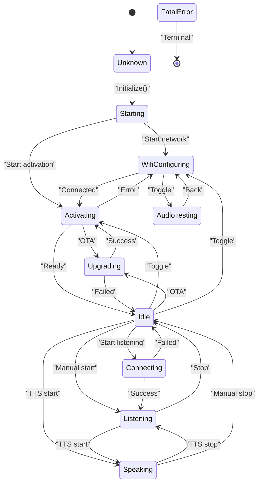

# Device State Machine

<cite>
**Referenced Files in This Document**
- [device_state.h](file://main/device_state.h)
- [device_state_machine.h](file://main/device_state_machine.h)
- [device_state_machine.cc](file://main/device_state_machine.cc)
- [application.h](file://main/application.h)
- [application.cc](file://main/application.cc)
- [audio_service.h](file://main/audio/audio_service.h)
- [display.h](file://main/display/display.h)
</cite>

## Table of Contents
1. [Introduction](#introduction)
2. [Project Structure](#project-structure)
3. [Core Components](#core-components)
4. [Architecture Overview](#architecture-overview)
5. [Detailed Component Analysis](#detailed-component-analysis)
6. [Dependency Analysis](#dependency-analysis)
7. [Performance Considerations](#performance-considerations)
8. [Troubleshooting Guide](#troubleshooting-guide)
9. [Conclusion](#conclusion)
10. [Appendices](#appendices)

## Introduction
This document provides a comprehensive guide to the device state machine implementation. It explains the state enumeration, transition logic, validation mechanisms, callbacks, error handling, recovery procedures, persistence and initialization sequences, shutdown handling, and the coordination between device states and system components such as audio processing, display updates, and network connectivity. It also covers the state machine’s role in complex operations like activation, listening modes, and emergency situations, along with thread-safety considerations, validation rules, debugging techniques, and practical examples for extending the state machine safely.

## Project Structure
The state machine resides in the main application domain and integrates tightly with the application lifecycle, audio service, and display subsystems. The core files are:
- Device state enumeration
- State machine class definition and implementation
- Application orchestration that triggers state transitions and reacts to state changes
- Audio service and display interfaces that reflect state-driven behavior

**Diagram sources**
- [device_state.h:4-16](file://main/device_state.h#L4-L16)
- [device_state_machine.h:17-81](file://main/device_state_machine.h#L17-L81)
- [application.h:42-177](file://main/application.h#L42-L177)
- [audio_service.h:106-204](file://main/audio/audio_service.h#L106-L204)
- [display.h:28-65](file://main/display/display.h#L28-L65)

**Section sources**
- [device_state.h:1-18](file://main/device_state.h#L1-L18)
- [device_state_machine.h:1-84](file://main/device_state_machine.h#L1-L84)
- [application.h:1-195](file://main/application.h#L1-L195)

## Core Components
- DeviceState enumeration defines all legal states the device can be in.
- DeviceStateMachine validates transitions and notifies observers upon state changes.
- Application coordinates initialization, event-driven state changes, and delegates UI and audio actions to subsystems.
- AudioService and Display adapt their behavior according to the current state.

Key responsibilities:
- State validation and immutability via atomic storage and mutex-protected listener management.
- Strict observer pattern for decoupled reactions to state changes.
- Event-driven orchestration in the main task loop to handle asynchronous conditions (network, audio, timers).

**Section sources**
- [device_state.h:4-16](file://main/device_state.h#L4-L16)
- [device_state_machine.h:17-81](file://main/device_state_machine.h#L17-L81)
- [device_state_machine.cc:34-131](file://main/device_state_machine.cc#L34-L131)
- [application.h:42-177](file://main/application.h#L42-L177)
- [application.cc:850-932](file://main/application.cc#L850-L932)

## Architecture Overview
The state machine is the central arbiter of device behavior. Transitions originate from the Application’s event loop and explicit calls, validated by the state machine, and propagate to listeners who update audio, display, and protocol states.

**Diagram sources**
- [device_state_machine.cc:108-131](file://main/device_state_machine.cc#L108-L131)
- [application.cc:850-932](file://main/application.cc#L850-L932)

## Detailed Component Analysis

### Device State Enumeration
The DeviceState enum enumerates all possible states. These include:
- Startup and configuration states: Unknown, Starting, WifiConfiguring, Activating
- Operational states: Idle, Connecting, Listening, Speaking
- Maintenance states: Upgrading, AudioTesting
- Terminal state: FatalError

These states form the nodes of the state machine graph and define the allowed transitions.

**Section sources**
- [device_state.h:4-16](file://main/device_state.h#L4-L16)

### DeviceStateMachine Implementation
Responsibilities:
- Atomic current state storage for thread-safe reads.
- Mutex-protected listener registry and notifications.
- Transition validation via a deterministic switch-based rule set.
- Logging of transitions for diagnostics.

Validation rules:
- Self-transitions are always allowed.
- From Unknown: only Starting is permitted.
- From Starting: WifiConfiguring or Activating.
- From WifiConfiguring: Activating or AudioTesting.
- From AudioTesting: back to WifiConfiguring.
- From Activating: Upgrading, Idle, or WifiConfiguring (error recovery).
- From Upgrading: Idle or Activating.
- From Idle: Connecting, Listening (manual), Speaking, Activating, Upgrading, WifiConfiguring.
- From Connecting: Idle (failure) or Listening (success).
- From Listening: Speaking or Idle.
- From Speaking: Listening or Idle.
- From FatalError: no transitions allowed.

Callbacks:
- Observers receive old_state and new_state.
- Notifications occur under a mutex-protected snapshot of listeners to avoid concurrent modification.

Thread-safety:
- Atomic state read/write.
- Mutex-protected listener mutation and notification snapshots.

Error handling:
- Invalid transitions log warnings and return false.
- FatalError blocks further transitions.

**Section sources**
- [device_state_machine.h:17-81](file://main/device_state_machine.h#L17-L81)
- [device_state_machine.cc:34-102](file://main/device_state_machine.cc#L34-L102)
- [device_state_machine.cc:108-131](file://main/device_state_machine.cc#L108-L131)
- [device_state_machine.cc:148-161](file://main/device_state_machine.cc#L148-L161)

### Application Orchestration and State Coordination
Initialization sequence:
- Sets initial state to Starting.
- Initializes display, audio, board callbacks, and network asynchronously.
- Adds a state change listener to trigger UI updates.

Main event loop:
- Handles network events, audio events, timers, and user actions.
- Triggers state transitions based on conditions (e.g., network connected, wake word detected, user toggles).

State-driven UI and audio behavior:
- On state changes, the Application updates Display and AudioService accordingly (status, emotion, audio processing enable/disable, wake word detection enable/disable, etc.).

Activation flow:
- On network connect, starts activation task that checks assets, firmware, and initializes protocol.
- Signals completion back to the main loop.

Listening modes:
- Manual vs. automatic listening modes influence audio processing and wake word detection behavior.

Emergency and recovery:
- Network disconnect closes audio channels and returns to Idle.
- Errors trigger alerts and return to Idle.
- FatalError is terminal; transitions are blocked.

Shutdown handling:
- Reboot sequence closes audio channels, resets protocol, stops audio, and restarts the system.

**Section sources**
- [application.cc:62-178](file://main/application.cc#L62-L178)
- [application.cc:180-276](file://main/application.cc#L180-L276)
- [application.cc:278-356](file://main/application.cc#L278-L356)
- [application.cc:850-932](file://main/application.cc#L850-L932)
- [application.cc:959-1022](file://main/application.cc#L959-L1022)
- [application.cc:1057-1072](file://main/application.cc#L1057-L1072)

### AudioService Integration
AudioService adapts to state changes:
- Enables/disables voice processing and wake word detection per state.
- Manages encode/send and decode/playback queues.
- Coordinates with protocol for audio channel open/close and sample rate alignment.

State-specific audio behavior:
- Idle: disable voice processing and wake word detection.
- Connecting: prepare UI and channel opening.
- Listening: enable voice processing, optionally enable wake word detection depending on configuration and listening mode.
- Speaking: disable voice processing (except AFE wake word detection), reset decoder.
- WifiConfiguring/Activating: disable audio processing and wake word detection.

**Section sources**
- [audio_service.h:106-204](file://main/audio/audio_service.h#L106-L204)
- [application.cc:850-932](file://main/application.cc#L850-L932)

### Display Integration
Display reacts to state changes:
- Updates status text, emotion, and chat messages.
- Shows notifications for network and system events.
- Reflects operational states with appropriate visuals.

**Section sources**
- [display.h:28-65](file://main/display/display.h#L28-L65)
- [application.cc:850-932](file://main/application.cc#L850-L932)

### State Change Callbacks and Observers
The state machine supports dynamic listeners:
- AddStateChangeListener returns a unique id for later removal.
- Notifications are dispatched under a mutex-protected snapshot to prevent concurrent modification.

Usage in Application:
- Adds a listener to signal the main loop on state changes.
- Uses listeners to trigger UI updates and audio configuration.

**Section sources**
- [device_state_machine.h:54-60](file://main/device_state_machine.h#L54-L60)
- [device_state_machine.cc:133-146](file://main/device_state_machine.cc#L133-L146)
- [device_state_machine.cc:148-161](file://main/device_state_machine.cc#L148-L161)
- [application.cc:103-106](file://main/application.cc#L103-L106)

### Error Handling During Transitions
- Invalid transitions are logged and ignored.
- Network errors trigger alerts and return to Idle.
- Protocol errors set an error event that the main loop handles.
- FatalError is terminal; no further transitions are permitted.

Recovery procedures:
- Network disconnect closes audio channels and returns to Idle.
- Activation failures return to previous stable state (e.g., Activating).
- Firmware upgrade failures restore audio service and continue operation.

**Section sources**
- [device_state_machine.cc:117-121](file://main/device_state_machine.cc#L117-L121)
- [application.cc:202-205](file://main/application.cc#L202-L205)
- [application.cc:303-314](file://main/application.cc#L303-L314)
- [application.cc:972-1022](file://main/application.cc#L972-L1022)

### Persistence, Initialization, and Shutdown
Persistence:
- The state machine stores the current state atomically; no persistent storage is implemented in the state machine itself. Persistence would require integrating with non-volatile storage and restoring state on boot.

Initialization:
- Application sets the initial state to Starting and performs asynchronous setup of display, audio, and network.
- Adds state change listener to keep UI synchronized.

Shutdown:
- Reboot sequence closes audio channels, resets protocol, stops audio, and restarts the system.

**Section sources**
- [device_state_machine.h:29](file://main/device_state_machine.h#L29)
- [application.cc:62-178](file://main/application.cc#L62-L178)
- [application.cc:959-970](file://main/application.cc#L959-L970)

### Relationship Between States and System Components
- Activation (Activating): Starts OTA asset/firmware checks and protocol initialization; transitions to Idle on completion.
- Listening: Enables voice processing and optionally wake word detection; manages popup sounds and emotion updates.
- Speaking: Disables voice processing except for AFE wake word detection; resets decoder.
- Upgrading: Temporarily disables audio processing and powers the device for performance during upgrades.
- WifiConfiguring/AudioTesting: Disables audio processing and wake word detection to isolate configuration/testing.

**Section sources**
- [application.cc:278-356](file://main/application.cc#L278-L356)
- [application.cc:850-932](file://main/application.cc#L850-L932)
- [application.cc:972-1022](file://main/application.cc#L972-L1022)

### Thread Safety Considerations
- Atomic state reads/writes ensure visibility across threads.
- Mutex protects listener registration/removal and notification dispatch.
- Event-driven design ensures UI and audio updates occur in the main task context.
- AudioService and Display APIs are designed to be called from the main task or via scheduled callbacks.

**Section sources**
- [device_state_machine.h:67-70](file://main/device_state_machine.h#L67-L70)
- [device_state_machine.cc:133-146](file://main/device_state_machine.cc#L133-L146)
- [application.cc:934-940](file://main/application.cc#L934-L940)

### Validation Rules and Debugging Techniques
Validation rules:
- Deterministic switch-based transitions enforce a strict state diagram.
- Self-transitions are allowed; invalid transitions are rejected.

Debugging techniques:
- Use GetStateName for logging state names.
- Monitor invalid transition warnings.
- Observe UI and audio behavior changes on state transitions.
- Utilize Application logs for network and protocol events.

**Section sources**
- [device_state_machine.cc:27-32](file://main/device_state_machine.cc#L27-L32)
- [device_state_machine.cc:117-121](file://main/device_state_machine.cc#L117-L121)
- [application.cc:180-276](file://main/application.cc#L180-L276)

### Extending the State Machine Safely
Adding a new state:
- Extend the DeviceState enum with the new state.
- Update the IsValidTransition method to define allowed transitions from existing states and to/from the new state.
- Add state-specific behavior in the Application’s state change handler to configure AudioService and Display appropriately.

Example extension steps:
- Add new enum value in [device_state.h:4-16](file://main/device_state.h#L4-L16).
- Add a new case in [device_state_machine.cc:40-102](file://main/device_state_machine.cc#L40-L102) to define transitions.
- Add UI/audio behavior in [application.cc:850-932](file://main/application.cc#L850-L932).

Best practices:
- Keep transitions minimal and consistent with system behavior.
- Ensure all states have clear entry/exit semantics.
- Add logging for new transitions.
- Test invalid transitions to ensure they are properly rejected.

**Section sources**
- [device_state.h:4-16](file://main/device_state.h#L4-L16)
- [device_state_machine.cc:40-102](file://main/device_state_machine.cc#L40-L102)
- [application.cc:850-932](file://main/application.cc#L850-L932)

## Dependency Analysis
The state machine depends on the DeviceState enum and is consumed by the Application. The Application orchestrates subsystems (AudioService, Display) based on state changes.

**Diagram sources**
- [device_state.h:4-16](file://main/device_state.h#L4-L16)
- [device_state_machine.h:17-81](file://main/device_state_machine.h#L17-L81)
- [device_state_machine.cc:1-162](file://main/device_state_machine.cc#L1-L162)
- [application.h:42-177](file://main/application.h#L42-L177)
- [application.cc:1-1133](file://main/application.cc#L1-L1133)
- [audio_service.h:106-204](file://main/audio/audio_service.h#L106-L204)
- [display.h:28-65](file://main/display/display.h#L28-L65)

**Section sources**
- [device_state.h:4-16](file://main/device_state.h#L4-L16)
- [device_state_machine.h:17-81](file://main/device_state_machine.h#L17-L81)
- [application.h:42-177](file://main/application.h#L42-L177)

## Performance Considerations
- Atomic state reads minimize contention.
- Mutex-protected listener operations are bounded by the number of registered listeners.
- Event-driven updates avoid busy-waiting and reduce CPU overhead.
- Audio queue sizes and frame durations are tuned for latency and throughput.

[No sources needed since this section provides general guidance]

## Troubleshooting Guide
Common issues and resolutions:
- Invalid state transition warnings: Verify the intended state order and ensure preconditions are met (e.g., network connected before activation).
- UI not updating: Confirm the state change listener is registered and the main loop processes state change events.
- Audio not responding: Check that voice processing is enabled in the current state and that the audio channel is open when required.
- Network disconnect causing unexpected state: Review the handling of network disconnects and audio channel closure.

**Section sources**
- [device_state_machine.cc:117-121](file://main/device_state_machine.cc#L117-L121)
- [application.cc:303-314](file://main/application.cc#L303-L314)
- [application.cc:850-932](file://main/application.cc#L850-L932)

## Conclusion
The device state machine provides a robust, validated foundation for device behavior. Its strict transition rules, observer-based notifications, and integration with audio and display subsystems enable reliable operation across complex workflows such as activation, listening, speaking, and upgrades. By adhering to the validation rules and following the extension guidelines, developers can safely introduce new states and transitions while maintaining system integrity.

[No sources needed since this section summarizes without analyzing specific files]

## Appendices

### State Transition Diagram

**Diagram sources**
- [device_state_machine.cc:40-102](file://main/device_state_machine.cc#L40-L102)